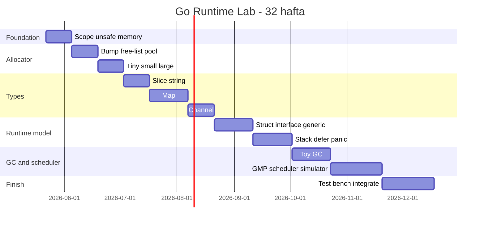

# 15. Timeline

Asos: kuniga 2-3 soat, haftada 5-6 kun.

| Hafta | Mavzu | Natija |
|-------|-------|--------|
| 1 | Scope, unsafe, GC qoidalari | `unsafe` checklist va kichik pointer mashqlar |
| 2 | Memory region | `mmap`/`munmap`, align, region tests |
| 3 | Bump allocator | `Alloc`, `Reset`, stats, benchmark |
| 4 | Free list allocator | split, coalesce, fragmentation tests |
| 5 | Pool, size class | fixed pool, size class table |
| 6 | Tiny/small/large allocator | unified allocator v1 |
| 7 | Debug allocator | canary, poison, double-free detection |
| 8 | Array/slice | custom array, slice, append/grow |
| 9 | String | immutable off-heap string, safe copy to Go string |
| 10 | Map v1 | chained + old bucket model |
| 11 | Map v2 | resize, evacuation, tombstone |
| 12 | Swiss table intro | 8-slot group, ctrl byte, probing |
| 13 | Channel v1 | buffered channel, ring buffer |
| 14 | Channel v2 | unbuffered, close, wait queue |
| 15 | Struct layout | padding, offset, `unsafe.Sizeof` bilan solishtirish |
| 16 | Interface model | eface, iface, itab simulator |
| 17 | Type descriptor/generics | runtime generic vector |
| 18 | Stack/heap model | frame stack, escape simulator |
| 19 | Defer model | LIFO defer, frame defers |
| 20 | Panic/recover model | unwind, recover rules |
| 21 | GC v1 | manual roots, object header, mark-sweep |
| 22 | GC v2 | pointer mask, tri-color model |
| 23 | GC v3 | write barrier, incremental step, mark assist |
| 24 | GMP v1 | G/M/P structs, cooperative scheduler |
| 25 | GMP v2 | local/global queue, work stealing |
| 26 | GMP v3 | park/unpark, syscall simulator |
| 27 | GMP v4 | preemption budget, timer/netpoll mini model |
| 28 | Integration | channel + scheduler, allocator + GC |
| 29 | Testing/fuzzing | fuzz map/slice, stress channel/scheduler |
| 30 | Benchmark/profiling | benchstat, pprof, trace |
| 31 | Final demo | mini runtime lab demo |
| 32 | Review | docs, diagrams, source reading |

## Diagram

