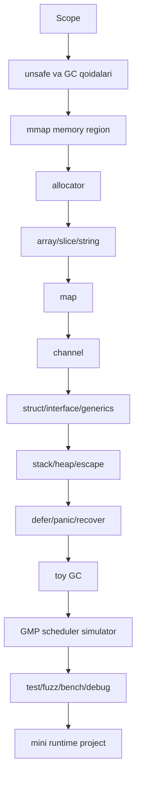

# Go Runtime Lab

Maqsad: Go runtime ichki mexanizmlarini Go tilida, o'quv laboratoriyasi sifatida qayta qurish.

Bu loyiha Go runtime'ni almashtirmaydi. Sizning dasturingizni baribir Go compiler, Go scheduler va Go GC boshqaradi. Biz qiladigan ish: `unsafe`, `mmap`, `sync/atomic`, test va benchmarklar yordamida off-heap memory ustida Go runtime konseptlarini modellashtirish.

## O'qish Tartibi

| # | Fayl | Mavzu |
|---|------|-------|
| 0 | [00_scope.md](00_scope.md) | Chegara, maqsad, nima qilamiz va nima qilmaymiz |
| 1 | [01_prerequisites.md](01_prerequisites.md) | Go, OS, memory, compiler old shartlari |
| 2 | [02_unsafe_gc_rules.md](02_unsafe_gc_rules.md) | `unsafe`, GC, `uintptr`, `KeepAlive`, off-heap qoidalar |
| 3 | [03_memory_region.md](03_memory_region.md) | `mmap`, page, guard page, region API |
| 4 | [04_allocator.md](04_allocator.md) | bump, free list, tiny/small/large allocator |
| 5 | [05_array_slice_string.md](05_array_slice_string.md) | array, slice, string header va growth |
| 6 | [06_map.md](06_map.md) | old bucket model va Swiss Table model |
| 7 | [07_channel.md](07_channel.md) | buffered/unbuffered channel, close, wait queue |
| 8 | [08_struct_interface_generics.md](08_struct_interface_generics.md) | struct layout, interface, type descriptor, generics modeli |
| 9 | [09_stack_heap_escape.md](09_stack_heap_escape.md) | stack, heap, escape analysis, mini frame stack |
| 10 | [10_defer_panic_recover.md](10_defer_panic_recover.md) | defer list, panic unwind, recover qoidalari |
| 11 | [11_gc.md](11_gc.md) | toy GC: mark-sweep, tri-color, write barrier |
| 12 | [12_gmp_scheduler.md](12_gmp_scheduler.md) | GMP scheduler simulator: G, M, P, queues, work stealing |
| 13 | [13_testing_benchmark_debug.md](13_testing_benchmark_debug.md) | unit, fuzz, race, checkptr, pprof, trace |
| 14 | [14_projects.md](14_projects.md) | amaliy loyihalar |
| 15 | [15_timeline.md](15_timeline.md) | 32 haftalik reja |
| 16 | [16_checklist.md](16_checklist.md) | tekshirish ro'yxati |
| 17 | [17_resources.md](17_resources.md) | asosiy manbalar |

## Tavsiya Qilingan Ketma-ketlik



## Birinchi Amaliy Maqsad

Birinchi milestone:

```go
region, _ := memory.MmapRegion(64 << 20)
defer region.Close()

alloc := allocator.NewBump(region)
p := alloc.Alloc(24, 8)
alloc.Free(p, 24)
```

Bu kod tugamaguncha slice, map yoki channelga o'tmang. Runtime mexanizmlari xotiradan boshlanadi.
