# 6. Trace: Vaqt chizig'i va ichki tuzilishi

> Go execution tracer — dasturingiz ishlash jarayonida goroutine, GC, scheduler kabi hodisalarni nanosaniya aniqligida yozib oluvchi vosita.

## Kirish

O'rnatilgan profaylerlar (profiler) sizga juda ko'p runtime ma'lumotlarini beradi. Lekin bu vositalar ko'pincha faqat **qisqacha xulosa** yoki **statik suratni** ko'rsatadi. Bu dasturchi uchun Go dasturining vaqt davomida qanday o'zgarishini ko'rishni qiyinlashtiradi.

Masalan, profayler shunday deyishi mumkin:

> Xotira ajratishlarning (allocation) 90% i server.go ning 35-qatorida sodir bo'lmoqda

Bu sizga xotira bosimining **qayerdan** boshlanganini aytadi, lekin qaysi goroutine ajratishni amalga oshirganini, **qachon** sodir bo'lganini yoki shu paytda dasturda yana **nima bo'layotganini** ko'rsatmaydi.

Go'da yetishmayotgan narsa — ijro etilishning (execution) dinamik va batafsil ko'rinishi, jumladan hodisalarning aniq vaqti edi.

**Go execution tracer** aynan shu maqsadda yaratilgan. Tracer dasturingiz ishlayotganda hodisalar vaqt chizig'ini (timeline) taqdim etadi va goroutine xatti-harakati haqida chuqur savollarga javob berishga yordam beradi:

- Bu goroutine aslida **qachon** ishladi?
- Bloklanishdan oldin **qancha vaqt** ishladi?
- Uni bloklanishga **nima** sabab bo'ldi?
- Qaysi boshqa goroutine yoki hodisa uni **blokdan chiqardi**?
- Axlat yig'ish (garbage collection) bu goroutine ning ijro oqimiga qanday **ta'sir qildi**?

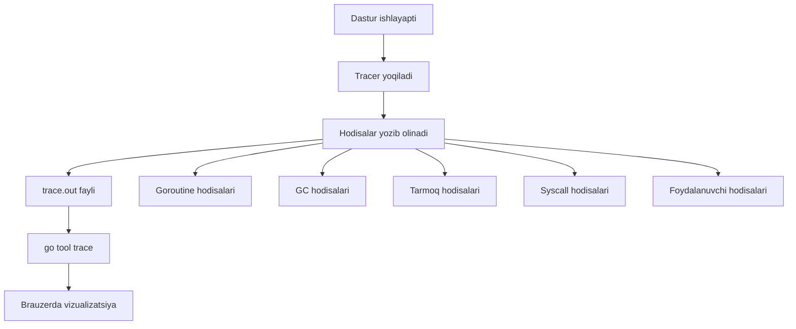

Execution tracer bilan siz goroutine ning to'liq hayot siklini (lifecycle) kuzatishingiz mumkin. Masalan, veb serveringiz har bir so'rov uchun yangi goroutine ishga tushiradi:

```go
go handleConnection(conn)
```

Tracing bilan siz `handleConnection` **qachon boshlangan**, I/O kutishga **qancha vaqt sarflagan**, scheduler uni **qanchalik tez-tez to'xtatgan** va u **mutex yoki kanalda bloklangan**mi — bularning hammasini ko'rishingiz mumkin.

Tracing har bir Go binary ichiga o'rnatilgan va testlash vaqtida, HTTP endpoint orqali yoki to'g'ridan-to'g'ri kodda yoqilishi mumkin. Tracing o'chirilgan bo'lsa, u dastur ishlashiga deyarli ta'sir qilmaydi.

## Asosiy g'oya

Tracingni yoqsangiz, Go runtime dasturingiz ishlayotganda bir qator hodisalarni yozib olishni boshlaydi. Bu hodisalar asosiy runtime faoliyatlarini ko'rsatadi va har biri **nanosekundgacha** aniqlikda vaqt belgisi (timestamp) bilan belgilanadi.

Har bir hodisa shuningdek hodisa turini, OS thread ID, mantiqiy protsessor (logical processor) ID, goroutine ID, stek izi (stack trace) va kontekstga qarab boshqa maydonlarni ham yozib oladi.

> Go'da "protsessor" (processor) so'zi `GOMAXPROCS` tomonidan belgilangan mantiqiy birlikni anglatadi. Bu bir vaqtda ishlay oladigan goroutinelarning **maksimal soni** — fizik CPU yadrolarining soni emas.

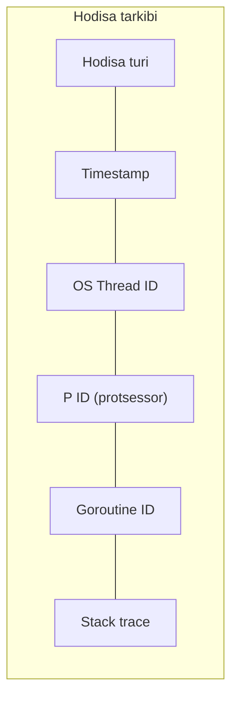

### Tracer yozib oladigan hodisa turlari

| Hodisa turi | Tavsifi |
|---|---|
| **Scheduling** | Goroutinelar qachon ishga tushirilgan, bloklangan, blokdan chiqarilgan yoki tugatilgan |
| **Tarmoq** (Network) | Goroutinelar tarmoq I/O da qachon bloklangan yoki davom etgan |
| **Tizim chaqiruvlari** (Syscall) | Goroutinelar syscall ga qachon kirgan yoki undan chiqqan |
| **Axlat yig'ish** (GC) | GC qachon boshlangan va tugagan, jumladan sweeping kabi bosqichlar |
| **Foydalanuvchi hodisalari** | Maxsus kuzatish uchun trace ga qo'shishingiz mumkin bo'lgan hodisalar va loglar |

## Tracingni yoqish (go test, HTTP, kod)

### 1-usul: go test bilan

Test yoki benchmark ishlayotganda trace yig'ish uchun eng yaxshi usul:

```go
// Terminal buyrug'i
// go test -trace=trace.out -bench=. -benchtime=10s -cpu=16
```

Bu trace ni `trace.out` fayliga saqlaydi. Keyin uni `go tool trace` bilan tahlil qilishingiz mumkin.

### 2-usul: HTTP endpoint orqali

Allaqachon ishlayotgan ilovalar (masalan, serverlar) uchun `/debug/pprof/trace` HTTP handler orqali tracingni ishga tushirishingiz mumkin:

```bash
curl http://localhost:6060/debug/pprof/trace?seconds=5 > trace.out
```

### 3-usul: Dasturiy API orqali

Eng moslashuvchan (flexible) usul — `runtime/trace` paketi orqali:

```go
func main() {
    // Trace chiqish faylini yaratamiz
    f, err := os.Create("trace.out")
    if err != nil {
        log.Fatal(err)
    }
    defer f.Close()

    // Tracingni boshlaymiz
    if err := trace.Start(f); err != nil {
        log.Fatal(err)
    }
    defer trace.Stop()

    // Sizning mantiqingiz shu yerda
    // ...
}
```

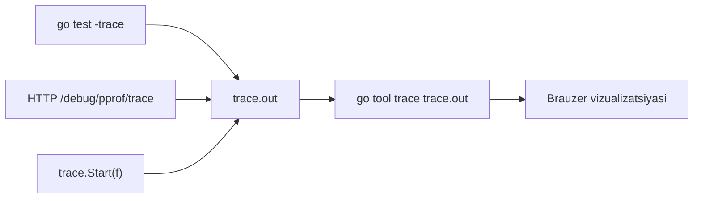

### Batafsil xotira tracesi

Odatda tracing xotira haqida ko'p ma'lumot beradi — GC qachon ishlaydi, heap o'lchami qanday o'zgaradi va h.k. Agar yanada **batafsil** ma'lumot kerak bo'lsa, muhit o'zgaruvchisini (environment variable) o'rnatishingiz mumkin:

```
GODEBUG=traceallocfree=1
```

Bu qo'shimcha uchta hodisa guruhini yoqadi:

| Hodisa guruhi | Tavsifi |
|---|---|
| **Heap span hodisalari** | Runtime xotira sahifalarini qanday boshqarishi. Har bir span odatda bir nechta sahifani qamrab oladi (ko'pincha har biri 8KB) |
| **Heap obyekt hodisalari** | Dasturingiz heap obyektini har safar ajratishi (malloc) yoki bo'shatishi (free) |
| **Goroutine stek hodisalari** | Goroutinelar uchun stek o'sishi va bo'shatilishi |

> **Ogohlantirish:** Bu batafsil tracingni oddiy profaylash uchun ishlatmang — u dasturingizni **juda sekinlashtiradi**. Bu hali tajribaviy (experimental) xususiyat bo'lib, juda ko'p ma'lumot yaratadi.

## Tracelarni vizualizatsiya qilish

### Protsessorga yo'naltirilgan ko'rinish (Proc View)

Trace viewer dagi "proc view" — asosiy vizualizatsiya usullaridan biri. Bu ko'rinish mantiqiy protsessorlar (P) bo'yicha saralangan hodisalar vaqt chizig'ini ko'rsatadi.

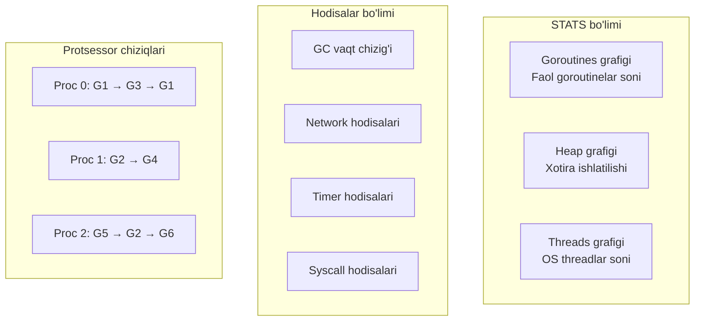

#### STATS bo'limi (tepada)

Uchta muhim vaqt seriyali grafik:

- **Goroutines grafigi** — vaqt davomida faol goroutinelar soni. Istalgan nuqtani bossangiz, o'sha lahzadagi goroutine holatlari taqsimotini ko'rasiz: qanchasi ishlayapti (running), qanchasi ishga tayyor (runnable), qanchasi kutayapti (waiting)
- **Heap grafigi** — xotira ishlatilishi. To'q sariq chiziq — jami heap ajratish (baytlarda). Yashil chiziq — GC chegarasi (keyingi axlat yig'ish sikli qachon boshlanishini belgilaydi)
- **Threads grafigi** — Go faol deb hisoblagan OS threadlar soni

#### Hodisalar bo'limi

- **GC** — axlat yig'ish qachon sodir bo'layotgani va qaysi bosqichda (mark yoki sweep)
- **Network** — tarmoq faoliyati sababli goroutinelar qachon uyg'otilgani
- **Timers** — `time.Sleep()` yoki `time.After()` tugagandan keyin goroutinelar qachon uyg'otilgani
- **Syscalls** — bloklangan tizim chaqiruvlaridan goroutinelar qachon qaytgani

> **TimerP** va **SyscallP** nima?
> Har bir vertikal "yo'lak" raqamli P-ID bilan belgilangan. Haqiqiy P-IDlar 0 dan `GOMAXPROCS-1` gacha raqamlangan. Lekin ba'zan runtime hech qanday haqiqiy P ga bog'lanmagan hodisani yozib olishi kerak. Shuning uchun runtime bir nechta maxsus "psevdo" protsessor IDlarni yaratadi:
> - **TimerP** — taymer bilan bog'liq uyg'otishlar uchun
> - **SyscallP** — bloklangan tizim chaqiruvidan qaytayotgan goroutinelar uchun

#### Protsessor chiziqlari

Asosiy qism — "Proc 0", "Proc 1" kabi belgilangan vaqt chiziqlari. Har biri mantiqiy protsessorni ifodalaydi. Har bir protsessor bir vaqtning o'zida **faqat bitta** goroutine ishga tushira oladi.

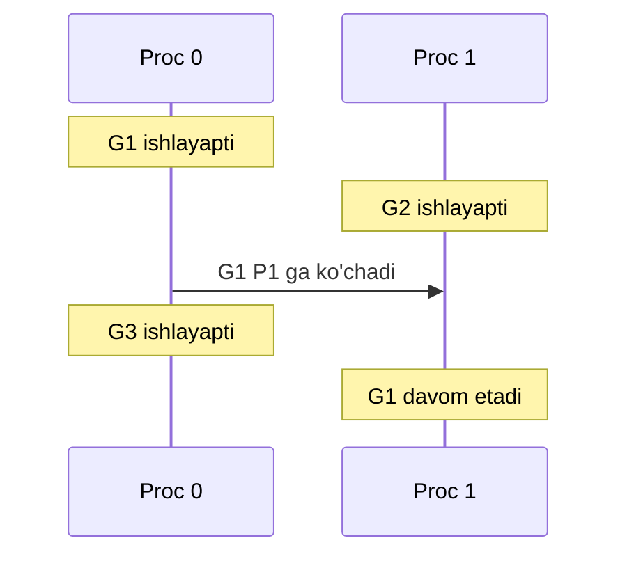

- **Rangli gorizontal chiziqlar** — goroutinelar qachon ishlayotganini ko'rsatadi. Har bir goroutine o'z rangi va yorlig'iga ega ("G1", "G2")
- Goroutine **boshqa protsessorga ko'chganda**, uning rangli chizig'i yangi protsessor yo'lagida davom etadi
- Har bir ijro chizig'i ostida goroutine hayot siklidagi hodisalarni ko'rsatuvchi kichik belgilar bo'lishi mumkin

Istalgan ijro chizig'ini bossangiz, batafsil ma'lumotni ko'rasiz:
- Davomiylik qancha bo'lgani
- Goroutine to'xtaganda yoki vaqtini bergandagi stek izi
- Goroutine ishlashni to'xtatishiga nima sabab bo'lgani

### Threadga yo'naltirilgan ko'rinish (Thread View)

OS threadlari — operatsion tizim boshqaradigan haqiqiy ijro birliklari. `http://[::]:<port>/trace?view=thread` sahifasida har bir qator endi mantiqiy protsessor o'rniga **OS threadni** ifodalaydi.

Odatda threadlar soni `GOMAXPROCS` bilan belgilangan mantiqiy protsessorlar soniga yaqin yoki biroz yuqori bo'ladi. Agar dasturingiz juda ko'p thread yaratsa, ishlash **ancha yomonlashadi**.

## Goroutine tahlil vositalari

`/goroutines` sahifasida goroutine xatti-harakatining taqsimoti ko'rsatiladi. Goroutinelar boshlang'ich joyi (odatda goroutine yaratilgan funksiya nomi) bo'yicha guruhlangan.

Har bir qator ko'rsatadi:
1. **Boshlang'ich joyi** — goroutine qaerda boshlangan (funksiya nomi)
2. **Soni** — bu guruhdagi goroutinelarning umumiy soni
3. **Jami ijro vaqti** — bu guruhdagi barcha goroutinelar kod ishlatishga sarflagan umumiy vaqt

### Breakdown bo'limi

Goroutine vaqtini sarflagan turli holatlarni ko'rsatadi:

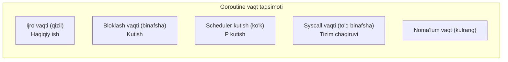

| Holat | Rang | Tavsifi |
|---|---|---|
| **Ijro vaqti** (Execution) | Qizil | Goroutine aslida protsessorda ishlayotgan va tayinlangan ishini bajarayotgan foydali vaqt |
| **Bloklash vaqti** (Block) | Binafsha | Goroutine qancha vaqt bloklangani, sababi bo'yicha taqsimlangan (kanal, mutex va h.k.) |
| **Syscall bloklash** | - | Goroutine bloklangan tizim chaqiruvi tufayli P ni berishi kerak bo'lgan vaqt |
| **Scheduler kutish** | Ko'k | Goroutine ishga tayyor, lekin mavjud protsessorlar yo'q — P kutayotgan vaqt |
| **Syscall ijrosi** | To'q binafsha | Goroutine P ga ega bo'lgan holda tizim chaqiruvi kodini ishlatayotgan vaqt |
| **Noma'lum vaqt** | Kulrang | Boshqa kategoriyalarga kirmagan vaqt |

### Maxsus oraliqlar (Special Ranges)

Goroutinelar ma'lum runtime faoliyatlarida qatnashgan davrlarni ko'rsatadi (asosan axlat yig'ish bilan bog'liq):

- **GC mark assist** — goroutine axlat yig'uvchiga obyektlarni belgilashda yordam bergan vaqt
- **GC incremental sweep** — belgilash bosqichidan keyin xotirani tozalashga sarflangan vaqt
- **Stop-the-world bosqichlari** — GC yoki boshqa runtime hodisalari vaqtida goroutine to'xtatilgan davrlar
- **GC concurrent mark** — goroutine ishlayotgan paytda axlat yig'uvchi ham bir vaqtda obyektlarni belgilayotgan vaqt

> **Muhim:** Bu faoliyatlar bir-biriga **o'xshashi** (overlap) mumkin. Goroutine bir vaqtning o'zida ham kod ishlatishi (Breakdown da "Ijro vaqti"), ham axlat yig'ishga yordam berishi (Special Ranges da "GC mark assist") mumkin.

## Tracelardan yaratilgan profillar

Go execution trace 4 ta maxsus profil turini qo'llab-quvvatlaydi. Bu profillar odatiy pprof profillaridan farqli — ular runtime namunalashi (sampling) emas, balki trace ichidagi **holat o'zgarishlari va hodisalarni tahlil qilish** orqali yaratiladi.

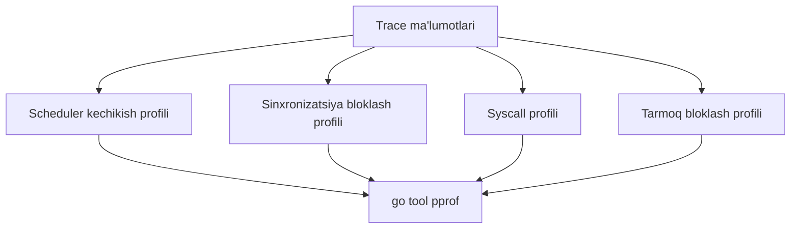

| Profil | Nimani o'lchaydi |
|---|---|
| **Scheduler kechikish** (latency) | Goroutine ishga tayyor bo'lishi (runnable) va aslida ishlashni boshlashi orasidagi kechikish |
| **Sinxronizatsiya bloklash** (sync) | Goroutinelar kanal, mutex, WaitGroup va boshqa sync primitivlarida kutgan vaqti |
| **Syscall** | Tizim chaqiruvlarini kutishga sarflangan vaqt |
| **Tarmoq bloklash** (network) | Tarmoq I/O operatsiyalarida kutish vaqti |

### Misol: Scheduler kechikish profili

`runtime.chansend1` — Go runtime kanal yuborish bloklangan paytda ishlatiladigan funksiya:

```go
ch <- v // buferlanmagan yoki to'lgan kanalga yuborish
```

Agar qabul qiluvchi (receiver) tayyor bo'lmasa, yuboruvchi goroutine "park qilinadi" va davom eta olmaydi. Qabul qiluvchi kelganda, runtime yuboruvchini uyg'otadi va uni ishga tushirish navbatiga (run queue) qo'yadi.

> **Muhim:** Bu bitta goroutine 42 soniya to'xtab turdi degani emas. Buning o'rniga, bu **minglab yoki millionlab** juda qisqa to'xtashlar (ko'pincha mikrosekundlar yoki millisekundlar). Trace bularning hammasini jamlaydi chunki ular bir xil kanal yuborish joyida sodir bo'lgan.

## Semantika qo'shish: Vazifalar, Hududlar, Loglar

Tracing juda ko'p past darajadagi runtime ma'lumotlarini yig'adi. Lekin runtime ko'ra olgan narsa va siz dasturchi sifatida aslida **nima haqida qayg'urayotganingiz** o'rtasida katta **bo'shliq** bor.

Masalan, veb server trace ni ko'rsangiz, minglab goroutine yaratilishi, tarmoq I/O hodisalari, xotira ajratishlarini topishingiz mumkin. Lekin oddiy savollarga javob berish deyarli mumkin emas:

- Qaysi goroutinelar **bitta HTTP so'rovni** ko'rib chiqqan?
- Ma'lum bir foydalanuvchining buyurtmasini qayta ishlash **qancha vaqt** oldi?
- Qaysi ma'lumotlar bazasi so'rovlari **bitta tranzaksiya** ning qismi edi?

**Foydalanuvchi annotatsiyalari** (user annotations) — semantik qatlam bo'lib, ilovangiz mantiqini runtime trace bilan bog'lash imkonini beradi. 3 turdagi semantik ma'lumot qo'shishingiz mumkin:

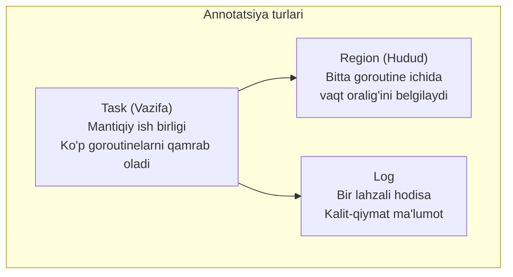

### Task (Vazifa)

Vazifalar — ko'p goroutinelarni o'z ichiga olishi mumkin bo'lgan mantiqiy ish birliklari. Masalan, "HTTP so'rovni qayta ishlash" yoki "ma'lumotlar bazasi tranzaksiyasini bajarish".

Vazifa tizimi **iyerarxiyani** qo'llab-quvvatlaydi — vazifalar ota-bola munosabatlariga ega bo'lishi mumkin:

```go
ctx, task := trace.NewTask(parentCtx, "processRequest")
defer task.End()
```

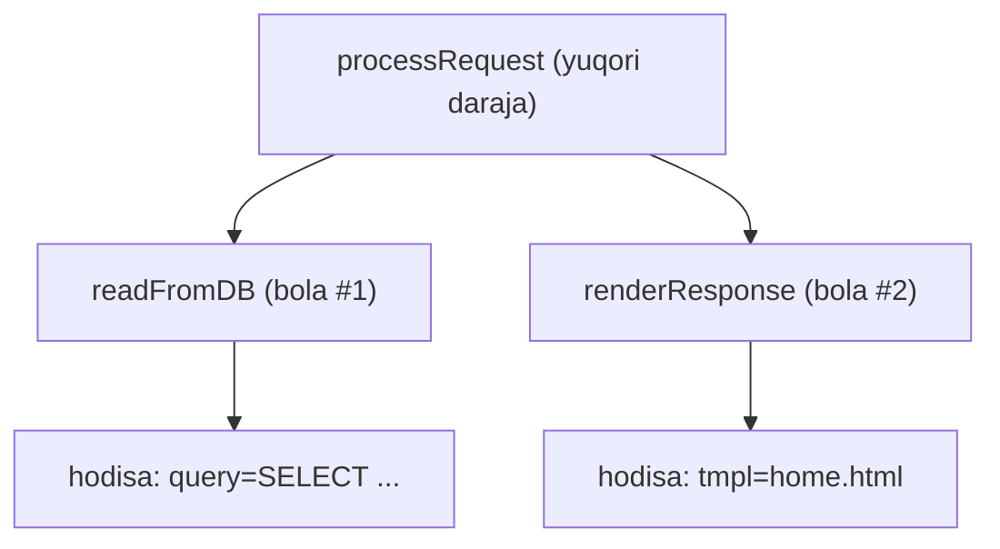

Vazifa tizimining eng foydali xususiyatlaridan biri — **avtomatik kechikish o'lchash**. Tracer vazifa yaratilishi va `End` chaqirilishi orasidagi vaqtni kuzatadi.

### Region (Hudud)

Hududlar bitta goroutine ijrosi ichida **aniq vaqt oraliqlarini** belgilash uchun mo'ljallangan.

Vazifalardan farqli o'laroq, hududlar har doim **bitta goroutine** ichida boshlanishi va tugashi kerak.

**1-usul: WithRegion** (oddiy va xavfsiz):

```go
trace.WithRegion(ctx, "databaseQuery", func() {
    // Hudud ichida — bu yerda bo'lgan hamma narsa o'lchanadi
    result, err := db.Query("SELECT * FROM users")
    // ... natijani qayta ishlash
})
```

**2-usul: StartRegion** (ko'proq nazorat):

```go
region := trace.StartRegion(ctx, "fileProcessing")
defer region.End()

// Sizning kodingiz
file, err := os.Open("data.txt")
if err != nil {
    return err
}
// ... faylni qayta ishlash
```

`WithRegion` oson va xavfsiz, lekin murakkab kod uchun cheklangan bo'lishi mumkin. `StartRegion` ko'proq moslashuvchanlik beradi, lekin har doim `End` chaqirishga e'tibor berish kerak.

### Log

Loglar vazifalar va hududlardan farq qiladi — ular **bir lahzali hodisani** qayd etadi va ijro davomida kontekst beradi. Davomiylikni kuzatmaydi, faqat lahzalar yoki holat ma'lumotini yozadi:

```go
trace.Log(ctx, "cache", "cache miss for key: " + key)
trace.Logf(ctx, "performance", "query took %v milliseconds", duration.Milliseconds())
```

### To'liq misol

```go
func main() {
    // Trace faylini yaratamiz va tracingni boshlaymiz
    f, err := os.Create("trace.out")
    if err != nil {
        log.Fatalf("Trace fayl yaratib bo'lmadi: %v", err)
    }
    defer f.Close()
    if err := trace.Start(f); err != nil {
        log.Fatalf("Tracingni boshlab bo'lmadi: %v", err)
    }
    defer trace.Stop()

    // Ildiz vazifani yaratamiz
    ctx := context.Background()
    ctx, rootTask := trace.NewTask(ctx, "rootTask")
    defer rootTask.End()

    // 10 ta parallel so'rovni simulyatsiya qilamiz
    var wg sync.WaitGroup
    for i := 0; i < 10; i++ {
        wg.Add(1)
        go func(reqID int) {
            defer wg.Done()
            handleRequest(ctx, reqID)
        }(i)
        time.Sleep(time.Millisecond * 10)
    }
    wg.Wait()
}

func handleRequest(ctx context.Context, requestID int) {
    // Har bir so'rov o'z vazifasini yaratadi
    ctx, task := trace.NewTask(ctx, "handleRequest")
    defer task.End()
    trace.Log(ctx, "request", fmt.Sprintf("so'rov %d boshlandi", requestID))

    // Validatsiya — hudud bilan o'lchaymiz
    trace.WithRegion(ctx, "requestValidation", func() {
        time.Sleep(time.Millisecond * time.Duration(rand.Intn(5)+1))
    })

    // 3 ta parallel ma'lumotlar bazasi so'rovi
    var wg sync.WaitGroup
    results := make(chan string, 3)
    for i := range 3 {
        wg.Add(1)
        go func(queryID int) {
            defer wg.Done()
            trace.WithRegion(ctx, fmt.Sprintf("query-%d", queryID), func() {
                result := dbQuery(ctx, requestID*10+queryID)
                results <- result
                trace.Log(ctx, "result", result)
            })
        }(i)
    }

    // Natijalarni qayta ishlash
    go func() { wg.Wait(); close(results) }()
    trace.WithRegion(ctx, "processResults", func() {
        for result := range results {
            time.Sleep(time.Millisecond * time.Duration(rand.Intn(5)+1))
            trace.Logf(ctx, "processing", "qayta ishlandi %s", result)
        }
    })
}

func dbQuery(ctx context.Context, id int) string {
    defer trace.StartRegion(ctx, "dbQuery").End()
    trace.Log(ctx, "query", fmt.Sprintf("id=%d", id))

    // Ulanish simulyatsiyasi
    trace.WithRegion(ctx, "dbConnect", func() {
        time.Sleep(time.Millisecond * time.Duration(rand.Intn(300)))
    })
    // So'rov simulyatsiyasi
    time.Sleep(time.Millisecond * time.Duration(rand.Intn(200)))
    return fmt.Sprintf("natija-%d", id)
}
```

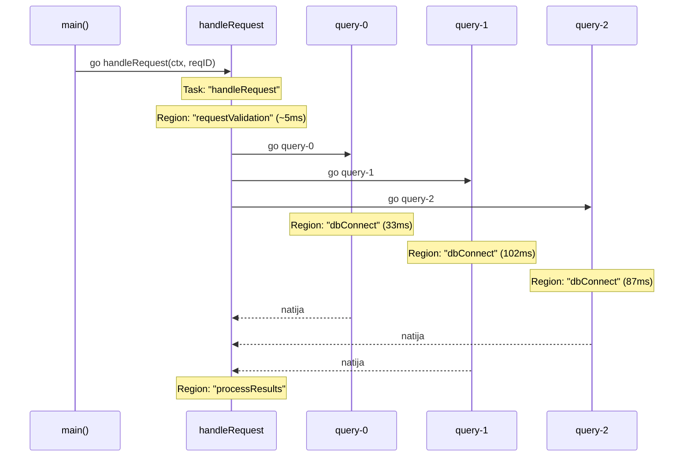

> **OpenTelemetry bilan farqi:** Go tracing va OpenTelemetry juda farqli vositalar. Go tracing vazifalaringiz va past darajadagi runtime hodisalari o'rtasidagi aloqalarni ko'rsatadi — OpenTelemetry buni ko'ra olmaydi. OpenTelemetry xizmatlar orasidagi so'rov oqimlarini ko'rsatishda yaxshi, lekin Go tracing Go runtime ichida **nima bo'layotganini** ko'rsatadi.

## Ichki tuzilishi (Under the Hood)

> Bu bo'limni tushunish shart emas — agar xohlasangiz, o'tkazib yuborishingiz mumkin.

### Buferlash va avlodlar (Generations)

Go tracing tizimining markazida hamma narsani boshqaradigan global `trace` obyekti bor:

```go
var trace struct {
    reading       *traceBuf
    empty         *traceBuf          // Bo'sh buferlar ro'yxati
    full          [2]traceBufQueue   // Tayyor buferlar navbati
    workAvailable atomic.Bool

    readerGen  atomic.Uintptr  // O'quvchi hozir o'qiyotgan avlod
    flushedGen atomic.Uintptr  // Oxirgi tugallangan avlod
    gen        atomic.Uintptr  // Joriy avlod
}

type traceBufQueue struct {
    head, tail *traceBuf  // Bog'langan ro'yxat
}
```

Bu buferlar **global** — tizim bo'ylab umumiy va bitta goroutine yoki threadga bog'lanmagan. Lekin umumiy buferlarga to'g'ridan-to'g'ri yozish juda ko'p **raqobat** (contention) yaratadi. Shuning uchun har bir thread ikkita **shaxsiy** 64 KB trace buferni saqlaydi:

```go
type mTraceState struct {
    seqlock atomic.Uintptr
    buf     [2]*traceBuf // Navbatma-navbat avlodlar uchun ikkita bufer
    link    *m
}

type traceBuf struct {
    _   sys.NotInHeap
    traceBufHeader
    arr [64<<10 - unsafe.Sizeof(traceBufHeader{})]byte // 64 KB
}
```

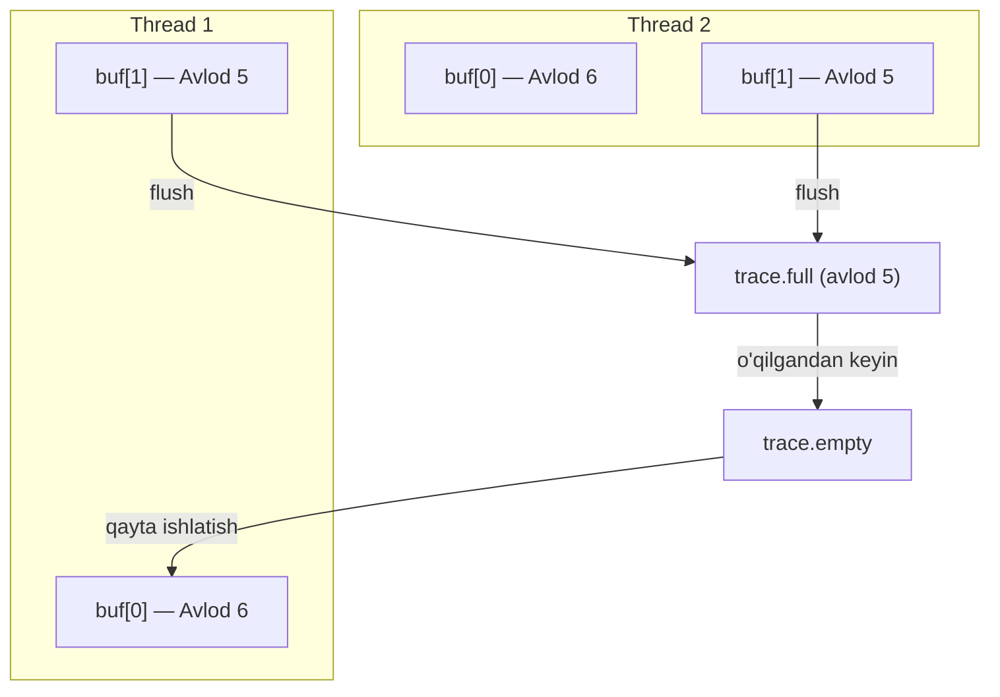

**Nega har bir threadda ikkita bufer?** Tracing tizimi **avlodlar** (generations) ga bo'lingan. Har bir avlod o'z trace ma'lumotlarini alohida saqlaydi.

Ma'lum vaqtdan keyin (odatda bir soniya) Go tracer avlodni tugatadi (masalan, avlod 5). Barcha threadlar avlod 5 buferiga yozishni to'xtatish va avlod 6 uchun yangi buferga o'tish haqida xabardor qilinadi. Endi o'quvchi (reader) avlod 5 ma'lumotlarini xavfsiz o'qishi mumkin.

Bu 3 ta asosiy foyda beradi:
1. Yozuvchilar va o'quvchi **hech qachon** bir xil ma'lumotga bir vaqtda kirmaydiar
2. Xotirani qachon qayta ishlatish mumkinligini har doim bilamiz
3. O'quvchi har doim to'liq va tugallangan hodisalar to'plamini oladi

### Trace Locker (Trace qulfi)

Har bir thread **ketma-ketlik qulfi** (seqlock) ga ega — oddiy atomik hisoblagich:

```go
type mTraceState struct {
    seqlock atomic.Uintptr // bu thread trace buferga yozayotganini bildiradi
    buf     [2]*traceBuf
    link    *m
}
```

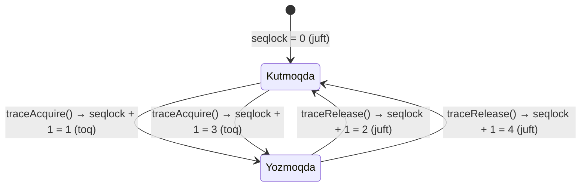

- **Toq** seqlock → "bu thread hozir trace hodisalarini yozayapti"
- **Juft** seqlock → "bu thread hozir yozmayapti"

Yangi avlodga o'tishda tracer har bir threadning seqlock ni tekshiradi. Agar juft bo'lsa — thread yangi avlodga o'tgan, eski buferni xavfsiz qayta ishlash mumkin. Agar toq bo'lsa — thread hali yozayapti, tracer kutadi:

```go
for mToFlush != nil {
    prev := &mToFlush
    for mp := *prev; mp != nil; {
        if mp.trace.seqlock.Load()%2 != 0 {
            // Thread yozayapti. Keyinroq qaytamiz.
            continue
        }
        // ... buferni flush qilish
    }
    if mToFlush != nil {
        osyield() // Boshqa threadlarga vaqt beramiz
    }
}
```

### Trace Writer (Trace yozuvchi)

Trace writer — trace qulfi va bufer boshqaruvi o'rtasidagi ko'prik:

```go
type traceWriter struct {
    traceLocker
    *traceBuf
}
```

U **fluent API** naqshini ishlatadi — har bir metod yangi trace writer nusxasini qaytaradi:
```go
statusWriter.flush().end()
```

### Hodisa yozish quvuri (Event Pipeline)

#### STW Bootstrap

Tracing `StartTrace()` orqali boshlaganda, tizim holatini qayta o'rnatish va boshlang'ich runtime holatini yozib olish uchun **dunyoni to'xtatish** (Stop-The-World / STW) talab qilinadi.

Xavfli senariy: goroutine tracing yoqilishidan **oldin** `traceAcquire()` ni chaqiradi va noto'g'ri (invalid) locker oladi. Keyin tracing yoqiladi. Endi trace **nomuvofiq** bo'lishi mumkin.

STW bu muammoni yo'q qiladi — dunyo qayta boshlaganda, har bir goroutine ning keyingi `traceAcquire()` chaqiruvi to'g'ri locker qaytaradi.

#### Hodisa turlari

```go
const (
    // Protsessor hodisalari
    traceEvProcsChange  // GOMAXPROCS ning joriy qiymati
    traceEvProcStart    // P boshlandi
    traceEvProcStop     // P to'xtadi
    traceEvProcSteal    // P o'g'irlandi
    traceEvProcStatus   // Avlod boshida P holati
)

const (
    // Goroutine hodisalari
    traceEvGoCreate          // goroutine yaratilishi
    traceEvGoStart           // goroutine ishlashni boshladi
    traceEvGoDestroy         // goroutine tugadi
    traceEvGoStop            // goroutine vaqtini berdi, lekin ishga tayyor
    traceEvGoBlock           // goroutine bloklandi
    traceEvGoUnblock         // goroutine blokdan chiqarildi
    traceEvGoSyscallBegin    // syscall ga kirish
    traceEvGoSyscallEnd      // syscall dan chiqish
    traceEvGoStatus          // avlod boshida goroutine holati
)

const (
    // STW hodisalari
    traceEvSTWBegin  // STW boshlandi
    traceEvSTWEnd    // STW tugadi
)

const (
    // GC hodisalari
    traceEvGCBegin           // GC boshlandi
    traceEvGCEnd             // GC tugadi
    traceEvGCSweepBegin      // GC sweep boshlandi
    traceEvGCSweepEnd        // GC sweep tugadi
    traceEvGCMarkAssistBegin // GC mark assist boshlandi
    traceEvGCMarkAssistEnd   // GC mark assist tugadi
    traceEvHeapAlloc         // heap ajratish o'zgarishi
    traceEvHeapGoal          // heap maqsadi o'zgarishi
)

const (
    // Annotatsiya hodisalari
    traceEvGoLabel        // goroutine ga yorliq qo'yish
    traceEvUserTaskBegin  // trace.NewTask
    traceEvUserTaskEnd    // vazifa tugashi
    traceEvUserRegionBegin // trace.StartRegion / WithRegion
    traceEvUserRegionEnd   // hudud tugashi
    traceEvUserLog        // trace.Log
)
```

#### Bufer boshqaruvi

Yozuvchi hodisani yozishdan oldin buferda **yetarli joy** borligini tekshiradi:

```go
func (w traceWriter) ensure(maxSize int) (traceWriter, bool) {
    refill := w.traceBuf == nil || !w.available(maxSize)
    if refill {
        w = w.refill(traceNoExperiment)
    }
    return w, refill
}
```

Agar joy yetarli bo'lmasa — joriy bufer `trace.full` navbatiga flush qilinadi va yangi bo'sh bufer olinadi:

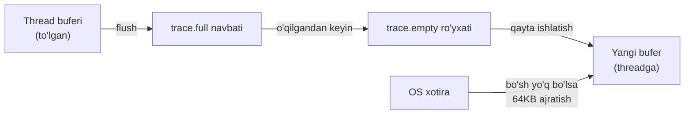

#### Delta-asoslangan vaqt belgilari

Har bir hodisa **vaqt farqi** (timestamp delta) bilan yoziladi — to'liq vaqt belgisi emas:

```go
func (w traceWriter) event(ev traceEv, args ...traceArg) traceWriter {
    w, _ = w.ensure(1 + (len(args)+1)*traceBytesPerNumber)
    
    ts := traceClockNow()
    if ts <= w.traceBuf.lastTime {
        ts = w.traceBuf.lastTime + 1
    }
    tsDiff := uint64(ts - w.traceBuf.lastTime)
    w.traceBuf.lastTime = ts

    // Hodisani yozamiz
    w.byte(byte(ev))      // hodisa turi
    w.varint(tsDiff)       // vaqt farqi
    for _, arg := range args {
        w.varint(uint64(arg)) // argumentlar
    }
    return w
}
```

Har bir trace hodisa binary va ixcham formatda saqlanadi:
```
[hodisa turi][vaqt farqi][arg0][arg1][arg2]...
```

Bu delta-asoslangan usul vaqt belgilarini saqlash uchun kerakli joyni kamaytiradi, chunki ko'pchilik farklar to'liq vaqt belgilaridan ancha kichik.

## Xulosa

- **Execution tracer** — Go dasturingiz ichidagi goroutine, GC, scheduler xatti-harakatlarini nanosekundgacha aniqlkda kuzatish vositasi
- **3 ta usulda yoqiladi**: `go test -trace`, HTTP endpoint, yoki `runtime/trace` API
- **Vizualizatsiya**: proc view, thread view, goroutine analysis — hammasini brauzerda ko'rish mumkin
- **Annotatsiyalar**: Task, Region, Log — biznes mantiqini trace ga bog'lash
- **Ichki tuzilishi**: Thread-local buferlar, avlodlar tizimi, seqlock — yuqori samaradorlik uchun

## Eslab qol

1. Tracing o'chirilganda deyarli **nol xarajat** (zero cost) — ishonch bilan production da ishlatish mumkin
2. `GOMAXPROCS` — fizik CPU yadrolar emas, mantiqiy protsessorlar soni
3. Task = ko'p goroutinelar, Region = bitta goroutine ichida, Log = lahzaviy hodisa
4. Har bir thread **ikkita shaxsiy bufer** saqlaydi — avlodlar tizimi uchun
5. **Toq** seqlock = yozayapti, **juft** = yozmayapti

## Amaliyot

1. **(Oson)** Oddiy dastur yozing, `runtime/trace` bilan trace yig'ing va `go tool trace` bilan oching. Goroutinelar sonini, heap grafigini va GC hodisalarini kuzating.

2. **(O'rta)** Yuqoridagi `handleRequest` misolini to'liq ishga tushiring. `/usertasks` sahifasida Task iyerarxiyasini ko'ring. `dbConnect` ning eng uzoq davom etgan goroutinesini toping.

3. **(Qiyin)** O'zingizning HTTP serveringizga tracing qo'shing. Har bir endpoint uchun Task yarating, ma'lumotlar bazasi so'rovlari uchun Region ishlatib, natijalarni tahlil qiling. Qaysi endpoint eng ko'p scheduler kechikishiga ega ekanini aniqlang.
