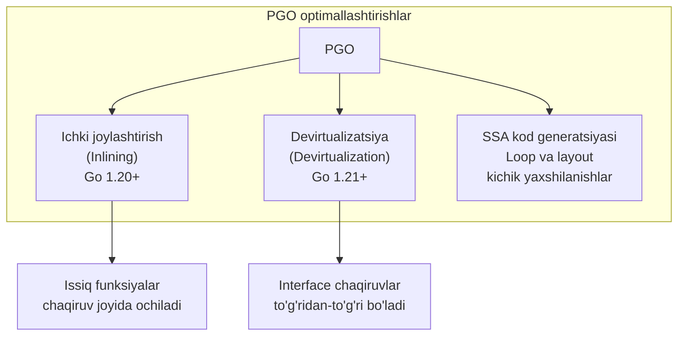
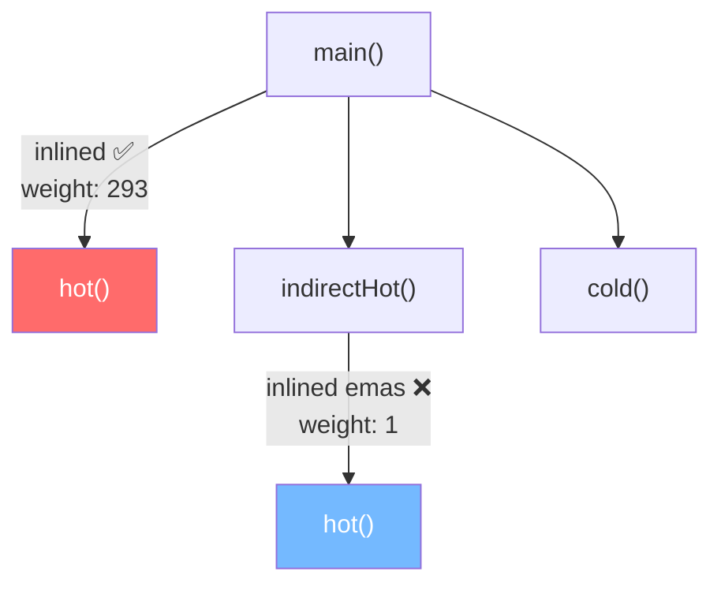
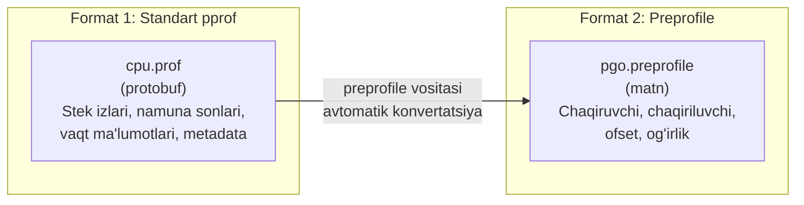
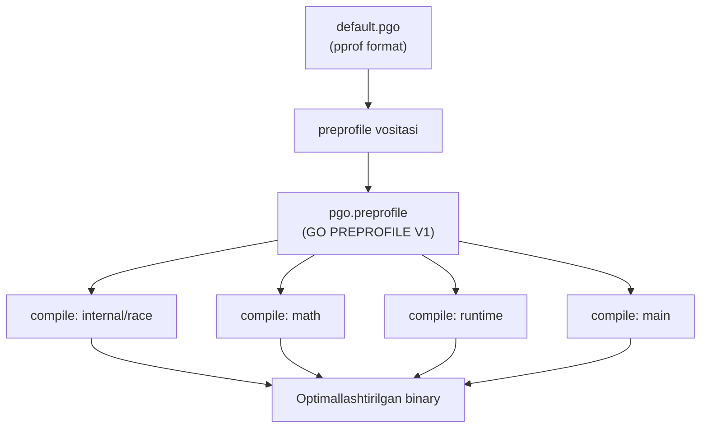
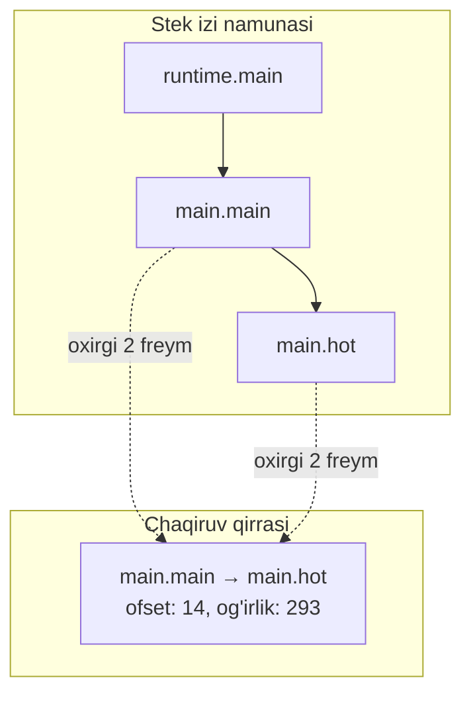
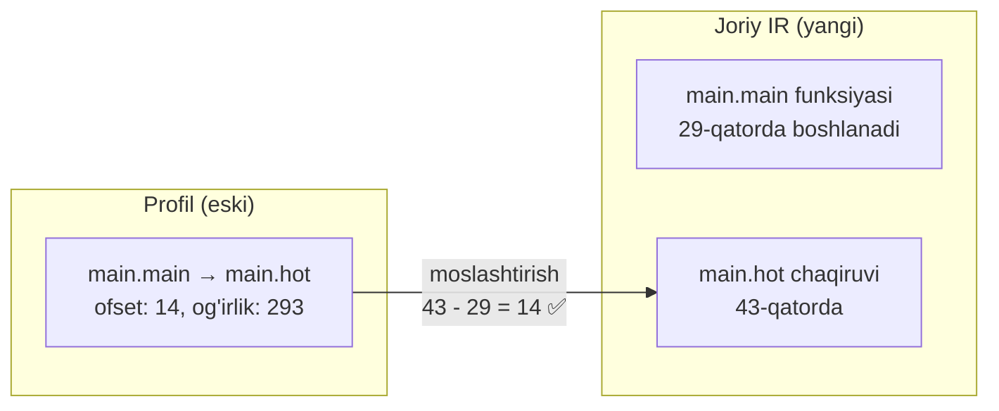
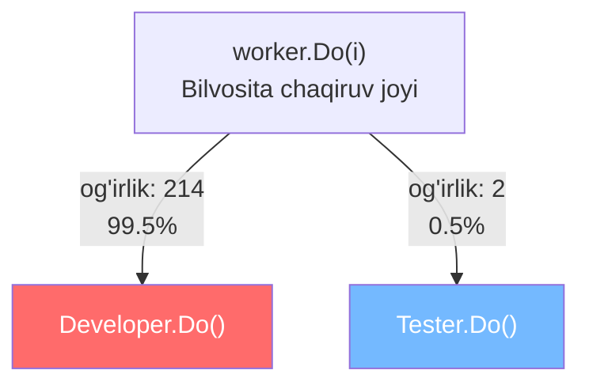
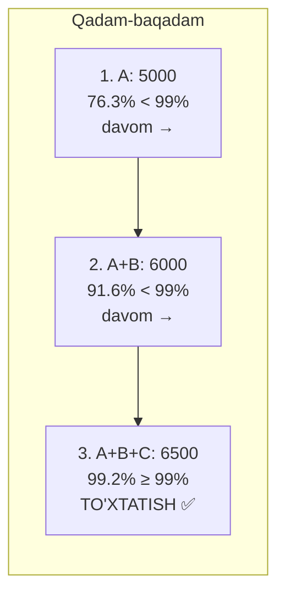
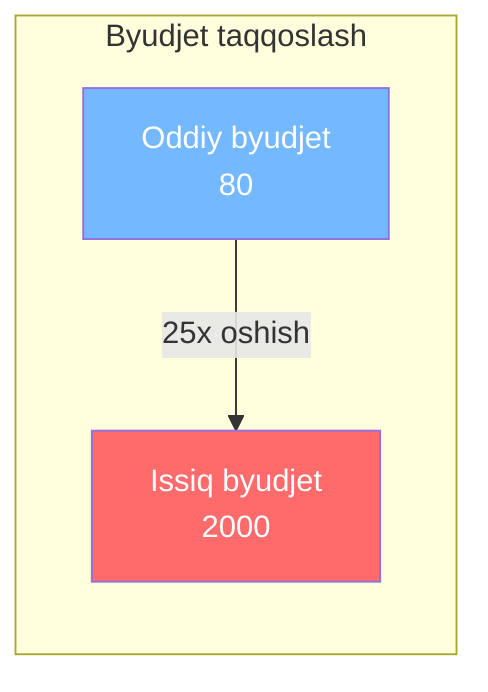
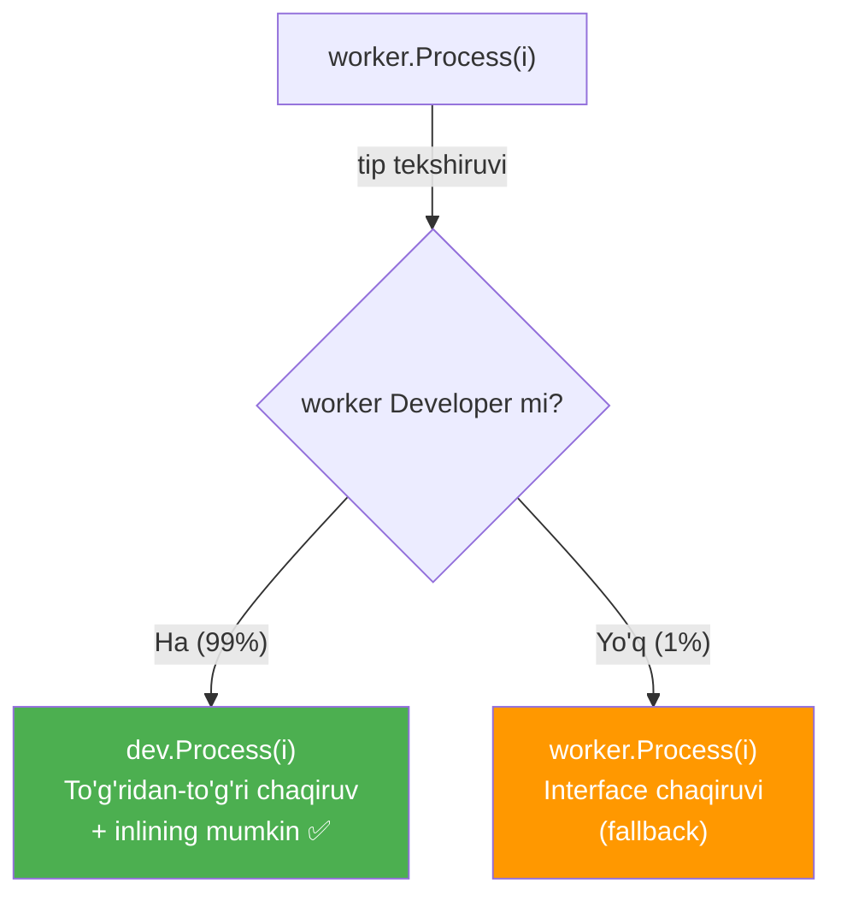

# 7. Profilga asoslangan optimallashtirish (Profile-Guided Optimization / PGO)

> PGO — kompilyator optimallashtiruv texnikasi bo'lib, ilovangizning haqiqiy ishlash ma'lumotlaridan foydalanib, keyingi buildda yanada tezroq dastur yaratadi.

## Kirish

Profilga asoslangan optimallashtirish (PGO), ba'zan Qayta aloqaga asoslangan optimallashtirish (Feedback-Directed Optimization / FDO) deb ham ataladi — bu kompilyator optimallashtiruv texnikasi. U ilovangizni ishlatishdan olingan **haqiqiy ma'lumotlar** yordamida kompilyatorga keyingi safar kodingizni build qilganda **yaxshiroq qarorlar** qabul qilishga yordam beradi.

Go'da PGO jarayoni **tsikl** (loop) ko'rinishida ishlaydi: siz ilovangizni build qilasiz, haqiqiy sharoitlarda ishga tushirasiz va CPU profillarini yig'asiz. Bu profillar kodingizning qaysi qismlari eng ko'p ishlatilishini ("issiq" (hot) yo'llar deb ataladi) va funksiyalar qanchalik tez-tez chaqirilishini ko'rsatadi. Keyin bu profillarni keyingi build uchun Go kompilyatoriga qaytarasiz. Kompilyator bu qayta aloqadan foydalanib aqlliroq tanlovlar qiladi va tezroq dastur build qilishga harakat qiladi.


PGO Go'ga birinchi marta **1.20 versiyasida** (2023-yil fevral) qo'shildi. Dastlabki ish 2022-yil sentyabrda Uber kompaniyasidan Raj Barik tomonidan boshlandi. Bu Go kompilyatoriga profilga asoslangan ichki joylashtirish (inlining) imkoniyatini berdi.

PGO ning birinchi versiyasi **ichki joylashtirishga** (inlining) qaratilgan edi — kompilyator faqat qoidalar yoki taxminlarga emas, balki **haqiqiy runtime ma'lumotlariga** asoslanib qaysi funksiyalarni ichki joylashtirish kerakligini hal qiladi.

Keyingi versiyalarda (Go 1.21 va Go 1.22) PGO **devirtualizatsiya** (devirtualization) qo'llab-quvvatlashini ham qo'shdi. Bu optimallashtirish kompilyatorga ma'lum bilvosita chaqiruvlarni (interface yoki funksiya qiymatlari orqali chaqiruvlar) **to'g'ridan-to'g'ri chaqiruvlarga** aylantirish imkonini beradi — agar profil ko'pincha ma'lum bir aniq tur ishlatilishini ko'rsatsa.

> Bu CPU ishlatilishini kamaytirishi mumkin va ko'p dasturlar Go 1.21 yoki 1.22 da PGO ishlatgandan keyin CPU vaqtining **2 dan 14% gacha** kamayishini ko'rgan.



> **Eslatma:** PGO shuningdek SSA kod generatsiyasiga kichik yaxshilanishlar ham kiritadi, asosan tsikl optimallashtirishlari va kod joylashuvi bilan. Bu tafsilotlar ozgina qo'shimcha samaradorlik beradi, lekin kodingiz ishlashini tubdan o'zgartirmaydi. Biz asosiy PGO xususiyatlariga — ichki joylashtirish va devirtualizatsiyaga e'tibor qaratamiz, chunki ular eng katta ta'sirga ega.

## PGO ni amalda ishlatish

Oddiy misol bilan ko'rib chiqamiz. CPU profaylash bo'limidagi bir xil kodni ishlatamiz:

```go
func hot() {
    x := 0
    for i := range 100000000 {
        x += i
    }
    // Ichki joylashtirishni oldini olish uchun
    fmt.Sprintln("prevent inlining")
    fmt.Sprintln("prevent inlining")
}

func cold() {
    time.Sleep(5 * time.Millisecond)
    fmt.Sprintln("prevent inlining")
}

func indirectHot() {
    hot()
    fmt.Sprintln("prevent inlining")
}

func main() {
    // CPU profilni faylga yozamiz
    f, err := os.Create("cpu.prof")
    if err != nil {
        panic(err)
    }
    defer f.Close()

    if err := pprof.StartCPUProfile(f); err != nil {
        panic(err)
    }
    defer pprof.StopCPUProfile()

    indirectHot()
    for range 150 {
        hot()
        cold()
    }
}
```

Bu misolda biz ko'proq "foydasiz" `fmt.Sprintln` chaqiruvlarini qo'shamiz — kompilyator bu funksiyalarni standart holda ichki joylashtirmasligi uchun. Bu ishlaydi, chunki ichida ikkita funksiya chaqiruvi bo'lishi xarajat tufayli inlaynerini to'xtatish uchun yetarli. Shuningdek, `indirectHot` tsikldan tashqariga chiqarildi.

### 1-qadam: Oddiy build va ishga tushirish

Birinchi qadam — Go dasturingizni oddiy usulda (PGO siz) build qilish va haqiqiy muhitda ishga tushirish:

```bash
# PGO siz oddiy build
$ go build -o main main.go
$ ./main
```

### 2-qadam: Profilni ko'rish

```bash
$ go tool pprof -http=:8080 main cpu.prof
```

### 3-qadam: PGO bilan qayta build qilish

Yig'ilgan profilni Go kompilyatoriga berish. Go buni osonlashtiradi — profilingizni `default.pgo` deb nomlang va asosiy modul papkasiga qo'ying:

```bash
# Profilni default.pgo ga nomini o'zgartiramiz
$ mv cpu.prof default.pgo

# Build qilsak, Go avtomatik topadi va PGO ni ishlatadi
$ go build -o main main.go
```

Bu avtomatik PGO xususiyati PGO ni oddiy build jarayoniga qo'shishni **juda oson** qiladi. `default.pgo` faylini kodingiz bilan birga repozitoriyga commit qilishingiz mumkin va barcha kelgusi buildlar avtomatik ravishda samaradorlik yaxshilanishlaridan foydalanadi.

> **Eslatma:** Go 1.21 va yangiroqlarida avtomatik aniqlash har doim yoqilgan. Go 1.20 da esa PGO ni qo'lda yoqish kerak edi.

### Qo'shimcha nazorat

Agar ko'proq nazorat kerak bo'lsa, `-pgo` bayrog'ini (flag) build yoki test buyruqlari bilan ishlating:

```bash
# Ma'lum bir profil fayli bilan build
$ go build -pgo=cpu.pprof -o main main.go

# Paketda default.pgo faylini avtomatik aniqlaydi
$ go build -pgo=auto -o main main.go

# PGO ni o'chirish
$ go build -pgo=off -o main main.go
```

Bu aniq rejim bir nechta profilingiz bo'lganda, profillar nostandart joylarda bo'lganda yoki turli optimallashtirish strategiyalarini sinab ko'rayotganda foydali.

### Natija

PGO bilan optimallashtirilgan binaryda `main` dan `main.hot` ga o'tish **inlined** deb belgilanadi chunki `main.hot` issiq yo'l. Lekin `main.indirectHot` dan `main.hot` ga o'tish inlined deb **belgilanmaydi**.

Bu PGO ning kuchi: u faqat issiq funksiyalarni emas, balki **issiq chaqiruv yo'llarini** ham hisobga oladi.



> Ilovangiz o'zgargan yoki yangi ish yuklari olgan sari, yangi profillarni yig'ish va PGO bilan qayta build qilishni davom ettirishingiz mumkin. Bu tsikl yaratadi: **profil → optimallashtirish → deploy → takrorlash**.

## PGO mexanizmi

### CPU profaylash qanday ishlaydi (eslatma)

Profayler dasturning ijrosini muntazam vaqt oraliqlarida, masalan, har **10 millisekundda** namuna oladi va har bir nuqtada chaqiruvlar to'plamini (call stack) yozib oladi.

Vaqt o'tishi bilan bu dasturingizning qaysi qismlari "issiq" ekanligining **statistik ko'rinishini** tuzadi. "Issiq" hudud — namunalarda tez-tez ko'rinadigan, ya'ni dastur u yerda ko'p vaqt sarflaydi.

Stek izlari (stack traces) to'liq kontekstni ko'rsatadi — faqat qaysi funksiya ishlayotganini emas, balki unga olib kelgan **barcha chaqiruvlar zanjirini**. Shuning uchun profayler shunchaki `hot()` issiq deb aytmaydi. U `hot()` `main` dan chaqirilganda issiq ekanini, lekin `indirectHot` dan chaqirilganda issiq **emasligini** ko'ra oladi.

> **Esda tuting:** Juda tez ishlaydigan, lekin ko'p chaqiriladigan funksiya issiq sifatida ko'rinmasligi mumkin, tez ishlamaydiganu ko'p CPU vaqtini egallagan funksiya esa namunalarda ko'proq paydo bo'ladi.

### Build jarayoni (toolchain nima qiladi)

PGO ishlatganda build jarayonida nima sodir bo'lishini ko'rib chiqamiz:

```bash
$ go build -pgo=default.pgo -n main.go
```

#### 1-qadam: Artefakt papkasini yaratish

```bash
$ mkdir -p $WORK/b007/
```

`$WORK/b007/` — Go build tizimi joriy build harakati uchun yaratadigan papka. `b007` nomi bu harakat uchun noyob ID — bu holda PGO oldindan qayta ishlash uchun.

#### 2-qadam: preprofile vositasini ishga tushirish

```bash
$ /tools/preprofile -o $WORK/b007/pgo.preprofile -i ~/theanatomyofgo/default.pgo
```

**preprofile vositasi nima va nima uchun kerak?**

PGO tizimi ikkita asosiy profil fayl formatidan foydalanishi mumkin:



Agar birinchi formatni (standart pprof) ishlatsangiz, Go build tizimi uni preprofile vositasi bilan avtomatik ravishda ikkinchi formatga o'zgartiradi.

O'zingiz ham bu vositani ishlatishingiz mumkin:

```bash
$ go tool preprofile -i default.pgo -o pgo.preprofile
```

Bizning misolimizda `pgo.preprofile` fayli quyidagicha ko'rinadi:

```
GO PREPROFILE V1
main.main
main.hot
14 293
main.hot
runtime.asyncPreempt
2 9
runtime.wakeNetpoll
runtime.kevent
7 2
main.indirectHot
main.hot
1 1
runtime.semasleep
runtime.pthread_cond_wait
32 1
```

Format har doim `GO PREPROFILE V1` sarlavhasi bilan boshlanadi. Undan keyin fayl **uchta qatorlik guruhlar** ga bo'lingan:

1. Chaqiruvchi (caller) funksiya nomi
2. Chaqiriluvchi (callee) funksiya nomi
3. Ikki raqam: **chaqiruv joyi ofseti** (call site offset) va **chaqiruv qirrasi og'irligi** (call edge weight)

Yozuvlar og'irlik bo'yicha saralangan — eng yuqori og'irliklar tepada. Shuning uchun `main.main → main.hot` birinchi, og'irligi 293.

**Bu og'irlik nimani anglatadi?**

Optimallashtirish oldin CPU profil grafigiga qarasak: `main.main` dan `main.hot` ga chaqiruv yo'lida profaylash ishlayotganda **300 ta namuna** bor edi. Ya'ni `main.main` chaqiruvchi va `main.hot` chaqiriluvchi sifatida ko'rsatuvchi 300 ta stek izi mavjud edi. Ulardan 293 tasi `main.hot` stek tubida tugagan. Qolgan 7 tasi `runtime.asyncPreempt` bilan tugagan.

#### 3-qadam: Oldindan qayta ishlangan profilni saqlash

```bash
$ cp $WORK/b007/pgo.preprofile /gobuild/8f/8f75b55...d # ichki kesh
```

Oldindan qayta ishlash bosqichi build uchun **faqat bir marta** sodir bo'ladi. Go build tizimi oldindan qayta ishlangan profilni saqlaydi. Keyingi safar build qilsangiz, tizim preprofile vositasini qayta ishga tushirish o'rniga shu keshlangan fayldan foydalanadi.

#### 4-qadam: Har bir kompilyatsiya buyrug'i profildan foydalanadi

```bash
$ /tool/compile -o $WORK/b030/_pkg_.a ... -pgoprofile=$WORK/b007/pgo.preprofile ...
$ /tool/compile -o $WORK/b009/_pkg_.a ... -pgoprofile=$WORK/b007/pgo.preprofile ...
```

Bu har bir paket kompilyatsiyasi (internal/race, math, runtime va h.k.) **bir xil PGO ma'lumotlariga** kirish huquqiga ega ekanini anglatadi.



### Nega oldindan qayta ishlash kerak?

pprof profillarni tahlil qilish (parsing) **ko'p hisoblash kuchini** talab qiladi. Oldindan qayta ishlashsiz, kompilyatorga har bir chaqiruv bir xil profilni qayta-qayta tahlil qilishi, chaqiruv grafiklarini qurishi, funksiya nomlarini topishi va qirra og'irliklarini hisoblashi kerak bo'lar edi. Bu ayniqsa ko'p paketlar bir xil profildan foydalanadigan katta buildlarda **isrofgarchilik**.

```go
const serializationHeader = "GO PREPROFILE V1\n"

func IsSerialized(r *bufio.Reader) (bool, error) {
    hdr, err := r.Peek(len(serializationHeader))
    if err == io.EOF {
        return false, nil // Bo'sh fayl
    } else if err != nil {
        return false, fmt.Errorf("profil sarlavhasini o'qishda xato: %w", err)
    }
    return string(hdr) == serializationHeader, nil
}
```

Build tizimi profilingizga qarab `GO PREPROFILE V1` sarlavhasini ko'rmasa, oldindan qayta ishlash kerakligini biladi va chaqiruv grafiklarini yaratadi.

### Grafik qurish jarayoni

Grafik qurish jarayoni har bir namuna ustida ishlaydi va har bir namuna — yozib olingan stek izi. Stekdagi har bir freym uchun funksiya uchun **tugun** (node) va ular orasidagi chaqiruv uchun **qirra** (edge) yaratadi.

Tizim haqiqiy chaqiruv qirrasini aniqlash uchun har bir stek izida faqat **oxirgi ikkita freymga** qaraydi. Buning bir nechta sababi bor:

- Stekdagi **yuqori freymlar** ko'pincha haqiqiy issiq yo'llar emas, balki initsializatsiya kodini ko'rsatadi. Masalan, har bir Go dasturida `runtime.main → main.main → foydalanuvchi funksiyalari` chaqiruv zanjiri bor. Qo'shilsa, bular profilni bosib ketadi, lekin ular mazmunli optimallashtirish sodir bo'ladigan joylar emas.
- Yuqori freymlar faqat bir marta chaqirilishi mumkin, lekin baribir ko'p namunalarda paydo bo'ladi — chunki chuqurroq funksiyalar ishlayotganda ular stekda qoladi.



## Moslashtirish: Chaqiruv qirralari va ofsetlar

PGO bilan kompilyatsiya qilganda, kompilyator dasturingizning **ikkita turli versiyasini** birlashtirishi kerak:

1. **Profil** — eski ijro ma'lumotlaridan yaratilgan. Oldingi builddan funksiya nomlari va chaqiruv joylari mavjud.
2. **Joriy build** — funksiyalaringizning hozirgi IR (Oraliq Vakillik / Intermediate Representation) holati.

Vazifa — profildagi chaqiruv qirralarini yangi koddagi chaqiruv joylariga **moslashtirish**.



Moslashtirish ichki joylashtirish (inlining) yoki devirtualizatsiya kabi optimallashtirishlar qo'llanilishidan **oldin** sodir bo'lishi kerak.

### Chaqiruv joyini aniqlash

Chaqiruv joyini aniqlash uchun moslashtirvuchi **kompozit ID** ishlatadi:

| Komponent | Misol |
|---|---|
| Chaqiruvchining linker belgi nomi | `main.main` |
| Chaqiriluvchining linker belgi nomi | `main.hot` |
| Funksiya boshidan chaqiruv joyi ofseti | `43 - 29 = 14` |

Go kompilyator har bir funksiya va uning tanasiga qaraydi, IR da topgan to'g'ridan-to'g'ri chaqiruvlar uchun qirralar yaratadi. Har bir chaqiruv joyi uchun chaqiriluvchining chaqiruvchidan **nisbiy qator raqamini** (qator ofseti) hisoblaydi va profilda bu chaqiruv joyi uchun og'irlikni qidiradi. Agar profildan mos chaqiruv joyini topa olmasa, kompilyator og'irlikni **0** ga o'rnatadi.

### Qator raqami muammolari

Qator raqamlari chaqiruv joyi identifikatorining qismi bo'lganligi sababli, qator raqamlaridagi o'zgarishlar katta amaliy muammo:

- **Qator siljishi:** Tasavvur qiling, funksiyada boshidan ofset 5 da chaqiruv joyi bor. Agar kimdir o'sha nuqtadan oldin kod qo'shsa yoki o'chirsa, ofset 6 yoki 4 ga siljishi mumkin. Profilda hali eski ofset 5 bor, shuning uchun chaqiruv joyi **mos kelmaydi**. U issiq bo'lgan bo'lsa ham sovuq deb ko'riladi.

- **Eskirgan issiqlik:** Aytaylik, chaqiruv joyi issiq edi chunki ko'p marta ishlaydigan tsikl ichida edi. Agar tsikl faqat bir marta ishlashga o'zgarsa, chaqiruv joyi endi sovuq, lekin profil hali ham uni issiq deb belgilashi mumkin — agar qator ofseti bir xil qolsa.

### Bilvosita chaqiruvlar (Indirect calls)

Moslashtirish jarayoni funksiyalar va ularning chaqiruv joylari o'rtasidagi chaqiruv qirralari grafigini yaratadi. Lekin agar chaqiruv joyi **bilvosita chaqiruv** bo'lsa, Go kompilyator bu bosqichda hech qanday qirra **yaratmaydi**:

```go
// Interface orqali bilvosita chaqiruv
type Worker interface {
    Do(int) int
}

func Process(worker Worker) {
    worker.Do(1) // Kompilyatsiya vaqtida qaysi aniq tur bo'lishi noma'lum
}
```

```go
// Funksiya ko'rsatkichi orqali bilvosita chaqiruv
func Process(do func(int) int) {
    do(1) // Kompilyatsiya vaqtida qaysi funksiya berilishi noma'lum
}
```

Bu bilvosita chaqiruvlar PGO profil moslashtirishining **ikkinchi bosqichida** ko'rib chiqiladi. Ikkinchi bosqich birinchi bosqich toldira olmagan bo'shliqlarni to'ldiradi. Bu bosqichda build tizimi profil ma'lumotlaridagi barcha qirralarga qarab ularni joriy kodga moslashtiradi. CPU profil faqat to'g'ridan-to'g'ri, aniq chaqiruvlarni o'z ichiga oladi. Lekin bilvosita chaqiruv joyida profil kompilyatorga ijro davomida **qaysi aniq funksiyalar chaqirilganini** aytadi.

### Misol: Interface chaqiruvi

```go
var developer = Developer{}
var tester = Tester{}

func main() {
    result := 0
    var worker Worker
    for i := range 1000 {
        if i%200 == 0 {
            worker = tester   // ~0.5% hollarda
        } else {
            worker = developer // ~99.5% hollarda
        }
        result += worker.Do(i)
    }
    println(result)
}
```

Bu funksiyani ishga tushirsangiz, taxminan **0.5%** hollarda `worker` — `Tester`, va **99.5%** hollarda — `Developer`. Demak `worker.Do(i)` chaqiruv joyida CPU profil ma'lumotlarida eng ko'pi bilan ikkita aniq chaqiruv bo'ladi.



Go kompilyator PGO profil ma'lumotlarini tepadan pastga o'qiydi, profil qirralarini og'irlik bo'yicha eng yuqoridan eng pastga saralab. U `Developer.Do(i)` chaqiruvini `worker.Do(i)` chaqiruv joyida eng og'ir qirra sifatida ko'radi va birinchi bo'lib qirra yaratadi. `Tester.Do(i)` chaqiruvini bir xil chaqiruv joyida qayta ishlayotganda, u uchun ham alohida qirra yaratadi.

## Issiq chaqiruv joyi siyosati va ichki joylashtirish byudjeti

Qaysi chaqiruv joylari issiq ekanini aniqlash uchun Go kompilyator **kumulyativ taqsimot** (cumulative distribution) usulini ishlatadi. G'oya — dasturingizdagi barcha faoliyatning **99 foizini** tashkil etadigan eng samaradorlikka ta'sir qiladigan chaqiruvlarni tanlash.

### Aniq misol

Tasavvur qiling, dasturingizda quyidagi chaqiruv joylari va og'irliklari bor:

```
chaqiruv joyi A: 5000 og'irlik
chaqiruv joyi B: 1000 og'irlik
chaqiruv joyi C: 500 og'irlik
chaqiruv joyi D: 40 og'irlik
chaqiruv joyi E: 10 og'irlik
Jami: 6550 og'irlik
```

99% chegarasi — 6550 ning kamida 99% ga teng bo'ladigan eng kichik chaqiruv joylari to'plamini topish kerak. Bu 6484.5 ga teng.



| Chaqiruv joyi | Og'irlik | Jami | Foiz | Holat |
|---|---|---|---|---|
| A | 5000 | 5000 | 76.3% | Issiq |
| B | 1000 | 6000 | 91.6% | Issiq |
| C | 500 | 6500 | 99.2% | Issiq |
| D | 40 | 6540 | - | Sovuq |
| E | 10 | 6550 | - | Sovuq |

Demak A, B va C **"issiq"** — maxsus ichki joylashtirish muomalasini oladi. D va E **"sovuq"** — oddiy muomala.

### Maxsus muomala nima?

PGO ning ichki joylashtirishga eng katta ta'siri — **byudjet o'zgarishi**. Oddatda ichki joylashtirish byudjeti **80** (yoki ba'zi kontekstga asoslangan ichki joylashtirishda 160). Issiq chaqiruv joylari uchun byudjet **2000** ga oshadi:

```go
var inlineHotMaxBudget int32 = 2000
```



Issiq chaqiruv joyi ichki joylashtirilishi uchun **ikkita tekshiruvdan** o'tishi kerak:

1. **Ichki joylashtirilishi mumkin funksiya:** Funksiyaning o'zi ichki joylashtirilishi mumkin bo'lishi kerak — ichida `defer`, `go` kabi bloklash elementlari yo'q bo'lishi va byudjetdan oshmasligi kerak. Issiq funksiyalar uchun byudjet endi 2000, shuning uchun ko'proq funksiyalar ichki joylashtirilishi mumkin.

2. **Ichki joylashtirilishi mumkin chaqiruv joyi:** Har bir chaqiruv joyining ham o'z byudjeti bor. Issiq chaqiruv joylari byudjeti 2000 ga oshirilgan. Lekin issiq byudjet bilan ichki joylashtirilishi mumkin funksiyada ham ba'zi chaqiruv joylari ular issiq bo'lmasa oddiy 80 ga cheklangan bo'lishi mumkin.

> Shuning uchun oldingi misolda `main.indirectHot` dagi issiq chaqiruv joyi — issiq funksiyaning o'zi issiq deb belgilangan bo'lsa ham — ichki **joylashtirilmagan** edi.

## Devirtualizatsiya (profillar asosida)

Devirtualizatsiya — kompilyator bilvosita chaqiruvni topib, runtime da qaysi aniq funksiya chaqirilishini **oldindan bilganda** sodir bo'ladigan optimallashtirish.

Oddiy statik tahlil bilan bu qiyin, chunki kompilyator har doim qaysi tur ishlatilishini aniqlay olmaydi. PGO qo'shadigan narsa — profaylashdan olingan **haqiqiy dalillar**: aniq turlar haqiqiy ijro davomida ma'lum interface chaqiruv joylarida aslida qaysilar paydo bo'lishi haqida.

### Misol

```go
type Worker interface {
    Process(x int) int
}

// Developer va Tester ham Worker ni implement qiladi
// func (Developer/Tester) Process(x int) int {
//     for i := range 10000000 { x += i }
//     return x
// }

var developer Developer
var tester Tester

func main() {
    result := 0
    var worker Worker
    for i := range 1000 {
        if i%100 == 0 {
            worker = tester     // 1% hollarda
        } else {
            worker = developer  // 99% hollarda
        }
        result += worker.Process(i)
    }
    println(result)
}
```

Profilni yig'gandan keyin:

```
GO PREPROFILE V1
main.main
main.Developer.Process
14 214
main.Developer.Process
runtime.asyncPreempt
1 5
main.main
main.Tester.Process
14 2
```

`Developer.Process` ga chaqiruv `Tester.Process` ga qaraganda **ancha issiqroq**. Eng muhim o'zgarish `worker.Process(i)` da sodir bo'ladi. Bu interface chaqiruvi — runtime da `worker` nima ekaniga qarab `Developer.Process` yoki `Tester.Process` ga borishi mumkin.

Oddatda kompilyator interface chaqiruvlarini ichki joylashtira olmaydi. PGO devirtualizatsiyasi bilan kompilyator profil ma'lumotlariga qarab `Developer.Process` ancha ko'p chaqirilishini (og'irlik 214) ko'radi va interface chaqiruvini quyidagiga o'zgartiradi:

```go
// Kompilyator quyidagiga o'zgartiradi:
if dev, ok := worker.(Developer); ok {
    dev.Process(i) // To'g'ridan-to'g'ri chaqiruv — endi ichki joylashtirilishi mumkin!
} else {
    worker.Process(i) // Interface chaqiruviga qaytish (fallback)
}
```



Bu yerda **ikkita optimallashtirish** sodir bo'ladi:
1. Interface dispatch xarajati keng tarqalgan holatda (taxminan 99%) **yo'qoladi**
2. Funksiya chaqiruvi xarajati ham **yo'qoladi** (chunki endi ichki joylashtirilishi mumkin)

Kam uchraydigan holat — `tester.Process(i)` chaqirilganda — hali ishlaydi, lekin biroz sekinroq bo'ladi.

> **Eslatma:** Agar kodning yangiroq versiyasida kimdir `Developer` turini o'chirib faqat `Tester` ni qoldirsa nima bo'ladi?
> - Profil hali ham `Developer.Process` eng issiq deydi
> - Kompilyator yangi kodda bu belgini (symbol) topa olmaydi, shuning uchun devirtualizatsiya **o'tkazib yuboriladi**
> - Kam uchraydigan `Tester.Process` qirrasi e'tiborga olinmaydi chunki u profilda hech qachon eng issiq bo'lmagan

## Xulosa

- **PGO** — haqiqiy CPU profil ma'lumotlarini kompilyatorga qaytarib berib, keyingi buildda tezroq binary yaratish tsikli
- Go'da PGO **1.20** dan beri mavjud, `default.pgo` faylini modul ildiziga qo'yish yetarli
- Ikki asosiy optimallashtirish: **inlining** (issiq funksiyalar uchun byudjet 80 → 2000) va **devirtualizatsiya** (interface chaqiruvlarni to'g'ridan-to'g'ri chaqiruvlarga aylantirish)
- Profil → preprofile vositasi → `GO PREPROFILE V1` format → barcha paketlar kompilyatsiyasida ishlatiladi
- Moslashtirish qator ofsetlari orqali ishlaydi — kod o'zgarsa, ofsetlar siljishi va profil eskirishi mumkin
- Kumulyativ taqsimot usuli: **99%** faoliyatni tashkil etuvchi chaqiruv joylari "issiq" deb hisoblanadi

## Eslab qol

1. PGO tsikl: **build → ishga tushir → profil yig' → qayta build** — doimiy yaxshilanish
2. `default.pgo` faylini repo ga commit qilsangiz — barcha buildlar avtomatik PGO dan foydalanadi
3. **Issiq funksiya ≠ issiq chaqiruv joyi** — PGO chaqiruv yo'lini hisobga oladi
4. Devirtualizatsiya faqat **eng issiq** aniq chaqiriluvchi uchun ishlaydi
5. Kod o'zgarsa qator ofsetlari siljishi mumkin — profilni **muntazam yangilab** turish kerak

## Amaliyot

1. **(Oson)** Oddiy Go dastur yozing, CPU profil yig'ing (`pprof.StartCPUProfile`), keyin `default.pgo` sifatida saqlang va PGO bilan qayta build qiling. `go build -pgo=auto -o main main.go` ishlatib natijani solishtiring.

2. **(O'rta)** Interface ishlatuvchi kod yozing (`Worker` misoli kabi). CPU profilni yig'ing va `go tool preprofile` bilan `GO PREPROFILE V1` formatiga aylantiring. Og'irliklarni tahlil qilib, kompilyator qaysi chaqiruvni devirtualizatsiya qilishini taxmin qiling.

3. **(Qiyin)** Mavjud loyihangizga PGO qo'shing. Avval PGO siz benchmark (`go test -bench=.`) ishga tushiring, keyin profil yig'ib PGO bilan qayta build qiling va benchmark natijalarini solishtiring. CPU vaqti qancha kamayganini o'lchang.
