# 7-Bob: Xotira (Memory)

> "The Anatomy of Go" — Phuong Le
> O'zbek tiliga tarjima

## Mundarija

- [1. Binary va Xotira](#1-binary-va-xotira)
  - [TEXT](#text)
  - [RODATA](#rodata)
  - [Global Data (Global ma'lumotlar)](#global-data-global-malumotlar)
- [2. Heap (To'plam)](#2-heap-toplam)
  - [Virtual Memory (Virtual xotira)](#virtual-memory-virtual-xotira)
  - [Go virtual xotirani qanday boshqaradi](#go-virtual-xotirani-qanday-boshqaradi)
  - [Go'dagi xotira ajratish tizimi](#godagi-xotira-ajratish-tizimi)
  - [Go katta obyektlarni qanday ajratadi](#go-katta-obyektlarni-qanday-ajratadi)
  - [Tiny Object Allocation (Mayda obyekt ajratish)](#tiny-object-allocation-mayda-obyekt-ajratish)
  - [Pointer Bitmaps va Malloc Header](#pointer-bitmaps-va-malloc-header)
- [3. Goroutine Stack (Gorutin steki)](#3-goroutine-stack-gorutin-steki)
  - [Segmented Stack (Bo'lakli stek)](#segmented-stack-bolakli-stek)
  - [Contiguous Stack (Uzluksiz stek)](#contiguous-stack-uzluksiz-stek)
  - [Stack Management (Stek boshqaruvi)](#stack-management-stek-boshqaruvi)
  - [Goroutine Stack Anatomy (Gorutin steki anatomiyasi)](#goroutine-stack-anatomy-gorutin-steki-anatomiyasi)
  - [Stack Frame Types (Stek freym turlari)](#stack-frame-types-stek-freym-turlari)
  - [Stek freymning tuzilishi](#stek-freymning-tuzilishi)
  - [Stack Expansion (Stekni kengaytirish)](#stack-expansion-stekni-kengaytirish)
  - [Stack Shrinking (Stekni qisqartirish)](#stack-shrinking-stekni-qisqartirish)
- [4. Escape Analysis (Qochish tahlili)](#4-escape-analysis-qochish-tahlili)
  - [Nega bizga heap obyektlari kerak?](#nega-bizga-heap-obyektlari-kerak)
  - [O'zgaruvchi qachon qochadi?](#ozgaruvchi-qachon-qochadi)
- [5. Garbage Collection (Axlat yig'ish)](#5-garbage-collection-axlat-yigish)
  - [Garbage Collection asoslari](#garbage-collection-asoslari)
  - [Tri-color Marking va Write Barrier](#tri-color-marking-va-write-barrier)
  - [GOGC: Xotira va CPU muvozanati](#gogc-xotira-va-cpu-muvozanati)
  - [GOMEMLIMIT](#gomemlimit)
  - [0-Qadam: GC ishga tushishi](#0-qadam-gc-ishga-tushishi)
  - [1-Faza: Sweep Termination (Tozalashni yakunlash)](#1-faza-sweep-termination-tozalashni-yakunlash)
  - [2-Qadam: Marking Phase (Belgilash fazasi)](#2-qadam-marking-phase-belgilash-fazasi)
  - [3-Qadam: Marking Termination Phase (Belgilashni yakunlash fazasi)](#3-qadam-marking-termination-phase-belgilashni-yakunlash-fazasi)
  - [4-Qadam: Sweeping Phase (Tozalash fazasi)](#4-qadam-sweeping-phase-tozalash-fazasi)
- [6. Xulosa](#6-xulosa)

---

## 1. Binary va Xotira

Go dasturi ishga tushganda, yadro (kernel) bajariluvchi faylni (executable) jarayonning virtual manzil maydoniga (virtual address space) joylashtiradi. Faylning har bir bayti shu xotiradagi obrazning bir qismiga aylanavermaydi, hatto joylashtirilgan qismlar ham odatda talab bo'yicha sahifama-sahifa (page-by-page on demand) yuklanadi. Buning sababini ko'rish uchun, keling, binarining o'zining tuzilishiga nazar tashlaymiz.

Biz bajariluvchi fayl (executable) qurganimizda (build), natijaviy binary fayl bo'limlarga (sections) bo'linadi. Bu bo'limlarni oddiy buyruq bilan ko'rib chiqish mumkin:

```bash
# Linux arm64/amd64
$ readelf -S main

# Darwin arm64
$ otool -l main
```

Arxitekturalar o'rtasida tartib biroz farq qiladi, ammo asosiy bo'limlar bir xil bo'lib qoladi. Quyidagi jadval Linux'ni Darwin'ga moslashtiradi:

| Linux | Darwin |
| --- | --- |
| .text | __text |
| .rodata | __rodata |
| .typelink | __typelink |
| .itablink | __itablink |
| .noptrdata | __noptrdata |
| .data | __data |
| .bss | __bss |
| .noptrbss | __noptrbss |

Bular bo'lim sarlavhalari (section headers) deb ataladi. Bo'lim sarlavhalari faylning mantiqiy tuzilishini tasvirlaydi. Ular sizga qaysi bo'limlar mavjudligini — masalan, kod, ma'lumotlar, simvol jadvallari (symbol tables) yoki nosozliklarni tuzatish ma'lumotlari (debugging information) — va ularning binary faylda qayerda joylashganini aytib beradi. Bo'lim sarlavhalari asosan faylning tuzilishini batafsil tushunishi kerak bo'lgan linker'lar, loader'lar yoki debugger'lar kabi vositalar uchun foydalidir.

Har bir bo'limning o'z xotira ishlatilishini va ruxsatlarini (permissions) ko'rsatadigan bayroqlari (flags) bor:

```
Sections          Flags
[ 1] .text        AX
[ 2] .rodata      A
...
[ 9] .noptrdata   WA
[10] .data        WA
[11] .bss         WA
[12] .noptrbss    WA
```

Bu bayroqlar quyidagi ma'nolarga ega:

- **A** (allocatable — ajratiladigan): bo'lim jarayonning virtual manzil maydonida mavjud bo'lishi kerak.
- **X** (executable — bajariluvchi): bo'lim CPU bajara oladigan ko'rsatmalarni (instructions) o'z ichiga oladi, masalan `.text` bo'limi.
- **W** (writable — yoziladigan): bo'lim o'zgartirilishi mumkin bo'lgan ma'lumotlarni saqlaydi, masalan `.data` va `.bss` bo'limlaridagi global o'zgaruvchilar.

Biroq, allocatable (**A**) bayrog'i faqat linker bo'limni yuklanadigan segmentga (loadable segment) joylashtirishi mumkinligini bildiradi. Aslida xotiraga nima yuklanishini bo'lim sarlavhalari emas, balki dastur sarlavhalari (program headers) belgilaydi. Yadro segment manzillarini, xotira o'lchamlarini va ruxsatlarni (o'qish, yozish, bajarish) topish uchun ana shu dastur sarlavhalarini o'qiydi.

Bizning binary Linux/amd64'ga mo'ljallangan deb faraz qilsak, mana dastur sarlavhalaridan bir parcha:

```
$ readelf -l main

Elf file type is EXEC (Executable file)
Entry point 0x46dcc0
There are 6 program headers, starting at offset 64

Program Headers:
  Type           Offset             VirtAddr           PhysAddr
                 FileSiz            MemSiz              Flags  Align
  PHDR           0x0000000000000040 0x0000000000400040 0x0000000000400040
                 0x0000000000000150 0x0000000000000150  R      0x1000
  NOTE           0x0000000000000f78 0x0000000000400f78 0x0000000000400f78
                 0x0000000000000064 0x0000000000000064  R      0x4
  LOAD           0x0000000000000000 0x0000000000400000 0x0000000000400000
                 0x000000000006fb31 0x000000000006fb31  R E    0x1000
  LOAD           0x0000000000070000 0x0000000000470000 0x0000000000470000
                 0x0000000000090d38 0x0000000000090d38  R      0x1000
  LOAD           0x0000000001101000 0x0000000000501000 0x0000000000501000
                 0x0000000000003de0 0x0000000000038ac0  RW     0x1000
  GNU_STACK      0x0000000000000000 0x0000000000000000 0x0000000000000000
                 0x0000000000000000 0x0000000000000000  RW     0x8

 Section to Segment mapping:
  Segment Sections...
   00
   01     .note.go.buildid
   02     .text .note.gnu.build-id .note.go.buildid
   03     .rodata .typelink .itablink .gosymtab .gopclntab
   04     .go.buildinfo .go.fipsinfo .noptrdata .data .bss .noptrbss
   05
```

Dastur sarlavhalari operatsion tizimga bajariluvchi faylni xotiraga qanday yuklash va ishlaydigan jarayonni (running process) qanday yaratishni aytadi. Ularsiz loader faylni xotiraga qanday joylashtirishni bilmaydi va bajarish (execution) muvaffaqiyatsiz tugaydi.

Yuqoridagi natijaga qarasak, yadro uchta `LOAD` segmenti (segmentlar `02`, `03` va `04`) uchun xotira xaritalarini (memory mappings) yaratadi:

- `02` segmenti bajariluvchi kodni `0x400000` virtual manzilidan boshlab o'qish va bajarish ruxsatlari bilan yuklaydi, u `.text` bo'limi va build ID note'larini o'z ichiga oladi.
- `03` segmenti faqat o'qiladigan ma'lumotlarni (read-only data) `0x470000` virtual manzilidan boshlab yuklaydi, u `.rodata`, `.typelink`, `.itablink`, `.gosymtab`, `.gopclntab` bo'limlarini o'z ichiga oladi.
- `04` segmenti o'qish-yozish ma'lumotlarini (read-write data) `0x501000` virtual manzilidan boshlab yuklaydi, u `.go.buildinfo`, `.go.fipsinfo`, `.noptrdata`, `.data`, `.bss` va `.noptrbss` bo'limlarini o'z ichiga oladi.

Boshqa yozuvlar ham muhim, ammo ular boshqacha ishlaydi:

- `PHDR` yozuvi dastur sarlavhalari jadvalining o'ziga ishora qiladi. Yadro faylni qanday joylashtirishni bilish uchun bu jadvalni o'qiydi. Ko'pgina linker'lar jadvalni faylning boshiga yaqin joylashtiradi, shuning uchun uning baytlari ko'pincha birinchi `LOAD` segmenti ichiga tushadi va shu `LOAD`ning bir qismi sifatida joylashtiriladi.
- `NOTE` yozuvi note'lar maydonini, masalan build ID'lar va boshqa metama'lumotlarni (metadata) tasvirlaydi. Note'lar uchun fayl baytlari ko'pincha biror `LOAD` segmenti ichiga joylashtiriladi va dastur sarlavhasi yozuvining turi `LOAD` emas, `NOTE` bo'lishiga qaramay, shu tarzda joylashtiriladi.
- `GNU_STACK` yozuvi umuman fayl ma'lumoti emas. Bu shunchaki yadro jarayon stekiga (process stack) qanday ruxsatlar berishini, masalan bajarib bo'lmaydigan (non-executable) bo'lishi kerakligini bildiruvchi bayroq.

> **ESLATMA**
>
> Moslashtirish (mapping) 1:1 emas. Bitta `PT_LOAD` segmenti ko'plab bo'limlarni qamrab olishi mumkin, va bitta bo'limning baytlari bir nechta segment bilan qamrab olinishi mumkin.
>
> Bundan tashqari, har bir dastur sarlavhasi yozuvi `PT_LOAD` emas. `PT_PHDR` va `PT_NOTE` kabi yozuvlar metama'lumotlarni tasvirlaydi, ammo ularning baytlari biror `PT_LOAD`ning fayl diapazoniga tushib qolsa, baribir xotiraga joylashtirilishi mumkin.
>
> Masalan, agar `LOAD 02` `Offset 0x0`dan boshlab `FileSiz 0x6fb31` uchun fayl baytlarini joylashtirsa, u holda `Offset 0x40`dagi `PHDR` jadvali va `Offset 0xf78`dagi `NOTE` yozuvi ikkalasi ham shu diapazon ichiga tushadi. Bu holda ular xotiraga `LOAD 02` tufayli joylashtiriladi, `PHDR` yoki `NOTE` yuklanadigan segment bo'lgani uchun emas.

Agar dastur sarlavhalari ish vaqtida (runtime) nima joylashtirilishini hal qilsa, nega fayl baribir bu ajratilmaydigan bo'limlarni (non-allocatable sections) o'z ichiga oladi?

```
[ 0]                      -
[ 1]  .text               AX
[ 2]  .rodata             A
[ 3]  .typelink           A
[ 4]  .itablink           A
[ 5]  .gosymtab           A
[ 6]  .gopclntab          A
[ 7]  .go.buildinfo       WA
[ 8]  .go.fipsinfo        WA
[ 9]  .noptrdata          WA
[10]  .data               WA
[11]  .bss                WA
[12]  .noptrbss           WA
[13]  .debug_abbrev        -
[14]  .debug_line          -
[15]  .debug_frame         -
[16]  .debug_gdb_scripts   -
[17]  .debug_info          -
[18]  .debug_loclists      -
[19]  .debug_rnglists      -
[20]  .debug_addr          -
[21]  .note.gnu.build-id   A
[22]  .note.go.buildid     A
[23]  .shstrtab            -
[24]  .symtab              -
[25]  .strtab              -
```

Keling, aniq misol olaylik: `pprof` namuna (sample) to'plaganda, u dastur hisoblagichi (program counter) manzilini, ya'ni ishlab turgan ko'rsatmaning xotira manzilini yozib oladi. Buni foydali qilish uchun u bu manzilni binarining nosozliklarni tuzatish ma'lumotlarida (debug information) qidiradi va uni mos manba kodi joylashuviga (source code location) aylantiradi, bu `file:line` ko'rinishida ko'rsatiladi (masalan, `theanatomyofgo/main.go:158`).

Bu ma'lumot ikki manbadan keladi: Go'ning o'z PC/line jadvali va `.debug_info` hamda `.debug_line` kabi standart DWARF debug bo'limlari. Go o'zining PC/line jadvalini `.gopclntab`da saqlaydi, bu dastur hisoblagichini manba qatoriga (source line) moslashtiruvchi Go'ga xos jadval:

```
$ readelf -S main

Section headers:
   ...
  [ 6] .gopclntab        PROGBITS         00000000004a49a0  000a49a0
       000000000005c398 0000000000000000  A       0     0     32
```

Bu bo'lim Go linker tomonidan ishlab chiqariladi va xotiraga yuklanadi. Bu ish vaqti jadvali (runtime table) tufayli siz panic stek izlarida (stack traces) `file:line` ma'lumotini ko'rasiz; Go uni `runtime.Caller()` kabi narsalar uchun ham ishlatadi. Profillarni simvollashtirganingizda (symbolize), `cmd/pprof` ham bu jadvallarni (`.gosymtab` yoki ekvivalent simvol ma'lumotlari bilan birga) bajariluvchi fayldan o'qiydi.

Biroq, bu jadval juda ixcham va asosan Go funksiyalari bilan ishlash uchun mo'ljallangan. Yanada batafsil ma'lumot uchun, ayniqsa Go'da yozilmagan kod uchun, DWARF debug bo'limlari mavjud, ular xotiraga yuklanmaydi. Ular Go'ga xos jadval va DWARF kutgan standart debug vositalari o'rtasida ko'prik bo'lib xizmat qiladi.

Ikkita amaliy eslatma buni haqiqiy vositalar bilan bog'lashga yordam beradi:

- `cmd/pprof` Go funksiyalari uchun Go jadvallarini ishlatadi; agar manzil shu tarzda hal qilinmasa (odatda C/cgo freymlari), u holda DWARF mavjud bo'lsa, uni sinab ko'radi.
- Agar siz `-w` bilan qursangiz (build), linker DWARF bo'limlarini tashlab yuboradi; Go stek izlari baribir ishlaydi (ular `.gopclntab`ga tayanadi), ammo DWARF asosidagi simvollashtirish ishlamaydi.

Bu Go binarisining sayohati edi; endi virtual xotirada aslida nima joylashishiga nazar tashlaymiz. Quyida virtual xotira tuzilishining (virtual memory layout) darslik darajasidagi, soddalashtirilgan diagrammasi keltirilgan:

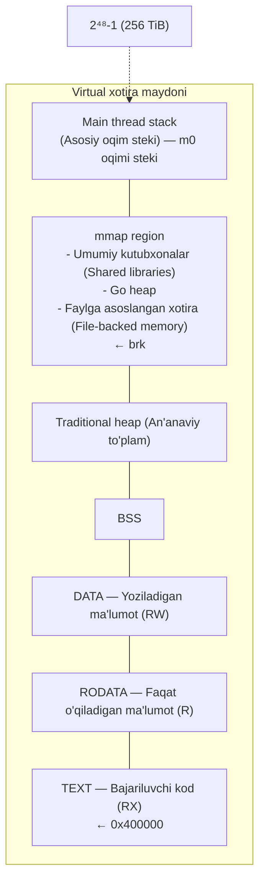
*Rasm 269. Go jarayon manzil maydonining vizual xaritasi*

Yuqoridagi diagrammada bu segmentlar yadro tomonidan virtual xotiraga joylashtiriladi. Bajariluvchi `TEXT` mintaqasi odatda PIE bo'lmagan binarilar uchun `0x400000` kabi bazaviy manzildan (base address) boshlanadi. `0x400000` (4 MiB) tanlovi x86_64 Linux bajariluvchi fayllari uchun keng tarqalgan kelishuv (convention). Ko'pgina x86_64 Linux tizimlari buni standart text segment manzili sifatida ishlatadi, chunki u null ko'rsatkichdan (`0x0`) oqilona masofa qoldiradi, shu bilan birga pastki manzil maydonini juda ko'p iste'mol qilmaydi.

Fayl tuzilishini yodda tutgan holda, biz jarayon ishga tushgandan keyin bu segmentlar qanday ko'rinishini ko'rib chiqishimiz mumkin, `TEXT`dan boshlaymiz.

### TEXT

Keling, misol o'rnatamiz:

```go
func main() {
    fmt.Println(add)
}

//go:noinline
func add(x, y int) int {
    return x + y
}
```

`add`ni qavslarsiz yozsak, biz uni chaqirmaymiz. Biz funksiyaning o'ziga, ya'ni funksiya qiymatiga (function value) murojaat qilamiz.

Amalda, funksiya qiymati CPU shu funksiyani bajara boshlash uchun sakrab o'tishi (jump) mumkin bo'lgan manzilni o'z ichiga oladi. Uni chop etganingizda, Go uni `0x491b00` kabi o'n oltilik son (hex number) sifatida ko'rsatadi. Buni jarayon ichidagi "joylashuv" (location) deb tasavvur qiling.

Linux/amd64'da, agar bajariluvchi fayl PIE sifatida qurilmagan bo'lsa, dastur har safar ishga tushganda ruxsat etilgan bazaviy manzilga (fixed base address) joylashtiriladi. Baza ruxsat etilgan (fixed) bo'lgani uchun, `main.add` manzili ishga tushishlar o'rtasida barqaror bo'ladi:

```
$ ./main
0x491b00

$ ./main
0x491b00

$ ./main
0x491b00

$ ./main
0x491b00
```

Bu manzil qayerdan kelishini tushunish uchun, keling, `go tool nm` buyrug'i bilan bajariluvchi faylning simvollarini ko'rib chiqamiz.

> **ESLATMA**
>
> `go tool nm` — bu obyekt fayllar, arxivlar yoki bajariluvchi fayllar tomonidan aniqlangan yoki ishlatilgan simvollarni ro'yxatlovchi buyruq qatori vositasi. Bu Unix'ning `nm` buyrug'ining Go ekvivalenti bo'lib, Go binarilari va boshqa obyekt fayl formatlari bilan ishlash uchun mo'ljallangan. Biz bu vositani 4-bobda interfeys jadvali (interface table) `.itablink` bo'limida saqlanishini muhokama qilganimizda ishlatganmiz.

Keling, uni hozir `add` funksiyasining manzilini topish uchun ishlatamiz:

```
$ go tool nm ./main | grep main.add

491b00 T main.add
```

`go tool nm` uchta maydonni chop etadi: manzil, tur harfi (type letter) va simvol nomi. Bu yerda `T` simvol bajariluvchi kod maydonida yashashini bildiradi.

Muhim g'oya shundaki, linker har bir funksiya uchun virtual manzil tanlaydi, `go tool nm` shu manzilni ko'rsatadi, va PIE bo'lmagan binarida siz ish vaqtida bir xil manzilni kuzatasiz, chunki bajariluvchi fayl ruxsat etilgan bazaga joylashtiriladi.

PIE — position-independent executable (joylashuvdan mustaqil bajariluvchi fayl)ning qisqartmasi. PIE binarisi operatsion tizim butun bajariluvchi faylni har safar boshqa bazaviy manzilga joylashtirsa ham to'g'ri ishlashi uchun quriladi. Boshqacha aytganda, funksiya hali ham binary ichida bir xil ofsetda (offset) qoladi, ammo binarining o'zi xotirada siljitilishi mumkin, shuning uchun siz chop etadigan yakuniy manzil o'zgaradi.

Aksincha, PIE bo'lmagan binary ruxsat etilgan bazaviy manzil uchun bog'lanadi (linked). Agar OS uni shu ruxsat etilgan bazaga joylashtirsa, funksiyaning absolyut manzili ishga tushishlar o'rtasida barqaror qoladi.

Biroq, macOS kabi boshqa platformalarda vaziyat o'zgaradi [go1.22-darwin]. Har safar ilovani ishga tushirganingizda, u boshqa manzilni chop etadi:

```
$ ./main
0x1003f4700

$ ./main
0x10230c700

$ ./main
0x100814700

$ ./main
0x104a0c700
```

Buning sababi shundaki, macOS/arm64'da Go bajariluvchi fayllari PIE hisoblanadi. PIE bajariluvchi fayl OS uni xotirada qayerga joylashtirishidan qat'i nazar ishlash uchun mo'ljallangan.

ASLR (Address Space Layout Randomization — Manzil maydoni tuzilishini tasodifiylashtirish) — bu ishga tushishlar o'rtasida xotira joylashuvlarini ataylab o'zgartiradigan OS xususiyati. PIE bilan ASLR asosiy bajariluvchi faylning bazaviy manzilini ham tasodifiylashtirishi mumkin: funksiya binary ichida bir xil ofsetda qoladi, ammo butun binary ish vaqtida yangi bazaga siljitiladi, shuning uchun siz chop etadigan yakuniy funksiya manzili har safar o'zgaradi.

macOS'da dinamik loader (`dyld`) dasturni xotiraga joylashtirganda shu manzil siljishini qo'llaydigan komponent hisoblanadi, shuning uchun `fmt.Println(add)` har safar boshqa raqamni chop etadi.

### RODATA

Keyingi mintaqa — faqat o'qiladigan ma'lumotlar (read-only data — `RODATA (R)`). Jarayon ishga tushgandan so'ng, bu mintaqa OS tomonidan faqat o'qiladigan deb hisoblanadi, shuning uchun uning mazmuni dastur ishlab turganda o'zgarmaydi.

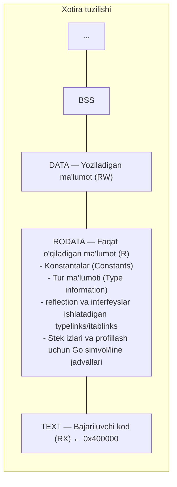
*Rasm 270. RODATA'ni ajratib ko'rsatuvchi Go binary xotira tuzilishi*

Faqat o'qiladigan ma'lumotlar dasturga ish vaqtida kerak bo'ladigan o'zgarmas (immutable) ma'lumotlarni, masalan tur metama'lumotlari (type metadata) va ish vaqti hamda sizning kodingiz tomonidan ishlatiladigan turli konstanta bloklarni saqlaydi. Xotira xaritasi faqat o'qiladigan bo'lgani uchun, dastur bu ma'lumotga to'g'ridan-to'g'ri xavfsiz ishora qilishi mumkin. Yoziladigan nusxa kerak bo'lganda (masalan, satrni (string) `[]byte`ga aylantirganda), Go baytlarni yoziladigan xotiraga nusxalaydi.

Biroq, agar siz `go tool nm`ni ishga tushirsangiz, odatda har bir satr literali (string literal)ni alohida simvol sifatida ko'rmaysiz. Buning sababi shundaki, `nm` simvollarni ro'yxatlaydi, va Go linkeri har bir satr konstantasi uchun alohida eksport qilingan simvol chiqarmaydi. Buning o'rniga, u satr ma'lumotlarini birga guruhlaydi va ularni `go:string.*` kabi sintetik simvol ostida ochib beradi, bu butun satr ma'lumotlari maydonini ifodalaydi.

### Global Data (Global ma'lumotlar)

Keyin global ma'lumotlar mintaqasi keladi. Bu yerda paket darajasidagi o'zgaruvchilar (package-level variables) yashaydi. U o'qish-yozish (read-write) sifatida joylashtiriladi, chunki global o'zgaruvchilar dastur ishlab turganda yangilanishi mumkin.

Yuqori darajada, uning ikkita tanish qismi bor: aniq boshlang'ich qiymati (explicit initial value) bo'lgan global o'zgaruvchilar uchun `DATA (RW)`, va noldan boshlanadigan global o'zgaruvchilar uchun `BSS (RW)`. `BSS` maydoni faylda baytlarni saqlashi shart emas; OS jarayonni yaratganda uni nolga ishga tushiradi (zero-initialize):

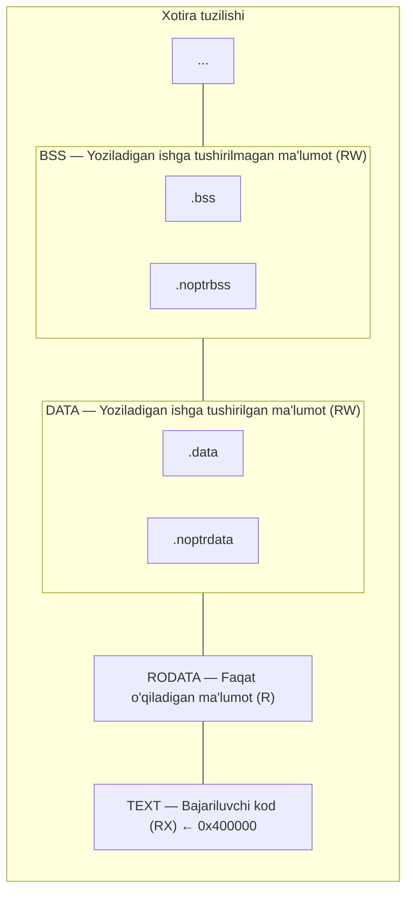
*Rasm 271. Go binarisining global ma'lumotlari va BSS xotira tuzilishi*

Go ko'pchilik tillarga kerak bo'lmaydigan yana bitta farqni qo'shadi: global ma'lumotlarning bir qismi ko'rsatkichlarni (pointers) o'z ichiga olishi mumkinmi yoki yo'qmi. Go'ning axlat yig'uvchisi (garbage collector) ko'rsatilgan obyektlarni tirik saqlash uchun ko'rsatkichlarni topishi kerak, ammo ma'lumot ko'rsatkichlarni o'z ichiga olmasligi ma'lum bo'lganda katta xotira bloklarini so'zma-so'z (word-by-word) skanerlash isrofgarchilik bo'lardi.

Bu ishdan qochish uchun, linker global o'zgaruvchilarni ko'rsatkichsiz (pointer-free) va ko'rsatkichli (pointer-carrying) maydonlarga ajratadi. Ko'rsatkichsiz global o'zgaruvchilar `.noptrdata` va `.noptrbss`ga boradi, va axlat yig'uvchi bu mintaqalarni e'tiborsiz qoldirishi mumkin. Ko'rsatkichlarni o'z ichiga olishi mumkin bo'lgan global o'zgaruvchilar oddiy `.data` va `.bss` maydonlarida qoladi, va axlat yig'uvchi ularni linker tomonidan ishlab chiqarilgan metama'lumotlardan foydalanib skanerlaydi.

#### Heap va Main Thread Stack

Linux'da Go dasturida heap kabi tutadigan ikkita mintaqa bor: an'anaviy brk asosidagi heap va xotiraga moslashtirilgan mintaqa (memory-mapped region).

> **ESLATMA**
>
> Xotiraga moslashtirilgan mintaqa an'anaviy ma'noda heapning bir qismi emas, ammo u baribir dinamik ajratishlar (dynamic allocations) uchun ishlatiladi. Bu muhokamada biz narsalarni soddalashtiramiz va uni Go heapining bir qismi sifatida ko'ramiz.

brk asosidagi heap `.bss` ustida joylashadi va `malloc` kabi C kutubxonalari ishlatilganda uzluksiz o'sadi. Go'ning o'zi bu mintaqadan ajratmaydi; buning o'rniga, ish vaqti o'z heapini `mmap` yordamida o'stiradi, virtual manzil maydonining katta bo'laklarini band qiladi (reserving) va talab bo'yicha fizik xotirani majburiy ravishda ajratadi (committing physical memory on demand). Ko'pgina zamonaviy tizimlarda, foydalanuvchi maydoni ajratuvchilari (user-space allocators) ham katta ajratishlar uchun `mmap`ni afzal ko'radi, shuning uchun brk asosidagi heap kichik qolishi mumkin.

Bundan keyin, biz umumiy ma'noda "heap" deganimizda, Go o'z heap ajratishlari uchun ishlatadigan mmap asosidagi mintaqani nazarda tutamiz.

Go'ning heapi shu mintaqaning axlat yig'uvchi tomonidan boshqariladigan qismidir. Bu yerda heapda ajratilgan Go obyektlari, masalan stekdan qochadigan (escape the stack) qiymatlar yashaydi. U OS oqim steki (thread stack) yoki C kutubxonalari tomonidan `malloc` orqali ajratilgan xotira kabi narsalarni o'z ichiga olmaydi:

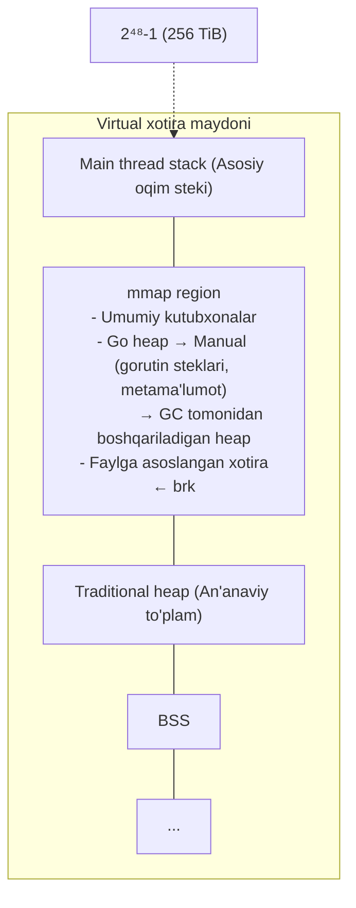
*Rasm 272. Go ish vaqti heapi va asosiy oqim steki tuzilishi*

Yuqoridagi diagrammaning yuqori qismidagi stek — bu OS oqim steki, gorutin steki emas. Go dasturi ishga tushganda, operatsion tizim boshlang'ich oqimni (initial thread — asosiy oqim) o'z steki bilan ta'minlaydi. Go bu boshlang'ich OS stekini ajratmaydi yoki ko'chirmaydi. Gorutinlar ish vaqti ajratadigan va kerak bo'lganda o'stiradigan alohida steklarda ishlaydi, o'zining xotira xaritalaridan foydalanib.

Keling, buni aniq qilish uchun kichik tajriba o'tkazamiz:

```go
var global1, global2 = 1, 2
var global3, global4 int

func main() {
    stack1, stack2 := 3, 4
    heap1, heap2 := escaped(), escaped()

    // O'zgaruvchilarning manzillarini chop etish (hex, decimal)
    println("initialized global1:", &global1, uintptr(unsafe.Pointer(&global1)))
    println("initialized global2:", &global2, uintptr(unsafe.Pointer(&global2)))
    println("uninitialized global3:", &global3, uintptr(unsafe.Pointer(&global3)))
    println("uninitialized global4:", &global4, uintptr(unsafe.Pointer(&global4)))

    println("stack 1:", &stack1, uintptr(unsafe.Pointer(&stack1)))
    println("stack 2:", &stack2, uintptr(unsafe.Pointer(&stack2)))

    println("heap 1:", heap1, uintptr(unsafe.Pointer(heap1)))
    println("heap 2:", heap2, uintptr(unsafe.Pointer(heap2)))
}

//go:noinline
func escaped() *int {
    c := 100
    return &c
}
```

Bu yerda biz to'rtta global o'zgaruvchi e'lon qilamiz: birinchi ikkitasi (`global1`, `global2`) qiymatlar bilan ishga tushiriladi, oxirgi ikkitasi (`global3`, `global4`) esa yo'q. Manzillar ishga tushishlar o'rtasida o'zgaradi, ammo mana bitta ishga tushish qanday ko'rinishi:

```
initialized global1: 0x102b0c3d0
initialized global2: 0x102b0c3d8
uninitialized global3: 0x102b35b28
uninitialized global4: 0x102b35b30
stack 1: 0x14000060720
stack 2: 0x14000060718
heap 1: 0x1400000e090
heap 2: 0x1400000e098
```

Global o'zgaruvchilar virtual xotiraning pastki qismida yashaydi, shuning uchun ularning manzillari stek va heap obyektlariga nisbatan nisbatan kichik. E'tibor bering, `global2` `global1`dan 8 bayt uzoqda, va `global4` `global3`dan 8 bayt uzoqda. Har bir juftlik uzluksiz saqlanadi, bu biz kutgan narsadir. Ammo `global2` va `global3` o'rtasida taxminan 166 KiB sezilarli bo'shliq bor:

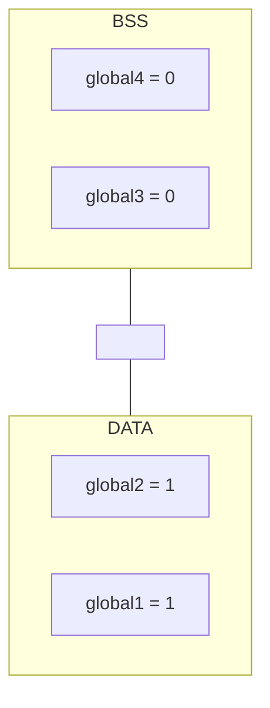
*Rasm 273. Ishga tushirilgan va ishga tushirilmagan global o'zgaruvchilarning joylashuvi*

Bu bo'shliq `DATA` segmenti va `BSS` segmenti o'rtasidagi ajralish tufayli yuzaga keladi, ya'ni bu o'zgaruvchilar ishga tushirilgan yoki yo'qligiga qarab turli bo'limlarda saqlanadi. Endi, keling, stek va heap o'zgaruvchilariga yaqindan nazar tashlaymiz:

```
stack 1: 0x14000060720
stack 2: 0x14000060718
heap 1: 0x1400000e090
heap 2: 0x1400000e098
```

Bu o'zgaruvchilarning manzillari avval ko'rganlarimizdan ancha yuqori. Bu yerda `stack1` va `stack2` asosiy gorutin stekidagi lokal o'zgaruvchilar (local variables), `heap1` va `heap2` esa `escaped()` tomonidan qaytarilgan heapda ajratilgan butun sonlarga ishora qiladi. Asosiy g'oyalar baribir o'rinli: `stack2` `stack1`dan atigi 8 bayt uzoqda, va `heap2` `heap1`dan 8 bayt uzoqda.

Har bir juftlik bir-biriga ancha yaqin, garchi bu kafolatlanmagan bo'lsa ham; bu kompilyator stek freymlarini (stack frames) qanday joylashtirishiga va ish vaqti heap obyektlarini qanday joylashtirishiga bog'liq:

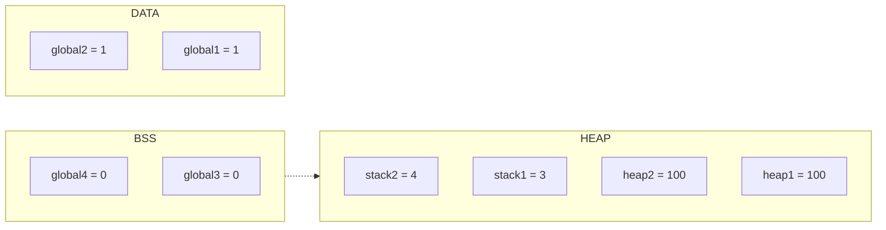
*Rasm 274. Global, heap va stek o'zgaruvchilari joylashuvlarining taqqoslanishi*

Agar yuqoridagi kod parchasini bir necha marta ishga tushirsangiz, hatto gorutin stek manzillari heap manzillaridan pastroq ekanligini ham ko'rishingiz mumkin:

```
stack 1: 0x14000060720
stack 2: 0x14000060718
heap 1: 0x14000182000
heap 2: 0x14000182008
```

Muhim xulosa shundaki, gorutin steklari OS oqimi steki bilan bir xil narsa emas. Go kodi ish vaqti o'z xotira xaritalarida ajratadigan gorutin steklarida ishlaydi, va bu steklar manzil maydonining OS ta'minlagan stekdan boshqa qismida paydo bo'lishi mumkin.

Foydalanuvchi darajasidagi steklarni (user-level stacks) ish vaqti tomonidan boshqariladigan xotiraga joylashtirish faqat Go'ga xos emas; Erlang, Kotlin coroutine'lari va turli fiber kutubxonalari kabi ish vaqtlari ham xuddi shunday qiladi. Gorutin steki baribir odatiy oqim steki kabi tutadi, jumladan pastga (downward) o'sishni o'z ichiga oladi.

Davom etishdan oldin, har bir mintaqa nima uchunligini xulosalashimiz mumkin:

- **TEXT** (RX): Kompilyatsiya qilingan mashina kodi: sizning funksiyalaringiz, plyus Go ish vaqti. PIE bo'lmagan Linux/amd64 binarilarida bu ko'pincha ruxsat etilgan bazaga (odatda `0x400000` atrofida) joylashtiriladi; PIE + ASLR bilan baza ishga tushishlar o'rtasida o'zgarishi mumkin.
- **RODATA** (R): Faqat o'qiladigan ma'lumotlar, masalan konstantalar, satr literallari, tur metama'lumotlari va boshqalar.
- **DATA** (RW): Dastur va ish vaqti uchun ishga tushirilgan global o'zgaruvchilar.
- **BSS** (RW): Nolga ishga tushirilgan global o'zgaruvchilar. Fayl ularning baytlarini saqlamaydi; loader shunchaki joy band qiladi va OS ish vaqtida nolga to'ldirilgan xotirani ta'minlaydi.
- **An'anaviy heap (brk)** (RW): `brk(2)`/`sbrk(2)` bilan o'sadigan uzluksiz mintaqa, ko'pincha C kutubxonalari va ajratuvchilar tomonidan ishlatiladi. Go ish vaqti buni Go heapini o'stirish uchun ishlatmaydi (u `mmap` ishlatadi), ammo u bir xil jarayonda mavjud bo'lishi mumkin.
- **mmap mintaqasi** (aralash xaritalar): `mmap(2)` bilan xaritalangan hamma narsa: umumiy kutubxonalar, Go'ning GC tomonidan boshqariladigan heap arenalari (arenas), gorutin steklari va siz yaratgan har qanday faylga asoslangan xaritalar.
- **OS oqim steki** (RW, pastga o'sadi): OS oqimga beradigan stek. Boshlang'ich (asosiy) oqim OS ta'minlagan stek bilan boshlanadi; Go ko'pgina foydalanuvchi kodini gorutin steklarida ishlatadi, ish vaqti va cgo esa kerak bo'lganda har bir oqim uchun tizim stekini (system stack) (`g0`) ishlatadi.

---

## 2. Heap (To'plam)

Go'ning xotira ajratuvchisi (memory allocator) — bu Go dasturlarida xotira qanday taqsimlanishi va qayta ishlatilishini hal qiladigan tizim. Dastlab u Google'ning TCMalloc (Thread-Caching Malloc) tomonidan ilhomlangan edi, ammo vaqt o'tishi bilan Go Go ilovalari va ish vaqti aslida nimaga muhtojligiga ko'proq mos kelish uchun TCMalloc'dan ajralib chiqdi.

Ba'zi asosiy g'oyalar hali ham qoladi: Go ajratishlarni o'lcham sinflariga (size classes) guruhlaydi va keshlash qatlamlaridan (caching layers) foydalanadi, shuning uchun ko'pgina kichik ajratishlar tez va odatda global qulflardan (global locks) qochadi. Ammo bu bobning qolgan qismini kuzatish uchun sizga TCMalloc'ni bilish shart emas. Biz uni fon konteksti (background context) sifatida ko'rib chiqamiz va Go ajratuvchisi joriy ish vaqtida qanday ishlashiga e'tibor qaratamiz.

### Virtual Memory (Virtual xotira)

> *Bu bo'lim keyingilar uchun zamin yaratish maqsadida virtual xotirani tanishtiradi. Agar siz virtual xotira va sahifalar (pages) bilan allaqachon tanish bo'lsangiz, uni o'tkazib yuborishingiz mumkin.*

Deyarli barcha umumiy maqsadli kompyuterlarda, fizik xotira (physical memory) — bu mashinaga o'rnatilgan DRAM. Faqat fizik xotira bo'lgan dunyoni tasavvur qiling: virtual xotira yo'q, sahifa jadvallari (page tables) yo'q, apparat himoyasi (hardware protection) yo'q. Bunday dunyoda har bir jarayon va operatsion tizim bitta katta manzil maydonini ulashardi, va har bir jarayon shunchaki RAM'ning biror mintaqasini egallar edi:

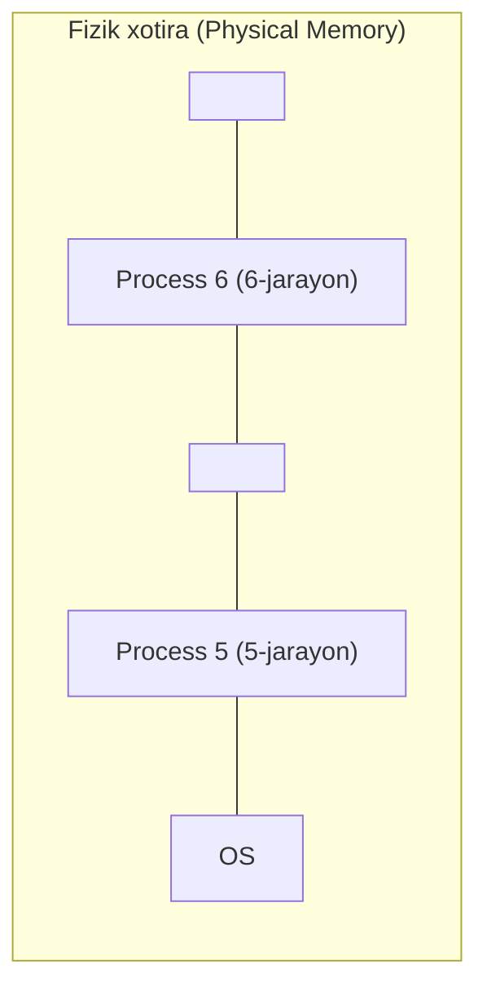
*Rasm 275. Virtual manzil izolyatsiyasisiz fizik xotira illyustratsiyasi*

Bu tizimni mo'rt qilardi. Bitta ulashilgan RAM maydoni va izolyatsiyasiz (isolation), bitta jarayondagi xato boshqa jarayonning xotirasini o'qishi yoki ustiga yozishi mumkin edi. Eng yomon holatda, u hatto operatsion tizimning xotirasini ham buzib, butun mashinani ishdan chiqarishi mumkin edi.

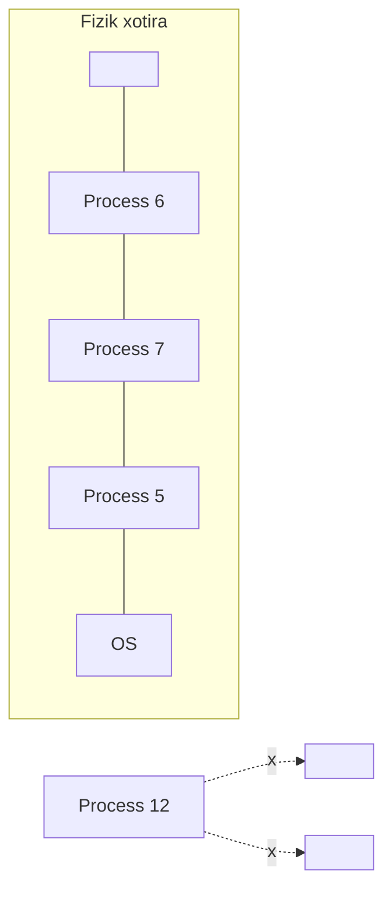
*Rasm 276. Fragmentatsiya va xotira izolyatsiyasi yo'qligi*

Fragmentatsiya (parchalanish) ham ko'rinardi. Jarayonlar ishga tushib, tugaganda, ular ishlatilgan mintaqalar o'rtasida bo'sh RAM teshiklarini qoldiradi. Sizda jami yetarli bo'sh xotira bo'lishi mumkin, ammo u kichik bo'laklarga bo'lingan, shuning uchun keyingi jarayon uchun yetarli darajada katta bitta uzluksiz blok yo'q.

Tizim yo jarayonlarni ko'chirib RAM'ni zichlashtirishi (compact) kerak edi (bu qimmat), yoki tobora murakkablashayotgan bo'sh ro'yxatlar (free lists) va joylashtirish strategiyalariga (placement strategies) tayanishi kerak edi.

Virtual xotira bu muammolarni hal qiladi. Pastda hali ham bitta fizik xotira hovuzi (pool) bor, ammo CPU tarjima qatlamini (translation layer) qo'shadi, shuning uchun har bir jarayon o'zining shaxsiy **virtual** manzil maydonini oladi:

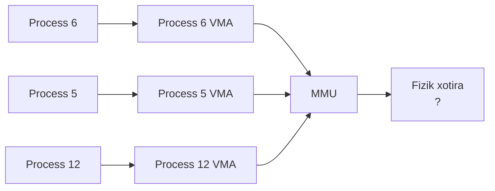
*Rasm 277. Har bir jarayon uchun izolyatsiyalangan manzil maydonlarini ta'minlovchi virtual xotira*

Bu bobda muhokama qiladigan hamma narsa (`TEXT` va `BSS` segmentlari, heap, stek, hatto o'zgaruvchining chop etilgan manzili) virtual manzillarni (virtual addresses) ishlatadi.

Jarayon boshqa jarayonning ma'lumotlarini ko'ra olmaydi yoki ustiga yoza olmaydi, chunki OS sahifa jadvallarini shunday dasturlaydiki, faqat ma'lum virtual diapazonlar (virtual ranges) yaroqli (valid) bo'ladi, va har bir diapazon o'ziga xos ruxsatlarga (o'qish/yozish/bajarish) ega. Bu boshqa foydalanuvchi dasturlarini ham, operatsion tizimning o'zini ham himoya qiladi.

Manzillar virtual bo'lgani uchun, OS jarayonning xotirasini fizik xotirada qayerga mos kelsa, jarayonning bilishiga hojat qoldirmasdan joylashtirishi mumkin. Fragmentatsiya yashiriladi, chunki ko'plab tarqoq fizik sahifalar baribir bitta uzluksiz virtual diapazon sifatida ko'rinishi mumkin.

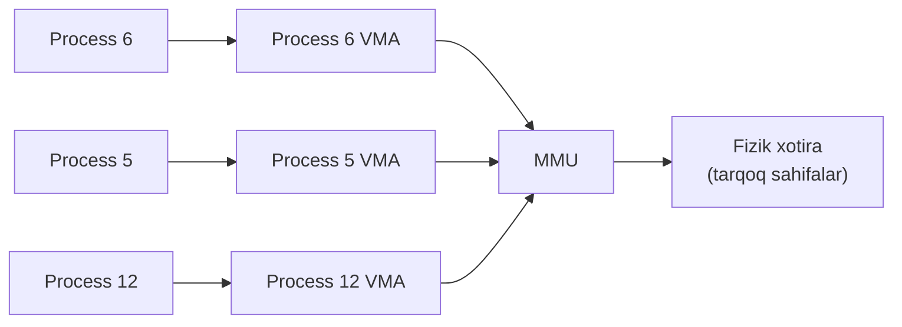
*Rasm 278. Virtual xotira manzil tarjimasi orqali fragmentatsiyani yashiradi*

OS shuningdek, berilgan virtual diapazonni qaysi fizik sahifalar qo'llab-quvvatlashini ham o'zgartirishi mumkin. Masalan, u kamdan-kam ishlatiladigan sahifalarni diskka chiqarib (swap out) yuborishi va keyinroq ularni qaytarib olishi mumkin, jarayonning virtual manzillarini bir xil saqlagan holda.

Oddiy foydalanuvchi maydoni jarayoni (user-space process) hech qachon "xom" (raw) fizik RAM'ni to'g'ridan-to'g'ri o'qimaydi yoki yozmaydi. Har bir yuklash yoki saqlash (load or store) virtual manzilni ishlatadi, va CPU'ning Xotira Boshqaruv Birligi (Memory Management Unit — MMU) yadro shu jarayon uchun o'rnatgan sahifa jadvallaridan foydalanib uni fizik manzilga tarjima qiladi. Bu jadvallar virtual sahifalarni fizik sahifalarga moslashtiradi. Biz sahifalarni tez orada aniqlaymiz.

Shunday qilib, hatto ikkita jarayon tasodifan bir xil xotira manzilini, masalan `0x00025fff`ni so'rasa ham, ular bir-biriga xalaqit bermaydi, chunki bu har bir jarayonga moslashtirilgan virtual manzil.

Ilova nuqtai nazaridan, u o'ziga to'liq mavjud bo'lib ko'rinadigan to'liq, shaxsiy virtual manzil maydonini ko'radi. 64-bitli tizimda bu maydon juda katta (ko'pincha terabaytlarda), mashinadagi haqiqiy fizik RAM'dan ancha katta. Jarayon OS yaroqli deb belgilagan bu maydondagi har qanday manzilga yuklash va saqlash chiqarishi mumkin. U bu manzil hozir fizik RAM bilan qo'llab-quvvatlanayotganini, diskka chiqarilganini yoki diskdagi faylga moslashtirilganini bilmaydi (va bilishi shart emas).

Biz bu fikrni tezkor Go misoli bilan aniqroq qilamiz:

```go
buf := make([]byte, 1<<30) // 1 GiB slice ajratish
```

1 GiB buferni ajratganingizda, Go ajratuvchisiga shu slice uchun uzluksiz 1 GiB **virtual** diapazon kerak. Bu diapazon unda allaqachon mavjud bo'lishi mumkin, yoki u OS'dan ko'proq manzil maydonini band qilib Go heapini o'stirishi mumkin. Har qanday holatda, virtual diapazonga ega bo'lish mashina sizga avtomatik ravishda 1 GiB fizik RAM bergan degani emas.

Aslida, Go va OS ikkalasi ham kerak bo'lmaguncha xotiraga tegmaslikka harakat qiladi. Ish vaqti ko'pincha nolga aylantirishni (zeroing) kechiktirishi mumkin, va OS odatda anonim xotirani (anonymous memory) fizik sahifalar bilan faqat sahifaga aslida murojaat qilinganda qo'llab-quvvatlaydi.

Ilovangiz xotiraga tegmaguningizcha, masalan `buf[0]`ga qiymat berib, OS aslida nimani qo'llab-quvvatlaganini bilmaydi:

```go
buf[0] = 42
```

CPU `buf[0]`ning virtual manziliga saqlash chiqaradi. Agar shu manzilni o'z ichiga olgan sahifa hali fizik sahifa bilan qo'llab-quvvatlanmagan bo'lsa, CPU sahifa xatosini (page fault) ko'taradi. Keyin yadro fizik sahifani ajratadi (anonim xotira uchun u nolga to'ldirilgan holda boshlanadi), sahifa jadvallarini yangilaydi va ko'rsatmani qayta urinadi. OS fizik RAM'ni bir vaqtning o'zida bir bayt tayinlamaydi: qo'llab-quvvatlash birligi — bu sahifa, shuning uchun bitta baytga tegish uni o'z ichiga olgan butun sahifaning qo'llab-quvvatlanishiga olib kelishi mumkin.

Bu bo'lak — apparat va OS odatda virtualni fizikga moslashtirganda ishlatadigan eng kichik birlik. U "sahifa" (page) deb ataladi. O'lcham OS va CPU'ga bog'liq (masalan, 4 KiB, 16 KiB va h.k.). Ilovaning virtual manzil maydoni ko'plab sahifalardan quriladi. Agar sahifa o'lchami 4 KiB bo'lsa, u holda 256 TiB manzil maydoni 2³⁶ sahifaga to'g'ri keladi, bu 68,719,476,736 sahifa (taxminan 68.7 milliard).

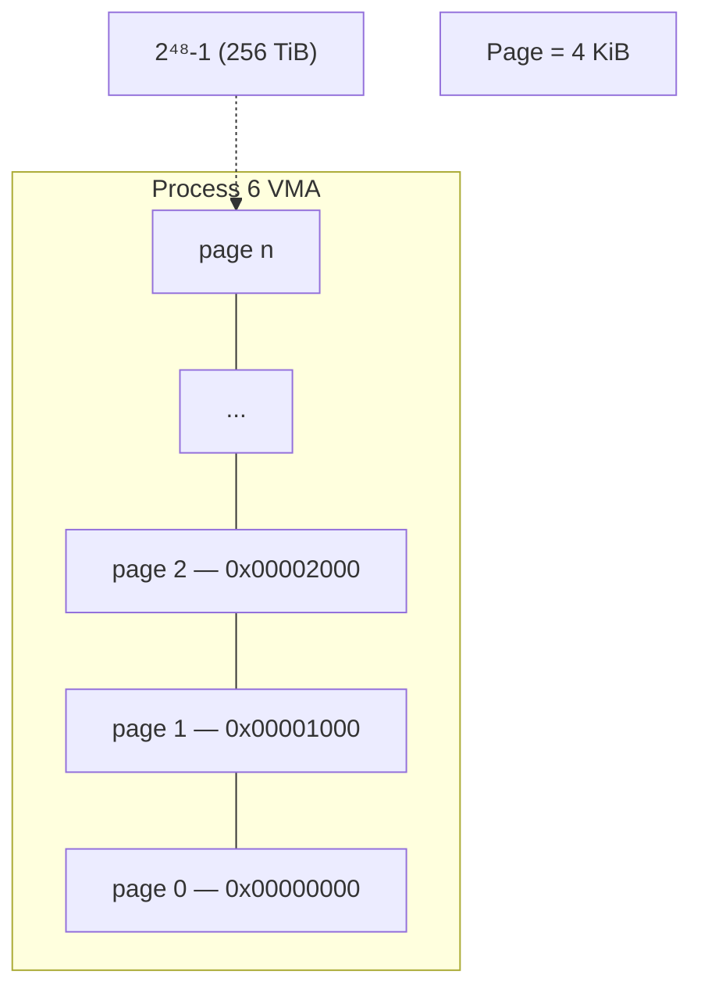
*Rasm 279. Sahifa o'lchamidagi bloklarga tashkil etilgan jarayon virtual xotirasi*

Har bir sahifa sahifa o'lchamining karralisi (multiple) bo'lgan manzildan boshlanadi. 4 KiB sahifa o'lchami uchun bu 4096 baytning karralilari (`0x1000` o'n oltilik sanoqda); 16 KiB sahifa o'lchami uchun bu 16384 baytning karralilari (`0x4000`). Agar berilgan sahifa ichidagi har qanday baytga tegsangiz, OS butun sahifani fizik xotira bilan qo'llab-quvvatlaydi.

Mashinangizning sahifa o'lchamini bir necha usulda tekshirishingiz mumkin. Masalan, macOS'da (Apple Silicon, arm64):

```bash
$ sysctl -n hw.pagesize
16384

$ getconf PAGE_SIZE
16384

$ pagesize
16384
```

Jarayon virtual manzilga tekkanida, kichik hodisalar ketma-ketligi sodir bo'ladi:

1. MMU CPU'ning tezkor tarjima keshini (fast translation cache — TLB) tekshiradi va u shu manzil RAM'da qayerda yashashini allaqachon bilishini tekshiradi.
2. Agar kesh o'tkazib yuborilsa (cache misses), MMU sekin yo'lni (slow path) tanlaydi va moslashtirishni topish uchun xotiradagi sahifa jadvallarini aylanib chiqadi.
3. Agar moslashtirish mavjud bo'lsa va ruxsatlar ruxsat bersa, MMU virtual manzilni fizik manzilga tarjima qiladi va murojaat davom etadi.
4. Agar moslashtirish mavjud bo'lmasa yoki ruxsatlar ruxsat bermasa, MMU CPU'ni to'xtatadi va "sahifa xatosi" (page fault) istisnosini ko'taradi.

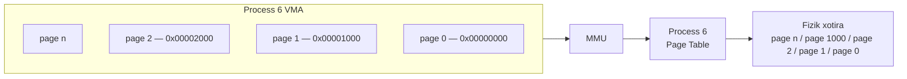
*Rasm 280. MMU jarayonning virtual sahifalarini fizik sahifalarga tarjima qiladi*

Bizning Go misolimizda, manzil ilova `buf := make([]byte, 1<<30)` bilan band qilgan mintaqa ichiga tushadi, shuning uchun murojaat yaroqli. Yadro haqiqiy RAM ajratadi (anonim xotira uchun nolga to'ldirilgan sahifa), sahifa jadvallarini yangilaydi va bajarishni davom ettiradi. Bu ajratishingizning xotira ishlatilishi biroz oshganini ko'radigan paytdir.

Bu mexanizm talab bo'yicha sahifalash (demand paging) deb ataladi. G'oya oddiy: OS virtual sahifaga dastur unga aslida tegmaguncha haqiqiy fizik xotira bermaydi. Birinchi murojaat sahifa xatosini ishga tushiradi, va yadro shu xatoni sahifani xotira bilan qo'llab-quvvatlash orqali hal qiladi. E'tibor bering, sahifa xatosi shunchaki CPU xotira murojaatini yakunlay olmaganini bildiradi. U boshqa sabablarga ko'ra ham sodir bo'lishi mumkin, masalan ruxsatni buzish (permission violation).

Bu dangasa ajratish (lazy allocation) tufayli, jarayonning virtual manzil maydoni mavjud RAM'dan ancha katta bo'lishi mumkin. Faqat aslida murojaat qilingan mintaqalar fizik sahifalarni oladi, va operatsion tizim kerak bo'lganda nofaol mintaqalarni qaytarib olishi yoki sahifaga chiqarishi (page out) mumkin.

> **Fizik xotirani diskka chiqarish (Swapping out)**
>
> Yuqoridagi misollarda, sahifa xatosi sahifa yaroqli bo'lgani, ammo hali qo'llab-quvvatlanmagani uchun sodir bo'ldi. Sahifa xatosi boshqa sabablarga ko'ra ham sodir bo'lishi mumkin, masalan diskka chiqarilgan sahifa (swapped-out page) yoki yaroqsiz murojaat. Xo'sh, diskka chiqarish (swapping) nima?
>
> RAM bosim ostida bo'lganda, OS yaqinda ishlatilmagan sahifalarni tanlab xotirani qaytarib olishi mumkin. Bu ko'pincha "qurbon" (victim) sahifani tanlash sifatida tasvirlanadi.
>
> Agar qurbon sahifa toza (clean — o'zgartirilmagan) bo'lsa, OS odatda uni tashlab yuborishi mumkin. Faylga asoslangan sahifalar keyinroq fayldan qayta yuklanishi mumkin, va toza anonim sahifalar ko'pincha nolga to'ldirilgan sahifalar sifatida qayta yaratilishi mumkin. Agar sahifa iflos (dirty — o'zgartirilgan) bo'lsa, OS fizik freymni qayta ishlatishdan oldin uning mazmunini biror joyga saqlashi kerak. Bu "biror joy" — diskdagi swap maydoni (swap space), va sahifani chiqarib yozish — bu swap-out.
>
> Sahifaning mazmuni diskda xavfsiz bo'lgach (yoki hech narsa saqlash kerak bo'lmasa), fizik freym bo'shatiladi va boshqa sahifa uchun qayta ishlatilishi mumkin.
>
> Agar jarayon keyinroq shu sahifaga yana murojaat qilsa, CPU sahifa xatosini ko'taradi, chunki sahifa endi mavjud (present) deb belgilanmagan. OS xatoni sahifani swap'dan bo'sh freymga qaytarib o'qish (swap-in) orqali hal qiladi, sahifa jadvallarini yangilaydi va jarayonni davom ettirishga ruxsat beradi.

Biz hali javob bermagan bitta savol bor: virtual manzil maydoni qanchalik katta? Siz 64-bitli mashinalarda "48-bitli virtual manzillar" haqida gapiradigan diagrammalarni ko'rgan bo'lishingiz mumkin.

x86-64'da ko'rsatkichlar 64 bit kenglikda, shuning uchun nazariy jihatdan siz 2⁶⁴ baytli virtual manzil maydonini kutishingiz mumkin. Amalda, apparat hatto manzillash uchun barcha 64 bitni ishlatmasligi mumkin. An'anaviy ravishda, x86-64 "kanonik manzil" (canonical address) qoidasi bilan 48-bitli virtual manzillashni ishlatadi (yuqori bitlar belgili kengaytirilgan (sign-extended) bo'lishi kerak). Yangi CPU'lar ko'proqni qo'llab-quvvatlashi mumkin (masalan, 57-bitli manzillash), ammo foydalanuvchi jarayoni aslida nimani olishi baribir OS konfiguratsiyasiga bog'liq. Har qanday holatda, hatto 48-bitli manzillash ham allaqachon juda katta: 2⁴⁸ bayt — bu 256 TiB.

arm64'da ko'pgina tizimlar ham 48-bitli foydalanuvchi virtual manzil diapazonini ishlatadi, va ba'zi konfiguratsiyalar kattaroq diapazonlarni (52-bitli virtual manzillashgacha, bu 4 PiB) qo'llab-quvvatlaydi. Go ish vaqtining o'zi odatda ko'pgina 64-bitli platformalarda 48-bitli heap manzil maydonini taxmin qiladi, va uning ajratuvchi ma'lumotlar tuzilmalari (allocator data structures) shu chegara atrofida quriladi.

Endi virtual manzil fizik manzilga qanday tarjima qilinishiga nazar tashlaymiz.

Virtual xotira sahifa o'lchami 4 KiB (2¹² bayt) deb faraz qilaylik. 48-bitli virtual manzilning eng past 12 biti sahifa ichidagi ofsetni (offset) ifodalaydi, va yuqori 36 bit manzil qaysi virtual sahifaga tegishli ekanligini ko'rsatadi. Quyidagi diagramma umumiy tuzilishni ko'rsatadi:

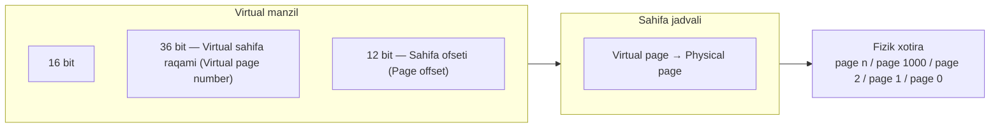
*Rasm 281. Virtual sahifa raqami va sahifa ofsetining taqsimoti*

> **ESLATMA**
>
> Bu sahifa jadvali qidiruvining (page-table lookup) soddalashtirilgan ko'rinishi. 4 KiB sahifalar bilan 48-bitli virtual manzil maydoni uchun bitta tekis sahifa jadvali (flat page table) yuzlab gigabayt xotira talab qilardi, hatto jarayon o'z manzil maydonining juda kichik qismini ishlatsa ham.
>
> Masalan, 2³⁶ sahifa marta 8 baytli sahifa-jadval yozuvi (page-table entry) 2³⁹ bayt, bu 512 GiB.
>
> Amalda, 36 bit bir nechta darajadagi sahifa jadvallari bo'ylab ishlatiladigan bir nechta bo'laklarga (ko'pincha 9-bitli guruhlarga) bo'linadi, shuning uchun faqat aslida kerak bo'lgan qismlar xotira oladi.

`0x000000012340` kabi virtual manzilni olaylik:

1. 4 KiB sahifalar bilan, pastki 12 bit (`0x340`, bu o'nlik sanoqda 832) ofsetni hosil qiladi. Bu manzil o'z sahifasi ichidagi 832-baytga ishora qilishini bildiradi.
2. Shu 12 bitdan yuqoridagi hamma narsa virtual sahifa raqami, bu `0x12` (o'nlik sanoqda 18).
3. OS virtual sahifa 18'ni fizik sahifa 163'ga moslashtiradi deb faraz qilaylik.
4. Keyin CPU fizik manzilni fizik sahifa raqamini (163) ofset (832) bilan birlashtirib hosil qiladi. Natijaviy fizik manzil `0x0000000A3340`.

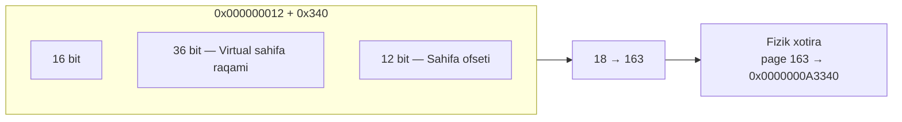
*Rasm 282. Virtual-fizik manzil moslashtirishining bosqichma-bosqich misoli*

64-bitli tizimda virtual manzil 64 bit kenglikda. Xotira dumplarida (memory dumps), registrlarda yoki ko'rsatkich arifmetikasida (pointer arithmetic) siz har doim to'liq 64-bitli qiymatni ko'rasiz, faqat 48 bitni emas. Xo'sh, qolgan 16 bit nima uchun?

amd64'dagi keng tarqalgan 48-bitli rejimda, yuqori bitlar (47'dan 63'gacha bo'lgan bitlar) ixtiyoriy ishlatish uchun bo'sh emas. Buning o'rniga, ular belgili kengaytirish qoidasiga (sign-extension rule) ko'ra 47-bitga mos kelishi kerak:

- Agar 47-bit nol bo'lsa, 48-63 bitlar hammasi nol bo'lishi kerak.
- Agar 47-bit bir bo'lsa, 48-63 bitlar hammasi bir bo'lishi kerak.

Belgili kengaytirish qoidasini buzadigan har qanday manzil xatoni ishga tushiradi. Operatsion tizim odatda jarayonni tugatadi (masalan, segmentatsiya xatosi (segmentation fault) yoki murojaat buzilishi (access violation) bilan). Qoidaga rioya qiladigan manzil kanonik manzil (canonical address) deb ataladi.

Kanonik-manzil qoidasi tufayli, ishlatilishi mumkin bo'lgan virtual manzil maydoni ikkita diapazonga bo'linadi, ular o'rtasida katta ishlatilmaydigan "teshik" (hole) bilan:

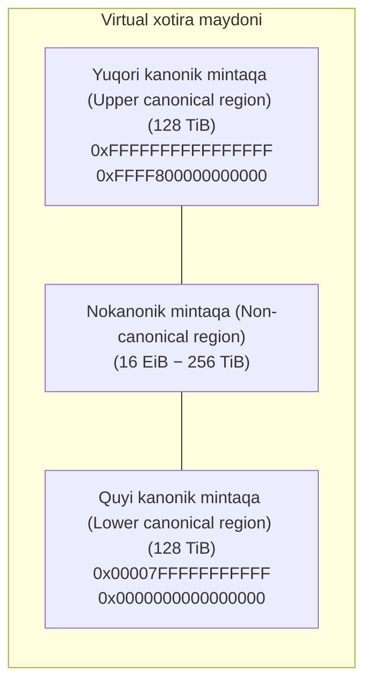
*Rasm 283. amd64 virtual xotirasida kanonik va nokanonik mintaqalar*

Yodda tutish kerak bo'lgan uchta mintaqa bor:

- **Quyi kanonik mintaqa**, bu yerda 47-bit nol. Yuqori 16 bit hammasi nol, shuning uchun manzil diapazoni `0x0000000000000000`dan `0x00007FFFFFFFFFFF`gacha cho'ziladi. Bu diapazonning pastki qismida to'liq 2⁴⁷ (128 TiB) uzluksiz manzil maydoni beradi.
- **Yuqori kanonik mintaqa**, bu yerda 47-bit bir. Manzillar `0xFFFF800000000000`dan boshlanadi va `0xFFFFFFFFFFFFFFFF`gacha davom etadi. Bu 64-bitli diapazonning yuqori qismida yana 2⁴⁷ baytli yaroqli maydon.
- **Nokanonik mintaqa**, bu ikkitasi o'rtasida joylashadi. `0x0000800000000000` va `0xFFFF7FFFFFFFFFFF` o'rtasidagi har qanday manzil yaroqsiz, chunki uning yuqori bitlari belgili kengaytirish qoidasiga mos kelmaydi.

Soddalik uchun, biz virtual manzil maydonini bitta mintaqa sifatida taqdim etamiz va quyi hamda yuqori kanonik diapazonlar o'rtasida farq qilmaymiz.

> **ESLATMA**
>
> E'tibor bering, "kanonik manzil" qoidasi amd64 tafsiloti. amd64'da virtual manzillar odatda 64 bitga belgili kengaytirilishi kerak bo'lgan 48-bitli qiymatlardir, shuning uchun yuqori bitlar 47-bitga mos kelishi kerak. Bu manzil maydonining yuqori yarmini hosil qiladi, agar siz ko'rsatkichlarni belgili (signed) deb hisoblasangiz, salbiy ko'rinadi.
>
> Go'ning heap indekslashi (heap indexing) buni izchil tarzda boshqarishi kerak, shuning uchun ish vaqti manzilni arena indeksiga (arena index) aylantirishdan oldin ruxsat etilgan ofsetni (`arenaBaseOffset`) qo'llaydi.
>
> arm64'da foydalanuvchi manzillari odatda quyi 48-bitli diapazonda va nolga kengaytirilgan (zero-extended), shuning uchun bu belgili kengaytirish muammosi paydo bo'lmaydi. AIX/ppc64'da `mmap` odatda `0x0a00000000000000` kabi yuqori diapazonda manzillar qaytaradi, shuning uchun Go ham u yerda o'z heap manzil maydonini (`heapAddrBits`) kichik va bashorat qilinadigan saqlash uchun ofset ishlatadi.

### Go virtual xotirani qanday boshqaradi

Go dasturi 64-bitli tizimda ishga tushganda, operatsion tizim unga shaxsiy virtual manzil maydonini beradi. Go ish vaqti bu butun maydonni to'g'ridan-to'g'ri boshqarishga urinmaydi. Buning o'rniga, u Go heapi uchun chegaralangan "heap manzil maydoni"ni (heap address space) (ko'pincha 48 bit, bu taxminan 256 TiB virtual diapazon) taxmin qiladi va o'z ajratuvchi ma'lumotlar tuzilmalarini shu taxmin atrofida quradi:

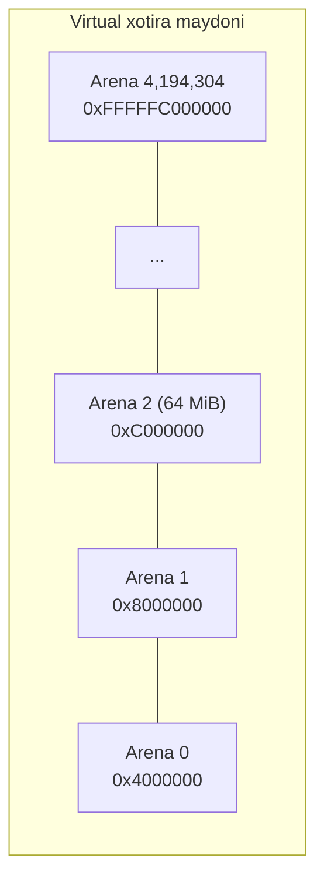
*Rasm 284. 64 MiB virtual xotira arenalariga bo'lingan Go heapi*

Heap arena deb ataladigan ruxsat etilgan o'lchamli birliklarga (fixed-size units) tashkil etilgan. Ko'pgina 64-bitli platformalarda har bir arena 64 MiB. 256 TiB heap manzil maydoni bilan, shu diapazon bo'ylab joylashtirilgan 4,194,304 ta mumkin bo'lgan arena slot'lari (arena slots) mavjud.

Go barcha arenalar uchun metama'lumotni oldindan ajratmaydi. Buning o'rniga, u har bir arena uchun bitta yozuvli katta ko'rsatkichlar jadvalini (table of pointers) saqlaydi. Ishga tushishda barcha yozuvlar `nil`. Heap o'sganda va ish vaqti yangi arenadan foydalanishga qaror qilganda, u shu arena uchun manzil maydonini band qiladi (reserves), bitta `heapArena` metama'lumot obyektini ajratadi va uning ko'rsatkichini mos jadval yozuviga saqlaydi.

Ish vaqti yangi arenani band qilganda, u OS'dan virtual manzil maydonining bo'lagini hali murojaat qilib bo'lmaydigan qilib band qilishni so'raydi. POSIX tizimlarida bu odatda `PROT_NONE` ishlatadigan anonim `mmap` bilan amalga oshiriladi, bu "diapazonni band qil, ammo har qanday murojaat xatoga olib kelishi kerak" degani. OS shu diapazonni jarayonning virtual manzil maydonida yozib qo'yadi:

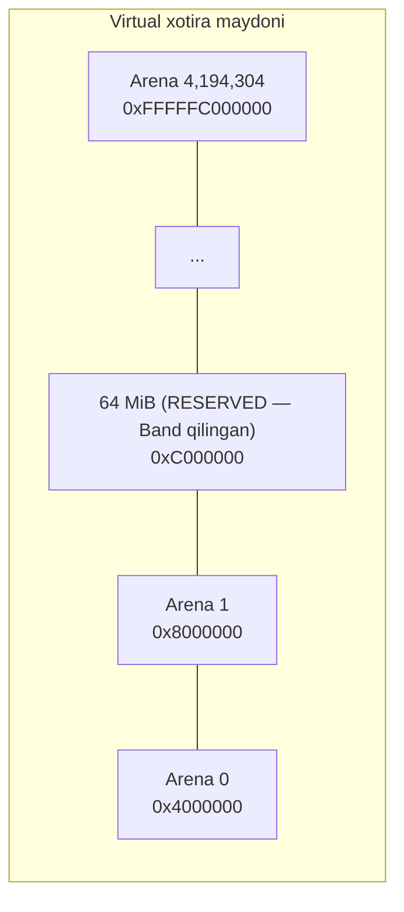
*Rasm 285. Go ajratishdan oldin virtual xotira arenalarini band qiladi*

Bu mintaqa o'qiladigan yoki yoziladigan emas, va Go uni `Reserved` (Band qilingan) deb kuzatadi; shu diapazonda o'qish, yozish yoki bajarishga urinish darhol xatoga olib keladi, chunki CPU shu sahifalarda hech qanday murojaat ruxsatini ko'rmaydi, va operatsion tizim `SIGSEGV` yoki `SIGBUS` kabi murojaat-buzish signalini (access-violation signal) yetkazadi. Agar hech narsa signalni qayta ishlamasa, jarayon tugaydi, va Go dasturida ish vaqti odatda `SIGSEGV: segmentation violation` kabi xabarni chop etadi va keyin bekor qiladi (abort).

> **ESLATMA**
>
> `Reserved`, `Prepared` va `Ready` — bu Go ish vaqti xotirani "shunchaki band qilingan manzil maydoni" va "murojaat qilish xavfsiz" o'rtasida qanday o'tkazishini tasvirlash uchun ishlatadigan nomlar. Turli operatsion tizimlar bu o'tishlarni turlicha amalga oshiradi, ammo yuqori darajadagi holatlar bir xil.

Go kodi arenadan xotira ishlatishidan oldin, ish vaqti shu manzil diapazonini "band qilingan"dan "murojaat qilinadigan"ga o'tkazadi (odatda `Reserved`'dan `Prepared`'ga, keyin `Ready`'ga yo'l orqali).

Dastur ko'proq xotiraga muhtoj bo'lganda, ish vaqti uni sahifalar (pages) deb ataladigan birliklarda taqdim etadi. Go ish vaqtida sahifa ko'pgina arxitekturalarda odatda 8 KiB. Bu ish vaqti darajasidagi tushuncha va operatsion tizimning fizik sahifa o'lchami bilan bir xil emas. Bundan keyin, biz "sahifa" deganimizda, agar aniq "fizik sahifa" demasak, Go ish vaqti sahifasini nazarda tutamiz.

Go heapidan sahifalarni so'raydigan komponent — sahifa ajratuvchi (page allocator). U xotirani sahifa o'lchamidagi birliklarda boshqaradi, ammo u har doim bitta sahifa so'ramaydi. Buning o'rniga, u so'rovlarni eng yaqin palloc bo'lagi (palloc chunk) karralisigacha yumaloqlaydi (rounds up), bu 4 MiB:

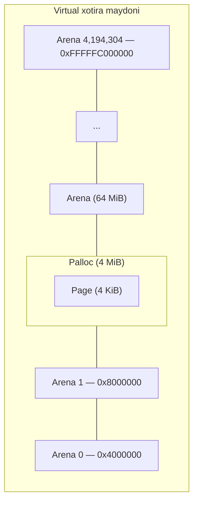
*Rasm 286. 4 MiB palloc bo'laklariga bo'lingan Go arenasi*

Palloc bo'lagi — sahifa ajratuvchining hisob-kitob bloki (bookkeeping block), arenaning ruxsat etilgan o'lchamli bo'lagi. Ajratuvchi baribir xotirani ish vaqti sahifalarida taqdim etadi, ammo u bo'sh joy va tozalash holatini (scavenging state) bo'lak o'lchamidagi xulosalarda (chunk-sized summaries) kuzatadi, shuning uchun u "bu bo'lakda biror bo'sh sahifa bormi?" kabi savollarga tez javob bera oladi.

Har bir arena 4 MiB palloc bo'laklariga bo'linadi, ya'ni har biri 8 KiB bo'lgan 512 ish vaqti sahifasi. Har bir palloc bo'lagi uchun ish vaqti qaysi sahifalar bo'sh, ishlatilmoqda yoki allaqachon operatsion tizimga qaytarilganligini (released back) yozib oluvchi bitmap holatini (bitmap state) saqlaydi.

> **ESLATMA**
>
> Yuqoridagi diagramma konseptual illyustratsiya, aniqlik va o'qitish maqsadlari uchun soddalashtirilgan va miqyosda chizilmagan. Palloc bo'lagi ham, sahifa ham o'zlarining ota-mintaqasining (parent region) boshlang'ich nuqtasidan boshlanadigan qilib ko'rsatilgan.

Keling, dasturingiz yangi 6 MiB span (oraliq) so'raganda nima sodir bo'lishini ko'rib chiqamiz:

1. Ajratuvchi avval shu o'lchamni ish vaqti sahifalariga aylantiradi. Har bir ish vaqti sahifasi 8 KiB bo'lgani uchun, 6 MiB = 6 MiB ÷ 8 KiB = 768 sahifa.
2. Agar sahifa ajratuvchining zaxirasi tugagan bo'lsa (out of stock), u heap ajratuvchidan (heap allocator) o'sishni so'raydi.
3. Ish vaqti so'rovni o'zining granulyarlik birligiga (granularity unit), ya'ni palloc bo'lagiga, bu 512 sahifa (4 MiB), moslashtiradi. 768 sahifa 512'ning karralisi bo'lmagani uchun, ajratuvchi 1,024 sahifagacha yumaloqlaydi. Shuning uchun heap ajratuvchiga uzatiladigan so'rov 1,024 sahifa, ya'ni 8 MiB virtual xotira, garchi span dastlab atigi 6 MiB ga muhtoj bo'lsa ham.
4. Heap o'sgandan keyin, 6 MiB span ajratish shu 8 MiB mintaqadan 768 sahifa iste'mol qiladi. Qolgan 256 sahifa bo'sh qoladi va kelajakdagi span'lar uchun mavjud bo'ladi.

Yumaloqlashdan keyin, heap shu 8 MiB bo'lagini `Reserved`'dan `Prepared`'ga o'tkazib o'sadi. Ish vaqtida bu `sysMap` orqali amalga oshiriladi. POSIX tizimlarida bu odatda manzil diapazonini o'qish-yozish sifatida moslashtirishga (mapping) to'g'ri keladi, shuning uchun u keyinroq ishlatilishi mumkin, uning mazmuni esa "hali ishlatish uchun majburiy ajratilmagan" (not yet committed for use) deb hisoblanadi:

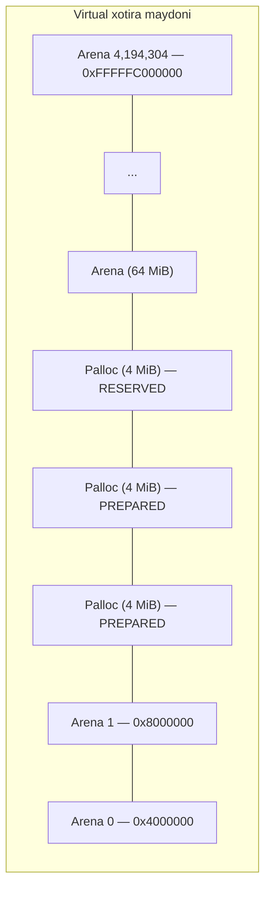
*Rasm 287. Ajratish vaqtida Reserved palloc bo'laklari Prepared'ga ko'tariladi*

Heap sahifa ajratuvchiga 8 MiB yangi `Prepared` manzil maydonini beradi va arenada hali ham 56 MiB `Reserved` manzil maydonini ushlab turadi. Bu jarayon heap o'sishi (heap growth) deb ataladi. Agar joriy arena so'rovni qondira olmasa, ish vaqti OS'dan yangi arena band qiladi va jarayonni takrorlaydi.

Sahifa ajratuvchi keyin shu manzil diapazoni uchun o'z metama'lumotini yangilaydi. Yangi o'stirilgan heap xotirasi ish vaqti unga aslida muhtoj bo'lguncha allaqachon tozalangan (scavenged — bo'shatilgan) deb hisoblanadi, shuning uchun bu xotirani birinchi ishlatish OS sahifalarni fizik RAM bilan qo'llab-quvvatlaganda sahifa xatolariga olib kelishi mumkin.

Oddiy Go kodida siz faqat ish vaqti siz uchun ajratgan xotiraga murojaat qilasiz. Agar xatoli kod (masalan, `unsafe` orqali yoki chegaradan tashqari ko'rsatkich arifmetikasi orqali) `Prepared`, ammo hali ajratilmagan diapazondagi xotiraga tegsa, u fizik sahifalarni erta ravishda xatoga olib kelishi (fault in) va RSS'ni oshirishi mumkin, dangasa qo'llab-quvvatlash va tozalash maqsadini buzgan holda.

> **Scavenged Memory (Tozalangan xotira) nima?**
>
> Go ajratishlar uchun ko'proq xotira kerakligini hal qilganda, u ba'zi manzil maydonini ishlatilishi mumkin bo'lgan holatga o'tkazadi. OS'ga qarab, bu sahifalarni moslashtirish, ularni majburiy ajratish (committing) yoki ikkalasini ham o'z ichiga olishi mumkin. Ammo keyinroq, xotira yana bo'sh bo'lganda, Go RSS'ni (jarayon ishlatadigan fizik RAM) virtual manzillardan butunlay voz kechmasdan kamaytirishni xohlaydi.
>
> Tozalash (Scavenging) — bu ish vaqti virtual manzil maydonini bo'shatmasdan fizik qo'llab-quvvatlashni (physical backing) bo'shatadigan qadam. Go atamalarida, u hali ham jarayonga moslashtirilgan heap xotirasini oladi va OS'ga fizik sahifalar endi kerak emasligini aytadi. Virtual manzil diapazoni Go heapining bir qismi bo'lib qoladi, ammo OS RAM'ni qaytarib olishi mumkin.
>
> Ish vaqtining holat modelida, tozalash `Ready`'dan `Prepared`'ga o'tish bo'lib, `sysUnused` tomonidan amalga oshiriladi. Ko'pgina Unix'ga o'xshash tizimlarda `sysUnused` `madvise` bilan amalga oshiriladi, masalan `MADV_FREE` yoki `MADV_DONTNEED`. Tozalashdan keyin, bir xil manzillarni keyinroq yana ishlatish mumkin. Bu sodir bo'lganda, OS yana fizik sahifalarni ta'minlashi kerak bo'lishi mumkin, shuning uchun keyingi murojaat xatoga olib kelishi yoki OS xatti-harakatiga qarab nolga to'ldirilgan sahifalarni kuzatishi mumkin.

Endi heap ajratuvchi va sahifa ajratuvchi o'rtasidagi munosabatni aniqlashtiraylik. Heap ajratuvchi (`mheap`) Go heapiga, jumladan arenalar va span'larga egalik qiladi. Sahifa ajratuvchi (`mheap.pages`) `mheap` ichida yashaydi va ish vaqti sahifasi darajasida bo'sh hamda ishlatilayotgan xotirani kuzatadi, tez qidirish va tozalash uchun bo'lak o'lchamidagi xulosalar bilan. Sahifa ajratuvchi o'zi boshqarayotgan heapdan so'rovni qondira olmaganda, ish vaqti OS'dan ko'proq arena maydonini band qilib yoki moslashtirib heapni o'stiradi, keyin shu yangi manzil diapazoni uchun sahifa ajratuvchining metama'lumotini yangilaydi.

Palloc bo'lagi — sahifa ajratuvchi heap ajratuvchidan ko'proq xotira so'rash uchun ishlatadigan birlik. Biroq, Go ajratishlarni boshqarish uchun ishlatadigan yanada fundamental birlik — bu span.

Span — ma'lum bir o'lcham sinfi (size class) uchun ajratishlar uchun birga boshqariladigan uzluksiz sahifalar mintaqasi. Arenani palloc bo'laklaridan tashkil topgan deb o'ylash o'rniga, uni ko'plab span'lardan tashkil topgan deb tasavvur qiling:

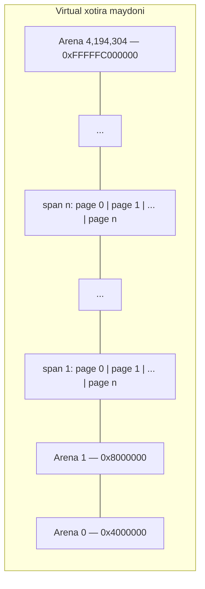
*Rasm 288. Uzluksiz sahifalar span'lariga tashkil etilgan Go heapi*

Span o'lchamlari turlicha. Span bitta ish vaqti sahifasi kabi kichik bo'lishi mumkin, yoki u ko'plab sahifalarni qamrab olishi mumkin. Span'ning sahifa soni (`s.npages`) ish vaqti shu span'ni ajratganda tanlanadi.

Span'lar kerak bo'lganda, ish vaqti sahifa ajratuvchidan span hosil qilish uchun `n` sahifa so'raydi. Bu sahifalar avval tozalangan (`Prepared`) ba'zilarini o'z ichiga olishi mumkin. Bu holda, ish vaqti tozalangan qismni `Ready`'ga qaytaradi, `sysUsed()` ishlatib (bu Windows kabi platformalarda majburiy ajratish qadami), uni ajratishlar uchun ishlatishdan oldin.

`Ready` ish vaqti xotirani murojaat qilish xavfsiz deb hisoblashini bildiradi. OS aslida fizik sahifalarni darhol ajratadimi yoki faqat birinchi tegishda (first touch) ajratadimi, bu platformaga bog'liq. Ish vaqtining qancha xotira `Ready` ekanligi haqidagi hisob-kitobi GC va xotira-chegarasi xatti-harakati uchun baribir muhim, garchi u istalgan paytda fizik jihatdan rezident (resident) bo'lgan narsaning faqat taxminiy bahosi bo'lsa ham.

> **ESLATMA**
>
> Windows'da (va ba'zi boshqa tizimlarda), OS band qilingan sahifaga murojaat qilishdan oldin aniq majburiy ajratishni (explicit commit) talab qiladi. Majburiy ajratilmagan sahifaga (uncommitted page) tegish yaroqsiz va xatoga olib keladi.

Span keyin ko'plab teng o'lchamli obyekt slot'lariga (object slots) bo'linadi. Dasturingiz obyekt ajratganda, ish vaqti shu slot'lardan birini taqdim etadi. Berilgan span ichidagi barcha obyektlar bir xil o'lchamda (span o'lcham sinfiga bag'ishlangan), va turli span'lar turli obyekt o'lchamlariga xizmat qiladi:

```mermaid
graph TD
    subgraph S1["Span (to'liq)"]
        P1["page 0 | page 1 | ... | page n<br/>(barcha slot'lar band)"]
    end
    subgraph S2["Span (qisman bo'sh)"]
        P2["page 0 | page 1 | ... | page n<br/>(bir slot bo'sh)"]
    end
```
*Rasm 289. Teng o'lchamli ajratish obyektlariga bo'lingan span'lar*

Endi bizda umumiy manzara borligini hisobga olib, mana soddalashtirilgan ajratish yo'li (allocation path):

1. Kichik obyekt uchun (keng tarqalgan holat), ajratuvchi o'lcham sinfini tanlaydi va shu o'lcham uchun keshlangan joriy span'ni ishlatadi.
2. U shu span'dan bitta bo'sh slot'ni ajratadi.
3. Agar span'da bo'sh slot bo'lmasa, u shu o'lcham sinfi uchun boshqa span olib qayta to'ldiradi (refills).
4. Agar heap ko'proq sahifa yetkazish uchun o'sishi kerak bo'lsa, u 4 MiB palloc-bo'lak qadamlarida o'sadi.
5. Agar joriy arenada yetarli joy bo'lmasa, ish vaqti OS'dan yangi 64 MiB arena band qiladi va davom etadi.

```mermaid
graph LR
    OBJ["Object"] --> SPAN["Span<br/>page 0 | page 1 | ... | page n"]
    SPAN --> PALLOC["Palloc chunk<br/>4 MiB / 4 MiB"]
    PALLOC --> ARENA["Arena<br/>64 MiB"]
```
*Rasm 290. Go heap ajratish ierarxiyasi: obyekt, span, palloc, arena*

Go heapidagi har bir arena bitta uzluksiz blok (masalan, 64 MiB), ammo butun heap bitta uzluksiz mintaqa bo'lishi kafolatlanmagan. Ketma-ket arenalar virtual manzil maydonida qo'shni bo'lmasligi mumkin. Agar ish vaqti mavjud xaritaga (masalan, oqim steki) mos keladigan manzilda 64 MiB band qilishni so'rasa, OS qisman arena qaytarmaydi; u so'rovni rad etadi yoki xaritani boshqa manzilga joylashtiradi.

Hozircha, biz keng tarqalgan yo'lda qoldik va ilg'or tafsilotlarni o'tkazib yubordik. Keyin, biz bu nazariyani Go'da heap ajratish aslida qanday sodir bo'lishi bilan bog'laymiz.

### Go'dagi xotira ajratish tizimi

Go'da span `mspan` turi (type) bilan ifodalanadi. `mspan` ish vaqti heap sahifalaridan tashkil topgan Go heapining uzluksiz bo'lagini boshqaradi. Joriy Go versiyalarida bitta ish vaqti heap sahifasi 8 KiB. Bu ish vaqtining birligi, operatsion tizimning fizik sahifa o'lchami emas.

Span'ni tasvirlash uchun bu asosiy maydonlarni (fields) yodda tuting:

- `startAddr`: span'dagi birinchi baytning virtual manzili
- `npages`: span qancha ish vaqti heap sahifasini qamrab oladi
- `nelems`: bu span qancha obyektni saqlay oladi
- `allocBits`: qaysi obyekt slot'lari bo'sh yoki ishlatilayotganligini kuzatuvchi bitmap
- `elemsize`: bu span'dagi har bir obyektning baytlardagi o'lchami

```mermaid
graph TD
    subgraph ARENA["Arena"]
        direction LR
        SPAN1["Span<br/>page 0 | page 1 | ... | page n"]
        SPAN2["Span<br/>page 0 | page 1 | ... | page n"]
        SPAN3["Span<br/>page 0 | page 1"]
    end
    START["startAddr"] -.-> SPAN1
```
*Rasm 291. Arena ichidagi span'larning tuzilishi*

Mana Go'da `mspan` strukturasining soddalashtirilgan versiyasi:

```go
type mspan struct {
    _      sys.NotInHeap
    next *mspan     // ro'yxatdagi keyingi span, yoki hech narsa bo'lmasa nil
    prev *mspan     // ro'yxatdagi oldingi span, yoki hech narsa bo'lmasa nil
    ...
    startAddr uintptr // span'ning birinchi baytining manzili (ya'ni s.base())
    npages    uintptr // span'dagi sahifalar soni
    ...
    nelems uint16     // span'dagi obyektlar soni
    ...
    spanclass  spanClass  // o'lcham sinfi va noscan (uint8)
    elemsize   uintptr    // sizeclass'dan yoki npages'dan hisoblanadi
    allocBits  *gcBits
    ...
}
```

Kompilyator qiymat heapda yashashi kerakligini hal qilganda, u uni ajratish uchun ish vaqtiga chaqiruv (call) chiqaradi. Shu ajratish uchun keng tarqalgan kirish nuqtasi (entry point) — `runtime.newobject()`. Biz odatda uni to'g'ridan-to'g'ri chaqirmaymiz.

Yangi qiymat yaratuvchi va unga ko'rsatkichni ishlatuvchi kod yozganimizda, kompilyator shu qiymat heapda yashashi kerakmi yoki yo'qmi hal qilish uchun escape analysis (qochish tahlili) ishlatadi. Agar ko'rsatkich joriy funksiya ichida qolsa, kompilyator qiymatni stekka joylashtirishi va ifodani lokal ishlatish uchun ko'rsatkich sifatida ko'rib chiqishi mumkin. Agar ko'rsatkich joriy funksiyadan uzoqroq yashashi mumkin bo'lsa, kompilyator qiymatni heapga ko'chiradi va `runtime.newobject()`ga chaqiruv chiqaradi.

`runtime.newobject()` keyin `runtime.mallocgc()`ni chaqiradi, bu ko'plab heap ajratish yo'llari tomonidan ishlatiladigan markaziy ajratuvchi (central allocator). Agar biz `pprof` ishlatadigan bo'lsak, biz profillarda ko'pincha `mallocgc()`ni ko'ramiz, chunki u heap ajratish uchun issiq yo'lda (hot path) joylashadi:

```go
func newobject(typ *_type) unsafe.Pointer {
    return mallocgc(typ.Size_, typ, true)
}

func mallocgc(size uintptr, typ *_type, needzero bool) unsafe.Pointer {
    ...
    if size <= maxSmallSize-mallocHeaderSize {
        if noscan && size < maxTinySize {
            // tiny object allocation (mayda obyekt ajratish)
        } else {
            // small object allocation (kichik obyekt ajratish)
        }
    } else {
        // large object allocation (katta obyekt ajratish)
    }
    ...

    return x
}
```

Bu markaziy funksiyadan ajratish uchta yo'lga bo'linadi: tiny (mayda), small (kichik) va large (katta):

- **Tiny obyektlar**: 16 baytdan kichik, va tur ko'rsatkichlarni o'z ichiga olmaydi.
- **Small obyektlar**: keng tarqalgan holat, o'lcham sinflari va span'lar tomonidan boshqariladi, odatda taxminan 32 KiB gacha, jumladan 16 baytdan kichik bo'lsa ham ko'rsatkichli obyektlar.
- **Large obyektlar**: taxminan 32 KiB dan yuqori hamma narsa, plyus 32 KiB dan biroz pastdagi kichik "kulrang maydon" (gray area), u katta deb hisoblanishi mumkin, chunki ish vaqti ba'zan ozgina qo'shimcha hisob-kitob joyiga muhtoj.

```mermaid
graph LR
    SIZE["(o'lcham, tur)"] -->|< 16 bayt| TINY["Tiny"]
    SIZE -->|16 bayt - 32 KiB| SMALL["Small"]
    SIZE -->|> 32 KiB| LARGE["Large"]
```
*Rasm 292. Obyekt o'lchami va turi bo'yicha Go heap ajratish yo'llari*

Ish vaqti kichik ajratishlarni yana o'lcham sinflariga bo'ladi. Biz kichik ajratishlardan boshlaymiz, chunki ular Go'ning xotira tizimidagi atamalar, komponentlar va ish oqimlarining (workflows) ko'pchiligini o'z ichiga oladi, bu bizga mustahkam poydevor beradi.

Ilovangiz heapda 33-baytli obyekt ajratadi deb faraz qilaylik. Bu ajratish oxir-oqibat `runtime.mallocgc` orqali o'tadi. O'lcham bilan birga, ish vaqti obyektning turini ham oladi, shuning uchun u obyekt ko'rsatkichlarni o'z ichiga oladimi yoki yo'qmi biladi:

```go
func mallocgc(size uintptr, typ *_type, needzero bool) unsafe.Pointer {}
```

Ajratuvchi ixtiyoriy bayt sonlarini taqdim etmaydi. U har bir so'rovni o'lcham sinfigacha yumaloqlaydi:

```
8     16    24    32    48    64    80    96
112   128   144   160   176   192   208   224
240   256   288   320   352   384   416   448
480   512   576   640   704   768   896   1024
1152  1280  1408  1536  1792  2048  2304  2688
3072  3200  3456  4096  4864  5376  6144  6528
6784  6912  8192  9472  9728  10240 10880 12288
13568 14336 16384 18432 19072 20480 21760 24576
27264 28672 32768
```
*Rasm 293. 67 ta kichik-obyekt o'lcham sinflari jadvali*

Bu oilalardagi har bir savat (bucket) — bu o'lcham sinfi. Agar biz 33 bayt so'rasak, ajratuvchi keyingi aniqlangan o'lcham sinfigacha yumaloqlaydi. Joriy jadvalda bu 48 bayt, shuning uchun 15 bayt slot ichida ishlatilmagan bo'lib qoladi, ya'ni 31.25%.

Go kichik-obyekt ajratish uchun 67 ta o'lcham sinfini ishlatadi. `runtime/sizeclasses.go`dagi jadval Go manba daraxtidagi (source tree) vosita tomonidan ishlab chiqariladi, ammo haqiqiy sinf o'lchamlari Go jamoasi tomonidan tanlanadi va saqlanadi:

```
// class  bytes/obj  bytes/span  objects  tail waste  max waste  min align
//     1          8        8192     1024           0     87.50%          8
//     2         16        8192      512           0     43.75%         16
//     3         24        8192      341           8     29.24%          8
//     4         32        8192      256           0     21.88%         32
//     5         48        8192      170          32     31.52%         16
//     6         64        8192      128           0     23.44%         64
//     7         80        8192      102          32     19.07%         16
//     8         96        8192       85          32     15.95%         32
//     9        112        8192       73          16     13.56%         16
//    10        128        8192       64           0     11.72%        128
...
//    65      27264       81920        3         128     10.00%        128
//    66      28672       57344        2           0      4.91%       4096
//    67      32768       32768        1           0     12.50%       8192
```
*Rasm 145. O'lcham sinfi jadvali (src/runtime/sizeclasses.go)*

Jadvaldagi har bir qator (row) bitta o'lcham sinfi:

- `bytes/obj` ustuni — bu ajratuvchi shu sinfdagi obyektlar uchun aslida taqdim etadigan slot o'lchami
- `bytes/span` ustuni — bu ish vaqti shu sinfga bir vaqtning o'zida bag'ishlaydigan span maydoni, ko'pincha kichikroq sinflar uchun bitta ish vaqti sahifasi va kattaroqlari uchun bir nechta sahifalar
- `objects` ustuni — shunchaki qancha to'liq `bytes/obj` slot bitta `bytes/span` span ichiga sig'ishi, va har qanday ortib qolgan baytlar `tail waste`da ko'rinadi
- `max waste` slot yumaloqlash va shu tail waste'ni birlashtirganda eng yomon holatdagi joy yo'qotishini xulosalaydi, va `min align` ish vaqti shu sinfdagi obyektlar uchun kafolatlaydigan minimal moslashtirishdir (alignment)

5-o'lcham sinfi uchun obyekt o'lchami 48 bayt. Bu span bitta sahifani ushlab turadi, 48-baytli obyektlarga bo'lingan. Siz 170 ta to'liq obyekt olasiz (8192 ÷ 48), kichik qoldiq ishlatilmagan holda.

```mermaid
graph TD
    subgraph SPAN["Span (o'lcham sinfi = 5), page 0"]
        direction LR
        S0["0"]
        S1["1"]
        S2["2 ... 169"]
        TW["tail waste<br/>32 bayt"]
    end
```
*Rasm 294. 48-baytli obyektlar uchun span tuzilishining misoli (sinf 5)*

Yodda tutish kerak bo'lgan ikki turdagi xotira ortiqcha sarfi (memory overhead) bor:

- **Tail waste (Dum isrofi)**: span ruxsat etilgan o'lchamli slot'larga bo'lingandan keyin uning oxiridagi ishlatilmagan qoldiq. Masalan, 170 ta obyekt marta 48 bayt 8,160 bayt, bu 8,192-baytli span'da 32 baytni ishlatilmagan qoldiradi. Bu `tail waste` ustunida ko'rinadi.
- **Internal fragmentation (Ichki fragmentatsiya)**: siz so'ragan narsa va siz aslida oladigan slot o'lchami o'rtasidagi bo'shliq. 33 bayt so'rab, 48-baytli slot olish slot ichida 15 baytni isrof qiladi, bu 31.25%. `max waste` ustuni bu effektning to'liq span plyus tail waste bo'ylab eng yomon holatdagi kombinatsiyasini o'z ichiga oladi, shuning uchun u biroz yuqoriroq bo'lishi mumkin, masalan 5-sinf uchun 31.52%.

```mermaid
graph TD
    subgraph SPAN["Span (o'lcham sinfi = 5), page 0"]
        direction LR
        S["0 | 1 | 2 | 3 | 4 | 5 ... (48 bayt)"]
    end
    W1["15 bayt isrof qilingan (31.25%)"]
    W2["33 bayt ishlatilgan"]
    W1 -.-> SPAN
    W2 -.-> SPAN
```
*Rasm 295. Go span'laridagi ichki fragmentatsiya va dum isrofi*

67 ta kichik-obyekt o'lcham sinfi, plyus katta ajratishlar uchun signal o'lcham sinfi (sentinel size class) 0 bor. Span'lar keyin ular ko'rsatkichlarni o'z ichiga olishi mumkinmi yoki yo'qmi bilan farqlanadi. Ish vaqti buni span sinfi (span class) sifatida kodlaydi, bu o'lcham sinfini noscan/scan biti (no pointers vs. pointers) bilan birlashtiradi:

```mermaid
graph LR
    subgraph SC["Span class (uint8)"]
        direction LR
        B["0 | 0 | 0 | 0 | 0 | 0 | 0 — size class ID (0..67)"]
        S["0 — scan/noscan"]
    end
```
*Rasm 296. O'lcham sinfi va scan ma'lumotini birlashtiruvchi span sinfi tuzilishi*

Ish vaqtida span sinfi o'lcham sinfi raqamiga bitta qo'shimcha bit qo'shilib hisoblanadi. Konseptual jihatdan, bu o'lcham sinfi bir bitga chapga siljitilgan (shifted left), va eng past bit `noscan` uchun 1 va `scan` uchun 0. Bu `scan` sinflari juft sonlar va `noscan` sinflari toq sonlar ekanligini bildiradi:

- `scan` span sinflari: juft qiymatlar 0, 2, 4, va h.k. 134'gacha. 0 qiymati katta ajratishlar uchun saqlangan.
- `noscan` span sinflari: toq qiymatlar 1, 3, 5, 7, va h.k. 135'gacha. 1 qiymati katta ajratishlar uchun saqlangan.

```mermaid
graph LR
    SC1["Size class 1"] -->|scan| SC2["Span class 2<br/>...1 | 0 (noscan bit)"]
    SC1 -->|noscan| SC3["Span class 3<br/>...1 | 1 (noscan bit)"]
```
*Rasm 297. Ko'rsatkich skanerlash uchun juft va toq span sinflari*

> **ESLATMA**
>
> Span sinflari 0 va 1 katta ajratishlar uchun saqlangan. Ular 32 KiB dan kattaroq ixtiyoriy o'lchamlar uchun signal bo'lgan 0-o'lcham sinfiga to'g'ri keladi.

Bu bizga kichik obyektlar uchun 134 ta span sinfini beradi: har bir o'lcham sinfiga ikkitadan, 67 ta o'lcham sinfi bo'ylab. Katta ajratishlar uchun saqlangan yana 2 ta span sinfi bor. Axlat yig'uvchi keyin `noscan` span'larini butunlay skanerlashni o'tkazib yuborishi mumkin.

Hatto ikkita span bir xil obyekt o'lchamiga ega bo'lsa ham, `noscan` span va `scan` span turli sinflar sifatida ko'riladi. `noscan` span ko'rsatkichlarni o'z ichiga olishi mumkin bo'lgan obyekt uchun ajratishni qondira olmaydi, va `scan` span `noscan` ajratishni qondira olmaydi.

Bu birliklarning barchasi uchta asosiy o'yinchi tomonidan boshqariladi: har bir P uchun kesh (per-P cache) `mcache`, markaziy ajratuvchi `mcentral`, va heap ajratuvchi `mheap`. Biz har bir P uchun kichik-obyekt keshi `mcache`dan boshlaymiz:

```go
type mcache struct {
    ...
    tiny       uintptr
    tinyoffset uintptr
    tinyAllocs uintptr

    alloc [numSpanClasses]*mspan
    stackcache [_NumStackOrders]stackfreelist
    ...
}
```
*Rasm 146. mcache struct (src/runtime/mcache.go)*

Avval biz M-P-G modelini ko'rib o'tdik. Go ish vaqtida har bir mantiqiy protsessor (logical processor), ya'ni P, kichik ajratishlar uchun o'zining lokal keshiga ega. Bu kesh `mcache`. U har bir span sinfi uchun bitta faol `mspan` ko'rsatkichini ushlab turadi, shuning uchun ko'plab kichik ajratishlar hech qanday ulashilgan global strukturaga (shared global structure) tegmasdan yakunlanishi mumkin.

> **ESLATMA**
>
> Har bir P uchun keshda (`mcache`) ajratishni boshqaradigan ikkita struktura bor: kichik-obyekt ajratish keshi (`alloc`) va mayda-obyekt ajratish keshi (`tiny`). Biz mayda ajratishlarni keyinroq batafsil ko'rib chiqamiz; hozircha, kichik-obyekt ajratish keshiga e'tibor qarating.

Gorutin P'da ishlab turganda va kichik obyektga muhtoj bo'lganda, u odatda uni to'g'ridan-to'g'ri shu P'ning `mcache`'sidan oladi. Bu yo'l odatda qulflarga muhtoj emas, chunki `mcache` har bir P uchun va faqat shu P'da hozir ishlab turgan gorutin tomonidan ishlatiladi.

Ajratuvchi keshi (`mcache.alloc`) — span sinfi bo'yicha indekslangan massiv; har bir yozuv shu sinf uchun faol span'ga ishora qiladi:

```mermaid
graph TD
    PMG["P → M → G"]
    subgraph MCACHE["mcache.alloc"]
        A2["alloc[2] → mspan (span class 2)"]
        A3["alloc[3] → mspan (span class 3)"]
        DOTS["..."]
        A135["alloc[135] → mspan (span class 135)"]
    end
    PMG --- MCACHE
```
*Rasm 298. Har bir P tezkor kichik ajratishlar uchun lokal span'larni ushlab turadi*

Muhokama qilganimizdek, span ko'plab obyektlarga bo'linadi. Har bir faol span kichik ajratishlar uchun ko'plab bo'sh slot'lar taqdim etadi. Slot soni o'lcham sinfiga bog'liq. Masalan, bular `scan` span sinflari:

- 2-span sinfi (1-o'lcham sinfi, 8-baytli slot'lar) 8,192-baytli span'da 1,024 ta slot'ga ega
- 4-span sinfi (2-o'lcham sinfi, 16-baytli slot'lar) 8,192-baytli span'da 512 ta slot'ga ega

```mermaid
graph TD
    PMG["P → M → G"]
    subgraph MCACHE["mcache.alloc"]
        A2["alloc[2] → mspan<br/>1024 obyekt, har biri 8 bayt"]
        A3["alloc[3] → mspan (bo'sh)<br/>1024 obyekt, har biri 8 bayt"]
        A4["alloc[4] → mspan<br/>512 obyekt, har biri 16 bayt"]
        DOTS["..."]
        A135["alloc[135] → mspan<br/>1 obyekt, 32 KiB"]
    end
    PMG --- MCACHE
```
*Rasm 299. Har bir keshlangan span ko'plab ruxsat etilgan o'lchamli obyekt slot'larini ushlab turadi*

Span ishlatilayotganda allaqachon ajratilgan obyektlarni o'z ichiga olishi mumkin, diagrammada to'q kulrang (dark gray) rangda ko'rsatilgan. Ish vaqti qancha obyekt ajratilganligini kuzatadi va keyingi bo'sh slot'ni tez topish uchun ixcham bitmap holatidan foydalanadi.

Har bir P uchun kesh (`mcache.alloc[spc]`) sinf uchun span'ni faqat unda bo'sh slot bo'lguncha ushlab turadi. U to'lganda, ish vaqti shu span'ni markaziy ro'yxatlarga (central lists) qaytaradi va keshni markaziy ajratuvchidan (`mcentral`) bo'sh joyi bor boshqa span bilan qayta to'ldiradi.

#### Central Free Lists (Markaziy bo'sh ro'yxatlar)

Markaziy ajratuvchi, shuningdek markaziy bo'sh ro'yxatlar (central free lists) deb ataladi, bitta span sinfi uchun ulashilgan hovuz (shared pool). Har bir span sinfining aniq bitta `mcentral`'i bor. Har bir `mcentral` ikki guruh span'ni ushlab turadi: hali kamida bitta bo'sh obyekti bor span'lar, `partial` (qisman) deb ataladi, va bo'sh obyektlari qolmagan span'lar, `full` (to'liq) deb ataladi:

```mermaid
graph LR
    subgraph SC2["Span class 2"]
        MC2["mcentral"]
        P2["partial — hozir bo'sh slot'lari bor; ajratish uchun afzal ko'riladi"]
        F2["full — hozir bo'sh slot yo'q; tozalash yoki kelajakdagi bo'shatishlar joy yaratishi mumkinligi uchun saqlanadi"]
        MC2 --- P2
        MC2 --- F2
    end
```
*Rasm 300. Ps'lar bo'ylab ulashilgan span'larni boshqaruvchi markaziy ajratuvchi*

Mana ish vaqtidan soddalashtirilgan parcha:

```go
type mheap struct {
    ...
    central [numSpanClasses]struct {
        mcentral mcentral
        ...
    }
}

type mcentral struct {
    ...
    spanclass spanClass

    partial [2]spanSet // bo'sh obyekti bor span'lar ro'yxati
    full    [2]spanSet // bo'sh obyekti yo'q span'lar ro'yxati
}
```

Markaziy ajratuvchi protsessorlar (Ps) bo'ylab ulashiladi, shuning uchun uning operatsiyalari parallellik (concurrency) ostida xavfsiz bo'lishi kerak. Go har bir span sinfini alohida saqlash va `spanSet`ni asosiy konteyner sifatida ishlatish orqali bitta global qulfdan (single global lock) qochadi.

Keng tarqalgan holatda, span'larni surish va olib tashlash (pushing and popping) atomik operatsiyalardan (atomic operations) foydalanadi. Kichik qulf faqat `spanSet` o'zining ichki tizgini (internal spine) o'stirishi kerak bo'lganda kerak.

> **ESLATMA**
>
> Biz bu yerda to'liq algoritmga kirmaymiz. Qisqacha, `spanSet` — parallel konteyner (concurrent container) bo'lib, unda keng tarqalgan surish va olib tashlash operatsiyalari qo'pol qulf (coarse lock) o'rniga atomiklardan (atomics) foydalanadi. U faqat ichki tizgin massivini (internal spine array) o'stirishi kerak bo'lganda kichik ichki mutex'ni (internal mutex) ishlatadi, bu kamdan-kam bo'ladi.

Har bir `mcentral` mustaqil ravishda sinxronlashtiriladi va boshqalardan alohida saqlanadi. Agar yuzlab Ps `n` o'lcham sinfining span'lari ustida kurashayotgan bo'lsa, boshqa span sinflaridagi ajratishlar ta'sirlanmaydi.

Esda tuting, har bir `mcentral` ikkita ro'yxatni saqlaydi: `partial` (kamida bitta bo'sh obyekti bor) va `full` (bo'sh obyektlari qolmagan). Bu ro'yxatlarning har biri keyin ikkita span to'plamiga (span sets) bo'linadi: `swept` (tozalangan) va `unswept` (tozalanmagan).

```mermaid
graph LR
    MC["mcentral"] --> PARTIAL["Partial<br/>hozir bo'sh slot'lari bor"]
    MC --> FULL["Full<br/>hozir bo'sh slot yo'q"]
    PARTIAL --> PS["Swept<br/>joriy GC siklida allaqachon tozalangan"]
    PARTIAL --> PU["Unswept<br/>bu siklda hali tozalanmagan"]
    FULL --> FS["Swept"]
    FULL --> FU["Unswept"]
```
*Rasm 301. mcentral span'larni partial/full va swept/unswept'ga bo'ladi*

Mana `swept` va `unswept` amalda nimani anglatishi:

- **Partial-swept**: joriy axlat yig'ish siklida allaqachon tozalangan, kamida bitta bo'sh obyekti bor span'lar. Bular ajratish uchun afzal ko'riladi, chunki ular darhol ishlatilishi mumkin. Ular to'lib qolguncha yoki `mcache`'ga qaytarilguncha shu yerda qoladi.
- **Partial-unswept**: joriy axlat yig'ish siklida hali tozalanmagan, bo'sh obyektlari bor span'lar.
- **Full-swept**: joriy axlat yig'ish siklida allaqachon tozalangan, bo'sh obyektlari yo'q span'lar.
- **Full-unswept**: joriy axlat yig'ish siklida hali tozalanmagan, bo'sh obyektlari yo'q span'lar. Tozalash o'lik (dead) obyektlarni bo'shatishi va bunday span'larni partial-swept'ga ko'chirishi mumkin. Agar tozalash hech narsa topmasa, ular full-swept'ga ko'chadi.

Endi ikkita ajratuvchini bog'lash uchun har bir P uchun kichik-obyekt keshiga (`mcache`) qaytamiz.

10-span sinfi uchun P'ning `mcache`'sidagi faol span slot'lari tugadi deb tasavvur qiling. 10-span sinfi 5-o'lcham sinfining `scan` varianti bo'lib, 48-baytli slot'larni ishlatadi. Barcha 170 ta slot taqdim etilgan. P shu to'liq span'ni markaziyning full-swept to'plamiga (full-swept set) qaytaradi, keyin markaziydan 10-span sinfi uchun boshqa span so'raydi.

Agar ajratish ko'rsatkichsiz obyekt uchun bo'lsa, ish vaqti `noscan` variantini, 11-span sinfini ishlatadi.

Keling, quyidagi diagramma yordamida umumiy manzarani tushunamiz:

```mermaid
graph LR
    subgraph MCENTRAL["mcentral[10]"]
        PARTIAL_S["Partial Swept"]
        PARTIAL_U["Partial Unswept"]
        FULL_S["Full Swept"]
        FULL_U["Full Unswept"]
    end
    PMG["P → M → G"]
    subgraph MCACHE["mcache"]
        A10["alloc[10] → mspan<br/>170 obyekt, har biri 48 bayt"]
    end
    PMG --- MCACHE
    A10 -->|to'liq span qaytariladi| FULL_S
```
*Rasm 302. Markaziy ajratuvchi P'ga yangi span'lar yetkazadi*

Markaziy ajratuvchi quyidagi tartibda urinadi:

1. partial-swept to'plamidan olib tashlash (pop). Bu span'lar bo'sh slot'larga ega va joriy GC siklida allaqachon tozalangan.
2. Agar hech biri mavjud bo'lmasa, partial-unswept to'plamidan olib tashlash, ammo ishlatishdan oldin span'ni tozalash.
3. Agar hech biri mavjud bo'lmasa, full-unswept'ni tekshirish. Bu span'larni tozalash o'lik obyektlarni bo'shatishi mumkin; agar shunday bo'lsa, span'lar partial-swept to'plamiga ko'chadi va ishlatilishi mumkin.

```mermaid
graph LR
    subgraph MCENTRAL["mcentral[10]"]
        PARTIAL_S["Partial Swept ← 1"]
        PARTIAL_U["Partial Unswept ← 2"]
        FULL_S["Full Swept"]
        FULL_U["Full Unswept ← 3"]
    end
    PMG["P → M → G"] --- MCACHE["mcache"]
```
*Rasm 303. Markaziy ajratuvchida span olish tartibi*

Agar yuqoridagilarning barchasi ishlatishga yaroqli hech narsa bermasa, markaziy heapdan butunlay yangi span so'raydi.

Bitta muhim tafsilot: markaziy span'ni P'ning keshiga butunlay topshiradi. Markaziy endi shu span'ga havola ushlab turmaydi; egalik (ownership) span qaytarilguncha protsessor P'ning `mcache`'siga o'tadi.

```mermaid
graph RL
    MCENTRAL["mcentral"] -->|mspan| MCACHE["mcache"]
    GMP["G → M → P"] --- MCACHE
```
*Rasm 304. Span egaligi mcentral'dan mcache'ga o'tadi*

#### Heap Allocator (Heap ajratuvchi)

Heap ajratuvchi — oxirgi to'xtash joyi. U heap sahifalarini boshqaradi va yuqori darajadagi ajratuvchilarga xotira yetkazadi. Amalda, `mheap` — jarayonning Go heap manzil maydonini boshqaradigan ish vaqti komponenti.

Mana `mheap` Go'da qanday ko'rinishi:

```go
type mheap struct {
    ...
    lock    mutex
    pages   pageAlloc   // sahifa ajratish ma'lumotlar tuzilmasi
    allspans []*mspan  // mavjud barcha span'lar
    ...
    arenas [1 << arenaL1Bits]*[1 << arenaL2Bits]*heapArena
    ...
}
```
*Rasm 147. mheap struct (src/runtime/mheap.go)*

Heap manzil maydoni ruxsat etilgan o'lchamli arenalarga bo'linadi. Ikki darajali arena xaritasi (two-level arena map) ish vaqti ishlatishni rejalashtirgan heap manzil maydoni bo'ylab shu arenalarni indekslaydi. Bu avval muhokama qilingan virtual xotira g'oyalarini aks ettiradi, endi Go ma'lumotlar tuzilmalari sifatida ko'rsatilgan.

Arena o'lchami platformaga bog'liq. 64-bitli Windows bo'lmagan tizimlarda u odatda 64 MiB, Windows'da esa 4 MiB. Ish vaqti rejalashtirgan manzil maydoni ham platformaga bog'liq. amd64'da u odatda 48 bit, ya'ni 2⁴⁸ bayt, bu 256 TiB.

Siz ikki darajali arena xaritasini yuqoridagi `mheap` strukturasidagi `arenas` maydonida ko'rishingiz mumkin. Ko'pgina 64-bitli Windows bo'lmagan platformalarda `arenaL1Bits` 0, shuning uchun shu platformada heap manzil maydoni uchun amalda faqat bitta katta L2 jadvali (L2 table) bor.

Umuman olganda, `mheap` kichikroq keshlarni xotira bilan yaxshi to'ldirilgan holda saqlaydi, shuning uchun ko'pgina ajratish so'rovlari tez qayta ishlanishi mumkin:

```mermaid
graph LR
    NEW["newobject()"] -->|small| MCACHE["mcache"]
    MCACHE --> MCENTRAL["Central free list<br/>mcentral"]
    MCENTRAL --> MHEAP["Heap allocator<br/>mheap"]
    MHEAP --> PA["Page allocator"]
    PA --> AS["Arenas system"]
```
*Rasm 305. Kichik ajratishlar heap ajratuvchiga qanday yetib boradi*

Boshqa ajratuvchilardan farqli o'laroq, `mheap` alohida obyektlarni yoki slot'larni ajratmaydi. Uning asosiy birligi — ish vaqti heap sahifasi. U sahifalarni ajratadi, keyin ularni `mcentral` uchun span'larga guruhlaydi. Bo'sh va ishlatilgan sahifalarni kuzatadigan ma'lumotlar tuzilmasi — `mheap.pages`da saqlanadigan sahifa ajratuvchi.

Sahifa ajratuvchiga sho'ng'ishdan oldin, har bir P'ning ham kichik har bir P uchun sahifa keshiga (per-P page cache) ega ekanligini ta'kidlaymiz. U 64 ta ish vaqti sahifasigacha ushlab turishi mumkin, bu ish vaqti sahifasi 8 KiB bo'lganda 512 KiB. P juda kichik sahifalar to'plamiga muhtoj bo'lganda, ish vaqti global sahifa ajratuvchiga (global page allocator) borishdan oldin shu lokal keshni birinchi sinab ko'radi.

Agar keshda joy bo'lsa, u heap qulfini (heap lock) olmasdan sahifalarni taqdim etishi mumkin:

```mermaid
graph LR
    PMG["P → M → G"]
    subgraph MCACHE["mcache"]
        PC["Page cache: 0 | 1 | 2 ... 63<br/>512 KiB"]
    end
    PMG --- MCACHE
    MHEAP["mheap"] --> PC
```
*Rasm 306. Lokal kesh orqali qulfsiz (lock-free) sahifa ajratish yo'li*

Sahifa keshi virtual manzil maydonida uzluksiz 64-sahifali bo'lakni ifodalaydi, ammo uning ichida faqat ba'zi bo'sh sahifalar bo'lishi mumkin. Biz tasvirlayotgan ajratish yo'lida, ish vaqti bu keshni faqat kichik so'rovlar uchun, 16 sahifadan kam, ya'ni 128 KiB dan kam uchun ishlatadi.

Sahifa keshi so'rovni qondira olmaydigan ikkita holat bor:

- U bo'sh. Ish vaqti uni global sahifa ajratuvchidan (`mheap.pages`) qayta to'ldiradi, bu heap qulfini olishni talab qiladi. Qayta to'ldirish kamida bitta bo'sh sahifani o'z ichiga olgan yangi 64-sahifali bo'lakni qaytaradi.
- Unda so'ralgandan kamroq bo'sh sahifa bor. Ish vaqti global sahifa ajratuvchiga qaytadi, bu ham heap qulfini olishni talab qiladi.

Global sahifa ajratuvchi — haqiqat manbai (source of truth). U har bir sahifaning holatini kuzatadi: qaysi sahifalar hozir ishlatilayotgan span'larning bir qismi (garchi u ular qaysi aniq span'ga tegishli ekanligini bilmasa ham). U shuningdek qaysi sahifalar bo'sh, qaysilari tozalangan va OS'ga qaytarilgan, va boshqa holat ma'lumotlarini kuzatadi.

U sahifa holatini radix daraxti (radix tree) yordamida kuzatadi, bu uzluksiz massivlarda saqlanadigan ierarxik xulosa tuzilmasi:

```go
type pallocSum uint64

const summaryLevels = 5

type pageAlloc struct {
    summary [summaryLevels][]pallocSum
    ...
    // chunks
}
```

Bu massivlardagi har bir yozuv — palloc xulosasi (palloc summary) deb ataladigan paketlangan 64-bitli qiymat. U shu yozuv qamrab oladigan sahifalarning holatini tasvirlaydi.

64-bitli tizimlarda daraxtning besh darajasi (five levels) bor. Yuqorida, 0-daraja heapning juda katta mintaqalarini, har biri taxminan 16 GiB ni ifodalaydi. Har bir keyingi daraja manzil maydonini barg darajasigacha (leaf level) kichikroq birliklarga bo'ladi:

```mermaid
graph TD
    L0["pallocSum (16 GiB)"]
    L1A["pallocSum (2 GiB)"]
    L1B["pallocSum (2 GiB)"]
    L1C["pallocSum (2 GiB)"]
    L2A["pallocSum (256 MiB)"]
    L2B["pallocSum (256 MiB)"]
    L3["pallocSum (32 MiB)"]
    L4["pallocSum (4 MiB)"]
    L0 --- L1A
    L0 --- L1B
    L0 --- L1C
    L1B --- L2A
    L1B --- L2B
    L2B --- L3
    L3 --- L4
```
*Rasm 307. Heap maydoni bo'ylab sahifa ajratuvchi daraxt tuzilishi*

Har bir daraja sakkizta kichikroq bo'lakka bo'linadi:

- 0-daraja: har bir yozuv 16 GiB ni qamrab oladi.
- 1-daraja: har bir yozuv 8 x 256 MiB = 2 GiB ni qamrab oladi.
- 2-daraja: har bir yozuv 8 x 32 MiB = 256 MiB ni qamrab oladi.
- 3-daraja: har bir yozuv 8 x 4 MiB = 32 MiB ni qamrab oladi.
- 4-daraja (barg): har bir yozuv bitta bo'lak, 4 MiB (512 sahifa).

256 TiB virtual maydonni xulosalash uchun 16,384 ta 0-daraja yozuvi bor. Bu 256 TiB 16 GiB ga bo'lingan. Palloc xulosasi, `pallocSum`, uchta raqamni kodlaydi. Ular bilan ajratuvchi uchta savolga tez javob bera oladi:

1. Bu mintaqaning boshida qancha uzluksiz bo'sh sahifa bor?
2. Bu mintaqaning istalgan joyidagi uzluksiz bo'sh sahifalarning maksimal qatori (maximum run) nima?
3. Bu mintaqaning oxirida qancha uzluksiz bo'sh sahifa bor?

Har bir xulosa har biri 21 bit bo'lgan uchta maydonni paketlaydi. Shuningdek, kamdan-kam "maksimum" holati uchun maxsus marker bor, bu yerda hisob aniq 2²¹ sahifa.

```mermaid
graph TD
    subgraph PS["pallocSum (16 GiB)"]
        direction LR
        START["start (21 bit)"]
        MAX["max (21 bit)"]
        END["end (21 bit)"]
    end
    PS --- A["pallocSum (2 GiB)"]
    PS --- B["pallocSum (2 GiB)"]
    PS --- C["pallocSum (2 GiB)"]
```
*Rasm 308. Har bir xulosa start, max va end bo'sh qatorlarni kodlaydi*

Eng katta qatlam bo'lgan 0-darajani misol sifatida olaylik. Har bir element 16 GiB mintaqani ifodalaydi. 8 KiB ish vaqti sahifalari bilan, 16 GiB 2,097,152 sahifaga to'g'ri keladi. Shuning uchun har bir maydon 21 bit kenglikda, to'liq 2²¹ holatini ifodalash uchun bitta maxsus kodlash bilan.

Birinchi qarashda, `start` va `end` hisoblari ortiqcha (redundant) ko'rinishi mumkin. Ular emas. Xulosalar bizga so'rovni qondira oladigan mintaqalarni tez topishga imkon beradi, ammo bo'sh joy ko'pincha bo'lak chegaralari (chunk boundaries) bo'ylab bo'linadi.

`start` va `end` hisoblari qo'shni yozuvlar bo'ylab qatorlarni arzon ulashga imkon beradi:

```mermaid
graph LR
    subgraph C1["16 GiB"]
        direction LR
        S1["start (21 bit)"]
        M1["max (21 bit)"]
        E1["end (21 bit)"]
    end
    FREE["Free"]
    subgraph C2["16 GiB"]
        direction LR
        S2["start (21 bit)"]
        M2["max (21 bit)"]
        E2["end (21 bit)"]
    end
    E1 --- FREE --- S2
```
*Rasm 309. Bo'lak chegaralari bo'ylab bo'sh joyni tez birlashtirish*

Ajratganda, masalan 1 MiB (128 sahifa), ajratuvchi 0-darajadan boshlaydi (16 GiB granulyarlik):

1. Agar 0-daraja xulosasi mintaqada kamida 128 sahifalik bo'sh qator yo'qligini aytsa, shu mintaqani o'tkazib yuboring. Aks holda, 1-darajaga (2 GiB) tushing.
2. Agar 1-daraja yozuvi kamida 128 maksimal qatorga ega bo'lsa, 4 MiB barg bo'lagiga yetguncha tushishni davom eting.
3. Bargda, aniq qatorni topish uchun 512-bitli bitmap'ga murojaat qiling.

Endi, tartib bilan: 1 MiB ajratilgan, 1.5 MiB bo'sh, 0.5 MiB ajratilgan va 1 MiB bo'sh bo'lgan 4 MiB bo'lakni (jami 512 sahifa) ko'rib chiqaylik:

```mermaid
graph TD
    subgraph PS["pallocSum (4 MiB)"]
        direction LR
        START["start = 0"]
        MAX["max = 192"]
        END["end = 128"]
    end
    subgraph BLOCKS["4 MiB bo'lak"]
        direction LR
        A["Allocated<br/>1 MiB / 128 sahifa"]
        B["Free<br/>1.5 MiB / 192 sahifa"]
        C["Allocated<br/>0.5 MiB / 64 sahifa"]
        D["Free<br/>1 MiB / 128 sahifa"]
    end
    PS -.-> BLOCKS
```
*Rasm 310. 4 MiB barg bo'lak xulosasining misoli*

Bu bo'lak uchun `pallocSum`:

- `start = 0`: bo'lak ajratilgan sahifalar bilan boshlanadi
- `max = 192`: eng katta bo'sh qator 1.5 MiB
- `end = 128`: bo'lak 1 MiB bo'sh sahifalar bilan tugaydi

Shuning uchun, bu ajratuvchiga bu bo'lak ichida 128 sahifa ajratishingiz mumkinligini aytadi.

> **ESLATMA**
>
> Har bir P uchun sahifa keshi (`mcache.pcache`) qayta to'ldirilganda, unga faqat kamida bitta bo'sh sahifaga ega 64-sahifaga moslashtirilgan blok kerak. Global sahifa ajratuvchi (`mheap.pages`) bunday blok ichida har qanday bo'sh sahifani topish orqali buni qondira oladi.

`pallocSum` yozuvlari har bir sahifa uchun ajratish bitmap'ining (per-page allocation bitmap) xulosalaridir. Bu qidiruvni boshqarish uchun yetarli, ammo u qaysi aniq sahifalar bo'shligini aytmaydi. Har bir sahifa tafsilotlari barg darajasida, palloc ma'lumotlari `pallocData`da yashaydi, u qaysi sahifalar ajratilgan va qaysi bo'sh sahifalar tozalangan deb belgilanganligini yozib oladi:

```go
type pageAlloc struct {
    summary [summaryLevels][]pallocSum
    chunks [1 << pallocChunksL1Bits]*[1 << pallocChunksL2Bits]pallocData
}

type pallocData struct {
    pallocBits
    scavenged pageBits
}
```

Har bir `pallocData` 512 sahifa (4 MiB) bo'lgan bitta bo'lakni qamrab oladi va sahifa holatini 512-bitli bitmap'lar bilan kuzatadi.

Bu sahifalar har doim span hosil qilishga tayyor emas. Sahifa ajratuvchi ikki narsani kuzatadi: sahifa ajratilgan yoki bo'shmi, va bo'sh sahifalar uchun, ular tozalanganmi.

Bu ish vaqti g'amxo'rlik qiladigan uchta toifani beradi:

- **Ajratilgan sahifalar (Allocated pages)**: hozir tirik span'ni qo'llab-quvvatlaydigan sahifalar. Ular tozalangan deb belgilanmagan. Ish vaqtining hisob-kitobida, ular `Ready` va ishlatilmoqda. Windows'da bu odatda majburiy ajratilgan (committed) degani. Unix'ga o'xshash tizimlarda, xarita mavjud va fizik xotira odatda birinchi tegishda ta'minlanadi.
- **Bo'sh, tozalanmagan sahifalar (Free, unscavenged pages)**: ajratuvchida bo'sh va hali ham `Ready` deb hisoblanadigan sahifalar. Ular darhol qayta ishlatilishi mumkin. Unix'ga o'xshash tizimlarda ular istalgan paytda RSS'ga hissa qo'shishi yoki qo'shmasligi mumkin. Windows'da, ular tozalovchi (scavenger) ularni majburiy ravishda bo'shatguncha (decommits) majburiy ajratilgan bo'lib qoladi.
- **Bo'sh, tozalangan sahifalar (Free, scavenged pages)**: bo'sh va tozalangan deb belgilangan sahifalar. Ish vaqti atamasida, bu `Prepared`'ga to'g'ri keladi. Ish vaqti OS'ga hozir fizik xotiraga muhtoj emasligini aytgan. Unix'ga o'xshash tizimlarda manzil diapazoni hali ham moslashtirilgan, ammo uning mazmuni yo'qotilgan (forfeit) deb hisoblanadi va xotira bosimi ostida qaytarib olinishi mumkin. Windows'da, bu sahifalar majburiy bo'shatilishi mumkin. Qayta ishlatishdan oldin, ish vaqti OS'dan ularni yana ishlatishga yaroqli qilishni so'raydi, ularni `Ready`'ga qaytaradi.

```mermaid
stateDiagram-v2
    None --> Reserved: Fizik xotira bilan qo'llab-quvvatlamasdan<br/>manzil maydonini band qilish
    Reserved --> Prepared: Yaxshi "prepared" holatga<br/>keltirish uchun platformaga xos ish
    Prepared --> Ready: Prepared xotirani majburiy ajratish/faollashtirish<br/>shuning uchun murojaat xavfsiz
    Ready --> Prepared: OS'ga sahifalar endi kerak emasligini aytish<br/>(tozalash / scavenging)
```
*Rasm 311. Go'da OS xotira holati o'tishlari*

Ajratuvchi span'ni qo'llab-quvvatlash uchun sahifa qatorini (page run — heap sahifalarining uzluksiz ketma-ketligi) tanlaganda, shu qator bo'sh, tozalanmagan sahifalar va bo'sh, tozalangan sahifalar aralashmasini o'z ichiga olishi mumkin. Span ishga tushishidan oldin, ish vaqti shu qatordagi tozalangan sahifalarni majburiy ajratadi, shuning uchun butun qator `Ready` bo'ladi.

> **ESLATMA**
>
> Ish vaqtining `Prepared`'dan `Ready`'ga o'tishi idempotent (takror qo'llanishi xavfsiz). Uni allaqachon `Ready` bo'lgan sahifalarda chaqirish xavfsiz. Ba'zi tizimlarda bu deyarli hech narsa qilmaslikka (no-op) yaqin, Windows'da esa u haqiqiy OS majburiy ajratish operatsiyasini ishga tushirishi mumkin.

Agar yetarli darajada katta uzluksiz bo'sh qator bo'lmasa, ish vaqti avval joriy GC siklidan qolgan har qanday tozalash ishini tugatib va sahifalarni qaytarib olib heapni o'stirishdan qochishga harakat qiladi. Agar bu hali ham yetarli joy bermasa, u heapni o'stiradi:

```mermaid
graph LR
    subgraph BEFORE["Virtual xotira maydoni (oldin)"]
        A1["Arena (64 MiB)"]
        P1A["Palloc (4 MiB) — PREPARED"]
        P1B["Palloc (4 MiB) — PREPARED"]
    end
    subgraph AFTER["Virtual xotira maydoni (keyin)"]
        A2["Arena (64 MiB)"]
        P2A["Palloc (4 MiB) — RESERVED"]
        P2B["Palloc (4 MiB) — PREPARED"]
        P2C["Palloc (4 MiB) — PREPARED"]
    end
    BEFORE -.-> AFTER
```
*Rasm 312. Yangi arenalar/palloc'larni tayyorlash orqali heapni o'stirish*

Ko'pgina 64-bitli Windows bo'lmagan platformalarda, heap 64 MiB arenalarga tashkil etilgan. Agar joriy arenada hali joy bo'lsa, ish vaqti shu arenadan yangi 4 MiB palloc bo'lagini oladi va uning holatini `Reserved`'dan `Prepared`'ga o'zgartiradi.

Unix'ga o'xshash tizimlarda, bu odatda o'qish va yozish ruxsatlari bilan anonim shaxsiy xarita (anonymous private mapping) yaratishni anglatadi. Dastur unga tegmaguncha u RSS'ga hisoblanmaydi.

> **ESLATMA**
>
> Windows'da, bu qadam manzil maydonini band qiladi, ammo hali fizik xotirani majburiy ajratmaydi. Diapazon faqat ish vaqti keyinroq span'lar uchun sahifalarni taqdim etgani sari ularni majburiy ajratganda to'liq ishlatishga yaroqli bo'ladi.

Agar heap o'sishi kerak bo'lsa va joriy arena so'rovni qondira olmasa, ish vaqti OS'dan virtual manzil maydonining yangi arena-o'lchamli bo'lagini band qilishni so'raydi. Keyin u qism diapazon (subrange) oladi va uni ishlatishga yaroqli qiladi, va shu diapazonni sahifa ajratuvchida ro'yxatga oladi, shuning uchun u kelajakdagi so'rovlarni shundan xizmat qila boshlaydi.

Shunday qilib, `mcentral` kabi ajratuvchiga kichik obyektlar uchun yangi span kerak bo'lganda, u bo'sh sahifalarni span'ga aylantirishi kerak. U heap'dan (`mheap`) sahifa ajratuvchidan (`mheap.pages`) sahifalar qatorini so'raydi. Sahifa ajratuvchi faqat mos qatorni topadi va shu sahifalarni ajratilgan deb belgilaydi. Shu manzil diapazonini olgandan keyin, `mheap` u uchun `mspan` deskriptori (descriptor) yaratadi va natijaviy span'ni `mcentral`'ga qaytaradi, u keyin har bir P uchun keshlarni to'ldirishi mumkin.

Keling, kichik ajratishlarning ajratish yo'lini yana ko'rib chiqaylik:

```mermaid
graph LR
    NEW["newobject()"] -->|small| MCACHE["mcache<br/>span cache"]
    MCACHE --> MCENTRAL["mcentrals<br/>Central free list"]
    MCACHE --> PC["page cache<br/>64 pages"]
    MCENTRAL --> MHEAP["mheap<br/>Heap allocator"]
    MHEAP --> PA["Page allocator"]
    PA --> AS["Arenas system"]
    AS --> OS["OS"]
    PC --> PA
```
*Rasm 313. Go'da kichik obyekt ajratishning uchidan-uchiga (end-to-end) oqimi*

> **ESLATMA**
>
> Ish vaqtida `mcentral` `mheap`ga tegishli, ammo diagramma ularni ajratish oqimini kuzatishni osonlashtirish uchun alohida quticha sifatida chizadi.

### Go katta obyektlarni qanday ajratadi

Kichik-obyekt chegarasidan (taxminan 32 KiB) kattaroq har qanday ajratish katta ajratish (large allocation) deb hisoblanadi. Katta ajratishlar o'lcham sinflarini ishlatmaydi. Buning o'rniga, ish vaqti shu bitta obyekt uchun heapdan bag'ishlangan span (dedicated span) ajratadi.

Ichki tomondan, katta ajratishlar 0-o'lcham sinfini ishlatadi, unda ikkita span sinfi bor: `scan` obyektlar uchun 0-span sinfi va `noscan` obyektlar uchun 1-span sinfi.

Katta obyektlar boshqa obyektlar bilan birga paketlanish o'rniga o'zlarining bag'ishlangan span'ini oladi. Biz kichik-obyekt yo'lini allaqachon ko'rib chiqqanimiz uchun, katta obyektlar uchun qadamlarni taqqoslash va tushunish osonroq.

Ajratuvchi so'ralgan o'lchamni butun ish vaqti sahifalari soniga yumaloqlaydi. Masalan, 33 KiB uchun so'rov 40 KiB ga yumaloqlanadi, bu beshta 8 KiB sahifa. Shu span ichidagi har qanday ortib qolgan joy ichki bo'sh joy (internal slack) bo'lib, boshqa ajratishlar bilan ulashilishi mumkin emas.

Juda kichik qatorlar uchun, bu sahifalar har bir P uchun sahifa keshidan kelishi mumkin. Aks holda, u global sahifa ajratuvchidan keladi. Qidirish jarayoni biz kichik ajratishlar uchun ishlatgan bilan bir xil:

```mermaid
graph LR
    NEW["newobject()"] -->|large| PA["Page allocator"]
    PA --> AS["Arenas system"]
    AS --> OS["OS"]
    PMG["P → M → G"] --- MCACHE["mcache"]
    MCACHE --> PC["page cache<br/>64 pages"]
    NEW -->|< 16 pages| PC
    MHEAP["mheap<br/>Heap allocator"] --> PA
```
*Rasm 314. Heap ajratuvchi orqali katta-obyekt ajratish yo'li*

Agar mos bo'sh qator mavjud bo'lsa, ish vaqti sahifalarni ishlatishga yaroqli qiladi, qatorni bitta-obyektli span sifatida bog'laydi va boshlang'ich manzilni qaytaradi.

Endi biz span'lar har bir P uchun kesh (`mcache`) va markaziy ajratuvchi (`mcentral`) tomonidan ishlatiladigan birliklar ekanligini, va axlat yig'uvchi span'larni to'g'ridan-to'g'ri aylanib chiqishi mumkinligini bilamiz. Katta span'lar-chi?

Katta span'lar darhol markaziyning full-swept ro'yxatiga (`mcentral.full`) joylashtiriladi. Bu ajratish uchun emas. Bu hisob-kitob (bookkeeping), shuning uchun fonda ishlovchi tozalovchi (background sweeper) katta span'larni ko'rishi va ularning tozalash holatini izchil boshqarishi mumkin.

### Tiny Object Allocation (Mayda obyekt ajratish)

Mayda obyekt ajratishlari 16 baytdan kichik va hech qanday ko'rsatkichlarni o'z ichiga olmaydi. Ular mayda ajratuvchi (tiny allocator) deb ataladigan maxsus yo'l orqali o'tadi, u har bir P uchun kesh (`mcache`) ichida yashaydi. Maqsad — bir nechta mayda ajratishni bitta 16-baytli blokga paketlash, shuning uchun bir qator 1-baytli, 2-baytli yoki 4-baytli ajratishlar har biri uchun alohida slot talab qilmaydi.

Mayda ajratuvchi joriy 16-baytli blokning holatini uchta maydon bilan kuzatadi: `tiny`, `tinyoffset` va `tinyAllocs`:

```go
type mcache struct {
    ...
    // Joriy mayda blokning boshiga ko'rsatkich,
    // yoki joriy mayda blok bo'lmasa nil.
    tiny       uintptr

    // Joriy mayda blokda allaqachon ishlatilgan baytlar soni.
    tinyoffset uintptr

    // Bu P xizmat qilgan mayda ajratishlar hisoblagichi.
    tinyAllocs uintptr

    ...
}
```

Bu uchta maydonni aqliy rasmga moslashtirish:

- `mcache.tiny`: joriy 16-baytli mayda blokning manzili. Agar faol blok bo'lmasa, bu `nil`.
- `mcache.tinyoffset`: shu 16-baytli blokning qancha bayti hozirgacha iste'mol qilingan. U 0'dan 16'gacha o'sadi.
- `mcache.tinyAllocs`: bu P qancha mayda ajratish taqdim etganligi hisoblagichi. Bu shunchaki hisob-kitob.

Masalan, ikkita mayda obyektni ushlab turadigan 16-baytli mayda blokni ko'rib chiqaylik: 1-baytli obyekt va 4-baytli obyekt:

```mermaid
graph TD
    PMG["P → M → G"]
    MCACHE["mcache"]
    subgraph BLOCK["Tiny block (16 bayt)"]
        direction LR
        A["1 bayt"]
        GAP1[" "]
        B["4 bayt"]
        GAP2[" "]
    end
    PMG --- MCACHE --- BLOCK
    TINY["tiny"] -.-> A
    OFF["tiny offset"] -.-> B
```
*Rasm 315. Go'da 16 baytdan kichik obyektlarni paketlovchi mayda ajratuvchi*

Mayda ajratish so'rovi kelganda, ajratuvchi avval `tinyoffset`ni obyektning moslashtirish talabiga (alignment requirement) moslashtiradi. Moslashtirish (alignment) haqida tezkor eslatma:

> Moslashtirish — obyekt qayerdan boshlanishiga ruxsat berilishi haqidagi qoida. 8-ga moslashtirilgan (8-byte-aligned) obyekt 8'ning karralisi bo'lgan manzildan boshlanishi kerak. 4-ga moslashtirilgan obyekt 4'ning karralisidan boshlanishi kerak, va h.k. Bu muhim, chunki CPU'lar ma'lumot bunday tabiiy chegaralardan (natural boundaries) boshlanganda tezroq va xavfsizroq yuklaydi va saqlaydi. Go mayda obyektlar uchun 8-baytli moslashtirishgacha ikki darajali (power-of-two) moslashtirishni ishlatadi.

Paketlash (packing) yoqilganda, mayda ajratuvchi 16-baytli blok va kursorni (cursor), `tinyoffset`ni saqlaydi. Mayda obyektlar blokga paketlangani sari, `tinyoffset` 0'dan 16'gacha siljiydi. Agar so'rov moslashtirishdan keyin sig'sa, ajratuvchi `tinyoffset`ni oldinga siljitadi va `tinyAllocs`ni oshiradi.

Endi hali bo'sh joy bor, ammo keyingi so'rov moslashtirish tufayli sig'maydigan holatni ko'rib chiqaylik. 6 bayt allaqachon ajratilgan deb faraz qilaylik, shuning uchun 10 bayt qoladi:

```mermaid
graph TD
    PMG["P → M → G"]
    MCACHE["mcache"]
    subgraph BLOCK["Tiny block (16 bayt)"]
        direction LR
        A["4 bayt (0-4)"]
        B["2 bayt (4-6)"]
        FREE["bo'sh (6-16)"]
    end
    PMG --- MCACHE --- BLOCK
    OFF["tiny offset"] -.-> FREE
```
*Rasm 316. 16-baytli mayda blokda moslashtirish bo'shlig'ining misoli*

Endi mayda ajratuvchi ikkita so'rov oladi: 8-ga moslashtirilgan obyekt, undan keyin 2-baytli obyekt. Garchi 10 bayt qolgan bo'lsa ham (`tinyoffset=6`), 8-baytli obyekt 6-ofsetdan boshlanolmaydi, chunki bu manzil 8'ning karralisi emas:

```mermaid
graph TD
    PMG["P → M → G"]
    MCACHE["mcache"]
    subgraph BLOCK["Tiny block (16 bayt)"]
        direction LR
        A["4 bayt (0-4)"]
        B["2 bayt (4-6)"]
        GAP["bo'sh (6-8)"]
        C["8 bayt (8-16)"]
    end
    REQ["2 bayt — x (sig'maydi)"]
    PMG --- MCACHE --- BLOCK
    REQ -.->|x| C
    OFF["tiny offset"] -.-> C
```
*Rasm 317. Moslashtirish tufayli 8-baytli obyekt qolgan joyni to'ldiradi*

8-baytli obyekt 0-ofset yoki 8-ofsetdan boshlanishi kerak. 0-ofset allaqachon ishlatilgan, shuning uchun ajratuvchi obyektni 8-ofsetga joylashtiradi. Bu oxirgi 8 baytni ishlatadi va blokni to'ldiradi.

Keyingi 2-baytli obyektni joylashtirish uchun, mayda ajratuvchi har bir P uchun keshdan yangi 16-baytli blok oladi. Agar keshda shu blok uchun bo'sh joy bo'lmasa, u markaziy ro'yxatlardan qayta to'ldiradi. Agar ular bo'sh bo'lsa, u heapdan yangi span ajratadi.

### Pointer Bitmaps va Malloc Header

Hozircha biz ajratuvchi xotirani qayerdan olishiga e'tibor qaratdik. Axlat yig'uvchi uchun bu yetarli emas. U qaysi so'zlar (words) ko'rsatkichlar ekanligini bilishi kerak, shuning uchun u obyekt grafini (object graph) iz qila olsin (trace).

Span sinflari tezkor farqni ta'minlaydi. `noscan` span'laridagi obyektlar hech qanday heap ko'rsatkichlarini o'z ichiga olmaydi, shuning uchun GC ularni skanerlashni o'tkazib yuborishi mumkin. `scan` span'laridagi obyektlar ko'rsatkichlarni o'z ichiga olishi mumkin, shuning uchun GC'ga ko'rsatkich tuzilishi (pointer layout) kerak. 64-bitli tizimda, u har bir 8-baytli mashina so'zi (machine word) uchun u ko'rsatkichmi yoki skalyar ma'lumotmi (scalar data) hal qiladi.

Bu tuzilish dasturning tur metama'lumotlaridan keladi. Ish vaqtiga skanerlash davomida uni tez topish usuli kerak. Kichik ko'rsatkichli obyektlar uchun, u heap bitlarini (heap bits) span oxirida saqlaydi. Kattaroq kichik obyektlar uchun, u kichik malloc sarlavhasini (malloc header) ishlatadi: obyektdan oldin saqlangan bitta tur ko'rsatkichi.

Masalan, bitta skalyar va bitta ko'rsatkich maydoni bo'lgan bu oddiy strukturani ko'rib chiqaylik:

```go
type A struct {
    i int   // 8 bayt, ko'rsatkich emas
    p *B    // 8 bayt, ko'rsatkich
}
```

64-bitli mashinada, `A` turidagi qiymat ikkita 8-baytli so'zni egallaydi. `A` uchun GC bitmap'i so'z uchun bitta bitga ega. `i` uchun bit 0 va `p` uchun bit 1. Agar sizda `A`ning massivi yoki slice'i bo'lsa, GC buni `01 01 01 ...` kabi takrorlanuvchi bitmap shabloni (bitmap pattern) sifatida saqlashi mumkin, yoki shu shablonni qanday takrorlashni tasvirlovchi ixcham dastur (compact program) sifatida.

Kompilyator dasturingizni qurganda, u har bir `T` turi uchun tur deskriptori (type descriptor) `_type` chiqaradi. Bu deskriptor baytlardagi o'lchamni, ko'rsatkich baytlari sonini va ko'rsatkich tuzilishini tasvirlovchi `GCData`ni o'z ichiga oladi. `noscan` turlari uchun ko'rsatkich baytlari soni 0.

`GCData` GC'ga qiymat ichidagi qaysi so'zlar iz qilinishi (traced) kerak bo'lgan ko'rsatkichlar ekanligini aytadi. `GCData` ikki shaklda keladi:

- Oddiy bitmap: so'z uchun bitta bit, bu yerda 1 ko'rsatkichni va 0 skalyarni bildiradi.
- Ixcham GC dasturi: katta massivlar yoki struct'lar slice'lari uchun juda katta metama'lumotdan qochish uchun, `GCData` takrorlanuvchi shablonni kichik bayt-kod (bytecode) sifatida kodlashi mumkin. Ish vaqti buni kerak bo'lganda bitmap'ga kengaytiradi.

Xo'sh, bu `GCData` ish vaqtida nima uchun? Ish vaqti uni GC obyektlarni skanerlaganda o'qiydigan ko'rsatkich bitmap'ini (pointer bitmap) ishlab chiqarish uchun ishlatadi.

64-bitli tizimlarda, obyekt o'lchami ko'pi bilan 512 bayt bo'lgan span'lar uchun, ish vaqti `GCData`ni o'qiydi va uni ko'rsatkich bitmap'iga aylantiradi. Keyin u shu bitmap'ni span'ning o'zida, span oxiridagi heap-bits maydonida saqlaydi. Agar `GCData` allaqachon bitmap bo'lsa, uni nusxalash mumkin. Agar `GCData` GC dasturi bo'lsa, ish vaqti uni avval bitmap'ga kengaytiradi.

Aniq misolni ko'rib chiqaylik. 10-span sinfi 5-o'lcham sinfining `scan` varianti. U 48-baytli obyektlarni ishlatadi. Har bir span bitta 8 KiB sahifa. 48 ko'pi bilan 512 bo'lgani uchun, bu sinf span ichidagi heap-bits sxemasini (heap-bits-in-span scheme) ishlatadi.

Span o'z oxirida obyektlarining ko'rsatkich tuzilishini tasvirlash uchun kichik bitmap mintaqasini band qiladi:

```mermaid
graph TD
    subgraph SPAN["Span (o'lcham sinfi = 5, skanerlanadigan), page 0"]
        direction LR
        S["0 | 1 | 2 | 3 | 4 | 5 ... 167 | 168 (48 bayt)"]
        HB["heap bitmaps<br/>128 bayt"]
    end
```
*Rasm 318. Kichik-obyekt span oxirida saqlangan heap bitmap*

64-bitli mashinada, har bir so'z 8 bayt, shuning uchun bitta 8 KiB span 1024 ta so'zni o'z ichiga oladi. So'z uchun bitta bitli bitmap'ga 1024 bit kerak, bu 128 bayt. Shuning uchun ish vaqti span oxirida heap bitlari uchun 128 baytni band qiladi.

Bu obyekt slot'lari uchun `[base, base+8064)`ni qoldiradi. Oxirgi 128 bayt, `[base+8192-128, base+8192)`, heap bitmap'i uchun saqlangan. Axlat yig'uvchi bu bitmap'ni har bir 48-baytli obyektdagi qaysi so'zlar ko'rsatkichlar ekanligini bilish uchun o'qiydi. Natijada, span 170 o'rniga 168 obyektga xizmat qiladi.

Bu kamayish faqat `scan` span'lari uchun sodir bo'ladi, chunki `noscan` span'lariga heap bitlari umuman kerak emas. Bir xil o'lcham sinfining `noscan` varianti hali ham to'liq 170 obyektga xizmat qiladi.

Agar obyekt ko'rsatkichlarni o'z ichiga olishi mumkin bo'lsa va uning o'lchami 64-bitli tizimda 512 baytdan katta bo'lsa, ammo u hali ham kichik obyekt bo'lsa, ish vaqti buning o'rniga malloc sarlavhasini ishlatadi. Sarlavha — foydalanuvchi obyektidan darhol oldin saqlangan bitta 8-baytli so'z. U tur deskriptoriga ishora qiladi.

Span ichidagi heap-bits sxemasidan farqli o'laroq, bu metama'lumot obyekt bilan yashaydi, span dumida (span tail) emas:

```mermaid
graph TD
    subgraph RODATA_SEC["RODATA"]
        RD["..."]
    end
    subgraph SPAN["Span (o'lcham sinfi = 27, skanerlanadigan), page 0"]
        direction LR
        O0["malloc header | 0"]
        O1["malloc header | 1"]
        DOTS["..."]
        O13["malloc header | 13"]
        TW["tail waste<br/>128 bayt"]
    end
    O0 -.->|tur ko'rsatkichi| RODATA_SEC
```
*Rasm 319. 512 baytdan kattaroq obyektlar malloc sarlavhasini ishlatadi*

GC obyektni skanerlash uchun shu tur ko'rsatkichini turning `GCData`'siga kuzatadi. Ajratuvchi o'lcham sinfini tanlaganda 8-baytli sarlavhani o'z ichiga oladi. Masalan, agar dasturingiz 513 bayt so'rasa, ajratuvchi sarlavhani qo'shadi va 521 bayt asosida yumaloqlaydi.

512-baytli chegara (threshold) metama'lumot xarajatini (metadata cost) muvozanatlashtiradi: undan pastda, span ichidagi heap bitlari arzonroq; undan yuqorida, obyekt uchun 8-baytli sarlavha arzonroq.

Katta obyektlar, taxminan 32 KiB dan kattaroq, o'zlarining span'ini oladi. Ular obyekt uchun sarlavhani yoki span ichidagi heap-bits sxemasini ishlatmaydi. Buning o'rniga, span metama'lumoti (`mspan`) tur ko'rsatkichini saqlaydi. Agar tur `noscan` bo'lsa, ko'rsatkich nil. Agar tur GC dasturini ishlatsa, ish vaqti kichik yon bufer (side buffer) ajratadi va shu dasturni bir marta bitmap'ga kengaytiradi.

> **ESLATMA**
>
> Kichik silliqlash oynasi (smoothing window) bor. Agar 8-baytli sarlavhani qo'shish ko'rsatkichli obyektni 32 KiB chegarasidan o'tkazib yuborsa, u katta deb ko'riladi. Boshqacha aytganda, `(32 KiB - 8 bayt, 32 KiB]` diapazonidagi o'lchamlar katta deb ko'riladi.

---

## 3. Goroutine Stack (Gorutin steki)

Yangi gorutin ishga tushganda, u odatdagi OS oqimi (OS thread) kabi katta ruxsat etilgan o'lchamli stek (fixed-size stack) olmaydi. Buning o'rniga, u atigi bir necha kilobaytli kichik stek bilan boshlanadi, va ish vaqti (runtime) bu stekni kerak bo'lganda o'stiradi yoki qisqartiradi. Bu gorutin steki ish vaqti tomonidan ajratiladi va boshqariladi, OS oqimi stekidan alohida.

Kichik boshlash faqat ish vaqti stekni kerak bo'lganda o'stira olsagina ishlaydi. Vaqt o'tishi bilan, Go ikkita strategiyani ishlatgan: bo'lakli steklar (segmented stacks) va uzluksiz steklar (contiguous stacks).

Go'ning eski versiyalari bo'lakli steklarni ishlatardi. Go 1.1'da, minimal gorutin steki 4 KiB edi. Go 1.2 tez-tez sodir bo'ladigan bo'lak almashtirishlarining (segment switches) yukini kamaytirish uchun bu minimumni 8 KiB'ga oshirdi. Go 1.4 uzluksiz steklarga o'tdi va minimumni yana 2 KiB'ga qaytardi.

### Segmented Stack (Bo'lakli stek)

Bo'lakli steklarni ishlatadigan eski Go versiyalarida (taxminan Go 1.1'dan Go 1.3'gacha), gorutin bitta kichik stek bo'lagi bilan boshlanardi. Agar u chuqurroq chaqirsa (called deeper) va joy tugab qolsa, ish vaqti yana bir bo'lak ajratardi va uni avvalgisiga bog'lardi (linked).

Har bir gorutin steki bo'lakning yuqori manzilidan (high address) uning past manziliga (low address) tomon pastga o'sadi. Ish vaqti joriy bo'lakning chegaralarini (bounds) va past chegaradan biroz yuqorida bo'lgan qo'riqchi qiymatini (guard value) yozib oladi. Stek qo'riqchidan o'tib o'sganda, bu keyingi funksiya freymi (function frame) uchun yetarli joy yo'qligini bildiradi:

```mermaid
graph TD
    subgraph S1["Segment 1 (1-bo'lak)"]
        direction TB
        F["foo()"]
        B["bar()"]
        BZ["baz() (qo'riqchidan o'tdi)"]
        G1["guard (qo'riqchi)"]
    end
    subgraph S2["Segment 2 (2-bo'lak)"]
        direction TB
        BZ2["baz()"]
        EMPTY[" "]
        G2["guard (qo'riqchi)"]
    end
    F --- B --- BZ --- G1
    BZ -.->|link (bog'lanish)| BZ2
    HIGH["high (yuqori)"] -.-> F
    LOW["low (past)"] -.-> G1
```
*Rasm 320. Erta Go gorutinlar uchun bo'lakli steklarni ishlatardi*

Demak, agar funksiya chaqiruviga ko'proq joy kerak bo'lsa, yangi bo'lak ajratiladi va avvalgi bo'lakka bog'lanadi.

Gorutin shu qo'shimcha stek joyini ishlatib tugatganda, masalan chuqur chaqiruv qaytganda (deep call returns), ish vaqti eng yangi bo'lakni tashlab yuborishi mumkin. U kerakli ma'lumotlarni qaytarib nusxalaydi, bo'lakni uzadi (unlinks) va uni qayta ishlatish uchun bo'shatadi.

Shu tarzda, steklar abadiy o'sish o'rniga yana qisqarishi mumkin. Salbiy tomoni qaynoq kod yo'llarida (hot code paths) namoyon bo'ladi.

Muammo shundaki, bu doimiy stek xotirasini ajratish va bo'shatish hech qachon tugamaydigan tsiklga (never-ending cycle) aylanishi mumkin. Tasavvur qiling, dasturingizda funksiyani qayta-qayta chaqiradigan tsikl bor, va har bir chaqiruvdan oldin stek deyarli to'la.

```go
func loopWork() {
    for i := 0; i < 1_000_000; i++ {
        deepCall()
    }
}

func deepCall() {
    local := [1000]int{} // stekda ko'p joy ajratish
    use(local)
}

func main() {
    loopWork()
}
```

Bo'lakli steklar bilan, har bir tsikl iteratsiyasi (loop iteration) ish vaqtini yangi bo'lak qo'shib stekni o'stirishga majbur qilishi mumkin, keyin funksiya qaytganda shu bo'lakni yana olib tashlaydi.

Endi tasavvur qiling, `deepCall()` million marta ishlaydi. Bo'lakli steklar bilan, chuqur chaqiruv stek o'sishini ishga tushirishi mumkin, shuning uchun ish vaqti yangi stek bo'lagi ajratadi va uni joriy bo'lakka bog'laydi. Shu chaqiruv qaytganda va qo'shimcha joy endi kerak bo'lmaganda, ish vaqti shu bo'lakni uzadi va bo'shatadi. Agar dasturingiz bu o'stir-keyin-bo'shat (grow-then-free) shaklini qayta-qayta uchratsa, u oldinga siljish (making progress) o'rniga doimiy ravishda bo'laklarni aylantiradi (cycling segments). Bu ba'zan qaynoq bo'linish (hot split) deb ataladi: dastur kodingizni ishlatish o'rniga stek bo'laklarini boshqarishga sezilarli vaqt sarflaydi.

Bu salbiy tomonlar tufayli, Go oxir-oqibat bo'lakli steklarni har bir gorutin uchun bitta o'stiriladigan stek (single growable stack) ishlatadigan dizayn bilan almashtirdi [ctgst].

### Contiguous Stack (Uzluksiz stek)

Zamonaviy Go'da, yangi gorutinlar Linux, macOS, BSD'lar va Android'da 2 KiB bilan boshlanadi; Windows'da 8 KiB; va Plan 9 hamda iOS/arm64'da 4 KiB. Bu raqamlar `stackMin + stackSystem`dan kelib chiqadi, `fixedStack`gacha yumaloqlangan. Biz keng tarqalgan 2 KiB holatga e'tibor qaratamiz:

```go
package runtime

const (
    // stackSystem — odatdagi qo'riqchi maydonidan pastga
    // har bir stekka qo'shiladigan qo'shimcha baytlar soni, OS'ga xos
    // maqsadlar uchun, masalan signal bilan ishlash. Windows, Plan 9,
    // va iOS'da ishlatiladi, chunki ular alohida stek ishlatmaydi.
    stackSystem = goos.IsWindows*4096 + goos.IsPlan9*512 + goos.IsIos*goarch.IsArm64*1024

    // Go kodi ishlatadigan minimal stek o'lchami
    stackMin = 2048

    // Ajratiladigan minimal stek o'lchami.
    // Bu yerdagi hiyla-nayrang fixedStack0'ni 2 ning darajasiga yumaloqlaydi.
    fixedStack0 = stackMin + stackSystem
    fixedStack1 = fixedStack0 - 1
    ...
    fixedStack = fixedStack6 + 1 // 2 ning darajasiga yumaloqlash
)
```
*Rasm 148. Stek o'lchami konstantalari (src/runtime/stack.go)*

2 KiB qiymati — minimal `stackMin`. Amalda, yangi gorutinlar `fixedStack`da boshlanadi, va ish vaqti vaqt o'tishi bilan kattaroq boshlang'ich o'lchamni tanlashi mumkin. Shuningdek, `go f()` ko'pincha ichki hovuzdan (internal pool) gorutin va uning stekini qayta ishlatadi, shuning uchun u har safar OS'dan yangi xotira ajratmasligi mumkin.

Gorutiga ko'proq stek joyi kerak bo'lganda, ish vaqti yangi bo'lakni eskisiga bog'lamaydi. U yangi, kattaroq uzluksiz stek (contiguous stack) ajratadi, odatda joriy o'lchamni u sig'guncha ikki barobarga oshirib.

Keyin u kichikroq stekning mazmunini bu yangi, kattaroq stekka nusxalaydi:

```mermaid
graph LR
    subgraph OLD["Goroutine stack (eski)"]
        direction TB
        F1["foo()"]
        B1["bar()"]
        BZ1["baz() (qo'riqchidan o'tdi)"]
        G1["guard"]
    end
    subgraph NEW["NEW goroutine stack (yangi)"]
        direction TB
        F2["foo()"]
        B2["bar()"]
        BZ2["baz()"]
        EMPTY[" "]
        G2["guard"]
    end
    F1 --> F2
    B1 --> B2
    BZ1 --> BZ2
```
*Rasm 321. Go endi steklarni kattaroq uzluksiz bloklar ajratib o'stiradi*

Bu ko'chirish (move) davomida, ish vaqti eski stekka murojaat qilgan har qanday ko'rsatkichlarni (pointers) yangilaydi, shuning uchun ular yangi joylashuvlarga ishora qiladi.

Har bir funksiya o'zining prologida (prologue) tezkor tekshiruv bilan boshlanadi. Agar shu funksiyaning stek freymi uchun yetarli joy bo'lmasa, u gorutin stekini o'stirish uchun ish vaqtiga chaqiradi. Ish vaqti kattaroq stek ajratadi, tirik freymlarni (live frames) unga nusxalaydi, stekka ishora qiluvchi ko'rsatkichlarni yangilaydi, va keyin funksiyani yangi stekda davom ettiradi. Eski stek xotirasi bo'shatiladi va qayta ishlatish uchun qaytariladi.

Stek o'sishining eng ko'rinadigan qismi ko'rsatkichlar yangilanishidir. Freymlar yangi stekka ko'chganda, stek o'zgaruvchilarining manzillari o'zgaradi. Eski stekka ishora qilgan har qanday ko'rsatkich yangi manzilga ishora qilishi uchun sozlanadi.

Keling, bu xatti-harakatni ko'rish uchun oddiy misolga nazar tashlaymiz:

```go
//go:noinline
func f() {
    b := [512]byte{}
    println("f called with b:", &b)
}

func main() {
    a := [256]byte{}
    println("old a:", &a)
    f()
    println("new a:", &a)
}
```

Mana asosiy gorutindan misol natijasi. Aniq manzillar har xil bo'ladi:

```
old a: 0x1400005e638
f called with b: 0x14000106c20
new a: 0x14000106e48
```

E'tibor bering, `a`ning manzili `main`dagi birinchi va ikkinchi chop etishlar o'rtasida o'zgaradi. Bu `f`ni chaqirish stek o'sishini ishga tushirganda sodir bo'ladi: `b` stek freymi o'lchamini ish vaqti kattaroq stek ajratadigan, tirik freymlarni yangi joylashuvga nusxalaydigan va u yerda bajarishni davom ettiradigan darajada oshiradi.

```mermaid
graph LR
    subgraph OLD["Goroutine stack (eski)"]
        direction TB
        M1["main()"]
        A1["a — 0x14000050648"]
    end
    subgraph NEW["NEW goroutine stack (yangi)"]
        direction TB
        M2["main()"]
        A2["a — 0x14000106e48"]
        FF["f()"]
        B2["b — 0x14000106c20"]
    end
    M1 --> M2
```
*Rasm 322. Stek o'sishi barcha faol freymlarni yangi joylashuvga ko'chiradi*

Xuddi shu narsa ko'rsatkich o'zgaruvchilari uchun ham sodir bo'ladi. Agar siz `p := &a` deb yozsangiz, `p`da saqlangan qiymat stek ko'chishidan keyin `a`ning yangi manziliga yangilanadi.

Xuddi shu narsa `unsafe.Pointer` turidagi o'zgaruvchilar uchun ham to'g'ri. Garchi u aniq Go turiga bog'lanmagan bo'lsa-da, u baribir ko'rsatkich turidagi qiymat (pointer-typed value), shuning uchun u stekning ko'rsatkichlar xaritasida (pointer map) kuzatiladi va stek nusxalanishi davomida yangilanadi:

```go
//go:noinline
func f() {
    b := [512]byte{}
    println("f called with b:", &b)
}

func main() {
    a := [256]byte{}
    x := unsafe.Pointer(&a)
    println("a1:", x)
    f()
    println("a2:", x)
}

// Natija:
// a1: 0x1400004e650
// f called with b: 0x14000106c20
// a2: 0x14000106e50
```

Bu natija yangilanish sodir bo'lganini ko'rsatadi. Aksincha, ko'rsatkichni `uintptr`ga aylantirish uni oddiy butun songa (plain integer) aylantiradi. Ish vaqti stekni ko'chirganda butun sonlarni ko'rsatkichlar deb hisoblamaydi, shuning uchun `uintptr`da saqlangan qiymatlar yangilanmaydi. Chaqiruv bo'ylab saqlangan `uintptr` hali ham endi `a`ga ishora qilmaydigan eskirgan manzilni (stale address) saqlashi mumkin.

Agar ish vaqti stekni bir necha marta o'stirsa va gorutin keyinroq uning faqat kichik qismini ishlatsa, bu xotirani isrof qiladi. Go'da gorutin steklari uchun qisqartirish mexanizmi (shrinking mechanism) ham bor, va qisqartirish o'sishni aks ettiradi (mirrors growth):

```mermaid
graph LR
    subgraph OLD["Goroutine stack (eski)"]
        direction TB
        M1["main()"]
        Q14["1/4"]
        EMPTY1[" "]
        Q12["1/2"]
    end
    subgraph NEW["Goroutine stack (yangi)"]
        direction TB
        M2["main()"]
        EMPTY2[" "]
    end
    OLD --> NEW
```
*Rasm 323. Qisqartirish o'sish bilan bir xil jarayonni aks ettiradi*

Qadamlar bir xil, faqat kichikroq maqsad bilan. Ish vaqti yangi, kichikroq uzluksiz stek ajratadi, tirik qismni unga nusxalaydi, ko'rsatkichlarni yangilaydi, gorutinni yangi stekka o'tkazadi, va eski blokni bo'shatadi. Kodingiz buni sezmaydi, ammo siz buni shu manzil-chop-etish hiylasi (address-printing trick) bilan kuzatishingiz mumkin.

Bu uzluksiz stekning umumiy ko'rinishi. Keyin, biz to'rtta mavzuni batafsilroq ko'rib chiqamiz: stek ishga tushishi (stack initialization), ajratish (allocation), kengayish (expansion) va qisqarish (shrinking).

### Stack Management (Stek boshqaruvi)

Eng birinchi stek Go ish vaqti hech narsa qilishidan oldin mavjud bo'ladi. Operatsion tizim dasturingizni ishga tushirganda, u asosiy oqimni (main thread) yaratadi va unga OS tomonidan boshqariladigan stek beradi. Ish vaqtida, bu asosiy oqim `m0` deb ataladi. Shu oqimda `g0` deb nomlangan maxsus gorutin, ya'ni tizim gorutini (system goroutine) bor.

`g0` gorutini ish vaqti tomonidan faqat ichki ish uchun ishlatiladi, masalan rejalashtirish (scheduling), axlat yig'ish va tizim chaqiruvlari (system calls). U shuningdek qolgan hamma narsani yo'lga soladi (bootstraps): rejalashtiruvchi (scheduler), sahifa ajratuvchi (page allocator), heap ajratuvchi va stek boshqaruvi. Foydalanuvchi gorutinlaridan farqli o'laroq, `g0` oddiy ish kabi rejalashtirilmaydi va u hech qachon sizning Go funksiyalaringizni ishlatmaydi.

Har bir OS oqimi (har bir M) ham o'zining `g0`'siga ega. Faqat bitta asosiy oqim `m0` bor, shuning uchun `m0.g0` "asosiy oqimning tizim gorutini" degani.

```mermaid
graph TD
    subgraph VM["Virtual Memory (Virtual xotira)"]
        direction TB
        MTS["Main thread stack (Asosiy oqim steki)"]
        subgraph MMAP["mmap region"]
            TS1["thread stack"]
            TS2["thread stack"]
            TS3["thread stack"]
        end
        TH["Traditional heap (An'anaviy heap)"]
        BSS["BSS"]
        DATA["DATA — Yoziladigan ma'lumot (RW)"]
        RODATA["RODATA — Faqat o'qiladigan ma'lumot (R)"]
        TEXT["TEXT — Bajariluvchi kod (RX) ← 0x400000"]
    end
    MTS --- MMAP --- TH --- BSS --- DATA --- RODATA --- TEXT
```
*Rasm 324. Go ish vaqti bu OS tomonidan ta'minlangan stekni `m0.g0` sifatida qabul qiladi*

Dastur ishga tushganda, OS asosiy oqim stekini virtual xotirada biror joyga, ko'pincha manzil maydonining yuqori qismiga yaqin o'rnatadi. Go bu stekni ajratmaydi; Go ishlay boshlaganda u allaqachon u yerda bo'ladi. Ish vaqti uni oqimning tizim steki (system stack) sifatida qabul qiladi va uning chegaralari hamda qo'riqchi maydonini yozib oladi.

Ish vaqti tomonidan yaratilgan boshqa oqimlar uchun, ish vaqti shu oqim uchun tizim stek xotirasini ham ta'minlaydi va oqim yaratilganda uni OS'ga uzatadi. OS bu stekni jarayonning virtual manzil maydoniga moslashtiradi va uning manzilini tanlaydi. Go har bir tizim stekining chegaralarini yozib oladi. Bu tizim steklari gorutin steklari kabi o'smaydi va ko'chmaydi. Linux'da, ular odatda anonim `mmap` moslashtirishlari (mappings). macOS va Windows'da, mexanizmlar farq qiladi (Mach VM va VirtualAlloc), ammo g'oya bir xil.

> **ESLATMA**
>
> Odatiy, ammo kafolatlanmagan: asosiy/boshqa oqim steklari yuqoriga yaqin, pastga o'sadigan; Go heap arenalari o'rtada tarqalgan; umumiy kutubxonalar va boshqa mmap'lar oralashtirilgan.

Yana bir maxsus gorutin — signal gorutini (signal goroutine — `gsignal`). Har bir OS oqimi uchun, ish vaqti `gsignal` gorutinini yaratadi va unga ruxsat etilgan o'lchamli stek beradi, Go'ning ichki stek ajratuvchisidan foydalanib ajratilgan. Unix kabi tizimlarda, signal handlerlari (signal handlers) muqobil signal stekida (alternate signal stack) ishlaydi, bu ko'pincha shu `gsignal` stekidan foydalanish uchun o'rnatiladi.

> **Muqobil Signal Steki nima?**
>
> Muqobil signal steki (`sigaltstack`) — bu har bir oqim uchun OS sozlamasi bo'lib, yadroga signal handlerini ishlatganda qaysi xotira diapazonini stek sifatida ishlatishni aytadi. Bu maxsus yadro tomonidan ajratilgan obyekt emas. Bu shunchaki "bu xotira diapazonini signal-handler steki sifatida ishlat" deydigan ko'rsatkich va o'lcham.
>
> Bu shunchaki xotira diapazoni bo'lgani uchun, ish vaqti u yerda nimani ro'yxatdan o'tkazishni (register) tanlashi mumkin. Go `gsignal` deb nomlangan har bir oqim uchun gorutin yaratadi va unga Go'ning stek ajratuvchisidan ruxsat etilgan o'lchamli stek beradi. Unix kabi tizimlarda, oqim ishga tushganda, ish vaqti odatda `gsignal` stekini oqimning muqobil signal steki sifatida ro'yxatdan o'tkazadi, shuning uchun signal handlerlari shu stekda ishlaydi.
>
> Agar Go bo'lmagan kod allaqachon oqim uchun muqobil signal stek o'rnatgan bo'lsa, yadro signal handlerlarini shu mavjud stekda ishlatadi. Bunday holda, ish vaqti signal bilan ishlash davomida `gsignal`ni vaqtincha shu OS tomonidan ta'minlangan diapazonga ishora qildiradi, keyin esa asl `gsignal` stekini tiklaydi.

Ishga tushishning boshida, ish vaqti o'zining stek ajratuvchisini ishga tushiradi. Hovuzlangan tuzilmalar (pooled structures) bo'sh boshlanadi, va steklar kerak bo'lganda heapdan o'yib olinadi (carved).

Ajratuvchi va rejalashtiruvchi ishga tushgandan so'ng, ish vaqti stek boshqaruvi ma'lumotlar tuzilmalarini ishga tushiradi:

```go
func stackinit() {
    if _StackCacheSize&_PageMask != 0 {
        throw("cache size must be a multiple of page size")
    }
    for i := range stackpool {
        stackpool[i].item.span.init()
        lockInit(&stackpool[i].item.mu, lockRankStackpool)
    }
    for i := range stackLarge.free {
        stackLarge.free[i].init()
        lockInit(&stackLarge.lock, lockRankStackLarge)
    }
}
```
*Rasm 149. stackinit (src/runtime/stack.go)*

Kontseptual jihatdan, ikkita yo'l bor: o'lcham sinfi bo'yicha tashkil etilgan kichik steklar uchun hovuzlangan yo'l (pooled path — `stackpool`), va shu sinflarga sig'maydigan kattaroq steklar uchun to'g'ridan-to'g'ri yo'l (`stackLarge`). Ikkalasi ham bo'sh boshlanadi. Hovuzlangan yo'lda global hovuzdan oldin har bir P uchun keshlar (per-P caches) bor, shuning uchun ko'pgina stek ajratishlari global raqobatdan (global contention) qochadi.

#### Stack Allocation (Stek ajratish)

Ish vaqti ishga tushganda, ish vaqti birinchi foydalanuvchi gorutinini, ya'ni `runtime.main`ni va oxir-oqibat sizning `main.main`ingizni ishlatadigan gorutinni yaratadi. Bu gorutiga kichik boshlang'ich stek kerak. Stek hovuzlari bo'sh boshlangani uchun, ish vaqti heap ajratuvchidan xotira so'raydi, uni stek xotirasi deb belgilaydi, shunda GC uni to'g'ri ko'rsata oladi, va shu stekda bajarishni boshlaydi.

Bundan keyin, ko'pgina stek ajratishlari hovuzlangan yo'lni ishlatadi. Ish vaqtiga berilgan o'lchamdagi stek kerak bo'lganda, gorutinni ishga tushirish yoki uni o'stirish yoki qisqartirish uchun, u avval `mcache`dagi har bir P uchun keshni tekshiradi. Agar shu kesh bo'sh bo'lsa, u global `stackpool`ga qaytadi. Agar global hovuz ham bo'sh bo'lsa, u heapdan ko'proq xotira ajratadi, uni stek o'lchamidagi bloklarga o'yadi, va keshni hamda hovuzni to'ldiradi.

Siz `go f()` deb yozganingizda, kompilyator uni `runtime.newproc()`ga chaqiruvga aylantiradi, sizning `f` funksiyangizni argument sifatida uzatib. Bu gorutin aslida ajratiladigan joy:

```go
// fn ishlaydigan yangi g yaratish.
// Uni ishlashga kutayotgan g'lar navbatiga qo'yish.
// Kompilyator go iborasini bunga chaqiruvga aylantiradi.
func newproc(fn *funcval) {
    gp := getg()
    pc := getcallerpc()
    systemstack(func() {
        newg := newproc1(fn, gp, pc, false, waitReasonZero)
        ...
    })
}

// _Grunnable (yoki parked true bo'lsa _Gwaiting) holatida yangi g yaratish,
// fn'dan boshlanadi.
func newproc1(fn *funcval, callergp *g, callerpc uintptr, parked bool, waitreason waitReason) *g {
    if fn == nil {
        fatal("go of nil func value")
    }

    mp := acquirem() // preemptionni o'chirish, chunki biz M va P'ni lokal o'zgaruvchilarda ushlaymiz.
    pp := mp.p.ptr()

    // Avval gorutinni qayta ishlatishga harakat qilish.
    newg := gfget(pp)
    if newg == nil {
        newg = malg(stackMin)
        ...
    }
    ...
}
```
*Rasm 150. newproc, newproc1 (src/runtime/proc.go)*

Bizga har bir qatorni oldindan tushunish shart emas. Buning o'rniga, biz tegishli qismlarga e'tibor qaratamiz va oqimni qadamma-qadam ko'rib chiqamiz.

Har bir P uchun stek keshi kichik stek bloklarini saqlaydi va P'ning `mcache`'sida yashaydi. U `_NumStackOrders`da aniqlangan kichik miqdordagi o'lcham tartiblariga (size orders) bo'linadi:

```go
// Keshlanadigan tartiblar soni. 0-tartib FixedStack.
// va har bir keyingi tartib ikki barobar kattaroq.
// Biz 2KB, 4KB, 8KB va 16KB steklarni keshlashni xohlaymiz. Kattaroq steklar
// to'g'ridan-to'g'ri ajratiladi.

// FixedStack turli tizimlarda har xil bo'lgani uchun,
// bir xil maksimal keshlangan o'lchamni saqlash uchun NumStackOrders'ni o'zgartirishimiz kerak.
//  OS               | FixedStack | NumStackOrders
//  -----------------+------------+---------------
//  linux/darwin/bsd | 2KB        | 4
//  windows/32       | 4KB        | 3
//  windows/64       | 8KB        | 2
//  plan9            | 4KB        | 3
_NumStackOrders = 4 - goarch.PtrSize/4*goos.IsWindows - 1*goos.IsPlan9
```
*Rasm 151. _NumStackOrders (src/runtime/malloc.go)*

amd64 Windows bo'lmagan platformalarda (Linux, Darwin, BSD), bu tartiblar 2 KiB, 4 KiB, 8 KiB va 16 KiB bo'lak o'lchamlariga (chunk sizes) mos keladi. Umuman olganda, `k` tartibi `fixedStack << k`, bu yerda `fixedStack` shu platformadagi minimal stek ajratish o'lchami.

```mermaid
graph TD
    P["P"] --- M["M"] --- G["G"]
    subgraph SC["mcache.stackcache"]
        direction TB
        S1["2 KiB |||||||||"]
        S2["4 KiB |||||"]
        S3["8 KiB ||"]
        S4["16 KiB |"]
    end
    P --> SC
    SC -.->|kattaroq| BIG["32 KiB"]
```
*Rasm 325. Kesh oldindan ajratilgan stek bloklarini o'lcham tartibi bo'yicha saqlaydi*

Kesh bayt budjeti (byte budget) ostida ishlaydi. Har bir tartibning qattiq chegarasi 32 KiB (`_StackCacheSize`). Keshni juda katta bo'lib o'sishiga yo'l qo'ymasdan iliq (warm) saqlash uchun, ish vaqti 16 KiB bo'laklarda (`_StackCacheSize/2`) to'ldiradi va kesadi (trims).

Barqaror holatda, bu har bir P uchun kesh har bir tartib uchun taxminan 16 KiB bo'sh bloklarni saqlaydi degani, va ish vaqti uni qaytarib kesishidan oldin u taxminan 32 KiB'gacha o'sishi mumkin:

- 2 KiB tartib: odatda taxminan 8 blok, taxminan 16 blokgacha.
- 4 KiB tartib: odatda taxminan 4 blok, taxminan 8 blokgacha.
- 8 KiB tartib: odatda taxminan 2 blok, taxminan 4 blokgacha.
- 16 KiB tartib: odatda taxminan 1 blok, taxminan 2 blokgacha.

Go ish vaqti avval mos keladigan tartib uchun har bir P uchun stek keshiga qaraydi. Agar u yerda bo'sh blok bo'lsa, u darhol bittasini chiqaradi (pops). Agar shu ro'yxat bo'sh bo'lsa, ish vaqti har bir P uchun keshni shu tartib uchun global stek hovuzidan (`stackpool`) to'ldiradi.

Stek hovuzi har bir P uchun kesh bilan bir xil tartiblarni ishlatadi. Hovuzdagi har bir yozuv shu tartib uchun hali ham kamida bitta bo'sh bo'lakka ega bo'lgan 32 KiB span'lar ro'yxati. Bu platformalarda, bo'lak o'lchamlari 2, 4, 8 va 16 KiB. Bu span'lar heapning o'lcham-sinf mexanizmini ishlatmaydi. Buning o'rniga, har bir 32 KiB span qo'lda teng bo'laklarga o'yiladi: 2 KiB'dan 16 ta bo'lak, 4 KiB'dan 8 ta bo'lak, 8 KiB'dan 4 ta bo'lak, yoki 16 KiB'dan 2 ta bo'lak.

```mermaid
graph LR
    subgraph SPAN["32 KiB (16 bo'lak)"]
        direction TB
        SG1["2 KiB"]
        SG2["2 KiB"]
        SGD["..."]
        SG3["2 KiB"]
        SG4["2 KiB"]
    end
    subgraph SP["stackPool"]
        direction TB
        L1["mspan → mspan: 2 KiB"]
        L2["mspan: 4 KiB"]
        L3["mspan → mspan: 8 KiB"]
        L4["mspan: 16 KiB"]
    end
    SPAN --> L1
```
*Rasm 326. Hovuzdagi har bir span 32 KiB*

Span'da hali bo'sh bo'laklar bo'lsa, u shu tartib uchun hovuzning ro'yxatida qoladi. Barcha bo'laklar berilganda (handed out), u ro'yxatdan olib tashlanadi. Bo'lak bo'shatilganda, ish vaqti agar span avval olib tashlangan bo'lsa, uni qaytarib ro'yxatga qo'yadi.

Agar span'dagi barcha bo'laklar bo'shasa va GC ishlamayotgan bo'lsa, ish vaqti butun 32 KiB span'ni heapga qaytaradi. Mana heap obyektlari va steklar uchun har bir P uchun keshlar o'rtasidagi asosiy farq:

- Har bir P uchun kichik-obyekt keshi to'liq heap span'larini saqlaydi va ulardan obyektlarni xizmat qiladi. Keshlangan paytda, shu span'lar `mcentral` emas, shu P'ga tegishli bo'ladi. Ular to'ldirishda, tozalashda (flush) yoki tugashda (exhaustion) markaziy ajratuvchiga qaytariladi.
- Aksincha, har bir P uchun stek keshi alohida stek bo'laklarini saqlaydi. Asosiy span'lar global stek hovuzida qoladi.

```mermaid
graph LR
    P["P"] --- M["M"] --- G["G"]
    subgraph SC["mcache.stackcache"]
        SEG["2 KiB ||||||||| [yashil]"]
    end
    P --> SC
    SEG -.->|Reference| SPAN
    subgraph SPAN["span (2 KiB)"]
        direction TB
        S1["2 KiB [yashil]"]
        S2["2 KiB"]
        SD["..."]
        S3["2 KiB"]
        S4["2 KiB"]
    end
    subgraph SP["stackPool"]
        direction TB
        L1["mspan → mspan: 2 KiB"]
        L2["mspan: 4 KiB"]
        L3["mspan → mspan: 8 KiB"]
        L4["mspan: 16 KiB"]
    end
    SPAN --> L1
```
*Rasm 327. Har bir P uchun stek keshi bo'laklarni saqlaydi, butun span'larni emas*

Har bir P uchun stek keshi global hovuzdan to'ldirishni so'raganda, ish vaqti tartibning qulfini (lock) oladi va shu tartib uchun 16 KiB'ga ega bo'lguncha bo'laklarni chiqarishda davom etadi.

Agar bu span'dagi oxirgi bo'sh bo'lakni ishlatib yuborsa, shu span hovuzning ro'yxatidan olib tashlanadi. Keyinroq, bo'lak bo'shatilganda, ish vaqti manzilga egalik qiluvchi span'ni topishi va uning bo'sh hisobini (free count) yangilashi mumkin. Agar span endi kamida bitta bo'sh bo'lakka ega bo'lsa va u allaqachon ro'yxatda bo'lmasa, ish vaqti uni qaytarib ro'yxatga qo'yadi.

Endi, global stek hovuzining ro'yxati bo'sh bo'lganda, ish vaqti:

- Heap ajratuvchidan yangi 32 KiB stek span'ini so'raydi
- Uni stek ishlatish uchun tayyorlaydi
- Shu tartib uchun bo'lak o'lchamini o'rnatadi
- Bo'sh ro'yxatni bo'laklar bilan to'ldiradi (seed)

Bu so'rov oxir-oqibat sahifa ajratuvchidan (page allocator) sahifalarni tortib oladi, biz buni avval muhokama qilganmiz. Qo'lda boshqariladigan stek span'lari hali ham `mspan` qiymatlari, ammo ular heap span'laridan boshqacha ishlatiladi.

Qo'lda boshqariladigan span'lar (manual spans) ish vaqti axlat yig'ilgan heapdan (garbage-collected heap) tashqarida boshqaradigan xotira uchun saqlanadi, eng muhimi gorutin steklari va bir nechta boshqa ish vaqti ichki buferlari (runtime-internal buffers). Ular GC tomonidan boshqariladigan obyektlarga bo'linmaydi, obyekt belgilash bitlarini (mark bits) saqlamaydi, va axlat yig'uvchi tomonidan tozalanmaydi (swept). Ular alohida hisoblanadi (masalan, "steklar" sifatida, heap emas) va heap-ishlatilishiga (heap-in-use) hissa qo'shmaydi.

Global stek hovuzi (`stackpool`) kichik steklarga xizmat qiladi, katta-stek hovuzi (`stackLarge`) esa katta steklarga xizmat qiladi. Ikkalasi ham GC heapidan tashqaridagi qo'lda boshqariladigan span'larni boshqaradi, ammo ular granularlik (granularity), ma'lumotlar tuzilmalari, kesh qatlami va GC bilan qanday o'zaro ta'sir qilishlari bilan farq qiladi:

```go
// Katta stek span'larining global hovuzi.
var stackLarge struct {
    lock mutex
    free [heapAddrBits - pageShift]mSpanList
}
```
*Rasm 152. stackLarge (src/runtime/stack.go)*

`stackLarge` kichik tartiblarga sig'maydigan so'rovlarni qayta ishlaydi (bu platformalarda 32 KiB'dan katta yoki teng). Tuzilma bitta global qulf va ro'yxatlar massivi, har bir o'lcham qutisi (size bin) uchun bitta ro'yxat. Har bir qutu 2 ning darajasi, sahifa-karralisi (page-multiple) o'lchamni aniqlaydi.

Linux'da (amd64 va arm64), katta hovuz kontseptual jihatdan 32 KiB, 64 KiB, 128 KiB va hokazo stek o'lchamlarini qamrab oladi. Amalda, gorutin steklari hech qachon `runtime.maxstacksize`dan oshib o'smaydi.

```mermaid
graph TD
    subgraph SL["stackLarge"]
        direction TB
        S8["8 KiB"]
        S16["16 KiB"]
        S32["32 KiB ← Starting point (Linux ARM64/AMD64)"]
        S64["64 KiB"]
        SD["..."]
        S128["128 TiB"]
    end
    M1["mspan → mspan → mspan"] --> S32
    M2["mspan"] --> S64
```
*Rasm 328. Bu hovuzdagi har bir mspan bitta to'liq stekni ifodalaydi*

Katta-stek yo'lida, har bir `mspan` aynan bitta stekni ifodalaydi va hech qachon kichikroq bo'laklarga bo'linmaydi. Katta stek ajratganda, ish vaqti yo mos keladigan o'lcham qutisidan butun span'ni chiqaradi, yoki heap ajratuvchidan aynan `n` sahifali yangi qo'lda boshqariladigan span ajratadi, bu `stackpool` xotirasi tugaganda ishlatadigan bir xil xatti-harakat.

Ikkita amaliy chegara bor:

- Past chegara — katta yo'l uchun kesish nuqtasi (cutoff): kamida 32 KiB bo'lgan har qanday stek o'lchami katta ajratuvchini ishlatadi.
- Yuqori chegara — `runtime.maxstacksize`: gorutin steklari bu qiymatdan o'tib o'smaydi. Standart bo'yicha, bu 64-bitli tizimlarda 1 GB va 32-bitli tizimlarda 250 MB.

Chunki o'sish odatda o'lchamni ikki barobarlaydi, amalda ko'radigan eng katta stek 64-bitli tizimlarda taxminan 512 MiB, chunki keyingi ikki barobarlash `maxstacksize`dan oshib ketadi va muvaffaqiyatsiz tugaydi.

> **ESLATMA**
>
> `maxstacksize` — har bir gorutin uchun yumshoq chegara (soft limit). Ish vaqti gorutin stekini shu o'lchamgacha o'stiradi, va siz uni ish vaqtida `debug.SetMaxStack` bilan o'zgartirishingiz mumkin. Qattiq chegara (hard limit) ham bor, `maxstackceiling`, bu ish vaqtining juda katta steklarni ajratishga urinishini oldini oladi. Standart bo'yicha, bu shift 64-bitli tizimlarda 2 GB va 32-bitli tizimlarda 500 MB.
>
> Birlik farqiga e'tibor bering: GB (gigabayt) o'nlik, va GiB (gibibayt) ikkilik.
>
> - 1 GB = 1,000,000,000 bayt (10^9)
> - 1 GiB = 1,073,741,824 bayt (2^30)

Bo'shatilgan steklar (Freed stacks) odatda darhol OS'ga qaytarilish o'rniga qayta ishlatish uchun saqlanadi. Ish vaqti bo'shatilgan steklarni har bir P uchun keshlar va global hovuzlarda saqlaydi. Kichik steklar uchun, u bo'shatilgan blokni joriy protsessor, P, stek keshiga itaradi. Agar har bir P uchun kesh 32 KiB sig'imga o'ssa, u shu tartibning taxminan yarmini global hovuzga qaytaradi, shuning uchun boshqa protsessorlar bloklarni qayta ishlata oladi.

32 KiB span'dan o'yib olingan bo'lakni bo'shatish asosiy span'ning o'zi bo'sh degani emas. Span heapga faqat uning barcha bo'laklari bo'sh bo'lganda qaytariladi. Katta steklar uchun, ish vaqti butun stekni qaytarib katta hovuzga qo'yadi. Katta-stek yo'lida, stek butun span'dir.

> **ESLATMA**
>
> Biz keng tarqalgan holatlarni qamrab olamiz; istisnolar bor. Masalan, bo'shatganda, har bir P uchun stek keshi sig'imga yetmagan bo'lsa ham, vaziyatga qarab bo'sh bloklarni global stek hovuziga tozalashi mumkin. Xuddi shunday, kichik stek ajratganda, ish vaqti har bir P uchun keshni chetlab o'tib to'g'ridan-to'g'ri global hovuzga borishi mumkin.

GC tsikli oxirida, ish vaqti global stek hovuzlarini skanerlaydi va to'liq bo'sh stek span'larini heap ajratuvchiga qaytaradi. U shuningdek to'liq bo'sh span'larni katta hovuzdan (`stackLarge`) chiqaradi (drains).

Endi biz stek ajratish yo'lini tushunamiz, keling, steklar qanday qayta ishlatilishiga nazar tashlaymiz.

#### Stack Recycle (Stekni qayta ishlatish)

2 KiB boshlang'ich stek Linux va macOS kabi keng tarqalgan platformalarda ko'pgina holatlar uchun yaxshi ishlaydi, ammo hammasi uchun emas. Biz darhol o'sishsiz tipik ishga tushish kodini (startup code) ishlatish uchun yetarlicha katta, ammo ko'plab gorutinlar yaratish xotirani isrof qilmaydigan darajada kichik boshlang'ich o'lchamni xohlaymiz. Go bu muvozanatni avtomatik ravishda topishga va vaqt o'tishi bilan sozlashga harakat qiladi.

Ish vaqti `runtime.startingStackSize`da harakatlanuvchi boshlang'ich stek o'lchamini (moving starting stack size) saqlaydi. Bu raqam vaqt o'tishi bilan o'zgaradi: u GC davomida yangilanadi va keyin ish vaqtiga qayta ishlatilgan gorutin uchun yangi stek ajratish kerak bo'lganda ishlatiladi.

Ish vaqti uni qanday tanlaydi? Belgilash davomida (during marking), GC gorutin stekini skanerlganda, u shu paytda stekning qancha qismi ishlatilayotganini o'lchaydi:

```mermaid
graph TD
    subgraph GS["Goroutine stack"]
        direction TB
        TOP["high"]
        F["foo()"]
        B["bar()"]
        SP["← stack pointer"]
        EMPTY[" "]
        G["guard"]
        BOT["low"]
    end
    USED["USED (ishlatilgan)"] -.-> F
```
*Rasm 329. Axlat yig'uvchi har bir gorutinning ishlatilgan stek chuqurligini o'lchaydi*

Har bir P u skanerlaydigan har bir stek uchun ikkita raqamni yozib oladi: ishlatilgan chuqurlik (used depth — `stack.hi - SP`) va skanerlangan steklar soni. Belgilash yakunida (mark termination), ish vaqti bularni barcha P'lar bo'ylab yig'adi, o'rtachani hisoblaydi, kichik xavfsizlik chegarasini (safety margin) qo'shadi, uni hech bo'lmaganda ruxsat etilgan minimum darajasiga qisadi (clamps), keyingi 2 ning darajasiga yumaloqlaydi, va natijani qaytarib `runtime.startingStackSize`ga saqlaydi.

Gorutinlarni samarali qayta ishlatish uchun, rejalashtiruvchi o'lik gorutinlar (dead goroutines) uchun ikki turdagi bo'sh ro'yxatlarni (free lists) saqlaydi: har bir P uchun ro'yxat (`p.gFree`) va global ro'yxatlar (`sched.gFree`). Har bir P uchun bo'sh ro'yxat aralash yozuvlarni saqlashi mumkin, ba'zi o'lik gorutinlar steklar bilan va ba'zilari steklarsiz:

```mermaid
graph TD
    P["P [ko'k]"] --- M["M"] --- G["G"]
    subgraph GF["gFree"]
        direction LR
        G1["g"]
        G2["g"]
        G3["g"]
        G4["g"]
    end
    P --> GF
    G2 -.-> STACK["Stack"]
```
*Rasm 330. Agar stekning o'lchami joriy boshlang'ich o'lchamga mos kelsa, u saqlanadi*

Gorutin o'lganda va bu ro'yxatga qaytganda, ish vaqti uning stek o'lchamini tekshiradi. Agar u joriy `startingStackSize`ga mos kelmasa, ish vaqti stekni bo'shatadi va ro'yxatda faqat gorutin deskriptori `g`'ni saqlaydi. Agar u mos kelsa, gorutin o'z steki bilan keshlanadi.

Rejalashtiruvchining global bo'sh ro'yxatlari ikkiga bo'linadi: steklar bilan ro'yxat (`sched.gFree.stack`) va steklarsiz ro'yxat (`sched.gFree.noStack`). Ikkalasi ham bir xil qulf bilan himoyalangan.

```mermaid
graph TD
    SGF["sched.gFree"] --> STK["stack"]
    SGF --> NOS["no stack"]
    subgraph STK_G["stack"]
        direction LR
        SG1["g"]
        SG2["g"]
        SG3["g"]
        SG4["g"]
    end
    subgraph STK_S[" "]
        direction LR
        ST1["Stack"]
        ST2["Stack"]
        ST3["Stack"]
        ST4["Stack"]
    end
    subgraph NOS_G["no stack"]
        direction LR
        NG1["g"]
        NG2["g"]
        NG3["g"]
        NG4["g"]
    end
    STK --> STK_G
    STK_G -.-> STK_S
    NOS --> NOS_G
```
*Rasm 331. Rejalashtiruvchi o'lik gorutinlar uchun global bo'sh ro'yxatlarni saqlaydi*

Har bir P uchun bo'sh ro'yxat 64 yozuvga yetganda, ish vaqti ularning taxminan yarmini `sched.gFree.lock` ostidagi global ro'yxatlarga ko'chiradi. Keyinroq, P o'zining lokal ro'yxatini to'ldirishi kerak bo'lganda, u yangi stek ajratishdan qochish uchun avval steklar bilan ro'yxatdan (`sched.gFree.stack`) tortadi. Agar u bo'sh bo'lsa, u steklarsiz ro'yxatdan (`sched.gFree.noStack`) tortadi va `startingStackSize` o'lchamdagi yangi stek ajratadi.

Bu ajratish shuningdek axlat yig'uvchiga xotirani samarali qaytarib olish imkonini beradi. GC davomida, ish vaqti steklar bilan butun global ro'yxatni (`sched.gFree.stack`) olishi, shu steklarni bo'shatishi va keyin gorutinlarni qaytarib `sched.gFree.noStack`ga qo'yishi mumkin.

Mana gorutinni ishga tushirganingizda nima sodir bo'ladi:

Avval, rejalashtiruvchi har bir P uchun bo'sh ro'yxatdan o'lik gorutinni qayta ishlatishga harakat qiladi. U joriy boshlang'ich stek o'lchamini (`startingStackSize`) tekshiradi:

- Agar o'lik gorutinda hali stek bo'lsa, ammo uning o'lchami endi `startingStackSize`ga mos kelmasa, ish vaqti shu stekni bo'shatadi.
- Agar gorutinda stek bo'lmasa, ish vaqti `startingStackSize` o'lchamdagi yangi stek ajratadi.

Har bir P uchun bo'sh ro'yxat bo'sh bo'lgan va global hovuzda yozuvlar bo'lgan holatda, protsessor global qulfni (`sched.gFree.lock`) oladi va o'zining lokal ro'yxatini taxminan 32 maqsadiga to'ldiradi, allaqachon steklarga ega gorutinlarga (`sched.gFree.stack`) ustunlik berib.

Ikkala manba ham bo'sh bo'lganda, ish vaqti minimal stek bilan butunlay yangi gorutin ajratadi.

### Goroutine Stack Anatomy (Gorutin steki anatomiyasi)

Kengayishga (expansion) qarashdan oldin, gorutin stekining asosiy anatomiyasini ko'rish foydali. Mana gorutin va uning steki ish vaqtida qanday ifodalanadi:

```go
type stack struct {
    lo uintptr
    hi uintptr
}

type g struct {
    stack       stack
    stackguard0 uintptr
    stackguard1 uintptr
    ...
}
```
*Rasm 153. goroutine (src/runtime/runtime2.go)*

Har bir gorutinning o'z steki bor. Stek-chegaralari maydoni (`g.stack`) past chegarani (`stack.lo`) va shu stekning yuqori chegarasini (`stack.hi`) saqlaydi. Past chegaraga (`stack.lo`) yaqin, ish vaqti qo'riqchi mintaqasini (guard region) saqlaydi. Oddiy Go funksiyalari stek o'sishi kerakmi yoki yo'qmi hal qilish uchun o'z prologida bu qo'riqchini tekshiradi, va u shuningdek `nosplit` funksiyalari uchun joy qoldiradi.

> **ESLATMA**
>
> `nosplit` kod — `//go:nosplit` direktivasi bilan kompilyatsiya qilingan funksiya bo'lib, kompilyatorga prologidagi odatdagi stek-o'sish tekshiruvini o'tkazib yuborishni aytadi.

Foydalanuvchi-stek qo'riqchisi (user-stack guard — `g.stackguard0`) har bir gorutin uchun. U `g` tuzilmasida yashaydi va shu gorutinning foydalanuvchi steki uchun past-suv belgisini (low-water mark) ifodalaydi. Oddiy Go kodining kompilyator tomonidan yaratilgan prologi stek ko'rsatkichi `SP`ni `g.stackguard0` bilan taqqoslaydi, stek o'sishi kerakmi yoki yo'qmi hal qilish uchun.

Tizim-stek qo'riqchisi (system-stack guard — `g.stackguard1`) tizim gorutinida (`g0`) yoki signal gorutinida (`gsignal`) ishlashi kerak bo'lgan ish vaqti kodi tomonidan ishlatiladi. Shu steklarda, u `g.stackguard0` bilan bir xil uslubdagi qo'riqchiga o'rnatiladi, shuning uchun stek tekshiruvlari normal ishlaydi. Oddiy gorutin stekida, u juda katta sentinel qiymatga (`^uintptr(0)`) o'rnatiladi, shuning uchun agar tizim-stek kodi xato bilan foydalanuvchi stekida ishlasa, ish vaqti "attempt to execute system stack code on user stack" bilan ishdan chiqadi.

Endi biz foydalanuvchi-stek qo'riqchisiga (`g.stackguard0`) yaqindan nazar tashlaymiz:

```mermaid
graph TD
    subgraph GS["Goroutine stack"]
        direction TB
        HI["stack.hi"]
        F["foo()"]
        B["bar()"]
        SP["← stack pointer"]
        EMPTY[" "]
        SG["g.stackguard0"]
        LO["stack.lo"]
    end
```
*Rasm 332. Har bir gorutin o'z stek chegaralarini `g.stack`da kuzatadi*

Ish vaqti qo'riqchi masofasini (guard distance — `stackGuard`) uchta qismdan hisoblaydi: `nosplit` budjeti, OS'ga xos tizim dumi (system tail), va kichik-freym bo'shlig'i (small-frame slack).

```go
const (
    stackSystem = goos.IsWindows*4096 + goos.IsPlan9*512 + goos.IsIos*goarch.IsArm64*1024
    ...
    stackNosplit = abi.StackNosplitBase * sys.StackGuardMultiplier
    ...
    stackGuard = stackNosplit + stackSystem + abi.StackSmall
)

// internal/abi/stack.go
const (
    StackNosplitBase = 800
    StackSmall = 128
    ...
)
```
*Rasm 154. stackGuard (src/runtime/stack.go)*

Ko'paytuvchi (multiplier — `sys.StackGuardMultiplier`) normal build'larda 1 va kerak bo'lganda kattaroq, masalan AIX'da yoki race detector bilan. Tizim dumi (`stackSystem`) alohida signal stekini ishlatmaydigan platformalarda qo'riqchidan pastda saqlanadigan OS'ga xos baytlar soni. U Windows'da 4096, Plan 9'da 512, va iOS/arm64'da 1024. Bu kitobda e'tibor qaratadigan platformalarda u 0.

Keng tarqalgan platformalarda, natijaviy `stackGuard` 928 bayt:

```mermaid
graph LR
    subgraph GS["Goroutine stack"]
        direction TB
        HI["stack.hi"]
        F["foo()"]
        B["bar()"]
        SP["← stack pointer"]
        SG["g.stackguard0"]
        LO["stack.lo"]
    end
    subgraph GUARD["928 bayt"]
        direction TB
        SS["stack small — 128 bayt"]
        SNB["stack nosplit base — 800 bayt"]
    end
    SG -.-> GUARD
```
*Rasm 333. Qo'riqchi masofasi uchta komponentni birlashtiradi*

Har bir normal funksiya prologi funksiyaning freymi uchun yetarli stek joyi qolganini tekshiradi. Kontseptual jihatdan, u stek ko'rsatkichi `SP`ni foydalanuvchi-stek qo'riqchisi (`g.stackguard0`) bilan taqqoslaydi. Kichik va o'rta o'lchamli freymlar uchun, tekshiruv kichik bo'shliqqa (`abi.StackSmall`) ruxsat beradi, shuning uchun tez yo'l (fast path) arzon qoladi. Agar joy bo'lsa, funksiya davom etadi. Aks holda, boshqaruv stekni o'stirish uchun ish vaqtiga buriladi (diverts).

Bu tekshiruv qanday bajarilishida farq qiladigan bir nechta prolog naqshlari (prologue patterns) bor. Oddiy funksiyalar uchun, kompilyator naqshni freym o'lchamiga qarab tanlaydi. Alohida, `//go:nosplit` bilan belgilangan funksiyada umuman o'sish tekshiruvi yo'q.

### Stack Frame Types (Stek freym turlari)

Birinchi maxsus holat — `nosplit` shakli. `nosplit` funksiyasi ishlayotganda hech qachon stek o'sishini ishga tushirmasligi kerak, shuning uchun u qolgan stek ichida qolishi kerak. Shu sababli, funksiyada prolog tekshiruvi yo'q.

Ish vaqti va asboblar to'plamida (toolchain), ba'zi funksiyalar normal o'sish mexanizmi xavfsiz ishlay olmaganda ham ishlashi kerak. Misollar tarkibiga muhim ish vaqti holatini ushlash, signallar bilan ishlash, va prolog tekshiruvlarining o'zini ishlatish kiradi.

Bu funksiyalar `//go:nosplit` bilan belgilanadi va `nosplit` budjeti ichida qolish uchun ehtiyotkorlik bilan yoziladi:

```go
//go:nosplit
func anyFunction() {
    ...
}
```

va assemblyda `NOSPLIT` sifatida:

```
TEXT    main.anyFunction(SB), NOSPLIT|LEAF|NOFRAME|ABIInternal, $0-0
```

Bu funksiyalar bo'lina olmagani uchun, ish vaqti joriy stek ko'rsatkichi `SP` ostida (amd64'da, bu registr `RSP`) minimal miqdordagi bo'sh stek joyini mavjud saqlashi kerak. Shu tarzda, kod ko'proq stekka muhtoj bo'lmasdan tugashi mumkin.

Bazaviy konstanta (`abi.StackNosplitBase`) 800 bayt. Bu qiymat stek qo'riqchi ko'paytuvchisi (`sys.StackGuardMultiplier`) bilan ko'paytiriladi, shuning uchun haqiqiy `nosplit` budjeti (`stackNosplit`) maxsus build'larda, masalan race build'da kattaroq bo'lishi mumkin.

Bu budjet `nosplit` chaqiruvlarining butun zanjiri (chain) eng yomon holatda stekni yana o'stirishga ruxsat etilgan kodga boshqaruv qaytishidan oldin iste'mol qilishi mumkin bo'lgan maksimal yig'ma stek o'sishi (cumulative stack growth).

```mermaid
graph LR
    subgraph GS["Goroutine stack"]
        direction TB
        HI["stack.hi"]
        F["foo()"]
        B["bar()"]
        SP["← stack pointer"]
        SG["g.stackguard0"]
        LO["stack.lo"]
    end
    subgraph GUARD["928 bayt"]
        direction TB
        SS["stack small"]
        SNB["stack nosplit base"]
    end
    subgraph CALLS[" "]
        direction TB
        N1["nosplit f()"]
        N2["nosplit f()"]
        N3["nosplit f()"]
    end
    SG -.-> GUARD
    GUARD -.-> CALLS
```
*Rasm 334. nosplit funksiyalari stek o'sishini ishga tushira olmaydi*

Bu yerda "zanjir" (chain) tom ma'noda `nosplit` funksiyasi boshqa `nosplit` funksiyasini chaqiradigan chaqiruvlar ketma-ketligini bildiradi va hokazo. Butun chaqiruv zanjiri shu bitta budjet ichiga sig'ishi kerak.

Mana kichik misol:

```go
//go:nosplit
//go:noinline
func consume(depth int) {
    var x [80]byte
    _ = x
    if depth > 0 {
        consume(depth - 1)
    }
}

func main() {
    consume(0)
}
```

Bu parchada, `consume` `//go:noinline` bilan belgilangan, shuning uchun u `main`ga inline qilinmaydi, va `//go:nosplit` bilan, shuning uchun u stek o'sishini ishga tushira olmaydi. U `depth > 0` bo'lganda rekursiya qiladi. Biz `consume(0)`ni chaqiramiz, shuning uchun rekursiya chegaralangan (bounded) va kod yaxshi ishlaydi.

Biroq, siz `nosplit` chaqiruv zanjirlarini yozganingizda, Go linkeri xavfsiz o'ynaydi:

```
$ go build .

# theanatomyofgo
main.consume: nosplit stack over 792 byte limit
main.consume<1>
    grows 32 bytes, calls main.consume<1>
    infinite cycle
```

`792` raqami `800` baytni eslasangiz hayratlanarli ko'rinishi mumkin. amd64'da, har bir chaqiruv ko'rsatmasi (`CALL`) stekka 8-baytli qaytish manzilini (return address) itaradi, shuning uchun linker chegarani hisoblaganda shu chaqiruv xarajatini ayiradi.

Agar linker statik tahlil (static analysis) orqali butun chaqiruv zanjiri budjet ichida qolishini isbotlay olmasa, u kodni qurishni rad etadi. Bu ish vaqtida `nosplit` budjetidan oshib ketishi mumkin bo'lgan binarini yetkazishni oldini oladi.

Kompilyator funksiyani avtomatik ravishda `NOSPLIT` deb belgilaydigan bitta muhim holat bor, hatto `//go:nosplit` direktivasisiz ham: kichik leaf funksiyalar (tiny leaf functions). Agar funksiyaning juda kichik stek freymi bo'lsa va u haqiqiy chaqiruvlar qilmasa, kompilyator prologidagi stek-bo'linish tekshiruvini (stack-split check) o'tkazib yuborishi mumkin.

Bu xavfsiz, chunki stek qo'riqchi masofasi (`stackGuard`) allaqachon kichik-freym bo'shlig'ini (`abi.StackSmall`, 128 bayt) o'z ichiga oladi. Bu bajarish foydalanuvchi-stek qo'riqchisiga (`g.stackguard0`) yaqin bo'lganda ham bitta kichik freym uchun joy qoldiradi.

Tekshiruvni o'tkazib yuborish kompilyatorga ko'p stek joyiga muhtoj bo'lmagan qaynoq leaf funksiyalarni tezlashtirish imkonini beradi. Masalan:

```go
//go:noinline
func a() [64]byte {
    b := [64]byte{}
    return b
}
```

Go assembly:

```
main.a STEXT nosplit size=96 args=0x40 locals=0x48 funcid=0x0 align=0x0 leaf
    00000  TEXT    main.a(SB), NOSPLIT|LEAF|ABIInternal, $80-64
```

Bu yerda `main.a` leaf (`LEAF`), chunki u boshqa funksiyalarni chaqirmaydi. Go assemblyda, `TEXT` qatori `$80-64`ni ko'rsatadi, bu 80 baytli freym o'lchami va stekda argument yoki natija maydoni 64 bayt degani. 80-baytli freym lokal `[64]byte` qiymatini plyus hisob yuritish (bookkeeping) va tekislashni (alignment) qamrab oladi. Chunki bu freym kichik-freym chegarasidan (`abi.StackSmall`, 128 bayt) past, kompilyator `NOSPLIT` chiqaradi va hech qanday stek-bo'linish tekshiruvi kerak emas.

Biroq, kattaroq rasmni ko'rish uchun, keling, byte massivini 64'dan 90 baytga oshiradigan boshqa holatga nazar tashlaymiz:

```go
//go:noinline
func a() [90]byte {
    b := [90]byte{}
    return b
}
```

Bu stek freymini 112 baytga oshiradi, quyida `$112-96` bilan ko'rsatilganidek, bu hali ham `abi.StackSmall` diapazonida (128 baytdan past):

```
main.a STEXT size=160 args=0x60 locals=0x68 funcid=0x0 align=0x0
    0x0000 00000    TEXT    main.a(SB), ABIInternal, $112-96
    0x0000 00000    MOVD    16(g), R16
    0x0004 00004    CMP R16, RSP
    0x0008 00008    BLS 136
    ...
    0x001c 00028    ADR 44, runtime.duffzero+236(R27)(R27)(REG)
    0x0020 00032    STP (R29, R27), -24(RSP)
    0x0024 00036    SUB $24, RSP, R29
    0x0028 00040    DUFFZERO    runtime.duffzero(SB)
    ...
    0x003c 00060    ADR 76, runtime.duffzero+236(R27)(R27)(REG)
    0x0040 00064    STP (R29, R27), -24(RSP)
    0x0044 00068    SUB $24, RSP, R29
    0x0048 00072    DUFFZERO    runtime.duffzero(SB)
    ...
    0x005c 00092    ADR 108, runtime.duffcopy+472(R27)(R27)(REG)
    0x0060 00096    STP (R29, R27), -24(RSP)
    0x0064 00100    SUB $24, RSP, R29
    0x0068 00104    DUFFCOPY    runtime.duffcopy(SB)
    ...
    0x0088 00136    MOVD    R30, R3
    0x008c 00140    CALL    runtime.morestack_noctxt(SB)
    0x0090 00144    PCDATA  $0, $-1
    0x0090 00144    JMP 0
```

Agar assemblyga diqqat bilan qarasangiz, endi qo'riqchi taqqoslash bor:

- Foydalanuvchi-stek qo'riqchisini (`g.stackguard0`) registrga yuklash (`MOVD 16(g), R16`).
- Joriy stek ko'rsatkichini (`SP`, bu arm64'da `RSP`) shu qo'riqchiga qarshi taqqoslash (`CMP R16, RSP`).
- Agar tekshiruv muvaffaqiyatsiz tugasa, sekin yo'lga (slow path) tarmoqlanish (`BLS 136`), bu `runtime.morestack_noctxt`ni chaqiradi.

Boshqacha aytganda, bu funksiya kerak bo'lganda stekni o'stira oladi.

Nima uchun bu funksiya freymi atigi 112 bayt bo'lsa-da, kichik-freym chegarasidan (`abi.StackSmall`, 128 bayt) past bo'lsa-da, o'sish tekshiruvini bajaradi?

Asosiy nuqta shundaki, `abi.StackSmall` ostida bo'lish avtomatik ravishda `NOSPLIT` degani emas. Bu faqat o'sish tekshiruvi, agar mavjud bo'lsa, arzon kichik-freym naqshini ishlatishi mumkin degani.

Bu yerda, massivni 64'dan 90 baytga oshirib, kompilyator nolga aylantirishni va nusxalashni `DUFFZERO` va `DUFFCOPY` bilan optimallashtirishni tanladi (3-bobga qarang). arm64'da, assembler bularni leaf aniqlash (leaf detection) uchun chaqiruvlar deb hisoblaydi, shuning uchun `a` endi haqiqiy leaf funksiyasi emas. U endi leaf bo'lmaganligi sababli, u endi avtomatik `NOSPLIT` uchun mos kelmaydi, shuning uchun prolog qo'riqchi tekshiruvini o'z ichiga oladi va `morestack`ni chaqirishi mumkin.

Natijada, u arm64'da `NOSPLIT` deb belgilanish shartlariga javob bermaydi.

```go
func preprocess(ctxt *obj.Link, cursym *obj.LSym, newprog obj.ProgAlloc) {
    ...
    for p := c.cursym.Func().Text; p != nil; p = p.Link {
        case obj.ATEXT:
            ... // Biz yuqorida muhokama qildik.
        case ABL,
            obj.ADUFFZERO,
            obj.ADUFFCOPY:
            c.cursym.Func().Text.Mark &^= LEAF
            fallthrough
        ...
    }
    ...
}
```
*Rasm 155. arm64 DUFFZERO va DUFFCOPY uchun leaf bayrog'ini tozalaydi (cmd/internal/obj/arm64/obj7.go)*

> **ESLATMA**
>
> amd64 avtomatik `NOSPLIT` aniqlash bilan ko'proq ruxsat beruvchi. amd64 assemblerida, kichik leaf funksiyalar prolog optimallashtirilgan nolga aylantirish yoki nusxalashni (`DUFFZERO`, `DUFFCOPY`) ishlatsa ham `NOSPLIT` uchun mos kelishi mumkin, agar freym yetarlicha kichik qolsa.
>
> arm64'da, biroq, shu `DUFFZERO` va `DUFFCOPY` ko'rsatmalari leaf bayrog'ini tozalaydi. Funksiya endi leaf bo'lmaganda, u avtomatik `NOSPLIT` uchun mos kelmaydi va normal stek-bo'linish prologini ishlatadi.
>
> Assemblerlar bo'ylab taqdimot farqi ham bor. arm64 leaf-likni (`obj.AttrLeaf` leaf atributi) `NOSPLIT` atributidan alohida yozib oladi. amd64 ko'pincha faqat `NOSPLIT`ni belgilaydi va alohida leaf atributini teglamaydi, shuning uchun ro'yxatlar `LEAF`siz `NOSPLIT`ni ko'rsatishi mumkin.

Biz hozir tekshirgan freym ikkinchi toifaga tushadi: kichik freym (small frame). Agar funksiyaning freymi kichik chegarada (128 bayt) yoki undan past bo'lsa, ammo funksiya `nosplit` deb hisoblanmasa, kompilyator joriy stek ko'rsatkichini to'g'ridan-to'g'ri qo'riqchiga qarshi taqqoslaydigan minimal tekshiruvni chiqaradi. Buni yuqoridagi assemblyda ko'rishingiz mumkin.

Mana shu prologning Go-uslubidagi soxta kodi (pseudocode):

```go
func smallFrame() {
    g := getGoroutine()
    if getCurrentSP() <= g.stackguard0 {
        runtime.morestack()
    }
    ...
}
```

E'tibor bering, bu tekshiruv chaqiruvchining joriy stek ko'rsatkichini ishlatadi, chaqiriluvchining (callee) freymi uchun joy band qilishdan oldin. Shu paytda, prolog `SP`dan chaqiriluvchi freym o'lchamini ayirmagan:

```mermaid
graph LR
    subgraph C1["CASE 1"]
        direction TB
        HI1["stack.hi"]
        F1["foo()"]
        SP1["← stack pointer"]
        SM1["smallFrame()"]
        SG1["g.stackguard0"]
        LO1["stack.lo"]
    end
    subgraph C2["CASE 2 ✓"]
        direction TB
        HI2["stack.hi"]
        F2["foo()"]
        SP2["← stack pointer"]
        SM2["smallFrame() --- g.stackguard0"]
        LO2["stack.lo"]
    end
```
*Rasm 335. Kichik freymlar 128 baytgacha va minimal tekshiruvni ishlatadi*

Bu xavfsiz, chunki chaqiriluvchi freymi kichik (eng ko'pi `abi.StackSmall`, 128 bayt). Qo'riqchi masofasi (`stackGuard`) allaqachon shu 128-baytli bo'shliqni o'z ichiga oladi, shuning uchun kichik freymni ayirish hali ham ruxsat etilgan diapazon ichida qoladi. Uchinchi freym turi uchun, prolog biroz o'zgaradi.

Uchinchi, o'rta-freym stek turi (mid-frame stack type). Agar freym kichik chegaradan (128 bayt) kattaroq bo'lsa, ammo katta chegarada (4 KiB, `abi.StackBig`) yoki undan past bo'lsa, prolog biroz kuchliroq tekshiruvni bajaradi. U testni freym o'lchami bilan va kichik-freym bo'shlig'i bilan sozlaydi:

```go
// Type 3: o'rta freym (StackSmall < frameSize <= StackBig)
func midFrame(frameSize int) {
    g := getGoroutine()
    sp := getCurrentSP()
    checkSP := sp - frameSize
    if checkSP <= g.stackguard0 - StackSmall {
        runtime.morestack()
    }
    ...
}
```

Bu tekshiruv chaqiriluvchining freymini hisobga olgandan keyin, stek qo'riqlangan pastki mintaqaga (guarded bottom region) kirib bormasligini ta'minlaydi. Bu hali ham bitta tezkor taqqoslash va tarmoqlanish, ammo u funksiyaning kattaroq freymini aniq hisobga oladi:

```mermaid
graph LR
    subgraph M1[" "]
        direction TB
        HI1["stack.hi"]
        F1["foo()"]
        SP1["← stack pointer"]
        MF1["midFrame() | frameSize"]
        CS1["← checkSP"]
        SG1["g.stackguard0"]
        LO1["stack.lo"]
    end
    subgraph M2[" ✓"]
        direction TB
        HI2["stack.hi"]
        F2["foo()"]
        SP2["← stack pointer"]
        MF2["midFrame()"]
        CS2["← checkSP"]
        SG2["g.stackguard0"]
        SG2B["g.stackguard0 - 128 bayt"]
        LO2["stack.lo"]
    end
```
*Rasm 336. O'rta freymlar 128 baytdan kattaroq, ammo 4 KiB'gacha*

`StackSmall` termini (128 bayt) kichik freymlar uchun saqlangan bir xil bufer. O'rta freymlar uchun, shu bufer ularning ruxsat etilgan mintaqasining bir qismi sifatida qayta ishlatiladi, shuning uchun tekshiruv qo'riqchidan `StackSmall`ni ayiradi.

To'rtinchi tur — katta-freym stek (large-frame stack). Freym o'lchami 4 KiB'dan oshganda, kompilyator tez tekshiruvni o'tkazib yuboradi va to'g'ridan-to'g'ri stek-o'sish hisob yuritishini boshqaradigan sekin yo'lga sakraydi.

```go
// Type 4: ulkan freym (frameSize > StackBig)
// Sekin yo'lni chaqirishdan oldin underflow-xavfsiz tekshiruvni bajaring.
func hugeFrame(frameSize int) {
    g := getGoroutine()
    sp := getCurrentSP()

    // Underflow-xavfsiz ayirish:
    // tmp = sp - (frameSize - StackSmall)
    // Agar ayirish underflow bo'lsa (o'ralib qolsa), uni belgilang.
    tmp, underflow := subWithBorrow(sp, frameSize-StackSmall)
    if underflow {
        runtime.morestack()
    } else if g.stackguard0 >= tmp {
        runtime.morestack()
    }
    ...
}
```

Ulkan freymlar uchun, prolog avval `SP - (frameSize - 128)`ni underflow-xavfsiz ayirish bilan hisoblashga harakat qiladi. Bu muhim, chunki freym o'lchami joriy stek ko'rsatkichidan (`SP`) kattaroq bo'lishi mumkin.

> **ESLATMA**
>
> Formula o'rta-freym holatiga mos keladi, faqat qayta tartiblangan:
>
> ```go
> // dan
> SP - (frameSize - StackSmall) <= stackguard0
>
> // ga
> SP - frameSize <= stackguard0 - StackSmall
> ```

Agar bu ayirish underflow bo'lsa (o'ralib qolsa), Go darhol qo'shimcha taqqoslashsiz `morestack`ka tarmoqlanadi. Aks holda, u hisoblangan qiymatni odatdagidek stek qo'riqchisiga qarshi taqqoslaydi.

Nima uchun o'rta-freym tekshiruviga bir xil underflow himoyasini kiritmaslik kerak?

Chunki asboblar to'plami stek ko'rsatkichi (`SP`) hech qachon 0 manziliga yaqin bo'lmaydi deb taxmin qiladi. Ko'pgina operatsion tizimlar past-manzil mintaqasini moslashtirilmagan (unmapped) saqlaydi, va Go katta-freym chegarasini (`abi.StackBig`) 4 KiB'ga o'rnatadi, shuning uchun u shu moslashtirilmagan mintaqa ichiga sig'adi.

Shu sozlama bilan, `SP`dan `abi.StackBig`gacha qiymatni ayiradigan o'rta-freym prologi ulkan manzilga o'ralib qola olmaydi. Agar `SP - frameSize` hech qachon underflow bo'lsa, bu `SP` 4 KiB'dan past degan ma'noni anglatardi, bu normal gorutin stek ko'rsatkichi uchun yaroqli joy emas. Shuning uchun o'rta-freym prologi qo'shimcha underflow tekshiruvini o'tkazib yuborishi mumkin.

### Stek freymning tuzilishi

Biz gorutin stekining umumiy tuzilishini qamrab oldik. Endi shu stek ichidagi bitta birlikka yaqinlashamiz: stek freymi (stack frame):

```mermaid
graph LR
    subgraph GS["Goroutine stack"]
        direction TB
        HI["stack.hi"]
        EMPTY1[" "]
        F["foo()"]
        EMPTY2[" "]
        SG["g.stackguard0"]
        LO["stack.lo"]
    end
    F -.-> SF["foo's stack frame (foo'ning stek freymi) — ?"]
```
*Rasm 337. Stek freymi bitta funksiya chaqiruvi uchun ma'lumotlarni saqlaydi*

Stek freymlari uchun prolog va epilog Go asboblar to'plami tomonidan chiqariladi, asosan kompilyator va arxitekturaga xos assembler backend. Buni aniq qilish uchun, biz kichik arm64 assembly ro'yxatiga nazar tashlaymiz va har bir qism nima qilayotganini ko'rib chiqamiz.

Bu bo'limda, biz arm64 Go assemblyni ishlatamiz, bu toza va izchil sintaksisga ega. Agar avval Go assemblerining asoslarini o'rganishni xohlasangiz, rasmiy "A Quick Guide to Go's Assembler" (https://go.dev/doc/asm) ajoyib manba. Biz shuningdek quyidagi misollarni ko'rib chiqayotganda asoslarni birga o'rganamiz.

Kirishdan oldin, shu qo'llanmadan muhim eslatmani yodda tuting:

> "Go assembleri haqida bilish kerak bo'lgan eng muhim narsa shundaki, u asosidagi mashinaning to'g'ridan-to'g'ri ifodasi emas. Ba'zi tafsilotlar mashinaga aniq moslashadi, ammo ba'zilari yo'q. Buning sababi shundaki, kompilyator to'plami (compiler suite) odatdagi quvurda (pipeline) hech qanday assembler o'tishiga muhtoj emas. Buning o'rniga, kompilyator yarim-abstrakt ko'rsatmalar to'plamida (semi-abstract instruction set) ishlaydi, va ko'rsatma tanlovi qisman kod yaratishdan keyin sodir bo'ladi. Assembler yarim-abstrakt shaklda ishlaydi, shuning uchun siz `MOV` kabi ko'rsatmani ko'rganingizda, asboblar to'plami shu operatsiya uchun aslida nima yaratishi umuman ko'chirish ko'rsatmasi bo'lmasligi mumkin, ehtimol tozalash yoki yuklash."

Avval biz `nosplit` funksiyasiga nazar tashladik. Endi biz kichik-freym funksiyasiga o'tamiz. Quyidagi `smallFrame()` funksiyasi `[100]byte` lokalini e'lon qiladi:

```go
//go:noinline
func smallFrame() uintptr {
    var buf [100]byte
    buf[0] = 1
    return uintptr(unsafe.Pointer(&buf[0]))
}
```

Mana bu funksiya uchun arm64 assembly. Avval uning umumiy tuzilishi haqida tasavvur olamiz, keyin uni qatorma-qator buzamiz:

```
main.smallFrame STEXT size=96 args=0x0 locals=0x78 funcid=0x0 align=0x0
    0x0000 00000 (main.go:6)    TEXT    main.smallFrame(SB), ABIInternal, $128-0
    0x0000 00000 (main.go:6)    MOVD    16(g), R16
    0x0004 00004 (main.go:6)    CMP R16, RSP
    0x0008 00008 (main.go:6)    BLS 76
    0x000c 00012 (main.go:6)    MOVD.W  R30, -128(RSP)
    0x0010 00016 (main.go:6)    MOVD    R29, -8(RSP)
    0x0014 00020 (main.go:6)    SUB $8, RSP, R29
    ...
    0x003c 00060 (main.go:9)    MOVD    $main.buf-100(SP), R0
    0x0040 00064 (main.go:9)    MOVD    -8(RSP), R29
    0x0044 00068 (main.go:9)    MOVD.P  128(RSP), R30
    0x0048 00072 (main.go:9)    RET (R30)
    0x004c 00076 (main.go:9)    NOP
    0x004c 00076 (main.go:6)    MOVD    R30, R3
    0x0050 00080 (main.go:6)    CALL    runtime.morestack_noctxt(SB)
    0x0054 00084 (main.go:6)    JMP 0
```

Bu ro'yxat freym o'rnatish/buzishga (frame setup/teardown) aloqasi bo'lmagan ko'rsatmalarni o'tkazib yuboradi. Qolgan narsa freym prologi (qo'riqchi tekshiruvi va saqlashlar), tana (body), va epilog (tiklashlar va qaytish)ni ko'rsatadi.

Birinchi qator funksiya uchun assembly ro'yxati sarlavhasi (`STEXT` qatori):

```
main.smallFrame STEXT size=96 args=0x0 locals=0x78 funcid=0x0 align=0x0
```

U kompilyator va linker simvolga biriktiradigan metama'lumotni hisobot beradi:

- `size=96`: mashina kodi 96 bayt uzunlikda.
- `args=0x0`: parametr maydoni 0 bayt; funksiya argument olmaydi.
- `locals=0x78`: lokal stek joyi 0x78 (hex), bu 120 bayt. Bu lokal o'zgaruvchilar plyus assembler qo'shgan har qanday tekislash to'ldirishni (alignment padding) qamrab oladi.
- `funcid=0x0`: ish vaqti buni maxsus maqsadli funksiya deb tasniflamaydi.
- `align=0x0`: standartlardan tashqari qo'shimcha tekislash yo'q.

Biz faqat bitta lokal, `[100]byte` massivini e'lon qildik, ammo lokal saqlash 120 bayt. Quyidagi har bir punkt shu o'sishdagi bitta qadam:

- Lokal maydonni 8-baytli chegaraga yumaloqlang, shunda stek slot'lari 64-bitda so'z-tekislangan (word-aligned) qoladi; 100 104 bo'ladi.
- Freym tuzilishini 16-baytli karralisiga yumaloqlang, shunda stek ko'rsatkichi `SP` arm64'da 16-baytli tekislangan qoladi; 104 112 bo'ladi.
- Chaqiruvchining freym ko'rsatkichini (`FP`) saqlash uchun qo'shimcha 8-baytli slot qo'shing; 112 120 bo'ladi.

Bu uch qadamdan keyin, lokal saqlash 120 bayt. Bu `STEXT` qatoridagi `locals=0x78` qiymatiga mos keladi.

```mermaid
graph LR
    subgraph GS["Goroutine stack"]
        direction TB
        HI["stack.hi"]
        EMPTY1[" "]
        SM["small()"]
        EMPTY2[" "]
        SG["g.stackguard0"]
        LO["stack.lo"]
    end
    subgraph SF["small's stack frame"]
        direction TB
        FP["Caller's saved FP — 8 bayt"]
        LOC["locals — 112 bayt"]
        Q["?"]
    end
    SM -.-> SF
```
*Rasm 338. Freym 120 baytli lokal saqlashni o'z ichiga oladi*

Shu paytgacha, biz faqat `locals` raqamini tushuntirdik. U lokal o'zgaruvchilar uchun joyni plyus freym-ko'rsatkich hisob yuritishi uchun ishlatiladigan stek slot'ini o'z ichiga oladi.

Keyin, `TEXT` qatori jami (total) freym o'lchamini hisobot beradi. arm64'da, u shuningdek link registr `LR` (`R30`)da ushlangan qaytish manzilini saqlash uchun 8-baytli slot'ni o'z ichiga oladi.

```
TEXT  main.smallFrame(SB), ABIInternal, $128-0
```

Bu `TEXT` qatori assembler psevdo-op. U funksiya simvolini e'lon qiladi, u Go'ning ichki registr-asoslangan chaqiruv kelishuvini (`ABIInternal`) ishlatishini bildiradi, va freym hamda argument o'lchamlarini belgilaydi. `$128-0` "128 baytli freym, 0 baytli argument/qaytish maydoni" degani. Tire shunchaki ajratuvchi, ayirish emas.

```mermaid
graph LR
    subgraph GS["Goroutine stack"]
        direction TB
        HI["stack.hi"]
        EMPTY1[" "]
        SM["small()"]
        EMPTY2[" "]
        SG["g.stackguard0"]
        LO["stack.lo"]
    end
    subgraph SF["small's stack frame"]
        direction TB
        FP["Caller's saved FP — 8 bayt"]
        LOC["locals — 112 bayt"]
        LR["Link register value — 8 bayt ← stack pointer"]
    end
    SM -.-> SF
```
*Rasm 339. Jami freym o'lchami 128 bayt*

Shu paytda siz nima uchun diagramma lokallarimizdan "yuqorida" chaqiruvchiga oid freym-ko'rsatkich slot'ini ko'rsatayotganini hayron bo'lishingiz mumkin.

arm64'da, har bir funksiya o'z freym ko'rsatkichini bir xil tarzda o'rnatadi. U chaqiruvchining freym ko'rsatkichini funksiyaning o'z stek freymidan darhol pastda ruxsat etilgan 8-baytli slot'da saqlaydi, keyin yangi freym ko'rsatkichini shu slot'ga ishora qildiradi:

```mermaid
graph LR
    subgraph GS["Goroutine stack"]
        direction TB
        HI["stack.hi"]
        EMPTY1[" "]
        SM["small()"]
        EMPTY2[" "]
        SG["g.stackguard0"]
        LO["stack.lo"]
    end
    subgraph SF["small's stack frame"]
        direction TB
        FP["Caller's saved FP"]
        LOC["locals"]
        LR["Link register value ← stack pointer"]
        FPV["Frame pointer value ← R29"]
    end
    SM -.-> SF
```
*Rasm 340. Freym ko'rsatkichi stek freymidan tashqarida*

Yuqoridagi ro'yxatda, bular shu ikkita ko'rsatma:

```
0x0010 00016 (main.go:6)  MOVD    R29, -8(RSP)
0x0014 00020 (main.go:6)  SUB $8, RSP, R29
```

Avval, kod chaqiruvchining freym ko'rsatkichi `FP`ni joriy stek ko'rsatkichi `SP` ostidagi 8-baytli slot'ga saqlaydi, `SP-8`da. Keyin u joriy `FP` registrini `SP-8`ga o'rnatadi, shuning uchun `FP` bu freym uchun saqlangan qiymatga ishora qiladi.

Shu 8-baytli slot bu funksiyaning `locals`ida hisoblanadi, shuning uchun `locals` `STEXT` qatorida 120 bilan tugaydi. Bu funksiya boshqa funksiyani chaqirganda, chaqiriluvchi o'z prologida bir xil naqshni takrorlaydi, va shu chaqiriluvchining 8-baytli `FP` saqlash slot'i chaqiriluvchining `locals`ida hisoblanadi.

Agar bu avval chalkash tuyulsa, bir lahza to'xtang. Keyingi bir nechta ro'yxatlarda, prolog bir xil ikkita g'oyani takrorlashda davom etadi: freym ko'rsatkichi va link registri. Bu ikkita nom tanish tuyulgandan so'ng, prologning qolgan qismi tasodifiy assemblyga o'xshashni to'xtatadi va qisqa nazorat ro'yxatiga (checklist) o'xshay boshlaydi.

> **ESLATMA**
>
> Bu bo'lim aksincha ko'rsatilmagan bo'lsa arm64'ga e'tibor qaratadi. Boshqa arxitekturalarni muhokama qilganimizda, biz ularni aniq aytamiz.

Freym ko'rsatkichi (Go `R29` registrini ishlatadi) joriy funksiyaning stek freymiga ruxsat etilgan mos yozuv nuqtasini (fixed reference point) saqlaydi [fptr]. U chaqiruv freymlarining ishonchli bog'langan ro'yxatini (linked list) saqlash uchun ishlatiladi:

```mermaid
graph TD
    subgraph GS["Goroutine stack"]
        direction TB
        HI["stack.hi"]
        F["foo()"]
        FP1["Frame pointer"]
        B["bar()"]
        FP2["Frame pointer"]
        BZ["bazz()"]
        FP3["Frame pointer"]
        SG["g.stackguard0"]
        LO["stack.lo"]
    end
    FP1 -.-> B
    FP2 -.-> BZ
```
*Rasm 341. Freym ko'rsatkichi (arm64'da R29) joriy freym uchun barqaror mos yozuv ta'minlaydi*

Bu ish vaqti, debuggerlar va profillarga (profilers) stekni tez aylanish imkonini beradigan oddiy zanjir yaratadi. Amalda, u aniq stek izlarini (stack traces) ishlab chiqarish, chaqiruvchining freymini topish, va stek ko'rsatkichi `SP`ga vaqtinchalik o'zgarishlardan mustaqil aylanishni (unwinding) ta'minlash uchun ishlatiladi. Qisqasi, u oldingi freymga barqaror izdir (breadcrumb), shuning uchun chaqiruvchi zanjiri qayta tiklanishi mumkin.

Endi link registriga. Protsessor branch-and-link ko'rsatmasini bajarganda (masalan, Go assemblyda `CALL`), apparat qaytish manzilini link registr `LR`ga yozadi (arm64'da, `R30`).

Bu qaytish manzili chaqiriluvchi tugaganda qayerga qaytib sakraydi:

```mermaid
graph LR
    LR["R30 (LR) = program counter"] --> CODE["err := bar(arg1, arg2)<br/>if err != nil {<br/>  ...<br/>}"]
```
*Rasm 342. Link registr (R30) chaqiruv davomida qaytish manzilini saqlaydi*

> **ESLATMA**
>
> Dastur hisoblagichi (program counter) ko'rsatma darajasida ishlaydi. Illyustratsiya uchun, biz tushunchani osonroq kuzatish uchun ekvivalent Go-darajasidagi nazorat oqimini (control flow) ko'rsatamiz.

Chaqiriluvchi (masalan, `bar(arg1, arg2)`) qaytganda, u boshqaruvni chaqiruvchiga qaytarish uchun `LR`dagi qiymatni ishlatadi.

`FP` va `LR`ni yodda tutgan holda, biz prologning birinchi qismini o'qishimiz mumkin: stek-bo'linish tekshiruvi (stack-split check). Bu tekshiruv funksiya o'z lokal freymiga tegishidan oldin ishlaydi (agar funksiya `NOFRAME` yoki `NOSPLIT` deb belgilanmagan bo'lsa):

| Go Assembly | Pseudo (Soxta kod) |
| --- | --- |
| `00000 MOVD 16(g), R16`<br>`00004 CMP R16, RSP`<br>`00008 BLS 76`<br>`...`<br>`00076 NOP`<br>`00076 MOVD R30, R3`<br>`00080 CALL runtime.morestack_noctxt(SB)`<br>`00084 JMP 0` | `start_of_small_frame:`<br>`func b() {`<br>`  R16 = g.stackguard0`<br>`  if RSP <= R16 {`<br>`    goto need_more_stack`<br>`  }`<br>`}`<br>`need_more_stack:`<br>`  R3 = R30`<br>`  runtime.morestack_noctxt(R3)`<br>`  goto start_of_small_frame`<br>`}` |

Bu kichik-freym stek-bo'linish prologi. U joriy gorutin stekida bu funksiyaning freymi uchun yetarli joy bormi tekshiradi. Agar yo'q bo'lsa, u stekni o'stirish uchun ish vaqtiga chaqiradi va keyin yuqoridan qayta urinadi.

Kirishda, prolog joriy gorutinning stek qo'riqchisini (`g.stackguard0`) vaqtinchalik registrga (`R16`) yuklaydi. Siz `16(g)`ni "gorutin ko'rsatkichi `g`'dan 16 bayt ofsetdagi so'zni yukla" deb o'qishingiz mumkin:

```
00000 MOVD  16(g), R16
```

Bu ofset to'g'ridan-to'g'ri `g` tuzilma tuzilishidan keladi. `stack` maydoni ikkita ko'rsatkich (`stack.lo` va `stack.hi`), shuning uchun u 64-bitli mashinada 16 baytni oladi. Keyingi maydon `stackguard0`, bu 16-baytli ofsetga tushadi:

```go
type g struct {
    stack       stack   // 16 bayt
    stackguard0 uintptr
    ...
}

type stack struct {
    lo uintptr
    hi uintptr
}
```

```mermaid
graph TD
    subgraph G["g"]
        direction TB
        G0["g — stack.lo"]
        G8["g(8) — stack.hi"]
        G16["g(16) — stackguard0"]
        DOTS["..."]
    end
```
*Rasm 343. stackguard0 maydoni g boshidan 16 baytda joylashgan*

Kichik freymlar uchun, tez yo'l joriy stek ko'rsatkichi (`SP`, `RSP` sifatida ko'rsatilgan) va qo'riqchi (`R16`) o'rtasidagi taqqoslash, undan keyin sekin yo'lga shartli tarmoqlanish. Agar tekshiruv yetarli joy yo'q deb qaror qilsa, boshqaruv sekin yo'lga sakraydi.

Sekin yo'l yorlig'ida `NOP` (no operation) ko'rsatmasi bor:

```
00076 NOP
00076 MOVD  R30, R3
00080 CALL  runtime.morestack_noctxt(SB)
00084 JMP   0
```

Bu qo'riqchi tekshiruvi muvaffaqiyatsiz tugaganda tarmoqning maqsadi (branch targets). `NOP`ning o'zi hech narsa qilmaydi; u shunchaki tarmoq uchun aniq qo'nish nuqtasini (landing point) ta'minlaydi.

Avval muhokama qilinganidek, `CALL` kabi branch-and-link qaytish manzilini link registr (`LR`, `R30`)ga yozadi. Sekin yo'lda, funksiya hatto o'z stek freymini o'rnatishni tugatmagan, shuning uchun u `LR`ni stekka saqlamagan.

Shuning uchun prolog avval `LR`ni vaqtinchalik registrga (`R3`) nusxalaydi va keyin `runtime.morestack_noctxt`ni chaqiradi. Ish vaqti shu qiymatni gorutin stekini o'stirayotganda iz sifatida ishlatadi, shuning uchun stek ko'chgandan keyin u bajarishni to'g'ri joyda qayta boshlashi mumkin.

Nihoyat, `JMP 0` boshqaruvni funksiya boshiga qaytaradi. Ish vaqti stekni o'stirgandan keyin, bajarish prologda qayta boshlanadi va qo'riqchi tekshiruvini takrorlaydi.

#### Stek Freymni O'rnatish (Set Up the Stack Frame)

Stek-o'sish tekshiruvidan keyin, prolog freym o'lchamini stek ko'rsatkichidan ayirib va registrlarni yo'l-yo'lakay saqlab stek freymini ajratadi:

```
main.smallFrame STEXT size=96 args=0x0 locals=0x78 funcid=0x0 align=0x0
    ...
    00012 (main.go:6)   MOVD.W  R30, -128(RSP)
    00016 (main.go:6)   MOVD    R29, -8(RSP)
    00020 (main.go:6)   SUB $8, RSP, R29
    ...
```

`MOVD.W` ko'rsatmasi oldindan-kamaytirish bilan saqlash (store with pre-decrement). `MOVD.W R30, -128(RSP)` `RSP`dan 128 baytni ayiradi va link registrini (`R30`) yangi manzilda saqlaydi. Bir vaqtning o'zida, u `RSP`ni kamaytirilgan qiymatga yangilaydi.

Buni aniq raqamlar bilan ko'rish osonroq. Faraz qilaylik, `RSP` kirishda 1024:

```mermaid
graph LR
    subgraph GS["Goroutine stack"]
        direction TB
        HI["stack.hi"]
        EMPTY1[" "]
        SM["smallFrame()"]
        EMPTY2[" "]
        SG["g.stackguard0"]
        LO["stack.lo"]
    end
    subgraph SF["1024"]
        direction TB
        LR["Caller's saved LR"]
        SPACE["(128 bayt)"]
        LRV["Link register value ← RSP = 896"]
    end
    SM -.-> SF
```
*Rasm 344. Ko'rsatma ham LR ni saqlaydi ham RSP ni 128 bayt kamaytiradi*

Keyin `MOVD R29, -8(RSP)` ko'rsatmasi freym ko'rsatkichini (`R29`) joriy `RSP` ostidagi stekka to'kadi (spills). Bundan keyin, `R29` `SUB $8, RSP, R29` ko'rsatmasi bilan `RSP-8`ga yangilanadi:

```mermaid
graph LR
    subgraph GS["Goroutine stack"]
        direction TB
        HI["stack.hi"]
        EMPTY1[" "]
        SM["smallFrame()"]
        EMPTY2[" "]
        SG["g.stackguard0"]
        LO["stack.lo"]
    end
    subgraph SF["1024"]
        direction TB
        FP["Caller's saved FP"]
        SPACE["(128 bayt)"]
        LRV["Link register value ← RSP = 896"]
        FPV["Frame pointer value ← R29/FP = 888"]
    end
    SM -.-> SF
```
*Rasm 345. 128 bayt band qilgandan keyin, RSP endi 896 ga ishora qiladi*

Siz butun ketma-ketlikni shunday tasavvur qilishingiz mumkin:

```
RSP = RSP - 128
MEM[RSP] = R30
MEM[RSP - 8] = R29
R29 = RSP - 8
```

Agar kodni ishga tushirsangiz va assemblyni tekshirsangiz, "stek ko'rsatkichi" notatsiyasi haqida chalkash narsani sezishingiz mumkin:

```
main.smallFrame STEXT size=96 args=0x0 locals=0x78 funcid=0x0 align=0x0
    ...
    00024 (main.go:7)   MOVD $main.buf-100(SP), R20
    00028 (main.go:7)   ADR 44, runtime.duffzero+232(R27)(R27)(REG)
    00032 (main.go:7)   STP (R29, R27), -24(RSP)
    00036 (main.go:7)   SUB $24, RSP, R29
    00040 (main.go:7)   DUFFZERO runtime.duffzero(SB)
    00048 (main.go:7)   MOVD ZR, main.buf-8(SP)
    ...
```

Biz yuqoridagi ko'pgina misollarda `RSP` stek-ko'rsatkich notatsiyasini ko'rdik, ammo `SP` notatsiyasi ham bor:

- Lokal o'zgaruvchi `main.buf` `$main.buf-100(SP)` sifatida ko'rinadi
- `buf[0]` `main.buf-8(SP)` sifatida ko'rinadi

Xo'sh, agar `RSP` haqiqiy apparat stek ko'rsatkichi bo'lsa, `SP` bu yerda nimani ifodalaydi? Go assemblyda, `SP` va `FP` manzillash rejimlarida (addressing modes) psevdo-registr nomlari (pseudo-register names). Ular lokallar va argumentlar qayerda yashashini tasvirlaydi; ular apparat registrlari emas.

Go assemblyda, siz `x-8(SP)` yoki `buf-100(SP)` deb yozganingizda, `SP` apparat stek ko'rsatkichi emas. Bu freym maydoni band qilingandan keyin barqaror mos yozuv nuqtasi bo'lgan "lokal stek freymining yuqori qismi" (top of the local stack frame) degan simvolik baza:

```mermaid
graph LR
    subgraph GS["Goroutine stack"]
        direction TB
        HI["stack.hi"]
        EMPTY1[" "]
        SM["smallFrame()"]
        EMPTY2[" "]
        SG["g.stackguard0"]
        LO["stack.lo"]
    end
    subgraph SF["1024"]
        direction TB
        FP["Caller's saved FP ← SP = 1016"]
        BUF["buf [100]byte"]
        PAD["padding (916)"]
        LRV["Link register value ← RSP = 896"]
        FPV["Frame pointer value ← R29/FP = 888"]
    end
    SM -.-> SF
```
*Rasm 346. Psevdo SP lokal freymning yuqori qismini belgilaydi, apparat RSP ni emas*

Go assemblyda `SP`ni ishlatadi, chunki u barqaror abstraksiya (stable abstraction) ta'minlaydi. Siz tekislash to'ldirish, FP/LR saqlashlar, yoki qo'shimcha o'lcham haqida tashvishlanmasdan freym-lokal maydonga qarshi yozishingiz mumkin. Assembler `SP` psevdo-mos yozuvlarini keyinroq `RSP`, haqiqiy apparat stek ko'rsatkichidan to'g'ri ofsetlarga qayta yozadi.

Psevdo `FP` o'xshash, ammo u argument va natija maydoniga ishora qiladi, apparat freym ko'rsatkich registriga emas. arm64'da, apparat freym ko'rsatkichi `R29`. Go assembly sintaksisida, `arg+0(FP)` psevdo `FP`ni ishlatadi, `R29` esa haqiqiy registrga ishora qiladi:

```mermaid
graph LR
    subgraph CSF["Caller's stack frame"]
        direction TB
        DOTS["..."]
        A0["arg0"]
        A1["arg1 ← FP"]
        LR["Link register value"]
        FP["Frame pointer value"]
        FOO["foo(arg0, arg1)"]
    end
```
*Rasm 347. arg0, arg1 va boshqa argumentlar FP ga nisbatan saqlanadi*

Assembler `arg+0(FP)` yoki `arg+8(FP)`ni ko'rganda, u buni kiruvchi argumentlar uchun simvolik baza deb hisoblaydi. Bu mintaqa chaqiruvchining freymiga tegishli: chaqiruvchi argument va natija maydonini ta'minlaydi, va chaqiriluvchi undan o'qiydi (va agar natijalar stek-asoslangan bo'lsa, natijalarni qaytarib unga yozadi).

Kod yaratish davomida, assembler bu `FP` psevdo-mos yozuvlarini haqiqiy stek ko'rsatkich (`RSP`)dan aniq ofsetlarga qayta yozadi, shuning uchun yakuniy mashina kodi argumentlar va natijalarni yuklab va saqlay oladi.

Endi epilog keladi, bu yerda Go stek freymini buzadi va chaqiruvchiga qaytadi:

```
main.smallFrame STEXT size=96 args=0x0 locals=0x78 funcid=0x0 align=0x0
    ...
    0x003c 00060 (main.go:9)    MOVD    $main.buf-100(SP), R0
    0x0040 00064 (main.go:9)    LDP -8(RSP), (R29, R30)
    0x0044 00068 (main.go:9)    ADD $128, RSP
    0x0048 00072 (main.go:9)    RET (R30)
```

Epilog saqlangan registrlarni tiklaydi va qaytadi. Bu ketma-ketlikda, `R0` ham funksiyaning qaytish qiymati sifatida tayyorlanadi. arm64'da, butun son va ko'rsatkich qaytish qiymatlari `R0`da qaytariladi, shuning uchun bu ko'rsatma natijani hisoblaydi:

```
MOVD $main.buf-100(SP), R0
```

Bizning funksiyamiz bitta ko'rsatkichni qaytaradi: `buf`ning manzili. Freym buzilishidan oldin, kod lokal `buf`ning manzilini hisoblaydi va uni `R0`ga joylashtiradi. Bundan keyin, epilog saqlangan holatni tiklaydi:

```
LDP -8(RSP), (R29, R30)
```

Bu ko'rsatma ham saqlangan freym ko'rsatkichini `R29`ga ham saqlangan link registrini `R30`ga qayta yuklaydi.

Keyin, epilog 128-baytli freymni apparat stek ko'rsatkichi `RSP`ga 128 qo'shib chiqaradi (pops):

```
ADD $128, RSP
```

Bu deallokatsiya qadami (deallocation step). Baytlar operatsion tizimga qaytarib "bo'shatilmaydi"; buning o'rniga, `RSP`ni yuqoriga ko'chirish shunchaki shu 128-baytli diapazonni yana ishlatilmagan stek joyi deb belgilaydi. Keyingi funksiya chaqiruvi uni qayta ishlatishi mumkin.

Nihoyat:

```
RET (R30)
```

`RET (R30)` boshqaruvni chaqiruvchiga qaytarish uchun tiklangan link registrini ishlatadi, keyin u bajarishni davom ettiradi.

> **ESLATMA**
>
> Stek freymi yo'q (`NOFRAME`) kichik leaf funksiyalarda, link registr `LR` (`R30`) hech qachon stekka yozilmasligi mumkin. Freymi bor funksiyalarda, Go ko'pincha hali ham `LR`ni saqlaydi, shuning uchun traceback qaytish manzilini topish uchun izchil joyga ega.

### Stack Expansion (Stekni kengaytirish)

Biz muhokama qilgan stek tuzilishi allaqachon stek kengayishi haqida ba'zi ishoralar beradi. Xususan, prolog taqqoslash (`CMP`) joriy gorutin stekida keyingi chaqiruv uchun yetarli bo'sh joy bormi hal qiladi.

Biz juda ko'p assemblyga qaradik, shuning uchun bir lahzaga qisqa Go misoliga o'tamiz:

```go
//go:noinline
func f() {
    b := [1024]byte{}
    println("f called with b:", &b)
}

func main() {
    a := [256]byte{}
    println("a1:", &a)
    f()
    println("a2:", &a)
}
```

Bu misol tanish ko'rinishi kerak, chunki biz uni avval ishlatganmiz. Bu safar, biz parda ortida nima sodir bo'layotganini ko'rish uchun stek nosozliklarini tuzatish jurnalini (stack debug logging) yoqamiz:

```go
const (
    // stackDebug == 0: jurnal yo'q
    //           == 1: har bir stek operatsiyalari jurnali
    //           == 2: har bir freym operatsiyalari jurnali
    //           == 3: har bir so'z yangilanishlari jurnali
    //           == 4: har bir so'z o'qishlari jurnali
    stackDebug       = 0
    ...
)
```
*Rasm 156. stackDebug (src/runtime/stack.go)*

`stackDebug` — ish vaqti tomonidan stek-o'sish jurnallarini chop etish uchun ishlatiladigan kompilyatsiya-vaqti konstantasi. U standart bo'yicha 0.

`stackDebug` nolga teng bo'lmaganda, ish vaqti gorutin stekini o'stirayotganda nima qilayotganini chop etadi: kattaroq stek bloki ajratish, tirik freymlarni nusxalash, ko'rsatkichlarni sozlash va eski blokni bo'shatish. Jurnallar joriy stek ko'rsatkichi `SP`, eski va yangi stek chegaralarini, va o'sishda ishtirok etgan funksiya PC'sini o'z ichiga oladi.

Darajalar uning ustida hujjatlashtirilgan:

- `0` jurnalni o'chiradi
- `1` har bir stek operatsiyalarini jurnallaydi
- `2` har bir freym operatsiyalarini jurnallaydi
- `3` har bir so'z yangilanishlarini jurnallaydi
- `4` shuningdek har bir so'z o'qishlarini jurnallaydi

Bu `GODEBUG` sozlamasi yoki muhit bayrog'i (environment flag) emas. Chunki u konstanta, bu jurnallarni ko'rish uchun manbani o'zgartirib asboblar to'plamini qayta qurishingiz kerak.

Mana `stackDebug = 1` bilan gorutinimiz uchun jurnallar:

```
stackalloc 2048
  allocated 0x1400005e800

runtime: newstack sp=0x1400005e740 stack=[0x1400005e000, 0x1400005e800]

a1: 0x1400005e638

runtime: newstack sp=0x1400005e620 stack=[0x1400005e000, 0x1400005e800]

stackalloc 4096

stackcacherefill order=1
  allocated 0x14000206000

copystack gp=0x140000021c0 [0x1400005e000 0x1400005e620 0x1400005e800] to [0x14000206000 0x14000206e20 0x14000207000]/4096
stackfree 0x1400005e000 2048
stack grow done

f called with b: 0x14000206a18
a2: 0x14000206e38
```

Siz ba'zi tanish yordamchilarni sezasiz: stekni ajratish uchun `stackalloc()` va avval muhokama qilgan har bir P uchun stek keshini to'ldirish uchun `stackcacherefill()`.

Keling, yuqoridan boshlaymiz. Eng birinchi qatorlar gorutiningiz uchun boshlang'ich stekning yaratilishini ko'rsatadi:

```
stackalloc 2048
  allocated 0x1400005e800

runtime: newstack sp=0x1400005e740 stack=[0x1400005e000, 0x1400005e800]
```

Ish vaqti 2,048-baytli gorutin stekini yaratishdan boshlanadi. `stackalloc 2048` mana shu degani. Qavsdagi diapazon `stack=[0x1400005e000, 0x1400005e800]` stek chegaralarini ko'rsatadi: past chegara (`stack.lo`) va yuqori chegara (`stack.hi`):

```mermaid
graph TD
    subgraph S["Stack (2048)"]
        direction TB
        HI["stack.hi = 0x1400005e800 (2048)"]
        EMPTY[" "]
        SG["g.stackguard0 (928)"]
        SS["stackSmall (800)"]
        EMPTY2[" "]
        LO["stack.lo = 0x1400005e000 (0)"]
    end
```
*Rasm 348. Ish vaqti yangi gorutin uchun boshlang'ich 2 KiB stek ajratadi*

Bu kichik stek bloki, shuning uchun u odatda har bir P uchun stek keshidan (`mcache.stackcache`) keladi. Agar shu keshda bu o'lchamdagi bo'sh blok bo'lmasa (bu platformada 0-tartib 2 KiB), ish vaqti uni global hovuzdan to'ldiradi va keyin bitta 2 KiB blok qaytaradi. Bu ishga tushirishda, ishlatiladigan stek diapazoni `[0x1400005e000, 0x1400005e800)`.

Shu paytda, `a`ning manzili `0x1400005e638`, shu chegaralar ichida xavfsiz:

```
a1: 0x1400005e638
```

Agar `main` funksiyasini assemblyda tekshirsangiz, u bir necha yuz baytli stek joyini ishlatishini ko'rasiz. Shu ma'lumot bilan, va oldingi bo'limdan stek-freym tuzilishi bilan, biz `main`ning freymini gorutin steki ichiga joylashtirishimiz mumkin:

```mermaid
graph TD
    subgraph S["Stack"]
        direction TB
        HI["stack.hi = 0x1400005e800 (2048)"]
        MAIN["main() — a [256]byte (1856 / 1592 / 1568)"]
        SP["SP = 0x1400005e620"]
        EMPTY[" "]
        SG["g.stackguard0 (928)"]
        SS["stackSmall (800)"]
        EMPTY2[" "]
        LO["stack.lo = 0x1400005e000 (0)"]
    end
```
*Rasm 349. Gorutin 0x1400005e000 dan 0x1400005e800 gacha 2 KiB stek diapazoni bilan boshlanadi*

Endi qiziqarli qism keladi: `f()`ni chaqirish. Ish vaqti joriy stek keyingi freym uchun yetarlicha katta emasligini aniqlaydi. Bu ishga tushishda, `f`ning freymi 1,056 bayt. Buni `go tool compile -S`dan `TEXT main.f` qatorida tekshirishingiz mumkin, bu freym o'lchami uchun `$1056-0`ni ko'rsatadi:

```mermaid
graph TD
    subgraph S["Stack"]
        direction TB
        HI["stack.hi = 0x1400005e800 (2048)"]
        MAIN["main() — a [256]byte (1856 / 1592 / 1568)"]
        SP["SP = 0x1400005e620"]
        FF["f() — 1056 bayt (kerakli freym)"]
        SG["g.stackguard0 (928)"]
        SS["stackSmall (800)"]
        EMPTY2[" "]
        LO["stack.lo = 0x1400005e000 (0)"]
    end
```
*Rasm 350. Keyingi chaqiruv, f(), 1,056-baytli freymga muhtoj*

Shuning uchun, ish vaqti kattaroq stek ajratadi, bu safar 4096 bayt:

```
runtime: newstack sp=0x1400005e620 stack=[0x1400005e000, 0x1400005e800]

stackalloc 4096
```

Bu stek-o'sish protsedurasi taraqqiyotni hisobot beradi. Kattaroq stekni ajratishdan oldin, u joriy gorutinning stek chegaralarini va joriy stek ko'rsatkichi `SP`ni chop etadi. Bu yerda `sp=0x1400005e620` 2 KiB diapazoni ichida o'tiradi, bu `main` `f`ni chaqirmoqchi bo'lgan joy. Keyin `stackalloc 4096` yangi 4 KiB stek bloki ajratadi, aynan avvalgisining ikki barobari.

Har bir P uchun stek keshida bu 4 KiB tartibning bo'sh yozuvlari yo'q, shuning uchun u global hovuzdan to'ldiradi:

```
stackcacherefill order=1
  allocated 0x14000206000
```

1-tartib bu platformada 4 KiB bo'lgan 2 x `FixedStack`ga mos keladi. Shu tartib uchun har bir P uchun kesh bo'sh bo'lganda, ish vaqti uni global stek hovuzidan (`stackpool`) to'ldiradi. U partiyalarda to'ldiradi, keyin gorutiga bitta 4 KiB blok beradi. Bu ishga tushishda, yangi stek bloki `0x14000206000`da boshlanadi, shuning uchun yangi stek diapazoni `[0x14000206000, 0x14000207000)`.

Keyin nusxalash qadami keladi:

```
copystack gp=0x140000021c0 [0x1400005e000 0x1400005e620 0x1400005e800] to [0x14000206000 0x14000206e20 0x14000207000]/4096
```

Bu gorutinning steki nusxalanayotganini ko'rsatadi. Uchliklar `[lo, sp, hi]` eski va yangi steklarning bazasini, joriy stek ko'rsatkichini, va yuqori qismini yozib oladi.

Mana shu uchta raqam ortidagi asosiy g'oya: ish vaqti stekning yuqori qismidan bir xil "ishlatilgan chuqurlik"ni saqlaydi, shuning uchun tirik freymlar nusxalashdan keyin yuqori chegaradan bir xil masofada qoladi.

Boshqacha aytganda, ish vaqti eski 2 KiB stekni oldi (`0x1400005e000`dan `0x1400005e800`gacha, `SP` `0x1400005e620`da), yangi 4 KiB stek ajratdi (`0x14000206000`dan `0x14000207000`gacha), stekning tirik qismini nusxaladi, va yangi `SP`ni `0x14000206e20`ga o'rnatdi, shuning uchun tirik freymlar yuqori chegaradan (`stack.hi`) bir xil masofani saqlaydi.

Bundan keyin, eski stek bo'shatildi va bajarish kattaroq stekda davom etdi:

```
stackfree 0x1400005e000 2048
stack grow done
```

Go ish vaqti eski stek blokini bo'shatadi, `stack grow done`ni chop etadi, va gorutinni yangi stekda davom ettiradi.

Shu paytda, gorutinning stek hisob yuritishi yangilangan: u endi yangi stek chegaralariga (past chegara va yuqori chegara), yangi stek qo'riqchisiga (`gp.stackguard0`), va yangi stek ko'rsatkichiga ega. Bajarish hech narsa sodir bo'lmagandek davom etadi, faqat endi funksiya 4 KiB stekda ishlamoqda:

```mermaid
graph LR
    subgraph OLD["Stack (eski 2 KiB)"]
        direction TB
        HI1["stack.hi = 0x1400005e800 (2048)"]
        MAIN1["main() — a [256]byte"]
        SP1["SP = 0x1400005e620"]
        FF1["f() — 1056 bayt"]
        SG1["g.stackguard0 (928)"]
        SS1["stackSmall (800)"]
        LO1["stack.lo = 0x1400005e000 (0)"]
    end
    subgraph NEW["Stack (yangi 4 KiB)"]
        direction TB
        HI2["stack.hi = 0x14000207000 (4096)"]
        MAIN2["main() — a [256]byte (3904 / 3640)"]
        SP2["SP = 0x14000206e20 (3616)"]
        FF2["f() — b [1024]byte (2560)"]
        EMPTY2[" "]
        LO2["stack.lo = 0x14000206000 (0)"]
    end
    OLD --> NEW
```
*Rasm 351. Stek 2 KiB dan 4 KiB ga ikki barobarlandi*

Nusxalashdan keyin, `f()` `b`ning manzilini chop etadi:

```
f called with b: 0x14000206a18
a2: 0x14000206e38
```

Bu `b`ning endi yangi ajratilgan stekda `[0x14000206000, 0x14000207000)` diapazoni ichida yashashini tasdiqlaydi. `f()` qaytganda, `main` `a`ning manzilini yana chop etadi, bu safar `0x14000206e38`ni ko'rsatib. Xuddi `b` kabi, `a` nusxalash davomida yangi stekka ko'chdi.

Go ko'chishdan keyin ko'rsatkichlarni qanday tuzatadi? Ikkita fakt buni sodda qiladi:

- Stek bitta uzluksiz blok.
- Yangi blok eski blokning doimiy ofset bilan siljitilgan versiyasi (eski yuqori chegara (`stack.hi`) va yangi yuqori chegara (`stack.hi`) o'rtasidagi farq). Agar ko'rsatkich eski stekka ishora qilgan bo'lsa, ish vaqti uni shu bir xil ofsetni qo'shib tuzatishi mumkin.

Biroq, faqat ma'lum ko'rsatkichlar tuzatishga muhtoj. Ish vaqti gorutinning tirik stek freymlarini aylanib chiqadi va u yerda topgan ko'rsatkichlarni sozlaydi. U shuningdek stek ko'rsatkichlarini o'z ichiga olishi mumkin bo'lgan kichik to'plam ish vaqti hisob yuritishini sozlaydi, masalan panic va defer holati hamda ba'zi kanal kutish yozuvlari (`sudog`).

Go'ning qochish tahlili (escape analysis) oddiy Go ko'rsatkichlari uchun muhim qoidani majburlaydi: heap gorutin stekiga ishora qiluvchi ko'rsatkichlarni o'z ichiga olmaydi. Agar siz `x`ning manzilini olib uni heap ko'rsatkichida saqlasangiz, `x` heapga ko'chiriladi. Bu stek ko'chishlari davomida tuzatishga muhtoj bo'ladigan heap-to-stack ko'rsatkichlardan qochadi. Biz bu qoidani qochish tahlili bo'limida batafsilroq ko'rib chiqamiz.

Nihoyat, gorutin nusxalash holatidan (`_Gcopystack`) qaytib ishlash holatiga (`_Grunning`) o'tadi va yangi stekda bajarishni davom ettiradi. Asosiy nuqta shundaki, funksiyangiz ko'chishni "sezmaydi": ish vaqti gorutinning saqlangan bajarish kontekstini yangilaydi, shuning uchun keyingi ko'rsatma u har doim yangi stekda bo'lgandek ishlaydi.

### Stack Shrinking (Stekni qisqartirish)

Go stekni qisqartirishga qayerda qaror qilishi avval aniq emas. Siz ko'p assemblyni o'qib uni hech qachon ko'rmasligingiz mumkin, chunki qisqartirish funksiya prologi tomonidan ishga tushirilmaydi. Buning o'rniga, u axlat yig'ish davomida sodir bo'ladi. GC gorutinni to'xtatib uning stekini ko'rsatkichlar uchun skanerlganda, u shuningdek shu stekning qancha qismi aslida ishlatilayotganini tekshiradi.

Agar gorutin o'zining joriy stek ajratishining to'rtdan biridan kamini ishlatayotgan bo'lsa, ish vaqti stek o'lchamini yarmiga kamaytiradi, ammo hech qachon platforma minimal stek ajratishidan (`fixedStack`) pastga emas:

```mermaid
graph LR
    subgraph OLD["Goroutine stack (eski)"]
        direction TB
        M1["main()"]
        Q14["1/4"]
        EMPTY1[" "]
        Q12["1/2"]
    end
    subgraph NEW["Goroutine stack (yangi)"]
        direction TB
        M2["main()"]
        EMPTY2[" "]
    end
    OLD --> NEW
```
*Rasm 352. Qisqartirish o'sish bilan bir xil jarayonni aks ettiradi*

Qisqartirish stekni nusxalashni anglatadi, shuning uchun ish vaqti buni faqat nusxalash xavfsiz bo'lganda qiladi. Agar gorutin tizim chaqiruvida bo'lsa, asinxron xavfsiz nuqtada (asynchronous safe point) to'xtatilgan bo'lsa, yoki kanalda to'xtash atrofidagi tor oynada bo'lsa, ish vaqti shu paytda stekni xavfsiz ko'chira olmaydi. Bunday holda, u gorutinni belgilaydi, shuning uchun stek keyinroq, keyingi sinxron xavfsiz nuqtada qisqartirilishi mumkin.

Qisqartirish mantig'i qisqa va o'qish oson:

```go
func shrinkstack(gp *g) {
    // Qisqartirish xavfsizligini ta'minlash uchun ba'zi oldindan-tekshiruvlar
    ...

    oldsize := gp.stack.hi - gp.stack.lo
    newsize := oldsize / 2
    if newsize < fixedStack {
        return
    }

    // Stekni faqat stek o'zining joriy o'lchamining 25%'dan kamini ishlatsagina qisqartiring.
    avail := gp.stack.hi - gp.stack.lo
    if used := gp.stack.hi - gp.sched.sp + stackNosplit; used >= avail/4 {
        return
    }

    if stackDebug > 0 {
        print("shrinking stack ", oldsize, " to ", newsize, "\n")
    }

    copystack(gp, newsize)
}
```

Qancha stek joyi ishlatilayotganini taxmin qilish uchun, ish vaqti saqlangan stek ko'rsatkichidan (`gp.sched.sp`) stekning yuqori chegarasigacha (`gp.stack.hi`) masofani o'lchaydi. Keyin u `nosplit` budjetini (`stackNosplit`) qo'shadi, shuning uchun `nosplit` funksiyalari hali ham joyga ega bo'ladi.

Qisqartirish o'sish bilan bir xil stek-nusxalash mexanizmini ishlatadi. U kichikroq stek ajratadi, tirik freymlarni nusxalaydi, eski stekka murojaat qilgan ko'rsatkichlarni sozlaydi, va keyin eski stekni bo'shatadi.

---

## 4. Escape Analysis (Qochish tahlili)

Funksiya ishlayotganda, uning stek freymining o'lchami ruxsat etilgan (fixed). Kompilyator shu o'lchamni binarini qurayotganda hal qiladi, shuning uchun biz uni hozirgina ko'rgan assemblyda ko'ra olamiz. Stek freymlari shunday ruxsat etilgan bo'lgani uchun, kompilyator qiymat stek freymida yashashi mumkinmi yoki heapga joylashtirilishi kerakmi oldindan hal qilishi kerak. Bu qaror jarayoni qochish tahlili (escape analysis) deb ataladi. Bu kompilyatsiya davomida ishlaydigan statik tahlil (static analysis).

### Nega bizga heap obyektlari kerak?

Keling, buni muammo tomonidan buzamiz: nega bizga umuman heap obyektlari kerak? Faraz qilaylik, har bir o'zgaruvchi stekda ajratiladi:

```go
func main() {
    a := giveMeIntPointer()
    *a = 2

    println(a)
}

//go:noinline
func giveMeIntPointer() *int {
    b := 1
    println(&b)
    return &b
}

// Natija:
// 0x1400004e718
// 0x1400004e718
```

Bu natija bir xil manzilni ikki marta ko'rsatadi. Haqiqiy Go'da, bu sodir bo'ladi, chunki kompilyator `b`ni stekda saqlamaydi. U `b`ni heapga joylashtiradi, shuning uchun `return &b` xavfsiz.

Nega bu muhimligini ko'rish uchun, bir lahzaga `b` haqiqatan ham `giveMeIntPointer()`ning stek freymida yashagan deb tasavvur qiling. Shu faqat-stek dunyosida, `main()` `giveMeIntPointer()`ni chaqiradi, `b`ga ishora qiluvchi ko'rsatkich `a`ni qaytarib oladi, va keyin u orqali `*a = 2` bilan yozishga harakat qiladi.

`giveMeIntPointer()` chaqirilganda, stek ko'rsatkichi `SP` yangi stek freymi uchun joy ochish uchun pastga siljiydi:

```mermaid
graph TD
    subgraph GS["Goroutine stack"]
        direction TB
        HI["stack.hi"]
        MAIN["main() — a *int"]
        GIVE["giveMeIntPointer() — b int"]
        SP["← stack pointer"]
        EMPTY[" "]
        LO["stack.lo"]
    end
```
*Rasm 353. Stek ko'rsatkichi yangi freym uchun pastga siljiydi*

Faqat-stek aqliy modelida (mental model), shu freym bizning `b` o'zgaruvchimizni o'z ichiga oladi. Shu paytda, ko'rsatkich `a` `b` yashaydigan xotira slot'iga ishora qiladi:

```mermaid
graph TD
    subgraph GS["Goroutine stack"]
        direction TB
        HI["stack.hi"]
        MAIN["main() — a *int"]
        GIVE["giveMeIntPointer() — b int"]
        SP["← stack pointer"]
        EMPTY[" "]
        LO["stack.lo"]
    end
    MAIN -.->|a → b| GIVE
```
*Rasm 354. a stek o'zgaruvchisi b ning manzilini saqlaydi*

Biroq, `giveMeIntPointer()` qaytishi bilanoq, stek ko'rsatkichi yana yuqoriga ko'chadi va shu freym uchun stek joyi qayta ishlatish uchun mavjud bo'ladi:

```mermaid
graph TD
    subgraph GS["Goroutine stack"]
        direction TB
        HI["stack.hi"]
        MAIN["main() — a *int"]
        SP["← stack pointer"]
        EMPTY[" "]
        X["✗ (b yashagan joy)"]
        LO["stack.lo"]
    end
    MAIN -.->|a → ?| X
```
*Rasm 355. b ning stek freymi endi bo'shatildi*

Bu `b` yashagan manzil endi `b` uchun saqlanmagan degani. Keyingi funksiya chaqiruvi bir xil mintaqani boshqa stek freymi uchun qayta ishlatishi mumkin. Ammo `main` funksiyasi hali ham shu eski manzilga murojaat qiluvchi ko'rsatkich `a`ni ushlaydi, shuning uchun `a` keyinroq biror chaqiruv tomonidan ustiga yoziladigan mintaqaga ishora qilib qolishi mumkin.

Bu muammodan qochish uchun, `b` `giveMeIntPointer()`ning stek freymida yashamasligi kerak. Qochish tahlilining vazifasi `b`ga ko'rsatkich `giveMeIntPointer()` qaytgandan keyin ham yaroqli qolishi kerakligini sezish, va shuning uchun `b` heapda ajratilishi kerakligini sezishdir.

Chunki `b` o'zining asl doirasidan (scope) tashqarida ishlatilmoqda, biz `b` funksiyadan qochadi (escapes the function) deymiz. Go `b`ni kerak bo'lgan vaqtgacha yaroqli saqlaydi, hatto `giveMeIntPointer()` qaytgandan va uning stek joyi qayta ishlatilgandan keyin ham:

```mermaid
graph LR
    subgraph GS["Goroutine stack"]
        direction TB
        HI["stack.hi"]
        MAIN["main() — a *int"]
        SP["← stack pointer"]
        EMPTY[" "]
        LO["stack.lo"]
    end
    subgraph HEAP["Heap"]
        B["b int"]
    end
    MAIN --> HEAP
```
*Rasm 356. b o'zgaruvchisi heapda ajratiladi*

Heap, stekdan farqli o'laroq, qat'iy oxirgi-kirgan, birinchi-chiqqan (last-in, first-out) qoidasiga amal qilmaydi. Heapdagi o'zgaruvchilar kerak bo'lgancha uzoq qolishi mumkin. Albatta, bu bilan qo'shimcha xarajat bor, masalan keyinroq xotirani skanerlash, belgilash yoki tozalash uchun axlat yig'ish.

"Qochish" so'zi yangi boshlanuvchilar uchun chalg'ituvchi bo'lishi mumkin. U `b` avval stekda ajratilgan va keyinroq heapga ko'chirilgandek tuyulishi mumkin. Bu sodir bo'ladigan narsa emas. Qaror kompilyatsiya vaqtida (compile time) qilinadi. Dasturingiz ishlaganda, kompilyator allaqachon `b` qayerda yashashini tanlagan.

> **ESLATMA**
>
> Qochish tahlili kompilyatsiya davomida tur tekshiruvi (type checking) va inlining'dan keyin, va kompilyator SSA hamda mashina kodini yaratishidan oldin ishlaydi.

Qaysi o'zgaruvchilar qochishini ko'rishning oson usuli quyidagi buyruqni ishga tushirishdir (oxiridagi `.` ixtiyoriy):

```
$ go build -gcflags="-m" .

./main.go:12:2: moved to heap: b
```

`b` nima uchun qochganini chuqurroq o'rganish uchun, `-gcflags="-m=2"` bilan ko'proq tafsilot qo'shing. Aniq formatlash Go versiyasi bo'yicha biroz farq qiladi, ammo muhim qism shunday ko'rinadi:

```
$ go build -gcflags="-m=2" .

./main.go:12:2: b escapes to heap:
./main.go:12:2:   flow: ~r0 = &b:
./main.go:12:2:     from &b (address-of) at ./main.go:14:9
./main.go:12:2:     from return &b (return) at ./main.go:14:2
./main.go:12:2: moved to heap: b
```

Keling, bu kichik misolda nima sodir bo'layotganini va kompilyator `b` heapga qochishi kerakmi qanday hal qilishini buzamiz:

- `b escapes to heap`: Kompilyator `b` `giveMeIntPointer()`ning stek freymida qola olmaydi deydi.
- `flow: ~r0 = &b` va `from ...` qatorlar: Bu manzil-olish ifodasi (address-of expression) `&b` funksiyaning qaytish qiymati slot'iga oqishini aytadi. Bu yerda `r0` qaytish qiymat slot'i, CPU registr nomi emas. Tilda `~r0` shunchaki shu slot'ni nomlashning kompilyatorning ichki usuli, va strelka ma'lumotlar oqimi yo'nalishini ko'rsatadi.
- `moved to heap: b`: Qochish tahlili `b` stekda xavfsiz qola olmasligini hal qilganining yakuniy tasdiqlanishi.

Bu shunga qaynaydi: `b`ning manzili uning doirasidan oshib yashaydi. Funksiya `&b`ni qaytargani uchun, kompilyator `b`ni stek o'rniga heapda ajratishi kerak.

Biroq, buni soddalashtirilgan qoida deb hisoblamang. Biror narsa stekka yoki heapga borishi qochish tahlili nimani isbotlay olishiga va kompilyator qo'llaydigan boshqa optimallashtirishlarga bog'liq. Shubha bo'lsa, `-gcflags="-m"` yoki `-gcflags="-m=2"` bilan tekshiring.

### O'zgaruvchi qachon qochadi?

Keng tarqalgan noto'g'ri tushuncha shundaki, Go'da ko'rsatkichlarni ishlatish avtomatik ravishda heap ajratishiga sabab bo'ladi. Aslida, qaror qochish tahlili tomonidan qilinadi, ko'rsatkichlarning mavjudligi tomonidan emas.

Muhimi shundaki, kompilyator ko'rsatilgan qiymat (pointed-to value) yaratilgan stek freymidan oshib yashay olmasligini isbotlay oladimi. Amalda, bu ko'rsatkich uzoqroq-yashaydigan biror joyda saqlanmasligi kerak, va u qaytarilmasligi kerak degani. Ammo agar biz shunchaki ko'rsatkichni boshqa funksiyaga uzatsak nima bo'ladi?

```go
func main() {
    a := new(int)
    doSomething(a)
}

func doSomething(a *int) {
    println(a)
}

// Natija:
// ./main.go:4:10: new(int) does not escape
// ./main.go:8:18: a does not escape
```

Bu misolda, kompilyator `doSomething` funksiyasi faqat ko'rsatkichni qabul qiladi va uni chop etadi deb ko'ra oladi; u ko'rsatkichni saqlamaydi yoki qaytarmaydi. Bu ko'rsatiluvchi (pointee) `main` funksiyasining stek freymidan oshib yashamasligini bildiradi. Natijada, `new(int)` va parametr `a` qochmaydi, va ajratish `main`ning stekida qolishi mumkin.

Xulosa qilib, agar qiymat o'z doirasidan oshib yashashi mumkin bo'lsa, kompilyator uni qochuvchi deb hisoblaydi va uni heapda ajratadi. Kulrang zona (gray area) bor: hatto biror narsa stekka sig'ishi mumkin bo'lsa ham, agar kompilyator uni u yerda xavfsiz saqlash mumkinligini isbotlay olmasa, u uni konservativ ravishda heapga ko'chiradi.

Bu bo'limning qolgan qismida, biz keng tarqalgan holatlarni qamrab olish uchun bu noaniqlik atrofida bir nechta amaliy qoidalar quramiz. Birinchisini biz allaqachon o'rnatdik: *"Stek xotirasiga ko'rsatkich stek freymi ketgandan keyin ishlatilmasligi kerak, na shu freymdan uzoqroq davom etishi mumkin bo'lgan biror joyda saqlanishi kerak."*

Ikkinchi qoida: *"Agar o'zgaruvchi juda katta bo'lsa, u heapga boradi."* Kompilyatorning stekda ajratiladigan o'zgaruvchilar uchun ichki maksimal o'lchami bor. Bu chegaradan yuqori qiymatlar avtomatik ravishda heapga joylashtiriladi. Kompilyator manbasida bu chegara `ir.MaxStackVarSize`, standart bo'yicha 10 MiB.

Buni amalda ko'rishning eng oson usuli baytlar massivini yaratishdir:

```go
func main() {
    const maxStackVarSize = 10 * 1024 * 1024 // 10 MiB
    a := [maxStackVarSize]byte{}
    b := [maxStackVarSize + 1]byte{}

    _, _ = a, b
}
```

Qochish tahlilining natijasi:

```
$ go build -gcflags="-m"

./main.go:16:2: moved to heap: b
```

Kutilganidek, `b` heapga ko'chiriladi, chunki uning o'lchami 10 MiB (`maxStackVarSize`) chegarasidan 1 bayt ko'p.

> **ESLATMA**
>
> Qiziq, siz ba'zan `[]byte{...}` kabi slice literalining (slice literal) stekda qolayotganini ko'rishingiz mumkin. Amalda, stekda qola oladigan narsa slice sarlavhasi (slice header), bu ma'lumot ko'rsatkichi, uzunlik va sig'imni saqlaydigan kichik 3-so'zli qiymat. Ko'rsatkich murojaat qiladigan asosiy massiv (backing array) hali ham kompilyatorning o'lcham qoidalariga amal qiladi va heapda ajratilishi mumkin.

Kompilyator sizning nomingizdan stekka joylashtirishi mumkin bo'lgan yashirin ajratishlar (implicit allocations) uchun alohida, qattiqroq chegara bor. Bu `new(T)`, `&T{}`, `make([]T, constN)` kabi narsalarga va asosiy massivni nazarda tutadigan slice literallariga tegishli.

Bular ichki yashirin stek o'lchami chegarasi ostiga tushadi. Kompilyator manbasida bu chegara `ir.MaxImplicitStackVarSize`, standart bo'yicha 64 KiB.

Agar yashirin ajratish shu chegaradan oshsa, yoki kompilyator uning o'lchamini kompilyatsiya vaqtida aniqlay olmasa (masalan `make([]T, n)` bu yerda `n` konstanta emas), kompilyator uni heapga yo'naltiradi:

```go
func main() {
    const MaxImplicitStackVarSize = 64 * 1024 // 64 KiB = 65536

    // new()
    new1 := new([MaxImplicitStackVarSize]byte)
    new2 := new([MaxImplicitStackVarSize + 1]byte)

    // &
    amp1 := &[MaxImplicitStackVarSize]byte{}
    amp2 := &[MaxImplicitStackVarSize + 1]byte{}

    // make() bilan slice
    ms1 := make([]byte, MaxImplicitStackVarSize)
    ms2 := make([]byte, MaxImplicitStackVarSize+1)

    _, _, _, _, _, _ = new1, new2, amp1, amp2, ms1, ms2
}
```

Keling, heap bilan bog'liq diagnostikani ishga tushiramiz:

```
$ go build -gcflags="-m"

./main.go:6:13: new([65536]byte) does not escape
./main.go:7:13: new([65537]byte) escapes to heap

./main.go:9:10: &[65536]byte{} does not escape
./main.go:10:10: &[65537]byte{} escapes to heap

./main.go:12:13: make([]byte, 65536) does not escape
./main.go:13:13: make([]byte, 65537) escapes to heap
```

Biroq, bu xabarlarda aynan nima qochayotganini aniqlashtirish muhim. `ms2` kabi nomlangan slice o'zgaruvchisi shunchaki kichik sarlavha, va shu sarlavha stekda qolishi mumkin. Heapga borishi mumkin bo'lgan qism sarlavhaning ma'lumot ko'rsatkichi murojaat qiladigan asosiy massivdir.

Yuqoridagi natija buni aks ettiradi: `new([...]byte)` va `make([]byte, ...)` kabi ifodalar "heapga qochadi" (escape to heap) deb hisobot beradi, avval esa biz aniq nomlangan lokal uchun `moved to heap: b`ni ko'rdik. Biz bu ikki holatni ajratishimiz kerak:

- `moved to heap: name` nomlangan lokal o'zgaruvchining saqlash qarori (storage decision) haqida. Kompilyator buni shu o'zgaruvchini stekda ajratmaslikka qaror qilganda lokallar uchun chiqaradi.
- `... escapes to heap` kompilyator stekda saqlay olmaydigan qiymat ishlab chiqaradigan ifoda haqida. Siz odatda bu iborani `new` va `&T{}` composite literallari, va `make([]T, ...)` kabi identifikator bo'lmagan tugunlar (non-identifier nodes) uchun ko'rasiz, ularning natijalari stekda ajratilib bo'lmaganda. U shu ifoda natijasining qochish xatti-harakatini tasvirlaydi, ma'lum nomlangan lokalning ajratilishini emas.

Bu ikki diagnostika birga ham paydo bo'lishi mumkin, va quyidagi qoida buni aniq qiladi: *"Qiymat heapda tugaydi, kompilyator uni stekda xavfsiz saqlay olmaganda. Keng tarqalgan sabab o'lcham kompilyatsiya vaqtida ma'lum emasligi. Yana bir keng tarqalgan sabab qiymat joriy stek freymidan oshib yashashi mumkinligi."*

Sababi shundaki, stek faqat kompilyatsiya vaqtida ma'lum bo'lgan ruxsat etilgan, doimiy o'lchamli obyektlarni ushlaydi. Masalan, agar `make([]T, n)` deb yozsangiz va `n` kompilyatsiya-vaqti konstantasi bo'lmasa, kompilyator asosiy massivning o'lchamini aniqlay olmaydi.

Bu vaziyatda, kompilyator asosiy massivni heapda ajratadi:

```go
//go:noinline
func returnPointer(n int) *[]int {
    a := make([]int, n)
    return &a
}
```

Siz bir xil ibora uchun ikkita diagnostikani ko'rasiz, bu ham `a` ham asosiy massiv heapda ajratilganini bildiradi:

```
$ go build -gcflags="-m"

# theanatomyofgo
./main.go:13:2: moved to heap: a
./main.go:13:11: make([]int, n) escapes to heap
```

Aytib o'tilgan, ham slice sarlavhasi ham uning asosiy massivi stekda ajratilishi mumkin, o'lcham ruxsat etilgan, yetarlicha kichik, va qiymat qochmaganda. Biroq, agar siz slice sig'imidan oshib append qilsangiz, ish vaqti yangi asosiy massiv ajratadi va ma'lumotni nusxalaydi:

```go
func main() {
    b := make([]byte, 0, 5)
    println(b)
    println(&b)

    b = append(b, 1, 2, 3, 4, 5, 6)
    println(b)
    println(&b)
}

// Natija:
// [0/5]0x1400004e72b
// 0x1400004e730
// [6/16]0x1400000e0b0
// 0x1400004e730
```

Qochish tahlili hisobot beradi:

```
$ go build -gcflags="-m"

./main.go:4:11: make([]byte, 0, 5) does not escape
./main.go:8:12: append does not escape
```

Bu misolda, o'sish kafolatlangan: slice 5 sig'imi bilan boshlanadi, va biz 6 bayt append qilamiz. Ish vaqti slice'ni `runtime.growslice` bilan o'stiradi (3-bobda qamrab olingan), bu yangi asosiy massiv ajratadi va slice sarlavhasini unga ishora qildirish uchun yangilaydi. Qochish tahlili umr (lifetime) haqida, `append` xatti-harakatini bashorat qilish haqida emas, shuning uchun u hali ham `append does not escape`ni hisobot berishi mumkin, hatto `append` o'sish sodir bo'lganda ish vaqtida heap ajratishini bajarsa ham.

Keng tarqalgan da'vo shundaki, `interface{}`ni ishlatish avtomatik ravishda qiymatlarni heapga qochishga majbur qiladi, chunki aniq tur faqat ish vaqtida ma'lum. Bu maqbul tuyulishi mumkin bo'lsa-da, u umuman to'g'ri emas. Buni isbotlash uchun ehtiyotkor misolni ko'rib chiqamiz. Agar u juda batafsil bo'lsa, oldinga o'tishingiz mumkin.

Biz `fmt.Println`dan boshlaymiz, bu `...any` (bo'sh-interfeys qiymatlarining variadik parametri) oladi:

```go
package main

import "fmt"

func main() {
    num := 1
    fmt.Println(num)
}
```

```
$ go build -gcflags="-m"

./main.go:7:13: inlining call to fmt.Println
./main.go:7:13: ... argument does not escape
./main.go:7:14: 1 escapes to heap
```

Iborani sezing: u `moved to heap: num` emas, `1 escapes to heap` deydi. Bu lokal o'zgaruvchi `num`ning o'zi heapga ko'chgan degani emas. Bu `any` orqali uzatilayotgan qiymat shu chaqiruv yo'li uchun uni heap-asoslangan qiladigan tarzda quticha (boxed) ekanligini bildiradi.

Aslida nima sodir bo'layotganini ko'rish uchun, keling, `fmt.Println`ni o'z o'ramimiz bilan taqlid qilamiz va manzillarni tekshiramiz:

```go
func Println(a any) (n int, err error) {
    println("interface{}", &a) // qo'shildi
    println("eface{}", a)      // qo'shildi
    return fmt.Fprintln(os.Stdout, a)
}

func main() {
    stackNum := 1
    num := 1

    Println(stackNum)
    println("num", &num)
    println("stackNum", &stackNum)
}

// Natija:
// interface{} 0x14000076f18
// eface{} (0x1045c5580,0x10465a568)
// 1
// num 0x14000076f38
// stackNum 0x14000076f30
```

Bu yerda, `num`, `stackNum`, va parametr `a` (bizning o'ramimizdagi bo'sh interfeys o'zgaruvchisi) hammasi stekda ajratilgan va xotirada bir-biriga yaqin.

Ammo chop etilgan `eface{}`ga diqqat bilan qarang. U ikkita mashina so'zini ko'rsatadi: tur so'zi (type word) va ma'lumot so'zi (data word):

- Tur so'zi (`0x1045c5580`) bu yerda muhim emas.
- Ma'lumot so'zi (`0x10465a568`) muhim narsadir: u quyida chop etilgan boshqa stek manzillariga o'xshamaydi, bu `int` qiymati shu chaqiruv yo'li uchun heap-asoslangan ajratishga quticha qilinganini taklif qiladi.

Birinchi qarashda, siz `interface{}` aybdor deb xulosa qilishingiz mumkin. Keling, buni `fmt.Fprintln` chaqiruvini olib tashlab va nima o'zgarishini ko'rib testdan o'tkazamiz:

```go
func Println(a any) (n int, err error) {
    println("interface{}", &a)
    println("eface{}", a)
    return 0, nil // soxta qaytish
}

func main() {
    stackNum := 1
    num := 1

    Println(num)
    println("num", &num)
    println("stackNum", &stackNum)
}

// interface{} 0x1400004e718
// eface{} (0x1001258a0,0x1400004e740)
// num 0x1400004e738
// stackNum 0x1400004e730
```

Endi bo'sh interfeysning qiymat qismi (`a`) `a`ning o'ziga yaqin stek manziliga ishora qiladi. U `num`ning stekdagi vaqtinchalik nusxasiga ishora qiladi, to'g'ridan-to'g'ri `num`ga emas. Bu bo'sh interfeys turining o'zi heap qochishiga majbur qilmasligini ko'rsatadi.

Xo'sh, nega qiymat `fmt.Fprintln`ni ishlatganimizda heapga ko'chadi? Bu Go "turini bilmaydi" gani uchun emas. Chaqiruv joyida (call site), kompilyator statik tur `int` ekanligini biladi va undan `any` qiymatini qanday qurishni aniq biladi.

Haqiqiy savol umr (lifetime): `fmt` chop etish yo'lida biror narsa chaqiruvchining stek freymidan oshib yashashga ruxsat etilgan qiymat versiyasiga muhtojmi?

Endi aytishimiz mumkinki, heap ajratishi bo'sh interfeysning o'zi tomonidan keltirilmagan; u biz avval olib tashlagan `fmt.Fprintln` chaqiruvi tomonidan ishga tushirilgan. Shu chaqiruvni tiklang va qochish tahlilini yana tekshiring:

```go
func Println(a any) (n int, err error) {
    println("interface{}", &a) // qo'shildi
    println("eface{}", a)      // qo'shildi
    return fmt.Fprintln(os.Stdout, a)
}

func main() {
    stackNum := 1
    num := 1

    Println(stackNum)
    println("num", &num)
    println("stackNum", &stackNum)
}
```

```
$ go build -gcflags="-m"

./main.go:19:10: stackNum escapes to heap
```

Chaqiruv joyida, `stackNum` chaqiruvchining stek freymida yashaydigan oddiy `int`. Kompilyator `any` qiymatini qurganda, unga interfeysning ma'lumot so'zi shu `int`ning nusxasiga biror joyda ishora qilishi kerak. Eng oddiy holatda, shu nusxa stekda yashashi mumkin, oldingi "soxta qaytish" misoli kabi. Ammo qiymat `fmt.Fprintln`ga va chuqurroq formatlash kodiga oqgandan keyin, kompilyator stek-asoslangan nusxa shu chaqiruv yo'li uchun xavfsiz qolishini isbotlay olmaydi. Shuning uchun u `stackNum`ni qochuvchi deb hisoblaydi va `any` qiymatini heap-asoslangan nusxaga ishora qildiradi.

Tasdiqlash uchun, standart kutubxonadagi `Fprintln` uchun qochish tahliliga qarang:

```go
// 302-qatordan boshlang
func Fprintln(w io.Writer, a ...any) (n int, err error) {
    p := newPrinter()
    p.doPrintln(a)         // 304-qator
    n, err = w.Write(p.buf) // 305-qator
    p.free()
    return
}
```

Va uning qochish tahlili natijasi:

```
$ go build -gcflags="-m=2" fmt

parameter a leaks to {heap} for Fprintln with derefs=1:
  flow: {heap} ← *a:
    from (*pp).doPrintln(p, a) (call parameter) at ./print.go:304:13
parameter w leaks to {heap} for Fprintln with derefs=0:
  flow: {heap} ← w:
    from w.Write(p.buf) (call parameter) at ./print.go:305:18
leaking param: w
leaking param content: a
```

Qochish tahlili `leaking param content`ni chop etganda, u parametr o'zgaruvchisining o'zi haqida emas, balki parametr murojaat qiladigan narsa haqida gapiradi:

- Agar parametr slice bo'lsa, slice sarlavhasi stekda qolishi mumkin, ammo asosiy massiv heapda bo'lishi kerak.
- Agar parametr ko'rsatkich bo'lsa, u ishora qiladigan obyekt heapda bo'lishi kerak.
- Agar parametr interfeys bo'lsa, undagi dinamik qiymat (dynamic value) heapda bo'lishi kerak.

Bu chaqiriluvchi chaqiruvchini ogohlantirmoqda: *"Agar siz bu argumentning saqlashini stekingizda saqlashni rejalashtirgan bo'lsangiz, qila olmaysiz. Uni heapda ajrating, shuning uchun chaqiriluvchi uni ushlab qolsa u xavfsiz omon qoladi."*

`fmt.Fprintln`da, qochish tahlili argumentlar qat'iy stek-lokal qola olmasligining ikkita alohida sababini beradi: bittasi writer parametri `w`ni o'z ichiga oladi, va bittasi variadik slice `a`ni.

- Writer parametri `w` uchun, ishga tushiruvchi (trigger) interfeys chaqiruvi `w.Write(p.buf)`.
- Variadik slice `a` (bizning e'tiborimiz) uchun, ishga tushiruvchi `p.doPrintln(a)` chaqiruvi.

`doPrintln` va uning chaqiriluvchilariga chuqurroq sho'ng'ish:

```go
func (p *pp) doPrintln(a []any) {
    for argNum, arg := range a {
        if argNum > 0 {
            p.buf.writeByte(' ')
        }
        p.printArg(arg, 'v')
    }
    p.buf.writeByte('\n')
}
```

Va uning qochish tahlili natijasi:

```
parameter a leaks to {heap} with derefs=1:
  flow: {temp} ← a:
  flow: arg ← *{temp}:
    from for loop (range-deref) at ./print.go:1216:21
  flow: {heap} ← arg:
    from (*pp).printArg(p, arg, 'v') (call parameter) at ./print.go:1220:13
...
leaking param content: a
```

`printArg` ichida, tayinlash `p.arg = arg` `arg` interfeys qiymatini printer obyekti `p`ning maydoniga saqlaydi:

```go
func (p *pp) printArg(arg any, verb rune) {
    p.arg = arg
    p.value = reflect.Value{}
    ...
}
```

```
./print.go:681:23: parameter arg leaks to {heap} with derefs=0:
./print.go:681:23:   flow: {heap} ← arg:
./print.go:681:23:     from p.arg = arg (assign) at ./print.go:682:8
...
```

Hal qiluvchi, bu printer obyekti `p` `sync.Pool`dan (`newPrinter` orqali) keladi. Bu `p` chaqiruvlar bo'ylab qayta ishlatish uchun mo'ljallangan degani, shuning uchun kompilyator uni joriy stek freymidan oshib yashashi mumkin bo'lgan heap obyekti deb hisoblashi kerak.

Kod `arg`ni heap obyekti maydoni `p.arg`ga saqlaganidan so'ng, interfeys qiymati `numCopy` kabi faqat-stek vaqtinchaligiga ishora qilmasligi kerak. Aks holda, heap obyekti keyingi chaqiruvlar tomonidan qayta ishlatilishi mumkin bo'lgan stek freymiga ko'rsatkichni ushlardi. Shu sababli, har bir variadik element uchun vaqtinchalik asos (temporary backing) heapga ko'tariladi.

Biz stek o'sishi bilan muhokama qilgan tegishli printsipni eslang: *agar heap obyekti stek o'zgaruvchisiga ko'rsatkichni ushlab qolsa, shu stek o'zgaruvchisi heapga qochishi kerak.* Bu aynan `fmt.Fprintln` izi (trace) ko'rsatadigan narsadir:

- Variadik element (masalan, `any` sifatida uzatilgan int uchun `numCopy` vaqtinchaligi), printsipda, faqat stekda yashashi mumkin edi.
- `printArg` ichida, u `p.arg`da saqlanadi.
- `p` `sync.Pool`dan `*pp`, bu heapda yashaydi.
- Heap obyekti keyin faqat-stek vaqtinchaligiga ko'rsatkich ushlardi. Bu xavfli, shuning uchun kompilyator vaqtinchalikni (`numCopy`) heapga ko'taradi.

> **ESLATMA**
>
> Agar siz `p.arg = arg` tayinlashini olib tashlasangiz ham, `arg` hali ham bu kod yo'lida qochadi. `printArg` umr tahlilini konservativ qiladigan refleksiya (reflection) va boshqa mantiqni ishlatadi, shuning uchun kompilyator ma'lumot stekda qola olishini isbotlay olmaydi.

Ammo `fmt.Fprintln`ga uzatiladigan `w` (masalan, `os.Stdout`) haqida nima deyish mumkin?

```go
fmt.Fprintln(os.Stdout, a)
```

```go
func Fprintln(w io.Writer, a ...any) (n int, err error) {
    p := newPrinter()
    p.doPrintln(a)         // 304-qator
    n, err = w.Write(p.buf) // 305-qator
    p.free()
    return
}
```

Parametr o'zgaruvchisi `w`ning o'zi chaqiriluvchining stek freymida yashaydi, shuning uchun u "heapga ko'chirilmaydi". Qochish hisoboti `w` ichidagi writer qiymati haqida gapiradi.

Asosiysi interfeys chaqiruvi `w.Write(p.buf)`. Kompilyatsiya vaqtida, kompilyator qaysi aniq `Write` amalga oshirilishi ishlashini bilmaydi, u `os.Stdout.Write`mi, `(*bufio.Writer).Write`mi, yoki boshqa har qanday `io.Writer`mi. Agar `w` ortidagi aniq writer chaqiruvchidagi stek-lokal qiymat bo'lsa, va `Write` chaqiruvi chaqiruvdan oshib yashaydigan `w`ning nusxasini biror joyda saqlasa, u holda `w` o'lik stek freymiga ishora qilib tugaydi.

Shuning uchun kompilyator xavfsiz o'ynaydi: u `w` ortidagi aniq writer qiymatini umumiy holatda heap-ajratilishga muhtoj deb hisoblaydi. Bu `parameter w leaks to {heap}` degan ma'noni anglatadi.

Bundan, biz ikkita amaliy qoidani mustahkamlashimiz mumkin:

- Agar siz lokal stek o'zgaruvchisining manzilini olib va shu ko'rsatkichni joriy funksiyadan oshib yashashi mumkin bo'lgan xotirada saqlasangiz, masalan global, heap-ajratilgan obyektning maydoni, yoki qaytish qiymati, o'zgaruvchi stekda qola olmaydi.
- Agar qiymat boshqa gorutin tomonidan murojaat qilinsa, kompilyator odatda uni qochuvchi deb hisoblaydi, chunki shu gorutin joriy funksiya qaytgandan keyin ham ishlashda davom etishi mumkin.

`fmt.Println`ga tayanmasdan xatti-harakatni to'g'ridan-to'g'ri ko'rsatish uchun, bu misolni ko'rib chiqing:

```go
var global **int

func main() {
    b := 1
    var a = new(int)
    global = &a
    a = &b
}
```

Keyin, nima sodir bo'lishini ko'rish uchun qochish tahlilini ishga tushiring:

```
$ go build -gcflags="-m=2"

a escapes to heap in main:
  flow: {heap} ← &a:
    from &a (address-of) at ./main.go:8:11
    from global = &a (assign) at ./main.go:8:9
b escapes to heap in main:
  flow: a ← &b:
    from &b (address-of) at ./main.go:9:6
    from a = &b (assign) at ./main.go:9:4
new(int) escapes to heap in main:
  flow: a ← &{storage for new(int)}:
    from new(int) (spill) at ./main.go:7:13
    from a := new(int) (assign) at ./main.go:7:6
moved to heap: b
moved to heap: a
new(int) escapes to heap
```

Mana tahlil bizga aytayotgan narsa:

- **"a escapes to heap in main"**: `a` `*int` turidagi lokal o'zgaruvchi. Tayinlash `global = &a` `a`ning manzilini global o'zgaruvchi `global`ga saqlaydi, bu `main`dan oshib yashashi mumkin. `global` `&a`ni ushlagandan so'ng, `a` o'zgaruvchisi faqat-stek qola olmaydi, shuning uchun kompilyator `a`ni heapga ko'chiradi.
- **"b escapes to heap in main"**: `a` heapda bo'lgandan keyin, tayinlash `a = &b` stek lokal `b`ning manzilini heap xotirasi ichida saqlardi. Agar `b` stekda qolsa, `a` stek freymiga heap ko'rsatkichga aylanardi, bu qayta ishlatiladi, shuning uchun kompilyator `b`ni ham heapga ko'chiradi.
- **"new(int) escapes to heap in main"**: `new(int)` `int` obyekti yaratadi va unga ko'rsatkich qaytaradi. `a` qochgani va `a` `new(int)` obyektiga ishora qilgani uchun, shu obyekt ham faqat-stek bo'la olmaydi. Shuning uchun hisobot `flow: a ← &{storage for new(int)}`ni ko'rsatadi.

---

## 5. Garbage Collection (Axlat yig'ish)

Axlat yig'ish — dasturlar endi ishlatmayotgan heap xotirasini qayta talab qilish jarayoni. Bir oddiy yondashuv — havolalar sanash (reference counting). Havolalar sanashda, ish vaqti (runtime) har bir jonli obyektga qancha havola ishora qilishini kuzatib boradi. Hisoblagich nolga yetganda, obyektga yetib bo'lmaydi va uni qayta talab qilish mumkin.

Muammo — bookkeeping xarajati. Har bir ko'rsatkich yozuvi hisoblagichlarni yangilashi kerak, ko'pincha atomik operatsiyalar orqali. Havola sikllari boshqa muammo, chunki ikkita obyekt bir-birini tirik saqlashi mumkin.

Go kuzatuvchi (tracing) axlat yig'uvchi yordamida boshqacha yo'l tutadi. Havolalarni sanash o'rniga, yig'uvchi ildiz to'plamidan boshlanadi va hamma yetib borilishi mumkin bo'lgan narsalarni topish uchun ko'rsatkichlarga amal qiladi. Ildizlarga gorutin steklarini, global o'zgaruvchilarni va ish vaqti bookkeeping'ini kiradi.

Ildizlardan yetib bo'lmaydigan har qanday narsa — axlat va uni bo'shatish mumkin.

Kamchiligi — kuzatish xotirani skanerlashni talab qiladi. Pauzalarni qisqa saqlash uchun, Go muhim o'tish nuqtalarida dunyoni qisqacha to'xtatadi (STW — Stop The World), lekin belgilash va tozalashning aksariyati dastur bilan parallel bajariladi.

### Garbage Collection Asoslari

Go **aniq** (precise), **parallel** (concurrent), **avlodlarsiz** (non-generational), **zichlashtirilmaydigan** (non-compacting) yig'uvchiga ega.

**Aniq (Precise)** — ish vaqti qaysi mashinali so'zlar ko'rsatkich, qaysilari oddiy ma'lumot ekanligini biladi.

**Parallel (Concurrent)** — belgilash ishlarining aksariyati dasturingiz bilan parallel bajariladi. Belgilash ishlayotganda, write barrier ko'rsatkich yangilanishlarini qayd etadi.

**Avlodlarsiz (Non-generational)** — Go avlodli bo'linmaydi; bitta parallel kuzatuvchi barcha obyektlarni bir xilda ko'rib chiqadi.

**Zichlashtirilmaydigan (Non-compacting)** — Go heap obyektlarini ajratilgandan keyin ko'chirmaydi. Manzillarni o'zgartirish `cgo` va `unsafe.Pointer` ishonch qo'ygan taxminlarni buzadi.

**Belgilash va Tozalash**

Belgilash fazasi ildiz obyektlaridan boshlanadi, heap orqali ko'rsatkichlarga amal qiladi va tashrif buyurganlarni qayd etadi. Tozalash esa yanada oddiy: belgilashdan so'ng, tozalagich span'larni ko'rib chiqadi, belgilanmagan obyektlarni bo'shatadi.

### Tri-color Marking va Write Barrier (Uch rangli belgilash va Yozuv to'sig'i)

Go 1.5 dan boshlab, ish vaqti uch rangli belgilash va write barrier bilan parallel mark-and-sweep dizayniga o'tdi.

**Uch rangli belgilash**

Belgilash fazasida, GC obyektlarni uch rangga ajratadi:

- **Oq (White)**: GC tomonidan hali yetib boriluvchi deb belgilanmagan. Belgilash tugaganda hali oq bo'lgan obyekt axlat.
- **Qora (Black)**: GC tomonidan to'liq qayta ishlangan. Ularning ko'rsatkichlari skanerlangan.
- **Kulrang (Grey)**: yetib boriluvchi deb topilgan, lekin hali skanerlenmagan.

```mermaid
graph LR
    G1((kulrang)) --> W1((oq))
    W1 --> GRB1[AXLAT]
    W1 --> B1((qora))
    G2((kulrang)) --> G3((kulrang))
    G3 --> B2((qora))
    GRB2[AXLAT] --> GRB3[AXLAT]
```
*Rasm 362. Uch rangli belgilash GC paytida obyekt yetib borilishini kuzatib boradi*

Belgilash ish oqimining bosqichlari:
1. **Tayyorgarlik**: Belgilash boshlanadi, heap obyektlari oq.
2. **Ildiz skanerlash**: GC ildizlarni skanerlaydi, yetib boriluvchilarni kulrangga bo'yaydi.
3. **Belgilash**: GC kulrang obyektni oladi, uning ko'rsatkichlarini skanerlaydi, yangi kashf etilganlarni kulrangga belgilaydi. Obyekt skanerlangach — qora.
4. **Takrorlash**: Kulrang navbat bo'sh bo'lguncha.
5. **Tozalash**: Hali oq bo'lgan obyektlar axlat — tozalagich ularni qayta talab qiladi.

**Write Barrier (Yozuv to'sig'i)**

Write barrier — kompilyator ma'lum ko'rsatkich yozuvi atrofiga qo'yadigan GC bookkeeping'ning kichik qismi. U faqat GC belgilayotganda ishlaydi (`writeBarrier.enabled = true`), heap grafiga ta'sir etuvchi yozuvlarga tatbiq etiladi.

Write barrier uchta operatsiyani himoya qiladi:
- `OpStore`: ko'rsatkich qiymatini GC kuzatadigan xotirada saqlash
- `OpMove`: ko'rsatkich maydonlari bo'lgan qiymatni ommaviy nusxalash
- `OpZero`: ko'rsatkichlarni o'z ichiga olishi mumkin bo'lgan xotirani ommaviy nollashtirish

GC o'chirilganda (bayroq `false`), bu kod arzon — bajarilish davom etadi. GC yoqilganda, u ko'rsatkich so'zlarini kichik P-ga xos buferga jurnallashtiradi. Bu faqat ko'rsatkich o'lchamidagi qiymatlarni buferga nusxalash.

### GOGC: Xotira va CPU Muvozanati

Har bir GC sikli ildiz obyektlar to'plamidan boshlanadi. Belgilash va tozalash ketma-ket sodir bo'ladi.

Oddiy GOGC pacing rejimida `heapGoal` hisoblash formulasi:

```
heapGoal = heapMarked + (heapMarked + lastStackScan + globalsScan) * GOGC / 100
         = 250 MiB + (250 + 8 + 4) * 100 / 100
         = 512 MiB
```

```mermaid
gantt
    title GC Sikl
    dateFormat X
    axisFormat %s
    section Fazalar
    Belgilash    :0, 40
    Tozalash     :40, 80
    Belgilash    :80, 120
    Tozalash     :120, 160
```

`heapGoal` 512 MiB degani — GC heap 512 MiB ga o'sganda belgilashni tugatishga harakat qiladi.

`GOGC` pacing'ga ta'sir ko'rsatishining asosiy yo'li. `GOGC` sukut bo'yicha `100`. Kichik `GOGC` — tez-tez GC, kichik xotira. Katta `GOGC` — kam GC, ko'p xotira.

Biroq, GC heap maqsadiga yetmasdan oldin belgilashni boshlashi kerak. Poyezd uchish vaqtiga o'xshash: poyezd (`heapGoal`) soat 15:00 da kelsa, siz stantsiyadan 14:00 da jo'naysiz, 15:00 da emas. 14:00 va 15:00 orasidagi vaqt "pist" (runway), va 14:00 — ishga tushirish nuqtasi.

Runway — belgilash ishlayotganda ilova ajratishda davom etishi uchun ish vaqti qoldiradigan bayt byudjeti.

### GOMEMLIMIT

`GOGC` nisbiy qoida bilan ishlaydi. Biroq, dastur odatda 200 MiB jonli heap atrofida bo'lsa, lekin katta partiyalarni qayta ishlashda vaqti-vaqti bilan 1 GiB kerak bo'lsa, `GOGC=100` bilan ish vaqti 2 GiB ga yetguncha keyingi yig'imni kechiktiradi.

`GOMEMLIMIT` — bu muammoni hal qilish uchun. Bu Go ish vaqti tomonidan boshqariladigan, xaritalangan va chiqarilmagan xotira uchun yumshoq, GC tomonidan qo'llaniladigan byudjet.

Limit yumshoq, qattiq emas: ish vaqti Go boshqaradigan xotirani byudjet ostida saqlashga harakat qiladi va uni vaqtincha oshib ketishi mumkin.

```go
nonGCHeap = mappedReady - heapAlloc - heapFree
gomemlimitGoal = memoryLimit - nonGCHeap - overage
gomemlimitGoal = max(gomemlimitGoal, heapMarked)
finalGoal = min(gogcGoal, gomemlimitGoal)
```

Qisqasi: `GOGC` — nisbiy CPU/xotira murosasi, `GOMEMLIMIT` — mutlaq xotira byudjeti.

### 0-Qadam: GC Ishga Tushishi (Step 0: GC Triggering)

Axlat yig'uvchi yangi siklni bir necha usulda boshlashi mumkin:

- **Heap asosida trigger**: jonli heap o'lchami (`heapLive`) trigger chegarasiga yetganida.
- **Vaqt asosida trigger**: oxirgi tugallangan sikldan beri 2 daqiqadan ko'proq vaqt o'tganda.
- **Qo'lda trigger**: `runtime.GC()` chaqirganingizda.

```go
func (t gcTrigger) test() bool {
    if !memstats.enablegc || panicking.Load() != 0 || gcphase != _GCoff {
        return false
    }
    switch t.kind {
    case gcTriggerHeap:
        trigger, _ := gcController.trigger()
        return gcController.heapLive.Load() >= trigger
    case gcTriggerTime:
        if gcController.gcPercent.Load() < 0 {
            return false
        }
        lastgc := int64(atomic.Load64(&memstats.last_gc_nanotime))
        return lastgc != 0 && t.now-lastgc > forcegcperiod
    case gcTriggerCycle:
        return int32(t.n-work.cycles.Load()) > 0
    }
    return true
}
```

### 1-Faza: Sweep Termination (Tozalashni Yakunlash)

Sweep termination — siklning tozalash va tayyorlov qadami. U belgilash boshlanishidan oldin to'g'ri bajariladi.

GC ikki rejimda boshlanishi mumkin:
- **Fon rejimi**: oldingi sikldan tozalash allaqachon tugagan.
- **Majburiy rejim**: `runtime.GC()` chaqirilganda.

STW pauzasi davomida:
1. `finishsweep_m()` — barcha qolgan span'larni tozalaydi.
2. `clearpools()` — `sync.Pool`, `unique` registry va `defer` poollarini tozalaydi.
3. Fon belgilash ishchilari tayyorlanadi.

`sync.Pool` qayta tiklanadi, lekin barcha obyektlar darhol tozalanmaydi. `sync.Pool` ning qurbon mexanizmi bor: foydalanilmayotgan obyekt odatda yo'q bo'lishi uchun kamida ikkita GC siklini talab qiladi.

### 2-Qadam: Belgilash Fazasi (Step 2: Marking Phase)

Belgilash fazasi ish vaqti GC holatini `_GCoff`dan `_GCmark`ga o'tkazganda boshlanadi. Shu bilan birga, write barrier yoqiladi.

```mermaid
graph TD
    ST["Sweep termination"] --> IMW["Init mark workers"]
    IMW --> DASW["Drain all remaining sweep work\n(STW)"]
    DASW --> RAMUS["Reset all mcentral unswept span sets"]
    RAMUS --> COP["Clear object pools"]
    COP --> SW["scavenger.wake()"]
    SW --> CM["Concurrent marking"]
    CM --> EWB["Enable write barriers"]
```
*Rasm 372. GC sweep termination'dan parallel belgilash fazasiga o'tadi*

Ish vaqti ildiz to'plamini tezda aniqlaydi va snapshotini oladi:

```mermaid
graph LR
    ROOT["ROOT"] --> FQ["Finalizer Queue"]
    ROOT --> DGS["Dead Goroutine Stacks"]
    ROOT --> DATA["DATA (ptr) Segments"]
    ROOT --> BSS["BSS (ptr) Segments"]
    ROOT --> AS["Arena Shards (4 MiB)"]
    ROOT --> GS["Goroutine Stacks (G1, G2, ...Gn)"]
```
*Rasm 373. GC belgilash vazifalari uchun bir necha ildiz toifalarini aniqlaydi*

**Ishchi rejimlari:**

- **Dedicated rejim**: P belgilash ishi uchun to'liq band.
- **Fractional rejim**: P belgilash ishchisini faqat vaqtning bir qismi uchun ishlatadi (maqsad — `gcBackgroundUtilization = 0.25`, ya'ni 25%).
- **Idle rejim**: P aks holda bo'sh qolganda ishlatadi.

**GC Mark Assist (Belgilash Yordami)**

Ajratish ortib ketganda, gorutinlar o'zlari belgilash ishi bajarishga majbur bo'ladi. Har bir gorutin assist kreditini (`gcAssistBytes`) kuzatadi. Kredit manfiy bo'lsa, gorutin belgilash ishini bajarishi yoki fon skanerlash kreditini (`bgScanCredit`) o'g'irlashi kerak.

**Qanday belgilash ishlaydi**

Har bir fon belgilash ishchisi ildiz vazifalarini, so'ngra heap-belgilash vazifalarini bajaradi. Kashf etilgan ko'rsatkichlar ishchining P-ga xos GC ish keshiga (`p.gcw`) kulrang obyektlar sifatida navbatga kiradi.

```mermaid
graph LR
    subgraph WB["GC Ish Buferlar (P2)"]
        P["Primary\nBuffer"]
        S["Secondary\nBuffer"]
    end
    P -->|to'liq| FULL["Full (global)"]
    EMPTY["Empty (global)"] -->|yangi| P
```

**Write Barrier Nazariyasi**

*Dijkstra kiritish to'sig'i*: kuchli uch rangli invariantni saqlaydi — qora obyekt oq obyektga murojaat qilmasligi kerak. Ko'rsatkich yozuvida, yangi maqsad kulrangga bo'yaladi.

*Yuasa o'chirish to'sig'i*: zaif uch rangli invariantga mos. Ko'rsatkich o'chirilganda, eski maqsad saqlanishdan oldin soyalanadi.

```
writePointer(slot, ptr):
    shade(*slot)   // Yuasa: eski qiymatni soyala
    *slot = ptr
```

*Go 1.8 dan boshlab — Gibrid to'siq*:

```
writePointer(slot, newPtr):
    shade(*slot)              // Yuasa qismi
    if current stack is grey:
        shade(newPtr)         // Dijkstra qismi
    *slot = newPtr
```

Amalda soddalashtirilgan:
```go
writePointer(slot, ptr):
    shade(*slot)   // Yuasa
    shade(ptr)     // amalda har doim
    *slot = ptr
```

Gibrid to'sig'ining 5 asosiy nuqtasi:
1. Belgilash boshlanishidan oldin, barcha gorutin steklarining snapshoti olinadi (STW).
2. Stek skanerlash parallel belgilash sifatida.
3. GC aktiv bo'lganda yangi ajratmalar darhol qora.
4. Heap ko'rsatkichini qayta yozishda, write barrier eski maqsadni soyalaydi.
5. Gorutin steki kulrang bo'lganda, heap ko'rsatkich yozuvlari yangi maqsadni ham soyalaydi.

### 3-Qadam: Belgilash Yakunlash Fazasi (Step 3: Marking Termination Phase)

Ish vaqti parallel belgilashni faqat hech qayerda belgilash ishi qolmagandek ko'ringanda tugatishga harakat qiladi:
- Barcha GC ishchilari bo'sh.
- Har bir P da mahalliy belgilash ishi yo'q.
- Global belgilash ishi mavjud emas.

Bu shartlar to'ldirilganda, STW pauza kerak bo'ladi.

```mermaid
graph TD
    MT["Marking termination"] --> SGP["GC fazasini o'zgartir,\nwrite barrier o'chir,\nassistlar/ishchilarni o'chir\n(STW)"]
    SGP --> BSSG["Global sweep avlodini oshir"]
    BSSG --> UPS["Pacing, memstats, CPU statistikasini yangilash"]
    UPS --> FMS["har bir mcache, sahifa keshi, bo'sh steklarni chiqar"]
```
*Rasm 399. Stop-the-world pauza GC belgilashni yakunlaydi*

Bu bosqichda uchta muhim hodisa:
1. Global `stackpool` va `stackLarge` dan foydalanilmagan stek span'larini bo'shatish.
2. Har bir P ning `mcache`ini `mcentral`ga chiqarish.
3. Bo'sh P larning `p.pcache`ini global sahifa ajratuvchisiga chiqarish.

### 4-Qadam: Tozalash Fazasi (Step 4: Sweeping Phase)

Tozalash fazasiga kirishdan oldin uchta savol:
1. Tozalash uchun span'lar qayerdan keladi?
2. Kim tozalashni amalga oshiradi?
3. Go tozalashni ajratishdan orqada qolmasligi uchun nima qiladi?

```go
type mcentral struct {
    _        sys.NotInHeap
    spanclass spanClass
    partial  [2]spanSet // bo'sh obyektli span'lar ro'yxati
    full     [2]spanSet // bo'sh obyektsiz span'lar ro'yxati
}
```

`partial` va `full` har biri ikkita span to'plamini saqlaydi. Ish vaqti qaysi to'plam hozirda "tozalangan" va qaysi biri "tozalanmagan" ekanligini hal qilish uchun tozalash-avlod hisoblagichini (`sweepgen`) ishlatadi.

Span tozalanganidan so'ng:
- To'liq bo'sh → heapga qaytariladi.
- Qisman bo'sh → qisman tozalangan span to'plamiga.
- Hali to'liq ajratilgan → to'liq tozalangan span to'plamiga.
- Katta-obyekt span'lari: obyekt o'lgan → heap; jonli → to'liq tozalangan.

**Tozalagich ishlash tartibi**

Fon tozalagich `sweepBatchSize` (10 ta) span'ni ketma-ket tozalaydi va faqat keyin ko'chiradi.

Talab asosida tozalash ikkita joyda sodir bo'ladi:
- P ning kichik-obyekt keshi (`mcache`) `mcentral`dan yangi span talab qilganda.
- Gorutin katta-obyekt ajratganda (kichik-obyekt keshlarini chetlab o'tadi).

**Tozalash mexanizmi**

Tozalash siklning ajratish va belgilash qismlaridan ikkita span-ga xos bitmap'ni kelishtirishdir:

- `gcmarkBits`: bu GC siklida jonli deb topilgan obyektlar.
- `allocBits`: hozirda ajratilgan obyekt uyalari.

Tozalagich har bir obyekt uyasini ko'rib chiqadi:
- Ajratilgan, lekin belgilanmagan → bo'shatish.
- Ajratilgan va belgilangan → saqlash.
- Hech qachon ajratilmagan → hech qanday harakat.

```go
allocBits = gcmarkBits
gcmarkBits = empty
```

---

## 6. Xulosa (Summary)

### Binary va Xotira

ELF yoki Mach-O bajariladigan fayl kodni va ma'lumotlarni bo'limlarda saqlaydi: mashinali kod uchun `TEXT`, konstantalar va tur metama'lumotlari uchun `RODATA`, ishga tushirilgan globallar uchun `DATA`, nol-ishga tushirilgan globallar uchun `BSS`. Linker kernel bu bo'limlarni virtual xotirada qayerga joylashtirishini aytib beruvchi dastur sarlavhalarini chiqaradi.

Xaritalangandan so'ng, manzil maydoni barqaror tartibga ega. Kod va faqat o'qish ma'lumotlari pastga yaqin, keyin yoziladigan ma'lumotlar. Zamonaviy ish vaqtlari asosan foydalanuvchi maydonining ko'pini qamrab oladigan `mmap` mintaqasidan foydalanadi.

```mermaid
graph TB
    subgraph VM["Virtual Xotira Maydoni (256 TiB)"]
        MT["Main thread stack"]
        MR["mmap region\n(Go heap — GC-managed, goroutine stacks, metadata)"]
        TH["Traditional heap (brk)"]
        BSS_R["BSS"]
    end
```
*Rasm 404. Go ish vaqti heap va asosiy ipning stek tartiblanishi*

### Heap

Go'ning heapi `mmap` mintaqasida yashaydi va qat'iy o'lchamli arenalarda zaxiralangan (64-bitli tizimlarda 64 MiB). Har bir arenada, sahifa ajratuvchisi 8 KiB sahifalarni boshqaradi va ularni 4 MiB palloc bo'laklari sifatida xulosa qiladi.

Ilova ga berilgan xotira span'lar sifatida tashkil etilgan — bitta obyekt o'lchami uchun sahifalarning uzluksiz ishlashi. Har bir P bir span sinfiga bitta aktiv span bilan `mcache` saqlaydi — ko'plab kichik ajratmalar blokirovkasiz oddiy ko'rsatkich ko'chirish.

```mermaid
graph LR
    Obj["Obyekt"] --> Span["Span\n(page 0, page 1, ..., page n)"]
    Span --> Palloc["Palloc chunk\n(4 MiB)"]
    Palloc --> Arena["Arena\n(64 MiB)"]
```
*Rasm 406. Go heap ajratish ierarxiyasi: obyekt, span, palloc, arena*

### Gorutin Steklarini

Gorutin steklarini `mmap` mintaqasida ish vaqti tomonidan boshqariladigan stek xotirasi sifatida yashaydi, GC boshqaradigan heapdan alohida. Yangi gorutin kichik stek bilan boshlanadi. Chuqurroq funksiyalar chaqirilganda, ish vaqti kattaroq stek ajratadi, eski stekning jonli qismini yangi joyga ko'chiradi va bajarishni davom ettiradi.

```mermaid
graph LR
    subgraph OLD["Eski stek"]
        foo1["foo()"] --> bar1["bar()"] --> baz1["baz()"]
    end
    subgraph NEW["Yangi stek (kattaroq)"]
        foo2["foo()"] --> bar2["bar()"] --> baz2["baz()"]
    end
    OLD -->|nusxalash| NEW
```
*Rasm 408. Go kattaroq uzluksiz bloklarni ajratish orqali steklarni o'stiradi*

### Qochish Tahlili (Escape Analysis)

Qochish tahlili — kompilyatorning qiymatni qayerga joylashtirishni hal qiluvchi kompilyatsiya vaqtidagi qaror. Qiymat stek freymidan oshib ketishi mumkin bo'lgan yo'lni kompilyator ko'rsa, qiymat "qochadi" va heapda ajratiladi.

Umumiy naqshlar:
- Manzilni qaytarish: `return &x`
- Manzilni heap obyektiga saqlash
- Keyinroq ishga tushishi mumkin bo'lgan closure da o'zgaruvchini qamrab olish

```mermaid
graph LR
    subgraph Stack["Gorutin steki"]
        main_f["main()\na *int"]
    end
    H["Heap\nb int"]
    main_f --> H
```
*Rasm 411. b o'zgaruvchisi heap xotirasiga ko'tariladi*

### Axlat Yig'ish (Garbage Collection)

Go'ning yig'uvchisi parallel, avlodlarsiz va zichlashtirilmaydigan. U dastur ishlashda davom etayotganda uch rangli belgilash bilan jonli xotirani kashf etadi.

```mermaid
graph TD
    ST["Sweep termination\n(STW)"] --> CSS["Concurrent stacks scanning"]
    CSS --> CM["Concurrent marking"]
    CM --> MT_node["Marking termination\n(STW)"]
    MT_node --> SR["Stack re-scanning"]
    SR --> CS_node["Concurrent sweeping"]
```
*Rasm 412. Go 1.5 parallel belgilash va to'siqlarni taqdim etadi*

Xotira va CPU ikki tutqich bilan muvozanatlantiriladi:
- **`GOGC`** (nisbiy): keyingi heap maqsadini oxirgi jonli heapdan foizli o'sish sifatida belgilaydi.
- **`GOMEMLIMIT`** (mutlaq): ish vaqti tomonidan boshqariladigan umumiy xotirada yumshoq shiftni ta'minlaydi.

Ish fon ishchilari, P-ga xos keshlar va yordamchi ajratish bo'ylab taqsimlanadi. Tozalash o'lgan uyalarni span ro'yxatlariga qaytaradi va bo'sh sahifalarni OS ga topshiradi.

### Adabiyotlar (References)

- `[go1.22-darwin]` Go 1.22 Release Notes / Ports / Darwin
- `[ctgst]` Contiguous Stacks
- `[fptr]` Reducing Go Execution Tracer Overhead With Frame Pointer Unwinding
- `[tiny]` runtime: mark tiny blocks at GC start

