# 8-Bob: Parallellik (Concurrency)

Go dan oldin, ko'plab dasturlash tillari parallel ishni muvofiqlashtirish uchun an'anaviy usullarga — umumiy xotira va qulflar (shared memory and locks) — tayanar edi. Bu usullar ishlaydi, lekin ularni loyihalash va tushunish qiyin bo'lishi mumkin, ayniqsa bir vaqtda ko'p vazifalar ishlayotgan va bir xil holatga ta'sir qilayotgan bo'lsa.

Go parallellikni tilning asosiy qismi qilib, boshqacha yo'l tutdi. Uning dizayni **CSP** (Communicating Sequential Processes — Ketma-ket Muloqot Qiluvchi Jarayonlar) tomonidan kuchli ta'sirlangan. Bu g'oya Tony Hoare'ning 1978 yilgi ishi `[csp78]` bilan bog'liq. Asosiy g'oya oddiy: parallel vazifalar umumiy xotira uchun doimiy "jang" o'rniga bir-biriga qiymatlar va signallar yuborish orqali muloqot qilsin. Go'da bu uslub uchun asosiy vositalar tilning o'ziga qo'shilgan: **gorutinlar** (goroutines) va **kanallar** (channels).

Go an'anaviy vositalarni ham olib tashlagan emas. U `sync` paketi orqali `sync.WaitGroup`, `sync.Mutex`, `sync.RWMutex`, `sync.Cond`, `sync.Once` va boshqalarni to'liq qo'llab-quvvatlaydi.

Qanday uslubni ishlatish kerak: an'anaviy yoki kanal-yo'naltirilgan? Amaliy qoida — muammo uchun kodni tushunishni osonlashtiradigan vositani tanlash `[mutexorchan]`.

Go'ning mashhur shiori: "Xotirani ulashish orqali emas, muloqot orqali xotirani ulashing." `[sharemem]` Bu g'oya kanallarni birinchi navbatda ko'rib chiqishga undaydi. Kanallar quyidagi hollarda ajoyib mos keladi:
- Bir gorutindan ikkinchisiga ishni topshirish.
- Ma'lumotlar egaligini uzatish.
- Asinxron natijalarni yetkazish.

Lekin muammo umumiy holatni himoya qilish, keshni yangilash yoki kichik kritik bo'limni qo'riqlash bo'lsa, `sync.Mutex` ko'pincha oddiyroq va to'g'ridandir. Gorutinlar va kanallar ifodali va yoqimli bo'lsa-da, bu ularning har doim eng yaxshi vosita ekanligini anglatmaydi.

Agar `sync.Mutex` bizning ishimiz uchun oddiyroq va samaraliroq bo'lsa, undan foydalanish mutlaqo to'g'ri. Go pragmatik:
- Ma'lumotlar egaligini uzatish, ishni taqsimlash yoki gorutinlar orasida asinxron natijalarni aloqa qilish uchun **kanallardan** foydalaning.
- Umumiy holatni, keshlarni yoki boshqariladigan kirish talab qiladigan ma'lumotlarni himoya qilish uchun **`sync.Mutex`dan** foydalaning.

Endi kanallarning texnik tomoniga o'tamiz.

---

## 1. Kanal (Channel)

### Kanal Asoslari

Kanallarni ishlatishning asosiy sabablaridan biri — ma'lumotni ishlatish yoki qayta ishlash huquqini dasturning bir qismidan ikkinchisiga o'tkazish. Foydali aqliy model: bir gorutin qiymat ishlab chiqaradi, uni kanal orqali yuboradi va boshqa gorutin shu qiymatni qabul qilib ishni davom ettiradi.


*Rasm 415. Kanal orqali qiymatni gorutinlar orasida uzatish*

Kanallar bu g'oyaga mos keladi, chunki ular gorutinlar orasidagi quvur kabi ishlaydi. Ko'p gorutinlar bir xil o'zgaruvchini bevosita o'qib va yozish o'rniga, dastur qiymatlarni nazorat ostida uzatadi.

Kanal yuborishda, biz aslida shu qiymatni keyingi bosqichga topshiramiz. Amalda, yuboruvchi yuborgandan so'ng bu qiymatni o'zining mas'uliyatidan chiqarib yuborgandek munosabatda bo'lishi kerak, va qabul qiluvchi shu qiymatni o'zi davom ettirishi kerak bo'lgan narsa sifatida ko'rishi kerak.

Har bir kanalda belgilangan element turi mavjud, odatda `T` deb yoziladi. Kanal faqat shu turdagi qiymatlarni yuborish va qabul qilishi mumkin. Kanal yaratish uchun o'rnatilgan `make(chan T, size)` funksiyasidan foydalaning:

```go
var a chan int
b := make(chan int)
c := make(chan int, 0)
d := make(chan int, 100)
```

Bu parchadagi `a` — `chan int` turidagi kanal. U faqat butun sonlarni tashiy oladi, lekin hali `make` bilan ishga tushirilmagan, shuning uchun uning qiymati `nil`.

`b` va `c` esa `make` bilan ishga tushirilgan. Ikkalasi ham **buferlanmagan kanallar** (unbuffered channels). Buferlanmagan kanalda element navbati yo'q, shuning uchun yuborish va qabul qilish bir-birini bevosita uchratishi kerak. Agar bir tomon tayyor bo'lmasa, ikkinchi tomon blokirovka qiladi va kutadi.

`d := make(chan int, 100)` esa `100` sig'imli **buferli kanal** (buffered channel) yaratadi. Buferli kanalda qiymatlarni ichki navbatda saqlash uchun joy bor. Demak, yuboruvchi buferni to'ldirmasdan, darhol kutmasdan qiymat joylashtira oladi.

Buferli va buferlanmagan kanallar texnik jihatdan farqli kanal turlari emas. Kanal buferli yoki buferlanmagan bo'lishi uning tur imzosini o'zgartirmaydi.

```go
c := make(chan int)     // buferlanmagan
d := make(chan int, 10) // buferli
var r chan int
r = c // ok
r = d // ok
```

Asosiy farq — kanal sig'imi. Buferli kanalda `N` ta slot bilan ichki navbat bor. Buferlanmagan kanalda sig'im `0`, shuning uchun umuman element navbati yo'q.

Agar buferlanmagan kanallar yangi bo'lsa, foydali intuitsiya: buferlanmagan kanal bir vaqtning o'zida ham "to'liq", ham "bo'sh" bo'lib ko'rinishi mumkin, qaysi tomondan qarashga qarab:

- **Yuboruvchi nuqtai nazaridan**: kanal to'liq bo'lgandek, chunki qiymatni joylashtirish uchun bo'sh slot yo'q. Shuning uchun biror qabul qiluvchi tayyor bo'lmasa, buferlanmagan kanalga yuborish tugatolmaydi. Buferli kanal esa buferi to'lguncha faqat `N` ta navbat slotini qo'shadi.
- **Qabul qiluvchi nuqtai nazaridan**: kanal bo'sh bo'lgandek, chunki olinishini kutayotgan navbatdagi qiymat yo'q. Shuning uchun biror yuboruvchi tayyor bo'lmasa, qabul qilish blokirovka qiladi. Buferli kanal esa buferdagi qiymatlar mavjud bo'lgunga qadar blokirovkasiz qabul qilishga imkon beradi.

Misol:

```go
func main() {
    // Buferlanmagan kanal yaratish.
    ch := make(chan int)

    // Qiymat yuboradigan gorutin.
    go func() {
        fmt.Println("G1: Ready to send v...")
        v := 25
        ch <- v
        fmt.Println("G1: v is sent.")
    }()

    // Kanaldan qiymat kutish.
    fmt.Println("GMain: Waiting for v from channel...")
    val := <-ch
    fmt.Println("GMain: Value received:", val)
}

// Chiqish:
// GMain: Waiting for v from channel...
// G1: Ready to send v...
// G1: v is sent.
// GMain: Value received: 25
```

Kanal orqali yuborish va qabul qilish qiymatni nusxalaydi. `int` kabi oddiy qiymat uchun yuboruvchi yuborishdan keyin ham o'zining lokal `v` o'zgaruvchisiga ega bo'ladi. Kanalda ko'chirilganı qiymatning nusxasi.

Afsuski, bu g'oya har doim ham shunday emas. Kanal yuborish va qabul qilish kanal element qiymatini nusxalasa ham, nusxalangan qiymat hali ham ko'rsatkichlarni o'z ichiga olishi mumkin. Ko'rsatkich, dilim sarlavhasi, xarita qiymati, funksiya qiymati yoki interfeys qiymati hali ham umumiy asosiy xotirani yoki umumiy ish vaqti tomonidan boshqariladigan ma'lumotlarni ko'rsatishi mumkin.

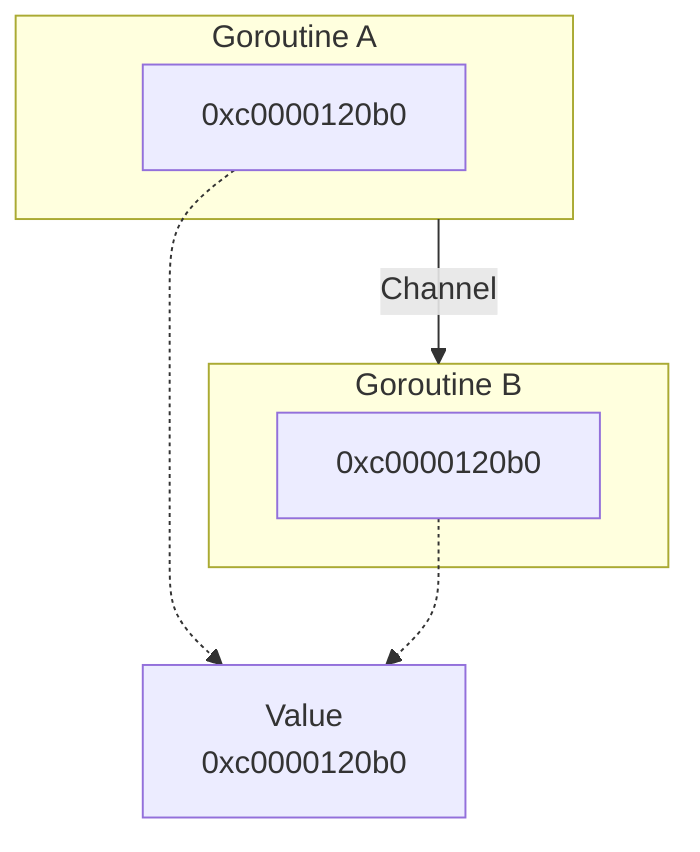
*Rasm 416. Kanal ko'rsatkich nusxasini yuborishi mumkin — ikki gorutin ham bir xil asosiy qiymatga ishora qiladi*

Ushbu sababdan, Go'da kanallar orqali "ma'lumotnomalar" (references) yuborish juda keng tarqalgan. Bu arzon, chunki nusxalanadigan qiymat ko'pincha faqat kichik sarlavha yoki ko'rsatkich o'lchamidagi qiymat, to'liq asosiy ma'lumot strukturasi emas.

Kanalda bajarilishi mumkin bo'lgan uchta asosiy amal bor: yuborish, qabul qilish va yopish.

```go
ch <- v       // v ni ch kanaliga yuborish
v := <-ch     // ch kanalidan qabul qilish
close(ch)     // kanalni yopish
```

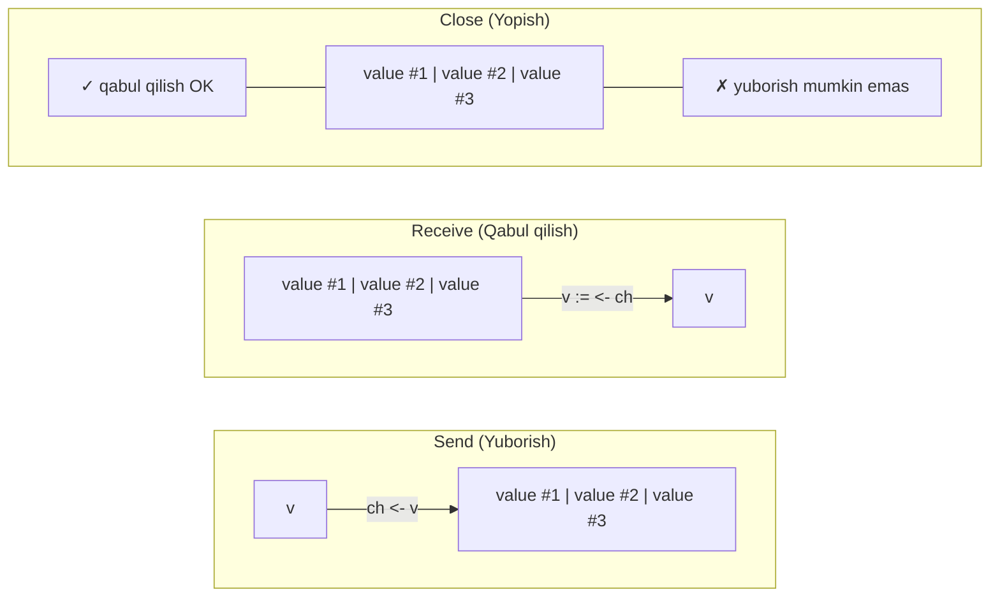
*Rasm 417. Kanal yuborish, qabul qilish va yopish — yopishdan keyin buferli qiymatlar saqlanib qoladi*

`close(ch)` allaqachon mavjud buferli qiymatlarni o'chirmaydi. U faqat keyingi yubornalar endi ruxsat etilmasligini qayd etadi. Qabul qiluvchilar oldin yuborilgan qiymatlarni, jumladan buferdagilarni qabul qilishda davom etishi mumkin. Bu qiymatlar to'la bo'shatilgandan so'ng, yopilgan kanaldan qabul qilish endi blokirovka qilmaydi va kanal element turining nol qiymatini qaytaradi, ikki qiymatli qabul qilish shaklida `false` bilan birga.

Tartib haqida: dil spesifikatsiyasi kanallar FIFO (birinchi kirgan — birinchi chiqadi) navbatlari sifatida harakat qilishini ko'rsatadi. Oddiy holatda, qiymatlar yuborilgan tartibda chiqadi.

```go
ch := make(chan int, 3)

ch <- 10
ch <- 20
ch <- 30
close(ch)

a := <-ch // 10
b := <-ch // 20
c := <-ch // 30
```

Kanal turlarining tasnifi:

- **O'lchamli kanal** (Sized Channel): buferli va buferlanmagan kanallarni o'z ichiga oladi. Ular farqli ishlasa-da, texnik jihatdan bir xil kanal turi.
- **Yo'nalishli kanal** (Directional Channel): faqat yuborish yoki faqat qabul qilish bilan cheklangan. `chan<- T` (faqat yuborish) yoki `<-chan T` (faqat qabul qilish).
- **Yopilgan kanal** (Closed Channel): yopilganda, barcha gorutinlarga ko'proq ma'lumot yuborilmasligini bildiradi. Keyin kanaldan har qanday o'qish nol qiymatini qaytaradi (buferdagi ma'lumotlar bo'lmasa).
- **Nil kanal**: nil kanal yuborish va qabul qilishda abadiy blokirovka qiladi, agar to'g'ri boshqarilmasa dastur qotib qolishiga olib keladi.

### Kanal Asosiy Tuzilmasi

Har safar `make(chan T, n)` bilan kanal yaratganimizda, kompilyator bu ifodani ish vaqti yordamchi funksiyasiga chaqiruv sifatida pasaytiriladi. Agar so'ralgan sig'im `int`ga sig'sa, `runtime.makechan` ishlatiladi. Aks holda `runtime.makechan64`.

```
// Go kodi           // Go Assembly (soddalashtrilgan)
ch := make(chan int, 4)
                        MOVD    $type:chan int(SB), R0
                        MOVD    $4, R1
                        CALL    runtime.makechan(SB)
                        MOVD    R0, main.ch-56(SP)
```

Bu chaqiruv `runtime.makechan` yordamchi funksiyasiga ikkita muhim ma'lumot uzatadi. `R0` argument registri kanal turi uchun ish vaqti tur deskriptorini (`$type:chan int(SB)`) saqlaydi. `R1` argument registri so'ralgan bufer sig'imini saqlaydi.

`makechan` ish vaqti manba kodida qanday amalga oshirilgan:

```go
func makechan(t *chantype, size int) *hchan {
    elem := t.Elem
    ...

    var c *hchan
    switch {
    case mem == 0:
        // Navbat yoki element o'lchami nol.
        c = (*hchan)(mallocgc(hchanSize, nil, true))
        c.buf = c.raceaddr()
    case !elem.Pointers():
        // Elementlar ko'rsatkich o'z ichiga olmaydi.
        // hchan va buf ni bitta chaqiruvda ajrating.
        c = (*hchan)(mallocgc(hchanSize+mem, nil, true))
        c.buf = add(unsafe.Pointer(c), hchanSize)
    default:
        // Elementlar ko'rsatkich o'z ichiga oladi.
        c = new(hchan)
        c.buf = mallocgc(mem, elem, true)
    }

    c.elemsize = uint16(elem.Size_)
    c.elemtype = elem
    c.dataqsiz = uint(size)
    lockInit(&c.lock, lockRankHchan)
    ...

    return c
}
```

Bu funksiya `hchan` tuzilmasiga ko'rsatkich qaytaradi. `make(chan T, n)` yozganimizda, ish vaqti `hchan` bilan ifodalangan ichki kanal obyektini yaratadi va bizning kanal o'zgaruvchimiz shu ish vaqti obyektiga havola saqlaydi.

Kanal yaratishda uchta asosiy ajratma holati:
1. Agar hisoblangan bufer xotirasi nol bo'lsa (`mem == 0`): faqat kanal sarlavha obyekti (`hchan`) ajratiladi. 64-bitli qurilishda joriy ish vaqti tartibida bu 104 bayt.
2. Agar element turi ko'rsatkichlarni o'z ichiga olmasa: ish vaqti `hchan` sarlavhasi va kanal buferi uchun bir uzluksiz xotira bloki ajratishga harakat qiladi.
3. Agar element turi ko'rsatkichlarni o'z ichiga olsa: ish vaqti `hchan` sarlavhasini va buferni alohida ajratadi.

`hchan` tuzilmasiga yaqinroq nazar:

```go
type hchan struct {
    qcount   uint            // navbatdagi elementlarning umumiy soni
    dataqsiz uint            // kanal buferining o'lchami
    buf      unsafe.Pointer  // dataqsiz elementlar massiviga ishora qiladi
    elemsize uint16          // element turining o'lchami (baytlarda)
    closed   uint32          // kanal yopilganmi yoki yo'q
    timer    *timer          // bu kanalni oziqlantirayotgan taymer
    elemtype *_type          // element turi

    sendx    uint   // keyingi qiymat joylashtiriladi
    recvx    uint   // keyingi qiymat o'qiladi
    recvq    waitq  // qabul qilishda blokirovkalangan gorutinlar ro'yxati
    sendq    waitq  // yuborishda blokirovkalangan gorutinlar ro'yxati

    // lock hchan dagi barcha maydonlarni, shuningdek
    // bu kanalda blokirovkalangan sudoglardagi bir nechta
    // maydonlarni himoya qiladi.
    lock mutex
}

type waitq struct {
    first *sudog
    last  *sudog
}
```

Uchta muhim qism:

**1. Ichki bufer (`buf`)** — faqat buferli kanallar uchun muhim. Bu kanal elementlari qabul qiluvchi ularni olguncha vaqtincha saqlanadigan joy. Bufer belgilangan sig'imga ega (`dataqsiz`) va buferl elementlarning joriy soni `qcount` orqali kuzatiladi.

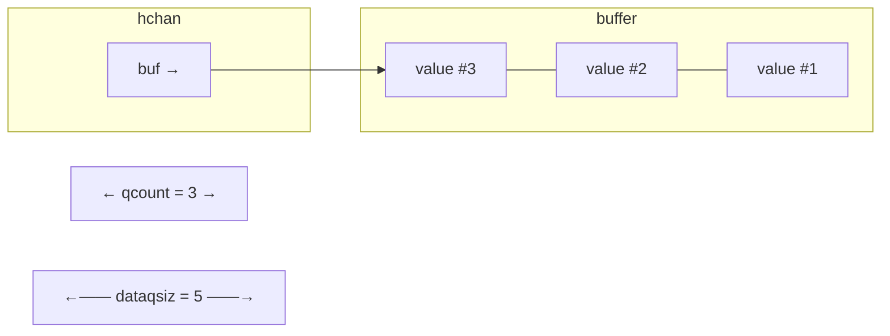
*Rasm 418. Buferli kanal buferi tartibini qcount va dataqsiz ko'rsatib*

Bu bufer aylanma navbat sifatida ishlaydi. Buferli kanalga qiymat yuborilib, kutayotgan qabul qiluvchi bo'lmaganda, ish vaqti joriy yuborish indeksidagi (`sendx`) slotga qiymatni nusxalaydi. Keyin yuborish indeksi oldinga ko'chadi va bufer oxiriga yetsa, boshiga qaytadi. Qabul qilganda, ish vaqti joriy qabul qilish indeksidagi (`recvx`) qiymatni o'qiydi, o'sha slotni tozalaydi va qabul qilish indeksini bir xil aylanma tarzda oldinga ko'chiradi.

**2. Yuborish va qabul qilish kutish navbatlari (`sendq`, `recvq`)** — kanal darhol bajarilolmasa blokirovkalangan gorutinlarni ushlab turadi. Ular `waitq` tuzilmasidan foydalanadi — pseudo-gorutin (`sudog`) tugunlari bog'liq ro'yxati.

Pseudo-gorutin (`sudog`) — gorutinni (`g`) kanal yoki semafor kabi sinxronizatsiya obyektiga bog'lovchi kichik yordamchi yozuv:

```go
type sudog struct {
    g *g

    next *sudog
    prev *sudog
    elem unsafe.Pointer // ma'lumot elementi (stekga ishora qilishi mumkin)

    acquiretime int64
    releasetime int64
    ticket      uint32

    isSelect bool

    success bool

    waiters uint16

    parent   *sudog // semaRoot ikkilik daraxti
    waitlink *sudog // g.waiting ro'yxati yoki semaRoot
    waittail *sudog // semaRoot
    c        *hchan // kanal
}
```

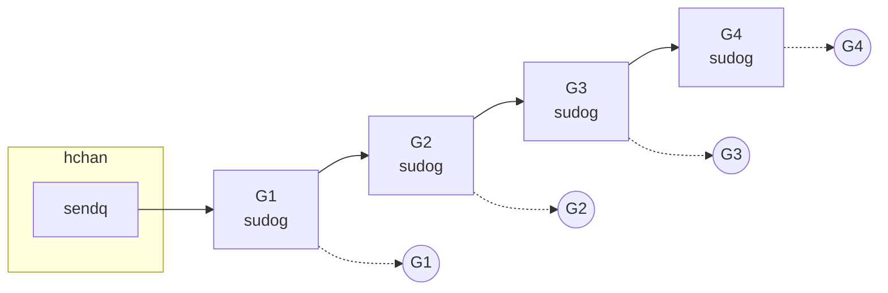
*Rasm 419. Kanal kutish navbati sudog yozuvlari orqali kutayotgan gorutinlarga bog'langan*

Bu qo'shimcha qatlam kerak, chunki munosabat ko'p-ko'pga. Bir gorutin bir nechta `sudog` yozuvlari bilan bog'liq bo'lishi mumkin va bitta sinxronizatsiya obyektida ko'p kutayotgan gorutinlar bo'lishi mumkin.

Eng aniq misol — `select` ifodasi: bir gorutin bir vaqtda bir nechta kanal amallarini sinab ko'radi, shuning uchun ish vaqti har bir nomzod holat uchun bitta `sudog` kerak va ularni mos keluvchi yuborish yoki qabul qilish kutish navbatiga bog'laydi.

Ish vaqti darajasida, kanal amalga oshirishida alohida faqat yuborish yoki faqat qabul qilish kanal obyektlari mavjud emas. Haqiqiy kanal qiymat ifodasida ular hammasi bir xil asosiy kanal sarlavhasiga (`hchan`) ishora qiladi. Shu ma'noda, faqat yuborish va faqat qabul qilish kanallari asosan tur tizimi tomonidan qo'llaniladigan cheklovlar.

```go
package main

func main() {
    var sendOnly chan<- int = make(chan int)
    var recvOnly <-chan int = make(chan int)

    sendOnly <- 10 // OK
    // _ = <-sendOnly // xato: faqat yuborish kanaldan qabul qilib bo'lmaydi

    _ = <-recvOnly // OK
    // recvOnly <- 20 // xato: faqat qabul qilish kanaliga yuborib bo'lmaydi
}
```

### Kanal Amallari

**Yuborish Amali**

Oddiy `ch <- v` Go kompilyatori tomonidan yuborish kirish nuqtasi (`chansend1`) orqali ish vaqtiga yo'naltiriladi, u esa blokirovka rejimi yoqilgan holda umumiy yuborish amalga oshirishini (`chansend`) chaqiradi.

```go
func chansend1(c *hchan, elem unsafe.Pointer) {
    chansend(c, elem, true, getcallerpc())
}

func chansend(c *hchan, ep unsafe.Pointer, block bool, callerpc uintptr) bool { ... }
```

Kanal ko'rsatkichi `nil` bo'lsa, ish vaqti uni doimiy mavjud bo'lmagan uchrashish nuqtasi sifatida ko'radi:

```go
var ch chan int // nil kanal (nol qiymati)
ch <- 42       // abadiy blokirovka qiladi
```

`nil` kanal shunchaki nol ko'rsatkich, shuning uchun `hchan` yo'q, bufer yo'q, yuborish yoki qabul qilish kutish navbati ham yo'q. Blokirovka qiluvchi yuborish gorutinni abadiy to'xtatib qo'yadi.

Kanal yopilgandan so'ng, ish vaqti `hchan.closed` bayrog'i orqali uni yopilgan deb belgilaydi va keyinchalik shu kanalga yuborish noqonuniy amal:

```go
func main() {
    ch := make(chan int)
    close(ch)
    ch <- 42 // panic: send on closed channel
}
```

**Bo'sh Kanalga Yuborish**

Kanal to'liq bo'lmaganda va kutayotgan qabul qiluvchi yo'q bo'lganda, ish vaqti kanalning aylanma buferida keyingi bo'sh slotni topadi, qiymatning baytlarini shu slotga nusxalaydi va keyin yuboruvchi gorutinni darhol davom ettirilishiga ruxsat beradi.

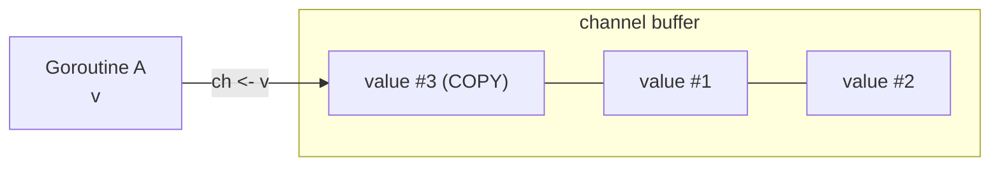
*Rasm 420. Buferli yuborish qiymatni kanal buferidagi keyingi bo'sh slotga nusxalaydi*

**To'liq Kanalga Yuborish (yoki Buferlanmagan Kanal)**

Yuboruvchi nuqtai nazaridan, buferlanmagan kanal har doim "to'liq" bo'lgan buferli kanal sifatida ko'rilishi mumkin. Har ikkala holatda ham, hozir bo'sh bufer slotiga qiymat joylashtirish orqali yuborish tugatolmaydi.

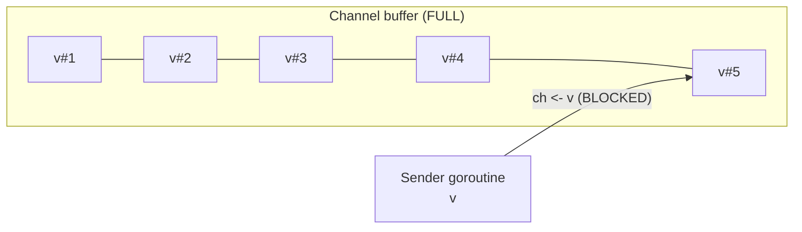
*Rasm 421. Bufer to'la bo'lganda buferli yuborish kanal xotirasidan foydalana olmaydi*

Bu vaqtda hali kanal bufer xotirasiga ma'lumot nusxalanmagan. Buning o'rniga, ish vaqti yuboruvchining qiymati qayerda ekanligini eslab qoladi va olg'a borish uchun qabul qiluvchini kutadi.

Har bir `sudog`, yuboruvchi yoki qabul qiluvchi uchun, o'sha blokirovkalangan kanal amalida ishtirok etuvchi qiymat slotiga ishora qiluvchi ichki ko'rsatkichga (`elem`) ega:

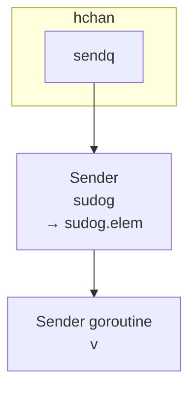
*Rasm 422. Blokirovkalangan yuboruvchi yuborilayotgan qiymatga sudog.elem ko'rsatkichini saqlaydi*

Yuboruvchi holatida `sudog.elem` yuborilayotgan qiymatni ushlab turuvchi o'zgaruvchiga ishora qiladi.

Buferlanmagan kanal uchun, qabul qiluvchi kelganda, ish vaqti qiymatni to'g'ridan-to'g'ri yuboruvchining `sudog.elem`dan qabul qiluvchining manzil o'zgaruvchisiga nusxalaydi va keyin yuboruvchini uyg'otadi. Bufer slot ishtirok etmaydi.

To'liq buferli kanal uchun, qabul qiluvchi kelsa va ham to'liq bufer, ham kamida bitta blokirovkalangan yuboruvchini topsa, ish vaqti avval eng eski buferli elementni qabul qiluvchining o'zgaruvchisiga nusxalaydi, bu aylanma buferdagi bitta slotni bo'shatadi. So'ng u blokirovkalangan yuboruvchining qiymatini `sudog.elem`dan yangi bo'shatilgan buferdagi slotga darhol nusxalaydi va keyin yuboruvchini uyg'otadi.

```mermaid
graph LR
    subgraph HCHAN["hchan"]
        SQ["sendq"]
    end
    SQ --> SS["Sender\nsudog\n→ sudog.elem"] --> SG["Sender goroutine\nv"]
    subgraph BUF["Channel buffer"]
        V2["v#2"] --- V3["v#3"] --- V4["v#4"] --- V5["v#5"]
    end
    RG["Receiver goroutine\nvalue #1"] <-- BUF
```
*Rasm 423. To'liq buferli kanalda qabul qilish eng eski qiymatni oladi va bo'shatilgan slotni blokirovkalangan yuboruvchining qiymati bilan to'ldiradi*

> **Eslatma: Sudog va Qochish Tahlili Qoidasi**
> Muhim bir tafsilot: 7-bobning qochish tahlili bo'limida, heap obyektlar stek slotlariga xom ko'rsatkichlarni ushlab turmasligi kerakligi aytilgan edi. Lekin blokirovkalangan kanal yuborish yoki qabul qilish vaqtida, ish vaqti kutish operatsiyasini ifodalash uchun `sudog` yozuvidan foydalanadi va `sudog.elem` shu operatsiyada ishtirok etuvchi o'zgaruvchiga to'g'ridan-to'g'ri ishora qilishiga ruxsat beriladi. Shu o'zgaruvchi ko'pincha gorutinning stekida. Shu sababli, ish vaqti bu holat uchun maxsus qo'llab-quvvatlashga ega: `sudog.elem` gorutin stekiga ishora qilishi mumkinligini biladi, va stek ko'chirilganda, ish vaqti bu ko'rsatkichlarni sozlaydi.

Har bir haqiqiy kanal yuborish yoki qabul qilish kanalning ichki qulfini olishi kerakligini unutmang. Bu ishlash natijasi faqat qancha qiymat uzatishimizga emas, balki bir vaqtda bir xil kanal uchun raqobatlashayotgan gorutinlar soniga ham bog'liqligini anglatadi.

**Yuboruvchini Uyg'otish va Blokirovkasiz Yuborish**

Oddiy kanal yuborishda (`select` ifodasida ishtirok etmagan) blokirovkalangan gorutinni uyg'otishning ikkita asosiy yo'li bor:

Oddiy holatda, boshqa biror gorutin bir xil kanaldan qabul qilishni amalga oshiradi va qabul qilish yo'liga kiradi. Kanal qulfini ushlab turgan holda, ish vaqti yuborish kutish navbatida (`sendq`) kutayotgan yuboruvchini topadi, uni navbatdan olib chiqadi, mos keluvchi muloqotni yakunlaydi va keyin yuboruvchi gorutinni yana ishga tayyorlaydi.

Ikkinchi yo'l — biror gorutin `close(ch)` bilan kanalni yopganda. Ish vaqti `sendq` navbatidagi har bir kutayotgan gorutinni yuborishining muvaffaqiyatsiz bo'lganligi haqida xabardor qilib uyg'otadi. Go til qoidalariga ko'ra, yopilgan kanalga yuborish xato, shuning uchun bu gorutinlar `send on closed channel` xabari bilan panic qiladi.

**Qabul Qilish Amali**

Qabul qilish amalining ham ikkita rejimi bor: blokirovka va blokirovkasiz. Ikki shaklda keladi: bir qiymatli shakl (`runtime.chanrecv1`) va "ok" shakli (`runtime.chanrecv2`):

```go
// v := <-ch
func chanrecv1(c *hchan, elem unsafe.Pointer) {
    chanrecv(c, elem, true)
}

// v, ok := <-ch
func chanrecv2(c *hchan, elem unsafe.Pointer) (received bool) {
    _, received = chanrecv(c, elem, true)
    return
}

func chanrecv(c *hchan, ep unsafe.Pointer, block bool) (selected, received bool) {
    ...
}
```

Qabul qilishda ham ikkita maxsus holat bor:

Birinchidan, `nil` kanaldan oddiy `<-ch` bilan qabul qilish abadiy blokirovka qiladi. `nil` kanal yubora olmaydi, qabul qila olmaydi va yopila olmaydi.

Ikkinchidan, yopilgan kanaldan qabul qilish hech qachon panic qilmaydi. Agar kanalda hali buferli qiymatlar bo'lsa, har bir qabul qilish keyingi buferli qiymatni oddiy tarzda qaytaradi va ikki qiymatli shaklda (`v, ok := <-ch`) `ok` natijasi hali `true`. Faqat bufer to'liq bo'shatilgandan so'ng keyingi qabul qilishlar element turining nol qiymatini qaytaradi va ikki qiymatli shakldagi natija `ok == false` bo'ladi.

> **Eslatma:** Keng tarqalgan noto'g'ri tushuncha — yopilgan kanal har doim `ok == false` qaytaradi. Aslida, bu faqat kanal ham yopilgan, ham bo'sh bo'lganda sodir bo'ladi. Agar hali buferli qiymatlar qolgan bo'lsa, qabul qilishlar bu qiymatlarni `ok == true` bilan oddiy tarzda qaytaradi.

Yopilgan kanalga yuborish va allaqachon yopilgan kanalni yopish panic qiladi, lekin yopilgan kanaldan qabul qilishga ruxsat beriladi.

Bufer bo'sh bo'lganda, qabul qiluvchi gorutin darhol davom etolmaydi va kanal bo'yicha blokirovkalanadi. Shu qabul qiluvchi uchun yaratilgan `sudog` qabul qilish kutish navbatiga (`recvq`) joylashtiriladi va uning `elem` maydoni qiymat qabul qilishi kerak bo'lgan o'zgaruvchiga ishora qiladi:

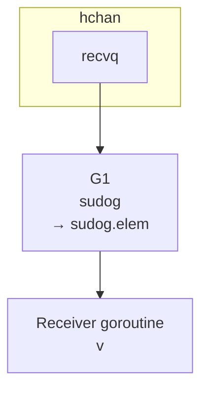
*Rasm 426. Blokirovkalangan qabul qiluvchi manzil o'zgaruvchisiga sudog.elem ko'rsatkichini saqlaydi*

Keyin, gorutin bir xil kanalga qiymat yuborganda, ish vaqti `recvq`dan kutayotgan qabul qiluvchini olib, baytlarni yuboruvchining xotirasidan qabul qiluvchining manzil slotiga to'g'ridan-to'g'ri nusxalaydi, so'ngra qabul qiluvchi gorutinni uyg'otadi:

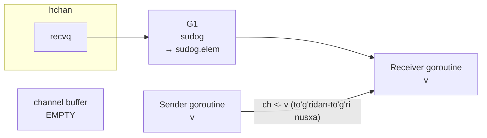
*Rasm 427. Yuboruvchi qiymatni to'g'ridan-to'g'ri kutayotgan qabul qiluvchiga nusxalaydi, kanal buferini chetlab o'tib*

**Yopish Amali**

`nil` kanalni yopa olmaymiz va allaqachon yopilgan kanalni yopa olmaymiz. Har ikki holat panic qiladi. Haqiqiy yopishdan oldin, ish vaqti kanalni qulflaydi va boshqa hech bir gorutin yopish jarayonida kanal holatini o'zgartira olmasligi uchun.

Yopish sodir bo'lganda blokirovkalangan gorutin bo'lsa, u kutish navbatidan olib chiqiladi va muvaffaqiyatsiz natija bilan (`sudog.success = false`) uyg'otiladi.

Kutayotgan qabul qiluvchilar uchun, Go spesifikatsiyasi yopilgan kanaldan qabul qilish ko'proq buferli qiymatlar qolmaganida element turining nol qiymatini qaytarishini ko'rsatadi. Bu blokirovkalangan qabul qiluvchilar uchun, ish vaqti `sudog.elem` bilan ko'rsatilgan manzil xotirasini tozalash orqali bu natijani yaratadi:

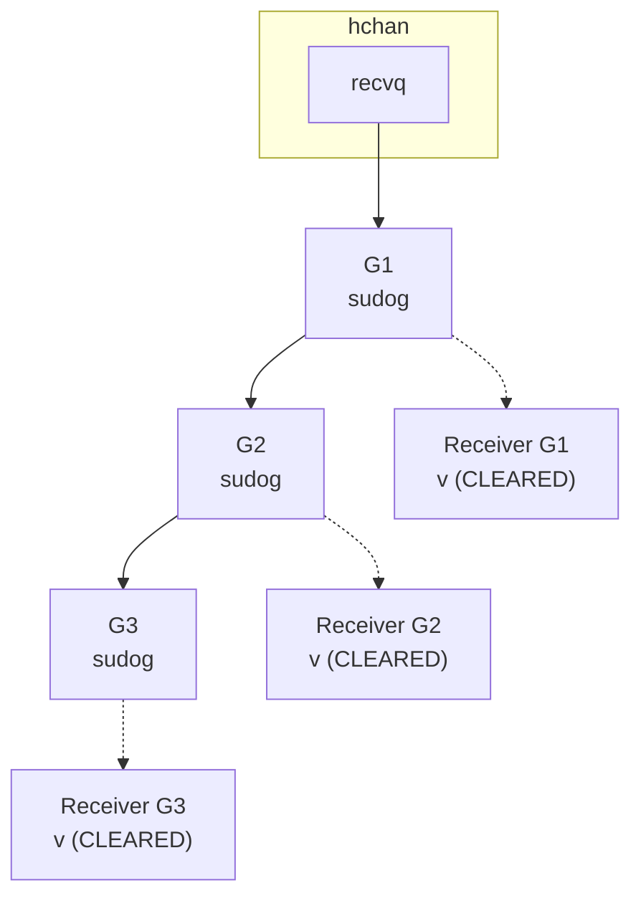
*Rasm 428. Kanalni yopish kutayotgan qabul qiluvchilarni ularning manzil slotlarini nol qiymatga tozalash orqali uyg'otadi*

---

## 2. Select Ifodasi (Select Statement)

`select` ifodasi — gorutinga bir vaqtda bir nechta kanal amallarida kutishga imkon beruvchi boshqaruv tuzilmasi. U `switch` ifodasiga o'xshaydi, lekin aniq kanal muloqoti uchun. `select` o'z holatlaridan biri olg'a bora olguncha kutadi, keyin shu holatni bajaradi:

```go
select {
case ch1 <- 10:
    fmt.Println("sent 10")
case x := <-ch2:
    fmt.Println("received:", x)
}
```

Bu `select` `ch1`ga `10` yuborish yoki `ch2`dan qiymat qabul qilish imkoniga ega bo'lguncha kutadi. Agar bir vaqtda ikkalasi ham tayyor bo'lsa, Go ixtiyoriy ravishda birini tanlaydi. Go til spesifikatsiyasi `[gospec]` shunday deydi:

> *"Agar bir yoki bir nechta muloqot davom etishi mumkin bo'lsa, bir xil ehtimollik bilan psevdo-tasodifiy tanlov orqali bitta tanlangan."*

Ichki jihatdan, gorutin bir nechta kanal holatlari bo'lgan `select` bajarayotganda va ularning hech biri darhol davom etolmasa, ish vaqti har bir holat uchun alohida `sudog` yaratadi va mos keluvchi kanal kutish navbatiga (`sendq` yoki `recvq`) joylashtiradi. Barcha bu `sudog` yozuvlari bir xil gorutinga qaytib ishora qiladi:

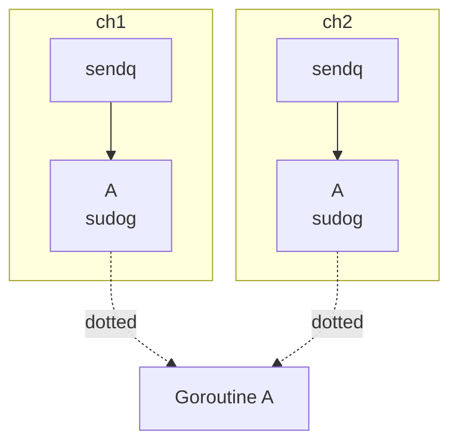
*Rasm 429. Blokirovkalangan select bir xil gorutin uchun alohida sudog yozuvlarini bir nechta kanal kutish navbatlariga joylashtirishi mumkin*

Bu kanallardan bir nechtasi taxminan bir vaqtda tayyor bo'lsa, har bir kanal o'z qulfi ostida bir xil gorutin uchun `sudog` topishi va uni uyg'otishga urinishi mumkin ekanligini anglatadi.

Faqat bitta holat haqiqatan `select`ni yutuqqa erishishini kafolatlamak uchun, gorutin (`g`) tuzilmasida `g.selectDone` nomli atomik bayroq mavjud. Kanal `select`dan kelgan `sudog`ni navbatdan chiqarganda, u `sudog`dagi `isSelect` bayrog'ini tekshiradi, so'ng `g.selectDone`ni `0`dan `1`ga atomik solishtirish va almashtirish (CAS) orqali o'tkazishga urinadi.

Agar CAS muvaffaqiyatli bo'lsa, bu gorutin `select` uchun g'olibdir. Agar CAS muvaffaqiyatsiz bo'lsa (boshqa kanal allaqachon `1` qiymatini o'rnatgan), bu kanal bu `sudog` bilan hech narsa qilmaydi.

G'alaba qozongan birinchi kanal uyg'otish poygasini yutadi va amalini yakunlaydi. `g.selectDone` allaqachon `1` ekanligi ko'rgan keyingi kanal boshqa holat allaqachon g'olib bo'lganini biladi.

Biroq, bu til spesifikatsiyasi ta'riflagan `select` g'olib mantiq emas, chunki bu uyg'otish yo'li haqiqiy vaqt va rejalashtirish bilan boshqariladi, psevdo-tasodifiy tanlov bilan emas.

`select` ifodasi ishga tushganda, Go avval barcha nil bo'lmagan kanal holatlarini oladi va ularning so'rovlar tartibini aralashtiradi. Keyin u bu holatlarni shu aralashtirilgan tartibda tekshiradi va darhol davom eta oladigan birinchisini tanlab oladi. Mana shu tarzda Go spesifikatsiya va'da qilgan "bir xil ehtimollik bilan psevdo-tasodifiy tanlov"ni amalga oshiradi — bir nechta holat `select` baholanayotgan paytda allaqachon tayyor bo'lganda.

`select` `nil` kanallarni e'tiborsiz qoldirgani uchun, insonga bir holat ishlangandan so'ng o'chirish uchun kanal o'zgaruvchisini `nil` ga o'rnatish keng tarqalgan hiyla:

```go
for {
    select {
    case v := <-ch1:
        if shouldDisable {
            ch1 = nil // Keyinchalik bu holatni o'chir
        }
    case v := <-ch2:
        // Hali aktiv
    }
}
```

`ch1 = nil` tayinlash orqali, biz qo'shimcha bayroqlar yoki shartlarsiz keyingi iteratsiyalarda bu holatni samarali ravishda o'chirib qo'yamiz.

`default` holat bo'lmaganda, `select` o'zining kanal amallaridan kamida bittasi — yuborish yoki qabul qilish — davom eta olguncha blokirovka qiladi. Agar umuman hech qanday holat bo'lmasa (`select {}`), ifoda abadiy blokirovka qiladi. `default` holat qo'shish `select`ni blokirovkasiz qiladi.

### Yopilgan Kanallar bilan Select

Yopilgan kanal bilan xulq-atvor `select` holati yuborish yoki qabul qilish ekanligiga bog'liq. Agar holat yuborishga urinsa, dastur xuddi oddiy yopilgan kanalga yuborishdek panic qiladi.

Yopilgan kanaldan qabul qilish esa hech qachon blokirovka qilmaydi. Buferli qiymatlar qolsa, qabul qilish bu qiymatlarni oddiy tarzda qaytaradi. Bufer bo'sh bo'lganda, har bir keyingi qabul qilish element turining nol qiymatini `ok == false` bilan qaytaradi.

Bu xulq-atvor `for` tsikli ichida `select` ishlatilganda va kanallardan biri yopilganda xavfli bo'lishi mumkin. Bu qabul qilish holati doimiy ravishda tayyor bo'lib qoladi, shuning uchun tsikl aylanib ketishi va ketma-ket nol qiymatlar olishi mumkin. Buning oldini olish uchun keng tarqalgan hiyla — kanal yopilganini aniqlanganda, kanal o'zgaruvchisini `nil` ga o'rnatish:

```go
for {
    select {
    case msg, ok := <-ch1:
        if !ok {
            ch1 = nil
        }
    case msg := <-ch2:
        ...
    case <-done:
        return
    }
}
```

Muddatni boshqarish uchun `time.After` bilan `select` ishlatish ham keng tarqalgan:

```go
OuterLoop:
for {
    select {
    case msg := <-ch1:
        // ch1 dan xabarni qayta ishlash
    case msg := <-ch2:
        // ch2 dan xabarni qayta ishlash
    case <-time.After(10 * time.Second):
        // 10 soniya faoliyatsizlikdan so'ng muddati tugadi
        fmt.Println("Timeout")
        break OuterLoop
    }
}
```

`break` ifodasi faqat `select`dan chiqadi, tashqi `for` tsiklidan emas. Shuning uchun `OuterLoop` kabi tsikl yorlig'idan foydalanish kerak.

### Select Ichki Tuzilmasi (Select Internals)

`select`ni tushuntirish uchun kompilyator ko'rinishi va ish vaqti ko'rinishini birga taqdim etish foydali, chunki ular bir-biri bilan chambarchas bog'langan. Kompilyator `select`ni ish vaqtiga yo'naltirilgan metadata va dispatch mantig'iga qayta yozadi.

**Kompilyator Pasaytirishi (Compiler Lowering)**

Ish vaqti `select` ifodasidagi kanal holatlarini ifodalash uchun ichki deskriptor tuzilmasidan foydalanadi. Kompilyatorning vazifasi — bu deskriptorlar massivini, har bir default bo'lmagan holat uchun bittadan qurishdir:

```go
type scase struct {
    c    *hchan          // kanal
    elem unsafe.Pointer  // ma'lumot elementi
}
```

Kanal amaliga qarab, element ko'rsatkich turlicha o'rnatiladi:
- Yuborish (`ch <- v`) uchun: deskriptorning element ko'rsatkichi yuboriladigan qiymat manziliga ega.
- Qabul qilish (`v := <-ch`) uchun: deskriptorning element ko'rsatkichi manzil o'zgaruvchisining manziliga ega.

```go
// Soddalashtrilgan kompilyator chiqishi:
scases[0] = scase{c: ch1, elem: &v}  // case ch1 <- v: yuborish ma'lumot v dan keladi
scases[1] = scase{c: ch2, elem: &x}  // case x := <-ch2: qabul qilish ma'lumot x ga yoziladi
```

Bundan tashqari, kompilyator `order` massivini ham tayyorlaydi. Ish vaqti uni ikki alohida maqsad uchun ishlatadi: holatlar tayyor ekanligini so'rov uchun tekshiriladigan tartibni aniqlash, va `select`da ishtirok etuvchi kanallar qulflash tartibini aniqlash.

Kompilyator `select` ifodasini `runtime.selectgo` ga chaqiruvga pasaytiradi. Bu funksiya ichida `order` massivi bir bo'lak vaqtinchalik xotira sifatida ko'rib chiqiladi va ikkita bo'lakka bo'linadi, shuning uchun uning o'lchami `2 * ncases`. Birinchi yarmi so'rov tartibiga, ikkinchi yarmi esa qulflash tartibiga aylanadi.

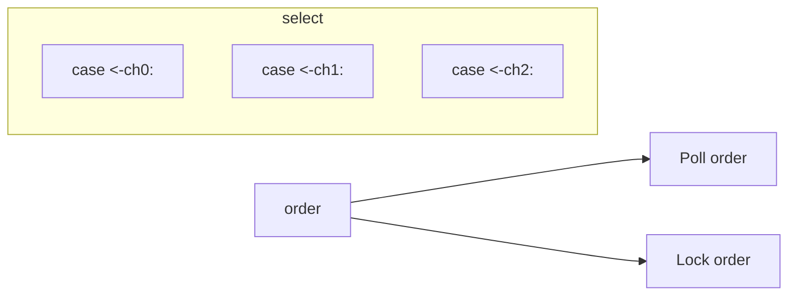
*Rasm 430. select tartib massivi so'rov tartibiga va qulflash tartibiga bo'linadi*

So'rov tartibi bo'lagi — ish vaqti holatlar uchun tasodifiy tashrif tartibini quradigan joy. `runtime.selectgo` select holatlarini aylanib o'tganda, har bir valid nil bo'lmagan holat indeksini tasodifiy joyda so'rov tartibiga kiritadi:

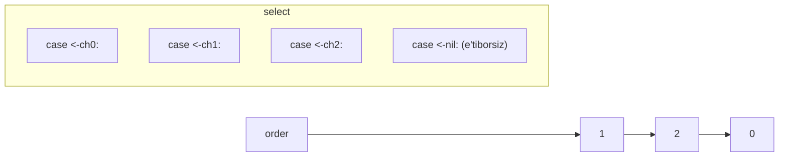
*Rasm 431. Ish vaqti valid nil bo'lmagan select holatlaridan tasodifiy so'rov tartibini quradi*

**Ish Vaqti Bajarishi (Runtime Execution)**

Barcha kanallar qullangandan so'ng, Go ish vaqti so'rov tartibida holatlarni ko'rib chiqadi. Bu o'tishning maqsadi — qaysi holat darhol, blokirovkasiz davom eta olishini bilish.

Qabul qilish holati uchun, ish vaqti tekshiradi:
- Kanalning yuborish navbatida allaqachon kutayotgan yuboruvchi bo'lsa — darhol moslashtirish.
- Kanal buferida ma'lumot o'tirgan bo'lsa — to'g'ridan-to'g'ri bufferdan qabul qilish.
- Kanal yopilgan bo'lsa — nol qiymati bilan `ok == false` darhol davom etadi.

Yuborish holati uchun, ish vaqti tekshiradi:
- Kanalning qabul qilish navbatida allaqachon kutayotgan qabul qiluvchi bo'lsa — qiymatni darhol topshirish.
- Kanal buferida hali bo'sh joy bo'lsa — qiymatni bufferga nusxalash.
- Kanal yopilgan bo'lsa — `send on closed channel` bilan panic.

Agar biron holat shu tekshiruvlarga ko'ra tayyor bo'lsa, ish vaqti qulflarni ushlab turgan holda shu yuborish yoki qabul qilishni darhol bajaradi, qaysi holat g'alaba qozonganligi qayd etiladi, kanallar qulfdan chiqariladi va kodimizga qaytiladi.

**2-O'tish: Sudogni Navbatga Qo'yish (Pass 2: Enqueue The Sudog)**

Agar biron holat tayyor bo'lmasa, Go ish vaqti `select`dagi har bir kanal holati uchun bitta `sudog` yaratadi va blokirovka qilinishi mumkin. Bu `sudog` gorutinni bitta aniq kanal amaliga bog'laydi. Holat yuborish yoki qabul qilish ekanligiga qarab, `sudog` kanalning yuborish navbatiga (`sendq`) yoki qabul qilish navbatiga (`recvq`) qo'shiladi.

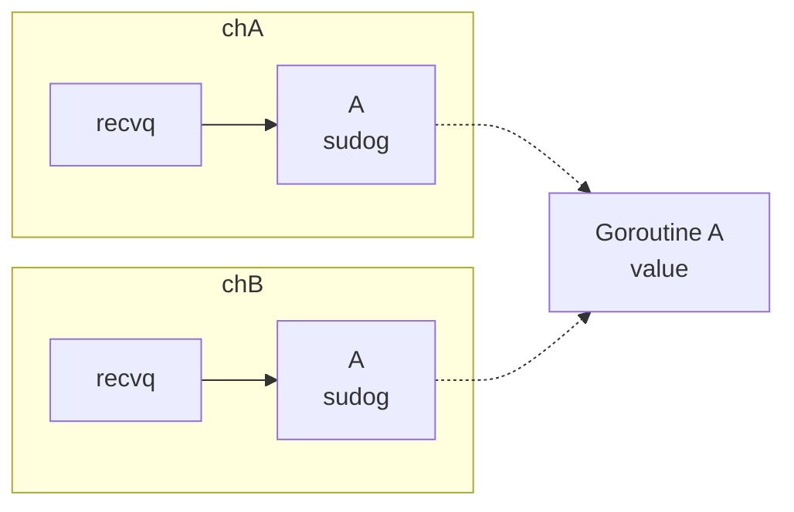
*Rasm 434. select blokirovka qilganda, ish vaqti mos kanal kutish navbatiga har bir holat uchun alohida sudog navbatga qo'yadi*

Gorutin barcha tegishli kanallarga navbatga kiritilgandan so'ng, u uxlashga tayyorlanadi. U kanallar bo'yicha to'xtatilishini belgilaydi, keyin `gopark`ni chaqiradi, bu esa kanal qulflarini final ravishda bo'shatuvchi kichik commit funksiyasini ishga tushiradi.

Mos yuborish yoki qabul qilish bu kanallardan birida sodir bo'lganda, kanal bitta kutayotgan pseudo-gorutini (`sudog`) tanlab oladi, `sudog.elem`da saqlangan manzil orqali zarur ma'lumot harakatini bajaradi va keyin bu g'alaba qozongan `sudog`ni `gp.param`ga saqlash orqali gorutinni uyg'otadi.

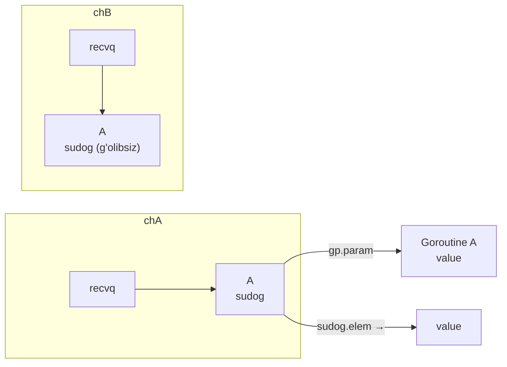
*Rasm 435. G'alaba qozongan kanal amali uning sudogini gp.param ga saqlash orqali select gorutinini uyg'otadi*

Gorutin uyg'ongandan so'ng, u `gp.param`dan g'alaba qozongan `sudog`ni o'qiydi. Bu `sudog` qaysi holat uyg'otishga sabab bo'lganini va amal muvaffaqiyatli bo'lganligini aytib beradi. Qolgan ish — tozalash: ish vaqti ilgari navbatga qo'yilgan `sudog` yozuvlarining bog'liq ro'yxatini aylanib o'tadi, mag'lub bo'lganlarni kanallarning kutish navbatlaridan olib chiqadi, bu `sudog` obyektlarini bo'shatadi va nihoyat tanlangan holat indeksini `recvOK` bayrog'i bilan kompilyatsiya qilingan kodga qaytaradi.

---

## 3. Taymer (Timer)

Go'da taymer — ma'lum bir vaqtni kutish va keyin voqea sodir bo'lishini ta'minlash usuli. `time` paketida eng keng tarqalgan taymer-ga bog'liq vositalar juda oddiy.

Birinchidan, `time.After(d)` `d` muddat o'tgandan so'ng bitta `time.Time` qiymatini yetkazadigan kanalni qaytaradi:

```go
<-time.After(2 * time.Second)
```

Bu misol davom etishdan oldin taxminan ikki soniya kutadi. Bu `select` ichida bajarishni to'xtatib turish yoki boshqa amal atrofiga vaqt chegarasi qo'yishning tezkor usuli.

Ikkinchidan, `time.NewTimer(d)` `time.Time` kanali bo'lgan `C` maydoni bilan `*time.Timer` yaratadi:

```go
t := time.NewTimer(2 * time.Second)
<-t.C
t.Reset(3 * time.Second)
<-t.C
t.Stop()
```

`time.NewTimer(d)` `d` dan so'ng bir marta ishlaydigan taymer yaratadi va `t.C` kanali ochadi. Taymer ishlaganda, joriy vaqtni `t.C`ga yuboradi, shuning uchun `<-t.C` bu sodir bo'lguncha blokirovka qiladi. `time.After`dan farqli o'laroq, biz `Timer` obyektini saqlaymiz, shuning uchun uni boshqara olamiz: `<-t.C` bilan kutish, `t.Stop()` bilan to'xtatish yoki `t.Reset(...)` bilan qayta ishlatish.

Uchinchidan, `time.NewTicker(d)` — takrorlanadigan taymer. Uning ham `C` kanali bor, lekin bir marta ishlov berishning o'rniga, u to'xtatilguncha `d` uzunlikdagi muntazam intervallarda vaqt qiymatlarini yetkazib beradi:

```go
ticker := time.NewTicker(time.Second)
defer ticker.Stop()

for t := range ticker.C {
    fmt.Println("tick at", t)
    if shouldStop() {
        break
    }
}
```

`Ticker` belgilangan intervaldda biror narsa qayta-qayta ishga tushishi kerak bo'lganda foydali. Muhim bir tafsilot: `ticker.Stop()` keyingi tiklashlarni to'xtatadi, lekin `ticker.C`ni yopмайdi. Shuning uchun kod odatda kanalning o'zi yopilishini kutish o'rniga tsikldan ochiq tarzda chiqib ketadi.

Bu APIlarning hammasi signal berish uchun kanallardan foydalanadi. Ko'rsatilgan vaqt kelganda, ish vaqti mos kanalga qiymat yetkazadi. Gorutinimiz shunchaki shu kanaldan qabul qiladi yoki buni `select` ichida boshqaradi, bu esa taymer xulq-atvorini muddatlar kabi boshqa kanal amallari bilan birlashtirish osonroq qiladi.

**Go 1.22 gacha bo'lgan xulq-atvor**

Go 1.23 dan oldin, kanal asosli taymer uchun `t.C` samarali ravishda `1` sig'imli bufer bilan ishlardi `[go123timer]`. Agar taymer yongan bo'lsa va uning vaqt qiymati hali `t.C`da o'tirgan bo'lsa, `Stop` yoki `Reset` chaqirish bu allaqachon navbatga qo'yilgan qiymatni avtomatik ravishda olib tashlamasdi.

Natijada, `t.C`dan keyingi qabul qilish oldingi muddatdan eski vaqt qiymatini qaytarishi mumkin edi. `Reset`dan keyin ham, biz yangi sozlamaga emas, balki eski taymer sozlamasiga tegishli qiymatni tasodifan kuzatishimiz mumkin edi. Shuning uchun Go 1.23 dan oldin, `Reset` chaqirishdan oldin xavfsiz naqsh `Stop`ni chaqirish, kerak bo'lganda `t.C`ni tozalash va faqat keyin `Reset`ni chaqirish edi.

**Go 1.23 dan boshlab**

Go 1.23 va undan keyingi versiyalarda, kanal asosli taymerlar uchun `Stop` yoki `Reset` qaytgandan so'ng `t.C`dan har qanday qabul qilish oldingi taymer konfiguratsiyasidan eski qiymatni ko'rishi kafolatlanmaydi.

Boshqacha qilib aytganda, `Reset`ni chaqirsak, `t.C`dan keyingi qabul qilishlar eski emas, yangi taymer sozlamasiga mos keladi:
- Agar taymer hali aktiv bo'lsa, `t.Reset(d)` `true` qaytaradi, bu mavjud taymer aktiv bo'lganligi va qayta rejalashtirilganligini anglatadi.
- `Reset` `false` qaytarsa, taymer allaqachon yongan yoki to'xtatilgan edi. Hatto bu holatda ham, `Reset` qaytgandan so'ng `t.C`dan qabul qilish oldingi muddatdan qolgan eski qiymatni ko'rmaydi.

`time.After(d)` bilan yana bir keng tarqalgan muammo — `select` ichida ishlatganda. `select` taymer yonishidan oldin boshqa holat tanlasa, `time.After` tomonidan yaratilgan taymer allaqachon yongunga yoki yetib bo'lmaydigan holga kelgunga qadar mavjud bo'ladi. Tsiklda bu vaqtinchalik ko'plab kutilayotgan taymerlarni to'plashi mumkin.

Go 1.23 dan boshlab, bu naqsh ancha xavfsizroq. Axlat yig'uvchi yonishidan oldin ham mos bo'lmagan taymerlarni qayta talab qila oladi.

### Taymer Ichki Tuzilmasi

`time.Sleep(duration)` chaqirgunimizda, kapot ostida sodir bo'ladigan narsa — ish vaqti shu gorutin uchun taymer ishlatadi. Birinchi marta gorutin `time.Sleep`ni chaqirganda, ish vaqti u uchun taymer ajratadi va uni shu gorutinda saqlaydi. Bir xil gorutindagi keyingi uyqular shu taymerdan qayta foydalanishi mumkin.

`time.Sleep` bilan bir muddat gorutinni uxlatish, kelajakda bir marta yonish uchun `time.Timer` va belgilangan intervallarda qayta-qayta yonish uchun `time.Ticker` hammasi `runtime` paketidagi `timer` tuzilmasi tomonidan boshqariladi:

```go
type timer struct {
    mu mutex // mu barcha maydonlarni o'qish va yozishni himoya qiladi

    astate atomic.Uint8
    state  uint8    // holat bitlari
    isChan bool     // taymerda kanal bor
    ...

    when   int64    // taymer qachon yonishi kerak (vaqt)
    period int64
    f      func(arg any, seq uintptr, delay int64)
    ...
}
```

Ba'zi maydonlarning ma'nosi:
- `when`: taymer qachon yonishi kerak, nanosaniyalarda.
- `period`: noldan katta bo'lsa, taymer bir marta yonish o'rniga shu intervaldga takrorlanadi.
- `f`: taymer yonganda ish vaqti chaqiradigan funksiya. Masalan, uxlayotgan gorutinni uyg'otishi yoki kanal asosli taymerlar uchun vaqt qiymatini yuborishi mumkin.
- `isChan`: `true` bo'lsa, bu kanal asosli taymer.
- `state`: taymer hozirda heap da bo'lgan yoki o'chirishga belgilangan kabi ichki holat bitlari.
- `astate`: taymer qulfi bo'shatilganda yangilanadigan shu holat bitlarining atomik surati, shuning uchun ba'zi tez yo'llar qulfni olmasdan taymer holatini tekshira oladi.

Taymer muddati tugagandan so'ng, ish vaqti `f func(arg any, seq uintptr, delay int64)` funksiyasini chaqiradi. `arg` parametri taymerning qaysi turi ekanligiga bog'liq. `time.Sleep` uchun bu uxlayotgan gorutin, shuning uchun ish vaqti uni keyinchalik uyg'otishi mumkin. `time.NewTimer`, `time.After` va `time.NewTicker` kabi kanal asosli taymerlar uchun bu vaqt qiymatini olishi kerak bo'lgan kanal.

`time.Timer` — `time` paketidagi biz Go kodida ishlatadigan ommaviy tur, `timer` esa haqiqiy rejalashtirishni va yonish mantiqini amalga oshiradigan ichki ish vaqti turi.

```go
func NewTimer(d Duration) *Timer {
    c := make(chan Time, 1)
    t := newTimer(when(d), 0, sendTime, c, syncTimer(c))
    t.C = c
    return t
}

// sendTime vaqtni blokiramasdan c ga yuboradi.
func sendTime(c any, seq uintptr, delta int64) {
    select {
    case c.(chan Time) <- Now().Add(Duration(-delta)):
    default:
    }
}
```

Ish vaqti xotirada bitta taymer-asosli obyekt ajratadi. Uning boshlanishi ommaviy `time.Timer` bilan bir xil tartibga ega, shuning uchun `time` paketi uni `*time.Timer` sifatida ishlatishi mumkin. Bu ommaviy prefiksdan so'ng, obyekt qo'shimcha faqat-ish-vaqti holatini o'z ichiga oladi.

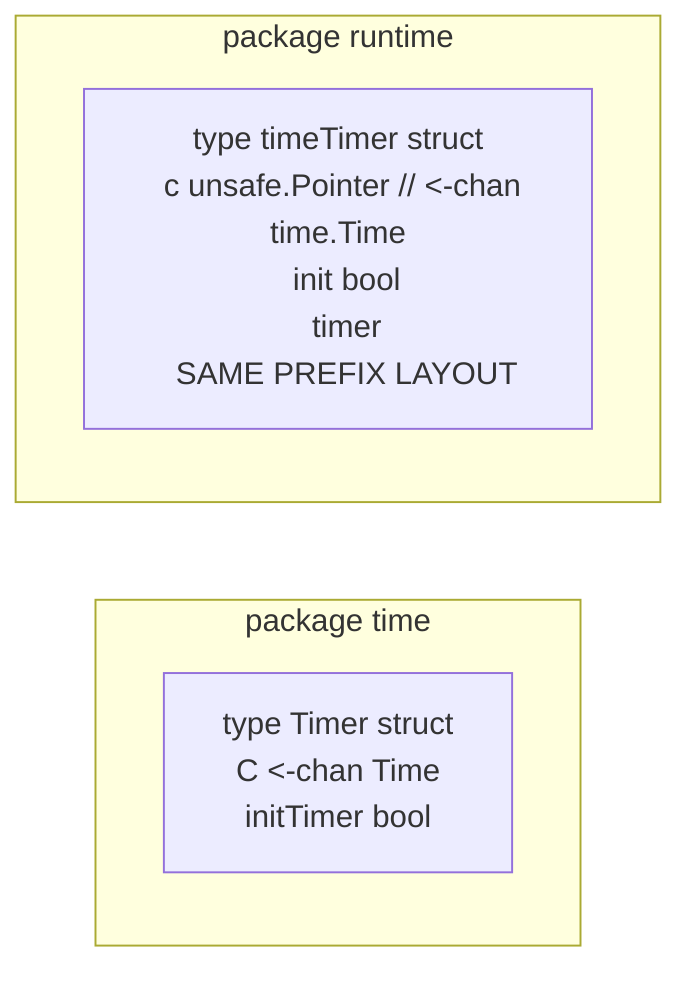
*Rasm 436. runtime.timeTimer ommaviy Timer prefix tartibini baham ko'radi va xususiy ish vaqti taymer holatini qo'shadi*

Taymerlar oddiy gorutinlar tomonidan yaratiladi va ishlatiladi, lekin ular ish vaqti tomonidan kapot ostida boshqariladi. Barcha taymerlarni bitta global tuzilmaga qo'yish o'rniga, ish vaqti ularni protsessorlar P bo'yicha tarqatadi.

Bu degani har bir P ning o'z taymer heap'i (`p.timers`) va o'z qulfi bor. Shunday qilib, taymerlarni qo'shish, yangilash va tekshirish ko'pincha turli P larda parallel ravishda sodir bo'lishi mumkin, har bir taymer amalini bitta markaziy taymer qulfi orqali o'tkazishga majbur qilmasdan.

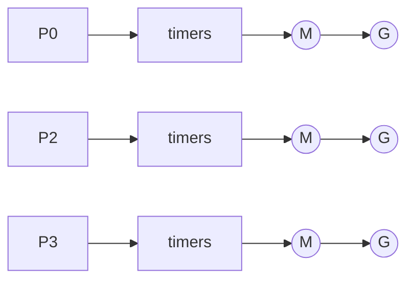
*Rasm 437. Har bir P bitta global taymer heap'i o'rniga o'z taymerlar tuzilmasini saqlaydi*

Har bir P uchun taymer pool taymerning `when` qiymati bo'yicha tartib qilingan min-heap sifatida tashkil etilgan. Joriy ish vaqtida har bir tugun to'rtta bolaga ega bo'lishi mumkin. Eng kichik `when` bilan taymer tepada turadi. Bu xotira-ajratish ma'nosida heap emas, balki ustunlik navbati sifatida ishlatilgan heap ma'lumotlar tuzilmasi.

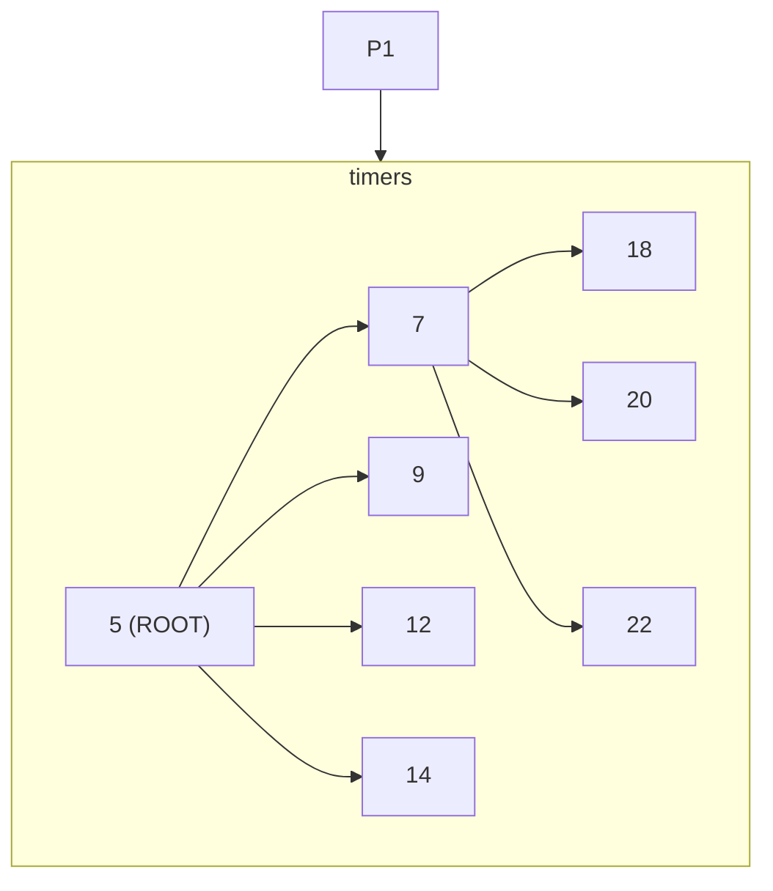
*Rasm 438. P ning taymerlari eng erta muddati ildizda bo'lgan min-heap sifatida tashkil etilgan*

### Taymer Holatlari

Taymerlarning uchta holat bitini tushunish kerak: yig'ilgan (`timerHeaped`), o'zgartirilgan (`timerModified`) va zombie (`timerZombie`).

**Yig'ilgan Taymerlar (Heaped)**

Bu holat biti taymerni hozirda biror P ning taymer heap'ida saqlaydi, shuning uchun ish vaqti taymer tizimi tomonidan faol kuzatiladi. `timerHeaped` o'rnatilgan bo'lsa, taymer heap'dagi yozuvga ega va shu P keyingi taymer uchun qidirganda ko'rib chiqiladi.

**Zombie Taymerlar**

`P0`ning taymer heap'iga `A` taymeri qo'yildi. Keyin `t.Stop()` butunlay boshqa joydan chaqirilishi mumkin. Bu taymerning egalik qiluvchi P ning heap'idan ixtiyoriy chaqiruvchidan to'g'ridan-to'g'ri olib chiqishni anglatadi, ish vaqti buni qochadi. Buning o'rniga, agar taymer hozirda heap'da bo'lsa, `Stop` uni `timerZombie` bilan belgilaydi. Bu degani taymer o'lik sifatida ko'rilishi va keyinchalik heap saqlash paytida olib chiqilishi kerak.

```mermaid
graph LR
    P0["P0"] --> heap0["timers"]
    heap0 --> A["A (ZOMBIE)"]
    P1["P1"] --> heap1["empty"]
    P1 --> stopCall["A.Stop()"]
```
*Rasm 439. Taymer boshqa P dan to'xtatilishi va hali asl heap'ida o'tirganida zombie deb belgilanishi mumkin*

**O'zgartirilgan Taymerlar (Modified)**

O'zgartirilgan holat zombie holati bilan o'xshash g'oya, lekin hali aktiv va shunchaki qayta rejalashtirilgan taymer uchun. Bu ko'pincha `Reset()` chaqirganimizda sodir bo'ladi. Bir marta `Reset()` taymerning `when` qiymatini o'zgartirsa, heap saralanishi `when` ga asoslangani uchun heap ta'mirlanishi kerak bo'lishi mumkin.

`Reset()` heap yozuvini to'g'ridan-to'g'ri o'rnida qayta tartiblamaydi. Buning o'rniga, u taymerning `when` maydonini taymerning o'z qulfi ostida yangilaydi va keyin `timerModified` bitini o'rnatadi: "bu taymerning rejalashtirilgan vaqti o'zgardi, shuning uchun uning heap yozuvi hozir eskirgan bo'lishi mumkin."

### Taymer Xulq-atvoри

**time.Sleep**

`time.Sleep(ns int64)` chaqirganimizda, davomiylik nol yoki manfiy bo'lsa, darhol qaytadi. Musbat davomiylik uchun, ish vaqti joriy gorutinni `g` ko'radi. Gorutin birinchi marta `time.Sleep`ni chaqirganda, ish vaqti u uchun yangi taymer ajratadi, `goroutineReady(g)` orqali `g`ni qanday uyg'otishni biladigan callback bilan ishga tushiradi va uni `g.timer`da saqlaydi.

```go
func timeSleep(ns int64) {
    if ns <= 0 {
        return
    }
    gp := getg()
    t := gp.timer
    if t == nil {
        t = new(timer)
        t.init(goroutineReady, gp)
        gp.timer = t
    }
    when := nanotime() + ns
    if when < 0 { // toshib ketishni tekshirish
        when = maxWhen
    }
    gp.sleepWhen = when
    gopark(resetForSleep, nil, waitReasonSleep, traceBlockSleep, 1)
}
```

Agar taymer allaqachon mavjud bo'lsa, ish vaqti shunchaki qayta ishlatadi. Keyin gorutin `gopark()` bilan CPUni bo'shatadi, shuning uchun boshqa gorutinlar ishlashi mumkin. Gorutin haqiqatan to'xtatilgandan so'ng, kichik commit funksiyasi `resetForSleep` ishlaydi va gorutinning taymerini hisoblangan uyg'onish vaqti bilan rejalashtiradi.

Bu tartib muhim. Ish vaqti to'xtatishdan oldin taymerni qurollantirmaydi, chunki juda qisqa uxlash uchun taymer callback aks holda juda erta ishlab gorutin to'liq uxlab qolmagan bo'lishi mumkin.

```mermaid
graph LR
    P0["P0"] --> TH["timers"]
    TH --> A["A"]
    G0((G)) --> GTimer["g.timer"]
    GTimer --> A
```
*Rasm 441. resetForSleep uxlayotgan gorutinning taymerini rejalashtiradi*

### Go 1.23 da Kanal Asosli Taymerlar

Kanal asosli taymer xuddi `time.Sleep` kabi asosiy taymer mexanizmidan foydalanadi. Asosiy muammo — taymer o'zgartirilganda, masalan `timer.Reset` yoki `timer.Stop` orqali, taymer kanali `t.C` eskirgan qiymat yetkazmasligi.

Uch stsenariyni ajratish foydali:

**Yonishdan oldin Stop yoki Reset:** Bu eng oddiy holat. Taymer hali kelajakdagi muddatga ishora qiladi va taymer kanalida yuborish boshlanmagan. Ish vaqti yonishidan oldin taymerning rejalashtirishvaqtini yangilaydi va hech qanday eskirgan qiymat mavjud emas.

**Yonish paytida Stop yoki Reset:** Taymer allaqachon "yuborish vaqti keldi" degan qarorga yetdi, boshqa gorutin esa `timer.Stop` yoki `timer.Reset`ni chaqiradi. Bu nozik poyga. Ish vaqti har bir kanal-taymer konfiguratsiyasi `timer.seq`da saqlangan avlod qiymatiga ega ekanligini ko'radi. Har safar `timer.Stop` yoki `timer.Reset` taymerni o'zgartirsa, ish vaqti `timer.seq`ni oshiradi.

```mermaid
graph LR
    S1["SNAPSHOT\ntimer.seq: V"] -->|GAP| S2["SNAPSHOT\ntimer.seq: V"]
    D["Deadline"] --> CS["Channel send"]
    STOP["timer.Stop()/\ntimer.Reset()"] -->|sequence increments to V+1| CS
```
*Rasm 443. Stop yoki Reset eskirgan yuborish tekshiruvi oldidan taymer ketma-ketligini oldinga suradi*

Keyinchalik, eski yonish yo'li saqlangan avlod `V` bilan yuborish bosqichiga yetadi. Yuborishdan to'g'ridan-to'g'ri oldin, u yuborish qulfini oladi va saqlangan `V`ni joriy `t.seq` bilan solishtiradi, bu hozir `V+1`. Ular endi mos kelmaydi, shuning uchun ish vaqti bu eski yonish urinishini eskirgan deb ko'radi va yuborishni no-op ga aylantiradi.

**Yonishdan keyin Stop yoki Reset:** Bu holatda taymer avval yuborish bosqichiga yetadi va `timer.Stop` yoki `timer.Reset` kelishidan oldin kanal yuborishni yakunlaydi. Bu eski yonish allaqachon sodir bo'ldi. Keyingi `timer.Stop` yoki `timer.Reset` faqat taymer holatini oldinga o'zgartira oladi.

Foydalanuvchi nuqtai nazaridan, yangi semantika `timer.Stop` yoki `timer.Reset` qaytgandan so'ng bu eski taymer qiymatini boshqa ko'rmasligimiz kerakligini xohlaydi. Taymer yondi, lekin dastur endi bu eski yonishni ko'rinmas qilib qo'yishni xohlaydi.

Go 1.23 da, taymer kanali hali ham asosda bir-elementli buferli amalga oshirishdan foydalanadi, lekin ish vaqti uni foydalanuvchiga "soxta" buferlanmagan kanal sifatida taqdim etadi. Boshqacha qilib aytganda, u amalga oshirish sabablari uchun ichki buferlanadi, lekin ish vaqti eskirgan taymer yubormasligi uchun uni maxsus ko'rib chiqadi.

```go
func main() {
    t := time.NewTimer(10 * time.Second)
    println(cap(t.C))
}

// Chiqish:
// 0
```

`make(chan Time, 1)` bilan yaratilgan bo'lsa-da, `cap(t.C) == 0` qaytaradi. Buferlanmagan kanal modeli yangi semantikaga yaxshiroq mos keladi:
- Buferlanmagan kanal modeli keyinchalik qabul qilish uchun eski navbatdagi qiymat yo'qligini ko'rsatadi.
- `timer.Stop()` va `timer.Reset()` eski taymer holatidan eskirgan yuborishlar chaqiruv qaytgandan so'ng ko'rinmas bo'lishini ta'minlaydi.

### Blokirovka Soni (timer.blocked)

Taymer obyekti hali ham yaratilishi mumkin, lekin kanal mavjud bo'lgani uchun u P taymer heap'ida faol rejalashtirilgan bo'lishi shart emas. `select` misolidagi taymerni bloklash holida heap'ga qo'yishi mumkin. Ammo boshqa case g'olib chiqib, bu kutish olib tashlanganida, ish vaqti shu bloklangan qabul qilish uchun taymerni faol heap'da saqlashga hojat qolmaydi.

Muhim detal — taymer bloklangan qabul qiluvchilar sonini saqlaydi (`timer.blocked`). Kanal asosli taymer faqat biror gorutin shu taymer kanalida haqiqatan to'silib turada P taymer heap'ida saqlanishi kerak.

```go
type timer struct {
    ...
    blocked uint32 // taymerning kanalida bloklangan gorutinlar soni
}
```

Har safar ish vaqti gorutin taymer kanalida haqiqatan to'silib qolishini aniqlasa (masalan, `<-time.After(d)>`ni haqiqatan kutadigan `select` case), u bloklangan sonni oshiradi (`t.blocked`). Teskari tarzda, taymer kanalida bloklangan gorutin boshqa tomondan bloklanmay qolganda, ish vaqti `t.blocked`ni kamaytiradi.

```go
func unblockTimerChan(c *hchan) {
    t := c.timer
    t.lock()
    ...
    t.blocked--
    if t.blocked == 0 && t.state&timerHeaped != 0 && t.state&timerZombie == 0 {
        // Bu taymer kanalida bloklangan oxirgi gorutin.
        // Heap dan olib chiqish uchun belgilab qo'y, lekin t.when ni tozalab yuborma,
        // shunda u hali ham qachon yonishi kerakligini biladi.
        t.state |= timerZombie
        t.ts.zombies.Add(1)
    }
    t.unlock()
}
```

Agar `t.blocked` nolga tushsa va taymer hali ham heap'da bo'lsa, ish vaqti uni zombie taymer sifatida belgilaydi, shunda keyinroq heap-tozalash bosqichi uni olib chiqishi mumkin. Shu nuqtada, ish vaqti shu uyg'onish rejalashtirishni taymerni heap'da saqlashga hojat qolmaydi, hatto taymer `t.when`da o'z muddatini eslasa va kod keyinchalik kanalga tegsa, dangasalikan bilan yondirilishi mumkin bo'lsa ham.

---

## 4. M-P-G Modeli

M-P-G modeli — Go ish vaqti bir vaqtli ishni operatsion tizim iplari va CPU yadrolar ustida rejalashtirish uchun foydalanadigan asosiy abstraktsiya. Har bir gorutinni to'g'ridan-to'g'ri OS ipiga moslashtirish o'rniga, Go uchta qatlam kiritadi: gorutinlar (G), mantiqiy protsessorlar (P) va mashina iplari (M).

Bu qatlamlar Go'ga nisbatan kichik, boshqariladigan OS iplari to'plamida yuz minglab gorutinlarni ishlata olish imkonini beradi, shu bilan birga bir nechta CPU yadrosidan foydalanadi:

```mermaid
graph TB
    subgraph GAS["Go application space"]
        P0["P"] --> M0((M)) --> G0((G))
        P1["P"] --> M1((M)) --> G1((G))
        P2["P"] --> M2((M)) --> G2((G))
        P3["P"] --> M3((M))
        M3 --> GG((G))
        M3 --> GGG((G))
    end
    subgraph KS["Kernel space"]
        T0["Thread"] 
        T1["Thread"]
        T2["Thread"]
        T3["Thread"]
    end
```
*Rasm 444. M-P-G modeli gorutinlarni kichikroq ishchi iplar to'plamiga moslashtiradi*

Gorutin — yengil foydalanuvchi-fazosi ijro konteksti. Uning o'z steki, dastur hisoblagichi va ish vaqti hisobi bor, lekin u OS ipi bilan bir-biriga mos kelmaydi.

Ish vaqti nuqtai nazaridan, G gorutin bajarilishi kerak bo'lgan ish: funksiya chaqiruvi va uning steki va ish vaqti holati. Gorutinlar `go` kalit so'zi bilan juda arzon yaratilishi mumkin, va rejalashtiruvchi ularning ko'pini ancha kichik iplar hovuziga ko'paytirish uchun javobgar.

Gorutinlar va OS iplari orasida P — protsessor — joylashgan. P — Go ish vaqti ichidagi mantiqiy rejalashtirishvaqti resursi. Bu hardware ma'nosidagi fizik CPU yadro emas. Buning o'rniga, u OS ipi M Go kodini bajarish uchun ushlab turishi kerak bo'lgan ish vaqti tokenı.

Protsessorlar (P) soni bir vaqtda parallel Go kodi bajarishi mumkin bo'lgan gorutinlar sonini nazorat qiladi. CPU-ga bog'langan ish uchun bu sonni mavjud CPU soni yaqiniga o'rnatish odatda eng yaxshi sukut bo'ladi. Shuning uchun `GOMAXPROCS` odatda mavjud CPU soni yaqinida boshlanadi.

Kamroq P o'rnatilsa, parallel ishlashi mumkin bo'lgan Go kodi kamayadi. Ko'proq P o'rnatilsa, odatda CPU o'tkazuvchanligini oshirmaydi, chunki operatsion tizim hali ham bir xil CPU yadrolari soniga ega va qo'shimcha parallelizm asosan rejalashtirishvaqti yukini oshiradi.

Har bir P o'zining kichik mahalliy ishlashga tayyor gorutinlar navbatiga ega, shuningdek xotira-ajratish keshlar, `sudog` keshlar va boshqa rejalashtiruvchi-mahalliy ma'lumotlar kabi P-ga xos keshlar to'plamiga.

```mermaid
graph LR
    P0["P"] --> Q0["G G"]
    P1["P"] --> Q1["G"]
    P2["P"] --> Q2["G G G G G"]
    P3["P"] --> Q3["G"]
```
*Rasm 447. Har bir P o'zining mahalliy ishlash navbatini saqlaydi*

Bu dizayn tanlovi muhim. Barcha ishlashga tayyor gorutinlarni bitta global navbat orqali o'tkazish o'rniga, har bir P o'zining mahalliy navbatini ko'pincha saqlaydi. Bu uchrashuv (contention) ni katta darajada kamaytiradi va kesh mahalliyligini ham yaxshilaydi.

Pastda OS ipi M joylashgan, bu operatsion tizim ipini ifodalaydi. OS ipi CPU yadrolarda rejalashtiriladi va ularga ijro vaqti beriladi. M ipi o'zi mustaqil Go kodini bajara olmaydi. Go kodi bajarishi uchun u protsessor P bilan juftlashishi kerak.

Xuddi shunday, P protsessori ham hozirda unga biriktirilgan OS ipi M va rejalashtiruvchi tsikli ishlamasdan oldinga harakat qila olmaydi.

Shu modelning asosiy invarianti oddiy: Go kodini ishlatish uchun, ish vaqti bitta OS ipiga M ni bitta P protsessoriga biriktirishga muhtoj. Shu M-P juftligi keyin P ning mahalliy navbatidan G gorutinlarini tanlaydi va ularni bajaradi. OS ipi M Go kodini ishlata boshlaganda, P protsessor oladi, rejalashtiruvchi tsikliga kiradi va takroriy ravishda bajarish uchun gorutin tanlaydi.

```mermaid
graph LR
    subgraph GS["G holatlar"]
        direction TB
        Runnable((Runnable)) -->|scheduled| Running((Running))
        Running -->|preempt/yield| Runnable
        Running -->|block/wait| Waiting((Waiting))
        Waiting -->|unblock| Runnable
    end
```

Shu gorutin chiqib ketsa, bloklanib qolsa yoki tugatilsa, boshqaruv xuddi shu OS ipidagi M rejalashtiruvchisiga qaytadi, u keyin xuddi shu P protsessorida yana bitta gorutinni ishlatishni tanlaydi. Bu qattiq tsikl — Go'ning ko'plab gorutinlarni nisbatan kichik OS iplari to'plamida ko'paytirish usulining qalbi, P protsessori mahalliy rejalashtirishni tez qiladigan har-CPU navbatlar va keshlarni ta'minlaydi.

M-P-G modeli tashvishlarni aniq ajratadi:
- **Gorutinlar (G)** dastur ishlatmoqchi bo'lgan mantiqiy vazifalarni ifodalaydi.
- **Protsessorlar (P)** ish vaqtining parallel ishlashi mumkin bo'lgan Go kodi miqdori haqidagi nuqtai nazarini ifodalaydi va rejalashtirishni qo'llab-quvvatlash uchun har-CPU navbatlar va keshlarni olib yuradi.
- **Mashina iplari (M)** hardware da ko'rsatmalarni haqiqatan bajara oluvchi operatsion tizim iplariga o'xshaydi.

---

## 5. Ish Vaqti Ishga Tushish Ketma-Ketligi (Runtime Startup Sequence)

Go'da, `main` funksiyamiz dastur boshlanganidagi birinchi kod emas. Haqiqiy kirish nuqtasi ish vaqti ichida bo'lib, u jarayonni Go kodi ishlay oladigan holatga keltirish uchun past-darajali ishga tushish ishini bajaradi.

Bu kirish nuqtasi maqsad OS va arxitektura uchun tanlangan kichik assembly funksiyasi bo'lib, odatda `rt0<arch>_<os>` deb nomlanadi. Masalan, AMD64 Linux da bu `_rt0_amd64_linux`, ARM64 macOS da esa `_rt0_arm64_darwin`. Bu ishga tushish stvollari platformalar bo'yicha biroz farq qiladi, lekin ularning barchasi bir xil asosiy ishni bajaradi: boshlang'ich OS ipida boshlanadi, `argc` va `argv` kabi OS tomonidan ta'minlangan ishga tushish holatini meros qilib oladi va boshqaruvni umumiy ish vaqti ishga tushish yo'liga `rt0_go` ga topshiradi.

```go
// Pseudo kod
func _rt0_arm64_darwin() {
    f := runtime.rt0_go
    f()
exit:
    R0 = 0  // chiqish kodi
    R16 = 1 // syscall raqami (sys_exit)
    trap_to_kernel() // sys_exit(0) bajarish uchun
    goto exit
}
```

`rt0<arch>_<os>` operatsion tizim bizning jarayonimizni ishga tushirgandan so'ng ishlaydigan birinchi ish vaqti kodi. Boshqaruv bu stvola yetib kelguncha, OS allaqachon boshlang'ich ip yaratdi, uning stekini o'rnatdi va platforma ABI ga ko'ra `argc`, `argv` va boshqa ishga tushish holatini joylashtirdi.

AMD64 da bir oz boshqacha. Oddiy AMD64 ishga tushish yo'lida, boshlang'ich stek `argc`ni `0(SP)` da va `argv`ni `8(SP)` da ushlab turadi, shuning uchun ishga tushish kodi `rt0_go`ga sakrab o'tishdan oldin ularni registrlarga o'tkazishi kerak:

```asm
// _rt0_amd64 ko'plab amd64 tizimlar uchun umumiy ishga tushish kodidir.
// Bu -buildmode=exe dastur uchun kerneldan dastur kirish nuqtasidir.
// Stek argument sonini va C-style argv ni ushlab turadi.
TEXT _rt0_amd64(SB),NOSPLIT,$-8
    MOVQ    0(SP), DI   // argc
    LEAQ    8(SP), SI   // argv
    JMP     runtime·rt0_go(SB)
```

Agar dastur `SP = 1000` bilan boshlanib, buyruq qatori `./prog one two` bo'lsa, boshlang'ich stek xotirada quyidagicha ko'rinish olishi mumkin:

```
Virtual xotira       Boshlang'ich Stek
                     "two\0"         5020
                     "one\0"         5010
                     "./prog\0"      5000
                     ...
argv[2]              5020            1024
argv[1]              5010            1016
argv[0]              5000            1008
argc                 3               1000 (SP)
```
*Rasm 448. Ishga tushish stekida argc va argv tartibi*

### Thread-Local Storage (TLS) — Ip-Mahalliy Saqlash

Darwin ARM64 da va ko'plab boshqa umumiy maqsadlarda, Go ish vaqti keyingi qadamda Thread-local Storage (TLS) o'rnatadi.

Oddiy dasturda, global o'zgaruvchi butun jarayon uchun bitta umumiy nusxaga ega. Barcha iplar bir xil xotira joyini o'qiydi va yozadi. Thread-Local Storage (TLS) boshqacha ishlaydi. O'zgaruvchi nomi kodda bir xil ko'rinishi mumkin, lekin har bir OS ipi shu qiymat uchun o'zining alohida saqlashini oladi.

```mermaid
graph LR
    subgraph TA["Thread A"]
        TLSA["TLS | | | |X| | |"]
    end
    subgraph TB["Thread B"]
        TLSB["TLS | | | |X| | |"]
    end
    TA -->|offset| TLSA
    TB -->|offset| TLSB
```
*Rasm 449. Har bir ip o'zining TLS maydoniga ega, lekin bir xil TLS o'zgaruvchisi bir xil ofsetdan foydalanadi*

Go ish vaqti aynan Go kodi shu OS ipida hozir qaysi gorutin ishlayotganini saqlash uchun TLS dan foydalanadi. Bu ish vaqtiga `g` strukturasining joriy ko'rsatkichini funksiya argumentlari orqali uzatmasdan tezda topish yo'lini beradi.

```
runtime.save_g  — joriy g ni shu ip TLS slotiga saqlaydi
runtime.load_g  — joriy g ni shu ip TLS slotidan ish vaqtining g registriga qayta yuklaydi
runtime.getg    — joriy gorutin ko'rsatkichini olish degani
```

AMD64 va ARM64 kabi platformalarda Go `g` uchun alohida registrda joriy `g`ni saqlaydi (R14). Ish vaqti hali ham `g` uchun ip-ba-ip TLS nusxasini saqlaydi va Go kodi kirish kontekstida registr allaqachon to'g'ri o'rnatilmagan bo'lsa, sinxronlash yoki registrni tiklash uchun undan foydalanadi.

### m0 da g0 O'rnatish

Go ish vaqti tomonidan boshqariladigan har bir OS ipi unga biriktirilgan maxsus tizim gorutiniga ega, u `g0` deb ataladi. Bu `g0` oddiy o'sish stekida emas, balki o'sha ipning tizim stekida ishlaydi va bootstraplash, rejalashtirishvaqti, tizim chaqiruvlari va boshqa gorutinlarni boshqarish kabi past-darajali ish uchun ish vaqti tomonidan ichki ishlatiladi.

`g0` gorutini tizim gorutinidir. Rejalashtirishvaqti va ish vaqti ishida katta rol o'ynagani uchun, uni ba'zan norasmiy ravishda rejalashtirishvaqti gorutini deb ham ataymiz.

Boshlang'ich OS ipi uchun `g0` ni o'rnatish bu ip uchun ish vaqti holatini qurishning dastlabki asosiy qadamlaridan biri:

```go
type g struct {
    stack       stack
    stackguard0 uintptr
    stackguard1 uintptr
    ...
}

type stack struct {
    lo uintptr
    hi uintptr
}
```

Go ishga tushirish assembly (`rt0_go`) boshlang'ich OS tomonidan ta'minlangan ip stekining bir qismini o'zlashtirib oladi va uni tizim goroutini `g0` ning boshlang'ich steki sifatida qayd etadi. U joriy stek ko'rsatkichini stekaning yuqori qismi (`stack.hi`) sifatida ishlatadi va vaqtinchalik pastki chegara (`stack.lo`) sifatida 64 KiB pastini belgilaydi.

```mermaid
graph TB
    subgraph VM["Virtual memory — Thread stack"]
        SP["stack.hi (SP)"]
        W["64 KiB"]
        SL["stack.lo (stack.guard0)"]
    end
```
*Rasm 451. rt0_go boshlang'ich ip stekidan 64 KiB oynasini g0 ning boshlang'ich steki sifatida oladi*

### cgo Ishga Tushirish va Stek O'rnatish

`cgo` — Go kodiga C kodini to'g'ridan-to'g'ri chaqirishga imkon beruvchi Go xususiyati. Ishga tushirish paytida, cgo yoqilganda `_cgo_init`ni chaqiradi. Bu boshlang'ich ip stekining haqiqiy pastki chegarasini aniqlaydi (64 KiB vaqtinchalik qiymat o'rniga) va keyin `g0` stack guard qiymatlari qayta hisoblanadi.

cgo tomonida `x_cgo_init` Go ish vaqtidan ikkita muhim narsani oladi:
1. Joriy ipning `g0`ga ko'rsatgich — u ishga tushirish ipi ish vaqti holati bilan ishlashi mumkin.
2. Ish vaqti tomonidan ta'minlangan `setg` funksiyasi — cgo uni keyinchalik ishlatish uchun saqlaydi.

### Yakuniy Assembly Topshiruvi

Assembly sayohatimizning yakuniy bosqichi — past-darajali bootstrap ishidan Go ish vaqti funksiyalariga topshiruv bo'lib, ular jarayonni `main()` ni bajarish uchun tayyorlaydi:

```asm
TEXT runtime·rt0_go(SB),NOSPLIT|TOPFRAME,$0
    ...
    BL      runtime·args(SB)
    BL      runtime·osinit(SB)
    BL      runtime·schedinit(SB)

    // dasturni boshlash uchun yangi goroutine yaratish
    MOVD    $runtime·mainPC(SB), R0     // entry
    SUB     $16, RSP
    MOVD    R0, 8(RSP)                  // arg
    MOVD    $0, 0(RSP)                  // dummy LR
    BL      runtime·newproc(SB)
    ADD     $16, RSP

    // bu M ni boshlash
    BL      runtime·mstart(SB)
    ...
```

**`runtime.args`** — argumentlar soni `argc` va argumentlar vektori `argv`ni ish vaqti global o'zgaruvchilariga saqlaydi. Bu keyinchalik tanish `os.Args` bo'lakchasining asosi bo'ladi.

```go
func args(c int32, v **byte) {
    argc = c
    argv = v
    sysargs(c, v)
}
```

**`runtime.osinit`** — OS va arxitekturaga xos boshlang'ich ishlarni bajaradi: CPU lari soni (`ncpu`) va fizik sahifa o'lchamini (`physPageSize`) topadi. `runtime.NumCPU()` ni chaqirganda, u bu erda saqlangan `ncpu` qiymatini qaytaradi.

**`runtime.schedinit`** — ish vaqti va rejalashtiruvchining yadrosini ishga tushiradi:

```go
func schedinit() {
    sched.maxmcount = 10000
    ...
    worldStopped()       // dunyo to'xtatilgan holda boshlanadi

    stackinit()          // stek boshqaruvini ishga tushirish
    mallocinit()         // heap ajratuvchini ishga tushirish
    cpuinit(godebug)     // CPU xususiyatlarini ishga tushirish
    randinit()           // tasodifiy sonlarni ishga tushirish
    mcommoninit(gp.m, -1)// m0 ni ishga tushirish
    modulesinit()        // modullarni ishga tushirish
    typelinksinit()      // tur havolalarini ishga tushirish
    itabsinit()          // interfeys jadvallarini ishga tushirish
    ...
    goargs()             // buyruq qatori arglarini tahlil qilish
    goenvs()             // muhit o'zgaruvchilarini tahlil qilish
    gcinit()             // axlat yig'uvchini ishga tushirish
    ...
    worldStarted()
}
```

`schedinit` tugagandan so'ng, ish vaqti birinchi goroutinni yaratishga tayyor.

### Birinchi Goroutini Yaratish — `runtime.main`

Bu bosqichda, ishga tushirish kodi hali `g0`da ishlaydi. `g0` ish vaqti ishi uchun saqlanadi — dastur oddiy goroutinda boshlanishi kerak.

Birinchi oddiy goroutini uchun kirish nuqtasi `main.main` to'g'ridan-to'g'ri emas, `runtime.main`. `runtime.mainPC` `runtime.main`ni ko'rsatuvchi kichik funksiya qiymati bo'lib, ishga tushirish kodi uni `runtime.newproc`ga uzatadi.

```go
func main() {
    mp := getg().m
    mainStarted = true

    // Agar bu platforma ishlatsa, sysmon ni boshlash
    if haveSysmon {
        systemstack(func() {
            newm(sysmon, nil, -1)
        })
    }

    // Boshlang'ich holatida asosiy OS ipida qolishni ta'minlash
    lockOSThread()

    // Erta ish vaqti init ishini bajarish
    doInit(runtime_inittasks)

    // Axlat yig'uvchini yoqish
    gcenable()

    main_init_done = make(chan bool)
    ...

    // Barcha paket init funksiyalarini bajarish
    for m := &firstmoduledata; m != nil; m = m.next {
        doInit(m.inittasks)
    }

    close(main_init_done)
    unlockOSThread()

    // Foydalanuvchi dasturini bilvosita chaqirish.
    fn := main_main
    fn()

    // Agar main.main qaytsa, jarayondan chiqish.
    exit(0)
}
```

`runtime.main` — birinchi oddiy goroutinning ish vaqtiga tegishli ishga tushirish funksiyasi. U qolgan ish vaqti boshlang'ichlashuvini yakunlaydi, kerak bo'lsa `sysmon`ni boshlaydi, ish vaqti va paket `init` funksiyalarini bajaradi, axlat yig'uvchini yoqadi va nihoyat bizning dastur kirish nuqtamiz `main.main`ni chaqiradi.

`runtime.mstart` chaqiriladi — bu joriy OS ipini oladi va unda rejalashtiruvchi tsiklini kiritadi. U yerdan, rejalashtiruvchi oxir-oqibat `runtime.newproc` tomonidan yaratilgan asosiy goroutinni tanlaydi va foydalanuvchi tomonidan belgilangan `main` funksiyasiga yo'l boshlaydigan yo'lni boshlaydi.

---

## 6. Goroutine Yaratish va Rejalashtirishvaqti

Oldin, stek boshqaruvi nuqtai nazaridan goroutine yaratishni ko'rib chiqdik. Bu bobda, biz shu asosni qisqacha qayta quramiz va to'liq goroutine hayot tsikliga o'tamiz.

`go f()` ifodasi kompilyator tomonidan `runtime.newproc` chaqiruviga tushiriladi. Oddiy Go kodidan boshlanganiga qaramay, muhim yaratish yo'li `systemstack` orqali tizim stekida ishlaydi, ya'ni o'rnatish ishi `g0` stek kontekstida sodir bo'ladi:

```go
func newproc(fn *funcval) {
    gp := getg()
    pc := getcallerpc()
    systemstack(func() {
        newg := newproc1(fn, gp, pc, false, waitReasonZero)
        ...
    })
}

func newproc1(fn *funcval, callergp *g, callerpc uintptr, parked bool, waitreason waitReason) *g {
    if fn == nil {
        fatal("go of nil func value")
    }

    // Mahalliy o'zgaruvchilarda M va P ushlab turganimiz uchun
    // preempsiyani o'chiramiz.
    mp := acquirem()
    pp := mp.p.ptr()
    newg := gfget(pp)
    ...
}
```

Ish vaqti birinchi navbatda yangi ajratish o'rniga joriy P ning mahalliy bo'sh ro'yxatidan o'lik goroutinni qayta ishlatishga harakat qiladi. Bu mahalliy ro'yxat aralashgan, shuning uchun u ham steki biriktirilgan goroutinlarni va steki allaqachon bo'shatilgan goroutinlarni o'z ichiga olishi mumkin.

```mermaid
graph LR
    P["P"] --> M((M)) --> G((G))
    P --> gFree["gFree\ng g g g\n(Stack)"]
```
*Rasm 453. Yangi goroutine yaratish avval joriy P ning gFree ro'yxatidan o'lik goroutinni qayta ishlatishga harakat qiladi*

Go bo'sh goroutinlarni ikki darajada saqlaydi: mahalliy P-ga xos keshlar va global rejalashtiruvchi keshi. Mahalliy keshning yumshoq limiti 64 yozuv. Mahalliy kesh shu chegaraga yetganda, ish vaqti yozuvlarni global keshga qayta o'tkazadi, mahalliy hajm taxminan yarmiga, ya'ni 32 ga tushgunicha. Bu mahalliy qayta ishlatishni tezkor saqlaydi va bitta P dan juda ko'p o'lik goroutinlarni to'plashni oldini oladi.

Global kesh ikkita alohida ro'yxatga bo'lingan: steki bor goroutinlar va steksiz goroutinlar ro'yxati. Go steki bor goroutinlarni qayta ishlatishni afzal ko'radi, chunki mavjud stekni qayta ishlatish yangisini ajratishdan arzonroq.

Qayta ishlatish mumkin bo'lgan goroutinlar umuman bo'lmasa, ish vaqti yangi goroutinni ajratadi. Ko'pgina Unix-ga o'xshash maqsadlarda `stackMin` hajm 2 KiB.

Ajratishdan so'ng, yangi goroutine bo'sh holatda (`_Gidle`) boshlanadi, so'ng o'lik holatga (`_Gdead`) o'tkaziladi va faqat shundan keyin global `allgs` ro'yxatida nashr etiladi.

```mermaid
flowchart TD
    A["newproc1(fn)"] --> B["Mahalliy P poolidan olishga harakat qilish (gFree)"]
    B -->|Topildi| C["Qayta ishlatiladigan goroutine g"]
    B -->|Topilmadi| D["Global pooldan to'ldirish (gFree)\n32 tagacha mahalliy keshga ko'chirish:\navval stek ro'yxati, keyin steksiz ro'yxat"]
    D -->|Topildi| C
    D -->|Topilmadi| E["Yangi goroutine ajratish\n(ko'pgina Unix da 2 KiB boshlang'ich stek)"]
    C --> F["Goroutinni ishga tushirishga tayyor holatga o'tkazish (_Grunnable)"]
    E --> F
```
*Rasm 455. Qayta ishlatiladigan goroutine mumkin bo'lsa stekini saqlaydi yoki yangi stek oladi*

Nihoyat, `newproc1` goroutinni ishga tushirishga tayyor holatga (`_Grunnable`) o'tkazish, yangi goroutine ID ni belgilash va rejalashtirishvaqtiga tayyorlab tugallaydi.

### Ishlash Navbatlari va Runnext Yuvasi

Har bir P ning o'z kichik mahalliy ishlash navbati bor va barcha P lar rejalashtiruvchi qulfi bilan himoyalangan bitta global ishlash navbatini ham bo'lishadi.

`p` structida asosiy maydonlar: `runqhead`, `runqtail`, va `runq[256]guintptr`.

```go
type p struct {
    ...
    // Qulfsiz kirilishi mumkin bo'lgan ishlashga tayyor goroutinlar navbati.
    runqhead uint32
    runqtail uint32
    runq     [256]guintptr
}
```

Mahalliy navbat 256 yuvali qat'iy-hajmli aylanma bufer, shuning uchun u 256 tagacha ishlashga tayyor goroutinni ushlab turishi mumkin. `runqhead` keyingi goroutinni qayerdan olish kerakligini belgilaydi, `runqtail` esa keyingi goroutinni qayerga qo'yish kerakligini belgilaydi.

```mermaid
graph LR
    T["runqtail →"] --> B["[][][]..."]
    B --> H["← runqhead"]
    B -.-> C["256 YOZUV (aylanma bufer)"]
```
*Rasm 456. Mahalliy ishlash navbati 256 yozuvli aylanma bufer*

Mahalliy navbat to'liq bo'lganda, ish vaqti u navbatdan yarim partiyani global navbatga ko'chiradi. Bu mahalliy navbatda yana joy ochadi va boshqa P lar bo'sh yoki ishlashga tayyor goroutinlar kamligida bu chiqarilgan ishga kirish imkonini beradi.

Mahalliy navbat bo'sh bo'lganda, rejalashtiruvchi global ishlash navbatiga murojaat qiladi — u bitta goroutinni darhol ishlatish uchun oladi va shuningdek kichik partiyani joriy P mahalliy navbatiga tortishi mumkin.

Mahalliy ishlash navbatidan tashqari, har bir P `runnext` deb nomlangan maxsus bitta-yuvalik maydoniga ham ega. U oddiy mahalliy navbat yozuvlaridan oldin ishlanadigan bitta goroutine uchun ustuvorlik yuvasi sifatida ishlaydi.

```mermaid
graph LR
    RN["RUN NEXT G"] --> P["P"] --> Q["G G G G... (LOCAL RUN QUEUE)"]
```
*Rasm 459. runnext mahalliy ishlash navbatidan oldin bitta ustuvorlik yuvasi*

`runqput(pp, gp, true)` chaqirilganda — oxirgi argument ish vaqtiga bu ustuvorlik yuvadan birinchi foydalanishga urinishni so'raydi. Agar `runnext` allaqachon egallab olingan bo'lsa, oldingi egallagan siqib chiqariladi va oddiy mahalliy ishlash navbati yo'lidan yuboriladi.

`runnext`dan olingan goroutine uning o'rnida aynan shu P da ishlagan goroutindan qolgan vaqtni meros qilib oladi, yangidan to'liq vaqt bo'lagini boshlash o'rniga. Bu uzatish zanjirlarining CPU vaqtini cheksiz cho'zishini oldini oladi.

### Goroutine Hayot Tsikli

**Bo'sh Holat (_Gidle)**

Bo'sh holat degani goroutine obyekti hozirgina ajratilgan, lekin hali boshlang'ichlashtirilmagan. Ish vaqti `allg` da nashr etishdan oldin uni bo'sh holatdan (_Gidle) o'lik holatga (_Gdead) tez o'tkazadi. Foydalanuvchi kodi va vositalar `_Gidle`ni deyarli hech qachon to'g'ridan-to'g'ri ko'rmaydi.

**Ishga Tushirishga Tayyor Holat (_Grunnable)**

Keyingi muhim holat ishga tushirishga tayyor (`_Grunnable`). Ishga tushirishga tayyor goroutine bajarishga tayyor va ishlash navbatida kutmoqda.

```mermaid
graph LR
    RN["RUN NEXT G"] --> P["P"]
    P --> LRQ["G G G G... (LOCAL RUN QUEUE)"]
    SCH["Scheduler"] --> GRQ["G G G G G G G G"]
```
*Rasm 461. Ishga tushirishga tayyor goroutinlar runnext, mahalliy yoki global ishlash navbatlarida kutadi*

Ishga tushirishga tayyor holat rejalashtiruvchining topshirish holati bo'lib, turli xil voqealar bitta ijro quvuriga normallanadi. Goroutine yangidan yaratilgan, bloklashdan uyg'ongan, syscall dan qaytayotgan yoki ishlaydigan koddan berilgan bo'lsin, u `_Grunnable` orqali o'tadi.

```mermaid
graph LR
    Syscall -->|goroutine syscall dan qaytadi| Runnable
    Waiting -->|kanal uyg'onishlari, semaphore/mutex, taymerlar| Runnable
    Runnable -->|goroutine beradi| Running
    Running -->|goroutine beradi| Runnable
    Dead -->|goroutine yaratish/qayta ishlatish| Runnable
```
*Rasm 462. Ko'p yo'llar ishga tushirishga tayyor holatga qaytadi*

Rejalashtiruvchi uni tanlaganda, goroutine ishlash holatiga (`_Grunning`) o'tadi. Bu holatda u foydalanuvchi kodini bajarishni boshlaydi, ishlash navbatida emas, va ishlayotganida M va P ga biriktirilgan.

**Kutish Holati (_Gwaiting)**

Kutish holati (`_Gwaiting`) ish vaqti ichida bloklangan va muayyan voqea sodir bo'lguncha davom eta olmaydigan goroutinni ifodalaydi. Goroutine kanal amaliyoti, mutex yoki semaphore topshiruvi, `sync.Cond` signali, taymer yoki I/U tayyorligi voqeasi kabi narsa kutayotganda bu holatga kiradi.

```mermaid
graph LR
    Running -->|kanal qabul/yuborish bloki, mutex kutish, uxlash, h.k.| Waiting
    Preempted -->|ichki to'xtatish/davom etish egalik bosqichi| Waiting
    Dead -->|goroutine to'xtatilgan holatda yaratilganda| Waiting
```
*Rasm 463. Goroutinlar ish vaqti tomonidan boshqariladigan voqeada bloklanganda kutish holatiga kiradi*

Kutayotgan goroutine tirik, lekin u vaqtda hech qanday ip uning stekida bajarilmaydi. Voqea yetib kelganda, ish vaqti shu goroutinni kutish tuzilmasidan olib chiqadi va uni yana ishga tushirishga tayyor deb belgilaydi.

Ko'pgina keng tarqalgan uyg'onish yo'llari, kanallar, semaphorlar, taymerlar va tarmoq I/U si, `goready` orqali o'tadi, bu o'z navbatida `ready(..., true)`ni chaqiradi va rejalashtiruvchidan joriy P ning `runnext` yuvasi uchun afzal ko'rishini so'raydi.

**Syscall Holati (_Gsyscall)**

Syscall holatida (`_Gsyscall`), goroutine vaqtincha Go foydalanuvchi kodini tark etib, operatsion tizim syscall ga kirgan. Bu holatda u Go kodi emas, balki fayl amallari, qurilma o'zaro ta'sirlari yoki boshqa yadro xizmatlari kabi OS-darajali ish kutmoqda.

Ish vaqti P ni butun syscall davomiga yo'qotmaslikka harakat qiladi. Go P ni shu OS ipidan ajratib, rejalashtiruvchiga qaytaradi, shuning uchun boshqa ip uni olib boshqa goroutinlarni ishlatishni davom ettirishi mumkin.

```mermaid
graph LR
    subgraph GO["Go"]
        P["P"] -.->|ajratildi| M((M))
    end
    subgraph K["Kernel"]
        T["Thread\nsyscall da bloklangan\n(I/U/voqea kutmoqda)"]
    end
    M --> T
```
*Rasm 465. P ajratiladi, shunda bloklangan ip ijro imkoniyatini ushlab turmaydi*

Aniq bloklash deb belgilangan chaqiruvlar uchun, topshirish darhol sodir bo'ladi: P joriy ipdan ajratiladi va rejalashtiruvchiga qaytariladi. Oddiy syscall lar uchun (`runtime.entersyscall`), ish vaqti goroutine `_Gsyscall` ga kirganini qayd etadi va joriy P ni maxsus `_Psyscall` holatiga qo'yadi.

**Stek Nusxalash Holati (_Gcopystack)**

Goroutine steki o'sishi kerak bo'lganda, ish vaqti shu o'sishni xavfsiz nuqtada ko'rib chiqadi.

```go
func newstack() {
    // ...
    // Goroutine nusxalash stacki deb nomlash uchun ishlayotgan bo'lishi kerak.
    casgstatus(gp, _Grunning, _Gcopystack)
    
    // gp _Gcopystack holatida bo'lganda, parallel GC uning stekini skanlaydi.
    copystack(gp, newsize)
    
    // Nusxalash tugatilgandan so'ng, ishlashga qaytish.
    casgstatus(gp, _Gcopystack, _Grunning)
    gogo(&gp.sched)
}
```

Nusxalash tugagandan so'ng, goroutine to'g'ridan-to'g'ri ishlash holatiga qaytadi va to'xtagan joyida ijroni davom ettiradi.

**Preempted Holat (_Gpreempted)**

Preempted holat (`_Gpreempted`) goroutinning `suspendG` preempsiyasi uchun ish vaqti so'rab, xavfsiz nuqtada o'zini to'xtatganini anglatadi. Bu oddiy kutish yo'liga egalik o'tkazilishidan oldin vaqtinchalik ichki holat.

```mermaid
graph LR
    Running --> Preempted --> Waiting
```
*Rasm 467. _Gpreempted to'xtatish oldi vaqtinchalik holat, egalik kutishga o'tishdan oldin*

`_Gpreempted` holatiga kirgan goroutine foydalanuvchi kodini bajarmaydi. U ish vaqti xavfsiz deb hisoblaydigan nuqtada to'xtab qoladi, shunda ish vaqti kodi normal bajarilish bilan poyga qilmasdan uni tekshirishi yoki muvofiqlashtirishi mumkin.

`_Gpreempted` holati kutish holatiga (`_Gwaiting`) o'xshaydi, chunki ikkalasi ham ishlamaydi, lekin semantikasi farq qiladi. `_Gwaiting`da goroutine muayyan kutish shartida bloklangan va o'sha shart uchun allaqachon aniq belgilangan uyg'onish mexanizmi mavjud. `_Gpreempted`da goroutine ish vaqti to'xtatuvi uchun to'xtatilgan va u hali oddiy kutish-uyg'onish egalik oqimida emas.

Ish vaqti uni old tomonini talabini qondirgandan so'ng preempted holatni (`_Gpreempted`) kutish holatiga (`_Gwaiting`) ko'chiradi va shundan keyingina mos vaqtda goroutinni qayta ishga tushirishga tayyor qilishi mumkin.

**GC Skan Holatlari (_Gscan)**

GC goroutine stekini ildiz ko'rsatkichlari uchun skanlashtirishi kerak bo'lganda, u skan bitini (`_Gscan`) o'rnatadi. `_Gscan`ni GC hozirda shu goroutine uchun stek-skanlashtirish huquqlariga ega degan vaqtinchalik marker sifatida o'qish mumkin.

GC skanlashtirishi shu holat uchun almashtirish sifatida emas, mavjud holat ustida qo'llaniladigan qulf sifatida ko'rib chiqiladi. Goroutinning asosiy holati hali ham muhim:

```
_Gscan          = 0x1000
_Gscanrunnable  = _Gscan + _Grunnable  // 0x1001
_Gscanrunning   = _Gscan + _Grunning   // 0x1002
_Gscansyscall   = _Gscan + _Gsyscall   // 0x1003
_Gscanwaiting   = _Gscan + _Gwaiting   // 0x1004
_Gscanpreempted = _Gscan + _Gpreempted // 0x1009
```

Bu bit dizayni bilan ish vaqti skanlashtirish uchun goroutinni da'vo qilish uchun `old|_Gscan` va skanlashtirish tugagandan so'ng aniq asl asosiy holatni tiklash uchun `old&^_Gscan` amallarini bajarishi mumkin.

Ishlash holati (`_Grunning`) maxsus holat. Ishlaydigan goroutine steki faol o'zgarmoqda, shuning uchun GC uni `_Grunning`da to'g'ridan-to'g'ri skanlashtirolmaydi. Ish vaqti holat o'tishlarini bloklashtirish uchun qisqacha `_Gscanrunning`dan foydalanadi, preempsiya so'rovini o'rnatadi, keyin goroutinni `_Grunning`ga qaytaradi va u xavfsiz nuqtada to'xtaguncha kutadi.

**O'lik Holat (_Gdead)**

O'lik holatdagi goroutine (`_Gdead`) hozirda foydalanilmayapti. Ko'pincha bu goroutine ishlashni tugatganini anglatadi, lekin ish vaqti shuningdek `_Gdead`ni qayta ishlatiladigan goroutine obyektlari uchun va boshlang'ichlashtirilayotgan yangi ajratilgan `g` obyektlari uchun ham ishlatadi.

Har bir P ning mahalliy keshi (`p.gFree`) va rejalashtiruvchining global bo'sh ro'yxatlari (`sched.gFree`) mavjud. Global ro'yxatlar ikki guruhga bo'lingan: steki bor o'lik goroutinlar va steksiz o'lik goroutinlar.

---

## 7. Rejalashtiruvchi (Scheduler)

Go rejalashtiruvchisi ish vaqti ichidagi cheklangan OS iplari ustida goroutinlarni tarqatadigan mexanizm. Uning maqsadi goroutinlarni samarali va avtomatik tarzda ishlatish, shunda Go ishlab chiquvchilari boshqa tillarda ko'pincha qiladigan kabi iplarni to'g'ridan-to'g'ri boshqarishga hojat qolmasin.

### Boshlang'ichlashtirishga (Initialization)

Go ishga tushganda, u rejalashtiruvchini boshlang'ichlashtiradi va bir vaqtning o'zida nechta mantiqiy P lar Go kodini bajarishi mumkinligini aniqlaydi. Ip limitini va boshlang'ich P sonini o'rnatadigan asosiy qism quyidagicha:

```go
func schedinit() {
    sched.maxmcount = 10000
    ...
    procs := ncpu
    if n, ok := atoi32(gogetenv("GOMAXPROCS")); ok && n > 0 {
        procs = n
    }
    if procresize(procs) != nil {
        throw("unknown runnable goroutine during bootstrap")
    }
    ...
}
```

Ish vaqti OS iplari uchun maksimal 10,000 chegarani o'rnatadi (M) va bu chegaradan oshsa xato beradi. Bu chegarani `runtime/debug.SetMaxThreads(int)` bilan o'zgartirish mumkin.

Keyin ish vaqti boshlang'ich P sonini tanlaydi. U `ncpu` dan boshlanadi va `GOMAXPROCS` musbat qiymatga o'rnatilgan bo'lsa, o'sha qiymat ishlatiladi. Bu P soni parallel ravishda Go kodini bajarishga ruxsat etilgan maksimal goroutinlar sonini anglatadi.

`procresize` P obyektlarini yaratadi yoki qayta ishlatadi va global rejalashtiruvchi holatini, masalan rejalashtiruvchi holati (`schedt`) va barcha-P lar dilimi (`allp`) ni yangilaydi:

```go
// len(allp) == gomaxprocs; xavfsiz nuqtalarda o'zgarishi mumkin
var allp []*p

type schedt struct {
    lock mutex
    pidle puintptr // bo'sh P lar
    // Global ishlash navbati.
    runq     gQueue
    runqsize int32
}
```

Ish vaqti har bir P uchun oldindan bitta OS ipi yaratmaydi. Yuklashtirish paytida boshlang'ich OS ipi (m0) boshlang'ichlashtirishni davom ettirishga yetarli va qo'shimcha iplar faqat rejalashtirish talabi talab qilganda yaratiladi.

### Rejalashtirish (Scheduling)

Rejalashtiruvchi mantiqiy P larini boshlang'ichlashtirgandan so'ng, kamida bitta OS ipi rejalashtiruvchi ishini bajarishni boshlashi kerak. Birinchisi oldinroq kiritilgan boshlang'ich ip: m0.

`mstart0` — Go ipi M da ishlaydigan birinchi Go ish vaqti funksiyasi. Uning vazifasi shu ipni Go ish vaqti kodini ishlatish uchun xavfsiz qilish, ipning boshlang'ich goroutinini (`g0`) stekli maydonlari to'g'ri ekanligini tekshirish va keyin `schedule()`ga kirish:

```go
func mstart0() {
    gp := getg()

    osStack := gp.stack.lo == 0
    if osStack {
        size := gp.stack.hi
        if size == 0 {
            size = 16384 * sys.StackGuardMultiplier
        }
        gp.stack.hi = uintptr(noescape(unsafe.Pointer(&size)))
        gp.stack.lo = gp.stack.hi - size + 1024
    }
    gp.stackguard0 = gp.stack.lo + stackGuard
    gp.stackguard1 = gp.stackguard0
    mstart1()
    ...
}
```

`mstart1` `g0` ning saqlangan kontekstini o'rnatadi va `schedule()`ga kiradi:

```go
func mstart1() {
    gp := getg()

    if gp != gp.m.g0 {
        throw("bad runtime·mstart")
    }

    // g0 ning ma'lum-yaxshi qayta ishga tushirish nuqtasini saqlash.
    gp.sched.g  = guintptr(unsafe.Pointer(gp))
    gp.sched.pc = getcallerpc()
    gp.sched.sp = getcallersp()
    ...

    if gp.m != &m0 {
        acquirep(gp.m.nextp.ptr())
        gp.m.nextp = 0
    }
    schedule()
}
```

Rejalashtiruvchi sikli (`schedule()`) — M ipining ishga tushirishga tayyor goroutinlarni tanlash va ularni biriktirilgan P (`m.p`) bilan ishlatishning uzluksiz siklini boshlaydigan nuqta:

```mermaid
graph TD
    mstart0["mstart0\njoriy ipning g0 stek chegaralari\nva qo'riqchi qiymatlarini tayyorlaydi"] --> mstart1
    mstart1["mstart1\ng0 ning davom etish kontekstini saqlaydi,\nkerak bo'lsa P biriktirib, schedule ga kiradi"] --> schedule
    schedule["schedule\nishga tushirish uchun goroutinni\ntanlaydigan asosiy tsikl"] --> execute
    execute["execute(g)\ngoroutine g ni joriy M/P ga bog'laydi,\nuni ishlaydigan deb belgilaydi\nva g stekiga kontekst almashtiradi"] --> goexit0
    goexit0["goexit0\ngoroutine qaytganidan so'ng g0 da ishlatiladi,\nu goroutinni o'lik va qayta ishlatiladigan deb belgilaydi"] --> schedule
```
*Rasm 469. g0 har bir goroutine tugagandan so'ng schedule ga qaytadi*

M ipi ish vaqti ishga tushirishidan (`mstart0`) kiradi, g0 da `schedule()`ga yetadi, ishga tushirish uchun tayyor goroutine `g`ni tanlaydi va uni ishlatadi. O'sha goroutine tugaganda, u to'g'ridan-to'g'ri o'z stekidan `schedule()`ni chaqirmaydi. Buning o'rniga u `mcall(goexit0)` bilan g0 ga qaytadi, `goexit0` uni o'lik (`_Gdead`) deb belgilaydi, keyin `schedule()` keyingi goroutinni tanlash uchun yana ishlaydi.

### Qulflangan Goroutinlar (Locked Goroutines)

Qulflangan goroutine — qulf faol bo'lgan paytda bitta muayyan OS ipi M ga biriktirilgan goroutine. Bu davrda ish vaqti ikki narsani kafolatlaydi: o'sha goroutine bir xil ipda qoladi va o'sha ip bog'liq bo'lmagan goroutinlar uchun oddiy bo'sh ishchi bo'lmaydi.

```mermaid
graph LR
    P["P"] --> M((M)) --> Lock["🔒"] --> G((G))
```
*Rasm 470. Qulflangan goroutine va uning ipi bir-birini g.lockedm va m.lockedg orqali ko'rsatadi*

`schedule()` darhol `m.lockedg`ni tekshiradi:

```go
func schedule() {
    mp := getg().m
    ...
    if mp.lockedg != 0 {
        stoplockedm()
        execute(mp.lockedg.ptr(), false) // Hech qachon qaytmaydi.
    }
    ...
}
```

Agar `m.lockedg` o'rnatilgan bo'lsa, bu M ip boshqa goroutinlar uchun oddiy bo'sh ishchi sifatida ko'rib chiqilmaydi. Ish vaqti birinchi `stoplockedm`ni chaqiradi, bu boshqa M lar ishlashni davom ettirishi uchun P ni topshirishi mumkin va keyin qulflangan goroutine yana ishga tushirishga tayyor bo'lguncha bu qulflangan M ipini to'xtatadi.

Bu xususiyat quyidagi hollarda foydali: C kutubxonalari ip-mahalliy o'zgaruvchilardan foydalanadigan hollar, barcha UI chaqiruvlarini bitta asosiy ipda talab qiladigan GUI to'plamlari va joriy ipga biriktirilgan COM yoki OpenGL kontekstlari kabi API lar:

```go
func main() {
    runtime.LockOSThread()
    defer runtime.UnlockOSThread()

    fmt.Println("Bu goroutine bitta OS ipida qoladi.")
    // Bu yerdagi chaqiruvlar ip yaqinligiga tayanishi mumkin (GUI/COM/OpenGL/cgo TLS va h.k.)
}
```

### Ishga Tushirishga Tayyor Goroutinni Topish (findRunnable)

`schedule()`ning asosiy ishi — keyingi goroutinni topish. Bu `findRunnable()`ning vazifasi. Rejalashtiruvchi birinchi navbatda taymerlarni tekshiradi:

```go
func findRunnable() (gp *g, inheritTime, tryWakeP bool) {
    mp := getg().m
    pp := mp.p.ptr()
    ...
    now, pollUntil, _ := pp.timers.check(0)
}
```

Joriy P ning taymer to'plamidagi taymer muddati o'tgan bo'lsa, ish vaqti o'sha taymerning qayta chaqiruv funksiyasini (`timer.f`) ishlatadi. Masalan, uxlash taymeri oxunda `goready(gp, 0)`ni chaqiradigan qayta chaqiruvdan foydalanadi — bu goroutinni ishga tushirishga tayyor holatga o'zgartiradi va uni rejalashtiruvchiga kiritadi.

**Axlat Yig'uvchi va Global Navbat Tekshiruvi**

Axlat yig'uvchi (GC) ham rejalashtirishga ta'sir qiladi. Parallel belgilash bosqichi boshlananda, ish vaqti `gcBlackenEnabled` nomli global bayroqni yoqadi. Bu rejalashtiruvchiga parallel GC belgilash faol ekanligini bildiradi va u hali belgilash ishi mavjud bo'lsa GC belgisi ishchi goroutinlarini rejalashtirishga intilishi mumkin:

```go
// GC ishchisini rejalashtirishga harakat qilish.
if gcBlackenEnabled != 0 {
    gp, tnow := gcController.findRunnableGCWorker(pp, now)
    if gp != nil {
        return gp, false, true
    }
    now = tnow
}
```

Keyingi muhim tekshiruv — global ishlash navbatini tekshrish. Rejalashtiruvchi bu tekshiruvni har 61 rejalashtirishda bir marta amalga oshiradi (`p.schedtick % 61 == 0`):

```mermaid
graph LR
    A["Taymerni uyg'otish"] --> B["GC ishchilari"] --> C["Global ishlash navbati (1/61)"]
```
*Rasm 472. findRunnable adolat uchun global ishlash navbatini vaqti-vaqti tekshiradi*

**Nima uchun 1/61?** Yangi ishga tushirishga tayyor goroutinlar odatda joriy P ning mahalliy navbatiga yoki avval `runnext` ga boradi. Mahalliy ish shuningdek ko'proq mahalliy ish yaratishda davom etishi mumkin. Bu holatda global ishlash navbati ochlik holatiga uchrashi mumkin: unda goroutinlar kutmoqda, lekin mahalliy ish har doim birinchi tanlanmoqda.

Adolatni ta'minlash uchun, rejalashtiruvchi har 61 oddiy rejalashtirishda global ishlash navbatini bir marta tekshiradi. `61` faqat heuristic bir necha daqiqalik interval, chuqur ma'noga ega son emas.

**runnext va Mahalliy Ishlash Navbati**

`runnext` bo'sh bo'lsa, rejalashtiruvchi oddiy mahalliy ishlash navbatiga murojaat qiladi:

```mermaid
graph LR
    A["Taymerni uyg'otish"] --> B["GC ishchilari"] --> C["Global ishlash navbati (1/61)"] --> D["Finalizer"]
    E["Run-next"] --> F["Mahalliy ishlash navbati"]
```
*Rasm 475. runnext bo'sh bo'lsa rejalashtiruvchi mahalliy ishlash navbatiga murojaat qiladi*

**Tarmoq Poller (Network Poller)**

Global ishlash navbatida hech narsa topilmasa, rejalashtiruvchi pollerda bloklanmasdan tekshiruv amalga oshirishi mumkin — netpoller deb ham ataladigan `netpoll` — I/U kutayotgan goroutinlar endi ishga tushirishga tayyor bo'lib qolganini ko'rish uchun:

```mermaid
graph LR
    A["Taymerni uyg'otish"] --> B["GC ishchilari"] --> C["Global ishlash navbati (1/61)"] --> D["Finalizer"]
    E["Run-next"] --> F["Mahalliy ishlash navbat"] --> G["Global ishlash navbati (to'ldirish)"] --> H["Tarmoq polleri"]
```
*Rasm 477. Navbatlar bo'sh bo'lsa rejalashtiruvchi bloklanmasdan netpoll tekshiruvini amalga oshirishi mumkin*

Netpoller OS I/U tayyorlik voqealarini kuzatadigan ish vaqtining bir qismi. Goroutine faylni o'qishga tayyor bo'lishini kutib bloklanganda, netpoller voqea yetib kelganda yana ishga tushirishga tayyor bo'lgan goroutinlar ro'yxatini qaytaradi.

**Ish O'g'irlash va Aylanuvchi Iplar (Work Stealing and Spinning Threads)**

Bu nuqtada, agar rejalashtiruvchi hali ham ishga tushiradigan goroutinni topa olmasa, u ish o'g'irlash yo'liga kiradi. Aylanuvchi ip M (`m.spinning`) ish izlash o'rniga to'xtatish o'rniga faol qidirayotgan ip. Oddiy yo'lda u allaqachon o'z oson manbalaridan ish olishda muvaffaqiyatsiz bo'lgan:

```mermaid
graph LR
    subgraph SC["Scheduler"]
        GQ["Global ishlash navbati (bo'sh)"]
    end
    SM["M (Aylanuvchi ip)"] --> P["P (bo'sh navbat)"]
    P2["P"] --> G1["G G G G G..."]
    P3["P"] --> G2["G G G G G..."]
```
*Rasm 478. Aylanuvchi ip boshqa P lardan ish izlashni to'xtatishdan oldin davom ettiradi*

Aylanuvchi ip har 4 marta o'g'irlash turini sinab ko'radi. Oxirgi turda u shuningdek boshqa P taymerlarini va `runnext` yuvalarini tekshirishi mumkin.

**Inert GC Ishchilari (Idle GC Workers)**

Ish o'g'irlashdan so'ng ham hech narsa topilmasa, agar parallel GC belgilash faol bo'lsa, ish vaqti bo'sh GC ishchisini ishlatishi mumkin:

```mermaid
graph LR
    A["Taymerni uyg'otish"] --> B["GC ishchilari"] --> C["Global navbat (1/61)"] --> D["Finalizer"]
    E["Run-next"] --> F["Mahalliy navbat"] --> G["Global navbat (to'ldirish)"] --> H["Tarmoq polleri"]
    I["Ish o'g'irlash"] --> J["GC Inert ishchilari"]
```
*Rasm 480. Oddiy ish topilmasa, rejalashtiruvchi bo'sh GC ishchisini ishlatishi mumkin*

**Bo'sh Yo'l: Bloklanuvchi Netpoll**

Shundan keyin ham ishlatadigan narsa qolmasa, ip o'z P sini ozod qiladi va bo'sh yo'lga kiradi. Ip keyingi taymer muddatini timeout sifatida ishlatib netpollda bloklanadi:

```mermaid
graph LR
    P["P"] -->|"Ajratish"| M["M"]
    M -->|"Kutmoqda\ntimeout = timers[0]"| NP["netpoll"]
```
*Rasm 481. P ni ozod qilgandan so'ng ip eng yaqin taymer bilan netpollda bloklanishi mumkin*

Shunday qilib ip bir marta uxlaydi, ikki marta emas. U ikkita narsadan biri avval sodir bo'lganda uyg'onadi: I/U tayyorligida yoki taymer muddati o'tganda.

---

## 8. Preempsiya (Preemption)

### Kooperativ Rejalashtirish (Cooperative Scheduling)

Taymer, kanal, `select` yoki I/U voqeasi kutish kabi holatlardan foydalanganda, ishlaydigan goroutine ushbu operatsiyaga yetganda to'xtaydi — bu tabiiy ravishda bloklaydi yoki nazoratni aniq ravishda berib qo'yadi. Bu hollarda ish vaqtining uni tashqaridan to'xtatishiga hojat qolmaydi. Goroutine rejalashtiruvchiga nazoratni o'z-o'zidan qaytaradigan nuqtaga yetadi.

Go 1.0 da rejalashtirish asosan kooperativ edi. Ishlaydigan goroutine odatda bloklanganda, `runtime.Gosched` kabi aniq topshiriq chaqiruvida CPU ni berib qo'yardi yoki ma'lum ish vaqti vositachilik nuqtalariga yetganda. Bu agar bitta goroutine funksiya chaqiruvlari yoki toʻsiqsiz uzoq vaqt davomida oddiy hisoblashga oid og'ir kodni ishlatsa, bir xil M ip va P da boshqa goroutinlar juda uzoq kutib qolishi mumkin degani edi.

### Kooperativ Preempsiya (Cooperative Preemption)

Go keyinchalik bu muammo uchun qisman yechim oldi. Ish vaqti funksiyaga kirish tekshiruvlarini ishlaydigan goroutine preempsiya so'rovi kutilayotganini sezishi mumkin bo'lgan joylar sifatida ishlatishni boshladi.

Bajarilish inlaynlanmagan funksiyaga kirganida, yaratilgan kirish kodi allaqachon stek bilan bog'liq tezkor tekshiruvni amalga oshiradi. Ish vaqti shu mavjud tekshiruvdan foydalanib goroutine to'xtashi kerakligini aniqlashi mumkin:

```go
// eski runtime/stack.c:newstack dan soddalashtirilgan
if gp.stackguard0 == StackPreempt {
    if notSafeToPreemptNow {
        gp.stackguard0 = gp.stackguard
        gogo(&gp.sched) // hozircha ishlashda davom etish
    }

    // bu yerda to'xtatish xavfsiz
    gosched0(gp) // goroutine Gosched chaqirgani kabi ishlash
}
```

Ammo kompilator funksiyani inlaynlagan bo'lsa, o'sha chaqiruv endi alohida funksiyaga kirishga ega emas va u yerda qo'shimcha kooperativ preempsiya nuqtasi yaratmaydi.

**Muammo: Qattiq Sikllar**

Goroutine kop bloklanmasa va kam funksiya chaqiruvlari amalga oshirsa nima bo'ladi? Quyidagi kabi to'g'ridan-to'g'ri yozilgan sikllar bunda muammo bo'lishi mumkin:

```go
go func() {
    for {
    }
}()

// shuningdek band siklga
for i := 0; ; i++ {
    fmt.Println(i)
}
```

Go 1.13 yoki undan oldingi versiyalarda, ayniqsa `GOMAXPROCS=1` bilan, bunday dastur to'xtagandek ko'rinishi mumkin. Bitta goroutine `for {}` da bloklanmasdan va foydali kooperativ preempsiya nuqtalarisiz aylanadi. Boshqa goroutine esa `fmt.Println` ni chaqirishda davom etadi, shuning uchun rejalashtiruvchi do'stona nuqtalarga ko'p marta yetadi.

Axlat yig'uvchi goroutinlarni stop-the-world muvofiqlashtirish uchun to'xtatishga muhtoj bo'lganda, bu muammo haqiqiy bo'ladi. `for {}` luppidagi goroutine preempsiya so'rovini sezishi mumkin bo'lgan joyga yetmasligi sababli, butun dastur muzlagandek ko'rinishi mumkin.

**Preempsiya qanday ishlaydi: stackPreempt konstantasi**

Preempsiya so'rovini beradigan aktor odatda maqsadli goroutinni to'xtatishni xohlaydigan boshqa ish vaqti ipi — odatda tizim monitor ipi (`sysmon`) yoki GC muvofiqlashtirishni amalga oshirayotgan ish vaqti ipi. O'sha ip shu goroutinning `stackguard0` manziliga `stackPreempt` deb nomlangan maxsus konstantani joylashtirish orqali preempsiya so'rovini chiqaradi:

```go
const (
    stackPreempt = uintptrMask & -1314

    uintptrMask = 1<<(8*goarch.PtrSize) - 1
)
```

Odatda `stackguard0` funksiyaga kirish stek tekshiruvi tomonidan ishlatiladigan quyi qo'riqchi qiymatni saqlaydi. Preempsiya uchun, ish vaqti o'sha oddiy qo'riqchini maxsus zahar qiymat bilan vaqtincha almashtiradi.

Bu qiymat istalgan haqiqiy stek ko'rsatkichi qiymatidan kattaroq qilib tanlanadi. 64-bitli tizimda u `0xFFFFFFFFFFFFFADE` ga aylanadi. Shuning uchun keyingi oddiy stek tekshiruvi maqsadli ravishda muvaffaqiyatsiz bo'ladi va `newstack` ga kirish sodir bo'ladi, u yerda ish vaqti bu preempsiya so'rovi ekanligini aniqlaydi:

```go
func newstack() {
    thisg := getg()
    stackguard0 := atomic.Loaduintptr(&gp.stackguard0)
    preempt := stackguard0 == stackPreempt
    if preempt {
        if !canPreemptM(thisg.m) {
            gp.stackguard0 = gp.stack.lo + stackGuard
            gogo(&gp.sched) // hozircha ishlashni davom et
        }
    }
    ...
    if preempt {
        if gp.preemptShrink {
            gp.preemptShrink = false
            shrinkstack(gp)
        }
        if gp.preemptStop {
            preemptPark(gp) // hech qachon qaytmaydi
        }
        gopreempt_m(gp) // hech qachon qaytmaydi
    }
}
```

`canPreemptM` funksiyasi ish vaqtiga hozir bu goroutinni to'xtatishga ruxsat berilganmi deb so'raydi:

```go
func canPreemptM(mp *m) bool {
    return mp.locks == 0 && mp.mallocing == 0 && mp.preemptoff == "" && mp.p.ptr()
        .status == _Prunning
}
```

Agar to'xtatish hozircha xavfsiz bo'lmasa — masalan, M ish vaqti qulflarini ushlab tursa, xotira ajratish jarayonida bo'lsa yoki preempsiya aniq o'chirilgan bo'lsa — ish vaqti preempsiyani keyingi xavfsiz nuqtaga kechiktiradi. Biroq preempsiya so'rovi bekor qilinmaydi: goroutine ikkita belgini olib yuradi: `gp.stackguard0 = stackPreempt` va `gp.preempt = true`.

### Asinxron Preempsiya (Asynchronous Preemption)

Go 1.14 asinxron preempsiyani qo'shdi: ish vaqti goroutinni hatto uzun sikllarda qolib ketganida ham, hech qanday funksiya chaqiruvlarisiz to'xtatishi mumkin.

Go 1.14 da `preemptone` bir qo'shimcha asinxron qadamni qo'shadi:

```go
func preemptone(pp *p) bool {
    ...
    gp.preempt = true
    gp.stackguard0 = stackPreempt

    // Bu P ning async preempsiya so'rovi.
    if preemptMSupported && debug.asyncpreemptoff == 0 {
        pp.preempt = true
        preemptM(mp)
    }
    return true
}
```

Unix tizimlarida `preemptM(mp)` chaqiruvi maqsadli goroutinni ishlatayotgan M OS ipiga maxsus preempsiya signali `SIGURG` ni yuboradi:

```mermaid
graph LR
    subgraph GA["Go ilovasi"]
        G1((G)) --> M1((M A))
    end
    M1 -->|"SIGURG → Thread B ga"| K["Kernel"]
    K --> M2["Thread B"]
    M2 --> G2((G Maqsad))
```
*Rasm 483. SIGURG async preempsiyani ishga tushirish uchun maqsadli OS ipiga yuboriladi*

**Signal nima?** Signal — jarayonga biron voqea sodir bo'lgani haqida xabar beruvchi OS mexanizmi. Signal kelganda, OS jarayondagi ma'lum bir ipni tanlaydi, uni to'xtatadi va ro'yxatga olingan signal boshqaruv kodini ishlatadi.

**Nima uchun SIGURG?** Unix da `SIGURG` tarixan shoshilinch soket ma'lumotlari bilan bog'liq bo'lsa-da, bu xususiyat bugungi kunda kamdan-kam uchraydi. Go ish vaqti uni tanlash uchun bir necha amaliy sababni keltiradi: debuggerlar odatda uni o'tkazib yuboradi, libc ko'pincha ichki foydalanmaydi va u jiddiy oqibatlarsiz tasodifan yuzaga kelishi mumkin.

Har bir M ipida `gsignal` deb nomlangan maxsus goroutine mavjud — o'z signal boshqaruv steki bor. Signal kelganda `sighandler` shu stekda ishlaydi:

```go
func sighandler(sig uint32, info *siginfo, ctxt unsafe.Pointer, gp *g) {
    gsignal := getg()
    mp := gsignal.m
    c := &sigctxt{info, ctxt}
    ...
    if sig == sigPreempt && debug.asyncpreemptoff == 0 && !delayedSignal {
        doSigPreempt(gp, c)
    }
    ...
}
```

Signal ishlov beruvchisi uzilgan goroutinning davom etish yo'lini `asyncPreempt` ga qayta yozadi. Signal ishlov beruvchisi qaytganidan so'ng goroutine `asyncPreempt` ga kiradi — u uchta ish bajaradi:

1. Uzilgan goroutinning registr holatini ish vaqti xavfsiz ishlay oladigan shaklda saqlaydi.
2. `asyncPreempt2` Go yordamchisini chaqirish orqali nazoratni odatdagi ish vaqti preempsiya yo'liga o'tkazadi.
3. Bu to'xtatishni asinxron xavfsiz nuqta sifatida belgilaydi.

```go
func asyncPreempt2() {
    gp := getg()
    gp.asyncSafePoint = true
    if gp.preemptStop {
        mcall(preemptPark)
    } else {
        mcall(gopreempt_m)
    }
    gp.asyncSafePoint = false
}
```

Bu yerdan ish vaqti joriy goroutine stekidan `mcall` orqali rejalashtiruvchi stekiga (`g0`) o'tadi va ikkita yo'ldan birini tanlaydi:
- `gopreempt_m`: goroutinni ishga tushirishga tayyor holatga qaytaradi (oddiy rejalashtiruvchi preempsiyasi)
- `preemptPark`: goroutinni to'xtatilgan holatda ushlab turadi (GC stop-the-world kabi kuchli to'xtatish uchun)

---

## 9. I/U Boshqaruvi (I/O Handling)

### Fayl Deskriptorlari (File Descriptors)

Oddiy qilib aytganda, fayl deskriptori (FD) — operatsion tizim jarayonga ochiq I/U resursi uchun beradigan kichik manfiy bo'lmagan son. Bu resurs fayl, soket, quvur, terminal yoki qurilma bo'lishi mumkin:

```mermaid
graph LR
    App["Sizning Ilovangiz"] -->|"open('notes.txt')"| K["Kernel"]
    K -->|"fd = 3"| App
```
*Rasm 486. Yadro ochilgan resurs uchun kichik butun son fayl deskriptorini qaytaradi*

Jarayon fayllar yoki soketlarni o'z-o'zidan ochib bo'lmaydi. U `open`, `openat` kabi tizim chaqiruvlari orqali OS dan so'rashi kerak. Yadro tekshiruvlarni bajaradi va muvaffaqiyatli bo'lsa, o'sha resurs uchun ichki ochiq holatni yaratadi va jarayonga fayl deskriptorini qaytaradi.

Unix-uslubidagi tizimlarda bu dastak nafaqat oddiy fayllar uchun. Bir xil fayl-deskriptor modeli soketlar, quvurlar, terminallar va ko'plab boshqa I/U obyektlari uchun ham ishlatiladi.

```mermaid
graph LR
    P["Jarayon"] --> FD3["3"] --> FH["fayl dastak"]
    P --> FD4["4"] --> SH["soket dastak"]
    P --> FD5["5"] --> PH["quvur dastak"]
```
*Rasm 487. Jarayon-mahalliy FD jadvali ko'p turdagi yadro I/U obyektlariga murojaat qilishi mumkin*

`0`, `1` va `2` deskriptorlari jarayon odatda boshlanadigan standart deskriptorlar: standart kirish (`stdin`), standart chiqish (`stdout`) va standart xato (`stderr`).

Fayl deskriptori raqamlari bitta jarayonga mahkam bog'langan. `10` kabi raqam faqat bitta ishlaydigan jarayon ichida ma'noga ega. Boshqa jarayon ham o'z deskriptori `10` ga ega bo'lishi mumkin va bu mutlaqo normal holat.

Bir xil raqam turli jarayonlarda turli xil ochiq dastaklar bo'lishi mumkin:

```mermaid
graph LR
    subgraph PA["Jarayon A"]
        FD10A["10"]
    end
    subgraph PB["Jarayon B"]
        FD10B["10"]
    end
    FD10A --> OHA["ochiq dastak X → fayl X"]
    FD10B --> OHB["ochiq dastak Y → fayl Y"]
```
*Rasm 488. Bir xil FD raqami turli jarayonlarda turli ma'nolarga ega bo'lishi mumkin*

Jarayon `3` kabi raqamni olganda, u diskdagi faylga to'g'ridan-to'g'ri ko'rsatmaydi. U jarayonning fayl deskriptori jadvalidagi indeks bo'lib, yadro boshqaradigan ochiq ob'ektga (ochiq fayl tavsifi, open file description) ishora qiladi. Bu ob'ekt ochiq dastakningholatini saqlaydi: joriy fayl ofseti, fayl holat bayroqlari va asosiy resursga havola:

```mermaid
graph LR
    subgraph US["Foydalanuvchi maydoni"]
        PA["Jarayon A"] --> FD5["5"]
    end
    subgraph KS["Yadro maydoni"]
        OH["ochiq dastak X\nf_pos = 100\nf_flags = O_RDONLY\nf_inode = 0xABC123"] --> INODE["inode"]
        DIR["Katalog yozuvi\n'example.txt' | 0xABC123"] --> INODE
    end
    FD5 --> OH
```
*Rasm 490/491. FD ochiq dastakka ishora qiladi; fayl nomi inode da emas, katalog yozuvida saqlanadi*

Unix-uslubidagi fayl tizimlarida, asosiy fayl odatda `inode` orqali ifodalanadi. Inode fayl metama'lumotlarini saqlaydi: fayl turi, hajmi, ruxsatlar, vaqt tamg'alari va ma'lumotlar bloklariga ko'rsatkichlar. **Fayl nomini inode saqlamaydi** — u katalog yozuvlarida saqlanadi. Shuning uchun faylni o'zgartirish odatda katalog yozuvini o'zgartiradi, inodeni emas.

Jarayon `close(fd)` chaqirsa, yadro o'sha jarayonning FD jadvalidagi yozuvni o'chiradi va ochiq dastakdagi havola sonini kamaytiradi. Agar boshqa deskriptorlar (`dup` yoki `fork` orqali) ham o'sha dastakka ishora qilsa, dastak saqlanib qoladi. Oxirgi havola o'chirilsa, yadro ochiq dastakni bo'shatadi.

### Go Fayl Deskriptor Boshqaruvi (Go File Descriptor Management)

Go ochiq fayl yoki soket deskriptorini olganda, u bevosita qurilma OS deskriptori bilan ishlamaydi. Buning o'rniga, u deskriptorni Go-boshqariladigan o'rovchi (wrapper) ichiga joylaydi va I/U ni shu o'rovchi orqali amalga oshiradi.

`net` paketida bu o'rovchi `netFD` ichida yashaydi va deskriptorni bevosita boshqaruvchi qisim `internal/poll` dan `poll.FD`:

```go
type netFD struct {
    pfd poll.FD
    ...
}

// package internal/poll
type FD struct {
    Sysfd     int
    pd        pollDesc
    isBlocking uint32
    isFile    bool
    ...
}
```

`poll.FD` — haqiqiy OS fayl deskriptori atrofidagi kichik o'rovchi. U `net` va `os` paketlari uchun asosiy deskriptor xatti-harakatini amalga oshiradigan bitta umumiy joyni beradi.

`FD` dagi eng muhim maydonlar:
- **`Sysfd`**: haqiqiy OS deskriptori raqami
- **`pd`**: bu deskriptor ish vaqtining tayyor turish mexanizmida qatnashganda poller holati
- **`isBlocking`**: bu deskriptor poller yo'li o'rniga blokirovka rejimida ishlatilayotganini qayd etadi
- **`isFile`**: o'rovchiga bu deskriptorning tarmoq soketidan ko'ra oddiy faylga o'xshab harakat qilishi kerakligini bildiradi

`os` paketida `*os.File` ham bir xil umumiy o'rovchi oilasidan foydalanadi:

```go
package os

type file struct {
    pfd  poll.FD
    name string
    ...
}
```

Go OS deskriptori raqamini yolg'iz saqlamaydi. U deskriptorni Go-boshqariladigan tuzilmaga o'raydi va I/U boshqaruvi uchun uning atrofiga qo'shimcha holat va mantiq qo'shadi.

### Blokirovkalovchi I/U Modeli (Blocking I/O Model)

Birinchi model oddiyroq: ish vaqti polleridan tayyor kutishsiz, oddiy blokirovkalovchi OS chaqiruvi. Blokirovkalovchi I/U deyilganda ip operatsion tizimga kiradi va amal ilgarilashi, tugashi yoki muvaffaqiyatsiz bo'lgunga qadar u yerda qoladi.

- Agar o'qishda hali ma'lumot bo'lmasa, chaqiruv darhol qaytmaydi.
- Agar yozish hali ilgarilayolmasa, chaqiruv ham kutadi.

Bu modeldagi kutish yadro ichida sodir bo'ladi va bu I/U davomida M OS ipini band qilishi mumkin:

```mermaid
sequenceDiagram
    participant GA as Go ilovasi
    participant M as M (ip)
    participant K as Kernel space
    M->>K: syscall
    K-->>K: data tayyor bo'lguncha kut
    K-->>K: ma'lumotni buffer ga ko'chir
    K->>M: qaytish
```
*Rasm 493. Blokirovkalovchi I/U syscall ma'lumot tayyor bo'lguncha yadroda kutadi*

Go ham oddiy syscall kirish yo'lini, ham maxsus blokirovkalovchi-syscall kirish yo'lini qo'llab-quvvatlaydi. Ish vaqti qaysinisini ishlatishni kelajakdagi natijani bashorat qilish orqali emas, balki amalning qanday bo'lishi kutilishiga qarab tanlaydi:

1. Agar amal uzoq vaqt kutishi mumkin bo'lsa, kod blokirovkalovchi-syscall kirish yo'lini oldindan ishlatishi mumkin (`runtime.entersyscallblock`). Bu uzoq vaqt yadroda turish kutilayotgan chaqiruvlar uchun ishlatiladi.
2. Agar ish vaqti yadro chaqiruvining tezda nazoratni qaytarishini kutsa, oddiy syscall kirish yo'lidan foydalaniladi (`runtime.entersyscall`).

Ikkala yo'lda ham ba'zi narsalar umumiy. Goroutine syscall holatida (`_Gsyscall`) belgilanadi va joriy M ipi P dan ajraladi, shuning uchun yadro chaqiruvi davomida ip Go ishini bajarmaguncha P ish vaqti rejalashtiruvchisiga bo'shatiladi:

```mermaid
graph LR
    subgraph Before["Oldin"]
        P["P"] --> M["M"] --> G["G"]
    end
    subgraph After["Syscall paytida"]
        P2["P (ajratilgan)"] 
        M2["M"] -->|"syscall"| K["Kernel"]
    end
```
*Rasm 494. Ikkala syscall yo'lida ham M ip P dan ajraladi*

Muhim farq — bu topshiriqning qachon sodir bo'lishi:

- **`entersyscallblock`** bilan: Go ish vaqti ajratilgan P ni darhol boshqa goroutinlar ishlashda davom etishlari uchun topshiradi.
- **`entersyscall`** bilan: Go P dan M ipini ajratadi, lekin P ni darhol topshirmaydi. Buning o'rniga, eski P ni `_Psyscall` maxsus holatida qoldiradi.

`entersyscall` yo'lida ikkita umumiy natija bor:
- Agar syscall tezda qaytsa, goroutine syscall holatidan chiqadi va eski P ni qayta olishga harakat qiladi (tez yo'l).
- Agar syscall uzoq cho'zilsa, ish vaqti keyinchalik `_Psyscall` dan P ni boshqa ishlayotgan goroutinlarga topshirishi mumkin.

**Sysmon kuzatuvchisi:** `_Psyscall` da qaysiligi hal qiladi? Go `sysmon` deb nomlangan taymer asosidagi qorovul ipidan foydalanadi. U qayta-qayta uyg'onadi va `_Psyscall` da o'tirgan P larni tekshiradi:

```mermaid
graph TD
    P["P\n_Psyscall"] --> M["M"] -->|"syscall"| K["Kernel"]
    SM["Sysmon"] -.->|"kuzatish"| P
```
*Rasm 496. Sysmon _Psyscall holatida qolib ketgan P larni kuzatadi*

`sysmon` birinchi marta P ning `_Psyscall` da ekanligini ko'rganda, joriy `syscalltick` va vaqtni qayd etadi. Agar syscall keyingi tekshiruvdan oldin qaytsa, tez yo'l sodir bo'ladi. Agar `sysmon` bir xil P ni `_Psyscall` da keyingi o'tishda ham ko'rsa, ish vaqti bu P ni topshirishga qaror qilishi mumkin. Rejalashtiruv bosimi bo'lmasa, `sysmon` P ni taxminan 10 millisekungacha `_Psyscall` da qoldirishdagi iltifot davrini qo'llaydi. Agar ishga tushirishga tayyor ish bo'lsa yoki bu muddat o'tgan bo'lsa, `sysmon` P ni `_Psyscall` dan qaytarib olib, `_Pidle` ga o'tkazadi va topshiradi.

### Poller-asosli I/U Modeli (Poller-Based I/O Model)

Ikkinchi model — poller-asosli I/U modeli. Shu tarzda Go operatsion tizim I/U tayorligini to'g'ri xabar qila olganda OS ipini yadroda bloklangan holda qoldirmaslikni ta'minlaydi.

Agar OS berilgan deskriptor uchun tayyor kutish mexanizmini ta'minlay olmasa, Go haqiqatan blokirovkalovchi syscall dan foydalanishga majbur bo'lishi mumkin. Agar OS tayorlikni to'g'ri xabar qila olsa, Go deskriptorni blokirovkasiz rejimiga qo'yadi, syscallni sinab ko'radi va amal blokirovkalanishi kerak bo'lganda pollerdan foydalanadi.

### I/U Ko'paytirish (I/O Multiplexing)

OS bizga deskriptor uchun "shu soketdan o'qi" yoki "shu soketga yoz" kabi amallar beradi va bu amallar ilgarilash mumkin bo'lgunga qadar chaqiruvchini bloklab qo'yishi mumkin. Muammo shundaki, bitta ip bir vaqtning o'zida bir ko'p deskriptorlarni faqat blokirovkalovchi `read`/`write` chaqiruvlari yordamida samarali kuta olmaydi.

Agar bitta OS ipi ko'plab ulanishlar uchun javobgar bo'lsa va ulardan birida blokirovkalovchi o'qishni amalga oshirsa, ip o'sha ulanish o'qilguncha to'xtab qoladi. Bloklangan paytda boshqa ulanishlardagi tayyor faoliyatga munosabat bildira olmaydi.

Ikkita klassik yechim bor:

- **Har bir ulanishga bitta OS ipi** ajratish — har bir ip mustaqil bloklaydi. Ishlaydi, lekin xarajat iplar soni bilan o'sadi.
- **Deskriptorlarni blokirovkasiz rejimga** o'tkazish va ularni siklda takroriy sinab ko'rish — bitta ip qotib qolmaydi, lekin so'rovni blokirovka muammosi bilan almashtiradi.

I/U ko'paytirish aynan shu muammoni hal qiladi. Bu bir kutish amalining ko'p fayl deskriptorlarini bir vaqtda qamrab olishiga imkon beruvchi OS xususiyati. Dastur OSga qaysi deskriptorlarni kuzatayotganini aytadi, so'ng ulardan kamida bittasi tayyor bo'lguncha kutadi:

```mermaid
graph TD
    APP["Application A"] --> EX["epoll X"]
    subgraph KR["KERNEL"]
        EX --> R1((12))
        EX --> R2((32))
        EX --> R3((45))
        EX --> W1((7))
        EX --> W2((91))
        EX --> W3((29))
    end
    style R1 fill:#90EE90
    style R2 fill:#90EE90
    style R3 fill:#90EE90
```
*Rasm 497. Bitta kutish bir vaqtda ko'p fayl deskriptorlarni qamrab oladi*

Ko'paytirish OS xususiyati bo'lib, har bir OS oilasi uni turli APIlar orqali taqdim etadi:
- Unix-uslubidagi tizimlarda: `select`, `poll`, `epoll`, `kqueue` — bitta ip ko'p deskriptorlar bo'ylab kutishi va ulardan ba'zilari o'qish yoki yozish uchun tayyor bo'lganda uyg'onishi mumkin.
- Windows da: I/U tugatish portlari asinxron I/U amallar tugaganidan so'ng tugatish bildirishnomalari uchun kutadi.

Ko'paytirish faqat OS tomonidan kuzatilishi mumkin bo'lgan deskriptorlar va ob'ektlar uchun ishlaydi — ya'ni faqat so'roqlanadigan (pollable) deskriptorlar uchun. Soket, quvur, terminal — bular so'roqlanadi. **Oddiy disk fayl** ko'pincha so'roqlanmaydi, chunki readiness APIlar uni darhol tayyor deb hisoblab yuboradi (ma'lumotlar allaqachon fayl tizimida, bo'sh turish emas).

### Linux epoll

Linux da I/U ni qanday boshqarishini tushunish uchun `epoll` ni qisqacha ko'rib chiqamiz.

`epoll` deskriptorlarni kuzatish uchun ishlatiladigan Linux yadro interfeysi. Yadro qaysi FD lar kuzatilayotganini, har biri uchun qaysi voqealar muhimligini va voqea xabar qilinayotganda qanday qiymat qaytarilishi kerakligini eslab qolishi uchun joyga muhtoj. Bu saqlangan holat yadro ichida yashaydi, chunki yadro deskriptor holat o'zgarishlarini ko'radigan va kutayotgan iplarni uyg'otuvchi komponent.

Bu holatni saqlaydigan yadro ob'ekti `epoll` nusxasi deyiladi. U o'zining manfaatlar ro'yxati va tayyor ro'yxati bilan bitta mustaqil to'plam:

```mermaid
graph TD
    subgraph AppA["Application A"]
    end
    subgraph AppB["Application B"]
    end
    subgraph KA["KERNEL"]
        EX["epoll X"] --> RDA1((12))
        EX --> RDA2((32))
        EX --> RDA3((45))
        EX --> WA1((7))
        EX --> WA2((91))
    end
    subgraph KB["KERNEL"]
        EY["epoll Y"] --> RDB1((42))
        EY --> RDB2((67))
        EY --> WB1((15))
        EY --> WB2((22))
    end
    AppA --> EX
    AppB --> EY
```
*Rasm 498. Har bir epoll nusxasi o'zining kuzatilgan va tayyor deskriptor to'plamlarini saqlaydi*

Jarayon alohida guruhlar uchun bir nechta `epoll` nusxasini yaratishi mumkin, lekin ko'plab dasturlar katta soketlar to'plami uchun bittasini yaratib qayta ishlatadi. `epoll` nusxasi foydalanuvchi-maydoni ma'lumotlar tuzilmasi emas — u yadro-yashovchi ob'ekt va foydalanuvchi-maydoni uni `epoll_create1` tomonidan qaytarilgan fayl deskriptori orqali ro'yxatga oladi.

Linux readiness ko'paytirishidan foydalanmoqchi bo'lgan dastur avval `epoll_create1` ni chaqirish orqali epoll nusxasini yaratishi kerak:

```go
epfd, err := unix.EpollCreate1(unix.EPOLL_CLOEXEC)
if err != nil {
    panic(err)
}
```

Epoll nusxasi mavjud bo'lgandan so'ng, dastur `epoll_ctl` yordamida uning manfaatlar ro'yxatini maqsadli deskriptorlar bilan to'ldiradi:

```go
sockfd := 42 // bizda soket fd bor deb faraz qilamiz

ev := &unix.EpollEvent{
    Events: unix.EPOLLIN | unix.EPOLLOUT | unix.EPOLLRDHUP | unix.EPOLLET,
    Fd:     int32(sockfd),
}

err = unix.EpollCtl(epfd, unix.EPOLL_CTL_ADD, sockfd, ev)
```

Manfaatlar ro'yxati to'ldirilgandan so'ng, dastur `epoll_wait` ni epoll fd da chaqirish orqali kutadi. `epoll_wait` ning xatti-harakati `timeout` argumenti bilan boshqariladi:
- `-1` bilan: kamida bitta voqea kelgunga qadar bloklaydi
- `0` bilan: blokirovkasiz, darhol qaytadi
- `>0` bilan: o'sha millisekungacha bloklaydi

```go
events := make([]unix.EpollEvent, 16)
n, err := unix.EpollWait(epfd, events, -1) // -1 = tayyor bo'lguncha kut
```

Go ish vaqti epoll-asosli netpoller orqali uchta kutish uslubidan foydalanadi:
- **Blokirovkalovchi kutish**: ish qoshilguncha uxlashni xohlasa
- **Taymerli kutish**: faqat keyingi taymer muddat muddatiga qadar uxlashni xohlasa
- **Blokirovkasiz so'roq**: tayyor voqealarni darhol tekshirishni xohlasa

**eventfd** — iplar yoki jarayonlar o'rtasida signalizatsiya uchun ishlatiladigan engil yadro hisoblagichi. Agar ip `epoll_wait` ichida blok bo'lsa, boshqa ip uni `eventfd` ga yozish orqali uyg'otishi mumkin. `eventfd` hisoblagich noldan katta bo'lsa, u o'qiladigan bo'ladi va `epoll_wait` uyg'onib voqea haqida xabar beradi:

```go
efd, err := unix.Eventfd(0, unix.EFD_CLOEXEC|unix.EFD_NONBLOCK)
```

### Go Tarmoq Polleri (Go Network Poller)

Har bir OS readiness so'roqlash va uyg'onish signalizatsiyasi uchun o'zining yadro APIini taqdim etadi. Linux `epoll` va `eventfd` ni birgalikda ishlatadi. BSD tizimlari va macOS esa o'zining filtrlari va uyg'onish mexanizmi bilan `kqueue` dan foydalanadi.

Go bu OS farqlarini `netpoll` deb nomlangan bitta ish vaqti interfeysi orqali yashiradi:

```go
// Integratsiyalashgan tarmoq polleri (platforma-mustaqil qism).
// Har bir amalga oshirish (epoll/kqueue/port/AIX/Windows)
// quyidagi funksiyalarni belgilashi kerak:

func netpollinit() {}
//    Pollerni ishga tushirish. Faqat bir marta chaqiriladi.

func netpollopen(fd uintptr, pd *pollDesc) int32 {}
//    fd uchun qirrali triggerli bildirishnomalarni armlash.

func netpollclose(fd uintptr) int32 {}
//    fd uchun bildirishnomalarni o'chirish.

func netpoll(delta int64) (gList, int32) {}
//    Tarmoqni so'roqlash. delta < 0 bo'lsa, cheksiz bloklaydi.
//    delta == 0 bo'lsa, blokirovkasiz so'roqlaydi.
//    delta > 0 bo'lsa, delta nanosekungacha bloklaydi.

func netpollBreak() {}
//    Tarmoq pollerini uyg'otish.

func netpollIsPollDescriptor(fd uintptr) bool {}
//    fd poller tomonidan ishlatiladigan deskriptor ekanini xabar beradi.
```

Har bir OS o'zining yadro-maxsus backendini shu shartnomaga ulaydi. Masalan, Linux da `netpollopen` deskriptorni `epoll_ctl` bilan ro'yxatga oladi va `netpoll` voqealarni `epoll_wait` bilan kutadi.

**To'liq oqim — misol sifatida `http.Get`:**

`http.Get` baland darajali chaqiruv. Ichida u standart HTTP mijozini bosib o'tadi va transport so'rov uchun ishlatilishi mumkin bo'lgan ulanishni topishga harakat qiladi. Agar hovuzda mos bo'sh ulanish bo'lmasa, transport yangi TCP ulanishini yaratadi. Bu oxir-oqibat OS soket yaratish va tizim FD qaytarishiga olib keladi.

O'sha tizim FD keyin Go tarmoq va so'roqlash qatlamlari ichiga o'raladi:

```go
type netFD struct {
    pfd poll.FD
    ...
}

func newFD(sysfd, family, sotype int, net string) (*netFD, error) {
    ret := &netFD{
        pfd: poll.FD{ Sysfd: sysfd, ... },
    }
    return ret, nil
}

// package internal/poll
type FD struct {
    Sysfd     int
    pd        pollDesc
    isBlocking uint32
    isFile    bool
    ...
}
```

Go so'roqlash qo'llab-quvvatlashini `fd.pfd.Init(fd.net, true)` chaqirish orqali ishga tushiradi. Ichida bu ish vaqti polleriga soketni ro'yxatga oluvchi `epoll_ctl(EPOLL_CTL_ADD, ...)` ni chaqiradi.

Ro'yxatga olishdan keyin, Go soket bilan ulanishga harakat qiladi:

```go
err := connect(fd.pfd.Sysfd, remoteAddr)
switch err {
case nil:
    // darhol ulandi
case EINPROGRESS, EALREADY, EINTR:
    fd.pfd.WaitWrite() // soket yozilishi mumkin bo'lguncha kut
    check SO_ERROR    // yadrodan ulanish muvaffaqiyatli bo'ldimi so'ra
default:
    // ulanish muvaffaqiyatsiz
}
```

`connect` — masofaviy hostga birinchi haqiqiy tarmoq qadami. Blokirovkasiz soketda `connect` odatda to'liq TCP ulanishi tugamaguncha kutmaydi. U `EINPROGRESS` holati bilan tezda qaytadi, ya'ni ulanish urinishi boshlandi lekin hali tugallanmadi.

**pollDesc va runtimeCtx:**

Ro'yxatga olish muvaffaqiyatli bo'lsa, Go so'roqlash o'rovchi holatida ish vaqti tomonidan boshqariladigan so'roqlash dastakini saqlaydi:

```go
// package internal/poll
type FD struct {
    Sysfd int
    pd    pollDesc   // ← bu yerga e'tibor bering
    ...
}

type pollDesc struct {
    runtimeCtx uintptr
}
```

`poll.FD.pd` ish vaqtining asosiy so'roqlash ob'ekti ham, yadro ob'ekti ham emas — bu deskriptorni ish vaqti polleriga bog'laydigan `internal/poll` yon o'rovchi holatdir.

`pd pollDesc` ichida, Go `runtimeCtx` maydonini saqlaydi — ish vaqti polleri tomonidan qaytarilgan noaniq dastak. Bu dastak shu deskriptor uchun ish vaqti tomonidan boshqariladigan so'roqlash holatiga ishora qiladi (`runtime.pollDesc`):

```mermaid
graph LR
    subgraph poll["poll"]
        FD["pd pollDesc\nSysfd: 50\npd pollDesc\n└─runtimeCtx uintptr"] --> RPD["runtime.pollDesc\nfd: 50"]
    end
    subgraph runtime["Runtime poller APIs"]
        RPD --> RPSI["runtime_pollServerInit"]
        RPD --> RPO["runtime_pollOpen"]
        RPD --> RPW["runtime_pollWait"]
        RPD --> RPUB["runtime_pollUnblock"]
    end
```
*Rasm 501/502. poll.FD.pd.runtimeCtx — ish vaqti poll holatiga noaniq havola*

Har bir so'roqlanadigan FD uchun ish vaqti bitta `runtime.pollDesc` ni saqlaydi — rejalashtiruvchi va poller o'sha deskriptorda kutishni boshqarish uchun zarur holatni eslab qoladi. `runtime.pollDesc` quyidagi savollarga javob beradi:
- Hozirda o'qish uchun kutayotgan goroutine bormi?
- Hozirda yozish uchun kutayotgan goroutine bormi?
- O'qish muddati o'tdimi?
- Yozish muddati o'tdimi?
- Deskriptor yopilayaptimi?
- FD qayta ishlatilganligi sababli bu voqea eskirganmi?

```go
package runtime

type pollDesc struct {
    rg atomic.Uintptr // o'qish kutish uyasi
    wg atomic.Uintptr // yozish kutish uyasi
    // ...
}
```

`epoll_wait` voqea qaytarganida, ish vaqti qaytarilgan voqea ma'lumotlaridan tegishli `runtime.pollDesc` ni topadi. Bu bunga imkon beradi, chunki ish vaqti ro'yxatga olganda epoll voqea ma'lumotlari sohasida `runtime.pollDesc` ga teglanmish ko'rsatgich (`taggedPointer`) ni saqlagan:

```go
ev := syscall.EpollEvent{
    Events: EPOLLIN | EPOLLOUT | EPOLLRDHUP | EPOLLET,
    Data:   taggedPointer(&runtimePollDesc, fdseq),
}
EpollCtl(epfd, EPOLL_CTL_ADD, sockfd, &ev)
```

`fdseq` kichik ketma-ketlik qiymati bo'lib, u fayl deskriptori yopilgan va boshqa ob'ekt uchun qayta ishlatilgandan keyin eskirgan readiness voqealaridan himoya qiladi.

`epoll_wait` voqea qaytarganida, ish vaqti saqlangan yukni o'qib, o'qish tayyor bo'lishi uchun `pollDesc.rg` orqali yoki yozish tayyor bo'lishi uchun `pollDesc.wg` orqali kutayotgan goroutinni uyg'otadi.

**EAGAIN va kutish yo'li:**

Deskriptor Go polleri bilan ro'yxatga olingach, goroutine o'sha soket FD da `read` yoki `write` syscall ga urinib ko'radi. Deskriptor blokirovkasiz rejimda bo'lgani sababli, yadro ipni uzoq uxlatib qo'ymaydi. Buning o'rniga, amal hali bajarilmasa, syscall `EAGAIN` bilan tezda qaytadi. O'sha nuqtada, Go qattiq siklda qayta urinib ko'rmaydi. U ish vaqti so'roqlash yo'li orqali o'tadi — kutayotgan goroutinni o'sha deskriptorning kutish uyasiga (`rg` o'qish uchun, `wg` yozish uchun) yozadi, keyin goroutinni to'xtatadi. Bu tayorlik uchun goroutine to'xtaydigan nuqta.

Ammo haqiqiy blokirovkalovchi syscall dan farqli o'laroq, M OS ipi butun kutish davomida yadroda uxlab qolmaydi. Syscall allaqachon qaytgan. Shunday qilib goroutine to'xtatilgandan so'ng, o'sha M ip rejalashtiruvchi ishiga qaytib, boshqa ishga tayyor goroutinni ishlatishi mumkin:

```mermaid
graph LR
    P["P"] -.->|"Goroutine to'xtatildi"| M2["M (boshqa goroutine)"]
    M1["M (ajratilgan)"] -->|"kutish"| NP["netpoll"]
```
*Rasm 503. Goroutinni to'xtatgandan so'ng, boshqa M netpoll da bloklashi mumkin*

Ish vaqti `netpoll` funksiyasini bir necha muhim joyda chaqiradi:
1. **`findRunnable` da**: mahalliy va global ishga tayyor yo'llar muvaffaqiyatsiz bo'lgandan so'ng, `netpoll(0)` bilan tez blokirovkasiz so'roq
2. **Rejalashtiruvchining bo'sh yo'lida**: ishga tayyor goroutinlar bo'lmasa, `netpoll(delay)` chaqirishi mumkin — taymer muddati bo'lsa, kechikish shu vaqtdan tanlanadi
3. **Stop-the-world tugaganida**: `netpoll(0)` bilan allaqachon tayyor tarmoq voqealarini to'playdi
4. **`sysmon`da**: oxirgi netpoll o'tishi juda eski bo'lsa, `netpoll(0)` bilan tekshiradi

Uzoq blokirovkalovchi poll kutishi uchun ish vaqti bir vaqtning o'zida OS pollerida uxlab yotgan bitta ipni saqlab qolishga harakat qiladi.

**EAGAIN sikli va http.Get fazalari:**

OS soketni tayyor deb xabar qilganda, ish vaqti kutayotgan goroutinni yana ishga tayyor holatga o'tkazadi. Rejalashtiruvchi o'sha goroutinni qayta tanlagach va I/U amalini qayta sinaganda, uchta natijadan biri yuz beradi:
- Amal muvaffaqiyatli bo'ladi va protokol davom etadi
- Amal yana `EAGAIN` qaytaradi, shunday qilib goroutine xuddi o'sha kutish siklini takrorlaydi
- Amal haqiqiy xato bilan muvaffaqiyatsiz bo'ladi

HTTPS uchun bu xuddi o'sha tayorlik sikli `http.Get` hali davom etayotganida bir necha past darajali I/U fazalari davomida takrorlanishi mumkin:

```mermaid
graph LR
    HG["http.Get(...)"] --> TC["TCP connect"]
    TC --> TLS["TLS handshake"]
    TLS --> WR["write request"]
    WR --> RRH["read response headers"]
    TC & TLS & WR & RRH --> LOOP["I/U sinab ko'r → EAGAIN → goroutine to'xtatildi → netpoll uyg'otdi → qayta I/U"]
```
*Rasm 505. Har bir so'rov fazasi EAGAIN, kutish va qayta urinish siklini takrorlashi mumkin*

**Muddat (Deadline) mexanizmi:**

Goroutine soket tayorligini kutayotganida, kutish har doim soket tayyor bo'lgani sababli tugamaydi. Ikkita boshqa muhim voqea ham kutishni oldin tugatishi mumkin: **muddat o'tishi** yoki **deskriptor yopilishi**.

Muddat o'rnatilganda, `internal/poll` qatlami uni ish vaqti polleriga uzatadi va ish vaqti uni o'sha deskriptor uchun ish vaqti tomonidagi poll deskriptori (`runtime.pollDesc`) ga saqlaydi. Tayorlik etib kelishidan oldin muddat o'tsa, ish vaqti tegishli o'qish yoki yozish muddatini o'tgan deb belgilaydi, o'sha deskriptorning o'qish yoki yozish uyasida kutayotgan goroutinni to'siqsiz qiladi va o'sha goroutinni yana ishga tayyor qiladi.

```go
conn, _ := net.Dial("tcp", "example.com:80")
defer conn.Close()

_ = conn.SetReadDeadline(time.Now().Add(300 * time.Millisecond))
buf := make([]byte, 1024)
_, err := conn.Read(buf)

if ne, ok := err.(net.Error); ok && ne.Timeout() {
    _ = conn.SetReadDeadline(time.Now().Add(300 * time.Millisecond)) // yangi muddat
    _, err = conn.Read(buf)   // bir xil soketda qayta urinish
    if err != nil {
        _ = conn.Close() // bekor qil va yop
    }
}
// aks holda, bir xil soketdan foydalanishda davom et
```

---

## 10. Tizim Monitoru (System Monitor / sysmon)

`sysmon` — tizim monitori qisqartmasi — ishga tushirish paytida juda erta yaratilgan maxsus ish vaqti ipi. U P protsessorsiz ishlaydi va ilova goroutinlarini bajararadigan oddiy ishchi ip kabi harakat qilmaydi. Buning o'rniga, u ish vaqti ichida qoladi va rejalashtiruvchi va ish vaqti holati uchun monitoring va texnik xizmat ko'rsatish ishlarini bajaradi:

- Oxirgi so'roq vaqt tamg'asi juda eski bo'lganda davriy tarmoq so'roqlash tekshiruvlari (`netpoll(0)`)
- Juda uzoq davom etgan syscall lardan P protsessorlarni qaytarib olish va uzoq davom etayotgan goroutinlar uchun preempsiya so'rash
- Ish vaqti kerakli deb hisoblasa majburiy GC ni ishga tushirish
- Xotira tozalash ishi bajarilishi kerak bo'lganda fon supuruvchini uyg'otish

`sysmon` oddiy rejalashtirilgan goroutine sifatida ishlamaydi. U oddiy rejalashtirish yo'li orqali boshqariladigan goroutine stekida emas, o'zining M ipining `g0` stekida ishlaydi:

```mermaid
graph LR
    SM["sysmon\nM"] --> G0["g0 steki"] 
    SM -.->|"kuzatish"| P["P"] 
    P --> M["M"] --> G["G"]
```
*Rasm 506. sysmon P protsessorsiz o'zining g0 stekida ishlaydi*

### Sysmon Bajarilish Sikli (Sysmon Execution Cycle)

`sysmon` siklda ishlaydi. U uyg'onadi, ish vaqti holatini tekshiradi, zarur texnik xizmat ishlarini bajaradi va keyin yana uxlaydi. Sikl 20 mikrosekundlik juda qisqa uyqu bilan boshlanadi. Agar `sysmon` shoshilinch ish topmasa, CPU yukini kamaytirish uchun asta-sekin orqaga chekinadi. 50 ta bo'sh sikldan so'ng, u uyqu vaqtini ikki barobarga oshirishni boshlaydi, lekin bu o'sish 10 millisekund bilan chegaralanadi:

```go
func sysmon() {
    ...
    for {
        if idle == 0 { // 20us uyqu bilan boshlash...
            delay = 20
        } else if idle > 50 { // 1ms dan keyin ikki barobarga oshirish...
            delay *= 2
        }
        if delay > 10*1000 { // 10ms ga qadar
            delay = 10 * 1000
        }
        usleep(delay)

        now := nanotime()
        if debug.schedtrace <= 0 && (sched.gcwaiting.Load() || sched.npidle.Load() ==
 gomaxprocs) {
            ... // tizim bo'sh paytda chuqurroq uyquga kirishi mumkin
        }
        ...
    }
}
```

Tizim yetarlicha tinch bo'lganda, `sysmon` chuqurroq uyquga ham kirishi mumkin.

### Sysmon va Tarmoq So'roqlash (Sysmon and Network Polling)

Goroutine tarmoq I/U uchun to'xtatilishi mumkin. Uni uyg'otish uchun, qandaydir ish vaqti yo'li `netpoll` ni chaqirib, u qaytaruvchi tayorlik voqealarini qayta ishlashi kerak. Ko'pincha, oddiy rejalashtiruvchi yo'llari buni tezda bajaradi. Lekin bu yo'llar yetarlicha tez bajarmagan holatlar bo'lishi mumkin. O'sha paytda, soket yadroda allaqachon tayyor bo'lishi mumkin, lekin hech qanday ish vaqti so'roq o'tishi bu tayorlikni hali iste'mol qilmagan.

`sysmon` oxirgi so'roq vaqt tamg'asi juda eski bo'lganda majburiy davriy blokirovkasiz so'roq (`netpoll(0)`) o'tkazish orqali bu kechikishni kamaytiradi:

```go
func sysmon() {
    ...
    for {
        ...
        // 10ms dan ko'proq so'roqlanmagan bo'lsa tarmoqni so'roqlash
        lastpoll := sched.lastpoll.Load()
        if netpollinited() && lastpoll != 0 && lastpoll+10*1000*1000 < now {
            sched.lastpoll.CompareAndSwap(lastpoll, now)
            list, delta := netpoll(0) // blokirovkasiz - goroutinlar ro'yxatini qaytaradi
            if !list.empty() {
                injectglist(&list)
                ...
            }
        }
        ...
    }
}
```

Bu so'roq ishga tayyor goroutinlarni qaytarsa, ish vaqti ularni global ishlash uchun tayyor navbatga yuboradi. `sysmon` P protsessorsiz ishlaydi, shuning uchun mahalliy navbat yo'q.

### Sysmon va Preempsiya (Sysmon and Preemption)

P protsessor ikkita umumiy holatda juda uzoq vaqt davomida foydali ishlash uchun tayyor ishga berilib bo'lmay qolishi mumkin:

1. Uzoq davom etayotgan goroutine ishlayotgan P da juda uzoq vaqt bajarilishda davom etadi
2. Ip syscall da juda uzoq qoladi va eski P syscall holatida (`_Psyscall`) qoladi

Har bir P protsessor `schedtick` (rejalashtirish belgisi) va `syscalltick` (syscall belgisi) kabi jonli hisoblagichlarni saqlaydi:

```go
type p struct {
    ...
    schedtick  uint32  // har bir rejalashtiruvchi chaqiruvda oshiriladi
    syscalltick uint32 // har bir tizim chaqiruvida oshiriladi
}
```

Tizim monitori har bir P uchun `sysmontick` nomli monitor yozuvida o'zining oxirgi ko'rilgan momentini saqlaydi:

```go
type sysmontick struct {
    schedtick  uint32
    syscalltick uint32
    schedwhen  int64
    syscallwhen int64
}
```

`sysmon` har bir o'tishda joriy hisoblagichlarni snapshot dagi oxirgi qiymatlar bilan solishtiradi. Agar hisoblagich o'zgargan bo'lsa, P oldinga siljigan demak. Agar hisoblagich yetarlicha uzoq vaqt o'zgarmasa, `sysmon` P ni bir xil holatda qolib ketgan deb hisoblaydi va tuzatuvchi chora ko'radi.

`retake()` funksiyasi barcha P lar bo'ylab aylanadi va jonli belgilarni `sysmon` yozib qo'ygan oxirgi snapshot bilan solishtiradi:

```go
const forcePreemptNS = 10 * 1000 * 1000 // 10ms

func retake(now int64) uint32 {
    for i := 0; i < len(allp); i++ {
        pp := allp[i]
        pd := &pp.sysmontick
        s := pp.status
        ...
        if s == _Prunning || s == _Psyscall {
            t := int64(pp.schedtick)
            if int64(pd.schedtick) != t {
                pd.schedtick = uint32(t)
                pd.schedwhen = now
            } else if pd.schedwhen+forcePreemptNS <= now {
                preemptone(pp)
                sysretake = true
            }
        }
        ...
    }
}
```

`sysmon` P ning bir xil rejalashtirish holatida juda uzoq qolib ketganini aniqlasa, avval `preemptone(pp)` chaqiradi. Oddiy ishlaydigan holatda, bu o'sha P da hozir bajaryotgan goroutine uchun preempsiya so'rovidir. Syscall holati uchun, `sysmon` keyinchalik P ni o'zi qaytarib olishi va boshqa goroutinlar o'sha ijro quvvatidan foydalanishi uchun topshirishi mumkin.

### Sysmon va Axlat Yig'ish (Sysmon and Garbage Collection)

Go axlat yig'ish siklini boshlashning bir necha yo'li bor. Bitta trigger — heap o'sishi. Boshqasi — vaqt. Vaqt asosidagi yo'l, dastur tinch bo'lsa va heap o'sishi yolg'iz tsiklni tezda ishga tushirmasa, GC hali ham ishga tushirishi uchun mavjud.

Shu vaqt asosidagi yo'lni qo'llab-quvvatlash uchun, ish vaqti ishga tushirish paytida bitta maxsus yordamchi goroutine yaratadi (`forcegchelper`). U ko'pincha vaqtini to'xtatilgan holda o'tkazadi. Uning ishi tor: vaqt asosidagi GC uchun aniq uyg'otilganda, u GC siklini boshlaydi va keyin yana uxlab qoladi:

```go
func init() {
    go forcegchelper()
}

func forcegchelper() {
    forcegc.g = getg()
    lockInit(&forcegc.lock, lockRankForcegc)
    for {
        lock(&forcegc.lock)
        forcegc.idle.Store(true)
        goparkunlock(&forcegc.lock, waitReasonForceGCIdle, traceBlockSystemGoroutine, 1)

        // bu goroutine sysmon tomonidan aniq davom ettiriladi
        gcStart(gcTrigger{kind: gcTriggerTime, now: nanotime()})
    }
}
```

Tizim monitor ipi o'z siklida ishlaydi va ko'plab ish vaqti shartlarini tekshiradi. Ulardan biri — oxirgi GC siklidan beri juda ko'p vaqt o'tganmi. Chegara — majburiy GC davri (`forcegcperiod`), odatda taxminan 2 daqiqa. Bu aniq devorvaqt momentlarida o'tadigan qattiq davriy taymer emas, balki maksimal bo'shliq qoidasi sifatida tushunilishi kerak.

`sysmon` vaqt sharti bajarilganini va yordamchi goroutine hozir bo'shligini ko'rganda, u yordamchini ishlash uchun tayyor qiladi. `sysmon` o'zi GC siklini bevosita boshlash o'rniga, yordamchi goroutine ishga tushirishini ta'minlaydi. Shundan so'ng, oddiy rejalashtiruvchi boshqaruvni o'z zimmasiga oladi va yordamchi goroutine vaqt bilan qo'zg'atilgan GC siklini boshlaydi.

---

## Xulosa (Summary)

### Kanallar va Select

Go ning parallellik hikoyasi umumiy holatni hisoblab chiqish bilan emas, balki muloqot bilan boshlanadi. Shuning uchun kanal ko'pincha konteyner emas, balki uzatish nuqtasiga o'xshab ko'rinadi. Bufersiz kanalda jo'natuvchi va qabul qiluvchi to'g'ridan-to'g'ri uchrashadilar. Buferlangan kanalda uzatish kichik qattiq navbat bilan kechiktirilishi mumkin. Har ikki holatda ham muhim ta'sir bir xil: qiymatlar xotira orqali jimgina bo'lishish o'rniga aniq sinxronizatsiya chegarasi orqali o'tadi.

Sintaksis ostiga qarasak, bu chegara ish vaqti kanal sarlavhasi (`hchan`) va kutish yozuvlari (`sudog`) ga aylanadi. Kanal sarlavhasi buferning, navbat indekslarining, yopiq holatning va bloklangan jo'natuvchilar va qabul qiluvchilar uchun ikkita kutish navbatining. Bloklangan amal "shunchaki uxlayotgan goroutine" emas. U bir goroutinni bitta kutilayotgan yuborish yoki qabul qilishga bog'laydigan kichik yozuv sifatida ifodalanadi.

```mermaid
graph LR
    hchan --> sendq
    sendq --> G1["G1\nsudog"] --> G2["G2\nsudog"] --> G3["G3\nsudog"] --> G4["G4\nsudog"]
    G1 -.-> GR1((G1))
    G2 -.-> GR2((G2))
    G3 -.-> GR3((G3))
    G4 -.-> GR4((G4))
```
*Rasm 507. Kanal kutish navbatlari bloklangan amallarni sudog yozuvlari orqali goroutinlarga bog'laydi*

`select` bir xil mexanizmni oladi va tanlovni kengaytiradi. Bir nechta holat allaqachon tayyor bo'lsa, ish vaqti har doim birinchi yozilganini tanlamaydi. Agar hech biri tayyor bo'lmasa, goroutine bir vaqtning o'zida bir nechta kanal kutish navbatlariga to'xtatiladi, har bir holat uchun bitta kutish yozuvi. Bir holat g'alaba qozongunga qadar va boshqalari tozalangunga qadar.

### M-P-G Modeli va Rejalashtiruvchi

Go ning ish vaqti rejalashtiruvchisi:
- **G** (Goroutine): bajarilishi kerak bo'lgan ish birligi
- **M** (Machine/OS ipi): haqiqiy ijro quvvati
- **P** (Processor): rejalashtirish konteksti, M va G ni bir-biriga bog'laydi

Har bir P da mahalliy 256 ta goroutine uchun doira bufer navbat va bitta maxsus `runnext` uyasi bor. `findRunnable` quyidagi tartibda ish izlaydi: timerlar → GC ishchilari → global navbat (1/61 adolat) → finalizer → runnext → mahalliy navbat → global navbat to'ldirish → tarmoq polleri → ish o'g'irlash (4 tur) → bo'sh GC ishchilari → blokirovkalovchi netpoll.

### Preempsiya

Go 1.0 da faqat kooperativ rejalashtirish bor edi. Go keyinchalik kooperativ preempsiyani (funksiyaga kirish stek tekshiruvidan qayta foydalanish) qo'shdi. Go 1.14 asinxron preempsiyani qo'shdi (SIGURG orqali) — goroutinni hatto uzun sikllarda qolib ketganida ham to'xtatish imkonini beradi.

### I/U Boshqaruvi

Go ikkita I/U modelini qo'llab-quvvatlaydi:
- **Blokirovkalovchi I/U**: OS ipi bloklashadi, P darhol (`entersyscallblock`) yoki kechiktirib (`entersyscall` + `sysmon` kuzatuvi) boshqaga topshiriladi
- **Poller asosidagi I/U**: blokirovkasiz syscall sinab ko'riladi, `EAGAIN` bo'lsa goroutine to'xtatiladi, poller tayyor bo'lganda uyg'otadi

Go tarmoq polleri OS farqlarini (`epoll`/`kqueue`/IOCP) `netpoll` interfeysi ortida yashiradi.

### Tizim Monitoru

`sysmon` — P protsessorsiz `g0` stekida ishlaydigan maxsus fon ipi. U davriy tekshiruvlar olib boradi: uzoq syscall lardan P larni qaytarib olish, uzoq davom etgan goroutinlarni preempsiya qilish, tarmoq so'roq tekshiruvlari va vaqt asosidagi GC ni ishga tushirish.

### Taymerlar (Timers)

Foydalanuvchi kodidan taymerlar kichik ko'rinadi: bir muddat uxlash, `time.After` da kutish, `Timer` ni reset qilish, `Ticker` ga aylantirish. Ish vaqti bu APIlarning barchasini rejalashtirilgan qayta chaqiruvlar sifatida ko'radi. Har bir taymer bir muddatni (`when`), ixtiyoriy takrorlanish intervalini (`period`) va muddat yetganda ishlaydigan funksiyani o'z ichiga oladi.

Qiziqarli qism — bu taymerlar qaerda yashaydi. Go ularni bitta global vaqt blokirovkasi orqali o'tkazmaydi. Buning o'rniga, taymer to'plamlari protsessorga per-protsessor taymer to'dalari (`p.timers`) sifatida biriktiriladi. Bu eng yaqin muddatni topishni osonlashtiradi va taymer texnik xizmatini ancha kam markaziy raqobat bilan amalga oshirish imkonini beradi:

```mermaid
graph LR
    P0["P0"] --> T0["timers"]
    P2["P2"] --> T2["timers"]
    P3["P3"] --> T3["timers"]
```
*Rasm 508. Har bir P protsessor o'zining taymer to'dasini boshqaradi*

Kanal asosidagi taymerlar yana bir burilishni qo'shadi, chunki ular vaqtlashni kanal qabul qilish semantikasi bilan ko'priksiz birlashtirishi kerak. Go 1.23 va undan keyingisida bu ko'prik kamroq hayratlanarli bo'ldi. Ichki jihatdan, taymer kanallari hali ham bitta uyachali buferli amalga oshirishga tayanadi, lekin eskirgan yuborishlar yanada agressiv ravishda yashiriladi.

### M-P-G, Ishga Tushirish va Goroutine Hayot Sikli

Har qanday goroutine ishlashdan oldin, ish vaqti u ishlaydigan sahnani qurishga majbur. Dastur ishga tushirilishi assemblerda boshlanadi, `main.main` da emas. Yuklash yo'li (`rt0_go`) ishga tushirish argumentlarini saqlaydi, joriy goroutine ko'rsatkichi uchun ipga xos xotirani o'rnatadi, birinchi ipda (`m0`) dastlabki tizim goroutinesini (`g0`) tayyorlaydi, asosiy ish vaqti boshlang'ichini ishga tushiradi va faqat shundan keyin `runtime.main` uchun birinchi oddiy goroutinni yaratadi.

M-P-G modeli ko'p goroutinlarni kamroq ishchi iplarga moslashtiradi:

```mermaid
graph TB
    subgraph "Go application space"
        P1["P"] --> M1["M"] --> G1(("G"))
        P2["P"] --> M2["M"] --> G2(("G"))
        P3["P"] --> M3["M"] --> G3(("G"))
        M4["M"] --> GG(("G..."))
    end
    subgraph "Kernel space"
        T1["Thread"]
        T2["Thread"]
        T3["Thread"]
        T4["Thread"]
    end
```
*Rasm 509. M-P-G modeli ko'p goroutinlarni kamroq ishchi iplarga moslashtiradi*

Goroutine yaratilishi ham bir xil iqtisodiyatni kuzatadi. `go` bayonoti `runtime.newproc` ga aylanadi, u avval erkin ro'yxatlardan o'lgan goroutinni qayta ishlatishga urinadi, tizim stekida yangi goroutinni tayyorlaydi, uni ishlash uchun tayyor deb belgilaydi va uni rejalashtiruvchiga e'lon qiladi. U yerdan goroutine tanish ish vaqti holatlari orqali o'tadi: ishlash uchun tayyor, ishlamoqda, kutmoqda, syscall, preempsiya qilingan va nihoyat o'lgan, u yerda keyinchalik qayta ishlatilishi mumkin.

### Rejalashtiruvchi va Preempsiya (Scheduler & Preemption)

Ishlash uchun tayyor goroutinlar mavjud bo'lgach, keyingi savol oddiy: hozir kim ishlaydi? Go bu savolga avval mahalliy miqyosda javob beradi. Har bir P protsessorda o'zining navbat va `runnext` ustuvorligi uyasi bor. Arzon mahalliy yo'llar tugagandan keyingina rejalashtiruvchi global navbatga, pollerga yoki boshqa protsessordan o'g'irlangan ishga qidiruvni kengaytiradi.

Preempsiya boshqa muammoni hal qiladi. Adolatli rejalashtiruvchi ham yordam bera olmaydi agar ishlaydigan goroutine hech qachon CPU ni qaytarib bermasa. Eski Go versiyalari asosan kooperativ preempsiyaga tayanar edi. Zamonaviy Go bu yo'lni saqlab qoladi, lekin endi unga mutlaqo tayanmaydi. Qo'llab-quvvatlanadigan Unix tizimlarida, ish vaqti ishlaydigan ipni preempsiya signali (SIGURG) bilan to'xtatishi, signal goroutinesida (`gsignal`) uzilgan holatni tekshirishi va davomlanishni ish vaqtining asinxron preempsiya kirish yo'li (`asyncPreempt`) orqali yo'naltirishi mumkin.

### Tarmoq Polleri va Sysmon (Network Poller & Sysmon)

I/U — bu ish vaqti yadro bilan bevosita muzokaralar olib borishga majbur bo'lgan joy. Agar amal haqiqatan ham syscall da bloklashi kerak bo'lsa, goroutine syscall holatiga o'tadi. Lekin soketlar kabi so'rovli deskriptorlar uchun, Go boshqacha tartibni afzal ko'radi: deskriptorni blokirovkasiz rejimga o'tkazish, syscall ni bir marta sinab ko'rish va yadro "hali emas" desa, faqat goroutinni to'xtatish va ipni boshqa ish qilishga qo'yib yuborish.

`sysmon` oddiy ishchi faoliyati tizimni toza saqlash uchun etarli bo'lmagan paytlar uchun mavjud. U o'zining ipida, P protsessorsiz ishlaydi va to'xtab qolgan tarmoq so'rovini, uzoq syscall larni, haddan tashqari preempsiyani va vaqt bilan qo'zg'atilgan GC ishini davriy ravishda tekshiradi. Boshqacha aytganda, u ish vaqtining fon tuzatuvchi siklidir. Ishchi iplar oddiy rejalashtiruvchini bajaradi; `sysmon` oddiy yo'llar endi tezda reaksiya ko'rsatmayotganini sezadi.

---

## Adabiyotlar (References)

- **[csp78]** C. A. R. Hoare, Communicating Sequential Processes: https://www.cs.ox.ac.uk/publications/publication8253-abstract.html
- **[sharemem]** Share Memory By Communicating: https://go.dev/blog/share-memory-by-communicating
- **[mutexorchan]** Go Wiki: Use a sync.Mutex or a channel?: https://go.dev/wiki/MutexOrChannel
- **[gospec]** The Go Programming Language Specification: https://go.dev/ref/spec
- **[go123timer]** Go Wiki: Go 1.23 Timer Channel Changes: https://go.dev/wiki/Go123Timer
- **[go114]** Go 1.14 Release Notes: https://go.dev/doc/go1.14

---

*8-bob tarjimasi tugadi. © "The Anatomy of Go" — Phuong Le asari asosida o'zbek tiliga tarjima qilindi.*

