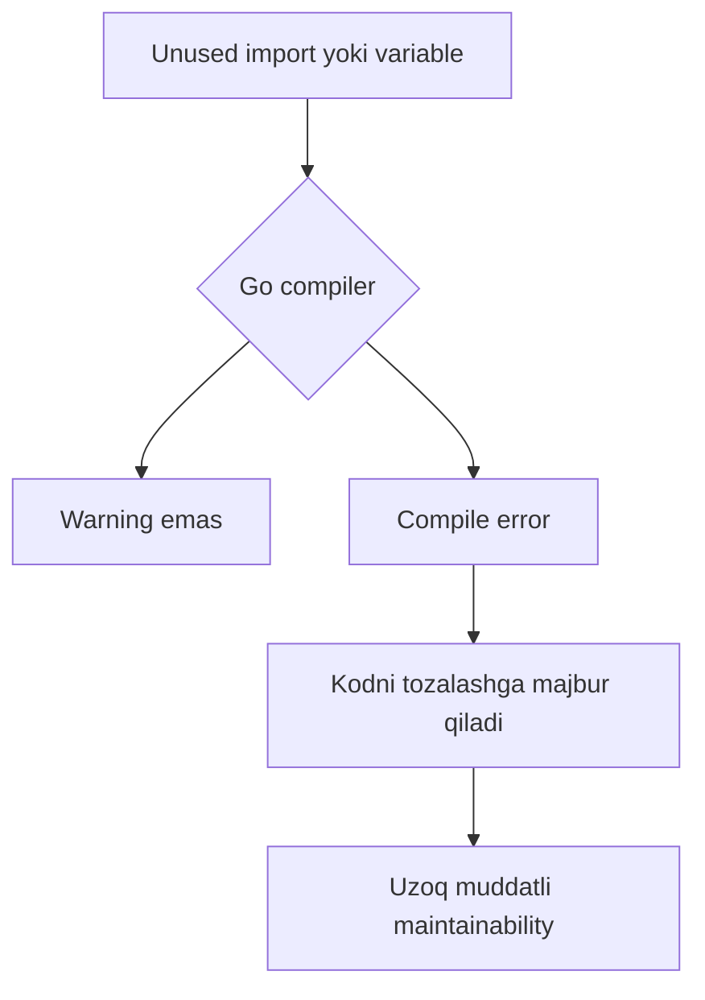
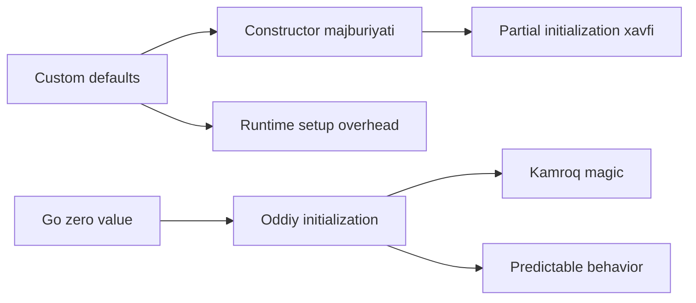

# 1. Go nimasi bilan maxsus?

Go sintaksisi ataylab minimalist qilingan. Shu sababli ko'p savollar tug'iladi: nega default parameter values yo'q, optional function parameters yo'q, method overloading yoki operator overloading yo'q, nega ternary operator ham qo'shilmagan?

Kitobning bu bobidagi asosiy fikr shunday: Go'ning soddaligi cheklov emas, kuchli tomondir. Keraksiz tanlovlarni kamaytirish orqali Go kodni boshqarishni osonlashtiradi va developer e'tiborini til bilan kurashishga emas, real muammoni yechishga qaratadi.

Barry Schwartzning "The Paradox of Choice" asaridagi g'oyaga yaqin aytsak: tanlovlar kamayganda tashvish ham kamayadi. Go shu ruhda loyihalangan.

## 1.1 Yaxshi kodga faqat chiroyli kod yetmaydi

Programming language haqida bahslar odatda syntax, performance, garbage collection, typing, concurrency kabi texnik detallarga yopishib qoladi. Bular muhim, lekin tilning haqiqiy ta'siri bundan kengroq: til biz qanday o'ylashimizni, design qilishimizni va software'ni qanday qurishimizni shakllantiradi.

Til juda chiroyli syntax va ko'p feature'larga ega bo'lishi mumkin. Lekin development process yomon bo'lsa, developer experience baribir og'ir bo'ladi. Bu yerda "process" deganda kod yozish, test qilish, saqlash, refactor qilish va vaqt o'tishi bilan projectni rivojlantirish nazarda tutiladi.

Go yaratilishiga sabab bo'lgan bir nechta real muammo:

1. **Compilation time**. Rob Pike Go yaratilishi oldidan katta C++ codebase compile bo'lishini 45 daqiqa kutganini aytadi. Bunday kutish developer ritmini buzadi: idea sinash, test qilish va tez iterate qilish qiyinlashadi.
2. **Tooling va library ekotizimi**. Refactoring, formatting, testing, documentation, dependency management kabi ishlar yaxshi tool bilan qo'llab-quvvatlanmasa, project o'sgani sari developer vaqtini til emas, atrofidagi muammolar yeb qo'yadi.
3. **Tanlovning haddan oshishi**. JavaScript'da `null` yoki `undefined` tekshirishni `||`, `??`, `?:`, `if` bilan qilish mumkin. Bu moslashuvchanlik foydali, lekin "qaysi birini qachon ishlatish kerak?" degan ortiqcha kognitiv yuk ham beradi.

Go mana shu insoniy muammolarni kamaytirishga harakat qiladi: tez compile bo'lish, oddiy syntax, yagona format, kuchli standard toolchain va kamroq noaniqlik.

## 1.2 Software qurishning Go usuli

Project kattalashgan sari muammo feature sonida emas, complexity'ni boshqarishda bo'ladi. Hozirgi distributed va highly concurrent muhitda tilning o'zi yetarli emas; til atrofidagi tools va odatlar ham systemni boshqariladigan qiladi.

Go shu maqsadda quyidagi ustunlarga tayanadi:

- **Specification**. Go boshidanoq aniq specification bilan kelgan. Bu turli compiler'lar bir xil qoidalarga amal qilishini ta'minlaydi.
- **Libraries**. Standard library hujjatlangan, practical va production uchun yetarli darajada boy: networking, cryptography, file I/O, concurrency, testing, profiling va boshqa ko'p sohalarni qamrab oladi.
- **Tools**. Go bilan birga `go test`, coverage, benchmark, `go vet`, `go fmt`, `go doc`, `go mod`, `go generate` va `golang.org/x/tools` keladi.
- **Concurrency**. Go thread'lar bilan bevosita ishlashni soddalashtirib, goroutine va channel modelini beradi. Bu mavzu 8-bobda chuqur ochiladi.

Go yomon kod yozishni butunlay to'xtatib qo'ymaydi. Har qanday tilda spaghetti code yozish mumkin. Lekin Go developer'ni yaxshiroq odatlarga majburlaydigan qoidalar beradi.

Masalan:

```go
package main

import (
    "fmt"
    "net/http"
)

func main() {
    var message string = "Hello, Go!"
    fmt.Println(message)

    var unusedVariable int
}
```

Bu code compile bo'lmaydi, chunki `net/http` import qilingan, lekin ishlatilmagan; `unusedVariable` ham e'lon qilingan, lekin ishlatilmagan.

Ko'p tilda bunday holat warning bo'lishi mumkin edi. Go esa error qiladi. Sababi oddiy: warning'lar odatda fon shovqiniga aylanadi. Developer shoshilganda IDE warning tab'ini tekshirmasligi mumkin. Go falsafasi bo'yicha, agar compiler biror narsani aytishga arzigulik deb bilsa, uni tuzatishga ham arziydi.



Bu qat'iylik ba'zida development paytida noqulay tuyuladi. Masalan, bir nechta qatorni comment qilib qo'ysangiz, variable ishlatilmay qoladi va compile to'xtaydi. Lekin Go qisqa muddatli qulaylikdan ko'ra uzoq muddatli tozalikni tanlaydi.

## 1.3 Go dizayn qarorlari

Language design doim bahsli bo'ladi. Maintainer va user bir xil narsa haqida turlicha o'ylaydi:

- Maintainer code complexity, long-term impact, backward compatibility va language philosophy haqida o'ylaydi.
- User esa hozirgi ishini tezroq, qulayroq va kamroq kod bilan bitirishni xohlaydi.

Go dizaynida maintainer mas'uliyati kuchli: feature qo'shish oson, lekin uni o'n yillar davomida saqlash qiyin.

## Nega Go'da ternary operator yo'q?

C-like tillarda ternary operator shartli qiymatni bir qatorda yozish imkonini beradi:

```go
// Ternary operator misoli
var max = (a > b) ? a : b;
```

Go'dagi ekvivalenti:

```go
max := a
if a < b {
    max = b
}
```

Go team ternary operatorni qo'shmagan, chunki u murakkab va o'qilishi qiyin expression'larni rag'batlantirishi mumkin. `if-else` uzunroq, lekin aniqroq.

Ternary operator bor joyda odamlar ba'zan bunday kod yozib qo'yadi:

```c
int n = (x > 10) ? (y < 5) ? 100 : 200 : (z == 0) ? 300 : 400;
```

Deadline yaqinlashganda "tez yozib qo'yaman" degan shortcut keyinchalik o'qish va maintain qilishni qiyinlashtiradi. Go esa kod ko'proq o'qilishini, kamroq yozilishini inobatga oladi.

Go'da ternary'ga o'xshatishga urinadigan patternlar bor:

```go
func Ternary[T any](cond bool, a, b T) T {
    if cond {
        return a
    }
    return b
}

max := Ternary(a > b, a, b)

// Boshqa yondashuv
max := map[bool]int{true: a, false: b}[a > b]
```

Lekin bu usullar haqiqiy ternary emas. Funksiya chaqirilganda argumentlarning hammasi oldindan evaluate bo'ladi:

```go
b := Ternary(a != nil, a.Thing, "default")
```

Agar `a == nil` bo'lsa ham, `a.Thing` baribir evaluate qilinadi va panic bo'lishi mumkin. Haqiqiy ternary esa faqat tanlangan branch'ni evaluate qiladi.

Buni lazy function bilan chetlab o'tish mumkin:

```go
func Ternary[T any](cond bool, f1 func() T, f2 func() T) T {
    if cond {
        return f1()
    }
    return f2()
}

aThing := func() string { return a.Thing }
defaultValue := func() string { return "default" }

Ternary(a != nil, aThing, defaultValue)
```

Ammo endi kod shunchalik og'irlashdiki, oddiy `if` yozish ancha tushunarli bo'ladi.

## Go initial value'larni qanday hal qiladi?

C# yoki JavaScript'da field'lar uchun default qiymatlarni definition paytida berish mumkin:

```csharp
public class Example {
    private int attribute1 = 10;
    private String attribute2 = "default string";
}
```

```javascript
class Example {
    constructor(attribute1 = 10, attribute2 = "default string") {
        this.attribute1 = attribute1;
        this.attribute2 = attribute2;
    }
}
```

Go boshqa yo'lni tanlaydi: explicit custom default value yo'q, hamma narsa type'ning **zero value** qiymatiga tushadi.

| Type | Zero value |
|------|------------|
| number | `0` |
| string | `""` |
| bool | `false` |
| slice | `nil` |
| map | `nil` |
| channel | `nil` |
| pointer | `nil` |

Struct field'lari uchun custom default value qo'shish taklifi bo'lgan, lekin rad etilgan.

Go'da default qiymat kerak bo'lsa, ko'p ishlatiladigan pattern constructor-like `New` funksiya:

```go
type Person struct {
    Name string
    Age  int
}

func NewPerson() *Person {
    return &Person{Name: "Unknown", Age: 18}
}
```

Boshqa pattern - `Init` method:

```go
func (p *Person) Init() {
    p.Name = "Unknown"
    p.Age = 18
}

func main() {
    p := new(Person)
    p.Init()
}
```

Ikkalasida ham muammo bor:

- User `NewPerson()` o'rniga `Person{}` ishlatib yuborishi mumkin.
- `Init()` chaqirishni unutishi mumkin.
- Struct'ni unexported (`person`) qilsangiz, initialization'ni majburlash mumkin, lekin user type'ni boshqa joyda ishlatishi qiyinlashadi.

Go team pozitsiyasi: **zero value meaningful bo'lishi kerak**. Ya'ni type shunday design qilinishi kerakki, uning zero holati iloji boricha valid va ishlatish mumkin bo'lsin.



## Soddalik va generics uchrashganda

Generics Go'ga 1.18 versiyada qo'shildi. Bu Go tarixidagi eng katta feature'lardan biri bo'ldi, chunki community uzoq vaqt davomida type-safe reusable code yozish uchun buni so'ragan.

Generics'dan oldin bir xil logic uchun har xil type'lar bo'yicha alohida funksiya yozishga to'g'ri kelardi: `maxInt`, `maxFloat`, `maxString` va hokazo. `interface{}` bilan umumlashtirish mumkin edi, lekin type assertion va runtime xatolari xavfi bor edi.

Generics bilan bunday yozish mumkin:

```go
func Max[T constraints.Ordered](a, b T) T {
    if a > b {
        return a
    }
    return b
}

func main() {
    fmt.Println(Max(1, 2))
    fmt.Println(Max(1.0, 2.0))
    fmt.Println(Max("Hello", "World"))
}
```

Bu bitta implementation'ni turli compatible type'lar uchun ishlatadi. Lekin generics bilan tilga yangi murakkabliklar ham kiradi:

- **Type parameters** - function, type va method type parameter qabul qila oladi.
- **Type inference** - compiler generic function chaqirilganda type'ni chiqarib olishi kerak.
- **Constraints** - har qanday type emas, faqat constraint mos kelgan type'lar ishlatiladi (`any`, `comparable`, `constraints.Ordered` va boshqalar).

Ba'zi generic signature'lar o'qishga og'ir bo'lishi mumkin:

```go
func MergeAndConvert[T1, T2, R any](
    slice1 []T1,
    slice2 []T2,
    convert1 func(T1) R,
    convert2 func(T2) R,
) []R {
    ...
}
```

Go team generics'ni juda ehtiyotkorlik bilan qo'shgan. Sabab: foyda yetarlicha katta bo'lsa, complexity qabul qilinadi; lekin u Go'ning asosiy ruhini buzmasligi kerak.

Type inference generics'ni oddiy function chaqirgandek his qildiradi:

```go
func printSomething(t string) {
    print(t)
}

func printSomethingG[T any](t T) {
    print(t)
}

func main() {
    printSomething("Hello, World!")
    printSomethingG("Hello, World!")
}
```

`printSomethingG[string]("Hello, World!")` deb yozish shart emas; compiler type'ni argumentdan tushunadi.

## Eslab qol

- Go feature qo'shishda "buni qilish mumkinmi?" emas, "buni qo'shish language'ni uzoq muddatda yaxshilaydimi?" deb so'raydi.
- Ternary operator yo'qligi kodni explicit va o'qiladigan qilishga xizmat qiladi.
- Zero value - Go design'idagi markaziy g'oya.
- Generics Go'ga qo'shilgan, lekin "hamma narsani generic qil" degani emas; u boilerplate kamaytirish uchun practical tool.
