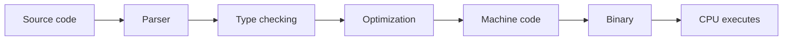
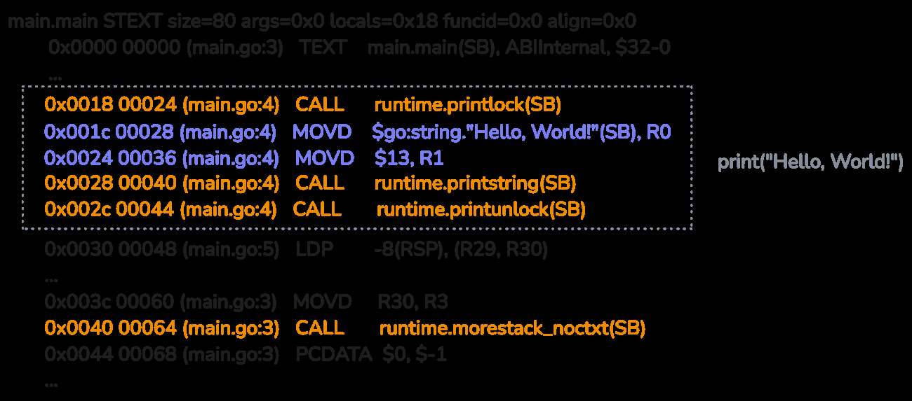
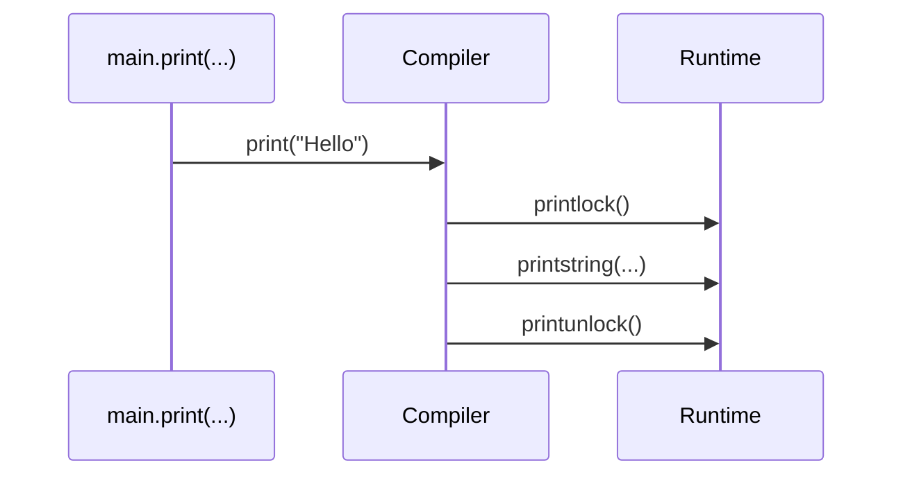

# 2. Go kodni qanday ishga tushiradi?

Go C bilan ba'zi DNKni bo'lishadi: ikkalasi ham compiled va statically typed tillar. Lekin bu so'zlar amalda nimani anglatishini tushunish Go'ning ichki ishlashini anglash uchun poydevor bo'ladi.

## Compiled language nima?

Go, C va Rust kabi tillarda yozgan source code to'g'ridan-to'g'ri ishlamaydi. Avval compiler uni machine code'ga aylantiradi. Machine code - CPU bevosita bajara oladigan past darajadagi instruction'lar to'plami.

Interpreted tillarda esa code runtime paytida interpreter orqali bajariladi. Ba'zi interpreter'lar high-level code'ni bevosita bajaradi, boshqalari esa bytecode kabi oraliq formatni bajaradi.

Compiled language'ning asosiy foydasi - tezlik. Code oldindan machine code'ga aylangani uchun runtime paytida interpreter overhead'i bo'lmaydi.

Trade-off ham bor: compiled binary odatda build qilingan architecture'ga bog'liq. Boshqa platformada ishlatish uchun qayta compile qilish kerak.

Static typing ham muhim. Go va C'da variable type'lari compile time'da aniqlanadi. Bu compiler'ga yaxshiroq optimization qilish, type xatolarini dastur ishga tushmasidan oldin tutish va code behavior'ini predictable qilish imkonini beradi.



## C va Go: oddiy Hello World

Oddiy `Hello, World!` ham Go va C orasidagi farqni ko'rsatadi.

```c
#include <stdio.h>

int main() {
    printf("Hello, World!\n");
    return 0;
}
```

```go
package main

import "fmt"

func main() {
    fmt.Println("Hello, World!")
}
```

Kitobdagi local tajribada binary hajmlari shunday chiqqan:

```text
Binary sizes:
- C binary size: 33K
- Go binary size: 2.1M
- Go binary size (no debug): 1.4M
```

Natijalar Go 1.23.5 va Apple Clang 16.0.0 bilan olingan.

Go binary `-s` flag bilan kichraytirilgan. `-s` symbol table va debug ma'lumotlarini olib tashlaydi. ELF binary'larda bu `.symtab` va `.strtab` section'lariga ta'sir qiladi; macOS Mach-O binary'larda debugging uchun ishlatiladigan STAB symbol'lari chiqarilmaydi.

`-s` odatda `-w` ni ham implied qiladi, agar `-w=false` bilan override qilinmasa. `-w` DWARF debug information'ni o'chiradi: source line, variable data va boshqa debugging metadata olib tashlanadi.

Go binary nega katta?

Sabab: Go binary odatda Go runtime bilan static link qilinadi. Hatto kichik program ham quyidagi componentlarni olib yuradi:

- garbage collector
- memory allocator
- goroutine scheduler
- stack growth mexanizmi
- runtime helper'lari

Bu bir martalik xarajat. Application kattalashgan sari runtime hajmi umumiy binary'ga nisbatan uncha katta ko'rinmaydi.

## Go yuragi: compiler va runtime

Go compiler high-level code'ni standalone binary'ga aylantiradi. Binary ichiga sizning code'ingiz, kerakli library'lar va Go runtime qo'shiladi.

Endi `fmt` ishlatmay, built-in `print` bilan minimalroq misolni ko'ramiz:

```go
package main

func main() {
    print("Hello, World!")
}
```

Buni assembly ko'rinishida tekshirish uchun:

```bash
go build -gcflags "-S"
```

Kitobdagi assembly ko'rinishi:



Bu output bir qarashda qo'rqinchli ko'rinishi mumkin, lekin asosiy g'oya oddiy: hatto string print qilishda ham compiler runtime ichidagi bir nechta function'ni chaqiradi.

`print` argument type'iga qarab runtime function'lariga tushiriladi:

| Argument type | Runtime function |
|---------------|------------------|
| bool | `runtime.printbool` |
| integer | `runtime.printint` |
| string | `runtime.printstring` |
| float | `runtime.printfloat` |
| slice | `runtime.printslice` |

Bu function'lar `src/runtime/print.go` ichida joylashgan.

Muhim detail: output bir nechta goroutine orasida aralashib ketmasligi uchun print jarayoni `runtime.printlock()` va `runtime.printunlock()` orasida bajariladi.



Assembly oxirida `runtime.morestack_noctxt` ham ko'rinishi mumkin. Bu goroutine stack'i yetmay qolsa, runtime stack'ni avtomatik kattalashtirish uchun ishlatadigan mexanizmlardan biri. Stack haqida kitob keyingi boblarda chuqurroq gapiradi.

## Nega bu muhim?

`Hello, World!` juda oddiy ko'rinadi, lekin Go ichida quyidagi kuchli mexanizmlar doim tayyor turadi:

- stack kichrayishi va kattalashishi;
- goroutine'lar uchun scheduler;
- memory allocation;
- garbage collection;
- runtime panic va safety check'lar;
- thread-safe runtime print.

Shuning uchun Go syntax jihatdan sodda, lekin runtime jihatdan ancha boy.

## Eslab qol

- Go code oldindan machine code'ga compile qilinadi.
- Go binary odatda C binary'dan katta, chunki runtime static qo'shiladi.
- `-s` va `-w` debug/symbol information'ni kamaytirib binary hajmini tushiradi.
- `print` kabi oddiy narsa ham runtime function'lariga aylanadi.
- `runtime.morestack_noctxt` Go goroutine stack'larini avtomatik boshqarish bilan bog'liq.
