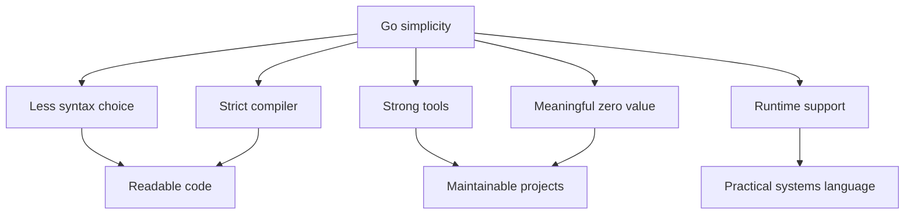

# 3. Xulosa

Go aniq missiya bilan yaratilgan: coding'ni productive, predictable va maintainable qilish. U murakkab syntax yoki ko'p feature bilan maqtanishga urinmaydi. Aksincha, kerakli ishni ishonchli bajaradigan sodda tool bo'lishni tanlaydi.

Bu bobdan chiqadigan asosiy fikrlar:

- **Soddalik - ongli design**. Go'da feature yo'qligi ko'pincha "unutib ketilgan" narsa emas, ataylab qilingan tanlovdir.
- **Development process ham language design'ning bir qismi**. `go fmt`, `go test`, `go vet`, `go mod`, standard library va compiler qat'iyligi Go'ning o'ziga xos kuchidir.
- **Unused variable/import error bo'lishi bekorga emas**. Go warning shovqinini emas, darhol tuzatiladigan xatoni tanlaydi.
- **Ternary yo'qligi clarity uchun**. Go bitta aniq control-flow construct - `if` - bilan kifoyalanadi.
- **Zero value meaningful bo'lishi kerak**. Type'lar shunday qurilsa, constructor va init ceremony kamayadi.
- **Generics practical compromise**. U soddalikni butunlay tark etmasdan, reusable va type-safe code yozish imkonini beradi.
- **Runtime doim yoningizda**. Oddiy `Hello, World!` ham garbage collector, allocator, scheduler va stack mexanizmlari bor binary ichida ishlaydi.

Go o'z qoidalarini ham mutlaq dogma qilib olmaydi. Generics bunga misol: yillar davomida qo'shilmagan feature oxiri real ehtiyoj aniq bo'lgach kiritildi. Lekin u Go ruhiga mos qilib - imkon qadar sodda va practical shaklda - qo'shildi.

Bobning yakuniy xulosasi shunday: Go soddaligi cheklov emas. Bu murakkablik haddan oshadigan software dunyosida code'ni o'qiladigan, boshqariladigan va uzoq yashaydigan qilish uchun tanlangan yo'l.
