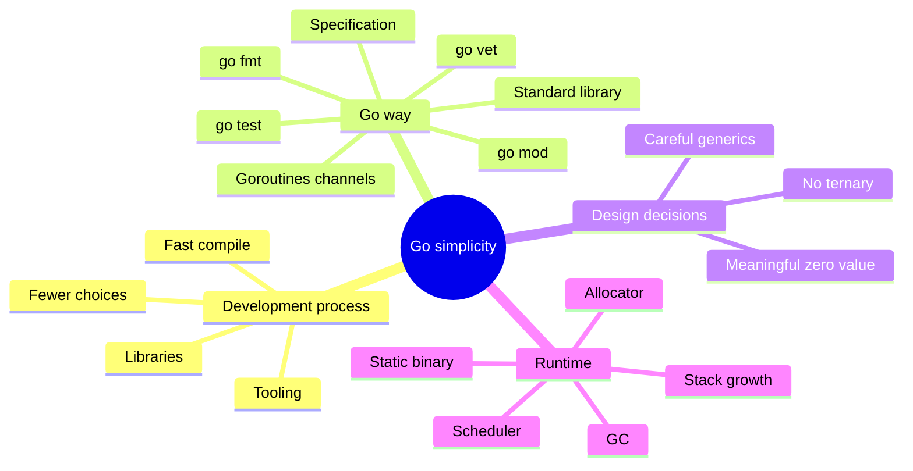

# 1-bob. Go sodda o'ylaydi, ishni yaxshiroq qiladi

> **Bu material "The Anatomy of Go" kitobining 1-bobi asosida o'zbek tilida tayyorlangan mazmuniy tarjima va o'quv qo'llanma. Asosiy ma'no, kod misollari, runtime/kompilyator nomlari va kitobdagi illustration saqlangan; mavzu qo'shimcha diagrammalar bilan boyitilgan.**

## Bob nimani o'rgatadi?

Go bir qarashda juda sodda ko'rinadi: sintaksis qisqa, kalit so'zlar kam, "sehrli" imkoniyatlar ko'p emas. Lekin bu soddalik tasodif emas. Go dizayni katta codebase'lar, tez compile bo'lish, oson review, kuchli tooling va uzoq muddatli maintainability atrofida qurilgan.

Bu bobning asosiy savollari:

- Nega Go default parameter, optional parameter, method/operator overloading, ternary operator kabi imkoniyatlarni qo'shmagan?
- Go dizayn qarorlarini qaysi g'oyalar boshqargan?
- Soddalik Go'ni faqat kichik yoki boshlang'ich projectlar uchun qilib qo'yadimi?
- Go murakkab systemlar qurishda yetarlimi?
- Oddiy `Hello, World!` ham runtime bilan qanday bog'lanadi?

## Mundarija

| Fayl | Mavzu | Qisqa tavsif |
|------|-------|--------------|
| [01_what_makes_go_special.md](01_what_makes_go_special.md) | Go nimasi bilan maxsus? | process, specification, tooling, compiler qat'iyligi, ternary, zero value, generics |
| [02_how_go_runs_your_code.md](02_how_go_runs_your_code.md) | Go kodni qanday ishga tushiradi? | compiled/static typing, binary hajmi, runtime, `print`, assembly |
| [03_summary.md](03_summary.md) | Xulosa | Bobdagi asosiy g'oyalarni birlashtirish |
| [04_references.md](04_references.md) | Manbalar | Kitobda keltirilgan havolalar |

## Bobning umumiy xaritasi

## O'qish tartibi

## Eslab qol

- Go soddaligi "imkoniyat kamligi" emas, ongli tanlovdir.
- Go language design faqat syntax haqida emas; tooling, compiler qat'iyligi va standard library ham dizaynning bir qismi.
- Go'da ko'p narsaning default holati meaningful bo'lishi kerak: zero value shu g'oyaning markazida turadi.
- Go runtime hatto juda oddiy binary ichida ham bor: garbage collector, allocator, scheduler va stack mexanizmlari binaryga qo'shiladi.

Boshlash uchun [01_what_makes_go_special.md](01_what_makes_go_special.md) faylini oching.
