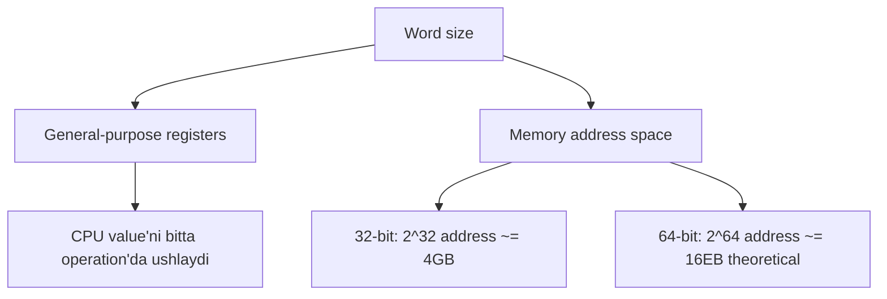

# 1. Integer Types: bit-width, semantics va system architecture

Go bir nechta integer type beradi. Type nomidagi son uning nechta bit ishlatishini bildiradi, demak u qancha xotira egallashi va qanday range'ni saqlashi ham shundan kelib chiqadi.

Go integer'lari ikki guruh:

- Signed: `int`, `int8`, `int16`, `int32`, `int64`
- Unsigned: `uint`, `uint8`, `uint16`, `uint32`, `uint64`

Maxsus alias/type'lar ham bor:

- `byte` - `uint8` alias'i
- `rune` - `int32` alias'i
- `uintptr` - har qanday pointer bit pattern'ini ushlay oladigan integer type

## Range'lar

```text
int8:  -128 to 127
int16: -32,768 to 32,767
int32: -2,147,483,648 to 2,147,483,647
int64: -9,223,372,036,854,775,808 to 9,223,372,036,854,775,807

uint8:  0 to 255
uint16: 0 to 65,535
uint32: 0 to 4,294,967,295
uint64: 0 to 18,446,744,073,709,551,615
```

`int` va `uint` boshqalardan farq qiladi: ularning hajmi fixed emas, system architecture'ga bog'liq.

```go
fmt.Println("- GOARCH:", runtime.GOARCH)
fmt.Println("- int size:", unsafe.Sizeof(int(0)))
```

64-bit systemda:

```text
- GOARCH: arm64
- int size: 8 bytes
```

32-bit systemda:

```text
- GOARCH: 386
- int size: 4 bytes
```

Qoidalar:

- 32-bit systemda `int` 4 byte, range jihatdan `int32` ga teng.
- 64-bit systemda `int` 8 byte, range jihatdan `int64` ga teng.
- `uint` ham shu architecture-dependent behavior'ga ega.

Ko'p holatda `int` array index, loop counter va umumiy arithmetic uchun yetarli va efficient. Lekin protocol parsing, binary format, hardware API kabi joylarda aniq hajm kerak bo'lsa, `int32`, `int64`, `uint16` kabi explicit type ishlatiladi.

## Word size va performance

`int`/`uint` architecture'ga bog'liqligi word size bilan bog'liq. Word size - CPU bir operation'da tabiiy ravishda ishlay oladigan data bo'lagi va address space o'lchami.



Value CPU register'iga sig'sa, processor uni bo'laklarga ajratmasdan load/store/manipulate qila oladi. Shu sababli native-sized integer ko'p oddiy holatda yaxshi tanlov.

## Integer literals va number formats

Go'da number faqat decimal ko'rinishda yozilmaydi. Go 1.13 dan boshlab integer literal'lar quyidagi formatlarni qo'llaydi:

- Decimal: oddiy base-10
- Binary: `0b` yoki `0B`
- Octal: `0o` yoki `0O`; eski leading zero (`012`) ham bor, lekin chalkashligi uchun tavsiya qilinmaydi
- Hexadecimal: `0x` yoki `0X`

```go
a := 10            // Decimal

b1 := 0b1010       // Binary
b2 := 0B1010       // Binary

o1 := 0o12         // Octal
o2 := 0O12         // Octal
o3 := 012          // Octal (not recommended)

h1 := 0xface       // Hexadecimal
h2 := 0XFaCe       // Hexadecimal
```

Qaysi format qachon qulay?

- Binary - bit manipulation, flag va mask bilan ishlaganda
- Octal - file permission'larda
- Hexadecimal - memory address, color code va low-level programming'da

```go
// Binary usage
num := 29        // 11101 in binary
mask := 0b11     // 00011: Mask for the last 2 bits
lastTwoBits := num & mask // 01: Extract the last 2 bits with bitwise AND

// Octal usage for file permissions
permission := 0o755 // Owner: rwx, Group: r-x, Others: r-x

// Hexadecimal usage
address := 0x1400004e740 // Memory address
color := 0x0000FF        // Blue color code
```

Go 1.13 dan boshlab numeric literal ichida underscore ishlatib readability oshirish mumkin:

```go
// Valid
a := 1_000_000
b := 0b_1010_1010
c := 0x_1_2_3_4_5_6_7_8
```

```go
// Invalid
d := _1234       // Cannot start with an underscore
e := 0_x1234     // Cannot place an underscore after the prefix
g := 1_000_000_  // Cannot end with an underscore
h := 1__0        // Cannot use consecutive underscores
```

Cheklovlar:

- son underscore bilan boshlanmaydi yoki tugamaydi;
- prefix (`0x`, `0b`) ichiga noto'g'ri joyda underscore qo'yilmaydi;
- ketma-ket ikki underscore bo'lmaydi.

## Overflow va underflow

Value type range'idan chiqib ketsa:

- yuqoridan chiqsa - overflow;
- pastdan chiqsa - underflow.

`int8` misolida range `-128..127`:

```go
var a int8 = 127
a++ // Wraps around to -128 (overflow)
a-- // Wraps back to 127 (underflow)
```

Integer'lar uchun Go signed integer'larda two's complement, unsigned integer'larda modulo arithmetic behavior'iga tayanadi. Runtime hisob-kitoblarda wrap-around bo'lishi mumkin:

```go
func main() {
    // Compile error: 128 is too large for int8
    var a int8 = 128

    // This runs, but overflows at runtime
    var b int8 = 127
    var c = b + 1 // Wraps around to -128
}
```

Bu Go o'ylab topgan "g'alati" narsa emas; fixed-width CPU register'lari qanday ishlashidan keladi. Bitlar sig'masa, ortiqcha bitlar tushib qoladi.

## Integer type'lar orasida explicit conversion

Go automatic numeric conversion qilmaydi. Har xil integer type'lar orasida conversion explicit bo'lishi kerak:

```go
var a int8 = 10
var b int16 = int16(a)      // Explicit conversion
var c = int32(int16(a) + b) // More explicit conversion
```

Bu biroz ko'proq yozuv talab qiladi, lekin silent truncation, sign change va platform-dependent bug'larni kamaytiradi. Go FAQ'dagi g'oya: C dagi automatic numeric conversion qulayligi ko'pincha chalkashlikdan arzimas bo'lib qoladi.

Explicit conversion xavfsizlik kafolati emas. Data loss baribir bo'lishi mumkin:

```go
var a int16 = 130
var b int8 = int8(a) // Overflow (>127), wraps around, b becomes -126

var u int8 = -1
var v uint8 = uint8(u) // Underflow (<0), wraps around, v becomes 255
```

Constants esa compile time'da tekshiriladi:

```go
const a = 255

var b uint8 = a
var c uint8 = a + 1 // cannot use a + 1 (untyped int constant 256) as uint8 value in variable declaration (overflows)
```

## Division by zero

Integer division by zero Go'da jiddiy xato. Agar compiler zero'ni compile time'da ko'rsa, darhol error beradi. Agar divisor runtime'da zero bo'lib qolsa, panic bo'ladi:

```go
func main() {
    a := 0
    println(a / 0)  // compile error: invalid operation: division by zero
    println(10 / a) // panic: runtime error: integer divide by zero
}
```

Runtime buni `panicdivide()` orqali panic'ga aylantiradi:

```go
package runtime

func panicdivide() {
    panicCheck2("integer divide by zero")
    panic(divideError)
}
```

Past darajada compiler divisor zero emasligini tekshiradi:

```asm
00112 CBNZ      R2, 120 ; if R2 (the divisor) is not zero, jump to 120
00116 JMP       164     ; if zero, jump to 164, which triggers the panic

00164 CALL      runtime.panicdivide(SB)
```

`R2` register divisor'ni ushlab turadi. `CBNZ` - Compare and Branch on Non-Zero. Divisor zero bo'lsa, code panic path'ga sakraydi.

## Eslab qol

- `int` va `uint` architecture-dependent; exact size kerak bo'lsa explicit type ishlat.
- Integer literal'lar decimal, binary, octal, hex formatlarda yozilishi mumkin.
- Runtime integer overflow wrap-around qiladi; constant overflow compile time'da tutib olinadi.
- Go numeric conversion'ni explicit qiladi.
- Integer division by zero compile error yoki runtime panic bo'ladi.
