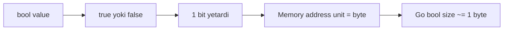

# 3. Boolean Type: 1 byte memory representation

Go'da boolean type `bool` deb ataladi. U faqat ikki qiymat qabul qiladi:

- `true`
- `false`

```go
var a bool = true         // true
var b bool                // false (default zero value)
c := !a                   // false
```

Boolean'lar `if`, `for`, `switch` kabi control flow statement'larda va logical operation'larda ishlatiladi:

- `&&` - and
- `||` - or
- `!` - not

```go
if a && !b || c {
    ...
}
```

Go boolean'ga juda qat'iy qaraydi. `bool` ni integer'ga convert qilib bo'lmaydi, integer'ni esa condition sifatida ishlatib bo'lmaydi:

```go
var a bool = true
var b int = int(a) // Error: cannot convert a (type bool) to type int

if b { // Error: non-boolean condition in if statement
    // ...
}
```

`int(bool)` conversion'ni qo'llash taklifi bo'lgan, lekin rad etilgan. Go'da condition har doim aniq `bool` bo'lishi kerak.

## Nega bool 1 byte?

Boolean uchun nazariy jihatdan 1 bit yetarli. Lekin Go'da `bool` 1 byte egallaydi.

Sabab: ko'p modern system'larda xotiraning eng kichik addressable unit'i 1 byte. Har bir variable address'ga ega bo'lishi kerak; CPU odatda bitta bitni alohida address qila olmaydi.



## Eslab qol

- `bool` zero value - `false`.
- Go'da `if 1 {}` yoki `if b {}` (`b int`) mumkin emas.
- `bool` integer'ga implicit ham, explicit ham convert qilinmaydi.
- Memory'da `bool` amaliy sabab bilan 1 byte sifatida saqlanadi.
