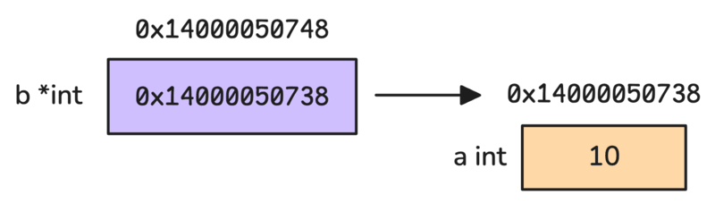
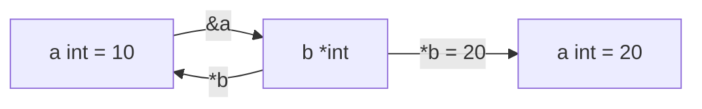
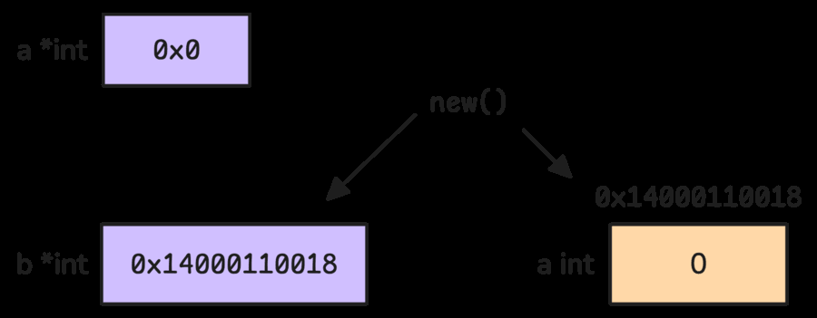
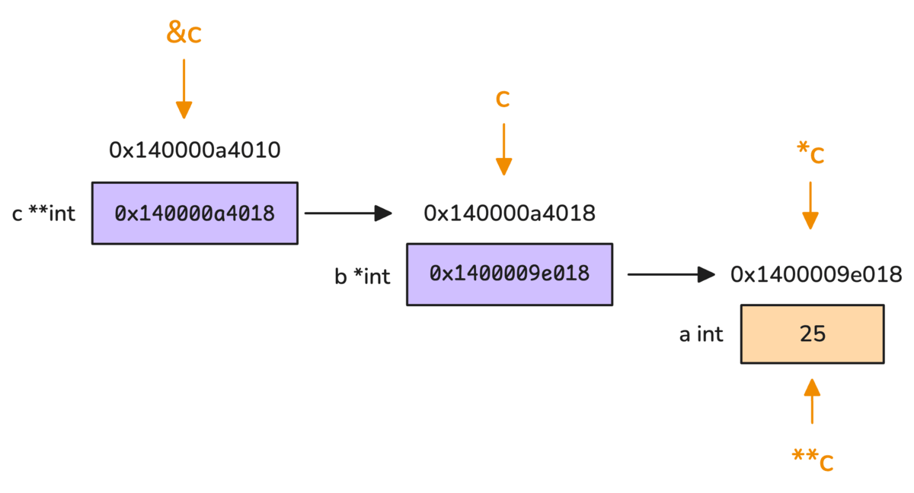
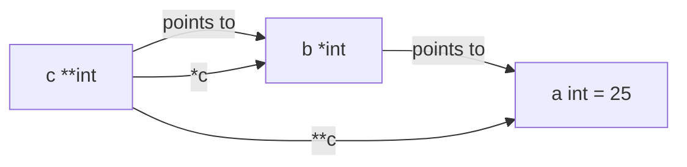

# 4. Pointer Types: memory address, dereference va allocation

Har bir variable xotirada joylashadi, va shu joyning address'i bor. Pointer esa value'ni o'zi emas, shu value joylashgan memory address'ni saqlaydigan variable.

## 4.1 Pointer'ni tushunish

```go
func main() {
    var a int = 10
    var b *int // Declaring a pointer to an int

    b = &a       // Assigning b the address of a
    println(b)  // Prints the memory address of a, e.g., 0x14000050738
    println(*b) // Prints 10, the value stored at the memory address b points to

    *b = 20     // Updates the value at that address (a becomes 20)
    println(a)  // Prints 20
    println(&b) // Prints b's own memory address, e.g., 0x14000050748
}
```

Qadamlar:

- `*int` - `int` qiymatiga pointer type.
- `&a` - `a` variable'ining memory address'ini olish.
- `*b` - `b` ko'rsatayotgan address ichidagi value'ni olish, ya'ni dereference.
- `*b = 20` - pointer orqali original `a` qiymatini o'zgartirish.

Kitobdagi rasm:



Address qiymati masalan `0x14000050738` kabi chiqadi. Bu raqam machine, OS, runtime holati va execution'ga qarab o'zgaradi. Muhimi raqamning o'zi emas, uning memory location ekanini tushunish.

Pointer ham variable. Shuning uchun `&b` bilan pointer variable'ining o'z address'ini olish mumkin.

> **Note:** `a` va `b` address'lari bir-biriga yaqin chiqishi mumkin, lekin Go bunday yaqinlik yoki barqarorlikni kafolatlamaydi.

Memory address hexadecimal ko'rinishda chiqadi, chunki katta sonlarni qisqa va o'qishli ko'rsatadi. Pointer ichki tomondan address-sized unsigned number sifatida ifodalanadi:

- 32-bit systemda pointer 4 byte
- 64-bit systemda pointer 8 byte



## `new()` bilan pointer yaratish

Go'da pointer yaratishning yana bir yo'li - built-in `new()`:

```go
var a *int
var b *int = new(int)

a  // nil
b  // 0x14000110018
*b // 0
```

Tushuntirish:

- `var a *int` - `int` pointer e'lon qilindi, lekin address berilmadi, zero value `nil`.
- `new(int)` - `int` uchun zero value (`0`) joy ajratadi va unga pointer qaytaradi.

Kitobdagi rasm:



Ko'pchilik `new()` pointer qaytargani uchun doim heap allocation qiladi deb o'ylaydi. Bu noto'g'ri. Go compiler escape analysis orqali pointer function tashqarisiga chiqmasligini tushunsa, allocation'ni stack'da qilishi mumkin.

## 4.2 Type safety, nil pointer va dereference panic

Go pointer'lari type-specific:

```go
var a int = 10
var b *string = &a // cannot use &a (type *int) as type *string in assignment
```

Address ichki tomondan number bo'lsa ham, Go pointer qaysi type'ga ishora qilayotganini qat'iy nazorat qiladi. `*int` bilan `*string` aralashmaydi.

Pointer zero value - `nil`. `nil` pointer valid memory location'ga ishora qilmaydi. Uni dereference qilish panic:

```go
func main() {
    var a *int

    println(*a) // panic: runtime error: invalid memory address or nil pointer dereference
}
```

Go pointer arithmetic'ni ham taqiqlaydi:

```go
// Go'da bunday pointer = pointer + 1 uslubi yo'q
```

Bu invalid memory'ga ishora qilish, unpredictable behavior va crash xavfini kamaytiradi. Agar haqiqatan ham memory'ni past darajada boshqarish kerak bo'lsa, `unsafe` package bor; lekin u alohida ehtiyot talab qiladi.

## Double pointer

Pointer ham variable bo'lgani uchun uning ham address'i bor. Pointer'ga pointer yaratish mumkin:

```go
func main() {
    var a int = 25
    var b *int = &a
    var c **int = &b

    println(&c)  // 0x140000a4010: the memory address of c itself
    println(c)   // 0x140000a4018: the address stored in c (which points to b)
    println(*c)  // 0x1400009e018: the address stored in b (which points to a)
    println(**c) // 25: the value stored at the memory address of a
}
```

Kitobdagi rasm:





## Eslab qol

- `&x` - address olish.
- `*p` - pointer ko'rsatayotgan value'ni olish.
- Pointer zero value - `nil`; `*nilPointer` panic.
- `new(T)` zero value uchun joy ajratib, `*T` qaytaradi.
- Pointer address-sized bo'lsa ham, Go type safety va pointer arithmetic restriction bilan himoya qiladi.
