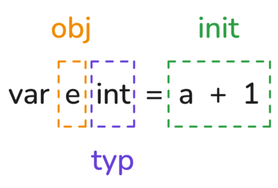
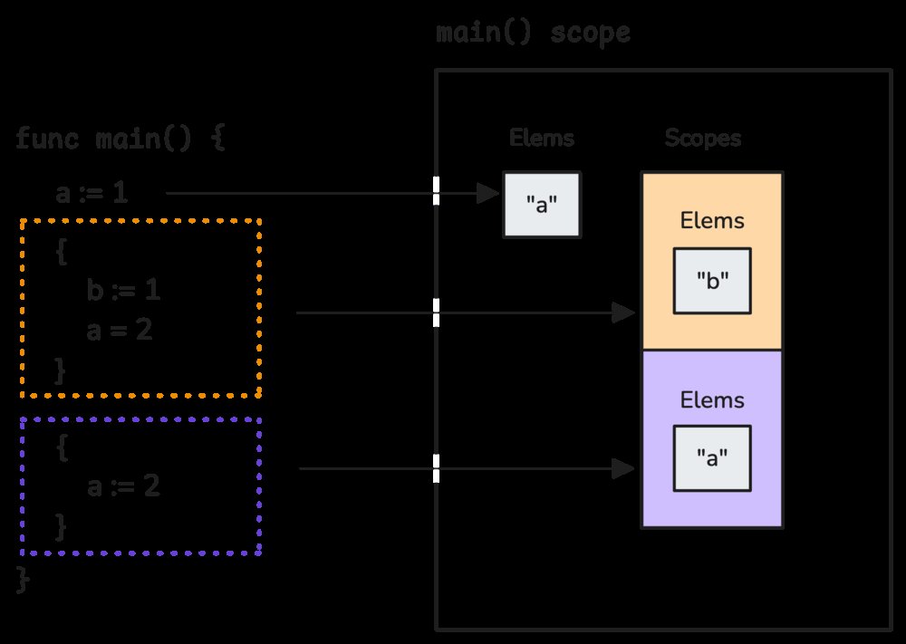
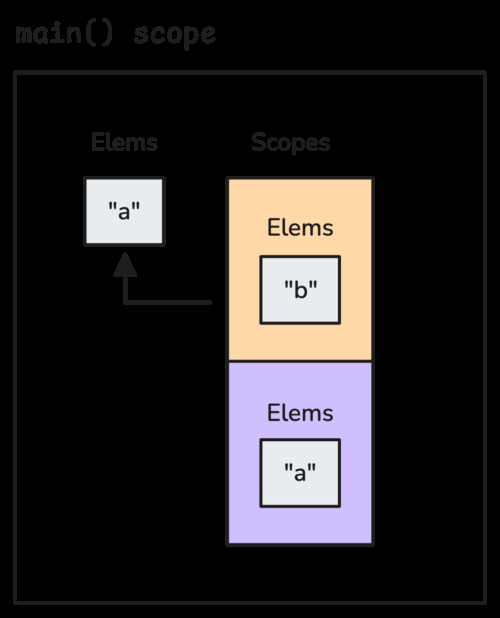
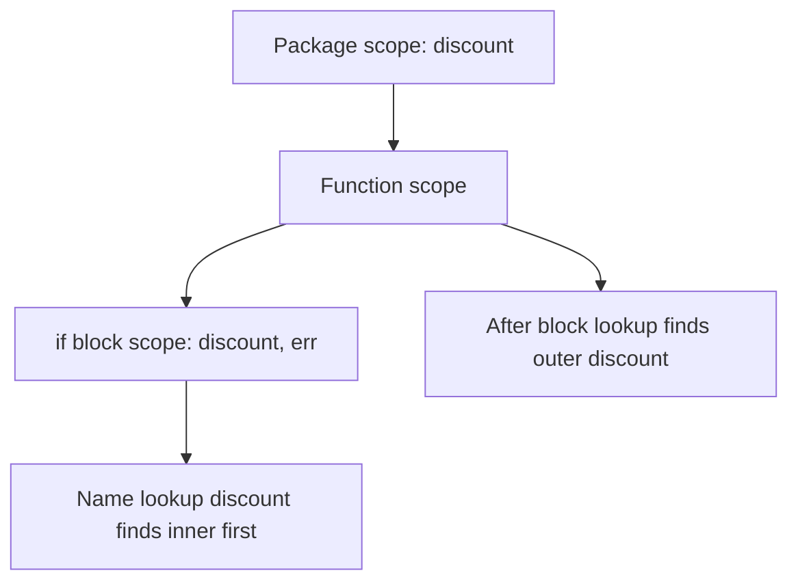
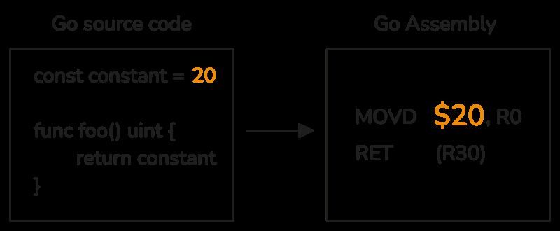
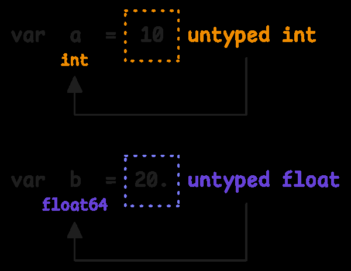

# 5. Variables & Constants: declaration, scope va compiler behavior

Bu bo'lim qiziqroq, chunki compiler faqat xotira ajratib, hisob-kitob qilmaydi. U type tekshiradi, scope quradi, shadowing'ni tabiiy qoidalar bilan hal qiladi, unused variable'larni topadi va constant expression'larni compile time'da hisoblaydi.

## 5.1 Variable declarations, scope va initialization

Go'da variable odatda `var` bilan e'lon qilinadi:

```go
var a int
var h = 2
```

`h` uchun type yozilmadi, compiler assigned value'dan `int` deb chiqaradi.

Bir nechta variable'ni group qilib yozish mumkin:

```go
var (
    b int
    c string
    d float64
)
```

Explicit type va initial value ham berish mumkin:

```go
var e int = 1
var f, g int = 2, 3
```

Variable declaration uchta asosiy qismdan iborat:

- `obj` - variable nomi va object'i
- `typ` - explicit type
- `init` - initialization expression

Kitobdagi rasm:



Compiler variable declaration'ni type-checking phase'da tekshiradi. Kitobda `src/cmd/compile/internal/types2/decl.go` dan quyidagi g'oya keltirilgan:

```go
func (check *Checker) varDecl(obj *Var, lhs []*Var, typ, init syntax.Expr) {
    assert(obj.typ == nil)

    // determine type, if any
    if typ != nil {
        obj.typ = check.varType(typ)
    }

    // check initialization
    if init == nil {
        if typ == nil {
            // error reported before by arityMatch
            obj.typ = Typ[Invalid]
        }
        return
    }

    if lhs == nil || len(lhs) == 1 {
        assert(lhs == nil || lhs[0] == obj)
        var x operand
        check.expr(newTarget(obj.typ, obj.name), &x, init)
        check.initVar(obj, &x, "variable declaration")
        return
    }
    ...
}
```

Bu function parsing'dan keyingi type-checking bosqichida ishlaydi. Parsing source code'ni syntax tree'ga aylantiradi. Type checking esa shu tree ustidan yurib, type qoidalarini tekshiradi.

Asosiy logic:

```go
// determine type, if any
if typ != nil {
    obj.typ = check.varType(typ)
}

// check initialization
if init == nil {
    if typ == nil {
        // error reported before by arityMatch
        obj.typ = Typ[Invalid]
    }
    return
}
```

Agar type bor bo'lsa (`var x int`), compiler type'ni object'ga yozadi. Agar type ham, init ham yo'q bo'lsa:

```go
var a
```

compiler type topa olmaydi va declaration invalid bo'ladi.

Variable e'lon qilishning ikki valid yo'li bor:

1. Type explicit: `var a int`
2. Type init expression'dan inferred: `var a = 1 + 2.2`

Initialization bor bo'lsa:

```go
if lhs == nil || len(lhs) == 1 {
    assert(lhs == nil || lhs[0] == obj)
    var x operand
    check.expr(newTarget(obj.typ, obj.name), &x, init)
    check.initVar(obj, &x, "variable declaration")
    return
}
```

Compiler init expression'ni tekshiradi. Type explicit bo'lsa, qiymat shu type'ga mos kelishi kerak. Type yo'q bo'lsa, compiler init'dan type chiqaradi.

## Short variable declaration (`:=`)

Function ichida variable e'lon qilishning qisqa usuli:

```go
func main() {
    g := 10
    h, i := 20, "example"
    h, k := 30, 40
}
```

`:=` chap tomonda joriy scope'da mavjud bo'lmagan variable bo'lsa, uni yaratadi. Mavjud variable bo'lsa, qayta assignment qiladi. Bitta declaration'da kamida bitta yangi non-blank name bo'lishi shart.

`:=` faqat function body ichida ishlaydi. Function tashqarisida har bir statement `var`, `func`, `type`, `const` kabi keyword bilan boshlanishi kerak.

`:=` va `var` orasidagi farqlar:

| Aspect | `:=` | `var` |
|--------|------|-------|
| Qayerda ishlaydi | Faqat function body ichida | Package level va function ichida |
| Type annotation | Yozib bo'lmaydi, inferred | Yozish ham, tashlab ketish ham mumkin |
| Grouped declaration | Yo'q | `var (...)` bor |
| `if/for/switch` short statement | Bor: `if x := f(); x > 0 {}` | `if var x = f(); ...` yo'q |
| Yangi variable sharti | Kamida bitta yangi name kerak | Har safar yangi binding |
| Same block re-declaration | Kamida bitta yangi name bo'lsa mumkin | Same block'da mavjud name error |
| Tipik xato | Outer variable shadowing | Shadowing mumkin, lekin explicit yozuv niyatni aniqroq qiladi |

Muhim restriction: `:=` chap tomonida hamma narsa **plain variable name** bo'lishi kerak. Selector, index yoki dereference bo'lmaydi:

```go
person.Age, name := 20, "John" // non-name person.Age on left side of :=
a[0], b := 1, 2                // non-name a[0] on left side of :=
m["key"], n := 1, 2            // non-name m["key"] on left side of :=
*ptr, c := 1, 2                // non-name *ptr on left side of :=
```

Bular declaration emas, mavjud joyga assignment qiladigan expression'lar. Shu sababli `:=` bilan aralashtirib bo'lmaydi.

## Variable shadowing va scope resolution

Shadowing - inner scope'da outer scope'dagi variable bilan bir xil nomda yangi variable e'lon qilinishidir. Inner variable outer variable'ni "yopib qo'yadi".

```go
func main() {
    var discount int
    cartTotal := 500

    if cartTotal > 100 {
        discount, err := db.GetDiscount()
        if err != nil {
            panic(err)
        }

        recordDiscount(discount)
    }

    // ... process cartTotal and discount
    fmt.Printf("You saved %d\n", discount)
}

// Output: You saved 0
```

Bu yerda `if` ichidagi `discount, err := ...` outer `discount` ni yangilamaydi. U inner scope'da yangi `discount` yaratadi, chunki `err` yangi variable va `:=` declaration qilmoqda. Block tugagach, inner `discount` yo'qoladi, outer `discount` esa `0` bo'lib qoladi.

Go'da har bir `{}` block yangi scope bo'lishi mumkin:

```go
if condition { // new scope

}

for condition { // new scope

}

{ // manual scope block

}
```

Compiler scope'larni tree shaklida saqlaydi. Kitobda `Scope` strukturasi quyidagicha ko'rsatiladi:

```go
type Scope struct {
    parent   *Scope
    children []*Scope
    elems    map[string]Object
    isFunc   bool

    ...
}
```

Kitobdagi rasm:



Lookup current scope'dan boshlanadi. Topilmasa parent scope'ga ko'tariladi. Shu sababli eng ichki declaration ustun bo'ladi:

```go
// Lookup returns the object in scope s with the given name if such an
// object exists; otherwise, the result is nil.
func (s *Scope) Lookup(name string) Object {
    return resolve(name, s.elems[name])
}

func (s *Scope) LookupParent(name string, pos syntax.Pos) (*Scope, Object) {
    for ; s != nil; s = s.parent {
        if obj := s.Lookup(name); obj != nil && ... {
            return s, obj
        }
    }
    return nil, nil
}
```

Kitobdagi rasm:





## Unused variable enforcement

Go'da e'lon qilingan, lekin ishlatilmagan local variable compile error. Bu import va label'lar uchun ham amal qiladi.

```go
var global int = 10

func (receiver AnyType) checkUnused(arg int) (named int) {
    var local int = 20 // Compiler error: local declared and not used

    {
        var local int = 30 // Compiler error: local declared and not used
    }

    return
}
```

Bu misolda `global`, `arg`, `receiver`, `named` ham ishlatilmayapti. Lekin compiler faqat local variable'larni flag qiladi. Sabab compiler usage check'ni scope va object'lar orqali bajaradi.

Compiler ichida variable, package import va label object'larida `used` flag bor:

```go
type Var struct {
    object
    used     bool // Set if the variable was used or function arguments were accessed
    isField  bool // Set if the variable is a struct field
    embedded bool // Set if the variable is an embedded struct field, with name as the type name

    ...
}

type PkgName struct {
    object
    imported *Package
    used     bool // Set if the package was used
}

type Label struct {
    object
    used bool // Set if the label was used
}
```

Compiler scope ichidagi object'larni ko'rib, `used == false` bo'lgan variable'larni topadi:

```go
func (check *Checker) usage(scope *Scope) {
    ...

    // Collect all unused variables in the current scope
    for name, elem := range scope.elems {
        elem = resolve(name, elem)
        if v, _ := elem.(*Var); v != nil && !v.used {
            unused = append(unused, v)
        }
    }
    ...

    // Throw an error for each unused variable, but still continue checking
    for _, v := range unused {
        check.softErrorf(v.pos, UnusedVar, "%s declared and not used", v.name)
    }

    // Recursively check child scopes, but skip function scopes
    for _, scope := range scope.children {
        if !scope.isFunc {
            check.usage(scope)
        }
    }
}
```

Global variable'lar bu local usage check doirasiga kirmaydi. Function parameter'lar esa interface satisfaction yoki signature sababli kerak bo'lishi mumkin, shuning uchun compiler ularni boshidanoq used deb belgilaydi:

```go
func NewVar(...) *Var {
    return &Var{object: object{...}}
}

func NewParam(...) *Var {
    return &Var{object: object{...}, used: true} // Parameters are always 'used'
}
```

Receiver va named return value ham `NewParam` orqali yaratilgani uchun unused deb flag qilinmaydi:

```go
func (receiver AnyType) doSomething(arg int) (named int) {
    return 0
}
```

Lekin variable'ga assignment qilishning o'zi "meaningful use" emas:

```go
func main() {
    var a int = 10 // a declared and not used
    var b int = 10

    a = b * 2
}
```

`a` program behavior'iga ta'sir qilmayapti, shuning uchun unused hisoblanadi.

## 5.2 Constants: fixed values, type semantics va optimization

Constant - bir marta berilgach o'zgarmaydigan value. U raw number/string o'rniga ma'noli nom berib, code'ni o'qishli qiladi:

```go
func calculatePrice(price float64) float64 {
    // hard-coded value with no context
    return price + (price * 0.07)
}
```

Yaxshiroq:

```go
const taxRate = 0.07 // clear, named constant for the tax rate

func calculatePrice(price float64) float64 {
    return price + (price * taxRate)
}
```

Katta constant'lar, masalan string literal'lar, binary'dagi read-only segmentlarda saqlanishi mumkin. Kichik constant'lar esa compiler tomonidan instruction ichiga embedded qilinadi.

Kitobdagi rasm:



`foo` function `20` constant qaytarsa, compiler value'ni alohida memory'dan o'qimasdan instruction ichiga joylashtirishi mumkin.

Constant declaration:

```go
const a int = 10    // a is an int constant with value 10
const b = 20        // b is an untyped int constant with value 20
const c, d = 30, 40 // multiple constants in one line
```

Go constant'lari faqat basic type'lar bilan bo'ladi:

- numbers
- booleans
- strings

Array, slice, map, struct uchun constant yo'q. Immutable/read-only composite type'lar haqida takliflar bo'lgan, lekin Go'da hali standard qoidaga aylangan emas.

Compiler basic kind'larni shunday tasniflaydi:

```go
type BasicKind int

const (
    Invalid BasicKind = iota // type is invalid

    // predeclared types
    Bool
    Int
    Int8
    Int16
    Int32
    Int64
    Uint
    Uint8
    Uint16
    Uint32
    Uint64
    Uintptr
    Float32
    Float64
    Complex64
    Complex128
    String
    UnsafePointer

    // types for untyped values
    UntypedBool
    UntypedInt
    UntypedRune
    UntypedFloat
    UntypedComplex
    UntypedString
    UntypedNil

    // aliases
    Byte = Uint8
    Rune = Int32
)
```

Bu uch guruhni ko'rsatadi:

- predeclared types;
- untyped value type'lari;
- aliases (`byte`, `rune`).

## Typed constants va compile-time evaluation

Typed constant fixed type'ga ega:

```go
// Explicitly specify the type
const a int = 10

// Let the compiler infer the type
const b = int(20)
```

Go constant expression'larni compile time'da hisoblaydi. Bu constant folding deyiladi:

```go
const c = a + b
```

Constant overflow compile time'da ushlanadi:

```go
var c int8 = 127
var d int8 = c + 1
```

Bu runtime wrap-around qilishi mumkin. Lekin:

```go
const a int8 = 127
const b int8 = a + 1
```

Compiler: `a + 1 (constant 128 of type int8) overflows int8`.

## Untyped constants va inference rules

Numeric literal'lar default holatda untyped constants:

```go
var a = 10  // a is an int
var b = 20. // b is a float64
```

Literal'lar context berilmaguncha untyped qoladi. Kitobdagi rasm:



Shu sababli bir xil `10` turli type'larga assign bo'la oladi:

```go
var a int = 10
var b uint = 10
var c int8 = 10
```

Compiler literal kind'ni untyped constant sifatida belgilaydi:

```go
func (x *operand) setConst(k syntax.LitKind, lit string) {
    switch k {
    case syntax.IntLit:
        kind = UntypedInt
    case syntax.FloatLit:
        kind = UntypedFloat
    case syntax.ImagLit:
        kind = UntypedComplex
    case syntax.RuneLit:
        kind = UntypedRune
    case syntax.StringLit:
        kind = UntypedString
    default:
        unreachable()
    }

    ...
}
```

Untyped constant default type kerak bo'lganda `Default` mapping ishlaydi:

```go
func Default(t Type) Type {
    if t, _ := t.(*Basic); t != nil {
        switch t.kind {
        case UntypedBool:
            return Typ[Bool]
        case UntypedInt:
            return Typ[Int]
        case UntypedRune:
            return universeRune // use 'rune' name
        case UntypedFloat:
            return Typ[Float64]
        case UntypedComplex:
            return Typ[Complex128]
        case UntypedString:
            return Typ[String]
        }
    }
    return t
}
```

Default examples:

```go
var a = 10      // a is an int
var b = 20.     // b is a float64
var c = 'A'     // c is a rune
var d = "hello" // d is a string
var e = 1 + 2i  // e is a complex128
var f = true    // f is a bool
```

Untyped integer constant mos range'ga sig'sa turli type'larga assign bo'ladi:

```go
const a = 10 // a is UntypedInt

var _ int8 = a
var _ int16 = a
var _ int32 = a
var _ int64 = a
var _ uint = a
var _ uint8 = a
var _ uint16 = a
var _ uint32 = a
var _ uint64 = a
var _ uintptr = a
var _ float32 = a
var _ float64 = a
```

Untyped float ham value exact representable bo'lsa integer'ga assign bo'lishi mumkin:

```go
const a = 10. // a is UntypedFloat
var _ int = a // valid

const b = 10.1
var _ int = b // invalid: cannot use b (untyped float constant 10.1) as int value in variable declaration (truncated)
```

Compiler constant maqsad type'da representable ekanini tekshiradi:

```go
func representableConst(x constant.Value, ..., typ *Basic, rounded *constant.Value) bool {
    ...

    switch {
    case isInteger(typ):
        ...
        if x, ok := constant.Int64Val(x); ok {
            switch typ.kind {
            case Int:
                var s = uint(sizeof(typ)) * 8
                return int64(-1)<<(s-1) <= x && x <= int64(1)<<(s-1)-1
            }
        }

    case isFloat(typ):
        ...
        switch typ.kind {
        case Float32:
            if rounded == nil {
                return fitsFloat32(x)
            }
            r := roundFloat32(x)
            if r != nil {
                *rounded = r
                return true
            }
        }
    }
    ...
}
```

Qoidalar:

- Integer target uchun value range ichida bo'lishi kerak.
- Float target uchun value precision/range ichida bo'lishi kerak; kerak bo'lsa representable rounding tekshiriladi.

Untyped constants juda katta bo'lishi mumkin:

```go
const a = (1<<64 - 1) * 5 // 5 times the max value of uint64
const b = 12345678901234567890123456789012345678901234567890123456789012345678901234567890
```

Lekin compiler ichida limit bor. Go compiler untyped integer constants uchun 512-bit precision limit qo'yadi:

```go
func (check *Checker) overflow(x *operand, opPos syntax.Pos) {
    ...
    if isTyped(x.typ) {
        check.representable(x, under(x.typ).(*Basic))
        return
    }

    // Untyped integer values must not grow arbitrarily.
    const prec = 512 // 512-bit precision limit
    if x.val.Kind() == constant.Int && constant.BitLen(x.val) > prec {
        ...
        check.errorf(atPos(opPos), InvalidConstVal, "constant %soverflow", op)
        ...
    }
}
```

Invalid holatlar:

```go
// Invalid: number exceeds allowed size
const a = 1234567890... // (repeated 16 times)

// Invalid: too small for float64 to represent accurately
smallestFloat64 = 1.0 / (1<<(1023 - 1 + 52))
```

## `iota`: implicit sequencing

`iota` - constant block ichida sequence yaratishni osonlashtiradigan built-in identifier. Har bir `const` block boshida `0` dan boshlanadi va har yangi declaration line bilan bittadan oshadi.

```go
const (
    a = iota // 0
    b = iota // 1
    c = iota // 2
)

const (
    d = iota // 0
    e        // 1
    f        // 2
)
```

Ikkinchi block'da `iota` takror yozilmagan, chunki Go oldingi expression'ni implicit reuse qiladi.

Implicit repetition `iota`ga xos emas:

```go
const (
    a = 1 // 1
    b     // 1 (implicit repetition)
    c = 2 // 2
    d     // 2 (implicit repetition)
)
```

`iota` expression ichida pattern yaratadi:

```go
const (
    a = 2 * iota // 0
    b            // 2
    c            // 4
)

const (
    e = 2*iota + 1 // 1
    f              // 3
    g              // 5
)
```

`iota` untyped integer constant. Shu sababli turli numeric type'lar bilan ishlaydi:

```go
const (
    a int8 = iota // 0
    b             // 1
    c             // 2
)

const (
    d float32 = iota // 0
    e                // 1
    f                // 2
)
```

Sequence uzilsa, `iota` baribir declaration line position bo'yicha yuradi:

```go
const (
    a = iota // 0
    b = 10   // 10
    c        // 10 (implicit repetition, not iota)
    d = iota // 3
)
```

`iota` keyword emas. Uni variable nomi sifatida ham ishlatish mumkin, lekin const block ichida special identifier sifatida ma'no oladi.

```go
const (
    a = 10   // 10
    b = iota // 1
    c = 20   // 20
    d = iota // 3
    e        // 4
)
```

Bu yerda `e` oldingi explicit expression (`iota`) ni inherit qiladi, shuning uchun `4`.

Inheritance oddiy constantlarda ham ishlaydi:

```go
const (
    A = 10
    B // Inherits the value of A (10)
    C // Inherits the value of B (10)
    D = 11
    E // Inherits the value of D (11)
)
```

Multiple constants on same line:

```go
const (
    a, b = iota, iota + 1 // 0, 1
    c, d                 // 1, 2
)
```

`c, d` aslida `c, d = iota, iota + 1` pattern'ini inherit qiladi, lekin current line'da `iota == 1`.

Compiler `collectObjects` ichida const declaration'larni yig'ayotganda `iota`ni declaration index orqali hisoblaydi:

```go
iota := constant.MakeInt64(int64(index - first))
```

Value/type inheritance logic:

```go
inherited := true
switch {
case s.Type != nil || s.Values != nil:
    last = s
    inherited = false
case last == nil:
    last = new(syntax.ConstDecl)
    inherited = false
}
```

Multiple name'lar uchun oldingi values unpack qilinadi:

```go
values := syntax.UnpackListExpr(last.Values)
for i, name := range s.NameList {
    obj := NewConst(name.Pos(), pkg, name.Value, nil, iota)

    var init syntax.Expr
    if i < len(values) {
        init = values[i]
    }

    d := &declInfo{file: fileScope, vtyp: last.Type, init: init, inherited: inherited}
    check.declarePkgObj(name, obj, d)
}
```

## Eslab qol

- `var` package level va function ichida ishlaydi; `:=` faqat function ichida.
- `:=` kamida bitta yangi variable yaratishi kerak.
- Shadowing ko'p bug'ning manbai; `:=` ishlatganda outer variable'ni yangilayapsanmi yoki inner variable yaratyapsanmi, tekshir.
- Go compiler local unused variable/import/label'larni error qiladi.
- Constant'lar compile time'da baholanadi.
- Untyped constants context'ga moslashadi, lekin target type'da representable bo'lishi shart.
- Untyped integer constants amalda 512-bit compiler limit'ga ega.
- `iota` line position bo'yicha yuradi va const block boshida reset bo'ladi.
