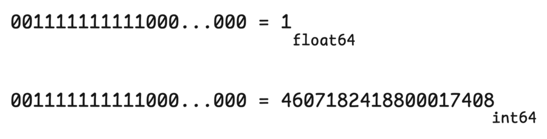
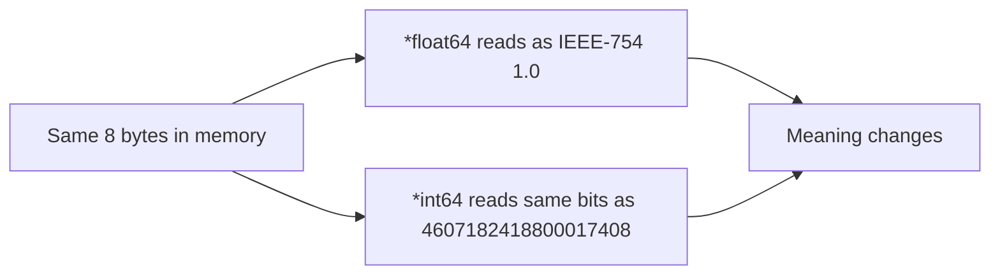
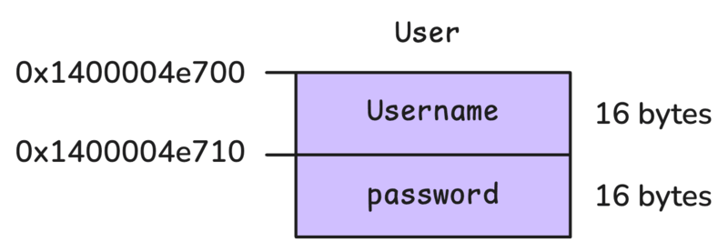
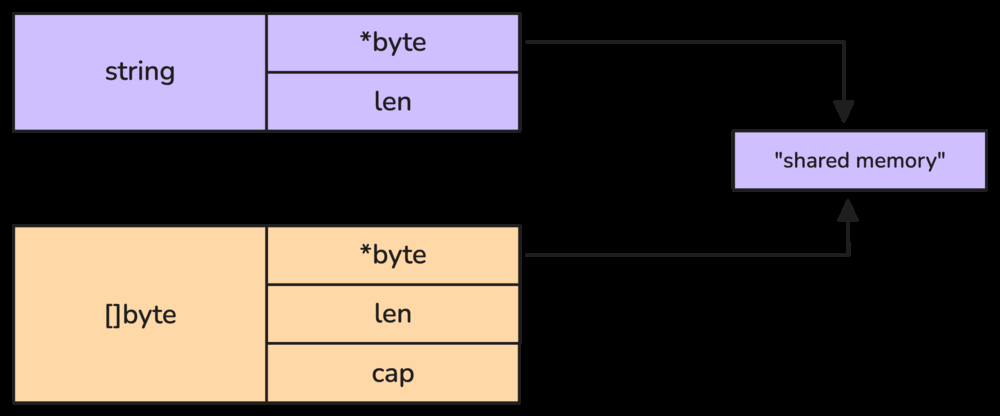
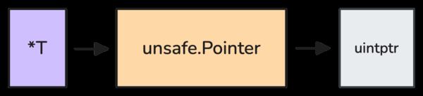

# 6. Bonus: Unsafe Pointer

`unsafe.Pointer` va `uintptr` ko'p developerlar har kuni ishlatadigan narsa emas. Lekin Go source code ichida ular tez-tez uchraydi, shuning uchun nima ekanini tushunish foydali.

Go type system ichida `UnsafePointer` alohida kind sifatida bor:

```go
type Kind uint8

const (
    Invalid Kind = iota
    Bool
    Int
    Int8
    Int16
    Int32
    Int64
    Uint
    Uint8
    Uint16
    Uint32
    Uint64
    Uintptr
    Float32
    Float64
    Complex64
    Complex128
    Array
    Chan
    Func
    Interface
    Map
    Pointer
    Slice
    String
    Struct
    UnsafePointer
)
```

Oddiy pointer'lar (`*int`, `*string`, `*struct`) ikki asosiy qoida tufayli "safe":

1. Go pointer type'lari orasida bevosita conversion'ga ruxsat bermaydi.
2. Go pointer arithmetic'ga ruxsat bermaydi.

## Safe pointer restriction'lar

Type safety:

```go
func main() {
    a := new(int)
    b := new(float64)

    // cannot convert a (variable of type *int) to type *float64
    b = (*float64)(a)

    // invalid operation: a == b (mismatched types *int and *float64)
    if a == b { ... }

    // cannot convert b (variable of type *float64) to type *int
    if (*int)(b) == a { ... }
}
```

Pointer aslida memory address, ya'ni number kabi tuyuladi. Lekin Go "bu address qaysi type'dagi data'ga ishora qilyapti?" degan savolni qat'iy nazorat qiladi.

Pointer arithmetic ham taqiqlangan:

```go
func main() {
    a := new(int)

    // invalid operation: a++ (non-numeric type *int)
    a++

    // invalid operation: a += 1 (mismatched types *int and untyped int)
    a += 1
}
```

`unsafe.Pointer` shu cheklovlarni aylanib o'tish imkonini beradi. Bu kuchli, lekin xavfli.

## 6.1 Unsafe pointer va uintptr xavflari

`unsafe.Pointer` bilan pointer type'lar orasida conversion qilish mumkin:

```go
import "unsafe"

func main() {
    a := new(int64)
    b := new(float64)

    // Convert a to unsafe.Pointer
    b = (*float64)(unsafe.Pointer(a))

    println("a", a, *a)
    println("b", b, *b)
}

// a 0x1400004e740 0
// b 0x1400004e740 +0.000000e+000
```

Endi `a` (`*int64`) va `b` (`*float64`) bir xil memory address'ga qarayapti. Ikkalasi ham 8 byte egallaydi, lekin shu 8 byte'ni boshqacha talqin qiladi.

```go
func main() {
    a := new(int64)
    b := new(float64)

    // Convert a to unsafe.Pointer
    b = (*float64)(unsafe.Pointer(a))

    *b = 1
    println("a", a, *a)
    println("b", b, *b)
}

// Output
// a 0x1400004e740 4607182418800017408
// b 0x1400004e740 +1.000000e+000
```

Float64 `1.0` memory'da IEEE-754 bit pattern sifatida saqlanadi. Shu bitlarni `int64` sifatida o'qisak, butunlay boshqa son chiqadi.

Kitobdagi rasm:





## `uintptr`: address'ni number sifatida ko'rish

Pointer arithmetic uchun pointer `uintptr` ga convert qilinadi. `uintptr` memory address'ni integer sifatida ifodalaydi, lekin pointer semantics yo'q:

- dereference qilib bo'lmaydi;
- GC uni pointer deb kuzatmaydi;
- stack growth paytida update qilinmaydi.

Go 1.17 dan `unsafe.Add` qo'shilgan. U pointer arithmetic'ni `uintptr` ga qo'lda convert qilmasdan bajarishga yordam beradi:

```go
// The function Add adds len to ptr and returns the updated pointer
// [Pointer](uintptr(ptr) + uintptr(len)).
// The len argument must be of integer type or an untyped constant.
// A constant len argument must be representable by a value of type int;
// if it is an untyped constant it is given type int.
// The rules for valid uses of Pointer still apply.
func Add(ptr Pointer, len IntegerType) Pointer
```

## Unexported field'ga memory layout orqali kirish

Faraz qilaylik, boshqa package'da shunday struct bor:

```go
type User struct {
    Username string
    password string
}
```

Biz `password` unexported field'ga bevosita kira olmaymiz. Lekin memory layout'ni bilsak, `unsafe` bilan address hisoblash mumkin:

```go
func main() {
    u := User{
        Username: "func25",
        password: "123456",
    }

    println(&u, &u.Username, &u.password)
    println(exploitPassword(&u))
}

func exploitPassword(u *User) string {
    ... // this is where uintptr comes into play
}

// Output:
// 0x1400004e700 0x1400004e700 0x1400004e710
// 123456
```

Struct memory'da bitta blok sifatida joylashadi. Field'lar tartib bilan, padding bo'lishi mumkin bo'lgan holda, ketma-ket joylashadi. `Username` birinchi field bo'lgani uchun uning address'i struct address'i bilan bir xil.

Kitobdagi rasm:



Go string ichki tomondan ikki field'li headerga o'xshaydi:

- underlying byte array'ga pointer;
- length (`int`).

64-bit systemda string 16 byte bo'ladi: 8 byte pointer + 8 byte length. Shu sababli `password` `User` boshidan 16 byte keyin joylashadi.

```go
type User struct {
    Username string
    password string
}

func main() {
    u := User{
        Username: "func25",
        password: "123456",
    }

    passwordUintptr := uintptr(unsafe.Pointer(&u)) + 16
    passwordPtr := (*string)(unsafe.Pointer(passwordUintptr))

    println("password:", *passwordPtr)

    println("-- debug --")
    println("u:", &u)
    println("u.Username:", &u.Username)
    println("u.password:", &u.password)
}

// Output:
// 123456
// -- debug --
// u: 0x1400004e6e8
// u.Username: 0x1400004e6e8
// u.password: 0x1400004e6f8
```

Bu code `u.password` deb yozmasdan, `&u + 16` orqali field address'ini hisoblaydi.

## `unsafe.Pointer` va `uintptr` orasidagi GC farqi

`unsafe.Pointer` nomi "unsafe" bo'lsa ham, runtime uni pointer deb taniydi. `uintptr` esa faqat integer.

Bu garbage collector va stack growth uchun juda muhim. GC `uintptr` ichidagi address'ni live reference deb bilmaydi. Stack o'sganda ham `uintptr` update qilinmaydi.

Kitobdagi stack growth misoli:

```go
func growStack() {
    x := [1024]byte{}
    _ = fmt.Sprint(x)
}

func main() {
    x := 1
    xUnsafePtr := unsafe.Pointer(&x)
    xUintptr := uintptr(xUnsafePtr)

    println("Before: xPtr", &x, "xUnsafePtr", xUnsafePtr, "xUintptr", xUintptr)
    growStack()
    println("After: xPtr", &x, "xUnsafePtr", xUnsafePtr, "xUintptr", xUintptr)
}

// Output:
// Before: xPtr 0x1400007af38 xUnsafePtr 0x1400007af38 xUintptr 1374390038328
// After: xPtr 0x14000115f38 xUnsafePtr 0x14000115f38 xUintptr 1374390038328
```

Goroutine stack to'lib qolsa, runtime kattaroq stack ajratadi, eski stack'dagi data'ni yangi joyga ko'chiradi va valid pointer'larni update qiladi. `&x` va `unsafe.Pointer` update bo'ladi. `uintptr` esa eski address number'ini ushlab qoladi.

## 6.2 `unsafe`ni nisbatan xavfsiz ishlatish

`unsafe.Pointer` performance optimization uchun ishlatilishi mumkin. Masalan, `[]byte` va `string` orasida copy qilmasdan conversion:

```go
func String(b []byte) string {
    return unsafe.String(unsafe.SliceData(b), len(b))
}

func Bytes(s string) []byte {
    return unsafe.Slice(unsafe.StringData(s), len(s))
}

func StringSlicing(data []byte, start, end int) string {
    n := int(end - start)
    return unsafe.String((*byte)(unsafe.Pointer(uintptr(unsafe.Pointer(unsafe.SliceData(data))) + uintptr(start))), n)
}
```

Normal `[]byte -> string` conversion yangi string yaratib, byte data'ni copy qiladi. Bu string immutability'ni saqlaydi. `unsafe` esa copy qilmasdan bir xil underlying memory'ni share qiladi.

Kitobdagi rasm:



Bu tezroq, lekin xavfli: byte slice o'zgarsa, string ham o'zgargandek bo'ladi. Bu Go string immutability guarantee'sini buzadi.

## Unsafe pointer qoidalari

Go documentation `unsafe.Pointer` ishlatish uchun bir nechta allowed pattern beradi.

### a. `*T1` dan `unsafe.Pointer` orqali `*T2` ga conversion

Memory layout compatible bo'lsa, bitta type pointer'ini boshqasiga reinterpret qilish mumkin:

```go
func Float64bits(f float64) uint64 {
    return *(*uint64)(unsafe.Pointer(&f))
}
```

Bu memory boundary'ni buzmaydi, lekin bitlarni boshqa ma'noda o'qiydi. `float64` va `uint64` ikkalasi 8 byte, ammo semanticasi boshqa.

### b. Pointer'ni `uintptr` ga convert qilish, lekin qaytarmaslik

Pointer address'ini number sifatida ko'rish mumkin:



Lekin `uintptr` runtime uchun pointer emas. Uni keyin pointerga qaytarish stack growth/GC tufayli xavfli.

### c. Pointer -> uintptr -> pointer, arithmetic bilan

Pointer arithmetic faqat allocated object chegarasida va conversion bitta expression ichida bo'lsa allowed pattern hisoblanadi.

Xavfli misol:

```go
type User struct {
    Username string
    password string
}

func main() {
    u := User{
        Username: "func25",
        password: "123456",
    }

    passwordUintptr := uintptr(unsafe.Pointer(&u)) + 16
    passwordPtr := (*string)(unsafe.Pointer(passwordUintptr))

    println("password:", *passwordPtr)
}
```

Muammo: `uintptr` variable'ga saqlanyapti. To'g'ri pattern bitta expression:

```go
// Valid
p = unsafe.Pointer(uintptr(p) + offset)
```

```go
// Invalid
u := uintptr(p)
p = unsafe.Pointer(u + offset)
```

Qoidalar:

1. Allocated memory chegarasida qol.
2. Pointer -> uintptr -> pointer conversion'ni bitta expression ichida qil.
3. `nil` pointer ustida arithmetic qilma.

### d. System call uchun pointer'ni `uintptr` qilish

Ba'zi syscall argumentlari raw address'ni `uintptr` sifatida kutadi. Bunday holatda conversion call ichida bevosita bo'lishi kerak:

```go
// Valid
syscall.Syscall(
    SYS_READ,
    uintptr(fd),
    uintptr(unsafe.Pointer(p)),
    uintptr(n),
)
```

```go
// Invalid
u := uintptr(unsafe.Pointer(p))
syscall.Syscall(SYS_READ, uintptr(fd), u, uintptr(n))
```

Compiler `syscall.Syscall` ichidagi bevosita pattern'ni taniydi va call davomida memory'ni live deb hisoblashga yordam beradi.

### e. `reflect.Value.Pointer` yoki `reflect.Value.UnsafeAddr` result'ini pointer qilish

`reflect` package `Pointer` va `UnsafeAddr` method'lari address'ni `uintptr` qilib qaytaradi. Bu ataylab qilingan: developer unsafe ishlatayotganini explicit ko'rsatadi.

Conversion darhol, bitta expression ichida bo'lishi kerak:

```go
p := (*int)(unsafe.Pointer(reflect.ValueOf(new(int)).Pointer()))
```

## Uch asosiy principle

Unsafe rules'larni qisqa eslab qolish:

- Pointer arithmetic qilganda allocated memory chegarasidan chiqma.
- `uintptr` qiymatini variable'da ushlab yurishdan qoch.
- `uintptr` va pointer orasidagi conversion'ni bitta expression ichida tugat.

`reflect.SliceHeader` va `reflect.StringHeader` `Data` field'i bilan bog'liq yana bir eski qoida bor, lekin bu header'lar deprecated; yangi code'da `unsafe.String`, `unsafe.Slice`, `unsafe.StringData`, `unsafe.SliceData` kabi helper'lardan foydalanish tavsiya qilinadi.

## Eslab qol

- `unsafe.Pointer` Go type safety'ni aylanib o'tadi.
- `uintptr` pointer emas, integer. GC va stack growth uni reference deb bilmaydi.
- `unsafe` performance beradi, lekin invariantlarni buzishi mumkin.
- `[]byte` va `string` zero-copy conversion memory share qiladi va immutability guarantee'ni buzishi mumkin.
- Bitta expression qoidasi `uintptr` bilan ishlaganda juda muhim.
