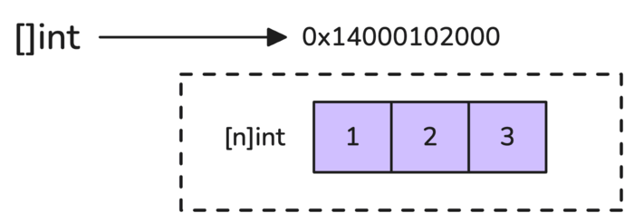

# 7. Bonus: Addressable and Unaddressable Values

Go'da har bir value address'ga ega emas. `&` operatorini faqat addressable value'larga ishlatish mumkin.

Addressable value - stable memory location bilan bog'langan value.

Addressable qiymatlar:

- package yoki function level'da declared variable'lar;
- struct field'lari, agar struct'ning o'zi addressable bo'lsa;
- addressable array element'lari;
- slice element'lari, slice'ning o'zi addressable bo'lmasa ham.

```go
var global int = 10

func main() {
    var local int = 20
    var array = [3]int{1, 2, 3}
    var slice = []int{1, 2, 3}

    println(&global) // 0x100738388
    println(&local)  // 0x1400004e6d0

    println(&array[0]) // 0x1400004e6d8
    println(&array[1]) // 0x1400004e6e0

    println(&slice[0]) // 0x1400004e6f0
    println(&slice[1]) // 0x1400004e6f8
}
```

Unaddressable value'lar esa stable address bermaydi. Ko'pincha ular temporary result bo'ladi.

## Function return value nega unaddressable?

```go
func returnArray() [3]int {
    return [3]int{1, 2, 3}
}

func returnStruct() Person {
    return Person{Name: "John", Age: 20}
}

func main() {
    // Error: cannot take the address of returnArray() (value of type [3]int)
    array := &returnArray()

    // Error: cannot take the address of returnArray()[0] (value of type int)
    arrayElement := &returnArray()[0]

    // Error: cannot take the address of returnStruct() (value of type Person)
    person := &returnStruct()

    // Error: cannot take the address of returnStruct().Name (value of type string)
    personName := &returnStruct().Name
}
```

Function return value'ning stable memory address'i yo'q. Kichik return value register'da bo'lishi mumkin; register addressable emas. Katta return value caller stack frame'iga yozilishi mumkin, lekin bu temporary result sifatida qaraladi.

Conceptual ko'rinish:

```go
func callee() int {
    a := 10
    return a
}

func caller() {
    receive := callee()
}
```

`callee` return value'ni caller oldindan ajratgan joyga yozishi mumkin. Lekin `callee` ichidagi local `a` stack frame tugagach yo'qoladi. Shu sababli `&a`ni caller'ga qaytarish xavfli bo'lardi, agar compiler escape analysis orqali uni heap'ga ko'chirmasa.

## Literal, constant, expression va map element

Quyidagilar ham unaddressable:

```go
func main() {
    const constant = 10

    // Error: cannot take address of constant (untyped int constant 10)
    constantAddress := &constant

    // Error: cannot take address of 10 (untyped int constant)
    literalAddress := &10

    // Error: cannot take address of (10 + 20) (untyped int constant 30)
    expressionAddress := &(10 + 20)

    aMap := map[int]string{1: "one"}
    // Error: cannot take address of aMap[1] (map index expression of type string)
    mapElementAddress := &aMap[1]
}
```

Constant va literal read-only segmentda bo'lishi yoki instruction ichiga embedded qilinishi mumkin; stable address berilmaydi.

Map element'lari alohida sabab bilan unaddressable: map ichki storage'ni resize/reorganize qilishi mumkin. Agar map element address'ini olishga ruxsat berilsa, keyingi map operation pointer'ni invalid qilib qo'yishi mumkin.

## Slice element exception

Slice'ning o'zi temporary bo'lsa ham, uning element'lari addressable bo'lishi mumkin:

```go
func returnSlice() []int {
    return []int{1, 2, 3}
}

sliceElement := &returnSlice()[0] // valid: 0x14000102000
slice := &returnSlice()           // Error: cannot take address of returnSlice() (value of type []int)
```

Slice - underlying array'ga ishora qiladigan descriptor. Slice temporary bo'lishi mumkin, lekin underlying array real memory'da mavjud. Element address'i shu array ichidagi joyga qaraydi.

Kitobdagi rasm:



```mermaid
flowchart LR
    A[Temporary slice header] --> B[Underlying array]
    B --> C[element 0]
    B --> D[element 1]
    B --> E[element 2]
    F[&returnSlice()[0]] --> C
```

## Unaddressable struct ichidagi slice field

Struct return value unaddressable bo'lsa, uning field'lari ham odatda unaddressable:

```go
type Person struct {
    Name    string
    Age     int
    Friends []string
    Array   [3]int
}

personFriends := &returnStruct().Friends           // Error
personArrayElement := &returnStruct().Array[0]     // Error
personFriendsElement := &returnStruct().Friends[0] // Valid
```

Nega `Friends[0]` valid?

`returnStruct()` temporary struct. Uning `Friends` field address'ini olish mumkin emas, chunki field temporary block ichida. `Array[0]` ham shu block ichida bo'lgani uchun unaddressable.

Lekin `Friends` slice header bo'lib, underlying array'ga ishora qiladi. Slice element esa shu alohida underlying array ichida joylashgan. Shu sababli `returnStruct().Friends[0]` addressable bo'ladi.

## Eslab qol

- `&` faqat addressable value uchun ishlaydi.
- Variable, addressable struct field, array element va slice element addressable bo'lishi mumkin.
- Function return value, literal, constant, expression va map element unaddressable.
- Map element address'i berilmaydi, chunki map storage ko'chishi mumkin.
- Slice element addressable, chunki u underlying array ichidagi real elementga qaraydi.
