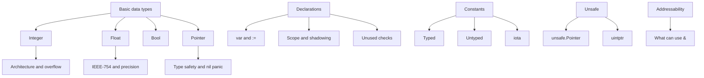

# 8. Xulosa

Bu bob Go'ning oddiy ko'rinadigan asosiy type'lari ortidagi muhim mexanizmlarni ko'rsatdi.

Integer type'lar 8 dan 64 bitgacha signed va unsigned ko'rinishlarda bor. `int` va `uint` hajmi system architecture'ga bog'liq: 32-bit systemda 32 bit, 64-bit systemda 64 bit. Bu CPU word size bilan moslashadi.

Floating-point type'lar `float32` va `float64` bo'lib, IEEE-754 standardiga amal qiladi. Integer division by zero panic bo'lsa, float division by zero `+Inf`, `-Inf` yoki `NaN` beradi. Float arithmetic approximation bilan ishlaydi, shuning uchun `0.1 + 0.2 == 0.3` kabi equality check'lar kutilgan natija bermasligi mumkin.

Pointer variable memory address'ni saqlaydi. Har bir pointer aniq type'ga ega: `*int`, `*string`, `*User`. Pointer zero value - `nil`, va `nil` pointer dereference runtime panic. Go pointer arithmetic'ni taqiqlaydi; bu memory safety'ni kuchaytiradi.

Variable declaration `var` yoki `:=` orqali qilinadi. Compiler scope'larni kuzatadi, shadowing qoidalarini name lookup orqali hal qiladi va function scope ichida unused variable'larni error qiladi. `:=` qulay, lekin outer variable'ni yangilash o'rniga inner variable yaratib yuborishi mumkin.

Constants compile time'da baholanadi va faqat basic type'lar bilan ishlaydi: numbers, strings, booleans. Typed constants type qoidalariga qat'iy bo'ysunadi. Untyped constants esa context'ga moslashadi, lekin target type'da representable bo'lishi shart. Untyped integer constants amalda compiler ichida 512-bit limit'ga ega.

`iota` const block ichida sequence yaratadi. Har block'da `0` dan boshlanadi, har declaration line bilan oshadi, bir line'dagi barcha identifier'lar bir xil `iota` value oladi. Implicit repetition bilan enum-like patternlar qulay yoziladi.

`unsafe.Pointer` va `uintptr` Go safety qoidalarini chetlab o'tish imkonini beradi. Bu performance yoki low-level code uchun kerak bo'lishi mumkin, lekin GC, stack growth va memory corruption xavfi bor. `uintptr` pointer emas; runtime uni reference sifatida kuzatmaydi.

Addressability Go'da muhim qoidalar to'plami: har value addressable emas. Variable'lar va slice element'lari addressable bo'lishi mumkin; function return value, literal, constant, expression va map element addressable emas.

Bobning amaliy xulosasi: Go'dagi "oddiy" type'lar ham compiler, runtime va hardware bilan bog'liq. Bu detallarni bilish xotira, performance va correctness bilan ishlaganda ancha aniq fikrlashga yordam beradi.
