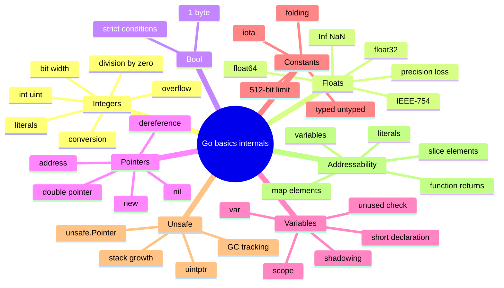
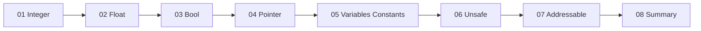

# 2-bob. Basic Data Types, Variables, and Constants

> **Bu material "The Anatomy of Go" kitobining 2-bobi asosida o'zbek tilida tayyorlangan mazmuniy tarjima va o'quv qo'llanma. Asosiy ma'no, kod misollari, compiler/runtime snippetlari va kitobdagi illustrationlar saqlangan; mavzular qo'shimcha diagrammalar bilan boyitilgan.**

## Bob nimani o'rgatadi?

Bu bob Go'dagi asosiy data type'lar va declaration mexanizmlarini ichkaridan tushuntiradi. Oddiy `int`, `float64`, `bool`, pointer, variable va constant ko'rinishidan oddiy tuyuladi, lekin ularning ortida architecture, compiler type checker, scope resolution, constant folding, `unsafe.Pointer` va addressability kabi muhim tushunchalar bor.

## Mundarija

| Fayl | Mavzu | Qisqa tavsif |
|------|-------|--------------|
| [01_integer_types.md](01_integer_types.md) | Integer types | bit-width, `int/uint`, literal formatlar, overflow, conversion, division by zero |
| [02_floating_point_types.md](02_floating_point_types.md) | Floating-point types | `float32/float64`, IEEE-754, `+Inf`, `-Inf`, `NaN`, precision loss |
| [03_boolean_type.md](03_boolean_type.md) | Boolean type | `bool`, strict condition, memory representation |
| [04_pointer_types.md](04_pointer_types.md) | Pointer types | address, dereference, `new`, nil panic, double pointer |
| [05_variables_constants.md](05_variables_constants.md) | Variables and constants | `var`, `:=`, scope, shadowing, unused variables, typed/untyped constants, `iota` |
| [06_unsafe_pointer.md](06_unsafe_pointer.md) | Unsafe pointer | `unsafe.Pointer`, `uintptr`, pointer arithmetic, GC/stack growth xavflari, safe rules |
| [07_addressable_unaddressable.md](07_addressable_unaddressable.md) | Addressable values | addressable/unaddressable qiymatlar, map/slice/function return holatlari |
| [08_summary.md](08_summary.md) | Xulosa | Bobdagi asosiy tushunchalarni bog'lash |
| [09_references.md](09_references.md) | Manbalar | Kitobda keltirilgan havolalar |

## Umumiy xarita

## Tavsiya etilgan o'qish tartibi

## Bobning katta savollari

1. `int` nega har doim bir xil hajmda emas?
2. Integer overflow runtime'da nega error bermaydi?
3. Float division by zero nega panic emas, `+Inf`, `-Inf` yoki `NaN` beradi?
4. Pointer aslida address-sized number bo'lsa ham, Go nega uni qat'iy type-safe qiladi?
5. `:=` qachon yangi variable yaratadi, qachon shadowing bug keltiradi?
6. Untyped constants qanday qilib turli type'larga moslasha oladi?
7. `iota` qiymati nimaga asoslanadi?
8. `unsafe.Pointer` va `uintptr` orasidagi eng xavfli farq nima?
9. Nega `&returnStruct().Name` mumkin emas, lekin `&returnSlice()[0]` mumkin?

Boshlash uchun [01_integer_types.md](01_integer_types.md) faylini oching.
