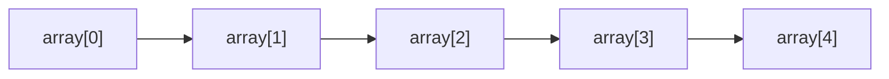
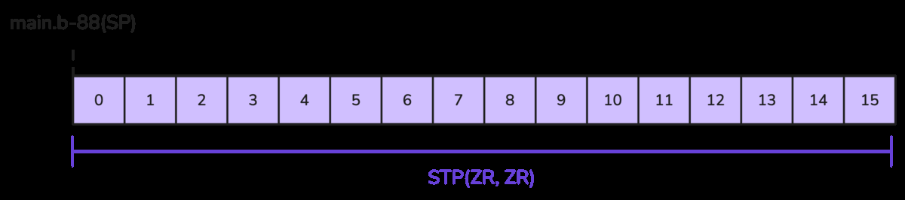
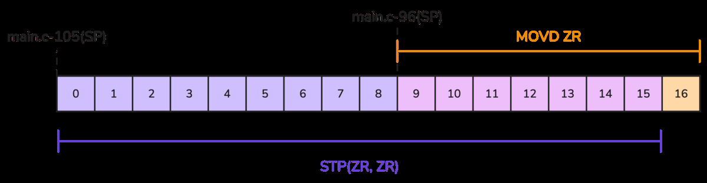
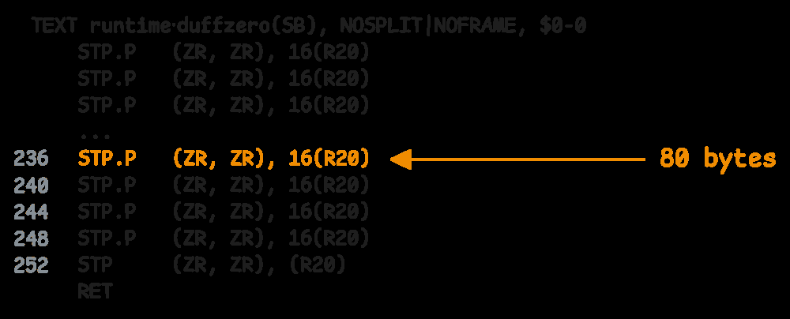
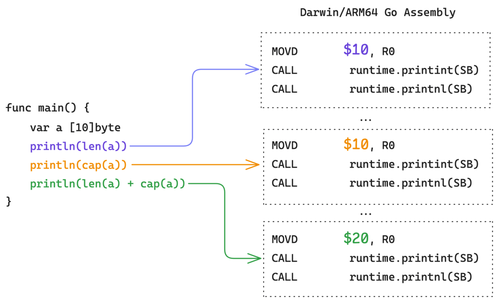

# 1. Arrays: fixed-size sequence va memory semantics

Array - bir xil type'dagi elementlarning fixed-size ketma-ketligi. Go'da array length type'ning bir qismi:

```go
var a [5]int
var b [10]int
```

`[5]int` va `[10]int` ikki xil type. Bu design compiler'ga memory layout'ni aniq bilish, bounds check va initialization kabi ishlarni optimize qilish imkonini beradi.

## 1.1 Array memory layout

Array elementlari xotirada ketma-ket joylashadi. `[5]byte` misolida har bir element 1 byte bo'lgani uchun addresslar bittadan oshadi:

![Illustration 15. Memory layout of a [5]byte array](images/15.png)

`[5]int64` bo'lsa, har element 8 byte egallaydi va addresslar 8 tadan siljiydi.



Array value semantics'ga ega: array assignment yoki function argument sifatida uzatilganda butun array copy qilinadi.

```go
func change(a [3]int) {
    a[0] = 100
}

func main() {
    arr := [3]int{1, 2, 3}
    change(arr)
    fmt.Println(arr) // [1 2 3]
}
```

Original array o'zgarmaydi, chunki `change` ichida copy bor. Originalni o'zgartirish kerak bo'lsa pointer ishlatiladi:

```go
func change(a *[3]int) {
    a[0] = 100
}
```

## 1.2 Array initialization

Array e'lon qilinsa, elementlar type zero value bilan to'ldiriladi:

```go
var a [5]int       // [0 0 0 0 0]
var b [3]string    // ["" "" ""]
var c [2]*int      // [nil nil]
```

Small array'lar uchun compiler zeroing'ni bir nechta machine instruction bilan bajaradi. 16 byte zero qilish bitta instruction bilan bo'lishi mumkin:



17 byte kabi boundary'dan o'tgan holatda compiler bir nechta instruction ishlatadi:



Kattaroq memory zeroing uchun runtime helper ishlatilishi mumkin:



Bu yerda asosiy g'oya: Go source code'da oddiy `var a [80]byte` yozamiz, lekin compiler hajmga qarab optimal zeroing strategy tanlaydi.

## 1.3 Array literal'lar bilan ishlash

Array literal:

```go
a := [5]int{1, 2, 3, 4, 5}
b := [...]int{1, 2, 3}
c := [5]int{1: 10, 3: 30}
```

Tushuntirish:

- `[5]int{...}` - length explicit.
- `[...]int{...}` - compiler length'ni elementlardan chiqaradi.
- keyed literal (`1: 10`) - aniq index'ga value qo'yadi, qolganlari zero value.

Compiler ba'zi compact initialization'larni integer constant orqali bajarishi mumkin. Masalan `[5]byte{1,2,3,4,5}` ichidagi bir nechta byte bitta word sifatida joylanadi:

![Illustration 19. Compact initialization of a [5]byte array using 67305985](images/19.png)

Bu optimization source code'dan ko'rinmaydi, lekin binary darajasida kamroq instruction va tezroq initialization beradi.

## 1.4 Small vs large array initialization

Go compiler array hajmi va element type'iga qarab turli strategy tanlaydi:

- kichik array'lar inline instruction bilan zero/init qilinadi;
- o'rta-katta bloklarda `duffzero` kabi optimized routine ishlatiladi;
- pointer bor type'larda GC uchun pointer bitmap ma'lum bo'lishi kerak;
- static literal'lar RODATA yoki DATA segmentga tushishi mumkin.

```go
var a [4]byte
var b [1024]byte
var c = [3]string{"a", "b", "c"}
```

`a` oddiy instruction'lar bilan, `b` runtime zeroing bilan, `c` esa pointer-containing data sifatida boshqacha tayyorlanadi.

## 1.5 Array length va capacity

Array'da `len` va `cap` bir xil:

```go
var a [10]byte
println(len(a)) // 10
println(cap(a)) // 10
```

Compiler array length/capacity'ni compile-time constant sifatida biladi:



Shu sababli bunday expression'lar runtime'da array header o'qimaydi; qiymat instruction ichiga kiritilishi mumkin.

## Array qachon ishlatiladi?

Array yaxshi tanlov:

- element soni doimiy va kichik bo'lsa;
- fixed-size binary format yoki protocol bilan ishlaganda;
- memory layout aniq bo'lishi kerak bo'lsa;
- value semantics kerak bo'lsa.

Ko'p kundalik Go code'da esa slice qulayroq, chunki u dynamic length va append imkonini beradi.

## Eslab qol

- Array length type'ning bir qismi: `[5]int != [10]int`.
- Array elementlari contiguous memory'da turadi.
- Array assignment va argument passing butun array copy qiladi.
- Array `len` va `cap` compile-time ma'lum bo'lishi mumkin.
- Katta yoki performance-critical array'larda copy narxiga e'tibor ber.
