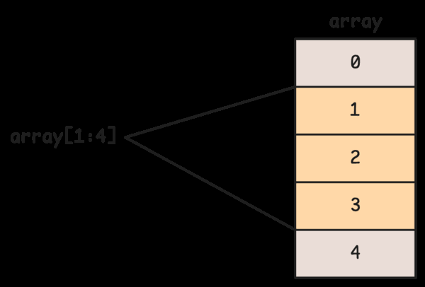
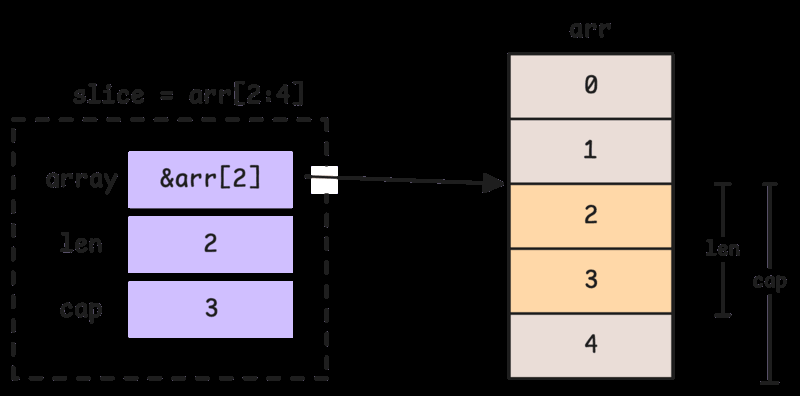
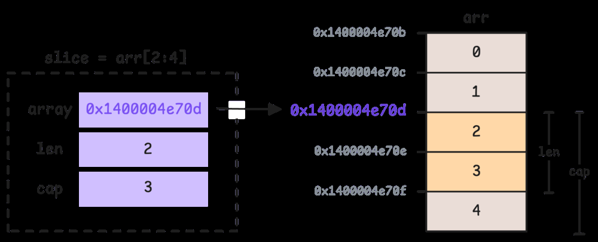
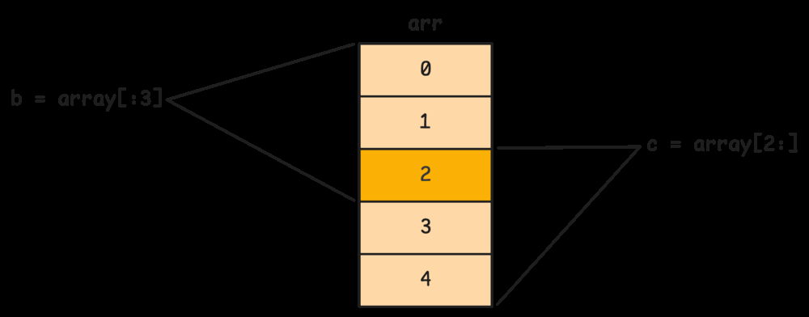
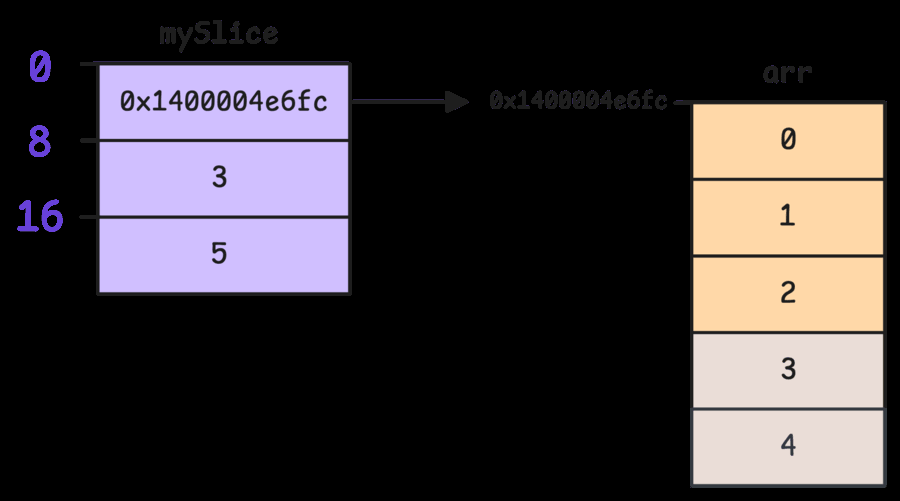
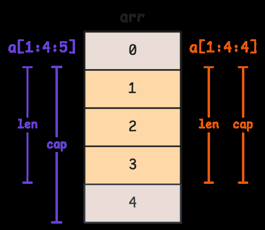
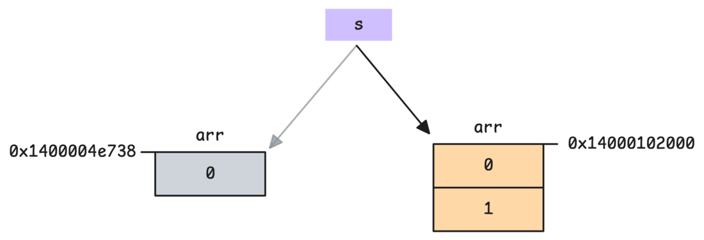
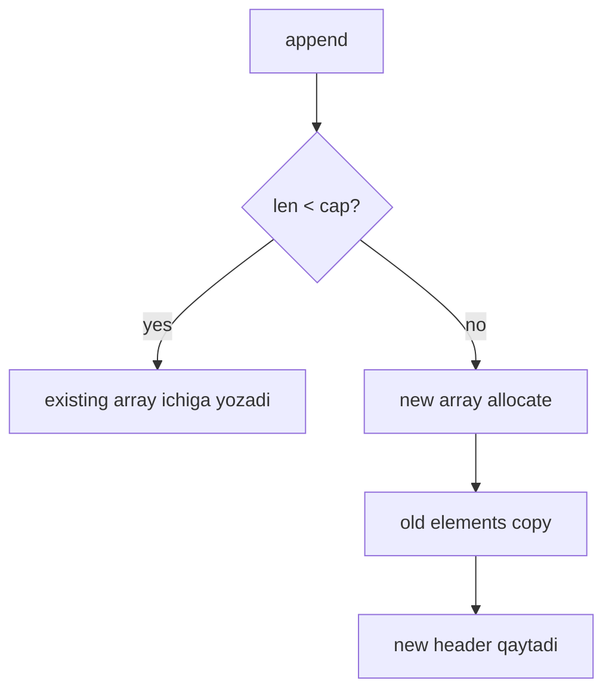

# 2. Slices: structure, semantics va behavior

Slice Go'dagi eng ko'p ishlatiladigan sequence type. Slice array emas. Slice - underlying array'ning bir qismini ko'rsatadigan kichik descriptor.

Slice header uch qismdan iborat:

- pointer - underlying array ichidagi birinchi ko'rinadigan element address'i;
- len - slice uzunligi;
- cap - pointer boshlanadigan joydan underlying array oxirigacha bo'lgan capacity.

## Slice underlying array'ga qaraydi

```go
arr := [5]int{0, 1, 2, 3, 4}
s := arr[1:4]
```

`s` yangi array yaratmaydi. U `arr`ning `1..3` oralig'ini ko'rsatadi:



Slice header:



`s := arr[2:4]` bo'lsa, pointer `&arr[2]`ga qaraydi:



Slice assignment ham header'ni copy qiladi, underlying array'ni emas:

```go
a := []int{0, 1, 2, 3, 4}
b := a[1:4]
c := a[2:]

b[1] = 99
fmt.Println(a) // [0 1 99 3 4]
fmt.Println(c) // [99 3 4]
```

Bir nechta slice bir underlying array'ni share qilishi mumkin:



Header ichidagi offset'lar pointer, len, cap joylashuvini ko'rsatadi:



## 2.1 Slice expressions va indexing semantics

Basic slicing:

```go
s := arr[low:high]
```

Bu `low` inclusive, `high` exclusive:

```go
arr := [5]int{0, 1, 2, 3, 4}
s := arr[1:4] // [1 2 3]
len(s)        // 3
cap(s)        // 4, chunki arr[1]dan arr oxirigacha 4 element bor
```

Full slice expression capacity'ni ham cheklaydi:

```go
s := arr[low:high:max]
```

Bu yerda:

- `len = high - low`
- `cap = max - low`

Kitobdagi rasm:



Capacity'ni cheklash append side effect'larini kamaytiradi:

```go
a := []int{0, 1, 2, 3, 4}
b := a[1:3:3] // len=2, cap=2
b = append(b, 99)

fmt.Println(a) // original array ko'pincha buzilmaydi, chunki append new array ajratadi
fmt.Println(b)
```

## 2.2 Append: slice growth mexanikasi

`append` slice oxiriga element qo'shadi:

```go
s := []int{1, 2}
s = append(s, 3)
```

Agar `len(s) < cap(s)` bo'lsa, append existing underlying array ichiga yozadi:

```go
a := []int{0, 1, 2, 3}
s := a[:2]      // len=2, cap=4
s = append(s, 9)
fmt.Println(a) // [0 1 9 3]
```

Agar capacity yetmasa, runtime yangi array allocate qiladi, eski elementlarni copy qiladi va yangi slice header qaytaradi:



Shuning uchun `append` result'ini doim qayta assign qilish kerak:

```go
s = append(s, x)
```

Go runtime slice growth strategy'si capacity'ga qarab o'zgaradi. Kichik slice'larda capacity odatda tezroq, ko'pincha 2 baravar o'sadi; kattaroq slice'larda o'sish sekinroq bo'ladi, memory waste kamayadi.



## 2.3 Allocation strategies va memory layout

Slice yaratishning asosiy yo'llari:

```go
var a []int              // nil slice
b := []int{}             // empty, non-nil slice
c := make([]int, 3)      // len=3, cap=3
d := make([]int, 3, 10)  // len=3, cap=10
```

`nil` slice va empty slice ko'p holatda bir xil ishlaydi:

```go
var a []int
b := []int{}

fmt.Println(len(a), cap(a), a == nil) // 0 0 true
fmt.Println(len(b), cap(b), b == nil) // 0 0 false
```

Lekin JSON encoding yoki API semantics'da farq muhim bo'lishi mumkin.

`make([]T, len, cap)` oldindan capacity berish orqali append paytidagi reallocation'larni kamaytiradi:

```go
items := make([]int, 0, 1000)
for i := 0; i < 1000; i++ {
    items = append(items, i)
}
```

Function argument sifatida slice uzatilganda header copy bo'ladi, underlying array copy bo'lmaydi:

```go
func modify(s []int) {
    s[0] = 100
}

func main() {
    a := []int{1, 2, 3}
    modify(a)
    fmt.Println(a) // [100 2 3]
}
```

Lekin function ichida append yangi array allocate qilsa, caller slice header'i o'zgarmaydi:

```go
func add(s []int) {
    s = append(s, 4)
}

func main() {
    a := []int{1, 2, 3}
    add(a)
    fmt.Println(a) // [1 2 3]
}
```

Yangi slice qaytarish kerak:

```go
func add(s []int) []int {
    return append(s, 4)
}
```

## Eslab qol

- Slice - pointer, len, cap dan iborat descriptor.
- Slice copy qilish underlying array'ni copy qilmaydi.
- `append` capacity yetarli bo'lsa shared array'ni o'zgartiradi.
- Capacity yetmasa, yangi array allocate va copy bo'ladi.
- `append` result'ini qayta assign qilish shart.
- Full slice expression (`a[i:j:k]`) capacity'ni nazorat qilish uchun foydali.
