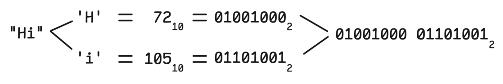
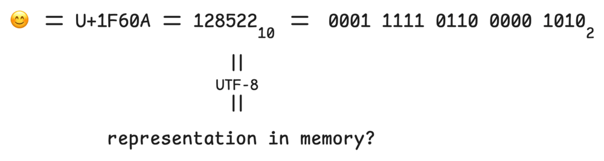
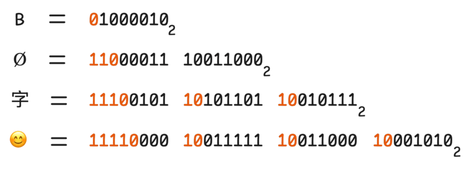
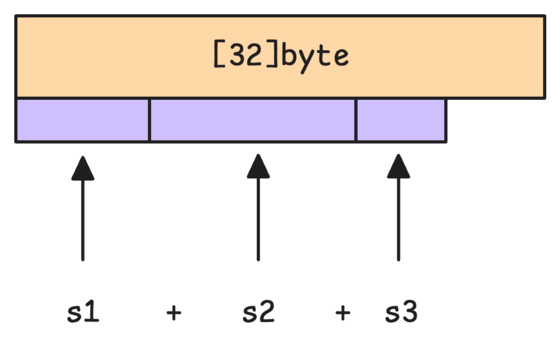

# 3. Strings: structure va behavior

Go'da string immutable byte sequence. String ko'pincha UTF-8 text saqlaydi, lekin language darajasida string "characters array" emas, byte'lar ketma-ketligi.

```go
s := "Hello"
fmt.Println(len(s)) // 5 bytes
fmt.Println(s[0])   // 72, byte value for 'H'
```

## Byte, rune va UTF-8

ASCII'da har character 1 byte:



Unicode code point esa bitta yoki bir nechta byte bilan UTF-8 formatda saqlanishi mumkin. Masalan smiling emoji `U+1F60A`:



UTF-8 variable-length encoding:



Shuning uchun `len` byte sonini qaytaradi, rune/character sonini emas:

```go
s := "Hi"
fmt.Println(len(s)) // 2

t := "salom😊"
fmt.Println(len(t))         // byte count
fmt.Println(utf8.RuneCountInString(t)) // rune count
```

Indexing byte qaytaradi:

```go
s := "Go"
fmt.Printf("%T %v\n", s[0], s[0]) // uint8 71
```

Rune bo'yicha yurish uchun `range` ishlatiladi:

```go
for i, r := range "Go😊" {
    fmt.Printf("%d: %c\n", i, r)
}
```

`i` byte offset, `r` esa rune.

## 3.1 UTF-8 internal representation

String header odatda ikki qismli deb tushuniladi:

- data pointer;
- length.

String immutable bo'lgani uchun uning data'sini o'zgartirib bo'lmaydi:

```go
s := "hello"
s[0] = 'H' // compile error
```

O'zgartirish kerak bo'lsa, `[]byte` yoki `[]rune`ga convert qilinadi:

```go
b := []byte(s)
b[0] = 'H'
s = string(b)
```

UTF-8 bilan ishlaganda byte emas, rune kerak bo'lishi mumkin:

```go
r := []rune("Go😊")
r[0] = 'g'
fmt.Println(string(r))
```

## 3.2 String conversion va memory semantics

`string -> []byte` conversion odatda copy qiladi:

```go
s := "hello"
b := []byte(s)
b[0] = 'H'
fmt.Println(s)        // hello
fmt.Println(string(b)) // Hello
```

Copy kerak, chunki string immutable; agar byte slice string bilan bir xil memory'ni share qilsa, slice orqali string o'zgarib qolardi.

`[]byte -> string` ham odatda copy:

```go
b := []byte{'h', 'i'}
s := string(b)
b[0] = 'H'
fmt.Println(s) // hi
```

Compiler ba'zi special holatlarda zero-copy optimization qilishi mumkin, masalan temporary conversion faqat lookup uchun ishlatilsa. Lekin user code buni guarantee sifatida qabul qilmasligi kerak.

## 3.3 Efficient string concatenation

String immutable. Har `+` yangi string yaratishi mumkin:

```go
s := ""
for _, part := range parts {
    s += part
}
```

Bu ko'p allocation berishi mumkin. Ko'p bo'laklarni yig'ishda `strings.Builder` yaxshi:

```go
var b strings.Builder
b.Grow(totalSize)
for _, part := range parts {
    b.WriteString(part)
}
s := b.String()
```

Compiler oddiy concatenation'larni stack buffer bilan optimize qilishi mumkin:



Qoidaviy tavsiya:

- 2-3 ta string uchun `+` o'qishli va yetarli.
- loop ichida ko'p concat bo'lsa `strings.Builder`.
- byte processing uchun `bytes.Buffer` yoki `[]byte` ishlatish mumkin.

## Eslab qol

- String - immutable byte sequence.
- `len(s)` byte count.
- `s[i]` byte (`uint8`) qaytaradi.
- `range s` rune beradi, index esa byte offset.
- `string <-> []byte` conversion odatda copy qiladi.
- Ko'p concat uchun `strings.Builder` ishlat.
