# 4. Maps: internal design va runtime behavior

Go map - hash table. U key'ni hash qiladi, hash natijasidan bucket tanlaydi va bucket ichida key/value pair saqlaydi.

Oddiy ishlatish:

```go
m := map[string]int{
    "dog":  1,
    "cat":  2,
    "fish": 3,
}

m["bird"] = 4
v, ok := m["dog"]
delete(m, "cat")
```

## Hash va bucket

Hash function key'ni integer-like hash qiymatga aylantiradi. Key qaysi bucket'ga tushishi hash bitlari orqali tanlanadi:

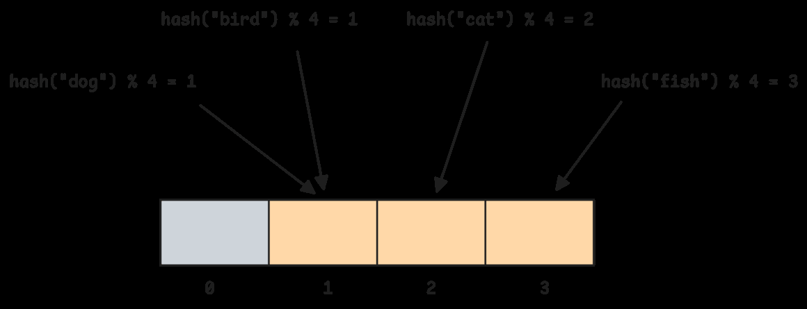

Hash collision bo'lishi mumkin: ikki key bir bucket'ga tushadi. Go bucket ichida bir nechta key/value pair saqlaydi:

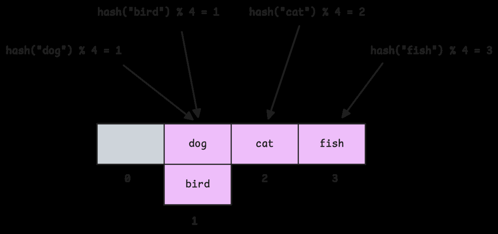

Go map bucket'i 8 tagacha key/value pair saqlaydi:

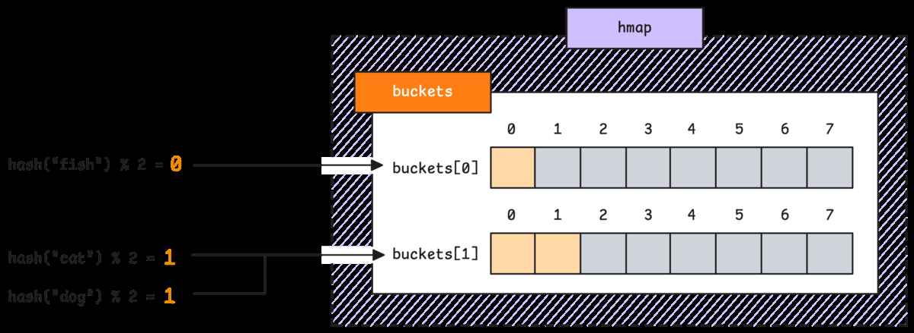

Bucket to'lsa, overflow bucket ulanadi:

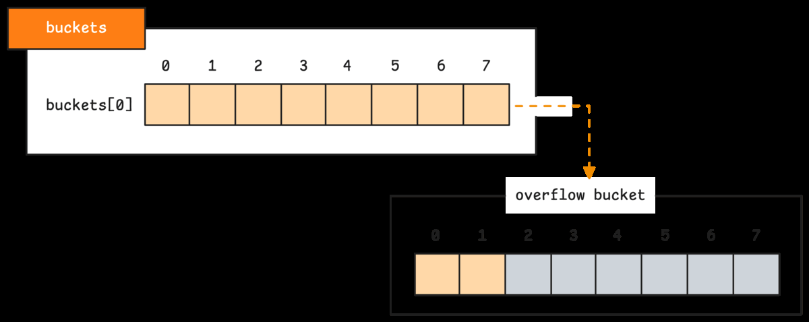

Real bucket layout'da avval tophash array, key'lar va value'lar joylashadi:

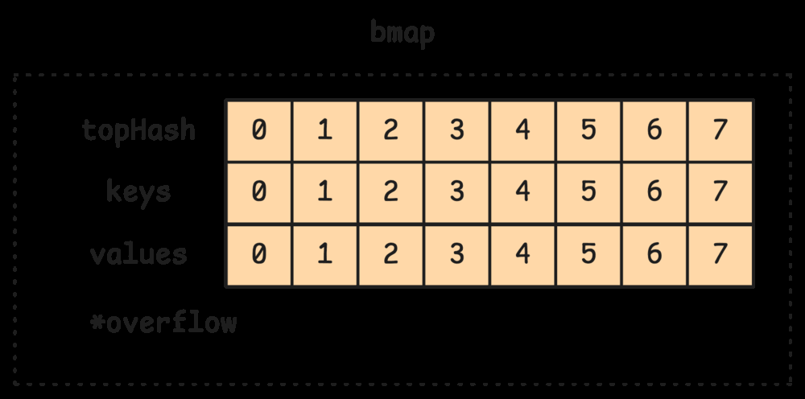

## 4.1 Internal structure va tophash

Go map lookup'ni tezlashtirish uchun har slot bo'yicha hash'ning yuqori byte'ini `tophash` sifatida saqlaydi:


Lookup jarayoni:

1. Key hash qilinadi.
2. Hash past bitlari bucket index tanlaydi.
3. Hash yuqori byte'i tophash bilan solishtiriladi.
4. Tophash mos kelsa, real key comparison qilinadi.
5. Key ham mos kelsa, value qaytariladi.

Misol:

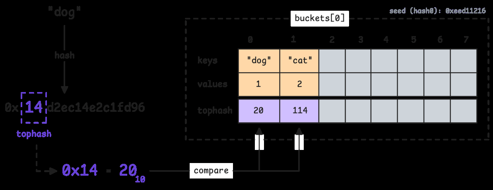

Key bucket'ga tushadi:

![Illustration 39. Key 'dog' maps to bucket[2]](images/39.png)

Tophash va key check:

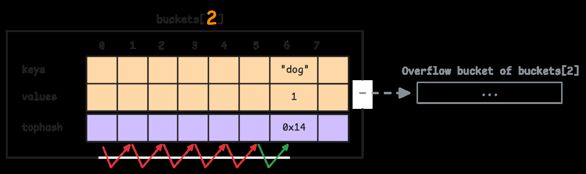

Tophash `0` search tugaganini bildirishi mumkin:

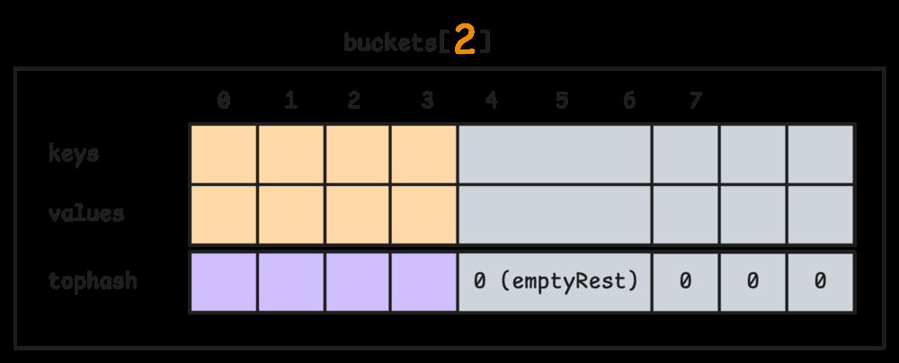

Bucket slot'lari uchun empty state'lar bor:

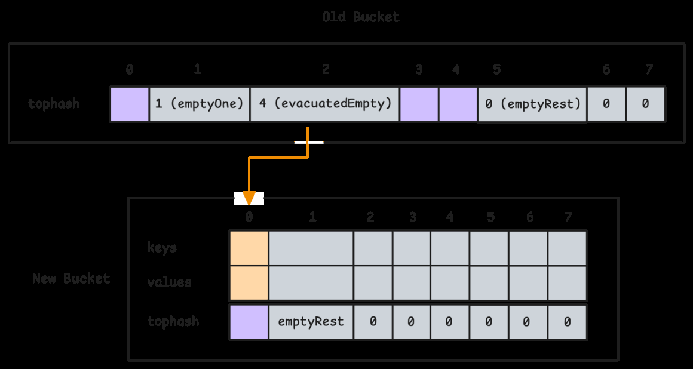

Delete qilinganda cleanup state'larni o'zgartiradi:

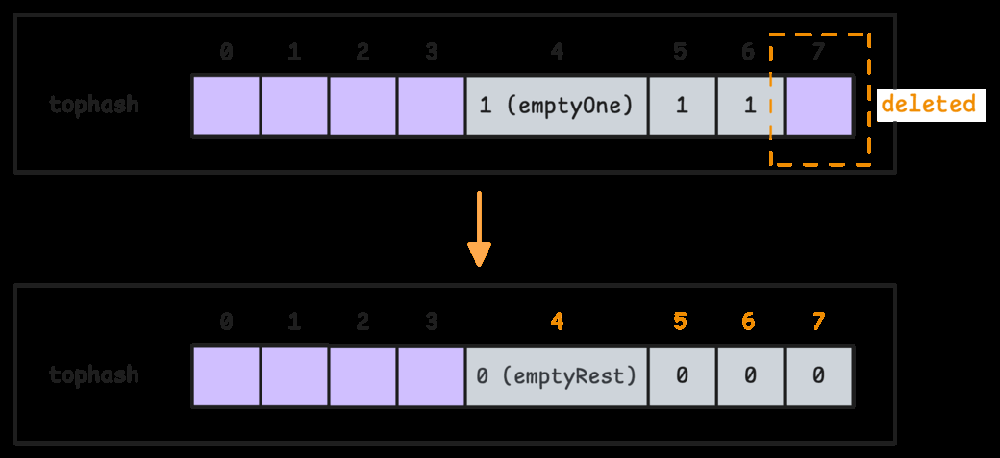

## 4.2 Map grow, delete va iteration

Map elementlar ko'payganda yoki overflow bucket'lar haddan oshganda grow bo'ladi. Grow ikki xil bo'lishi mumkin:

- bigger grow - bucket soni oshadi;
- same-size grow - bucket soni o'zgarmaydi, lekin entries qayta taqsimlanadi, overflow kamayadi.

Same-size grow:

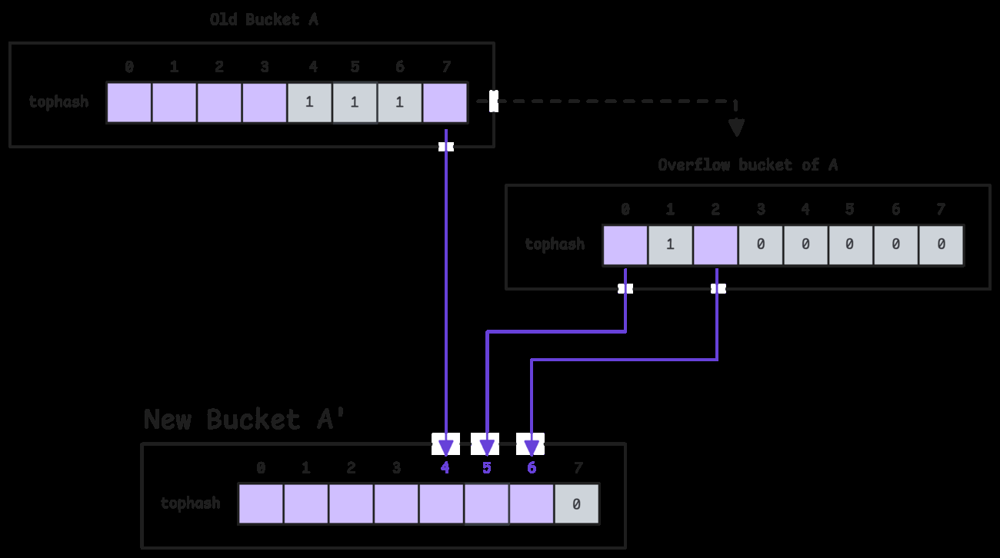

Bigger grow paytida eski bucket'dagi key'lar ikki yangi bucket'dan biriga tushishi mumkin:

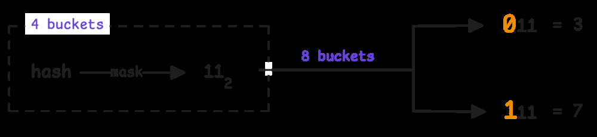

Har eski bucket ikki potential new bucket'ga map bo'ladi:

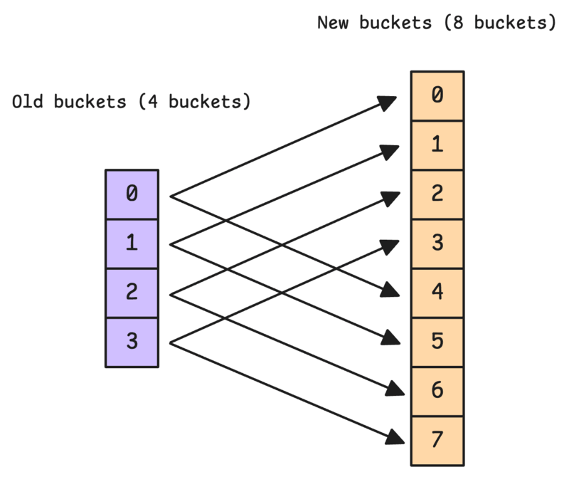

Map grow incremental bo'lishi mumkin: Go hamma bucket'ni birdaniga ko'chirib, uzun pause bermaydi; map operation'lar davomida evacuation bosqichma-bosqich amalga oshadi.

## Map element address'ini nega olib bo'lmaydi?

```go
m := map[string]int{"a": 1}
p := &m["a"] // compile error
```

Sabab: map grow yoki rehash paytida element boshqa bucket'ga ko'chishi mumkin. Agar pointer berilsa, keyingi map operation undan invalid pointer yasab qo'yadi. Go buni compile time'da taqiqlaydi.

Value struct bo'lsa, field'ni bevosita o'zgartirib bo'lmaydi:

```go
type User struct {
    Age int
}

m := map[string]User{"bob": {Age: 10}}
m["bob"].Age = 11 // compile error
```

To'g'ri yo'l:

```go
u := m["bob"]
u.Age = 11
m["bob"] = u
```

Yoki map value pointer bo'lishi mumkin:

```go
m := map[string]*User{"bob": &User{Age: 10}}
m["bob"].Age = 11
```

## Iteration order

Go map iteration order stable emas. Runtime iteration'ni random bucket va random slotdan boshlaydi:

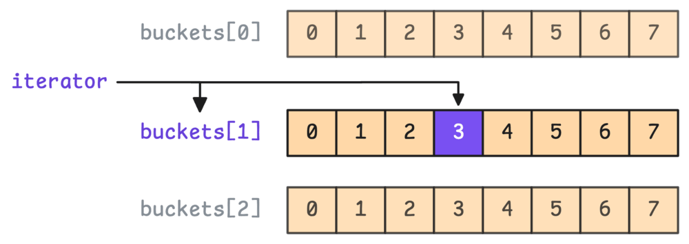

Har bucket ichida ham random start slot ishlatiladi:

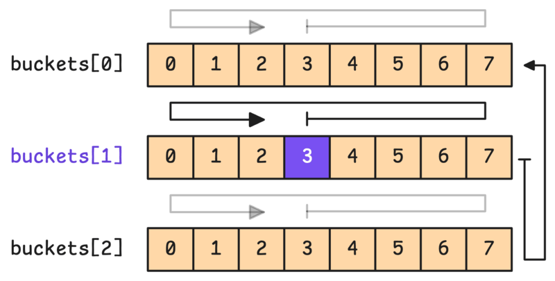

Misol:

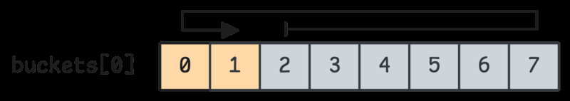

Shu sababli bunday code'ga tayanmang:

```go
for k := range m {
    fmt.Println(k)
}
```

Tartib kerak bo'lsa key'larni alohida slice'ga yig'ib sort qiling:

```go
keys := make([]string, 0, len(m))
for k := range m {
    keys = append(keys, k)
}
sort.Strings(keys)

for _, k := range keys {
    fmt.Println(k, m[k])
}
```

## Concurrent map access

Oddiy Go map concurrent write uchun safe emas:

```go
// fatal error: concurrent map writes
```

Variantlar:

- `sync.Mutex` yoki `sync.RWMutex` bilan himoya qilish;
- read-mostly case uchun `sync.Map`;
- single owner goroutine va channel orqali access.

## Eslab qol

- Map hash table sifatida ishlaydi.
- Bucket 8 tagacha slot saqlaydi; overflow bucket bo'lishi mumkin.
- Tophash lookup'ni tezlashtiradi, lekin key comparison baribir kerak.
- Map grow incremental va runtime tomonidan boshqariladi.
- Map element addressable emas.
- Iteration order random; tartib kerak bo'lsa key'larni sort qil.
- Concurrent write uchun map'ni lock bilan himoya qil.
