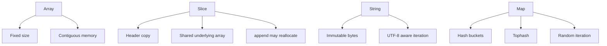

# 5. Xulosa

3-bob Go'dagi asosiy composite type'larning ichki tuzilishini ko'rsatdi.

## Arrays

Array fixed-size va contiguous memory'da turadi. Length type'ning bir qismi, shuning uchun `[5]int` va `[10]int` boshqa type'lar. Array value sifatida copy qilinadi, shu sababli katta array'larni function'ga berishda pointer yoki slice ko'proq ishlatiladi.

## Slices

Slice array emas, header: pointer, len, cap. Slice copy qilish header'ni copy qiladi, underlying array shared qoladi. `append` capacity yetarli bo'lsa existing array'ni o'zgartiradi, capacity yetmasa yangi array allocate qiladi. Full slice expression capacity'ni nazorat qilishga yordam beradi.

## Strings

String immutable byte sequence. `len` byte count beradi, indexing byte qaytaradi. UTF-8 sababli bitta visual character bir nechta byte bo'lishi mumkin. Rune bo'yicha yurish uchun `range` yoki `[]rune` kerak. Ko'p concatenation uchun `strings.Builder` ishlatish yaxshi.

## Maps

Map hash table. Key hash qilinadi, bucket tanlanadi, tophash orqali tez filter qilinadi va key comparison bilan aniq match topiladi. Bucket 8 slotga ega, overflow bucket bo'lishi mumkin. Grow incremental amalga oshadi. Map element addressable emas va iteration order stable emas.

Bobning amaliy xulosasi: Go'da performance va bug'larning katta qismi "copy bo'ldimi yoki shared qoldimi?" degan savolga bog'liq. Array copy bo'ladi, slice header copy bo'ladi, string immutable, map esa runtime boshqaradigan hash table.
