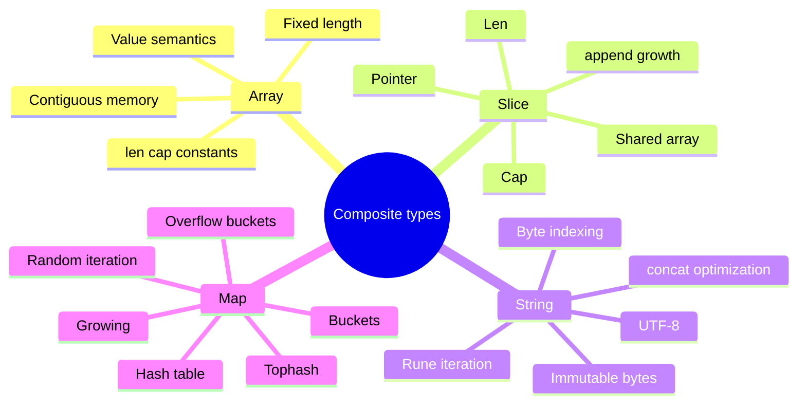
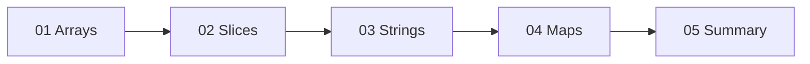

# 3-bob. Arrays, Slices, Strings, and Maps

> **Bu material "The Anatomy of Go" kitobining 3-bobi asosida o'zbek tilida tayyorlangan mazmuniy tarjima va o'quv qo'llanma. Asosiy ma'no, kod misollari, runtime/kompilyator tushunchalari va kitobdagi illustrationlar saqlangan; mavzular qo'shimcha diagrammalar bilan boyitilgan.**

## Bob nimani o'rgatadi?

Bu bob Go'dagi eng ko'p ishlatiladigan composite type'larni ichkaridan ko'rsatadi: array, slice, string va map. Tashqaridan ular oddiy ko'rinadi, lekin performance va memory behavior aynan ichki representation'ga bog'liq.

Bobdagi asosiy g'oyalar:

- **Array** - fixed-size ketma-ket xotira bo'lagi; length type'ning bir qismi.
- **Slice** - array emas, balki underlying array'ga qaraydigan descriptor: pointer, length, capacity.
- **String** - immutable byte sequence; Go string'lari UTF-8 matn saqlashi mumkin, lekin indexing byte bo'yicha ishlaydi.
- **Map** - hash table; bucket, tophash, overflow bucket, grow va randomized iteration bilan ishlaydi.

## Mundarija

| Fayl | Mavzu | Qisqa tavsif |
|------|-------|--------------|
| [01_arrays.md](01_arrays.md) | Arrays | fixed size, memory layout, initialization, compiler optimization, len/cap |
| [02_slices.md](02_slices.md) | Slices | slice header, slicing, shared array, append, growth, allocation strategy |
| [03_strings.md](03_strings.md) | Strings | byte vs rune, UTF-8, conversion, immutability, concatenation |
| [04_maps.md](04_maps.md) | Maps | hash, bucket, tophash, lookup, delete, grow, iteration |
| [05_summary.md](05_summary.md) | Xulosa | Bobdagi asosiy tushunchalar |
| [06_references.md](06_references.md) | Manbalar | Kitobda keltirilgan havolalar |

## Umumiy xarita

## Tavsiya etilgan o'qish tartibi

## Bobning katta savollari

1. Nega `[5]int` va `[10]int` boshqa-boshqa type hisoblanadi?
2. Slice copy qilinganda underlying data copy bo'ladimi yoki faqat header?
3. `append` qachon existing array'ni ishlatadi, qachon yangi array ajratadi?
4. String indexing nega character emas, byte qaytaradi?
5. `[]byte(s)` va `string(b)` conversion memory copy qiladimi?
6. Map element address'ini nega olib bo'lmaydi?
7. Map iteration order nega stable emas?

Boshlash uchun [01_arrays.md](01_arrays.md) faylini oching.
