# 1. Structs: composition, layout va performance

Struct - bir nechta field'ni bitta type ostida birlashtirish usuli:

```go
type User struct {
    ID   int64
    Name string
    Age  int
}
```

Go'da struct class emas: inheritance yo'q, constructor majburiy emas, method'lar type'ga alohida biriktiriladi. Composition esa embedding orqali natural ko'rinish oladi.

## 1.1 Struct basics

Struct literal:

```go
u := User{
    ID:   1,
    Name: "Ali",
    Age:  20,
}
```

Zero value:

```go
var u User
fmt.Println(u.ID, u.Name, u.Age) // 0 "" 0
```

Pointer bilan ishlash:

```go
func rename(u *User, name string) {
    u.Name = name
}
```

Go field access'da pointer dereference'ni soddalashtiradi:

```go
p := &User{Name: "Ali"}
fmt.Println(p.Name) // (*p).Name yozish shart emas
```

## Struct memory layout

Struct field'lari memory'da e'lon qilingan tartibda joylashadi. Array elementlari bir xil type bo'lgani uchun bir xil stride bilan ketadi; struct field'lari esa turli hajmga ega bo'lishi mumkin:

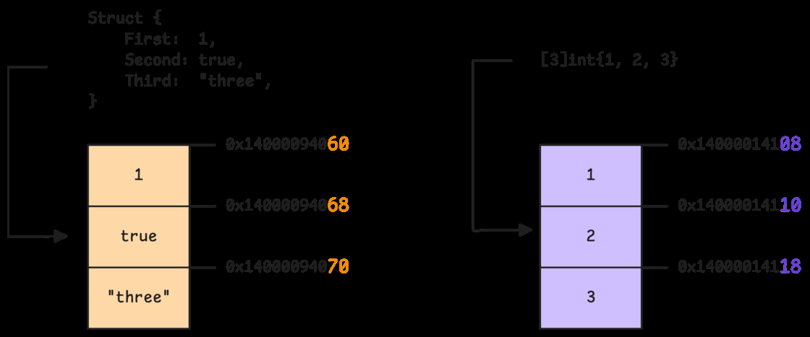

Alignment qoidalari sababli padding paydo bo'lishi mumkin. Masalan, `bool` 1 byte bo'lsa ham, keyingi `int64` 8-byte boundary'ga mos joylashishi kerak:

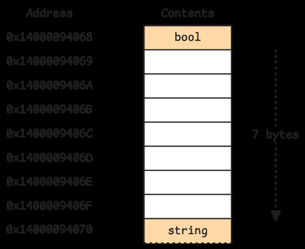

Field offset'larni `unsafe.Offsetof` bilan ko'rish mumkin:

```go
type Example struct {
    A bool
    B int64
    C int32
}

fmt.Println(unsafe.Offsetof(Example{}.A))
fmt.Println(unsafe.Offsetof(Example{}.B))
fmt.Println(unsafe.Offsetof(Example{}.C))
```

Kitobdagi field offset ko'rinishi:

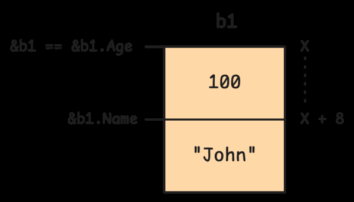

## 1.2 Advanced struct concepts

### Method receiver

Method struct type'ga behavior qo'shadi:

```go
func (u User) DisplayName() string {
    return u.Name
}

func (u *User) Rename(name string) {
    u.Name = name
}
```

Value receiver copy bilan ishlaydi, pointer receiver original value'ni o'zgartira oladi.

### Embedding

Go inheritance bermaydi, lekin embedding orqali composition'ni qulay qiladi:

```go
type Engine struct {
    Power int
}

func (e Engine) Start() {
    fmt.Println("engine start")
}

type Car struct {
    Engine
    Brand string
}

func main() {
    c := Car{Engine: Engine{Power: 120}, Brand: "GM"}
    c.Start() // promoted method
}
```

`Car` `Engine`dan "meros olmaydi"; `Engine` field sifatida ichida turadi. Lekin field va method'lar promoted bo'lgani uchun syntax inheritance'ga o'xshab ko'rinadi.

Method set qaysi method call qilinishini belgilaydi. Embedded type o'z method set'ini outer type'ga promote qiladi, lekin conflict bo'lsa explicit field orqali murojaat qilish kerak.

Kitobdagi rasmda `Operate` embedded `Vehicle`ning emas, concrete type'ning o'z method set'ini ishlatishi ko'rsatiladi:

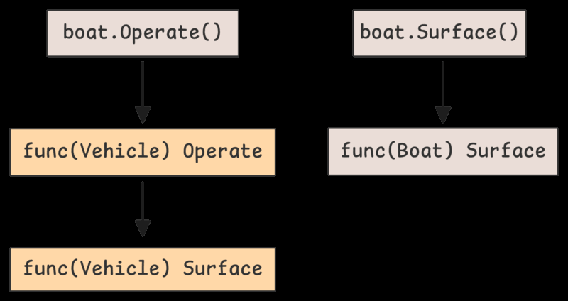

### Struct tags

Struct tag runtime reflection orqali o'qiladigan metadata:

```go
type User struct {
    ID   int64  `json:"id"`
    Name string `json:"name"`
}
```

Compiler tag'ni behavior'ga avtomatik aylantirmaydi; `encoding/json`, ORM yoki validator kabi package'lar reflection orqali tag'ni o'qiydi.

## 1.3 Memory layout va performance

CPU memory'ni byte-by-byte emas, cache line bo'yicha olib keladi. Ko'p system'da cache line 64 byte:

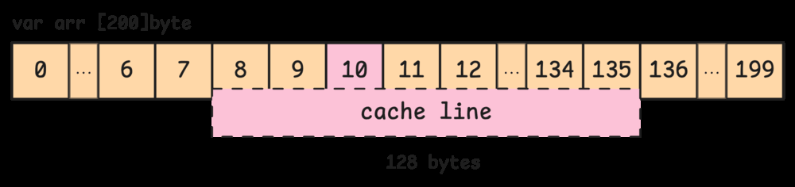

Struct field tartibi cache behavior va memory footprint'ga ta'sir qiladi. Yomon layout struct'ni ikki cache line'ga yoyib yuborishi mumkin:

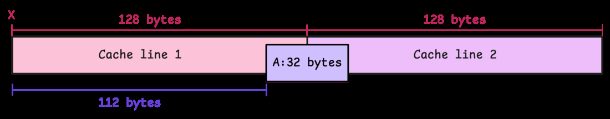

Field tartibini o'zgartirish padding'ni kamaytiradi:

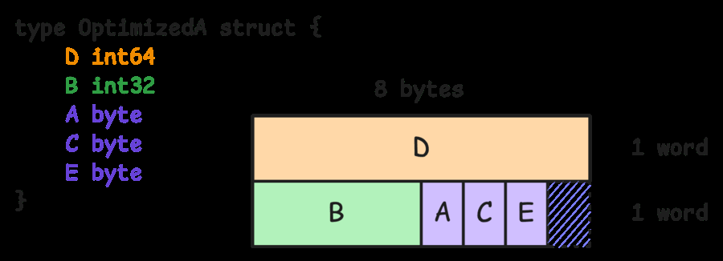

Padding memory usage'ni oshirishi mumkin:

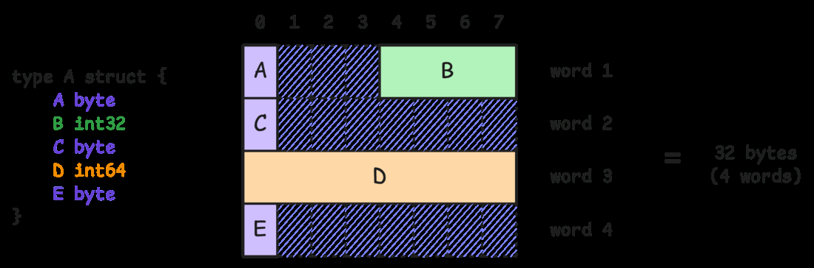

Struct alignment odatda eng katta alignment talab qiladigan field bilan belgilanadi:

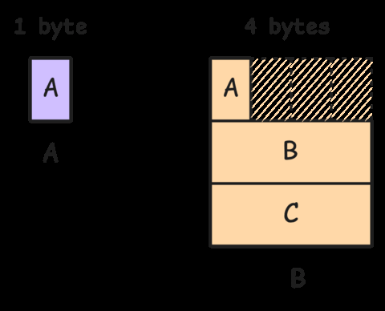

Agar alignment qoidalari bo'lmasa, CPU unaligned access bilan qiynalishi yoki bir nechta memory operation bajarishi mumkin:

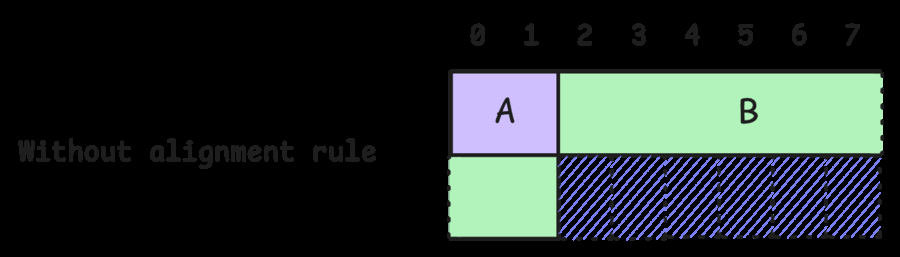

Zero-size type'lar ham qiziq:

```go
type Empty struct{}
fmt.Println(unsafe.Sizeof(Empty{})) // 0
```

Zero-size values alignment bilan bog'liq maxsus holatlarga ega:

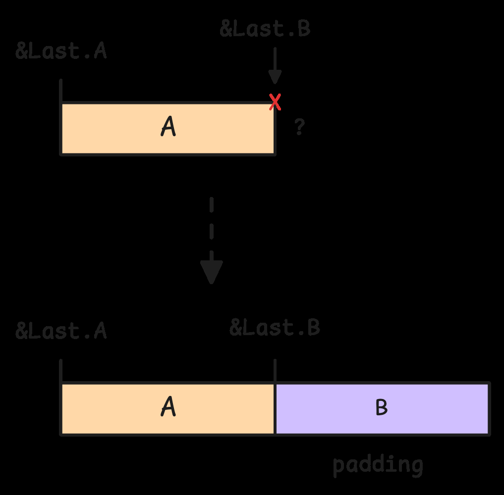

Ba'zi zero-size variable'lar bir xil address'ga ega bo'lishi mumkin:

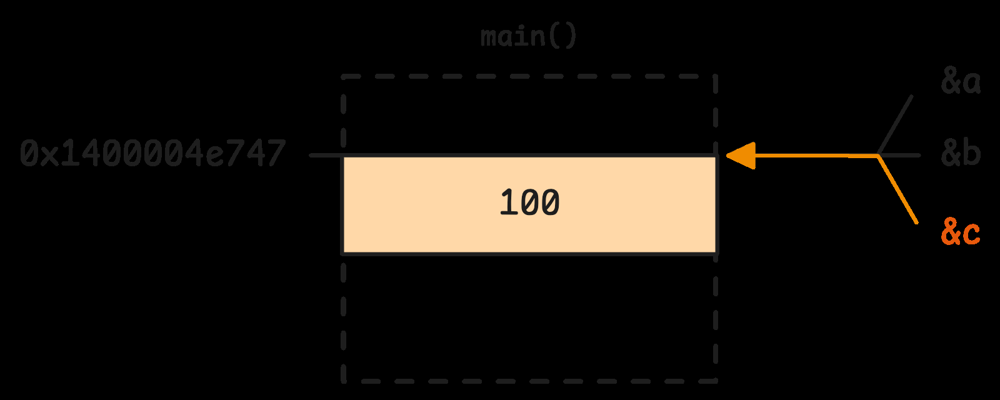

## Field tartibini tanlash

Katta alignment talab qiladigan field'larni oldinroq qo'yish padding'ni kamaytiradi:

```go
// Ko'proq padding bo'lishi mumkin
type A struct {
    b bool
    i int64
    x int32
}

// Ko'pincha ixchamroq
type B struct {
    i int64
    x int32
    b bool
}
```

Lekin faqat memory hajm uchun readability'ni qurbon qilish shart emas. Performance-critical yoki millionlab instance yaratiladigan type'larda layout muhimroq.

## Eslab qol

- Struct field'lari e'lon tartibida joylashadi.
- Padding alignment uchun qo'shiladi.
- Field tartibi `unsafe.Sizeof` natijasiga ta'sir qilishi mumkin.
- Embedding inheritance emas, composition va promotion.
- Value receiver copy qiladi; pointer receiver originalni o'zgartiradi.
- Cache line va padding performance-critical struct'larda muhim.
