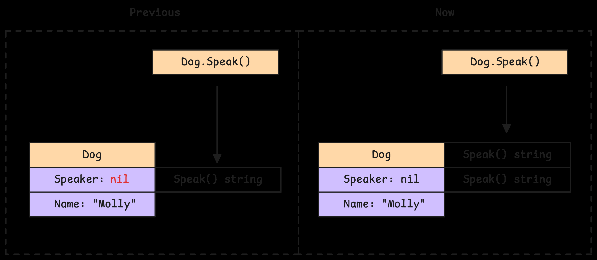
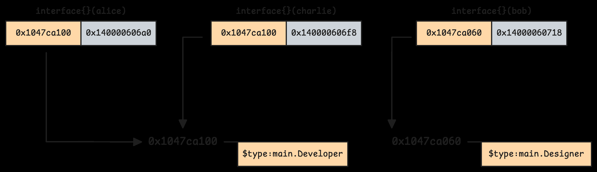
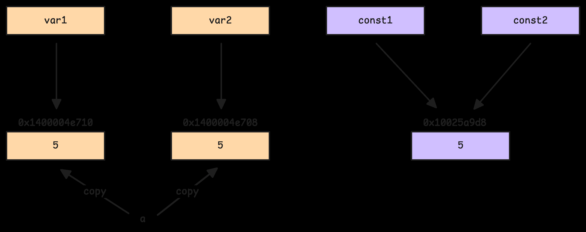
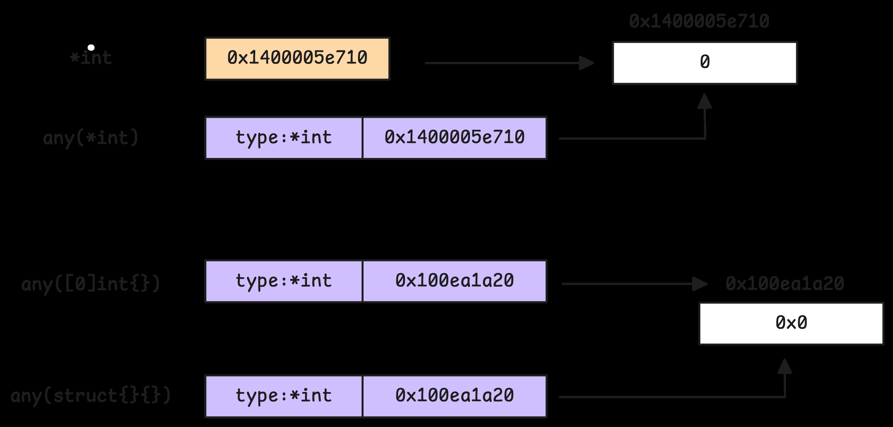
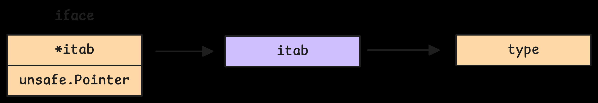
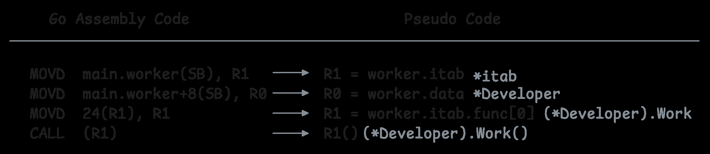
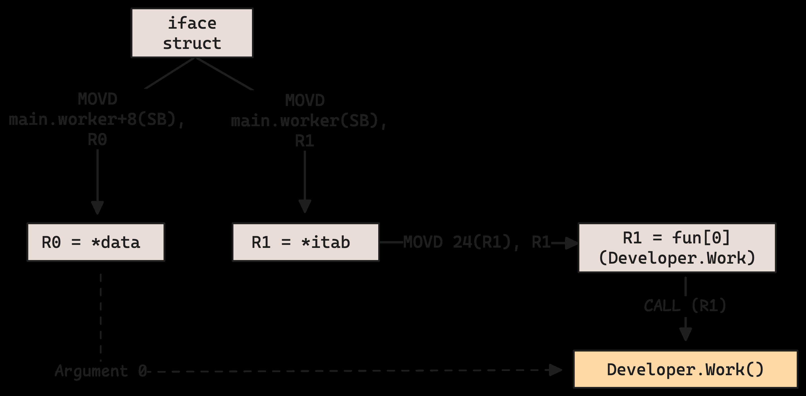
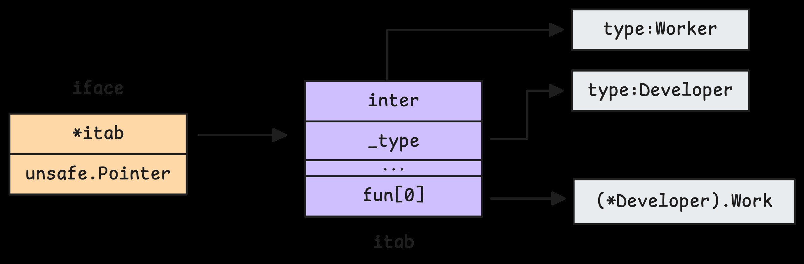

# 2. Interfaces: contracts, composition va runtime mechanics

Interface Go'da behavior contract. Type interface'ni "implements" deb alohida e'lon qilmaydi; agar method set mos kelsa, type interface'ni implicit satisfy qiladi.

```go
type Reader interface {
    Read(p []byte) (n int, err error)
}

type File struct{}

func (File) Read(p []byte) (int, error) {
    return 0, io.EOF
}

var r Reader = File{}
```

## 2.1 Interface as behavioral contract

Go interface'lari kichik bo'lishi kerak degan idiom bor:

```go
type Stringer interface {
    String() string
}
```

Kichik interface'lar code'ni decouple qiladi. Function kerakli behavior'ni so'raydi, concrete type'ni emas:

```go
func Print(v fmt.Stringer) {
    fmt.Println(v.String())
}
```

Pointer receiver va value receiver method set'ga ta'sir qiladi:

```go
type Counter int

func (c *Counter) Inc() {
    (*c)++
}

type Incer interface {
    Inc()
}

var c Counter
var i Incer = &c // ok
// var j Incer = c // error, Inc pointer receiver bilan
```

## Nil interface muammosi

Interface value ikki qismdan iborat: dynamic type va dynamic value. Agar dynamic type bor, value nil bo'lsa ham interface'ning o'zi nil emas:

```go
type Notifier interface {
    Notify()
}

type Email struct{}

func (*Email) Notify() {}

func main() {
    var e *Email = nil
    var n Notifier = e

    fmt.Println(n == nil) // false
    n.Notify()            // method nil receiver bilan ishlashi yoki panic qilishi mumkin
}
```

Nil interface method call'ni to'g'ri tekshirish kerak:



Qisqa qoida: interface `nil` bo'lishi uchun type ham nil, value ham nil bo'lishi kerak.

## 2.2 Interface composition va embedding

Interface boshqa interface'larni embed qilishi mumkin:

```go
type Reader interface {
    Read(p []byte) (int, error)
}

type Writer interface {
    Write(p []byte) (int, error)
}

type ReadWriter interface {
    Reader
    Writer
}
```

Go 1.14 atrofidagi proposal va o'zgarishlardan keyin overlapping method set'lar bilan embedding ancha moslashuvchan bo'lgan. Muhim qoidalar: method signature mos bo'lishi kerak; bir xil nom turli signature bilan conflict beradi.

## 2.3 Empty interface internal structure

`interface{}` yoki `any` har qanday type'ni saqlashi mumkin:

```go
var x any = 10
x = "hello"
x = []int{1, 2, 3}
```

Runtime ichida empty interface odatda ikki pointer bilan tasvirlanadi:

- type pointer;
- data pointer.



Variable copy bo'lganda value copy bo'lishi mumkin, constant va read-only data esa shared bo'lishi mumkin:



Zero-size type'lar uchun runtime `zerobase`dan foydalanishi mumkin:



## 2.4 Non-empty interface va `itab`

Non-empty interface method set talab qiladi:

```go
type Shape interface {
    Area() float64
}
```

Runtime non-empty interface uchun extra indirection ishlatadi:



Bu yerda `itab` muhim:

- concrete type haqida ma'lumot;
- interface type haqida ma'lumot;
- method function pointer'lari.

Method call assembly darajasida `itab` orqali function pointer topadi:



Flow:



`itab` concrete type method'larini interface method set bilan bog'laydi:



## 2.5 Type assertions va runtime behavior

Type assertion:

```go
var x any = "hello"
s := x.(string)
```

Safe form:

```go
s, ok := x.(string)
if ok {
    fmt.Println(s)
}
```

Type switch:

```go
switch v := x.(type) {
case string:
    fmt.Println("string", v)
case int:
    fmt.Println("int", v)
default:
    fmt.Println("unknown")
}
```

Runtime assertion paytida interface ichidagi dynamic type tekshiriladi. Non-empty interface'larda `itab` lookup/cache ishlatilishi mumkin.

## Performance haqida

Interface call dynamic dispatch bo'lishi mumkin. Compiler concrete type'ni aniqlay olsa, devirtualization qilib direct call'ga aylantirishi mumkin. Aks holda call `itab` orqali boradi.

Tavsiya:

- API boundary'da interface yaxshi.
- Hot path ichida unnecessary interface allocation/dynamic dispatchdan ehtiyot bo'l.
- "Accept interfaces, return structs" idiomi ko'p hollarda foydali.

## Eslab qol

- Interface implicit satisfy qilinadi.
- Interface `nil` bo'lishi uchun dynamic type ham, value ham nil bo'lishi kerak.
- Empty interface ikki pointer: type va data.
- Non-empty interface `itab` orqali concrete type method'larini bog'laydi.
- Type assertion dynamic type tekshiradi.
- Interface abstraction beradi, lekin hot path'da dispatch/allocation narxi bo'lishi mumkin.
