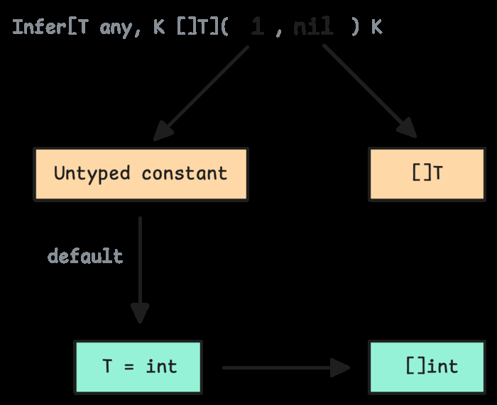
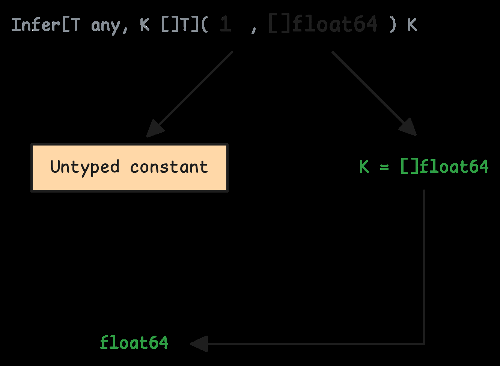
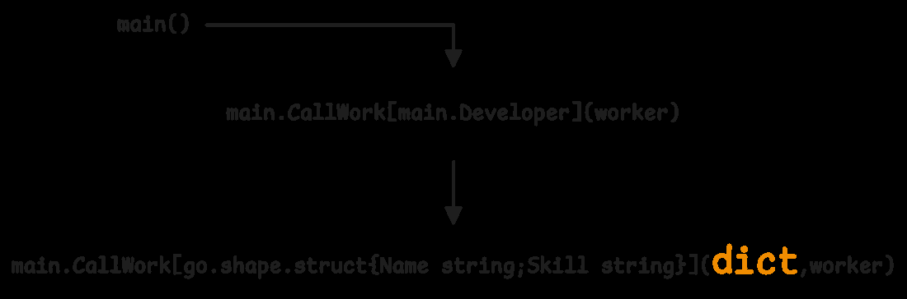
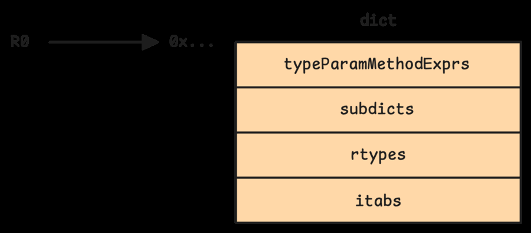

# 3. Generics: type parameters, constraints va compiler internals

Generics Go 1.18 bilan keldi. U bir xil logic'ni turli type'lar uchun type-safe yozish imkonini beradi.

## 3.1 Motivation va basic syntax

Generics'dan oldin bunday function'larni alohida yozish kerak bo'lardi:

```go
func MaxInt(a, b int) int {
    if a > b {
        return a
    }
    return b
}

func MaxFloat64(a, b float64) float64 {
    if a > b {
        return a
    }
    return b
}
```

Generic version:

```go
func Max[T constraints.Ordered](a, b T) T {
    if a > b {
        return a
    }
    return b
}
```

Call:

```go
fmt.Println(Max(1, 2))
fmt.Println(Max(1.5, 2.5))
fmt.Println(Max("a", "b"))
```

`T` type parameter, `constraints.Ordered` esa allowed type'lar contract'i.

## 3.2 Constraints

Eng sodda constraint:

```go
func Print[T any](v T) {
    fmt.Println(v)
}
```

`any` - `interface{}` alias'i.

Comparable type'lar:

```go
func Contains[T comparable](items []T, target T) bool {
    for _, item := range items {
        if item == target {
            return true
        }
    }
    return false
}
```

Custom constraint:

```go
type Number interface {
    ~int | ~int64 | ~float64
}

func Sum[T Number](items []T) T {
    var total T
    for _, item := range items {
        total += item
    }
    return total
}
```

`~int` degani underlying type `int` bo'lgan defined type'lar ham mos keladi.

Compiler constraints'dan type inference va allowed operations uchun foydalanadi:



## 3.3 Type inference

Ko'p call'larda type argument yozish shart emas:

```go
func First[T any](items []T) T {
    return items[0]
}

v := First([]int{1, 2, 3}) // T = int
```

Compiler existing slice type'dan `T`ni chiqaradi:



Ba'zi murakkab holatlarda type argument explicit yoziladi:

```go
var x = NewCache[string, int]()
```

Type inference function argumentlardan, constraints'dan va ba'zi assignment context'lardan foydalanadi. Lekin return type'dan doim ham inference qilinmaydi.

## 3.4 Compiler internals: shape va dictionary

Go generics implementation full monomorphization emas. Ya'ni har type uchun butun function body'ni to'liq clone qilish doimiy strategy emas. Go shape stenciling va dictionaries kombinatsiyasidan foydalanadi.

Compiler generic function uchun ikki turdagi artifact yaratishi mumkin:

- concrete wrapper - aniq type bilan chaqirishga tayyorlaydi;
- shaped function - bir xil memory shape'ga ega type'lar uchun umumiy body.

Shaped version:



Dictionary runtime type information, method pointer va kerakli metadata saqlaydi:



Oddiy model:

```mermaid
flowchart LR
    A[Max[int]] --> B[wrapper]
    B --> C[shaped Max]
    B --> D[dictionary for int]
    E[Max[MyInt]] --> F[wrapper]
    F --> C
    F --> G[dictionary for MyInt]
```

Bu design code size va performance orasida balans beradi. Har bir type uchun hammasini alohida generate qilish binary'ni kattalashtirishi mumkin. Bitta shaped version'ni dictionary bilan ishlatish esa code reuse beradi.

## Generics qachon ishlatish kerak?

Yaxshi holatlar:

- container/data structure (`Set[T]`, `Stack[T]`);
- type-safe helper function;
- algoritm bir xil, type'lar har xil;
- library API'da `interface{}` va type assertiondan qochish.

Ehtiyot bo'ladigan holatlar:

- faqat bitta type uchun generic qilish;
- constraint juda murakkab bo'lib ketishi;
- readability pasayishi;
- hot path'da dictionary/shape implementation performance'ini benchmark qilmaslik.

## Eslab qol

- Generics type-safe reuse beradi.
- Constraint allowed operation'larni belgilaydi.
- `~T` underlying type mosligini bildiradi.
- Type inference call'larni oddiy ko'rsatadi.
- Go generics shape stenciling va dictionary orqali code size/performance balansini saqlaydi.
