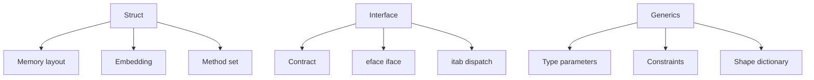

# 4. Xulosa

4-bob Go'dagi user-defined type'lar qanday qurilishi va runtime/compiler ularni qanday ishlatishini ko'rsatdi.

## Structs

Struct data layout'ni aniq belgilaydi. Field order memory hajmi, padding va cache behavior'ga ta'sir qiladi. Go inheritance bermaydi; embedding orqali composition va method promotion beradi. Performance-critical code'da `unsafe.Sizeof`, `unsafe.Alignof`, `unsafe.Offsetof` bilan layout'ni tekshirish foydali.

## Interfaces

Interface behavior contract. Type interface'ni explicit implement qilmaydi; method set mos bo'lsa kifoya. Empty interface type/data pointer bilan, non-empty interface esa `itab` orqali concrete type va method set'ni bog'laydi. Nil interface muammosi dynamic type va dynamic value farqini tushunishni talab qiladi.

## Generics

Generics boilerplate kamaytiradi va type-safe reusable code beradi. Constraints allowed operation'larni belgilaydi, type inference call syntax'ni yengillashtiradi. Compiler shape stenciling va dictionary orqali generics'ni code size va performance o'rtasida balans bilan implement qiladi.

Amaliy xulosa: struct'lar data'ni joylashtiradi, interface'lar behavior'ni ajratadi, generics esa bir xil algoritmni type-safe qayta ishlatishga yordam beradi. Uchalasini birga tushunish Go API design va performance uchun juda muhim.
