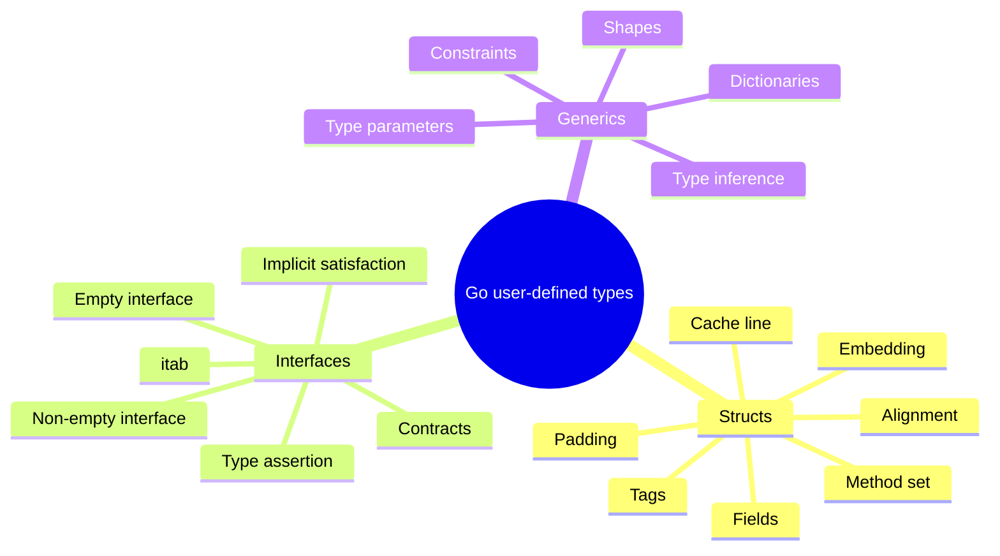

# 4-bob. Structs, Interfaces and Generics

> **Bu material "The Anatomy of Go" kitobining 4-bobi asosida o'zbek tilida tayyorlangan mazmuniy tarjima va o'quv qo'llanma. Asosiy ma'no, kod misollari, compiler/runtime tushunchalari va kitobdagi illustrationlar saqlangan; mavzular qo'shimcha diagrammalar bilan boyitilgan.**

## Bob nimani o'rgatadi?

Bu bob Go'da custom type'lar qanday qurilishini va runtime/compiler ularni qanday ishlatishini tushuntiradi:

- struct field layout, padding, alignment va cache behavior;
- method set, embedding va composition;
- interface contract, empty/non-empty interface internal representation;
- `itab` orqali dynamic method dispatch;
- generics syntax, constraints, type inference va compiler implementation.

## Mundarija

| Fayl | Mavzu | Qisqa tavsif |
|------|-------|--------------|
| [01_structs.md](01_structs.md) | Structs | composition, embedding, method set, layout, padding, cache line |
| [02_interfaces.md](02_interfaces.md) | Interfaces | implicit satisfaction, embedding, `eface`, `iface`, `itab`, type assertion |
| [03_generics.md](03_generics.md) | Generics | type parameters, constraints, inference, shape stenciling, dictionary |
| [04_summary.md](04_summary.md) | Xulosa | Struct, interface va generics bog'liqligi |
| [05_references.md](05_references.md) | Manbalar | Kitobda keltirilgan havolalar |

## Umumiy xarita

## Bobning katta savollari

1. Struct field tartibi memory hajmiga qanday ta'sir qiladi?
2. Embedding inheritance emas bo'lsa, method promotion qanday ishlaydi?
3. `nil` concrete pointer interface ichida nega `nil` interface emas?
4. Empty interface va non-empty interface ichki ko'rinishi nimasi bilan farq qiladi?
5. `itab` method call'ni qanday bog'laydi?
6. Generics Go'da full monomorphization qiladimi yoki boshqa usulmi?

Boshlash uchun [01_structs.md](01_structs.md) faylini oching.
