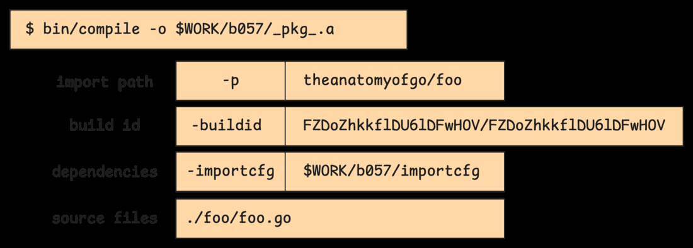
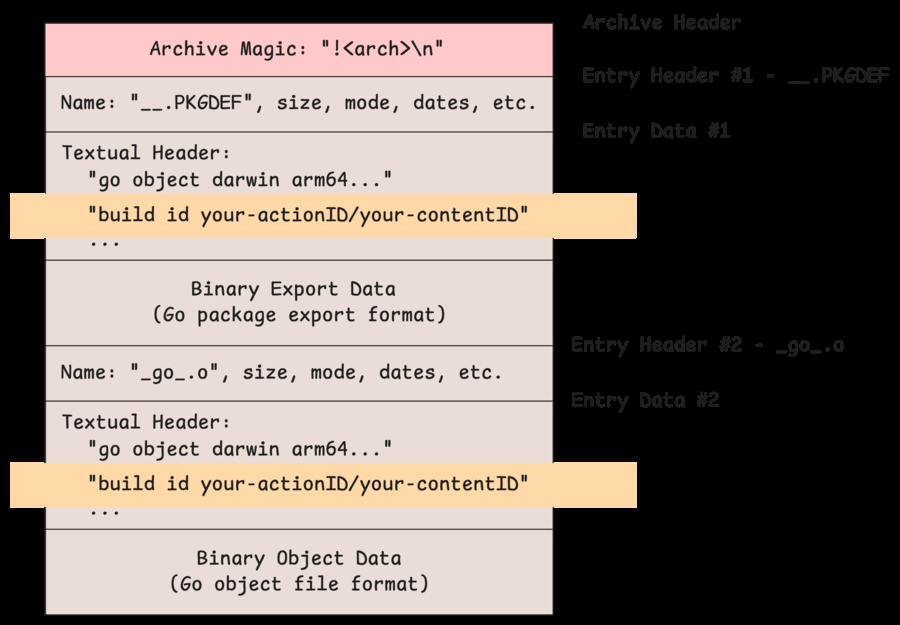
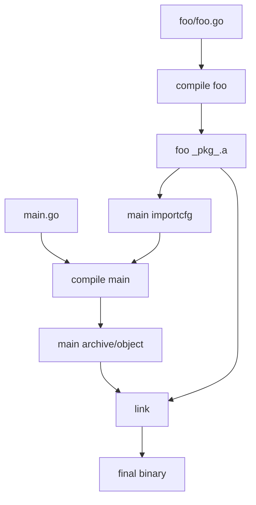

# 5.1 Inspecting the Compilation Process

Go build jarayonini ko'rish uchun juda qulay command bor:

```bash
go build -n .
```

`-n` dry-run mode: build command'larini ko'rsatadi, lekin ularni bajarmaydi. Agar command'larni ko'rish bilan birga real build ham qilish kerak bo'lsa, `-x` ishlatiladi.

Misol project:

```go
package main

import (
    "theanatomyofgo/foo"
)

func main() {
    foo.Foo()
}
```

Bu `main` package local `theanatomyofgo/foo` package'dagi `Foo` function'ni chaqiradi.

## `foo` package compile bo'lishi

`go build -n` output build cache holatiga qarab farq qilishi mumkin. Agar `foo` oldin compile qilingan bo'lsa, Go cache'dan foydalanadi. Cache toza bo'lsa, shunga o'xshash command'lar chiqadi:

```bash
#
# theanatomyofgo/foo
#

mkdir -p $WORK/b057/

echo '# import config' > $WORK/b057/importcfg # internal

bin/compile -o $WORK/b057/_pkg_.a \
  -trimpath "$WORK/b057=>" \
  -p theanatomyofgo/foo \
  -lang=go1.23 \
  -complete \
  -buildid FZDoZhkkflDU6lDFwHOV/FZDoZhkkflDU6lDFwHOV \
  -goversion go1.23.5 \
  -c=4 \
  -shared \
  -nolocalimports \
  -importcfg $WORK/b057/importcfg \
  -pack ./foo/foo.go

bin/buildid -w $WORK/b057/_pkg_.a # internal
```

`$WORK/b057/` - temporary build workspace ichidagi action directory. Build system har bir action uchun `b001`, `b002`, `b057` kabi directory yaratadi.

`importcfg` compiler'ga imported package'larning compiled archive'lari qayerda ekanini aytadi. `foo` boshqa package import qilmasa, file deyarli bo'sh bo'ladi:

```bash
echo '# import config' > $WORK/b057/importcfg
```

Compile command qismlari:



Muhim flag'lar:

- `-o $WORK/b057/_pkg_.a` - output archive.
- `-p theanatomyofgo/foo` - package import path.
- `-buildid ...` - build cache uchun action/content identity.
- `-importcfg ...` - dependency mapping.
- `-pack` - output'ni archive ko'rinishida yozish.

Build ID ikki qismdan iborat:

- **Action ID** - source, flags, Go version, build tags, dependency info kabi inputlar hash'i.
- **Content ID** - compiled output hash'i.

Source o'zgarmasa, Go qayta compile qilmasdan cache'dagi artifact'dan foydalanishi mumkin.

## Archive file nima?

Go package compile bo'lgach `.a` archive hosil bo'ladi. Uning ichida export data va object data bo'ladi:



Archive odatda ikki muhim entry saqlaydi:

- `__.PKGDEF` - package export data;
- `_go_.o` - object code/data.

## `main` package compile bo'lishi

`main` package `foo`ni import qilgani uchun uning `importcfg` file'i endi mapping saqlaydi:

```text
packagefile theanatomyofgo/foo=$WORK/b057/_pkg_.a
```

Bu compiler'ga `import "theanatomyofgo/foo"` ko'rilganda compiled package qayerdan o'qilishini aytadi.

`main` compile bo'lgach linker final binary yaratadi:

```bash
bin/link -o $WORK/b001/exe/a.out ...
```

Build jarayoni rough ko'rinishda:



## Eslab qol

- `go build -n` command'larni ko'rsatadi, build qilmaydi.
- `$WORK` temporary build workspace.
- `importcfg` dependency archive'lar mapping'i.
- `.a` archive export data va object code saqlaydi.
- Build ID Go build cache'ning asosiy kalitlaridan biri.
