# 5.2-5.4 Parsing, Syntax Tree va Type Checking

Go package compile bo'lishi bir nechta bosqichdan o'tadi. Dastlab source text tokenlarga ajraladi, keyin syntax tree quriladi, so'ng type checker Go qoidalarini tekshiradi.

## 5.2 Package compile overview

Package compile qilishning soddalashtirilgan ko'rinishi:

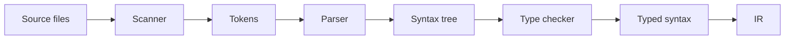

## 5.3 Stage 1: parsing va syntax tree

Scanner source code'ni tokenlarga ajratadi. Masalan:

```go
if err != nil {
    return err
}
```

Tokenlar:

- `if`
- identifier `err`
- operator `!=`
- identifier/predeclared `nil`
- `{`
- `return`
- identifier `err`
- `}`

Kitobdagi token ko'rinishi:

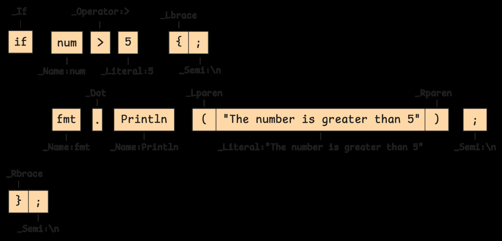

Parser tokenlardan syntax tree quradi:

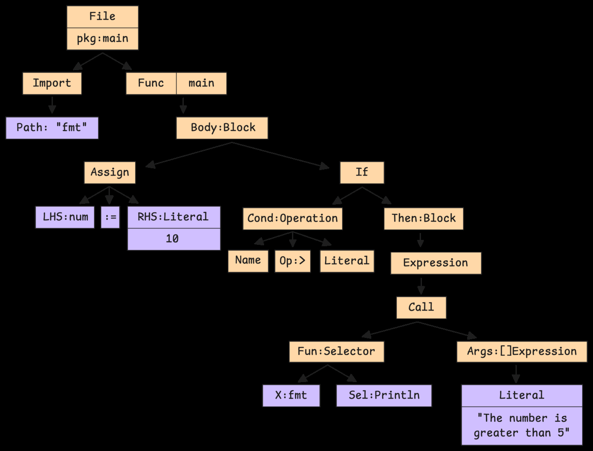

`if` statement strukturasi:

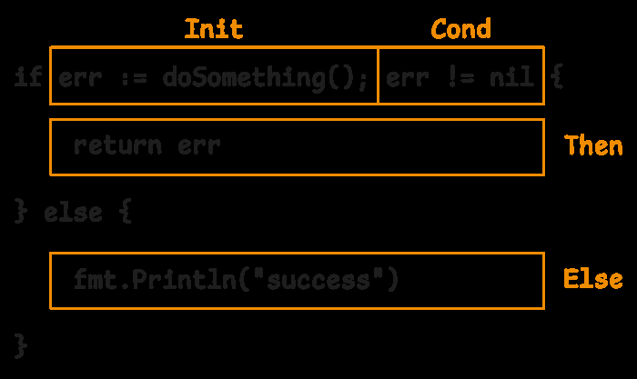

Syntax tree hali "bu type to'g'rimi?", "variable mavjudmi?", "assignment mosmi?" kabi savollarga to'liq javob bermaydi. U faqat source code grammatik structure'ni ushlaydi.

## 5.4 Stage 2: type checking va scope resolution

Type checker syntax tree ustidan yurib, Go language qoidalarini tekshiradi:

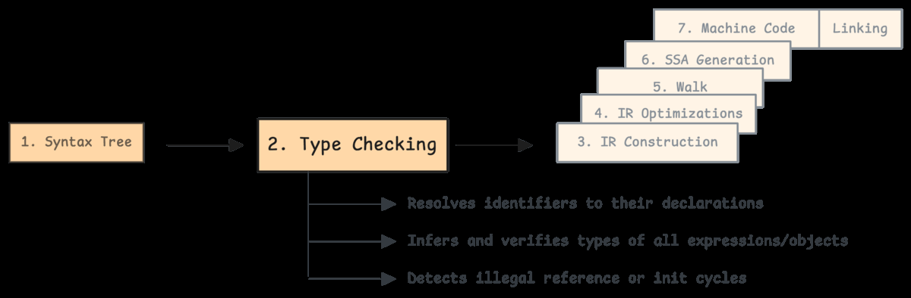

U quyidagilarni bajaradi:

- package name consistency;
- import resolution;
- top-level declarations yig'ish;
- scope qurish;
- type declaration, const, var va function signature tekshirish;
- function body type checking;
- package-level initialization order aniqlash.

Package-level declarations:

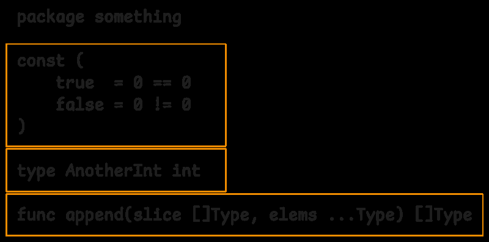

Constant declaration tree:

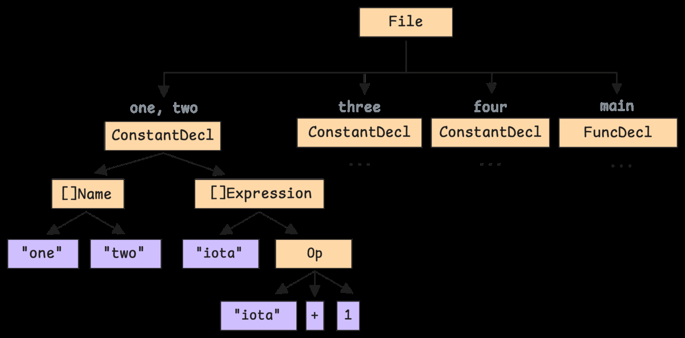

Package scope object'larni saqlaydi:

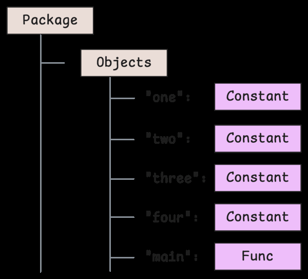

Compiler type-checking state'larni rang/kod kabi kuzatadi:

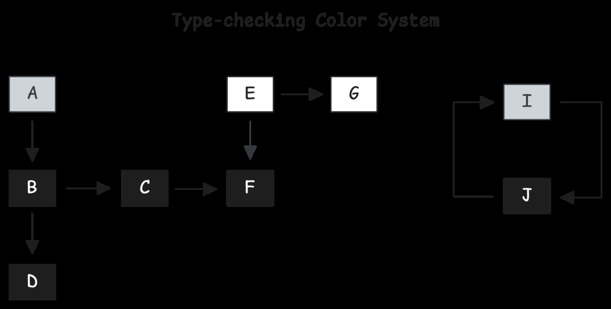

## Scope va dependency resolution

Type checker variable yoki type nomini ko'rganda current scope'dan boshlaydi, topilmasa parent scope'ga ko'tariladi. Bu 2-bobdagi scope modelining compiler pipeline ichidagi davomidir.

Type dependency'lar ham hal qilinadi:

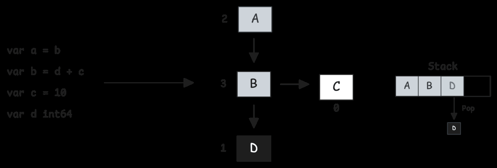

Circular reference bo'lsa ham compiler ma'lum darajada resolution'ni davom ettirishi va xatoni aniqroq chiqarishi mumkin:

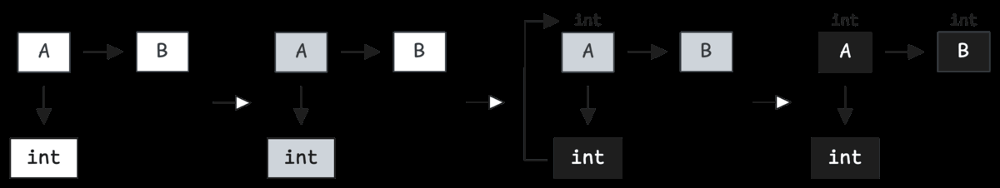

Global type/signature tekshiruvlardan keyin function body'lar to'liq tekshiriladi:

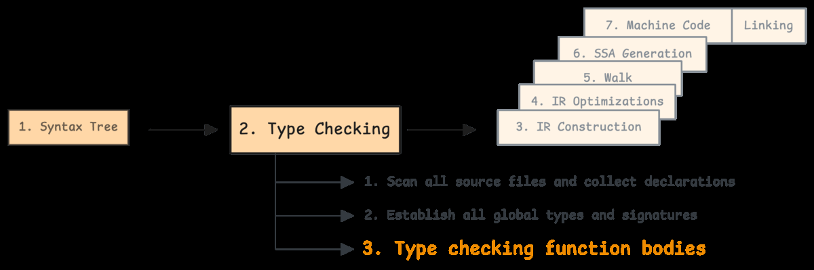

## Package-level initialization order

Global variable'lar bir-biriga bog'liq bo'lishi mumkin:

```go
var a = f()
var b = a + 1
var c = b + 1
```

Compiler dependency graph tuzadi:

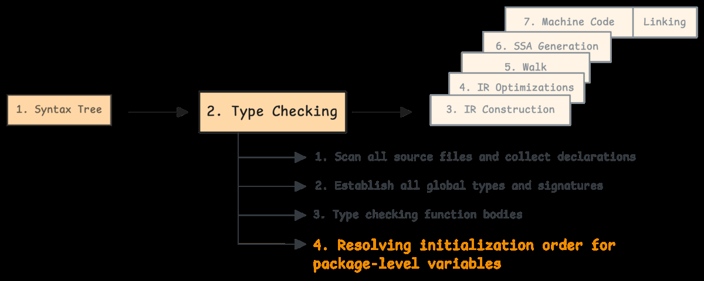

Graph:

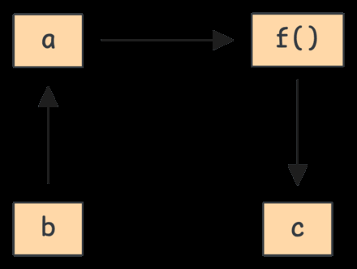

`f()` downstream dependency bilan almashtirilishi mumkin:

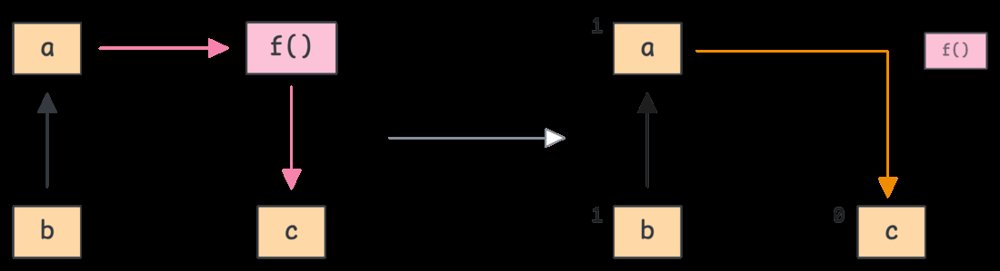

Agar dependency cycle qolsa, initialization order mumkin emas:

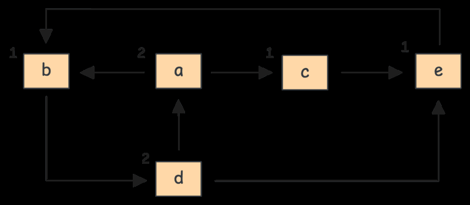

## Eslab qol

- Scanner source text'ni tokenlarga ajratadi.
- Parser tokenlardan syntax tree quradi.
- Type checker Go qoidalari, scope va type compatibility'ni tekshiradi.
- Package-level declarations avval yig'iladi, keyin body'lar tekshiriladi.
- Global initialization dependency graph orqali tartiblanadi.
