# 5.5 IR Construction, Export Data va Relocations

Type checking tugagach, compiler syntax tree'dan pastroq darajadagi Intermediate Representation (IR) quradi. IR optimization va keyingi lowering bosqichlari uchun qulayroq format.

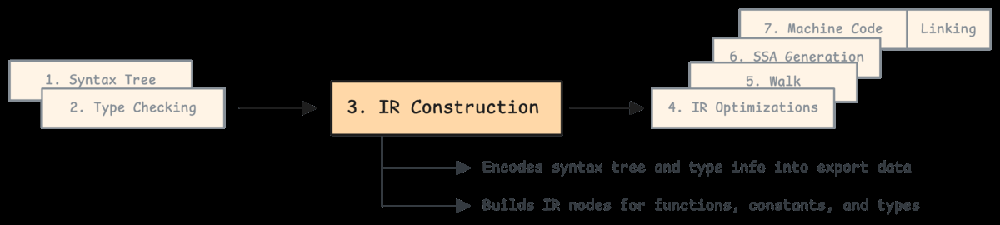

Syntax tree source code tuzilishini ifodalaydi; IR esa compiler uchun ishlov berish osonroq, normalized representation.

## Export data nima?

Go separate compilation qiladi: package A compile bo'lishi uchun package B source code'ining hammasi shart emas. A package B'ni import qilsa, compiler B'ning export data'sini o'qiydi.

Export data quyidagilarni saqlaydi:

- exported type'lar;
- function signature'lari;
- constants;
- method set'lar;
- generic type/function metadata;
- package path va object metadata.

Source -> exportable bitstream:

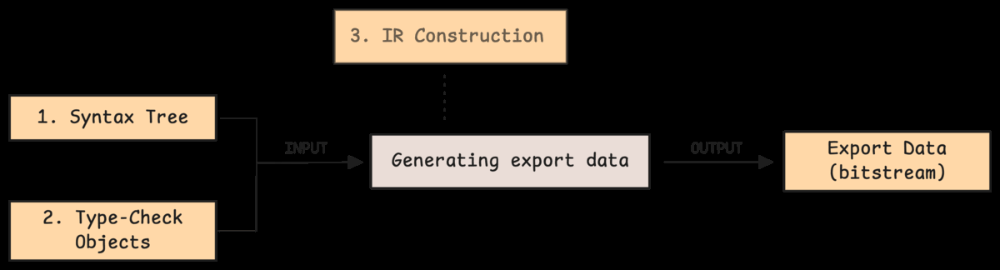

String deduplication ham bor: `"foo"` bir marta saqlanadi, ko'p joyda reloc orqali refer qilinadi:

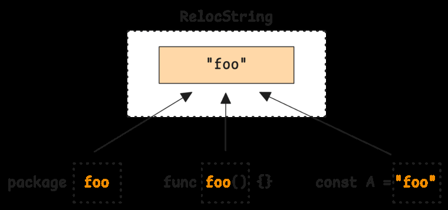

Package element compact layout:

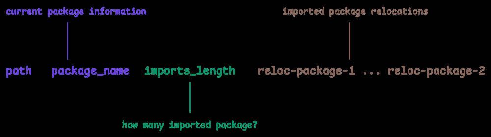

String dedup reloc index orqali:

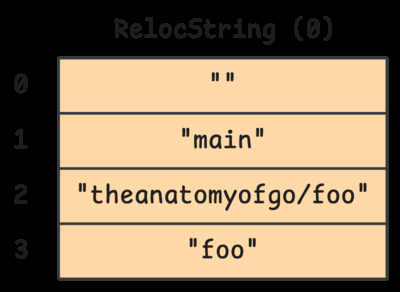

`RelocString` type va index reference:

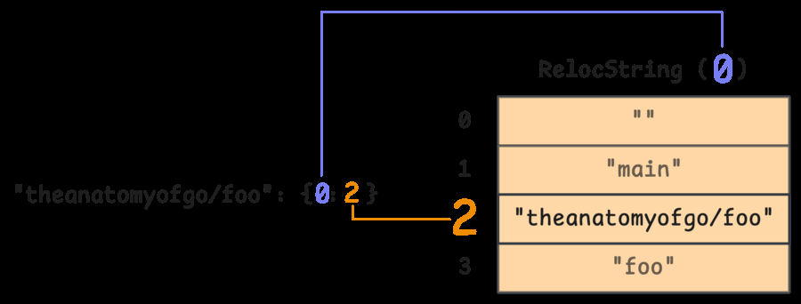

Encoder stringlarni relocation orqali map qiladi:

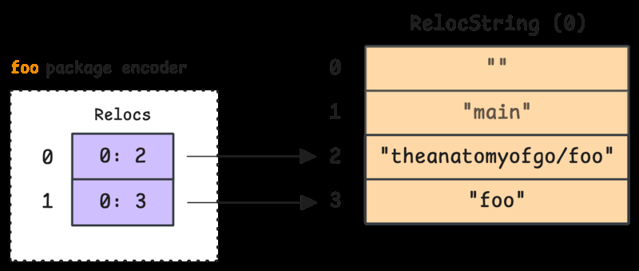

Encoded header relocation indexlarga qaraydi:

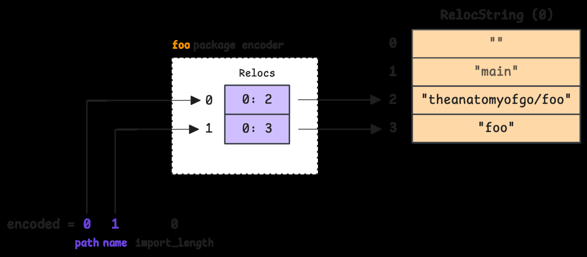

Final encoded object data:

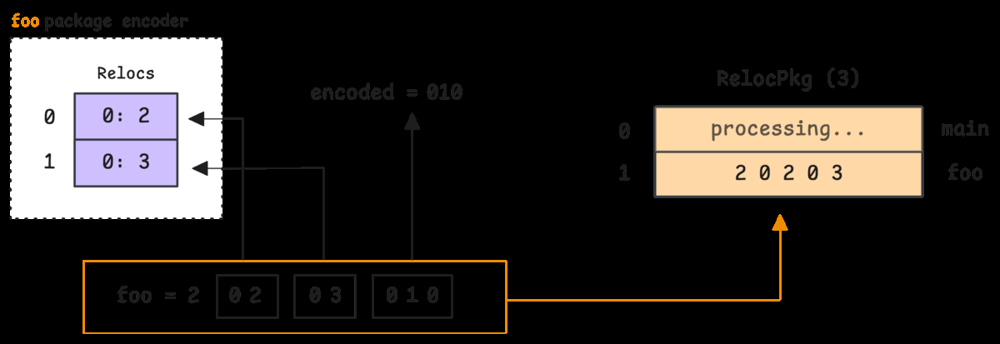

## Import qiluvchi package uchun export data

`main` package `foo`ni import qilsa, `main` compiler'i `foo` archive ichidagi export data'ni o'qiydi. Shunda `foo.Foo` signature, constants va type'lar ma'lum bo'ladi.

`main` uchun relocation value'lar:

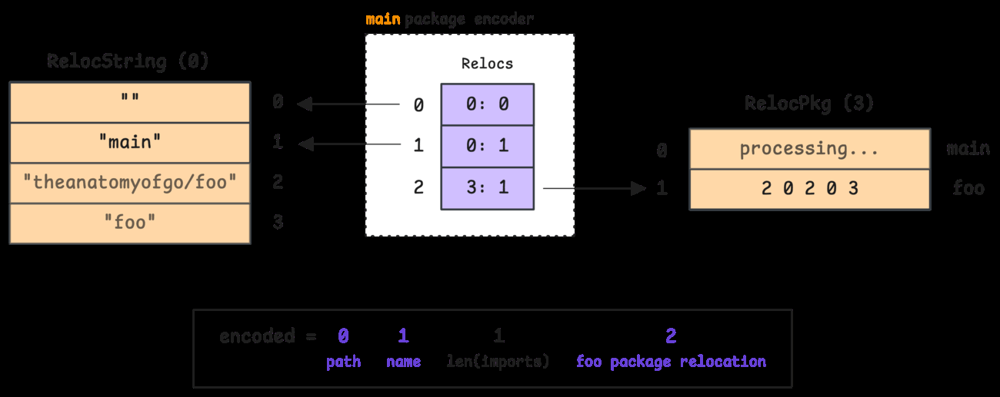

Final encoded object data:

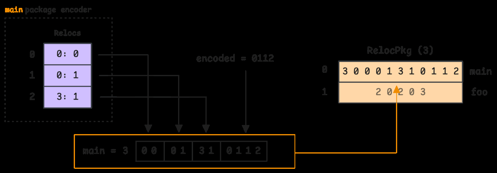

Constant object relocation:

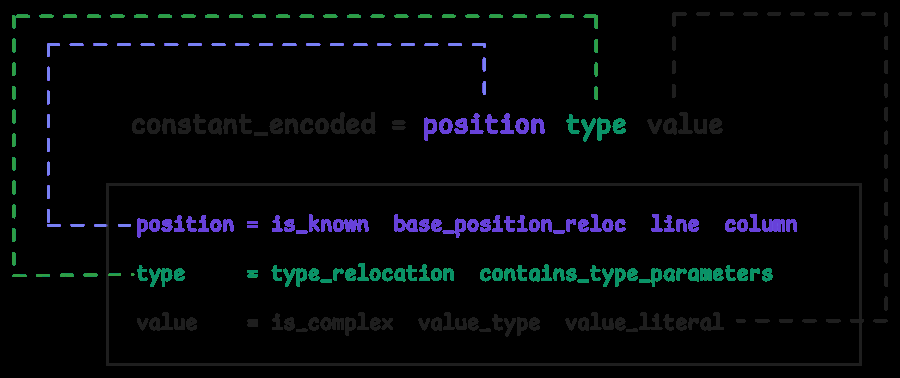

Position, type va value relocation orqali encoded bo'ladi:

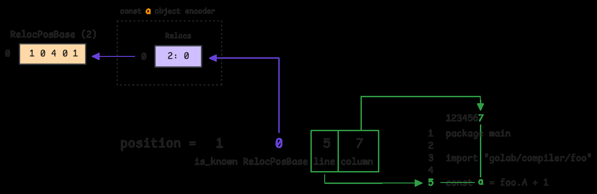

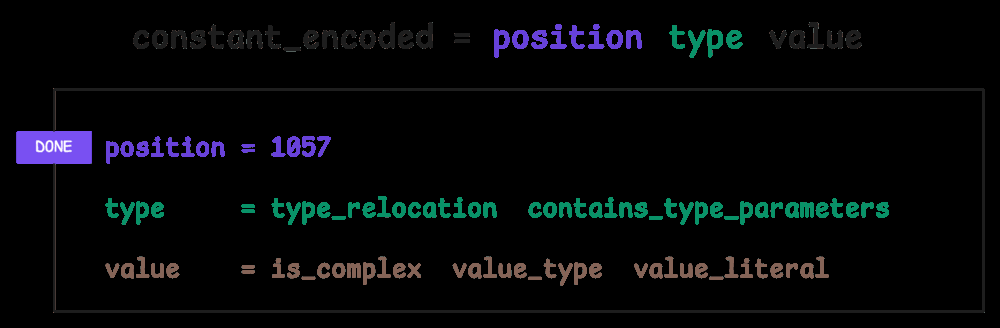

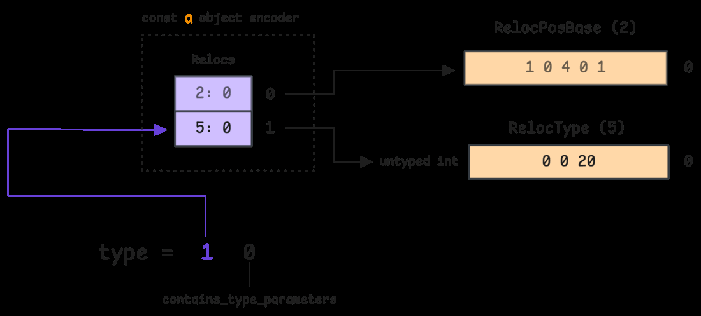

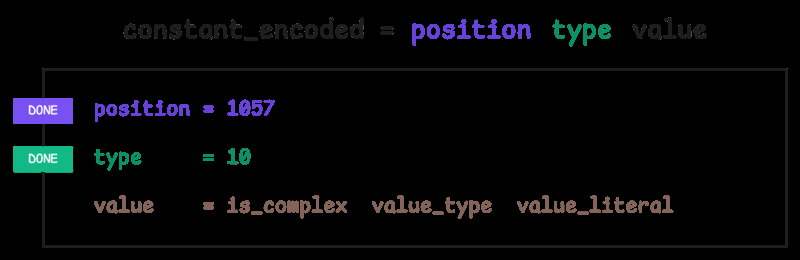

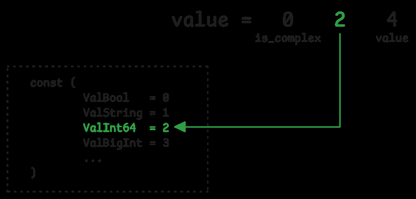

Name relocation:

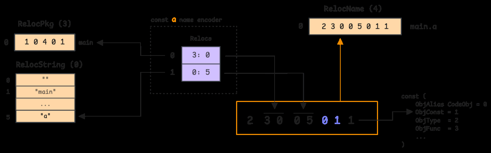

Barcha relocation types:

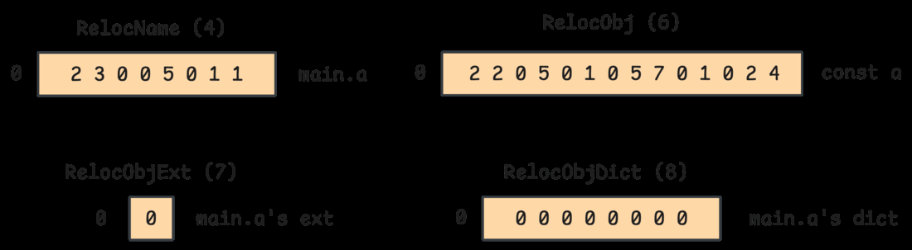

## IR example: scoped if va range

Compiler high-level construct'ni IR componentlarga ajratadi. Scoped if error check:

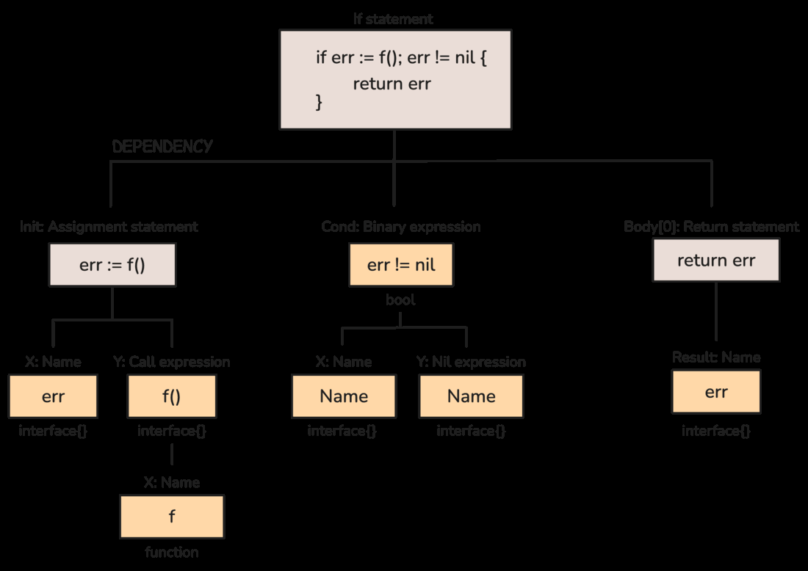

Range loop:

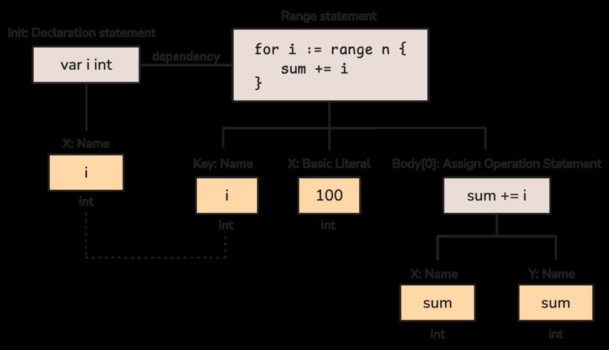

IR construction tugagach optimization bosqichi boshlanadi:

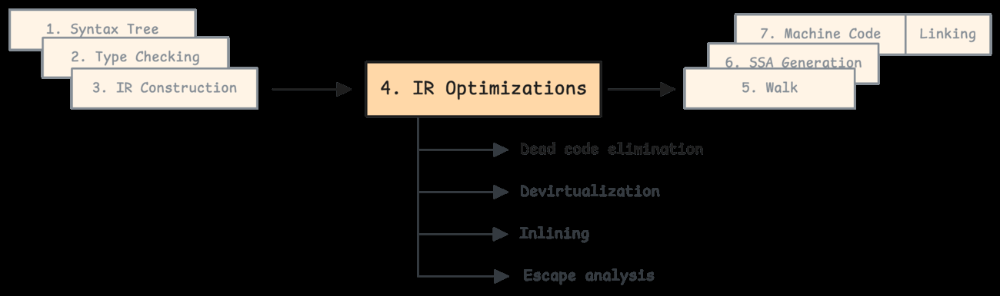

## Eslab qol

- IR syntax tree'dan keyingi compiler-friendly representation.
- Export data Go separate compilation imkonini beradi.
- Import qiluvchi package dependency source'ini to'liq o'qimay, export data orqali type/signature ma'lumot oladi.
- Relocation export data ichida takrorlanuvchi string/type/position/value reference'larini compact saqlashga yordam beradi.
- IR keyingi optimization va lowering bosqichlari uchun asos.
