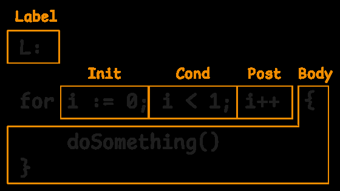
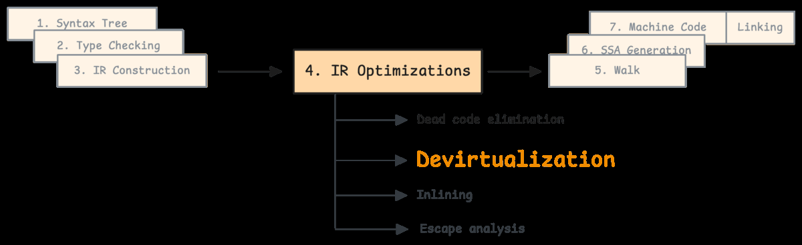
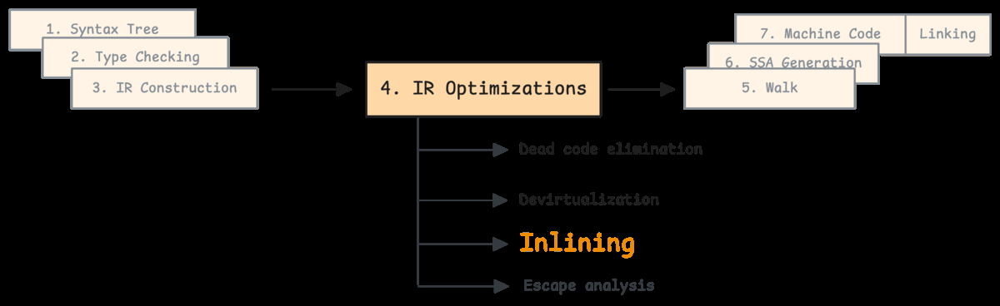
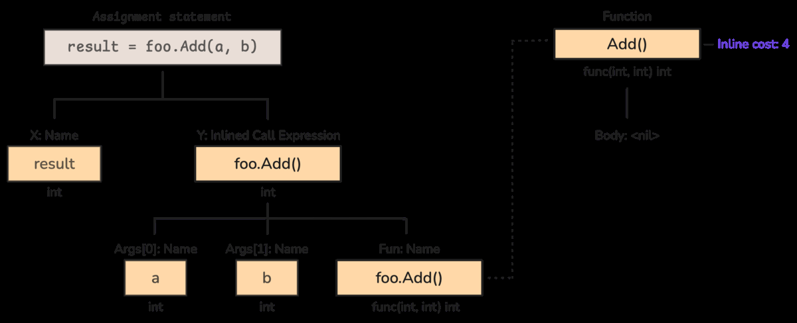
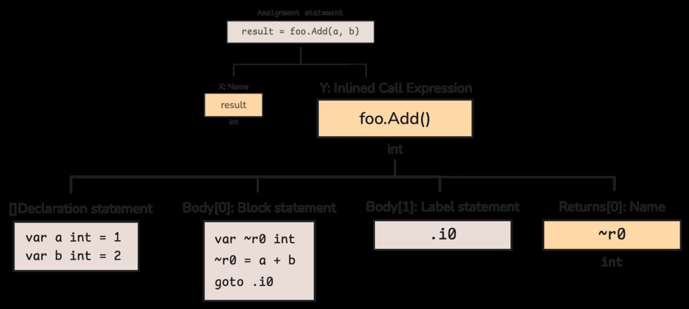
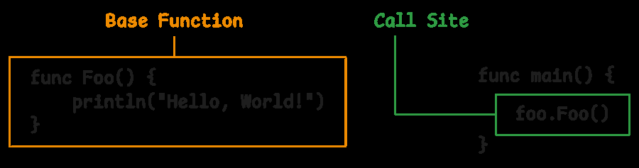
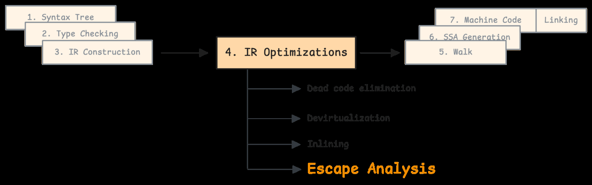

# 5.6 Optimization: dead code, devirtualization, inlining, escape analysis

IR qurilgach compiler optimization bosqichlariga o'tadi. Bu bosqichlar source behavior'ni o'zgartirmasdan, runtime performance yoki binary sifatini yaxshilashga harakat qiladi.

## 5.6.1 Early dead code elimination

Dead code - program result'iga ta'sir qilmaydigan code. Masalan, doim false bo'lgan branch yoki ishlatilmaydigan calculation.

Compiler loop va branchlarni IR darajasida ko'radi:



Dead code elimination:

- unreachable branch'larni olib tashlaydi;
- keraksiz temporary'larni kamaytiradi;
- keyingi optimizationlar uchun IRni soddalashtiradi.

## 5.6.2 Devirtualization

Interface method call odatda dynamic dispatch:

```go
type Greeter interface {
    Greet()
}

func call(g Greeter) {
    g.Greet()
}
```

Agar compiler concrete type'ni compile time'da aniq bilsa, interface call direct call'ga aylanishi mumkin. Bu devirtualization:



Foydasi:

- `itab` lookup/dynamic dispatch kamayadi;
- inlining uchun yangi imkoniyat ochiladi;
- hot path tezlashadi.

## 5.6.3 Inlining

Inlining - function call o'rniga function body'ni call site'ga qo'yish:

```go
func add(a, b int) int {
    return a + b
}

func main() {
    x := add(1, 2)
}
```

Compiler buni roughly shunday ko'rishi mumkin:

```go
x := 1 + 2
```

Inlining pipeline ichida IR optimization bosqichida ishlaydi:



Compiler har function uchun inline cost hisoblaydi. Cost export data orqali boshqa package'lar uchun ham saqlanishi mumkin:



Inlined body original call o'rnini bosadi:



Cost function va call site bo'yicha baholanadi:



Inlining har doim yaxshi emas. Juda ko'p inlining binary size oshiradi, instruction cache pressure ko'paytiradi. Go compiler budget asosida qaror qiladi.

## 5.6.4 Escape analysis

Escape analysis variable stack'da qoladimi yoki heap'ga chiqadimi, shuni hal qiladi. Bu mavzu 7-bobda alohida chuqurroq bor, lekin compiler pipeline'da optimizationlardan keyin muhim o'rin tutadi:



Misol:

```go
func f() *int {
    x := 10
    return &x
}
```

`x` function tugagach ham kerak, shuning uchun heap'ga escape qiladi.

Tekshirish:

```bash
go build -gcflags="-m"
```

Output shunga o'xshash bo'lishi mumkin:

```text
x escapes to heap
```

Inlining escape analysis natijasiga ta'sir qiladi. Function body call site'ga ochilgach, compiler value aslida tashqariga chiqmasligini ko'rishi mumkin.

## Eslab qol

- Optimization IR ustida ishlaydi.
- Dead code elimination keraksiz branch/calculation'ni olib tashlaydi.
- Devirtualization interface call'ni direct call'ga aylantirishi mumkin.
- Inlining call overhead'ni kamaytiradi va boshqa optimizationlarga yo'l ochadi.
- Escape analysis stack vs heap qarorini beradi.
