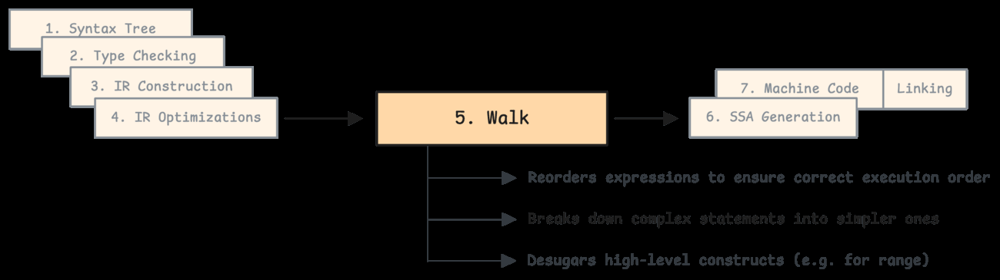
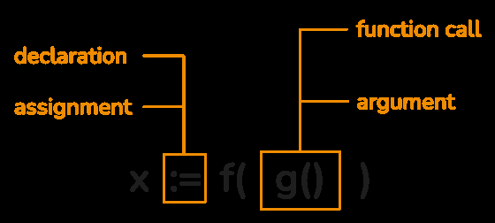
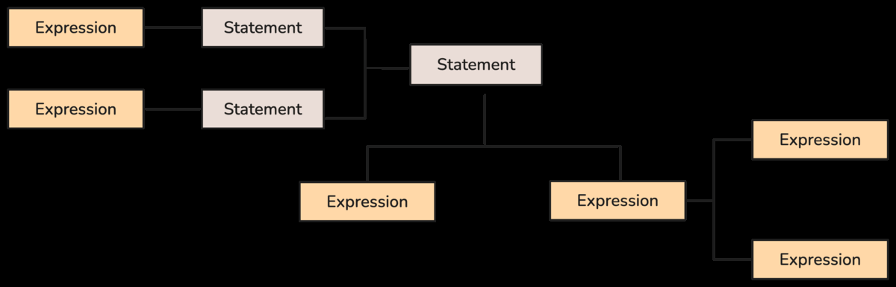
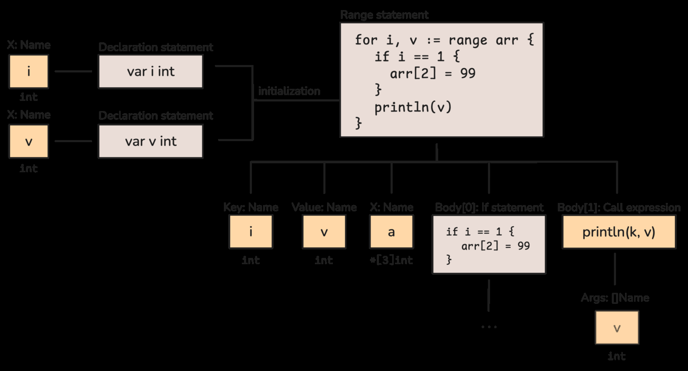
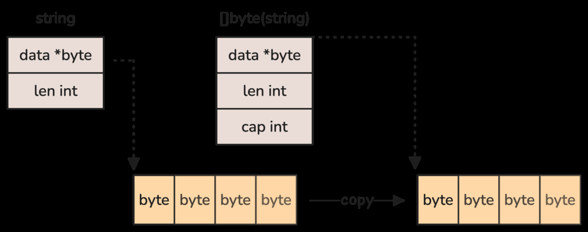
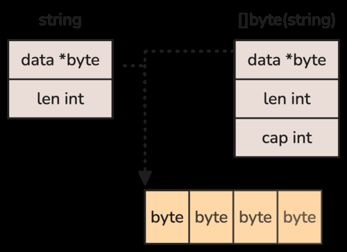

# 5.7 Stage 5: Walk (Middle End)

Walk phase high-level Go construct'larini pastroq, compiler uchun oddiyroq operationlarga tushiradi. Bu bosqichda IR "silliqlanadi": murakkab expression'lar temporary variable'larga ajratiladi, evaluation order aniq qilinadi, runtime call'lar qo'shiladi.



## Order phase

Order phase expression evaluation tartibini explicit qiladi. Go'da evaluation order semantikasi bor; compiler optimization qilganda ham behavior o'zgarmasligi kerak.

Assignment decomposed:



Statement tree expressionlardan tuzilgan:



Misol:

```go
x = f() + g()
```

Compiler temporary'lar bilan tartibni explicit qilishi mumkin:

```go
t1 := f()
t2 := g()
x = t1 + t2
```

## Range lowering

`for range` type'ga qarab turli past-level loop'ga aylanadi:

```go
for i, v := range s {
    use(i, v)
}
```

Slice uchun roughly:

```go
for i := 0; i < len(s); i++ {
    v := s[i]
    use(i, v)
}
```

IR structure:



Map range esa runtime iterator bilan ishlaydi; string range UTF-8 decoding talab qiladi; array range copy semantics bilan bog'liq bo'lishi mumkin.

## String to []byte conversion lowering

Normal conversion copy qiladi:

```go
b := []byte(s)
```

Kitobdagi copy ko'rinishi:



Ba'zi contextlarda compiler zero-copy optimization qila oladi, masalan conversion faqat vaqtinchalik lookup uchun ishlatilsa:



Bu user guarantee emas; compiler optimization detail.

## Runtime calls

Walk phase ayrim operationlarni runtime helper call'lariga tushiradi:

- map access/assign/delete;
- slice append growth;
- string concat;
- interface conversion/assertion;
- panic/bounds check helperlari.

Masalan:

```go
m[k] = v
```

IR darajasida runtime map assignment helper'iga aylanishi mumkin.

## Eslab qol

- Walk phase high-level construct'larni explicit, lower-level IRga aylantiradi.
- Evaluation order temporary'lar bilan saqlanadi.
- `range`, string conversion, map operation va append kabi construct'lar runtime/helper call'lariga tushishi mumkin.
- Walk SSA generation oldidan IRni ancha sodda qiladi.
