# 5.8 Stage 6: Static Single Assignment (SSA) Generation

SSA - Static Single Assignment. Bu formda har bir value faqat bir marta assign qilinadi. Variable o'rniga immutable value'lar oqimi bilan ishlash compiler optimization uchun qulay.

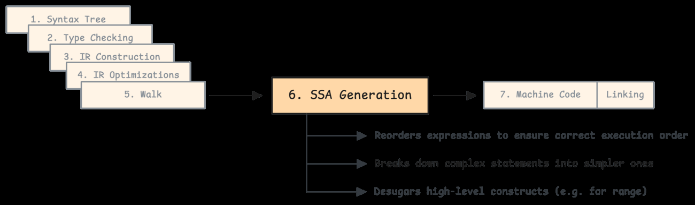

Go-to-SSA breakdown:

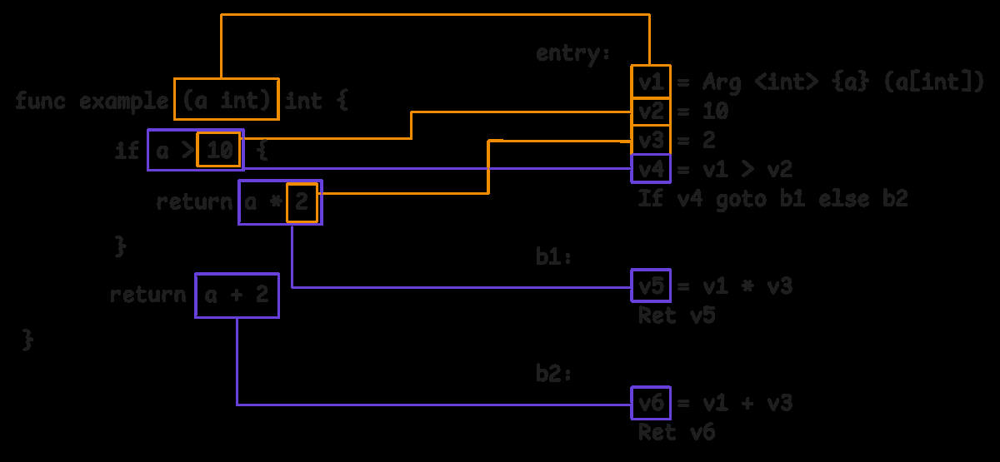

## SSA value va block

SSA instruction odatda shunday tushuniladi:

- operation (`ADD`, `MUL`, `CMP`, `Load`, `Store`);
- type;
- arguments;
- auxiliary info;
- block.

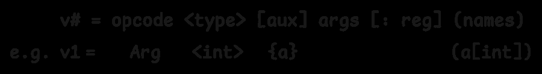

Constant integer SSA value:

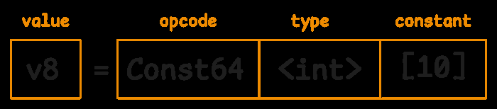

Register-based arithmetic:

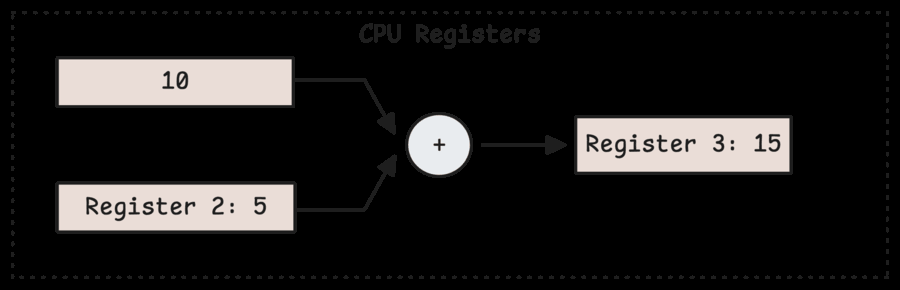

Memory load/store:

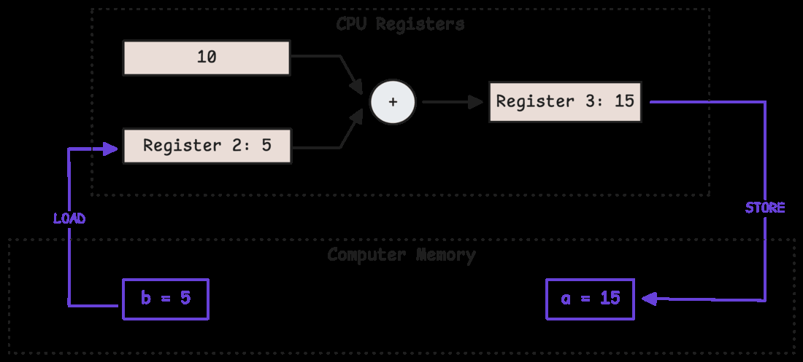

SSA memory token flow:

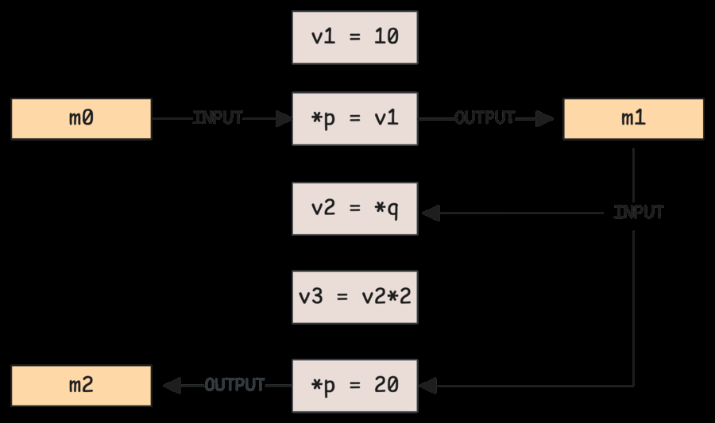

## Branching va Phi

If/else SSA blocklarga bo'linadi:

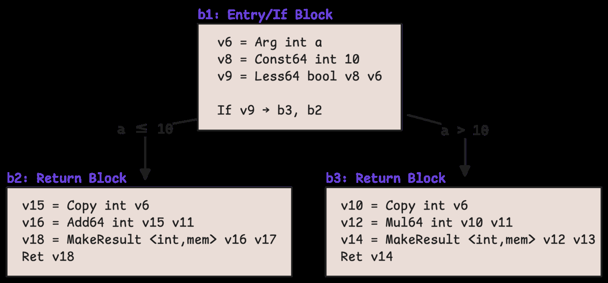

`GOSSAFUNC` bilan SSA HTML visualization olish mumkin:

```bash
GOSSAFUNC=example go build
```

Kitobdagi visualization:

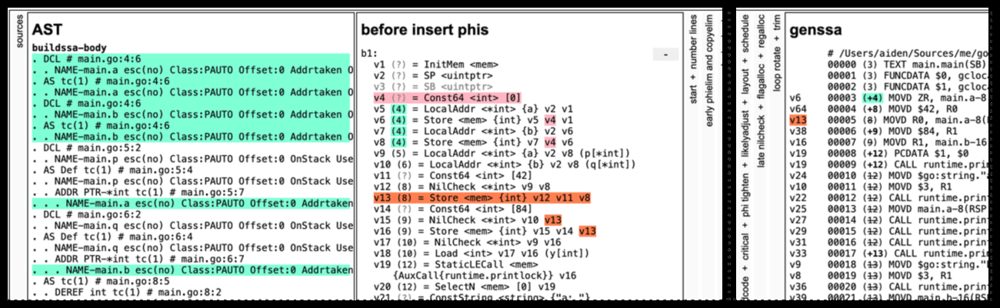

If/else logic SSA structure:

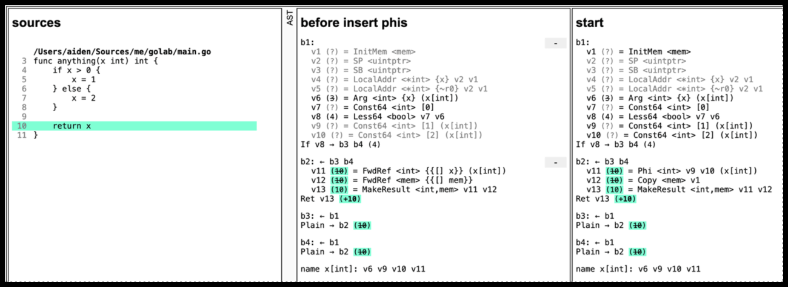

Phi node control-flow birlashgan joyda value tanlaydi:

```go
if cond {
    y = a
} else {
    y = b
}
return y
```

SSA:

```text
y = Phi(a_from_then, b_from_else)
```

## SSA passes

SSA optimization pass pipeline:

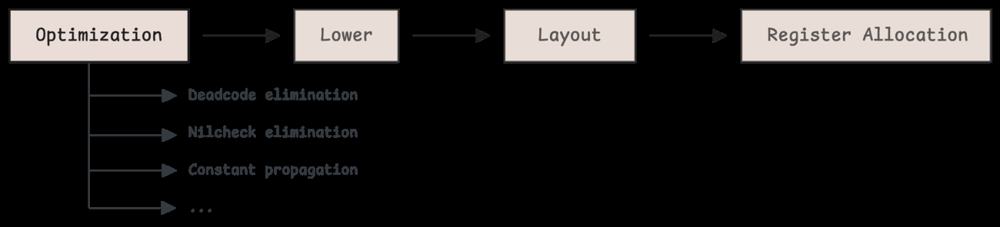

Lowering generic SSA operationlarni target architecture operationlariga moslaydi:

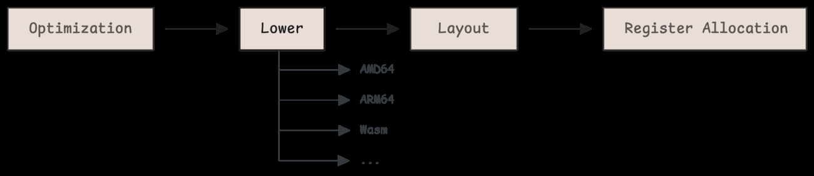

Layout phase block va instruction tartibini joylaydi:

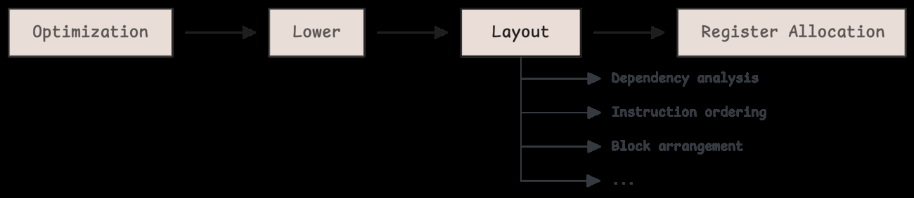

Register allocation SSA value'larni CPU registerlariga map qiladi:

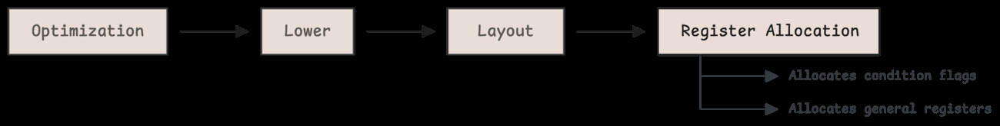

## Rewrite rules

SSA rewrite rules pattern matching bilan operationlarni soddalashtiradi:

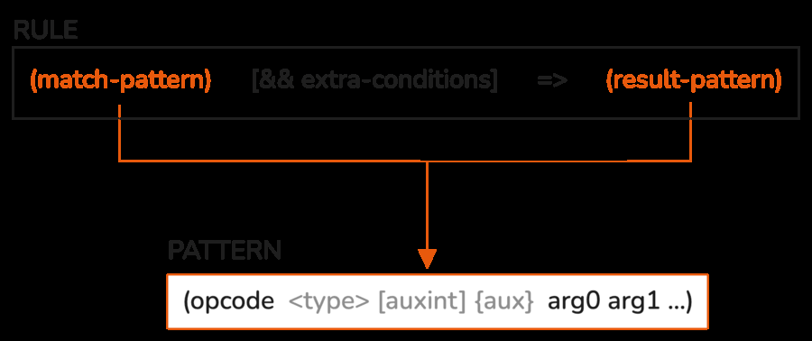

`x * 1` -> `x`:

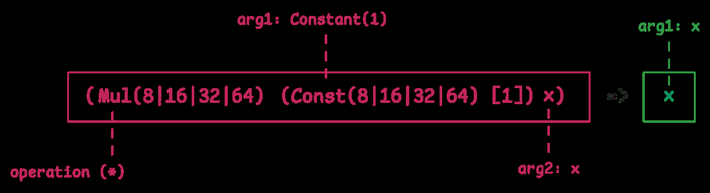

`x * -1` -> `NEG x`:

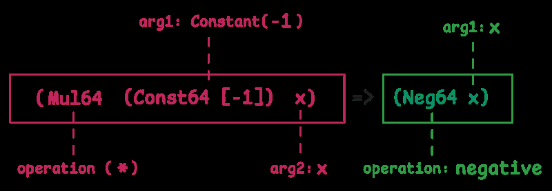

Power-of-two multiplication:

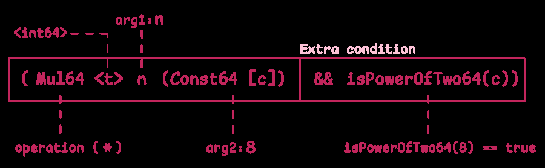

Shift bilan almashtirish:

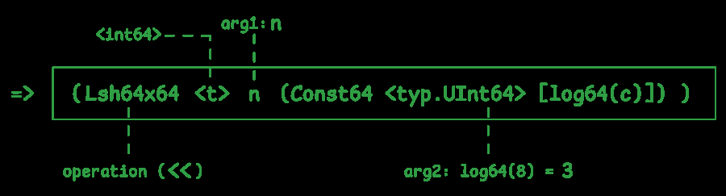

Architecture lowering:


ARM64 constant add decision:

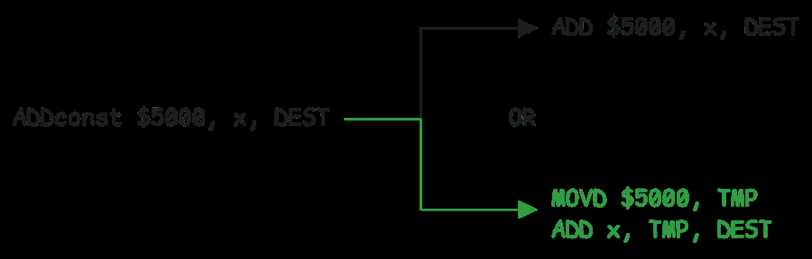

## Conditional example va register allocation

Conditional panic/function example SSA:

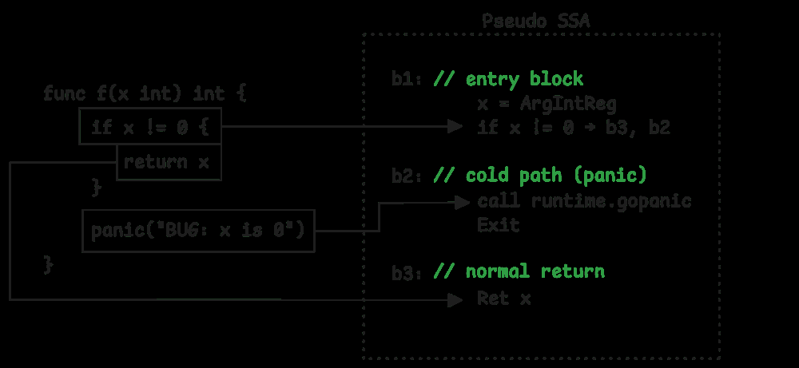

Conditional variable assignment:

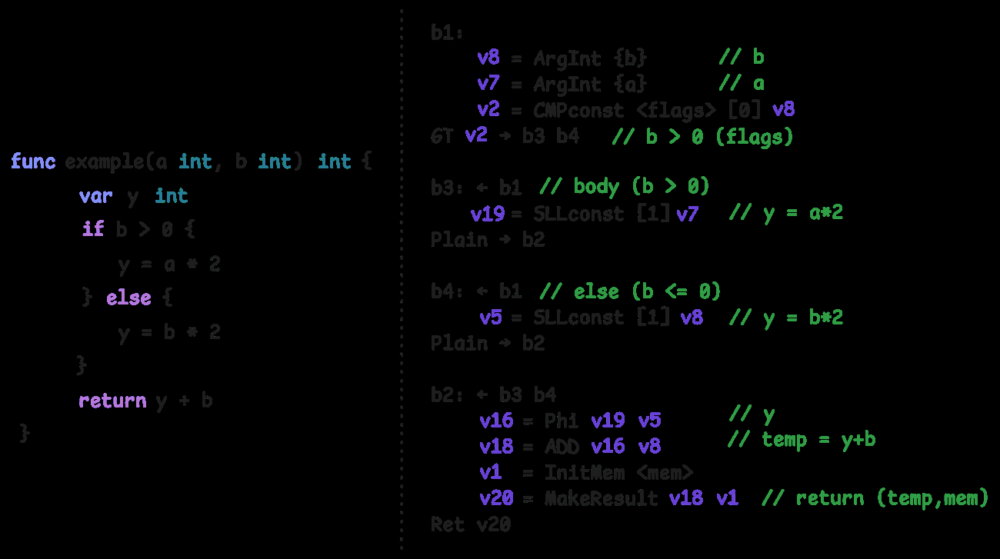

Liveness analysis:

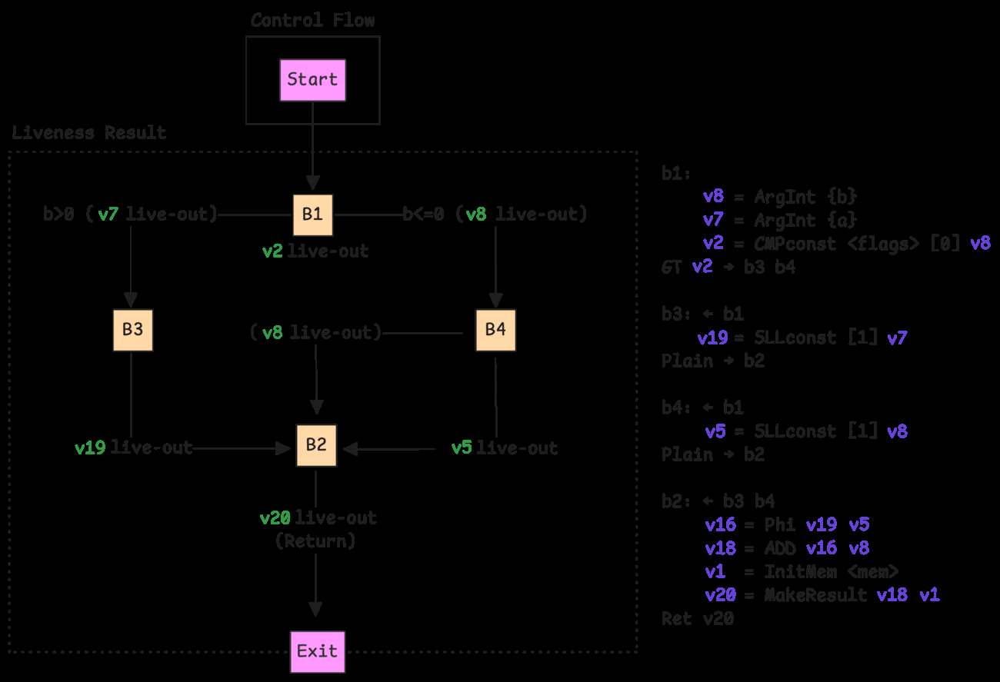

Entry block:

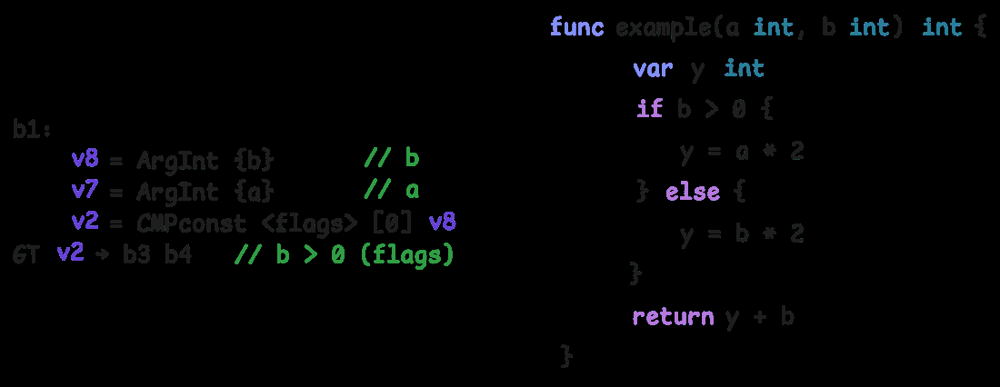

ABI register mapping:

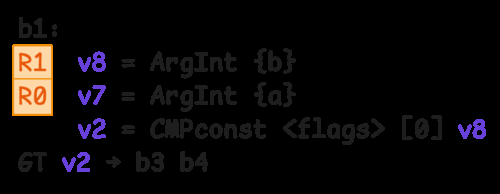

Register state flow:

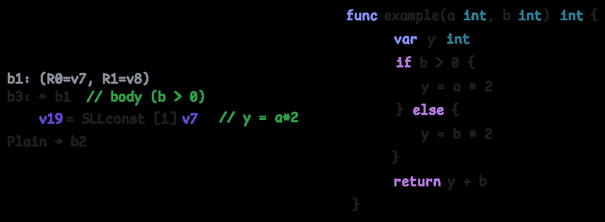

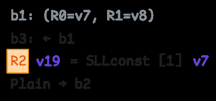

Block b4:

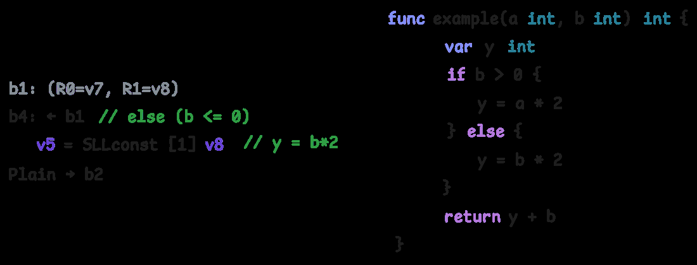

Phi:

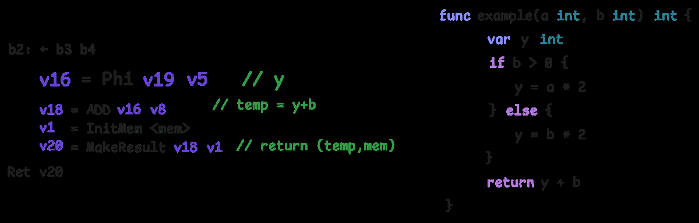

Allocator Phi uchun bir xil register tanlashga harakat qiladi:

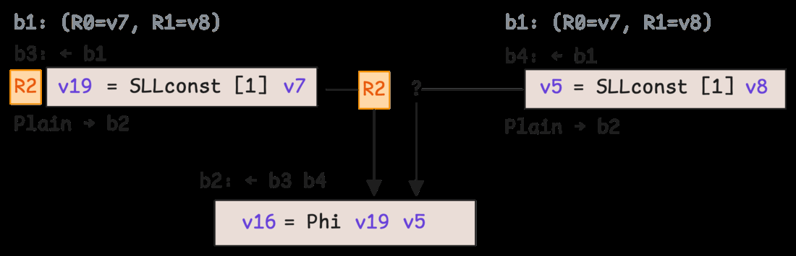

Final register states:

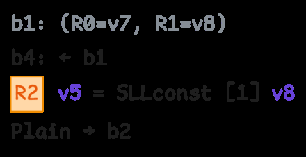

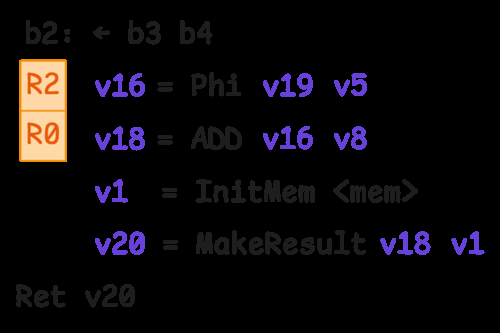

## Eslab qol

- SSA formda har value bir marta yaratiladi.
- Blocks control-flow'ni, values data-flow'ni ko'rsatadi.
- Phi node branchlardan kelgan value'ni birlashtiradi.
- Rewrite passes algebraic simplification va target-specific lowering qiladi.
- Register allocation SSA value'larni real CPU registerlariga joylaydi.
