# 5.9 Stage 7: Machine Code Generation

SSA lowering va register allocationdan keyin compiler machine code generation bosqichiga o'tadi.

Final stage:

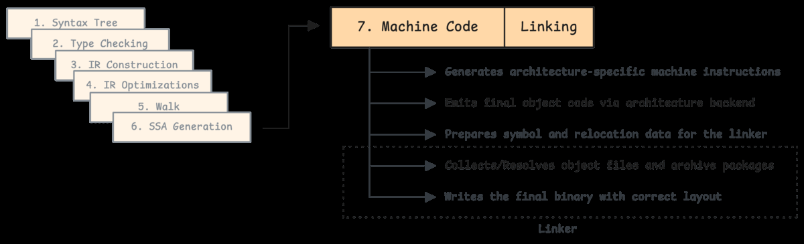

Architecture-specific dispatch:

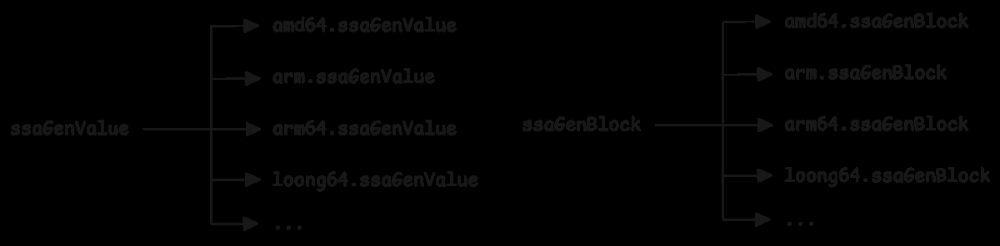

SSA operationlar target architecture instruction'lariga aylanadi:


Branch inversion fallthrough uchun ishlatilishi mumkin:

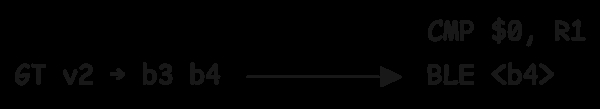

Shift-left instruction selection:

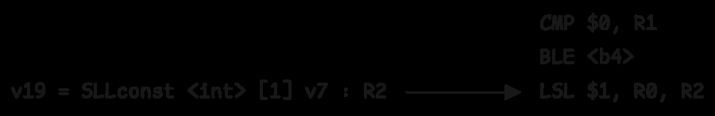

SSA jump placeholder:

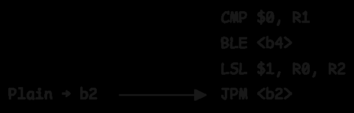

ARM64 lowering:

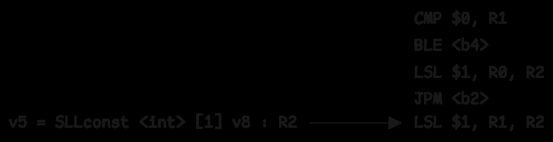

ADD:

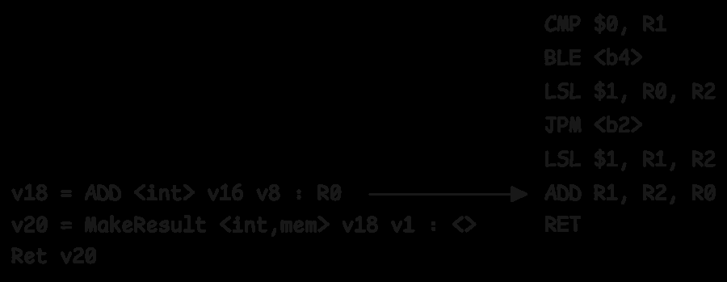

Branch target placeholder:

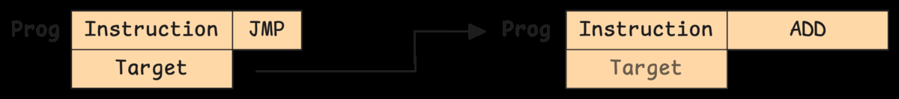

## `obj.Prog` dan machine code'ga

Go compiler avval `obj.Prog` list yaratadi. Bu hali raw machine code emas, balki assembler uchun instruction representation:

```asm
00000 TEXT main.example(SB), ABIInternal
...
00006 CMP $0, R1
00007 BLE 10
00008 LSL $1, R0, R2
00009 JMP 11
00010 LSL $1, R1, R2
00011 ADD R1, R2, R0
00012 RET
00013 END
```

Keyin `Flush` listni architecture-specific backend'ga beradi:

```go
func (pp *Progs) Flush() {
    plist := &obj.Plist{Firstpc: pp.Text, Curfn: pp.CurFunc}
    obj.Flushplist(base.Ctxt, plist, pp.NewProg)
}
```

Backend ARM64, AMD64 kabi target'ga mos binary encoding yaratadi.

## Object file va relocation

Assembler final address'larni bilmaydi. Function yoki global variable reference qilinsa, assembler "bu joyda symbol Y address'i kerak" degan relocation entry qoldiradi.

Object file tarkibi:

- `.text` - executable instruction'lar;
- `.data` - initialized global data;
- `.bss` - uninitialized global data;
- `.rodata` - read-only constants/string literal;
- symbol table;
- relocation table;
- optional DWARF debug info.

SSA'dan object file'ga:

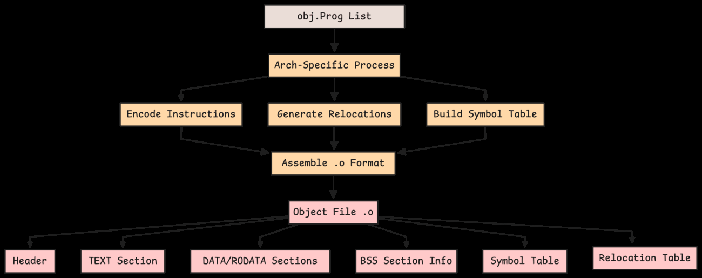

## Export data va archive

Compiler object code bilan birga export data ham hosil qiladi:

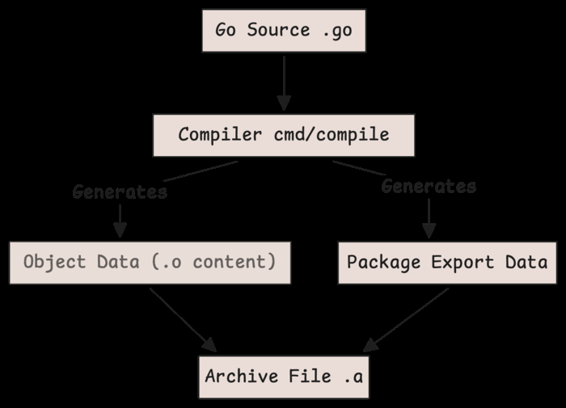

Archive file code va export data'ni birlashtiradi:

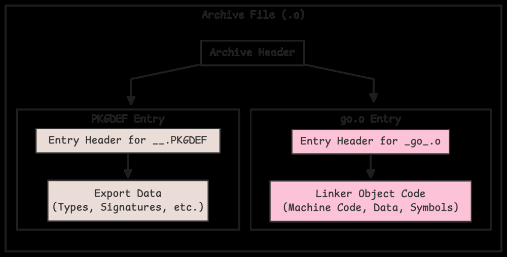

Build cache'da buni ko'rish mumkin:

```bash
ar -tv /path/to/go-build/...-d

rw-r--r-- 0/0   37542 Jan 1 08:00 1970 __.PKGDEF
rw-r--r-- 0/0 1137368 Jan 1 08:00 1970 _go_.o
```

`__.PKGDEF` - export data, `_go_.o` - object code.

## Linking

Linker barcha package archive'lari va object file'larni o'qib final executable yaratadi:

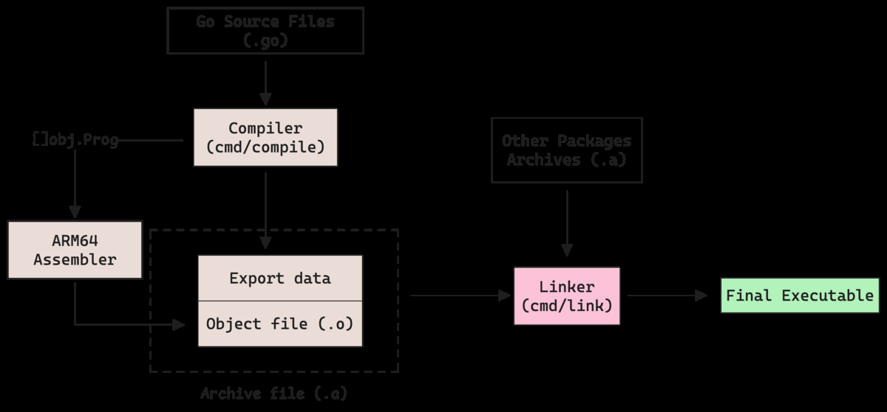

Linker operation:

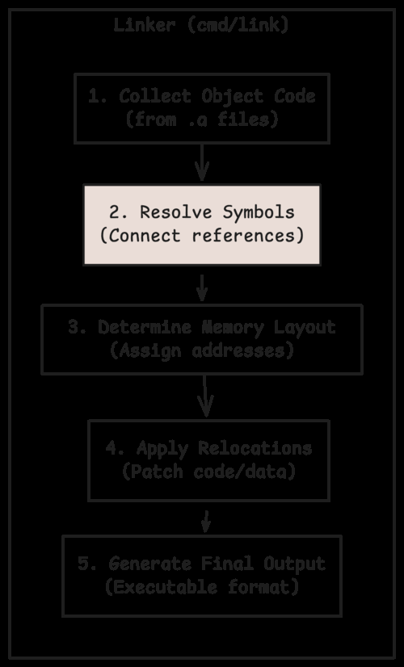

Linker vazifalari:

1. Object code'ni yig'ish.
2. Symbol table'larni birlashtirish.
3. Undefined symbol bor-yo'qligini tekshirish.
4. Final memory layout belgilash.
5. Relocation entry'larni final address bilan patch qilish.
6. Executable formatga mos output yozish.

Relocation jarayoni:

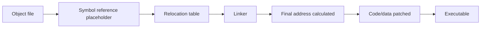

## Eslab qol

- SSA machine-independent formdan architecture-specific instructionlarga tushiriladi.
- `obj.Prog` raw bytes emas, assembler-level representation.
- Assembler object file va relocation entry'lar yaratadi.
- Export data package importlari uchun kerak.
- Linker symbol'larni resolve qiladi, memory layout belgilaydi va relocation'larni patch qiladi.
