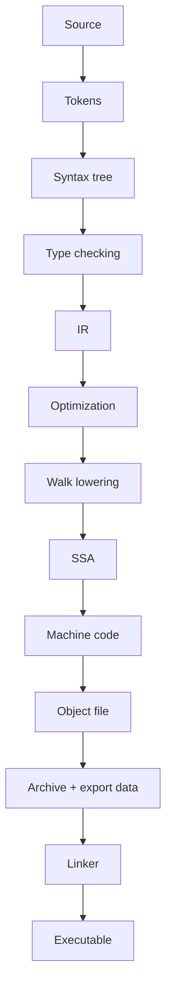

# 8. Xulosa

5-bob Go source code final executable binary'ga qanday aylanishini ko'rsatdi.

Go build system `go build -n` orqali ko'rinadigan ko'p bosqichli jarayonni bajaradi: package'lar compile qilinadi, `.a` archive'lar yaratiladi, `importcfg` dependency mapping beradi, build ID esa cache reuse'ni boshqaradi.

Compiler avval source code'ni tokenlarga ajratadi va syntax tree quradi. Type checking bosqichida scope, declarations, type compatibility, constants va package initialization order tekshiriladi.

Keyin compiler typed syntax'dan IR quradi. Export data Go separate compilation uchun muhim: package'lar bir-birining source code'ini to'liq o'qimasdan, exported type/signature/constant ma'lumotlarini ishlata oladi.

Optimization bosqichida dead code elimination, devirtualization, inlining va escape analysis kabi transformatsiyalar ishlaydi. Bu call overhead, unnecessary branch, heap allocation va dynamic dispatch'ni kamaytirishi mumkin.

Walk phase high-level Go construct'larini pastroq IRga tushiradi: `range`, map operation, string conversion, append va boshqa construct'lar explicit temporary, loop yoki runtime helper call'lariga aylanadi.

SSA backend data-flow va control-flow'ni aniqroq ko'rsatadi. SSA values, blocks, Phi nodes va rewrite passes compiler optimizationlarini kuchli qiladi. Lowering va register allocation target architecture'ga yaqinlashadi.

Oxirida machine code generation `obj.Prog` listlaridan architecture-specific object code yaratadi. Object file relocation table bilan birga chiqadi. Linker barcha object/archive'larni birlashtirib, symbol'larni resolve qiladi, final memory layout yaratadi va relocation'larni patch qilib executable binary hosil qiladi.

Amaliy xulosa: Go source soddaligi ortida qatlamli compiler pipeline turadi. Shu pipeline Go'ning tez compile bo'lishi, separate compilation, runtime safety va native performance xususiyatlarini birga ushlab turadi.
