# 1. Tayyorgarlik: MPG modeli, SP, PC va ArgP

> Ushbu material — Anatomy of Go kitobining 6-bobi mavzulari asosida o'zbek tilida tayyorlangan o'quv qo'llanma. Bu yerda mavzular o'z so'zlarim bilan tushuntirilgan, asl matnning so'zma-so'z tarjimasi emas.

## Nima uchun bu mavzu muhim?

Go tilida funksiya (function), defer, panic, profiling — bularning hammasi past darajada (low level) bir necha asosiy tushunchaga tayanadi: **MPG modeli**, **stek freym (stack frame)** va uning ichidagi uchta ko'rsatkich (pointer): SP, PC va ArgP. Agar siz bu tushunchalarni bilmasangiz, keyingi boblar ("nega defer sekinlashadi?", "nega panic'dan keyin recover ishlaydi?") sehrgarlikka o'xshab ko'rinadi.

Bu bo'lim — sayohatga chiqishdan oldin xaritani o'qishga o'xshaydi. Avval umumiy manzarani ko'ramiz, keyin keyingi boblarda chuqurroq kiramiz.

Ishonchim komilki, agar siz quyidagi savollarga javob bera olsangiz, butun bobni tushunish ancha oson bo'ladi:

- Goroutine — Go ichida yashayotgan "yengil ip (lightweight thread)" — qanday qilib OT ipi (OS thread) ustida ishlaydi?
- Funksiya chaqirilganda xotirada nima sodir bo'ladi?
- Argumentlar qanday qilib chaqirilgan (callee) funksiyaga yetib boradi?

## MPG modeli: Go'ning konkurensiya yuragi

Go'ning eng katta sirlaridan biri — **MPG modeli**. Bu uchta harf uchta narsani anglatadi:

| Harf | To'liq nomi | O'zbekcha | Vazifasi |
|------|-------------|-----------|----------|
| **M** | Machine | Mashina (OT ipi) | Operatsion tizim ipi (OS thread) — haqiqiy CPU ustida ishlovchi ish |
| **P** | Processor | Protsessor (mantiqiy) | Go runtime'ning "ruxsatnomasi" — ip Go kodini ishlatishi uchun zarur |
| **G** | Goroutine | Goroutin | Yengil "ish" — sizning `go func() { ... }` chaqirig'ingiz |

Bu yerda eng chalkashtiruvchi narsa — **P "Processor" deyilsa-da, u haqiqiy protsessor yadrosi (CPU core) emas**. P — Go runtime tomonidan boshqariladigan abstrakt tushuncha. Uning vazifasi — ipga (M) Go kodini ishlatish uchun zarur kontekstni berish.

### Restoran analogiyasi

Tasavvur qiling, restoran bor:

- **M (mashina)** — bu **ofitsiant** (jismonan harakat qiladi).
- **P (protsessor)** — bu **stol-buyurtma daftari**. Daftar bo'lmasa, ofitsiant buyurtma ololmaydi.
- **G (goroutine)** — bu **mehmonning buyurtmasi** ("Bir piyola choy keltiring").

Restoranda ofitsiantlar (M) ko'p bo'lishi mumkin, lekin daftarlar (P) cheklangan. Ofitsiant daftar olmasa, buyurtma qabul qila olmaydi — kutib turadi. Agar bitta ofitsiant uzoq vazifa bilan band bo'lsa (masalan, telefon orqali muzlatkichga buyurtma berishga ketsa — bu **system call**'ga o'xshaydi), u o'z daftarini boshqa ofitsiantga beradi va o'zi keyin qaytib keladi.

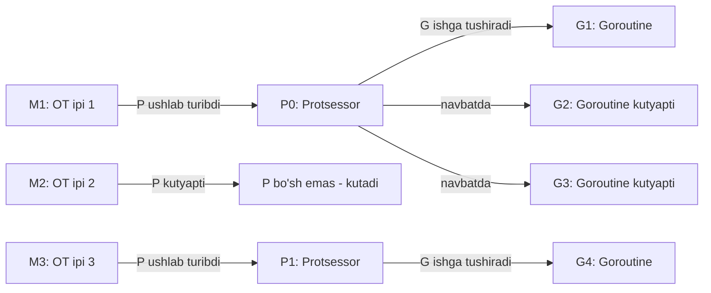

### MPG ning muhim xususiyatlari

1. **M va G soni o'zgarib turadi** — dastur ishlayotganda yangi goroutine'lar paydo bo'ladi, eskilari tugaydi. Ip soni ham o'zgarib turadi (Go runtime kerak bo'lsa qo'shadi).

2. **P soni qotirilgan** — `runtime.GOMAXPROCS(n)` orqali sozlanadi. Odatda CPU yadrolari soniga teng bo'ladi.

3. **M ga P bo'lmasa, u Go kod ishlatolmaydi** — kutib turadi.

4. **System call paytida** ip o'z P'sini "qo'yib yuboradi", boshqa ip uni olib boshqa goroutine'lar bilan ishlay oladi.

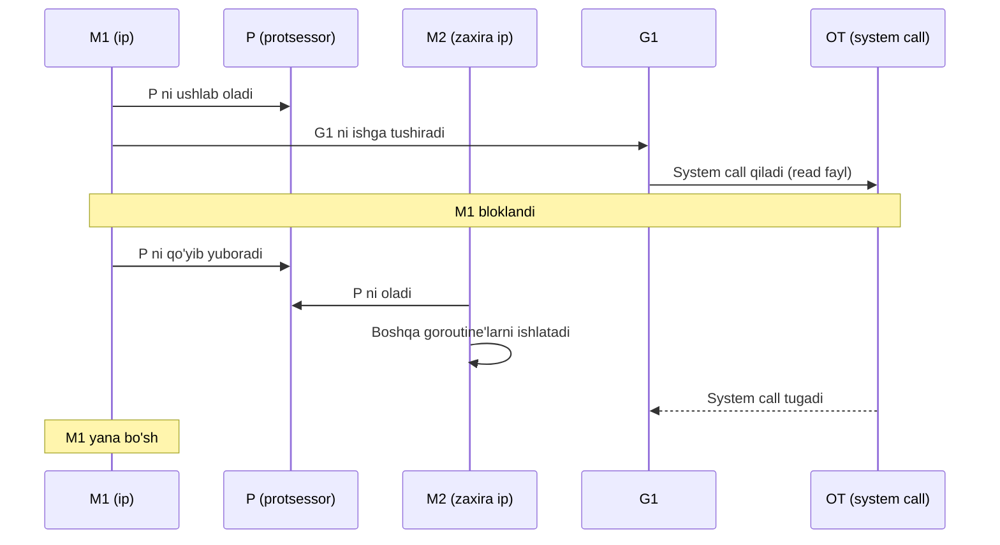

### Kichik kod misoli

```go
package main

import (
    "fmt"
    "runtime"
)

func main() {
    // Hozirda nechta protsessor (P) bor?
    fmt.Println("GOMAXPROCS:", runtime.GOMAXPROCS(0))

    // Hozirda nechta goroutine ishlayapti?
    fmt.Println("Goroutine soni:", runtime.NumGoroutine())

    // Bir nechta goroutine ishga tushiramiz
    for i := 0; i < 5; i++ {
        go func(id int) {
            fmt.Println("Salom, men goroutine", id)
        }(i)
    }

    fmt.Println("Yangi goroutine soni:", runtime.NumGoroutine())
}
```

> **Eslatma:** MPG modeli haqida 8-bobda chuqurroq gaplashamiz. Hozir umumiy tasavvur etadi.

## Stek freym (Stack Frame): funksiya uyi

Funksiya chaqirilganda, unga xotiradan **kichik bir maydon** ajratiladi. Bu maydon — **stek freym (stack frame)**. Funksiyaning o'z mahalliy o'zgaruvchilari, argumentlari, va boshqa zarur ma'lumotlari shu yerda yashaydi.

### Stek qaysi tomonga o'sadi?

Bu nuqta yangi boshlovchilarni ko'p chalkashtiradi:

> **Stek "pastga" o'sadi** — ya'ni yuqori xotira manzilidan past xotira manziliga tomon kengayadi.

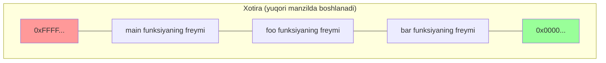

Yangi funksiya chaqirilganda, **stek pointer (SP)** yana past manzilga harakat qiladi va shu yerda yangi freym joylashadi.

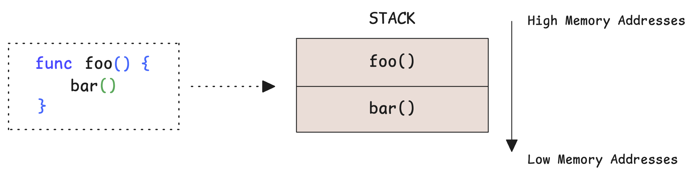

### Stek freym ichida nima bor?

Har bir freym quyidagilarni saqlaydi:

1. **Qaytish manzili (return address)** — funksiya tugagach, qaytib qaerga borishini ko'rsatadi
2. **Argumentlar** — chaqiruvchi (caller) tomonidan berilgan ma'lumotlar
3. **Mahalliy o'zgaruvchilar (local variables)** — funksiya ichidagi `x := 5` kabi narsalar
4. **Saqlangan registrlar** — kerak bo'lsa

Funksiya tugaganda, freym xotiradan o'chiriladi: SP avvalgi joyga qaytariladi, qaytish manziliga sakraladi.

## Stek pointer (SP) — stek tepasini ko'rsatuvchi belgi

**Stek pointer (SP)** — bu maxsus registr. U doim **stek tepasini** ko'rsatadi.

> "Tepa" deganda — eng past xotira manzilini tushunamiz, chunki stek pastga o'sadi.

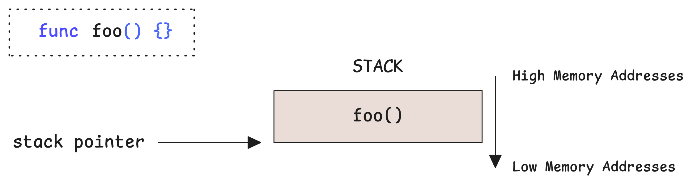

Funksiya chaqirilganda SP pastga siljiydi (yangi freym uchun joy ochish), funksiya tugaganda SP yana yuqoriga qaytadi.

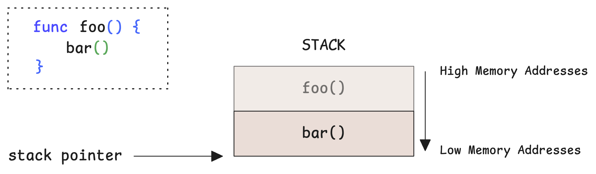

### Misol bilan

Tasavvur qiling:

```go
func main() {
    a := 10
    foo()
}

func foo() {
    b := 20
    bar()
}

func bar() {
    c := 30
}
```

`bar()` ichida bo'lganimizda, stek shunday ko'rinishga ega:

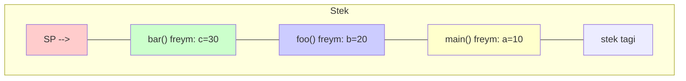

`bar()` qaytsa, SP yana yuqoriga (foo freymiga) qaytadi.

## Argument pointer (ArgP) — argumentlarning manzili

**Argument pointer (argp)** — chaqirilgan funksiya o'z argumentlarini qaerdan topishi kerakligini ko'rsatuvchi maxsus pointer.

Go'da argumentlar ikki yo'l bilan beriladi:

1. **Registrlar orqali** — bu juda tez (CPU ichidagi maxsus xotira). Ammo registrlar soni cheklangan (odatda 9 ta integer).
2. **Stek orqali** — agar argumentlar ko'p bo'lsa yoki katta o'lchamda bo'lsa, ortiqchasi stekka tushiriladi.

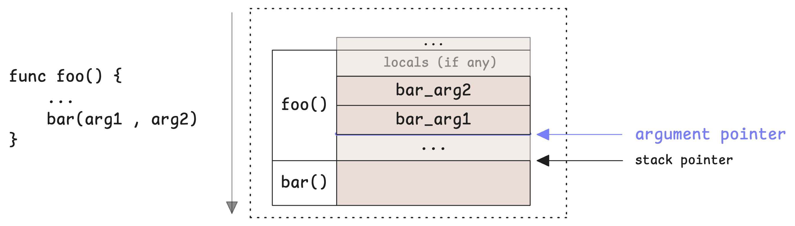

### Sodda misol

```go
func add(a, b int) int {
    return a + b
}

func main() {
    result := add(1, 2)
    println(result)
}
```

Bu yerda `1` va `2` registrlarga (R0, R1 yoki AX, BX) joylashadi. Lekin agar bizda 20 ta argument bo'lsa:

```go
func bigFunc(a, b, c, d, e, f, g, h, i, j int) int {
    // 10 ta argument: ba'zilari registrda, ba'zilari stekda
    return a + b + c + d + e + f + g + h + i + j
}
```

Bu holda ba'zi argumentlar stekda saqlanadi va `argp` ularning boshini ko'rsatadi.

> **Muhim:** `argp` — bu Go runtime/kompilyator (compiler) ichidagi tushuncha. Hardware'ning standart qismi emas. Arxitektura (AMD64, ARM64) bo'yicha biroz farq qiladi.

## Program counter (PC) — keyingi buyruq manzili

**Program counter (PC)** — CPU ichidagi maxsus registr. U **keyingi bajariladigan buyruq (instruction)** manzilini saqlaydi.

CPU har bir tsiklda:
1. PC ko'rsatgan manzildan buyruqni o'qiydi
2. Buyruqni dekodlaydi
3. Bajaradi
4. PC ni keyingi buyruqqa o'tkazadi

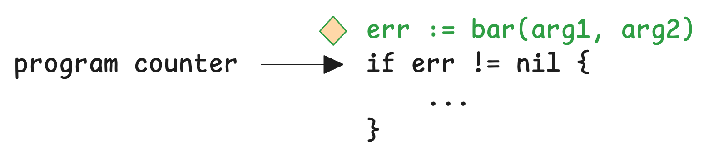

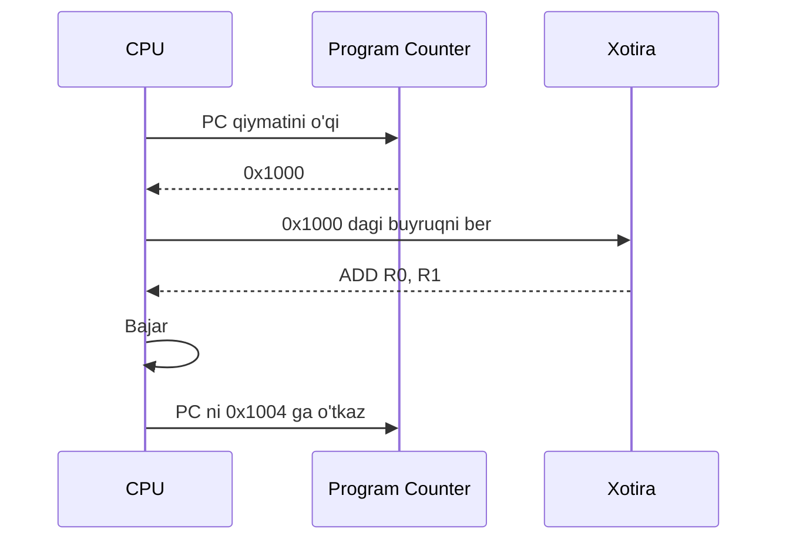

### PC va funksiya chaqiriqlari

Funksiya boshqa funksiyani chaqirganda, PC **qaytish manzilini (return address)** saqlab oladi — bu chaqiruvchidagi keyingi buyruqning manzili. Chaqirilgan funksiya tugagach, qaytish manziliga sakraydi.

Bu ikki arxitekturada ikki xil:

| Arxitektura | Qaytish manzili qaerda saqlanadi? |
|-------------|------------------------------------|
| **AMD64** (Intel/AMD) | `CALL` buyrug'i avtomatik stekka qo'yadi |
| **ARM64** | `BL` (Branch with Link) buyrug'i `R30` (link registri) ga saqlaydi |

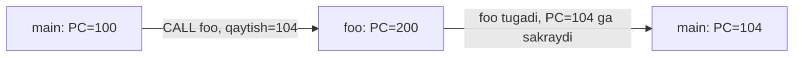

## Hammasini bog'laymiz

Endi tushundikki:

- **MPG** — Go qanday parallellik (concurrency) qiladi
- **Stack frame** — har bir funksiyaning o'z xotira maydoni
- **SP, PC, ArgP** — bu freym ichida nima qaerdaligini bilish uchun pointer'lar

Bu tushunchalar nega muhim? Chunki:

- **Defer** — stack frame'lar bilan chambarchas bog'liq (qachon, qayerda ishga tushishi)
- **Panic & recover** — stek "yechilishi" (unwinding) jarayoni — ya'ni pastga qaytish
- **Profiling** — PC va stack trace orqali ishlaydi
- **Tracing** — goroutine, P, M holatlarini kuzatadi

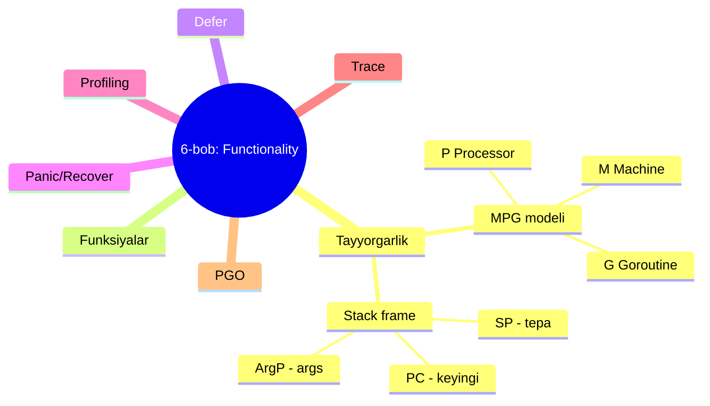

## Eslab qol

- **MPG**: M (ip) — P (mantiqiy protsessor) — G (goroutine). Ip Go kodini ishlatishi uchun P kerak.
- **Stack pastga o'sadi**: yuqori manzildan past manzilga.
- **SP** doim stek tepasini (eng past manzil) ko'rsatadi.
- **PC** keyingi buyruq manzilini saqlaydi. Funksiya chaqirilganda PC qaytish manzilini eslab qoladi.
- **ArgP** chaqirilgan funksiyaga argumentlar qaerdan boshlanishini aytadi.
- AMD64 da qaytish manzili **stekka**, ARM64 da esa **link registriga (R30)** saqlanadi.

## Tez-tez uchraydigan xatolar

- **"Goroutine = OT ipi"** — yo'q. Goroutine yengil va Go runtime tomonidan boshqariladi. Bir M ustida minglab G ishlashi mumkin.
- **"P soni = CPU yadrolari"** — odatda shunday, lekin majburiy emas. Siz `GOMAXPROCS` bilan boshqalar berishingiz mumkin.
- **"Stek yuqoriga o'sadi"** — yo'q. Past manzilga o'sadi.

## Amaliyot

1. Quyidagi koddagi `runtime.GOMAXPROCS(1)` ni `runtime.GOMAXPROCS(4)` ga o'zgartirib, ish vaqtini taqqoslang:

```go
package main

import (
    "fmt"
    "runtime"
    "sync"
    "time"
)

func main() {
    runtime.GOMAXPROCS(1) // Faqat 1 ta P
    var wg sync.WaitGroup

    start := time.Now()
    for i := 0; i < 10; i++ {
        wg.Add(1)
        go func(id int) {
            defer wg.Done()
            // Og'ir hisob-kitob simulatsiyasi
            sum := 0
            for j := 0; j < 100_000_000; j++ {
                sum += j
            }
            fmt.Printf("Goroutine %d tugadi, sum=%d\n", id, sum)
        }(i)
    }
    wg.Wait()
    fmt.Println("Vaqt:", time.Since(start))
}
```

2. `runtime.NumGoroutine()` va `runtime.NumCPU()` farqini tushuntiring.

3. Quyidagi savollarga javob bering:
   - Nega bir nechta M bo'lib turib, faqat 1 ta P bo'lsa, Go kodi ketma-ket ishlaydi?
   - System call paytida M nima qiladi?

---

**Keyingi mavzu:** [02_functions.md](02_functions.md) — Funksiyalar: birinchi-darajali fuqaro, closure, variadic, init.
