# 2. Funksiyalar: asosiydan ilg'orgacha

> Ushbu material — Anatomy of Go kitobining 6-bobi mavzulari asosida o'zbek tilida tayyorlangan o'quv qo'llanma. Bu yerda mavzular o'z so'zlarim bilan tushuntirilgan, asl matnning so'zma-so'z tarjimasi emas.

## Nima uchun bu mavzu muhim?

Funksiya (function) — har qanday dastur tilidagi eng asosiy qurilish bloki. Lekin Go'da funksiya nafaqat "kod bo'lagi", balki **birinchi darajali fuqaro (first-class citizen)** — ya'ni o'zgaruvchiga (variable) tayinlash, argument sifatida uzatish, qaytarish, hatto ma'lumot strukturasida saqlash mumkin.

Bu bo'limda biz quyidagi savollarga javob beramiz:

- Closure (yopiq funksiya) qanday ishlaydi va u qaerda yashaydi?
- `variadic` argumentlar qanday qilib slice'ga aylanadi?
- `init()` qachon va qaysi tartibda ishlatiladi?
- Go kompilyatori funksiya qiymatini (function value) qanday tashkil qiladi (`funcval` strukturasi)?

Bu bilim sizga kelajakda **defer**, **panic**, **goroutine** kabi tushunchalarni ancha aniq tushunishga yordam beradi.

## Funksiyaning asosiy ko'rinishi

Go'da funksiya `func` kalit so'zi bilan boshlanadi:

```go
// Oddiy funksiya
func qoshish(a int, b int) int {
    return a + b
}

func main() {
    natija := qoshish(3, 5)
    println(natija) // 8
}
```

### Bir nechta qiymat qaytarish

Bu Go'ning kuchli xususiyatlaridan biri:

```go
// Bo'linma va qoldiqni qaytaradi
func bolib(a, b int) (int, int) {
    qism := a / b
    qoldiq := a % b
    return qism, qoldiq
}

func main() {
    q, r := bolib(17, 5)
    fmt.Println("Bo'linma:", q, "Qoldiq:", r) // 3, 2
}
```

### Nomli qaytariluvchi qiymatlar (Named return values)

Qaytariluvchi qiymatlarga nom berish mumkin. Shunda Go avtomatik ravishda o'sha nomli o'zgaruvchilarni yaratadi va ularni nol qiymati bilan to'ldiradi:

```go
// Aylana yuzasi va perimetri
func aylanaHisobla(r float64) (yuza, perimetr float64) {
    yuza = 3.14159 * r * r
    perimetr = 2 * 3.14159 * r
    return // bare return — yuza va perimetr avtomatik qaytadi
}
```

Bu kod aniqroq bo'ladi: funksiyaning imzosi (signature) qaytadigan qiymatlar ma'nosini ko'rsatadi.

### Argumentlarni e'tiborga olmaslik

Agar siz qaytadigan qiymatlardan birini ishlatmasangiz, `_` (blank identifier) ishlatishingiz mumkin:

```go
yuza, _ := aylanaHisobla(5)
fmt.Println("Faqat yuza:", yuza)
```

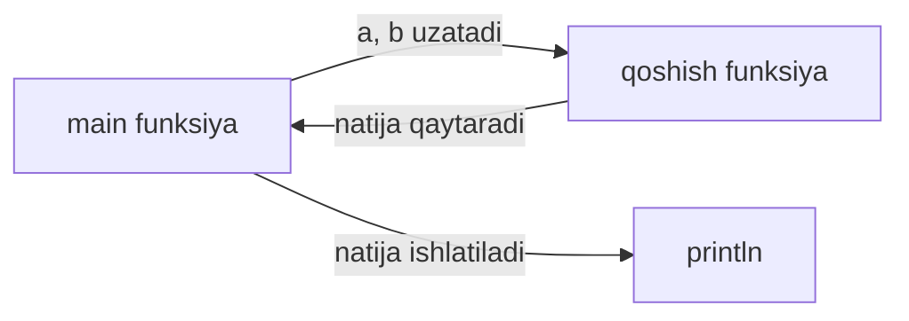

## Funksiyalar — birinchi darajali fuqarolar (First-Class Citizens)

Bu nima degani? Boshqa tillarda taqqoslab ko'ramiz:

| Til | Funksiyani o'zgaruvchiga tayinlash mumkinmi? |
|-----|---------------------------------------------|
| **JavaScript** | Ha — `const f = function() {}` |
| **Python** | Ha — `f = lambda x: x*2` |
| **Java (eski)** | Yo'q | (lekin Java 8 dan keyin "lambda" kiritildi) |
| **Go** | **Ha** — `f := add` |

Go'da funksiyaga oddiy ma'lumot turi (data type) deb qarash mumkin. Buni isbotlash uchun qarang:

```go
package main

import "fmt"

func qoshish(a, b int) int { return a + b }
func ayirish(a, b int) int { return a - b }

func main() {
    // Funksiyani o'zgaruvchiga tayinlaymiz
    var amal func(int, int) int

    amal = qoshish
    fmt.Println(amal(10, 3)) // 13

    amal = ayirish
    fmt.Println(amal(10, 3)) // 7
}
```

Bu yerda `amal` o'zgaruvchisi avval `qoshish`, keyin `ayirish` funksiyasini saqlaydi. Bu — funksiya qiymat (function value) deb ataladi.

### Funksiya imzosi (Signature)

Ikki funksiya bir xil "imzo"ga ega bo'lsa, ularni almashtirib ishlatish mumkin:

```go
func a(x, y int) int { return x + y }
func b(p, q int) int { return p - q }
// Ikkalasining imzosi bir xil: func(int, int) int
// Parametr nomlari muhim emas
```

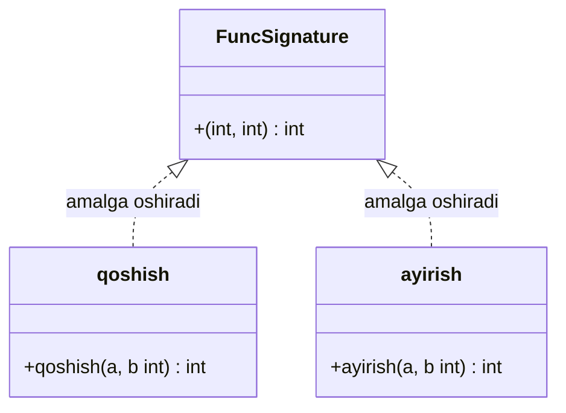

### Pass-by-value: Go'da hamma narsa nusxa orqali uzatiladi

Bu juda muhim! Go'da funksiyaga argument berilganda, **uning nusxasi yaratiladi**. Hatto slice, map, channel kabi "ma'lumotnoma turlari" (reference types) uchun ham — lekin bu yerda nusxa **deskriptor (descriptor)** dir, asl ma'lumotning o'zi emas.

```go
func slicegaTega(s []int) {
    s = []int{99, 99, 99}  // Yangi slice — faqat ichkarida
}

func main() {
    s := []int{1, 2, 3}
    slicegaTega(s)
    fmt.Println(s) // [1 2 3] — o'zgarmadi!
}
```

Sababi: `s` deskriptori (pointer + len + cap) nusxalanadi. Funksiya ichida `s` ga yangi slice tayinlash faqat **mahalliy nusxani** o'zgartiradi.

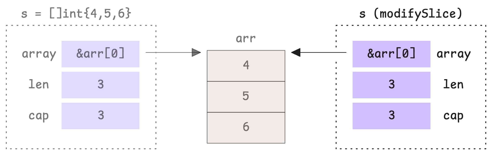

Lekin agar **ichidagi elementni** o'zgartirsak — natija ko'rinadi, chunki ikkala deskriptor bir xil massivga (underlying array) ishora qiladi:

```go
func birinchini100Qil(s []int) {
    s[0] = 100
}

func main() {
    s := []int{1, 2, 3}
    birinchini100Qil(s)
    fmt.Println(s) // [100 2 3] — o'zgardi!
}
```

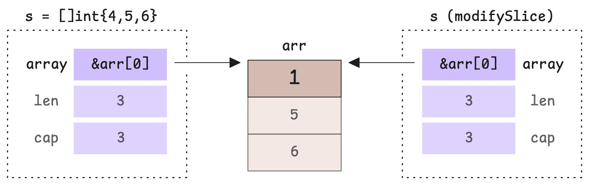

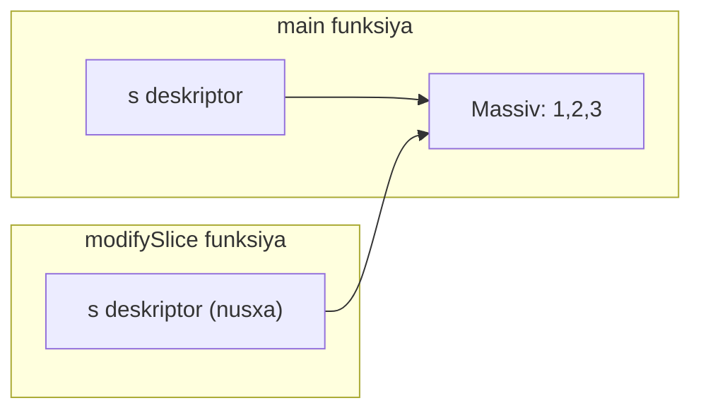

## Closure: yopiq funksiya

**Closure (yopiq funksiya)** — bu o'z atrofidagi o'zgaruvchilarni "ushlab oladigan" anonim funksiya.

### Eng oddiy misol

```go
func main() {
    x := "Salom"

    f := func() {
        fmt.Println(x) // x ni yopib oladi
    }

    f() // Salom
}
```

Bu yerda `f` anonim funksiya `x` o'zgaruvchisini "yopib oladi". `f` istalgan paytda chaqirilsa, `x` ga kirisha oladi.

### Hisoblagich (counter) misoli

Closure'ning eng kuchli xususiyati — **yashash davomiyligi (lifetime)**: ichki funksiya tashqi funksiyaning o'zgaruvchisini ushlab tursa, hatto tashqi funksiya tugagandan keyin ham u o'zgaruvchi yashaydi.

```go
package main

import "fmt"

func Hisoblagich() func() int {
    i := 0
    return func() int {
        i++
        return i
    }
}

func main() {
    sanoq := Hisoblagich()
    fmt.Println(sanoq()) // 1
    fmt.Println(sanoq()) // 2
    fmt.Println(sanoq()) // 3
    
    // Yangi hisoblagich — yangi i bilan
    boshqa := Hisoblagich()
    fmt.Println(boshqa()) // 1
}
```

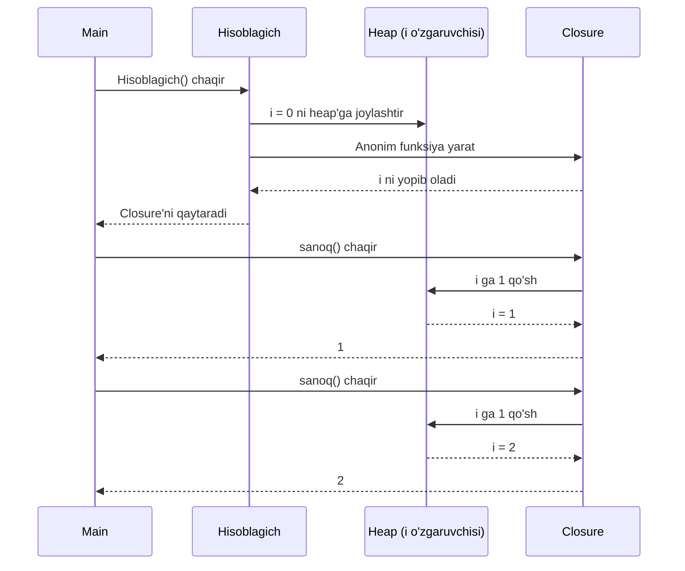

## Function value — funksiyaning xotirada qanday ko'rinadi?

Bu yerdan biz Go runtime'ning ichkarisiga kiramiz. Go kompilyatori har bir funksiya uchun ikkita narsani yaratadi:

1. **Funksiya kodi** (TEXT bo'limida — bajariladigan instruksiyalar)
2. **`funcval` strukturasi** (RODATA bo'limida — funksiyaga pointer)

```go
type funcval struct {
    fn uintptr  // Funksiya kodi manzili
    // Agar closure bo'lsa, ushlab olingan o'zgaruvchilar shu yerga keladi
}
```

Demak, `f := add` deganimizda, `f` aslida `*funcval` (funksiyaga pointer) bo'ladi.

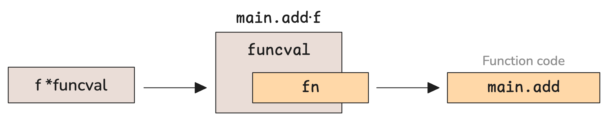

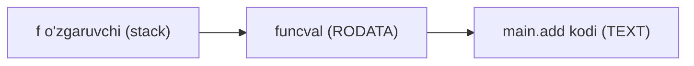

### RODATA va TEXT bo'limlari

Go binarisi (executable) bir nechta bo'limlardan iborat:

| Bo'lim | Mazmuni |
|--------|---------|
| **TEXT** | Bajariladigan kod (instruksiyalar) |
| **RODATA** | O'qish-uchun ma'lumotlar (string konstanta, funcval) |
| **DATA** | Initialize qilingan global o'zgaruvchilar |
| **BSS** | Initialize qilinmagan global o'zgaruvchilar |


### Trivial vs Non-trivial closure

- **Trivial closure** — hech qanday tashqi o'zgaruvchini ushlamaydigan anonim funksiya. Bunday holatda `funcval` RODATA'da yashaydi (bir marta yaratiladi).

- **Non-trivial closure** — tashqi o'zgaruvchilarni ushlaydigan closure. Bunda `funcval` har safar **runtime paytida** yaratiladi va u stack yoki heap'da yashaydi.

```go
// TRIVIAL closure
f1 := func() { fmt.Println("Hello") }

// NON-TRIVIAL closure
x := 10
f2 := func() { fmt.Println(x) } // x ni ushlab oldi
```

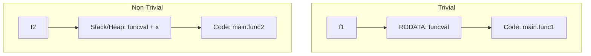

### Closure: qiymat orqali yoki ma'lumotnoma orqali?

Go kompilyatori ba'zi qoidalar asosida o'zgaruvchini **qiymat orqali** (by value) yoki **ma'lumotnoma orqali** (by reference) ushlaydi.

**Qiymat orqali ushlaydi** (by value), agar:
- O'zgaruvchining manzili olinmasa (`&x` ishlatilmasa)
- O'zgaruvchi yaratilgandan keyin o'zgartirilmasa
- O'zgaruvchining hajmi 128 baytdan kichik bo'lsa

Aks holda — **ma'lumotnoma orqali** (closure ichida pointer saqlanadi).

```go
package main

import "fmt"

func main() {
    x := 1
    y := 3

    // y o'zgartirilmaydi — by value
    // x o'zgartiriladi — by reference
    f := func() int {
        return x + y
    }

    x = 100  // x o'zgardi!
    fmt.Println(f()) // 103 (chunki x by reference, y by value)
}
```

Buni tekshirish uchun:

```bash
go build -gcflags="-m=2" .
```

Chiquvchi xabarda ko'rasiz:
```
main capturing by ref: x
main capturing by value: y
```

### Heap allocation — qachon?

Closure ichidagi o'zgaruvchini funksiyadan tashqaridan qaytarsak, kompilyator uni **heap**'ga ko'chiradi (chunki u stek tugagandan keyin ham yashashi kerak):

```go
func adderYarat() func(int) int {
    x := 0  // x heap'ga ko'chadi (escape qiladi)
    return func(y int) int {
        x += y
        return x
    }
}

func main() {
    adder := adderYarat()
    fmt.Println(adder(5))  // 5
    fmt.Println(adder(10)) // 15
    fmt.Println(adder(3))  // 18
}
```

Bu jarayon **escape analysis** deb ataladi — buni 7-bobda ko'ramiz.

## Variadic funksiyalar: o'zgaruvchan argumentlar

`...` belgisi argumentlar sonini cheklamaydigan funksiyalar yaratadi. Ichkarida ular **slice**'ga aylantiriladi.

```go
func yigindi(sonlar ...int) int {
    jami := 0
    for _, s := range sonlar {
        jami += s
    }
    return jami
}

func main() {
    fmt.Println(yigindi())            // 0 (bo'sh slice)
    fmt.Println(yigindi(1))           // 1
    fmt.Println(yigindi(1, 2, 3, 4))  // 10
}
```

### Slice'ni variadic'ga uzatish

Agar sizda slice bo'lsa va uni variadic funksiyaga uzatmoqchi bo'lsangiz, `...` ishlatish kerak:

```go
sonlar := []int{1, 2, 3, 4, 5}
fmt.Println(yigindi(sonlar...))  // ... bilan!
```

> **Diqqat:** `sonlar...` deganimizda, **slice ichidagi elementlar** alohida-alohida uzatilmaydi. Aslida slice **butunligicha** uzatiladi. Shunday qilib, agar funksiya ichida slice'ni o'zgartirsa, asl slice ham o'zgaradi:

```go
func yigindiVaTega(s ...int) int {
    s[0] = 999  // O'zgartirish!
    jami := 0
    for _, v := range s {
        jami += v
    }
    return jami
}

func main() {
    sonlar := []int{1, 2, 3}
    fmt.Println(yigindiVaTega(sonlar...))
    fmt.Println(sonlar)  // [999 2 3] — o'zgardi!
}
```

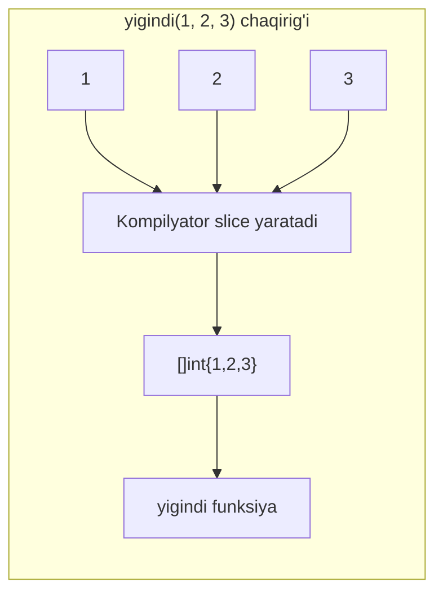

## init() funksiyasi: ishga tushirish marosimi

`init()` — Go'dagi maxsus funksiyalardan biri (ikkinchisi — `main()`). Bu funksiya **package**'ni ishga tushirishdan oldin avtomatik chaqiriladi.

### Qoidalar:

1. **Bir paketda bir nechta `init()` bo'lishi mumkin** — hatto bir faylda ham!
2. **`init()` ga argument bermaslik kerak**, hech narsa qaytarmaydi
3. **Avval package-level o'zgaruvchilar ishga tushiriladi**, keyin `init()`
4. **Bog'liq paketlar avval ishga tushadi**

```go
package main

import "fmt"

var x int = 10  // Eng avval ishga tushadi

func init() {
    fmt.Println("Birinchi init, x =", x)
}

func init() {
    fmt.Println("Ikkinchi init")
}

func main() {
    fmt.Println("Main funksiya")
}

// Output:
// Birinchi init, x = 10
// Ikkinchi init
// Main funksiya
```

### Package-larning ishga tushish tartibi

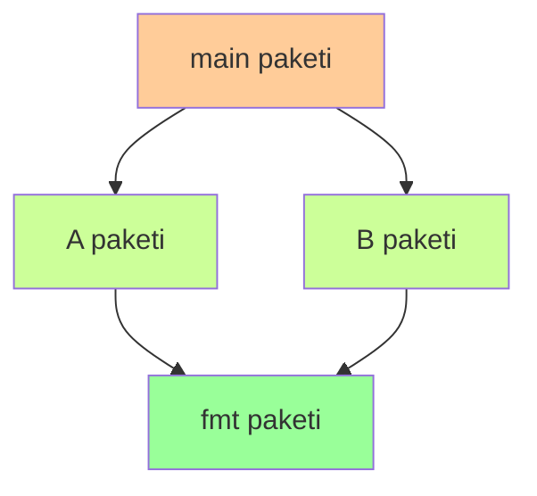

Bu yerda tartib:
1. `fmt` paketning init'i ishlaydi (chunki uni A va B ishlatadi)
2. `A` paketning init'i
3. `B` paketning init'i
4. `main` paketning init'i
5. `main()` funksiyasi

### Qachon ishlatish?

`init()` haqiqatan ham kerak bo'lgan joylar:
- Database driver registratsiya qilish (`database/sql/drivers`)
- Konfiguratsiya o'qish
- Global o'zgaruvchilarni murakkab tartib bilan to'ldirish

Qachon **ishlatmaslik kerak**:
- Yon ta'sirlar (side effects) yaratish
- Foydalanuvchi tushunmas tartib
- Test qilish qiyinligi

## Eslab qol

- Go'da funksiya — **birinchi darajali qiymat** (variable, argument, qaytariluvchi qiymat bo'la oladi).
- Argumentlar **doim nusxa orqali (by value)** uzatiladi. Slice, map, channel — bularning deskriptori nusxalanadi, lekin asl ma'lumot bitta.
- **Closure** atrofdagi o'zgaruvchilarni ushlab oladi. Agar o'zgaruvchi heap'ga tushsa, u closure'dan keyin ham yashaydi.
- **funcval** — har bir funksiya qiymati uchun yaratiladigan struktura. Trivial closure'da RODATA'da, non-trivial'da runtime paytida yaratiladi.
- **Variadic** (`...`) — argumentlarni slice'ga to'playdi. `slice...` esa slice'ni butunligicha uzatadi.
- **`init()`** — paket ishga tushganda chaqiriladi. Bir paketda bir nechta bo'lishi mumkin.

## Tez-tez uchraydigan xatolar

### 1. Loop ichidagi closure va o'zgaruvchini ushlash (Go 1.22 dan oldin)

```go
// Go 1.22 dan oldin — XATO!
funclar := []func(){}
for i := 0; i < 3; i++ {
    funclar = append(funclar, func() {
        fmt.Println(i) // Hammasi 3 chiqaradi!
    })
}
for _, f := range funclar {
    f()
}
```

> **Yangilik:** Go 1.22 dan boshlab, `for` loop'dagi o'zgaruvchi har takrorlanishda yangidan yaratiladi. Endi xato kelmaydi.

### 2. Slice ko'paytirilmasdan o'zgartirilishi

```go
func qoshib(s []int) []int {
    return append(s, 100) // Yangi slice qaytarishi mumkin (capacity yetmasa)
}
```

### 3. Variadic'ga slice uzatishni unutish

```go
fmt.Println([]int{1,2,3})    // [1 2 3] sifatida chiqaradi
fmt.Println([]int{1,2,3}...) // 1 2 3 alohida chiqaradi
```

## Amaliyot

### 1-mashq: Closure bilan istisno hisoblagich

Hisoblagich yarat, lekin u faqat **toq sonlar**ni hisoblasin:

```go
func ToqHisoblagich() func(int) int {
    // O'z kodingizni yozing
}

// Sinov:
hs := ToqHisoblagich()
fmt.Println(hs(1))  // 1 (toq, hisoblanadi)
fmt.Println(hs(2))  // 1 (juft, hisoblanmaydi)
fmt.Println(hs(3))  // 2 (toq)
```

### 2-mashq: Variadic — eng katta sonni topish

`max(sonlar ...int) int` funksiyasini yozing. Bo'sh holda 0 qaytarsin.

### 3-mashq: Funksiya — argument

`apply` funksiyasini yozing — u funksiyani slice'ga qo'llaydi:

```go
func apply(s []int, f func(int) int) []int {
    // Har bir elementga f ni qo'llab, yangi slice qaytaradi
}

// Sinov:
result := apply([]int{1, 2, 3}, func(x int) int { return x * 2 })
fmt.Println(result) // [2 4 6]
```

### 4-mashq: init() tartibi

3 ta paket yarating: `a`, `b`, `c`. `b` `a`'ga, `c` `b`'ga bog'liq bo'lsin. Har biriga `init()` qo'ying. Tartibni kuzatib, hisobot yozing.

---

**Avvalgi mavzu:** [01_preliminaries.md](01_preliminaries.md) — MPG, SP, PC, ArgP
**Keyingi mavzu:** [03_defer.md](03_defer.md) — Defer: ichki tuzilishi va ishlash mexanizmi
