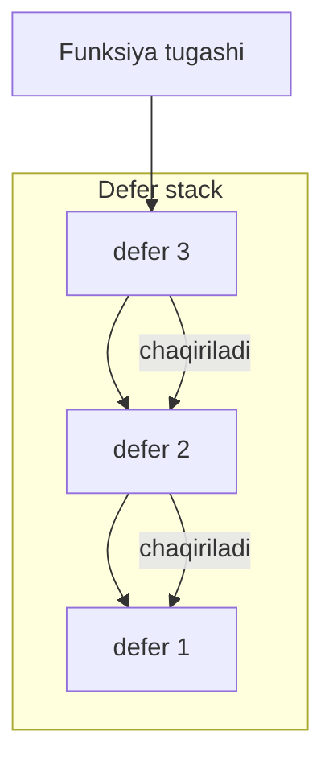
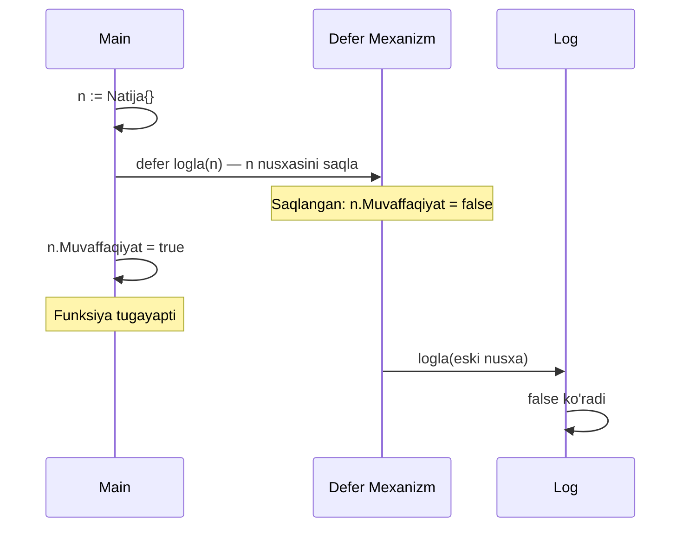
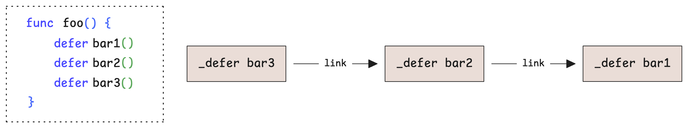
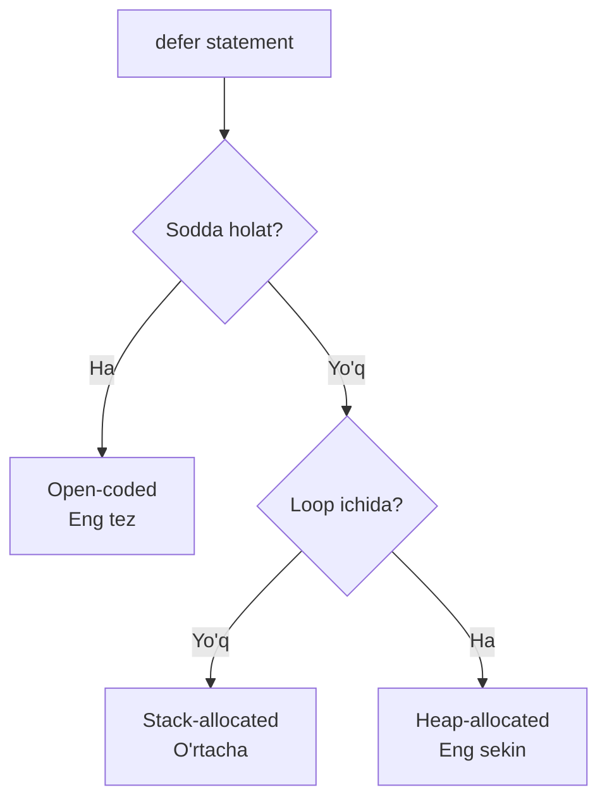
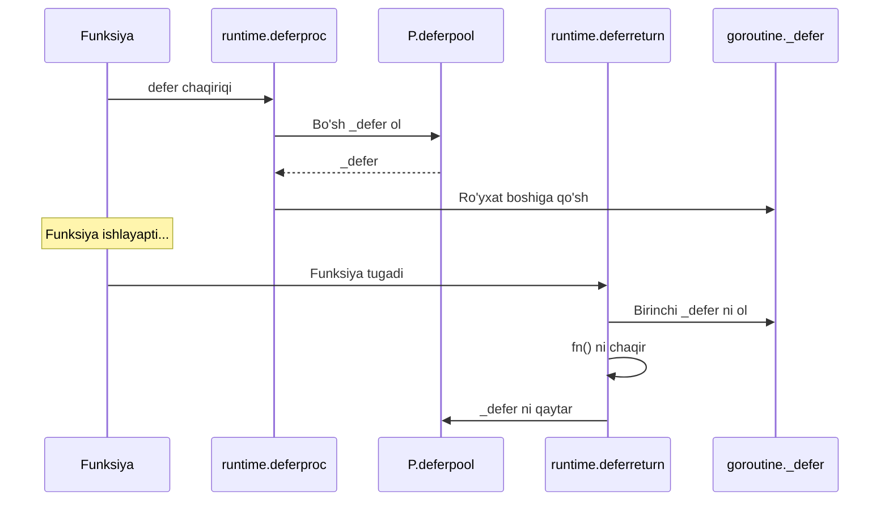
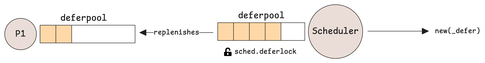
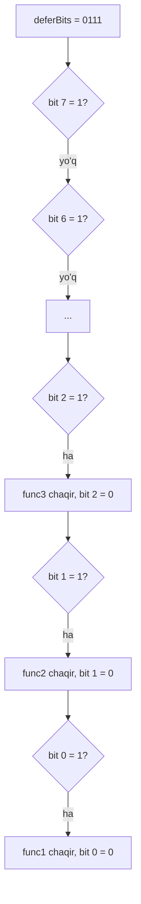

# 3. Defer: shablonlar va ishlash unumdorligi

> Ushbu material — Anatomy of Go kitobining 6-bobi mavzulari asosida o'zbek tilida tayyorlangan o'quv qo'llanma. Bu yerda mavzular o'z so'zlarim bilan tushuntirilgan, asl matnning so'zma-so'z tarjimasi emas.

## Nima uchun bu mavzu muhim?

`defer` — Go'ning eng oson, ammo eng chuqur xususiyatlaridan biri. Sirtdan qaraganda — "funksiya tugagandan keyin biror narsa qil" degan oddiy buyruq. Lekin uning ostida juda murakkab mexanizm yashiringan: 3 xil implementatsiya, runtime ko'magi, panic bilan munosabat...

Bu bo'limda biz quyidagi savollarga javob beramiz:

- `defer` qachon ishlaydi?
- Nega `defer` argumentlari **darhol** hisoblanadi, lekin chaqiriq kechiktiriladi?
- Defer bir necha xil bo'lishi mumkinmi (open-coded, stack, heap)?
- Kichik defer ham milliard marta chaqirilsa nimaga olib keladi?

## Defer qanday ishlaydi?

`defer` — funksiya tugashi oldidan biror chaqiriqni amalga oshirish uchun.

### Eng oddiy misol

```go
package main

import "fmt"

func main() {
    defer fmt.Println("Tugadi")
    fmt.Println("Boshlandi")
}

// Chiqish:
// Boshlandi
// Tugadi
```

### Nega kerak?

`defer`'siz biz "tozalash kodi"ni har bir `return` oldidan takrorlashimiz kerak edi:

**defer'siz:**

```go
func qil(b1, b2 bool) int {
    if b1 {
        tozala()
        return 1
    }
    if b2 {
        tozala()
        return 2
    }
    tozala()
    return 0
}
```

**defer bilan:**

```go
func qil(b1, b2 bool) int {
    defer tozala()  // Faqat bir marta yozamiz!
    
    if b1 {
        return 1
    }
    if b2 {
        return 2
    }
    return 0
}
```

`defer` panicdan keyin ham ishlaydi — bu juda muhim:

```go
func main() {
    defer fmt.Println("Bu ishlaydi, hatto panic bo'lsa ham")
    panic("XATOLIK!")
}
```

### LIFO tartibi (oxirgi kelgan birinchi ketadi)

Bir nechta `defer` bo'lsa, ular **teskari tartibda** ishlaydi:

```go
func main() {
    defer fmt.Println("1")
    defer fmt.Println("2")
    defer fmt.Println("3")
}

// Chiqish:
// 3
// 2
// 1
```

Bu — **stack** mantig'iga o'xshash. Har bir `defer` yangi narsani stekka qo'yadi, va funksiya tugaganda stekdan teskari yo'nalishda olinadi.



## Defer'ning sirli xususiyati: argumentlar darhol hisoblanadi

Bu eng muhim qoida! `defer X(arg)` deganda — `arg` **shu zahoti** hisoblanadi, lekin `X(...)` chaqiriqning o'zi keyin amalga oshadi.

### Kutilmagan misol

```go
type Natija struct {
    Muvaffaqiyat bool
}

func logla(n Natija) {
    if n.Muvaffaqiyat {
        fmt.Println("OK")
    } else {
        fmt.Println("XATO")
    }
}

func main() {
    n := Natija{}
    defer logla(n)  // n shu paytda nusxalandi: Muvaffaqiyat=false

    n.Muvaffaqiyat = true  // n o'zgardi, lekin defer'ga ta'siri yo'q
}

// Chiqish: XATO
```

`defer logla(n)` da `n` qiymati shu paytda nusxalandi! Keyin `n` ni o'zgartirsangiz ham, defer eski nusxani ishlatadi.

### Yechimlar

**Yechim 1: Pointer ishlatish**

```go
func main() {
    n := Natija{}
    defer logla(&n)  // Endi pointer

    n.Muvaffaqiyat = true
}
```

**Yechim 2: Closure ishlatish**

```go
func main() {
    n := Natija{}
    defer func() {
        logla(n)  // Closure n ni har safar yangidan o'qiydi
    }()

    n.Muvaffaqiyat = true
}
```



## Defer va loop: katta xato!

`defer` — **funksiya tugashi**ga bog'langan. Loop ichida ishlatilsa, har takrorlanishda ishga tushmaydi:

```go
func main() {
    for i := 0; i < 3; i++ {
        defer fmt.Println("loop", i)
    }
    fmt.Println("Asosiy kod tugadi")
}

// Chiqish:
// Asosiy kod tugadi
// loop 2
// loop 1
// loop 0
```

### Real hayotdagi muammo: fayllarni yopish

```go
// XATO! Hamma fayllar funksiya oxirigacha ochiq qoladi
func fayllarniIshlatish(fayllar []string) error {
    for _, f := range fayllar {
        file, err := os.Open(f)
        if err != nil {
            return err
        }
        defer file.Close() // Faqat funksiya oxirida — yomon!
        // ... fayl bilan ishlash
    }
    return nil
}
```

Agar `fayllar`'da 10000 ta fayl bo'lsa, hammasi bir vaqtda ochiq turadi!

**Yechim:** Anonim funksiya bilan o'rab olish:

```go
func fayllarniIshlatish(fayllar []string) error {
    for _, f := range fayllar {
        func(fname string) {
            file, err := os.Open(fname)
            if err != nil {
                return
            }
            defer file.Close()  // Anonim funksiya tugasa — yopiladi
            // ... fayl bilan ishlash
        }(f)
    }
    return nil
}
```

## Defer return qiymatini o'zgartira oladi!

Agar funksiyada **nomli qaytariluvchi qiymat (named return value)** bo'lsa, defer uni o'zgartira oladi:

```go
func qiziq() (natija int) {
    defer func() {
        natija = 100  // Qaytariluvchi qiymatni o'zgartirdik
    }()

    return 0
}

func main() {
    fmt.Println(qiziq())  // 100 chiqadi, 0 emas!
}
```

Bu trick "panic recovery" da juda foydali (4-bo'limda ko'rish).

## Defer ichki tuzilishi: `_defer` strukturasi

Endi quyiroq tushaylik. Go runtime har bir `defer` uchun maxsus yozuv yaratadi — `_defer` struct:

```go
type _defer struct {
    heap      bool      // Stek yoki heap'da?
    sp        uintptr   // Chaqiruvchi (caller) stack pointer
    pc        uintptr   // Chaqiruvchi program counter
    fn        func()    // Kechiktirilgan funksiya
    link      *_defer   // Keyingi defer (linked list)
}
```

Har bir goroutine bir `_defer` linked list'ga ega:



Yangi `defer` qo'shilganda — yangi `_defer` yozuvi ro'yxat boshiga qo'shiladi (LIFO):


## 3 xil defer implementatsiyasi

Go kompilyatori `defer`'ni **3 xil yo'l bilan** amalga oshiradi (tezligi bo'yicha tartibda):

| Tur | Tezlik | Qachon ishlatiladi |
|-----|--------|---------------------|
| **Open-coded** | Eng tez | Sodda holatlarda (≤ 8 ta defer, sodda return'lar) |
| **Stack-allocated** | O'rtacha | Funksiya darajasida (loop ichida emas) |
| **Heap-allocated** | Eng sekin | Loop yoki shartli (conditional) defer |



### 1. Heap-allocated defer (eng oddiy va eng sekin)

Loop ichida defer ishlatilganda — kompilyator necha marta `defer` chaqiriladi degan savolga javob bera olmaydi. Shuning uchun runtime'da heap'da yaratadi.

```go
func main() {
    for i := 0; i < 3; i++ {
        defer println("loop", i) // Heap-allocated
    }
}
```

Tekshirish uchun:
```bash
go build -gcflags="-d=defer=1" .
# Chiqish: heap-allocated defer
```

Har bir heap-allocated defer ikkita runtime chaqiriqni keltirib chiqaradi:
- `runtime.deferproc` — `_defer` yozuvini yaratadi va goroutine ro'yxatiga qo'shadi
- `runtime.deferreturn` — funksiya tugaganda chaqiriladi, kechiktirilgan funksiyalarni teskari tartibda bajaradi



### Per-Processor Defer Pool — tezlikni oshirish uchun

Har safar yangi `_defer` yaratish — sekin (heap allocation, GC ish). Buni tezlashtirish uchun har bir P (protsessor) o'z **mahalliy pool'iga** ega:

```go
type p struct {
    deferpool    []*_defer        // Mahalliy pool
    deferpoolbuf [32]*_defer      // Bufer
}
```

Mantiq:
1. Yangi `_defer` kerak bo'lsa — avval mahalliy pool'dan oladi
2. Mahalliy pool bo'sh bo'lsa — global pool'dan to'ldiradi (16 ta)
3. Mahalliy pool to'lib ketsa — global pool'ga qaytaradi



Bu **lock contention** (qulflanish bo'yicha tortishuv) ni minimallashtiradi.

### 2. Stack-allocated defer (Go 1.13+ optimizatsiyasi)

Agar `defer` funksiya darajasida bo'lsa (loop yoki shart ichida emas), kompilyator `_defer` yozuvini **stekda** yaratadi — heap allocation kerak emas.

```go
//go:noinline
func tozala() {
    println("tozalandi")
}

func main() {
    defer tozala() // Stack-allocated bo'lishi mumkin
}
```

Bu juda samarali — chunki:
- Heap allocation yo'q
- GC ishi yo'q
- Stack tugashi bilan o'z-o'zidan tozalanadi

### 3. Open-coded defer (Go 1.14+ optimizatsiyasi — eng tez)

Bu eng aqlli yondashuv. Kompilyator defer chaqiriqni to'g'ridan-to'g'ri funksiya oxiriga qo'shib qo'yadi — runtime ham, `_defer` struktura ham kerak emas!

#### Shartlar

Open-coded defer ishlatilishi uchun:

1. `-N` flag bilan kompilyatsiya emas (debug rejimi)
2. Heap'ga ko'chgan return parametrlari yo'q
3. **8 tadan ko'p defer yo'q**
4. `(return nuqtalar) × (defer'lar) ≤ 15`
5. Heap-allocated defer aralashmagan

#### deferBits — bitmap

Kompilyator `uint8` (8 bit) ishlatadi har bir defer holatini saqlash uchun:

- 1-defer → bit 0
- 2-defer → bit 1
- ... gacha 8-defer → bit 7

```go
func main() {
    defer func() { println("1") }()  // bit 0 = 1, deferBits = 0001
    defer func() { println("2") }()  // bit 1 = 1, deferBits = 0011
    defer func() { println("3") }()  // bit 2 = 1, deferBits = 0111

    println("Salom!")
}
```

Funksiya oxirida kompilyator deferBits'dan teskariga sweep qiladi:



Bu juda tez! Hech qanday linked list, hech qanday allocation. Faqat oddiy bit operatsiyalar.

## Solishtirish: 3 xil defer'ning narxi

Tasavvur qiling, sizning kodingizda `defer` har soniyada 1 million marta chaqiriladi:

| Tur | 1 million chaqiriq vaqti (taxminan) |
|-----|-------------------------------------|
| **Open-coded** | ~5 ms |
| **Stack-allocated** | ~20 ms |
| **Heap-allocated** | ~80 ms |

Shuning uchun **defer'ni iloji boricha sodda saqlang!**

## Real misollar

### Fayl yopish

```go
func okiyShu(yo'l string) ([]byte, error) {
    f, err := os.Open(yo'l)
    if err != nil {
        return nil, err
    }
    defer f.Close()  // open-coded bo'ladi
    
    return io.ReadAll(f)
}
```

### Mutex unlock

```go
type Hisob struct {
    mu sync.Mutex
    summa int
}

func (h *Hisob) Qoshish(x int) {
    h.mu.Lock()
    defer h.mu.Unlock()  // open-coded
    
    h.summa += x
}
```

### Panic recover bilan birga

```go
func xavfsizFunktsiya() (err error) {
    defer func() {
        if r := recover(); r != nil {
            err = fmt.Errorf("panic: %v", r)
        }
    }()
    
    // Xavfli kod
    panic("xato!")
}
```

## Eslab qol

- **`defer`** funksiya tugashi oldidan ishlaydi (LIFO tartibda).
- Defer **argumentlari darhol hisoblanadi**, chaqiriqning o'zi keyin.
- Loop ichida defer ishlatish — fayl resursi to'planib qoladi. Anonim funksiyaga o'rab oling.
- 3 xil implementatsiya: **open-coded** (eng tez), **stack-allocated**, **heap-allocated** (eng sekin).
- `_defer` strukturasi linked list orqali bog'langan, har bir goroutine'da o'z ro'yxati bor.
- Open-coded'da maksimum 8 ta defer va `deferBits` bitmap ishlatiladi.
- `defer` panic'da ham ishlaydi — bu uning eng kuchli xususiyati.

## Tez-tez uchraydigan xatolar

### 1. `defer` ni argumentlarini eslamaslik

```go
i := 5
defer fmt.Println(i)  // 5 chiqaradi (i nusxalandi)
i = 10
// Output: 5
```

### 2. Loop ichida defer

Yuqorida ko'rdik — fayllar yopilmaydi.

### 3. Panicdan keyin defer ishlamaydi (rost emas)

Aslida defer panic'da ham ishlaydi! Buni ko'p odam bilmaydi.

### 4. Pointer receiver muammosi

```go
type T struct{ x int }
func (t T) log() { println(t.x) }   // value receiver

t := T{x: 1}
defer t.log()  // t.x = 1 saqlanadi
t.x = 100      // ta'siri yo'q
// Output: 1
```

Yechim — pointer receiver:

```go
func (t *T) log() { println(t.x) }
defer t.log()  // hozir t pointer'i saqlanadi
t.x = 100
// Output: 100
```

## Amaliyot

### 1-mashq: Vaqt o'lchovchi defer

Vazifa: Funksiya boshida `defer` qo'yib, uning ishlash vaqtini o'lchang:

```go
func vaqtO'lchov(nom string) func() {
    boshlanish := time.Now()
    return func() {
        fmt.Printf("%s vaqti: %v\n", nom, time.Since(boshlanish))
    }
}

func ogirIsh() {
    defer vaqtO'lchov("ogirIsh")()  // Diqqat: () larga e'tibor!
    
    time.Sleep(2 * time.Second)
}
```

Shuni tushuntirib bering: nega ikkita `()` bor?

### 2-mashq: Multi-fayl ishlash

Bir nechta fayllarni o'qib, ularning hajmlari yig'indisini hisoblang. Har bir faylni darhol yoping (loop tugamasdan):

```go
func jamiHajm(fayllar []string) (int64, error) {
    // Sizning kodingiz
}
```

### 3-mashq: Recover bilan stack trace

Quyidagi funksiya panic bo'lganda — error qaytarsin va stack trace'ni log'ga yozsin:

```go
import "runtime/debug"

func himoyalanganFunc() (err error) {
    defer func() {
        if r := recover(); r != nil {
            err = fmt.Errorf("panic: %v\n%s", r, debug.Stack())
        }
    }()
    
    panic("test panic")
}
```

### 4-mashq: deferBits ni tushuning

Quyidagi kodda `deferBits` qiymatlari qanday o'zgaradi?

```go
func test(x int) {
    defer println("a")
    if x > 0 {
        defer println("b")
    }
    defer println("c")
}
```

`x = 5` da nima chiqadi? `x = -1` da-chi?

---

**Avvalgi mavzu:** [02_functions.md](02_functions.md) — Funksiyalar
**Keyingi mavzu:** [04_panic_recover.md](04_panic_recover.md) — Panic & Recover
