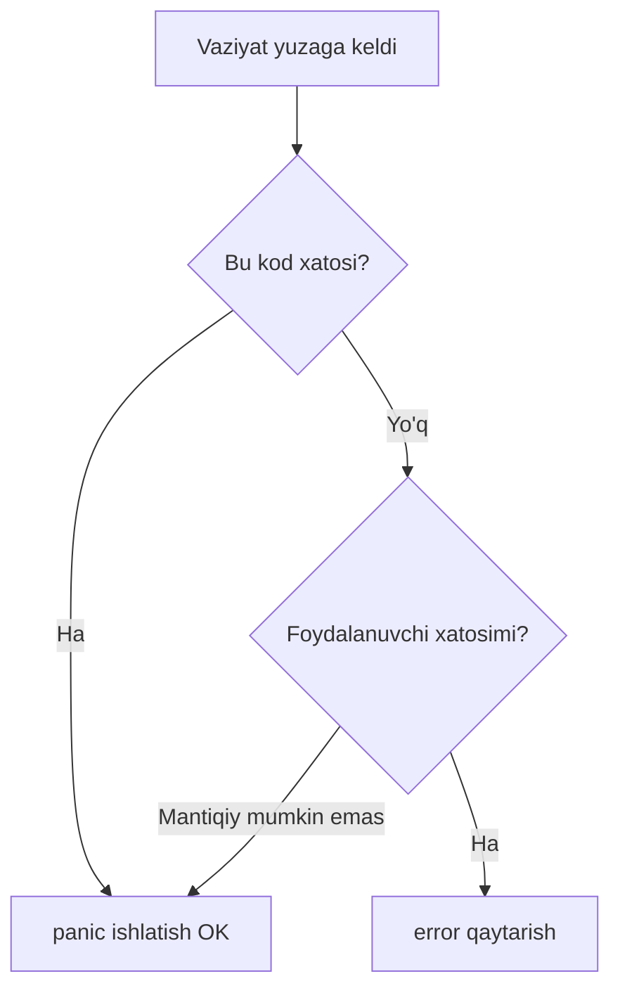
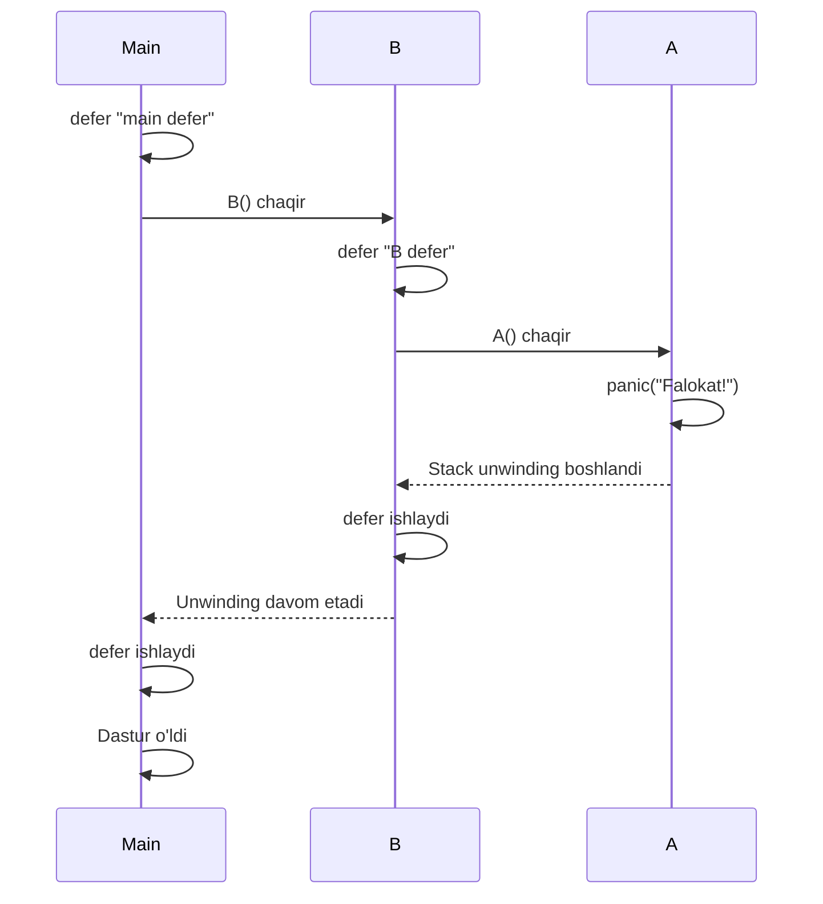
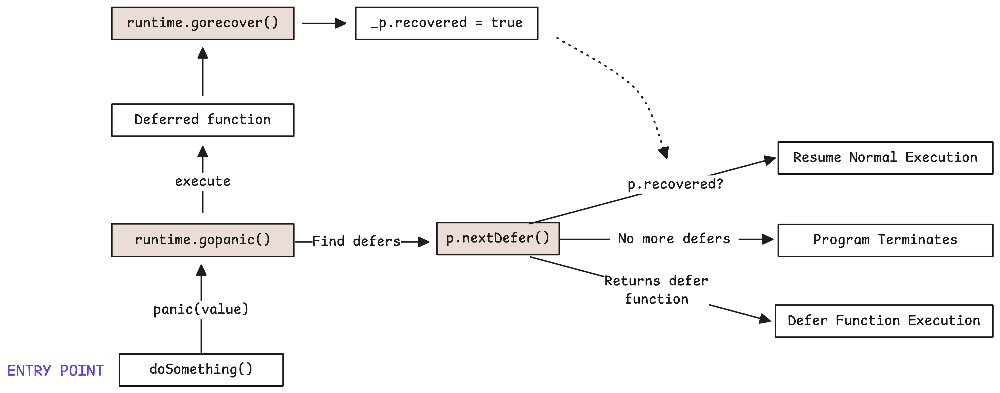
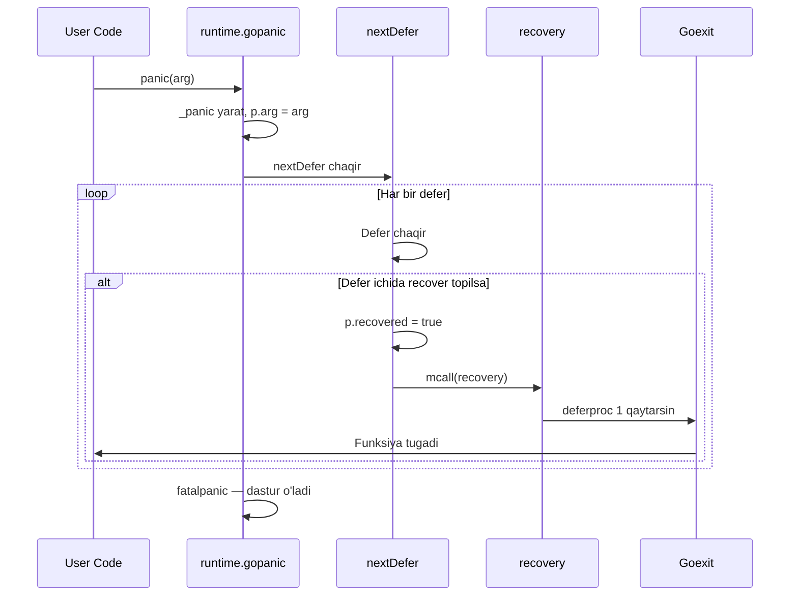
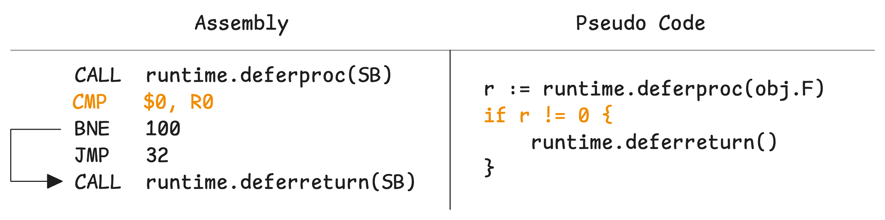
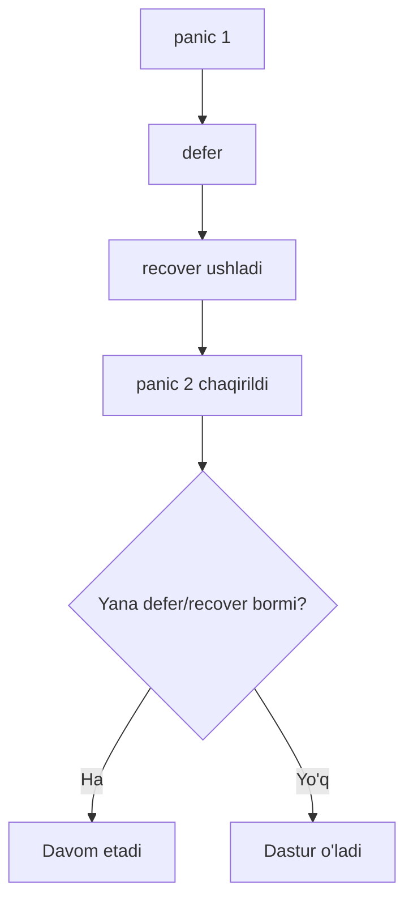

# 4. Panic va Recover: kutilmagan vaziyatlar bilan ishlash

> Ushbu material — Anatomy of Go kitobining 6-bobi mavzulari asosida o'zbek tilida tayyorlangan o'quv qo'llanma. Bu yerda mavzular o'z so'zlarim bilan tushuntirilgan, asl matnning so'zma-so'z tarjimasi emas.

## Nima uchun bu mavzu muhim?

`panic` va `recover` — Go'ning **eng katta tortishuvga sabab bo'ladigan** xususiyatlaridan biri. Boshqa tillarda (Java, Python) bu narsalar `try/catch` deb ataladi va ularni **odatiy xato boshqaruvi (error handling)** uchun ishlatish qabul qilingan.

**Go'da esa boshqacha falsafa:** `panic` — odatiy xatolar uchun emas, faqat haqiqatan ham g'ayrioddiy holatlar uchun. Odatiy xatolar uchun `error` qaytarish kerak.

Bu bo'limda biz quyidagi savollarga javob beramiz:

- `panic` qachon ishlatish kerak (va qachon emas)?
- `recover` qaerda ishlaydi va qaerda ishlamaydi?
- Panic bo'lganda runtime nima qiladi?
- Stack qanday "yechiladi" (unwinds)?

## Panic qachon ishlatiladi?

`panic` — dasturning normal ishlashi davomida sodir bo'lmasligi kerak bo'lgan **g'ayrioddiy** vaziyatlarda ishlatiladi:

- 0 ga bo'lish (integer)
- `nil` pointer'ni dereference qilish
- Slice/array chegarasidan tashqari indeks
- Kod ichidagi xato (impossible state)

```go
func main() {
    a := 0
    fmt.Println(1 / a)  // panic: integer divide by zero
}
```

> **Eslatma:** Faqat butun son (integer) 0 ga bo'linsa panic bo'ladi. Float (kasr son)da `1.0 / 0.0 = +Inf` natija bo'ladi, panic emas.

### Panic'ni o'zingiz chaqirish

```go
func mainOl(yosh int) {
    if yosh < 0 {
        panic("Yosh manfiy bo'la olmaydi!")
    }
    fmt.Println("Yosh:", yosh)
}
```

Lekin — eslang — `error` qaytarish odatda yaxshiroq:

```go
func mainOlYaxshiroq(yosh int) error {
    if yosh < 0 {
        return errors.New("yosh manfiy bo'la olmaydi")
    }
    fmt.Println("Yosh:", yosh)
    return nil
}
```



## Panic ishlaganda nima sodir bo'ladi?

`panic()` chaqirilganda — Go quyidagini qiladi:

1. Joriy funksiyaning **normal bajarilishini to'xtatadi**
2. **Stack unwinding** ni boshlaydi — yuqoriga (chaqiruvchilar tomon) qaytadi
3. Yo'lda uchragan har bir `defer` ni LIFO tartibda chaqiradi
4. Agar biron `defer` ichida `recover()` topilsa — panic'ni qaytaradi
5. Agar topilmasa — dastur **stack trace** chiqarib o'ladi

### Sodda misol

```go
func A() {
    fmt.Println("A funksiya ichida")
    panic("Falokat!")
    fmt.Println("Bu chiqmaydi")
}

func B() {
    defer fmt.Println("B defer")
    A()
    fmt.Println("Bu ham chiqmaydi")
}

func main() {
    defer fmt.Println("main defer")
    B()
}

// Chiqish:
// A funksiya ichida
// B defer
// main defer
// panic: Falokat!
// goroutine 1 [running]:
// ... stack trace
```



## Recover: panic'ni ushlash

`recover()` — defer ichida chaqirilgan paytda, panic'ni "ushlab oladi" va dastur normal davom etishi mumkin bo'ladi.

### Asosiy misol

```go
func main() {
    defer func() {
        if r := recover(); r != nil {
            fmt.Println("Ushladim:", r)
        }
    }()

    fmt.Println("Boshlandi")
    panic("birinchi panic")
    fmt.Println("Bu chiqmaydi")
}

// Chiqish:
// Boshlandi
// Ushladim: birinchi panic
```

### Muhim qoidalar

1. **`recover()` faqat `defer` ichida ishlaydi.** Boshqa joyda chaqirsangiz — `nil` qaytaradi.

```go
func notog'ri() {
    if r := recover(); r != nil {  // hech qachon ishlamaydi
        fmt.Println(r)
    }
}
```

2. **`recover()` bir bosqich yuqorida ishlaydi.** Yordamchi funksiya orqali chaqirsangiz — ishlamaydi:

```go
func yordamchi() {
    if r := recover(); r != nil {
        fmt.Println(r)  // Bu ishlamaydi!
    }
}

func main() {
    defer yordamchi()  // recover panicning qaysi defer'ida ekanligini bilmaydi
    panic("xato!")
}
```

To'g'ri yo'l:

```go
func main() {
    defer func() {
        yordamchi()  // Endi recover defer ichida
    }()
    panic("xato!")
}
```



## Recover'dan keyin nima bo'ladi?

Bu juda muhim savol! Panic recover qilingandan keyin:

1. **Funksiya tugaydi** — panic chaqirilgan joydan davom etmaydi
2. Qolgan **defer'lar bajariladi**
3. Funksiya **default qiymatini qaytaradi**

### Misol

```go
func qoshish(a, b int) int {
    defer func() {
        if r := recover(); r != nil {
            fmt.Println("Recovered:", r)
        }
    }()

    panic("xato!")
    return a + b
}

func main() {
    natija := qoshish(5, 10)
    fmt.Println("Natija:", natija)  // 0! (default int qiymati)
}
```

`a + b` hech qachon hisoblanmaydi. Funksiya `int`'ning default qiymatini (0) qaytaradi.

### Yechim: Nomli qaytaruvchi qiymat

```go
func qoshish(a, b int) (natija int, err error) {
    defer func() {
        if r := recover(); r != nil {
            err = fmt.Errorf("panic ushlandi: %v", r)
        }
    }()

    natija = a + b
    panic("xato!")
    return
}

func main() {
    n, err := qoshish(5, 10)
    if err != nil {
        fmt.Println("Xato:", err)  // panic ushlandi: xato!
    } else {
        fmt.Println("Natija:", n)
    }
}
```

Endi `natija` 15 bo'ladi (panic'dan oldin tayinlandi), va `err` ham mavjud!

```mermaid
flowchart TB
    Start[Funksiya boshlandi] --> A1[res = 100]
    A1 --> P[panic chaqirildi]
    P --> D[defer ishladi]
    D --> R{recover != nil?}
    R -->|ha| Set[err = "panic"]
    Set --> Ret[Funksiya qaytadi: res=100, err=...]
    R -->|yo'q| Crash[Dastur o'ldi]
```

## Panic'ga har qanday qiymat berish mumkin

`panic()` argumenti `interface{}` (any) — har qanday narsa bo'lishi mumkin:

```go
panic("string")
panic(42)
panic(errors.New("xato"))
panic(struct{ Kod int }{500})
```

`recover()` qaytarganda — siz uni tekshirishingiz mumkin:

```go
defer func() {
    if r := recover(); r != nil {
        switch v := r.(type) {
        case string:
            fmt.Println("String:", v)
        case error:
            fmt.Println("Error:", v.Error())
        case int:
            fmt.Println("Number:", v)
        default:
            fmt.Println("Boshqa:", v)
        }
    }
}()
```

### Go 1.21 dagi yangilik: `panic(nil)`

Avval `panic(nil)` chaqirilsa, `recover()` ham `nil` qaytarar edi — natijada:
- "Panic bo'lmadimi?" — bilmaymiz
- "Panic bo'ldi, lekin qiymat nil"? — bilmaymiz

**Go 1.21'dan boshlab:** `panic(nil)` avtomatik `*runtime.PanicNilError` ga aylanadi:

```go
defer func() {
    if r := recover(); r != nil {
        // Bu endi ishlaydi
        if _, ok := r.(*runtime.PanicNilError); ok {
            fmt.Println("nil panic ushlandi")
        }
    }
}()
panic(nil)
```

## Runtime ichida nima sodir bo'ladi?

Bu chuqurroq tushuntirish — Go runtime'ning ichini ko'ramiz.

### `_panic` strukturasi

Avval defer'da `_defer` struktura bor edi. Endi bizda `_panic` struktura ham bor:

```go
type _panic struct {
    arg       any        // panic'ga uzatilgan qiymat
    recovered bool       // recover'dan o'tdimi?
    sp        unsafe.Pointer
    pc        uintptr
    // ... boshqa maydonlar
}
```

### Jarayon

`panic(arg)` chaqirilganda — kompilyator uni `runtime.gopanic(arg)` ga aylantiradi:



### `recovery()` — sirli funksiya

`recover()` topilganda — runtime quyidagini qiladi:

1. `gp.sched.sp`, `gp.sched.pc` ni saqlangan holatga qaytaradi
2. `gp.sched.ret = 1` qiladi (deferproc avval 0 qaytargan edi)
3. `gogo()` orqali bajaruvni davom ettiradi

Bu — past darajadagi sehrli trick. Aslida **`deferproc` ikkinchi marta qaytadi** — bu safar 1 qiymat bilan. Kompilyator avvaldan kutib turadi:

```go
// Pseudo kod
result := runtime.deferproc(fn)
if result != 0 {
    runtime.deferreturn()  // Recovery yo'lidan ket
    return
}
// Normal yo'l
```



## Recover va nested panic

Bir defer ichida ikkinchi panic chiqsa nima bo'ladi?

```go
func main() {
    defer func() {
        if r := recover(); r != nil {
            fmt.Println("Ichki:", r)
            panic("yangi panic!") // Nested panic
        }
    }()
    
    panic("birinchi")
}
```

Birinchi panic recovered, lekin keyin yangi panic boshlanadi. Agar uni ham hech kim ushlamasa — dastur o'ladi.



## Real misollar

### 1. HTTP server'ni "tushib qolmaslik"dan himoyalash

```go
func himoyalangan(handler http.HandlerFunc) http.HandlerFunc {
    return func(w http.ResponseWriter, r *http.Request) {
        defer func() {
            if rec := recover(); rec != nil {
                log.Printf("panic: %v\n%s", rec, debug.Stack())
                http.Error(w, "Server xatosi", 500)
            }
        }()
        handler(w, r)
    }
}

http.HandleFunc("/api", himoyalangan(myHandler))
```

### 2. Goroutine xavfsizligi

Goroutine ichidagi panic — butun dasturni o'ldiradi! Hamma goroutine'larni himoyalash:

```go
func xavfsizGo(f func()) {
    go func() {
        defer func() {
            if r := recover(); r != nil {
                log.Println("Goroutine panic:", r)
            }
        }()
        f()
    }()
}

xavfsizGo(func() {
    // Xavfli kod
})
```

### 3. JSON Marshal/Unmarshal'da

```go
func xavfsizUnmarshal(data []byte, v interface{}) (err error) {
    defer func() {
        if r := recover(); r != nil {
            err = fmt.Errorf("unmarshal panic: %v", r)
        }
    }()
    return json.Unmarshal(data, v)
}
```

## Eslab qol

- `panic` — odatiy xatolar uchun emas! `error` qaytaring.
- `recover` faqat `defer` ichida ishlaydi.
- Recover'dan keyin funksiya **tugaydi**, nomli qaytaruvchi qiymat orqali natija bera olasiz.
- Panic'ga **har qanday qiymat** berish mumkin (`any`).
- Go 1.21 dan `panic(nil)` `*PanicNilError` ga aylanadi.
- Runtime'da: `_panic` strukturasi, `recovery` funksiyasi, `gogo` — past darajadagi sehrgarlik.
- Goroutine'da panic'ni himoyalash kerak — aks holda butun dastur o'ladi!

## Tez-tez uchraydigan xatolar

### 1. Recover'ni defer'siz chaqirish

```go
// Xato!
func main() {
    panic("xato")
    recover()  // Hech qachon yetib bormaydi
}
```

### 2. Panic'ni odatiy xato sifatida ishlatish

```go
// Xato yondashuv
func parseAge(s string) int {
    n, err := strconv.Atoi(s)
    if err != nil {
        panic(err)  // Yomon!
    }
    return n
}

// To'g'ri
func parseAge(s string) (int, error) {
    return strconv.Atoi(s)
}
```

### 3. Goroutine'ni himoyalashni unutish

```go
// Xato — bu dasturni o'ldiradi!
func main() {
    go func() {
        panic("o'lgan goroutine")
    }()
    time.Sleep(time.Second)
}
```

## Amaliyot

### 1-mashq: Xavfsiz division

```go
func bolish(a, b int) (natija int, err error) {
    // 0 ga bo'lish panic'ni recover qiling va error qaytaring
}

// Sinov
n, err := bolish(10, 0)
// natija: 0, err: "division by zero"
```

### 2-mashq: HTTP middleware

Yuqoridagi `himoyalangan` middleware'ni yarating va tasodifiy panic chiqaradigan handler bilan sinab ko'ring.

### 3-mashq: Worker pool

Goroutine'lar bilan ishlaydigan ishchi (worker) pool yarating. Har bir ishchi panic chiqarsa, qolganlari ishlashda davom etsin:

```go
func ishchi(id int, ishlar <-chan func()) {
    for ish := range ishlar {
        func() {
            defer func() {
                if r := recover(); r != nil {
                    log.Printf("Ishchi %d: panic — %v", id, r)
                }
            }()
            ish()
        }()
    }
}
```

### 4-mashq: Stack trace bilan log

Panic ushlash paytida joriy stack trace'ni ham yozing:

```go
import "runtime/debug"

defer func() {
    if r := recover(); r != nil {
        log.Printf("PANIC: %v\nStack:\n%s", r, debug.Stack())
    }
}()
```

---

**Avvalgi mavzu:** [03_defer.md](03_defer.md) — Defer
**Keyingi mavzu:** [05_profiling.md](05_profiling.md) — Profiling
