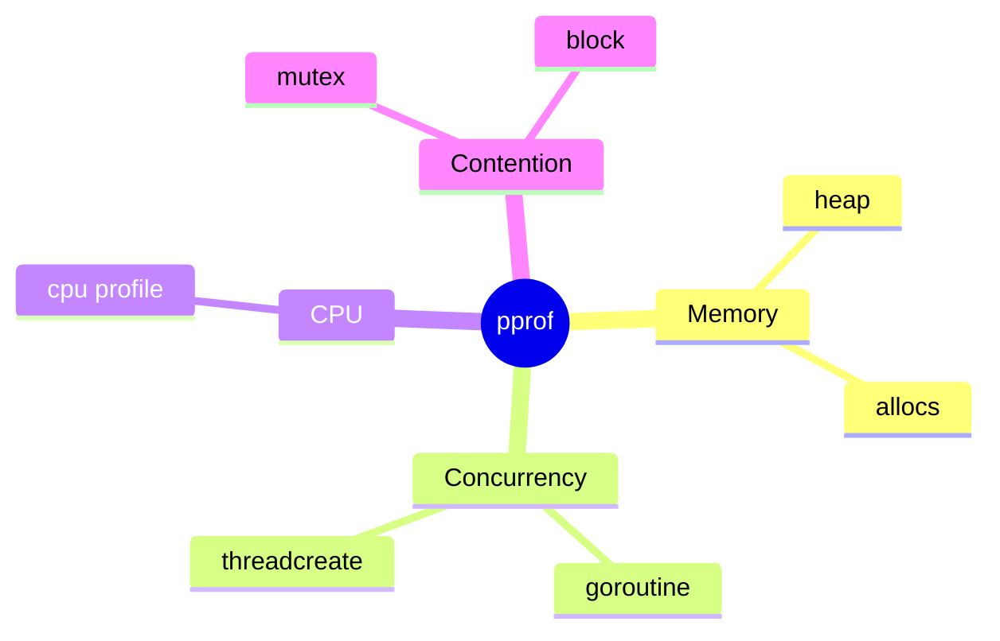
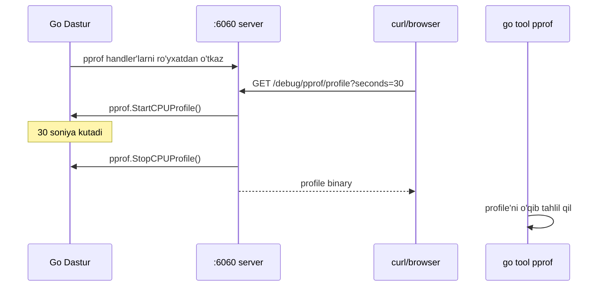
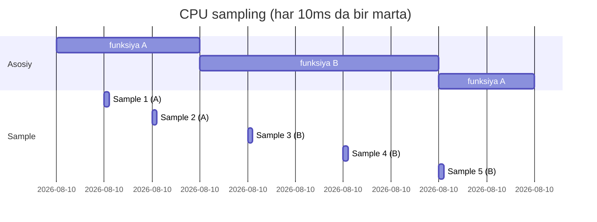
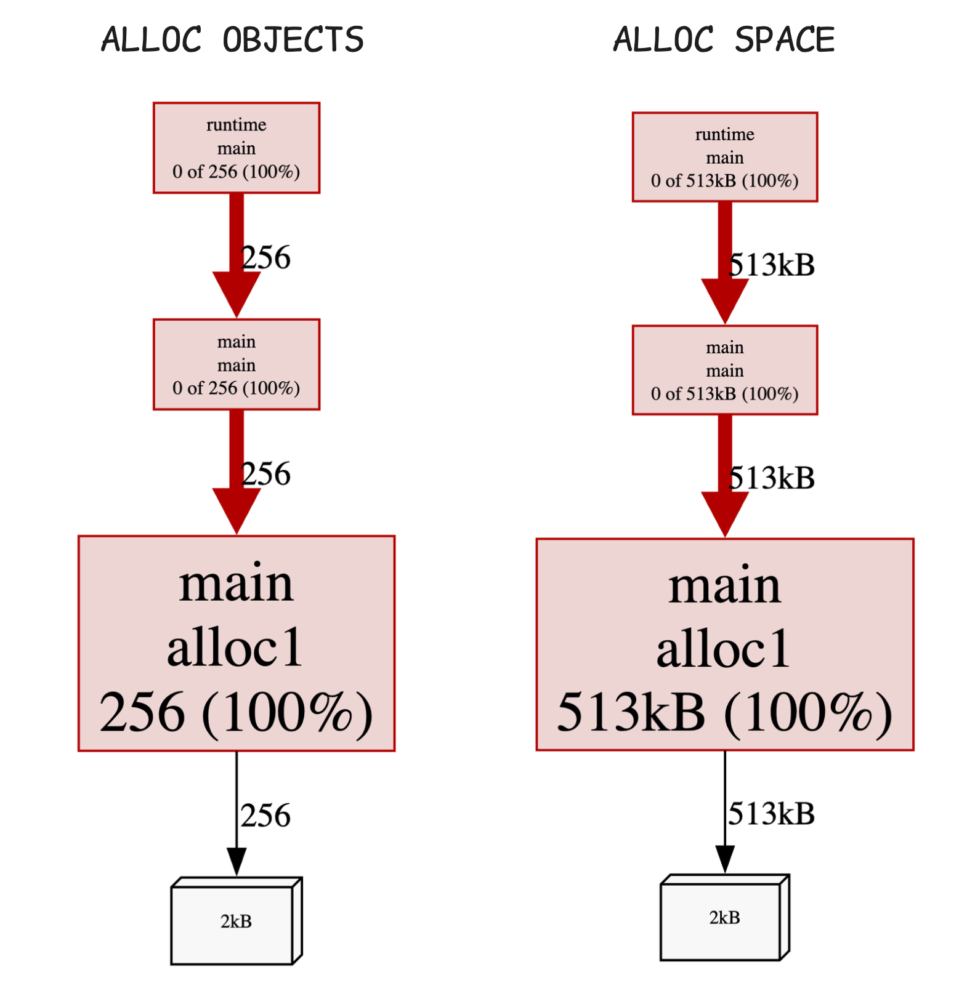
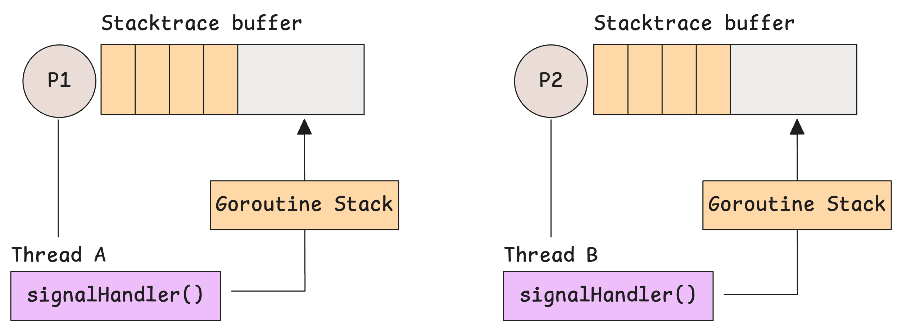

# 5. Profiling: dasturni o'lchash va tahlil qilish

> Ushbu material — Anatomy of Go kitobining 6-bobi mavzulari asosida o'zbek tilida tayyorlangan o'quv qo'llanma. Bu yerda mavzular o'z so'zlarim bilan tushuntirilgan, asl matnning so'zma-so'z tarjimasi emas.

## Nima uchun bu mavzu muhim?

Sizning Go dasturingiz sekin ishlayapti. Yoki xotira ko'p iste'mol qilyapti. Yoki goroutine'lar to'planib qolyapti. Qaerdan boshlamoqchisiz?

**Profiling** — bu sizning dasturingizni "asboblar bilan o'lchash" jarayoni. U sizga aytib beradi:

- Qaysi funksiyalar **eng ko'p CPU** sarflaydi
- Qaerda **xotira ajratiladi**
- Qaerda goroutine'lar **bloklanadi**
- Qaysi mutex'lar **tortishuv** yaratadi

Go bu masalani echishda ajoyib — `pprof` deb nomlangan asbob runtime'ga o'rnatilgan. Faqat to'g'ri sozlash kerak.

## pprof — nima va qanday ishlaydi?

`pprof` — Go'ning **profilash** asbobi. Ikki qismdan iborat:

1. **`runtime/pprof` paketi** — ma'lumotlarni yig'adi
2. **`go tool pprof` buyrug'i** — ma'lumotlarni tahlil qiladi va vizualizatsiya qiladi


## Profil turlari

Go'da bir nechta profile turlari bor. Har biri **boshqa-boshqa savolga** javob beradi:

| Profil turi | Savol | Default | Qachon yoqiladi |
|-------------|-------|---------|------------------|
| **`heap`** | Hozir xotirada nima joylashgan? | Yoqiq | Doimo |
| **`allocs`** | Dastur boshidan beri qancha xotira ajratilgan? | Yoqiq | Doimo |
| **`cpu`** | Qaysi funksiyalar CPU eng ko'p ishlatadi? | O'chiq | Manual |
| **`goroutine`** | Hozir qaysi goroutine'lar nima qilyapti? | Yoqiq | Doimo |
| **`block`** | Qaysi joylarda goroutine kutib qoldi? | O'chiq | Manual |
| **`mutex`** | Qaysi mutex'larda tortishuv (contention) bor? | O'chiq | Manual |
| **`threadcreate`** | OT iplari (M) qaerda yaratildi? | Yoqiq | Doimo (lekin singan) |



## Profil qanday yig'iladi?

Go'da profile yig'ishning **3 yo'li** bor:

### 1-yo'l: `go test` flag'lari bilan

Eng oson — test paytida:

```bash
$ go test -cpuprofile cpu.prof -memprofile mem.prof -bench .
```

Bu test paytida CPU va memory profile'larni `cpu.prof` va `mem.prof` fayllariga yozadi.

### 2-yo'l: Kod ichida `runtime/pprof`

```go
package main

import (
    "log"
    "os"
    "runtime/pprof"
)

func main() {
    // CPU profile fayli ochish
    f, err := os.Create("cpu.prof")
    if err != nil {
        log.Fatal(err)
    }
    defer f.Close()

    // Profilashni boshla
    if err := pprof.StartCPUProfile(f); err != nil {
        log.Fatal(err)
    }
    defer pprof.StopCPUProfile()

    // Sizning kodingiz
    ogIrIsh()
}

func ogIrIsh() {
    sum := 0
    for i := 0; i < 100_000_000; i++ {
        sum += i
    }
}
```

### 3-yo'l: HTTP server orqali (eng yaxshi)

Dasturingiz uzoq vaqt ishlaydigan bo'lsa (server, daemon), HTTP endpoint orqali profile yig'ish — eng qulay yo'l:

```go
package main

import (
    "net/http"
    _ "net/http/pprof"  // Diqqat: blank import!
)

func main() {
    go func() {
        http.ListenAndServe(":6060", nil)  // Profile server
    }()

    // Asosiy dastur kodi
    runApp()
}
```

Endi quyidagi URL'lar mavjud:

```
http://localhost:6060/debug/pprof/         — barcha profillar ro'yxati
http://localhost:6060/debug/pprof/heap     — heap profile
http://localhost:6060/debug/pprof/profile  — CPU profile (30 sek default)
http://localhost:6060/debug/pprof/goroutine — goroutine profile
http://localhost:6060/debug/pprof/trace    — execution trace
```



## Memory profile (heap, allocs)

### `heap` — hozirgi vaziyat

`heap` profile **hozirda xotirada turgan** obyektlarni ko'rsatadi.

```go
import "runtime"
import "runtime/pprof"

func saveHeapProfile() error {
    f, _ := os.Create("heap.prof")
    defer f.Close()
    
    runtime.GC()  // GC qilish — toza ma'lumot olish uchun
    return pprof.Lookup("heap").WriteTo(f, 0)
}
```

### `allocs` — dastur tarixi

`allocs` profile **dastur boshidan beri** qancha xotira ajratilganini ko'rsatadi (hatto allaqachon free bo'lganlarini ham).

| `heap` | `allocs` |
|--------|----------|
| Hozirgi vaziyat | Tarixiy ma'lumot |
| GC ishidan keyin tozalanadi | Hech qachon tozalanmaydi |
| Memory leak topish uchun | Allocation hot spot topish uchun |

### `MemProfileRate` — sampling

Go har bir allocation'ni emas, balki **har 512KB'ga bir marta** namuna oladi (default). Buni o'zgartirish:

```go
runtime.MemProfileRate = 1  // Har bir allocation
runtime.MemProfileRate = 0  // O'chirish
```

## CPU profile

CPU profile **dasturingiz qaerda vaqt sarflaydi**ni ko'rsatadi.

### Qanday ishlaydi?

CPU profiler **sampling** texnikasini ishlatadi:
- Har **10 ms**'da bir marta dasturni "to'xtatadi"
- Joriy **stack trace**'ni yozib oladi
- Davom ettiradi

Vaqt o'tishi bilan, qaysi funksiya tez-tez ko'rinsa — u **hot** funksiya.



## `go tool pprof` — interaktiv shell

Profile faylni o'qib tahlil qilish:

```bash
$ go tool pprof cpu.prof
File: theanatomyofgo
Type: cpu
Time: 2026-05-10 14:00:00
Entering interactive mode (type "help" for commands, "o" for options)
(pprof)
```

### `top` buyrug'i — eng "qimmat" funksiyalar

```
(pprof) top
Showing nodes accounting for 1.5GB, 95% of 1.6GB total
      flat  flat%   sum%        cum   cum%
   670.7MB 53.9% 53.9%   670.7MB 53.9%  bytesutil.ResizeNoCopy
     224MB 18.0% 71.9%      224MB 18.0%  bytesutil.ResizeWithCopy
   149.6MB 12.0% 83.9%   149.6MB 12.0%  fastcache.cleanLocked
```

Ustunlar tushuntirishi:

| Ustun | Ma'nosi |
|-------|---------|
| **`flat`** | Faqat shu funksiyada sarflangan |
| **`flat%`** | Foiz |
| **`sum%`** | Yuqoridan jamlanma foiz |
| **`cum`** | Funksiya + uning chaqirgan funksiyalari |
| **`cum%`** | Foiz |

> **flat vs cum:** `func A` `func B` ni chaqirsa va vaqtning ko'pini `B` da o'tkazsa:
> - `A.flat` = kichik (A o'zi ish qilmaydi)
> - `A.cum` = katta (A + B birgalikda)

### `list <funksiya>` — kod satriga qadar

```
(pprof) list myFunc
Total: 1.5GB
ROUTINE ======================== main.myFunc
     0.5GB      0.5GB (flat, cum) 33.3% of Total
         .          .   10:func myFunc(data []byte) {
     200MB      200MB   11:    s := make([]byte, 1024*1024)  // <-- 200MB!
         .          .   12:    copy(s, data)
     300MB      300MB   13:    bigSlice := make([]int, 1000000) // <-- 300MB
         .          .   14:}
```

### `web` buyrug'i — grafik ko'rinish

```
(pprof) web
```

Bu Graphviz orqali **call graph** yaratadi va brauzerda ochadi:



Tugunlar (nodes) — funksiyalar. Tugunning kattaligi — `flat` qiymat. Strelkalar — chaqiriqlar.

### `peek <pattern>` — funksiya atrofida nima bor?

Filtr bo'yicha qaysi funksiyalar shuni chaqirgan, shu funksiya nimani chaqirgan:

```
(pprof) peek myFunc
```

### `disasm <funksiya>` — assembly

```
(pprof) disasm myFunc
```

## HTTP orqali pprof tahlili

Server ishga tushirilgandan keyin, to'g'ridan-to'g'ri:

```bash
$ go tool pprof http://localhost:6060/debug/pprof/profile?seconds=30
```

Bu 30 soniya CPU profile yig'adi va shell ochadi.

### Web UI rejimi

`-http` flag bilan ishga tushirsangiz — brauzerda chiroyli grafik ochadi:

```bash
$ go tool pprof -http=:8080 http://localhost:6060/debug/pprof/heap
```



## Boshqa profile turlari

### Block profile — qayerda goroutine bloklanyapti?

```go
runtime.SetBlockProfileRate(1)  // Yoqish: har bir block event
defer runtime.SetBlockProfileRate(0)

// Profilingdan keyin
pprof.Lookup("block").WriteTo(f, 0)
```

Bu sizga **channel send/receive**, **mutex lock**, **WaitGroup wait** kabi joylarni ko'rsatadi.

### Mutex profile — mutex tortishuvi

```go
runtime.SetMutexProfileFraction(1)  // Yoqish
defer runtime.SetMutexProfileFraction(0)

pprof.Lookup("mutex").WriteTo(f, 0)
```

Bu mutex'larda **kim ko'p kutib qoladi**ni ko'rsatadi.

### Goroutine profile — hozir nima bo'lyapti?

```go
pprof.Lookup("goroutine").WriteTo(f, 0)
// yoki
pprof.Lookup("goroutine").WriteTo(f, 1)  // Inson o'qiy oladigan format
pprof.Lookup("goroutine").WriteTo(f, 2)  // To'liq stack trace
```

`debug=2` — eng kuchli rejim. Har bir goroutine'ning **to'liq stack trace**'ini chiqaradi. Goroutine leak va deadlock topish uchun ajoyib.

### `threadcreate` — singan profile

Bu profile **buggy** — uzoq vaqt to'g'ri ishlamayapti. Asosan ishlatishni tavsiya qilmaymiz.

## Delta profiling

Ikki vaqt orasidagi farqni ko'rsatadigan profile:

```bash
# 60 soniya kuting va o'sha vaqt mobaynida farqni ko'ring
$ curl http://localhost:6060/debug/pprof/heap?seconds=60 > delta.prof
```

Bu **memory leak** topish uchun juda foydali — agar 60 soniyada xotira o'sgan bo'lsa, qaerda?

## Real misol: Bottleneck topish

Tasavvur qilamiz, sizning HTTP server'ingiz sekin javob berayapti. Profilash bilan topamiz:

```go
package main

import (
    "fmt"
    "net/http"
    _ "net/http/pprof"
)

func handler(w http.ResponseWriter, r *http.Request) {
    // Sun'iy "og'ir" ish
    sum := 0
    for i := 0; i < 100_000_000; i++ {
        sum += i
    }
    fmt.Fprintf(w, "Result: %d", sum)
}

func main() {
    http.HandleFunc("/", handler)
    http.ListenAndServe(":8080", nil)
}
```

```bash
# Server'ni ishga tushiring
$ go run main.go &

# Bir nechta so'rov yuboring
$ for i in {1..10}; do curl -s http://localhost:8080/ > /dev/null; done

# 30 soniya CPU profile yig'ing
$ go tool pprof http://localhost:8080/debug/pprof/profile?seconds=30
```

Profil ichida `top10` buyrug'i — `handler` funksiyaning eng katta foiz olganini ko'rsatadi. `list handler` — for loop'da vaqt sarflanyapti.

## `Profile.Count()` — kichik metod

Hech kim ishlatmaydigan, lekin foydali metod:

```go
// Hozir nechta unikal allocation joylar bor?
n := pprof.Lookup("heap").Count()
fmt.Println("Allocation joylar:", n)

// Hozir nechta goroutine ishlamoqda?
n = pprof.Lookup("goroutine").Count()
// Bu runtime.NumGoroutine() bilan bir xil
```

## Eslab qol

- **`heap`** — hozirgi xotira; **`allocs`** — tarixiy
- **`cpu`** — manual yoqiladi (`pprof.StartCPUProfile`)
- **`goroutine`** profile bilan **goroutine leak** topish — eng oson yo'l
- **`net/http/pprof`** — production'da eng yaxshi yo'l, lekin **xavfsizlik** muhim (URL'ni ochiq qilmang!)
- `flat` vs `cum` — birinchisi faqat shu funksiya, ikkinchisi + chaqirilganlari
- **Sampling** — CPU profile aniq emas, statistik. Ko'p namuna olish kerak.
- **`go tool pprof -http`** — eng oson tahlil yo'li

## Tez-tez uchraydigan xatolar

### 1. `pprof` import unutish

```go
// Bu yetarli emas
import "net/http"

// Bu kerak
import (
    "net/http"
    _ "net/http/pprof"  // init() ishga tushadi
)
```

### 2. Production'da pprof ochiq

```go
// XATO! Hamma ko'ra oladi
http.ListenAndServe(":6060", nil)

// To'g'ri: faqat localhost
http.ListenAndServe("127.0.0.1:6060", nil)
```

### 3. CPU profile yopilmaydi

```go
// XATO!
pprof.StartCPUProfile(f)
// defer'siz — agar panic bo'lsa, profile buziladi

// To'g'ri
pprof.StartCPUProfile(f)
defer pprof.StopCPUProfile()
```

### 4. Memory profile'da GC ni unutish

```go
// XATO — eski (allaqachon o'lik) obyektlar ko'rinishi mumkin
pprof.Lookup("heap").WriteTo(f, 0)

// To'g'ri
runtime.GC()  // Avval GC
pprof.Lookup("heap").WriteTo(f, 0)
```

## Amaliyot

### 1-mashq: Sodda CPU profile

Quyidagi kod uchun CPU profile oling va `top10` natijasini analiz qiling:

```go
package main

import (
    "fmt"
    "os"
    "runtime/pprof"
)

func a() int {
    sum := 0
    for i := 0; i < 50_000_000; i++ {
        sum += i
    }
    return sum
}

func b() int {
    sum := 0
    for i := 0; i < 100_000_000; i++ {
        sum += i
    }
    return sum
}

func main() {
    f, _ := os.Create("cpu.prof")
    defer f.Close()
    pprof.StartCPUProfile(f)
    defer pprof.StopCPUProfile()

    for i := 0; i < 10; i++ {
        a()
        b()
    }
    fmt.Println("Tugadi")
}
```

Sinov:
```bash
$ go run main.go
$ go tool pprof -http=:8080 main cpu.prof
```

Savol: `b()` taxminan necha foiz vaqt oldi?

### 2-mashq: Memory leak

Quyidagi kodda memory leak bor. Topib, tuzating:

```go
package main

var cache = make(map[string][]byte)

func handler(key string) {
    cache[key] = make([]byte, 1024*1024)  // 1MB
    // Hech qachon o'chirilmaydi
}

func main() {
    for i := 0; i < 10000; i++ {
        handler(fmt.Sprintf("key%d", i))
    }
}
```

Heap profile oling, leak'ni isbotlang.

### 3-mashq: Goroutine leak

10 ta goroutine yarating, ularning 5 tasi `chan` da kutib qoladi. `goroutine` profile (debug=2) bilan leak'ni topib ko'ring.

### 4-mashq: Block profile

Quyidagi kodni `block` profile bilan tahlil qiling:

```go
package main

import (
    "fmt"
    "os"
    "runtime"
    "runtime/pprof"
    "sync"
)

func main() {
    runtime.SetBlockProfileRate(1)
    defer runtime.SetBlockProfileRate(0)

    var mu sync.Mutex
    var wg sync.WaitGroup
    
    for i := 0; i < 10; i++ {
        wg.Add(1)
        go func() {
            defer wg.Done()
            mu.Lock()
            time.Sleep(100 * time.Millisecond)
            mu.Unlock()
        }()
    }
    wg.Wait()
    
    f, _ := os.Create("block.prof")
    pprof.Lookup("block").WriteTo(f, 0)
    fmt.Println("Tugadi")
}
```

---

**Avvalgi mavzu:** [04_panic_recover.md](04_panic_recover.md) — Panic & Recover
**Keyingi mavzu:** [06_trace.md](06_trace.md) — Execution Trace
