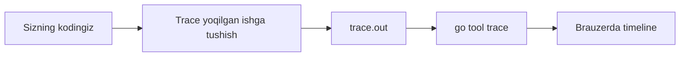
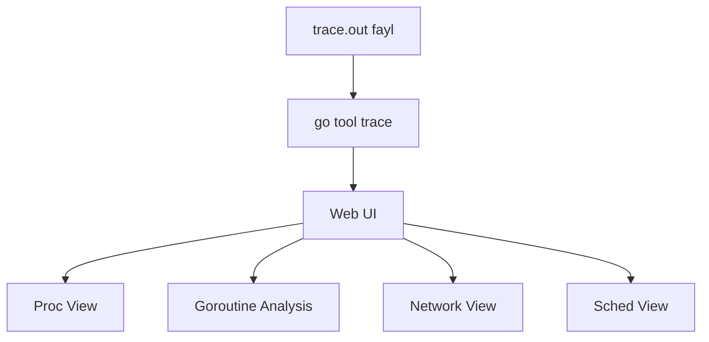
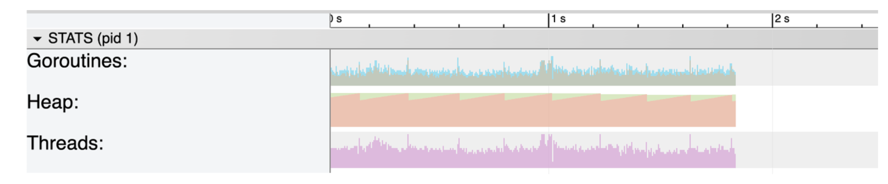
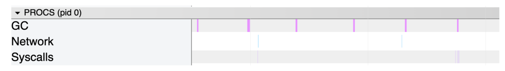
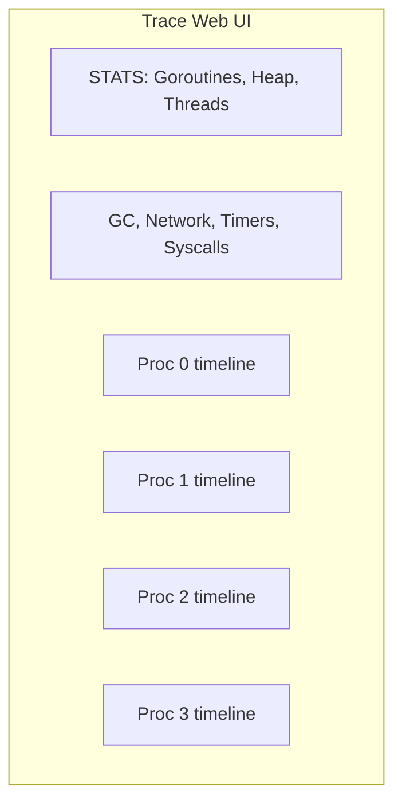
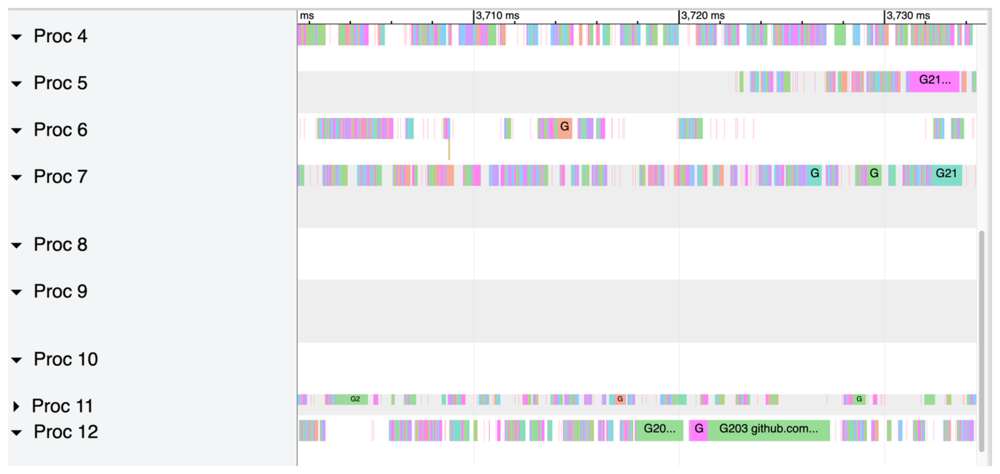
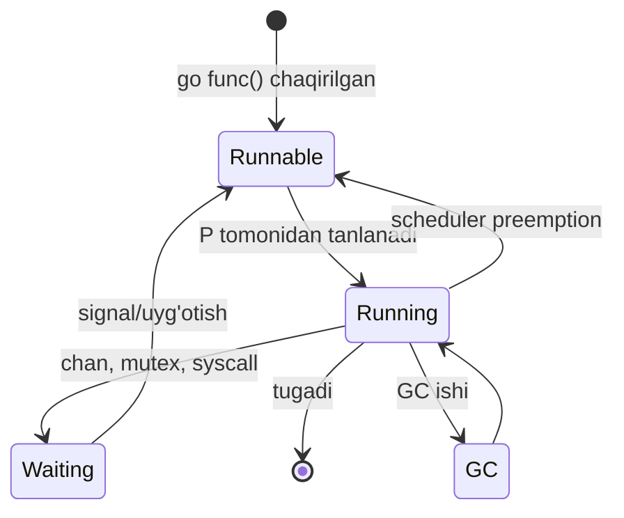
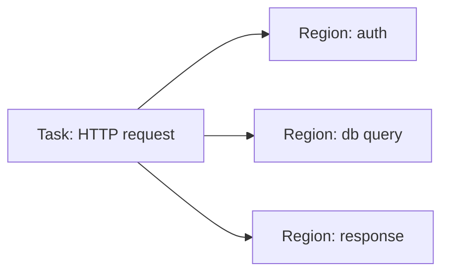
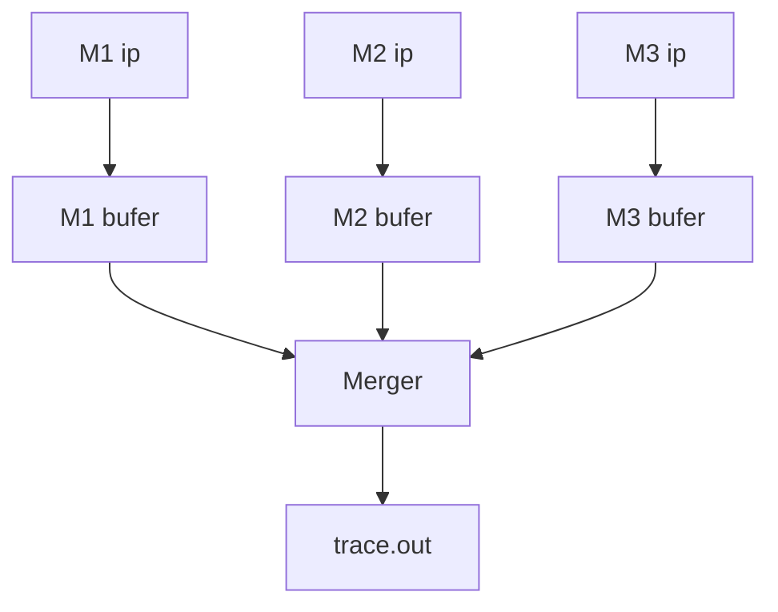

# 6. Execution Trace: vaqt bo'yicha kuzatish

> Ushbu material — Anatomy of Go kitobining 6-bobi mavzulari asosida o'zbek tilida tayyorlangan o'quv qo'llanma. Bu yerda mavzular o'z so'zlarim bilan tushuntirilgan, asl matnning so'zma-so'z tarjimasi emas.

## Nima uchun bu mavzu muhim?

`pprof` (profiling) sizga **statistika** beradi — "90% allocation `server.go` 35-satrda sodir bo'ladi". Lekin u sizga ko'p narsalarni aytmaydi:

- **Qaysi goroutine** bu allocation'ni qildi?
- **Qachon** bu sodir bo'ldi?
- O'sha vaqtda **boshqa goroutine'lar** nima qilayotgan edi?
- GC qaysi paytda ishladi va goroutine'larni qanday to'xtatdi?

Bu savollarga javob — **execution trace**'da. Trace — sizning dasturingizning **vaqt bo'yicha kinosi**. Har bir voqea (goroutine yaratish, blocklash, system call, GC) **nanosekund aniqligida** yoziladi.



## Trace nima yozadi?

| Voqea turi | Misol |
|------------|-------|
| **Scheduling** | Goroutine yaratildi, bloklandi, davom etdi |
| **Network** | Socket I/O bloki |
| **Syscall** | OS chaqirig'i kirish/chiqish |
| **GC** | Mark, Sweep, STW (Stop The World) |
| **User events** | O'zingiz qo'ygan task/region/log |

Har bir voqea quyidagilarni saqlaydi:
- **Timestamp** — nanosekund aniq vaqt
- **Goroutine ID** — qaysi G
- **Processor ID** — qaysi P (mantiqiy protsessor)
- **OS Thread ID** — qaysi M
- **Stack trace** — qaerdan chaqirildi

## Trace'ni yoqish: 3 yo'l

### 1-yo'l: `go test` flag'i

```bash
$ go test -trace=trace.out -bench=. -benchtime=10s
```

Test paytida trace yig'iladi.

### 2-yo'l: Kod ichida `runtime/trace`

```go
package main

import (
    "log"
    "os"
    "runtime/trace"
)

func main() {
    f, err := os.Create("trace.out")
    if err != nil {
        log.Fatal(err)
    }
    defer f.Close()

    if err := trace.Start(f); err != nil {
        log.Fatal(err)
    }
    defer trace.Stop()

    // Sizning kodingiz
    asosiyIsh()
}
```

### 3-yo'l: HTTP endpoint orqali

`net/http/pprof` import qilsangiz — `/debug/pprof/trace` endpoint mavjud:

```bash
$ curl 'http://localhost:6060/debug/pprof/trace?seconds=5' > trace.out
```

5 soniya trace yig'adi.

## Trace'ni ko'rish: `go tool trace`

```bash
$ go tool trace trace.out
2026/05/10 15:00:00 Parsing trace...
2026/05/10 15:00:01 Splitting trace...
2026/05/10 15:00:02 Opening browser. Trace viewer is listening on http://127.0.0.1:54321
```

Brauzer ochiladi va sizga interaktiv timeline ko'rsatadi.



## "Proc View" — eng asosiy ko'rinish

Brauzerda eng birinchi ko'radigan narsa — **Proc View** (protsessor bo'yicha ko'rinish).



Yuqorida — **STATS** bo'limi (3 ta grafik):

- **Goroutines** — vaqt davomida nechta goroutine ishlagan
- **Heap** — xotira foydalanish (orange = jami, green = GC chegarasi)
- **Threads** — OT iplari soni



Pastda — turli "lane" (yo'lak)lar:

- **GC** — Garbage Collection qachon bo'ldi
- **Network** — Network I/O orqali goroutine uyg'otilgan voqealar
- **Timers** — Timer (`time.Sleep`, `time.After`) bilan bog'liq voqealar
- **Syscalls** — Syscall'dan qaytishlar
- **Proc 0, Proc 1, ...** — har bir P uchun timeline



### Proc lane ichida nima ko'rinadi?



- **Rangli polosalar** — goroutine'lar ishlamoqda
- Har bir polosaning **rangi** va **yorlig'i** (G1, G2, va h.k.) — qaysi goroutine
- "G1 runtime.main" — bu Goroutine 1 `runtime.main` ni ishlatmoqda

Goroutine bir P'dan ikkinchi P'ga "ko'chsa" — uning rangi yangi lane'da davom etadi.

### TimerP va SyscallP — pseudo P'lar

Real P'lar `0`, `1`, ..., `GOMAXPROCS-1` raqamlanadi. Lekin trace'da boshqa P'lar ham ko'rinadi:

- **TimerP** — timer bilan bog'liq voqealar (`time.Sleep` tugadi)
- **SyscallP** — syscall'dan qaytgan voqealar
- **NetpollP** — network I/O voqealar

Bular real P emas, balki "joy ushlash" uchun virtual P'lar.

## Goroutine'larning hayot davri

Trace'da har bir goroutine quyidagi holatlarda bo'ladi:



Trace'da har bir holat o'tishi **alohida voqea** sifatida yoziladi.

## Goroutine Analysis Page

Web UI'dagi "Goroutine analysis" sahifasi har bir funksiya uchun statistika beradi:

| Funksiya | Goroutine soni | Total time | Network wait | Sync block | Syscall block |
|----------|----------------|------------|--------------|------------|---------------|
| `main.handleConnection` | 1000 | 5s | 4s | 200ms | 100ms |
| `main.processRequest` | 500 | 2s | 1.5s | 100ms | 50ms |

Bu jadval sizga aytadi:
- 1000 ta `handleConnection` goroutine 5 soniya jami ishlagan
- Ulardan **4 soniya** network kutib qolgan!
- Demak, network — bottleneck

## Tasks va Regions — sizning belgilaringiz

Standart trace ishlash haqida ma'lumot beradi. Lekin siz **o'z biznes mantig'ingiz** uchun belgi qo'yishingiz mumkin.

### Region — qisqa kod bloki

```go
import "runtime/trace"

func processRequest(ctx context.Context) {
    defer trace.StartRegion(ctx, "DB query").End()
    
    // DB so'rov
    db.Query("SELECT * FROM users")
}
```

Endi trace'da "DB query" deb yorliqlangan blok ko'rinadi.

### Task — uzoq jarayon (bir nechta region'larni o'z ichiga oladi)

```go
ctx, task := trace.NewTask(context.Background(), "HTTP request")
defer task.End()

// Bu task ichida bir nechta region bo'lishi mumkin
authUser(ctx)        // region: auth
loadFromDB(ctx)      // region: db
sendResponse(ctx)    // region: response
```



### Log — voqea qo'shish

```go
trace.Log(ctx, "category", "message")
```

Bu trace'ga oddiy log yozadi — keyin tahlilda ko'rasiz.

### To'liq misol

```go
package main

import (
    "context"
    "os"
    "runtime/trace"
    "time"
)

func main() {
    f, _ := os.Create("trace.out")
    defer f.Close()
    trace.Start(f)
    defer trace.Stop()

    ctx := context.Background()

    for i := 0; i < 5; i++ {
        ctx, task := trace.NewTask(ctx, "request")
        processRequest(ctx, i)
        task.End()
    }
}

func processRequest(ctx context.Context, id int) {
    // Region 1
    region1 := trace.StartRegion(ctx, "validate")
    time.Sleep(10 * time.Millisecond)
    region1.End()

    // Region 2
    region2 := trace.StartRegion(ctx, "db-query")
    time.Sleep(50 * time.Millisecond)
    region2.End()

    trace.Log(ctx, "request-id", string(rune(id)))
}
```

## Sched (Scheduler) view

Web UI'da "Scheduler" tugmasi bor — bu eng past darajadagi voqealarni ko'rsatadi:

- Goroutine yaratildi (`go go()`)
- Goroutine bloklandi (chan, mutex, syscall)
- Goroutine uyg'otildi
- P start/stop
- M start/stop

Bu view juda batafsil va boshlovchilar uchun og'ir bo'lishi mumkin. Lekin **deadlock** va **preemption** muammolarini topish uchun ajoyib.

## Trace'ning ichki mexanizmi

### Per-thread bufer

Har bir M (OT ipi) **o'z bufer**iga voqealarni yozadi. Bu **lock contention** ni minimallashtiradi.



### Sequence lock

Bufer **sequence lock** bilan himoyalangan — yangi versiya G dan yangi versiyaga otadi.

### Delta encoding

Timestamp'lar **delta encoding** bilan saqlanadi — joy tejaydi:
- Birinchi timestamp: `1234567890`
- Keyingisi: `+50` (ya'ni `1234567940`)
- Keyingisi: `+30` (ya'ni `1234567970`)

### `GODEBUG=traceallocfree=1`

Yana batafsil ma'lumot uchun bu environment variable yoqing. Bu qo'shimcha 3 turdagi voqealarni qo'shadi:

- **Heap span events** — xotira spani allocation/free
- **Heap object events** — har bir obyekt allocation/free
- **Goroutine stack events** — stack o'sishi

> **Diqqat:** Bu eksperimental va dasturni juda sekinlashtiradi. Faqat chuqur tahlil uchun.

## Network View

Bu sahifa network I/O voqealarni alohida ko'rsatadi:

- Goroutine qachon `read`/`write` bilan bloklandi
- Necha vaqtdan keyin uyg'otildi
- Qaysi connection bilan ishlashda

HTTP server tahlil qilishda juda foydali.

## Real misol: HTTP serverni profilash

```go
package main

import (
    "context"
    "fmt"
    "net/http"
    _ "net/http/pprof"
    "runtime/trace"
    "time"
)

func handler(w http.ResponseWriter, r *http.Request) {
    ctx, task := trace.NewTask(r.Context(), "HTTP request")
    defer task.End()

    region := trace.StartRegion(ctx, "process")
    time.Sleep(50 * time.Millisecond)
    region.End()

    region2 := trace.StartRegion(ctx, "db-call")
    time.Sleep(30 * time.Millisecond)
    region2.End()

    fmt.Fprintln(w, "OK")
}

func main() {
    http.HandleFunc("/api", handler)
    http.ListenAndServe(":8080", nil)
}
```

Test:
```bash
# Server ishlamoqda
$ go run main.go &

# Bir nechta so'rov
$ for i in {1..50}; do curl http://localhost:8080/api; done

# 5 soniya trace
$ curl http://localhost:8080/debug/pprof/trace?seconds=5 > trace.out

# Tahlil
$ go tool trace trace.out
```

Endi brauzerda:
1. **Goroutine analysis** — nechta goroutine `handler` ishladi
2. **Sync block** — qaerda kutib qoldi
3. **User-defined tasks** — sizning task/region'laringiz

## Trace vs Profile — qachon nimani ishlatish?

| Vaziyat | Trace | Profile |
|---------|-------|---------|
| "Qaysi funksiya CPU ko'p oladi?" | | ✅ |
| "Kim memory ajratdi?" | | ✅ (heap) |
| "Goroutine qachon bloklandi?" | ✅ | |
| "GC qachon bo'ldi?" | ✅ | |
| "Bir necha goroutine bir-biriga qanday ta'sir qiladi?" | ✅ | |
| "Uzun runtime monitoring" | ❌ (juda katta) | ✅ |
| "Concurrency bug topish" | ✅ | |

**Eslab qoling:** Trace **og'ir**. Bir necha soniya uchun gigabaytlab ma'lumot yaratishi mumkin. Production'da uzoq vaqt yoqib qo'ymang!

## Eslab qol

- **Trace** = vaqt bo'yicha kino, **profile** = statistika
- 3 yo'l bilan yoqiladi: `go test -trace`, kod ichida `trace.Start()`, HTTP endpoint
- **`go tool trace trace.out`** — brauzerda interaktiv UI
- **Proc View** — eng asosiy ko'rinish, P bo'yicha timeline
- **Goroutine analysis** — har bir funksiya uchun statistika
- **Task/Region/Log** — o'z biznes mantig'iga belgilar qo'yish
- **Trace og'ir** — production'da ehtiyotkorlik bilan
- Ichki: per-thread buffer + sequence lock + delta encoding

## Tez-tez uchraydigan xatolar

### 1. Trace'ni unutmaslik

```go
trace.Start(f)
// defer'siz — agar dastur to'xtab qolsa, ma'lumot yo'qoladi
trace.Stop()
```

### 2. Production'da uzoq trace

```go
// XATO! 1 minut trace = bir nechta GB
trace.Start(f)
time.Sleep(60 * time.Second)
trace.Stop()
```

### 3. HTTP trace endpoint'ini ochiq qilish

```go
// XATO! Kim ham qilolsa, trace yig'ib serverni sekinlashtiradi
http.ListenAndServe(":6060", nil)
```

### 4. Region'ni `End()` qilmaslik

```go
// XATO!
region := trace.StartRegion(ctx, "work")
doWork()
// Unutdik: region.End()

// To'g'ri
region := trace.StartRegion(ctx, "work")
defer region.End()
doWork()
```

## Amaliyot

### 1-mashq: Sodda trace

Quyidagi kodda trace yig'ing va `goroutine analysis` sahifasiga qarang:

```go
package main

import (
    "fmt"
    "os"
    "runtime/trace"
    "sync"
    "time"
)

func main() {
    f, _ := os.Create("trace.out")
    defer f.Close()
    trace.Start(f)
    defer trace.Stop()

    var wg sync.WaitGroup
    for i := 0; i < 5; i++ {
        wg.Add(1)
        go func(id int) {
            defer wg.Done()
            time.Sleep(100 * time.Millisecond)
            fmt.Println("Goroutine", id, "tugadi")
        }(i)
    }
    wg.Wait()
}
```

Tekshiring: nechta P ishlatilgan? Goroutine'lar parallel ishladimi?

### 2-mashq: Task/Region

HTTP server ichida har bir request uchun task yarating va ichida 3 ta region (auth, db, response) qo'ying. Trace tahlilida bu region'larning vaqtini taqqoslang.

### 3-mashq: Deadlock topish

Quyidagi kod deadlock bo'ladi. Trace bilan topib ko'ring:

```go
package main

import "sync"

func main() {
    var mu1, mu2 sync.Mutex
    
    go func() {
        mu1.Lock()
        defer mu1.Unlock()
        time.Sleep(10 * time.Millisecond)
        mu2.Lock()  // Deadlock!
        defer mu2.Unlock()
    }()
    
    go func() {
        mu2.Lock()
        defer mu2.Unlock()
        time.Sleep(10 * time.Millisecond)
        mu1.Lock()  // Deadlock!
        defer mu1.Unlock()
    }()
    
    time.Sleep(time.Second)
}
```

(Hint: trace'da goroutine'lar qaerda bloklanganini ko'rasiz)

### 4-mashq: GC kuzatish

Katta hajmda allocation qiladigan dastur yozing. Trace bilan GC qachon ishlaganini va dasturni qancha to'xtatganini ko'ring.

---

**Avvalgi mavzu:** [05_profiling.md](05_profiling.md) — Profiling
**Keyingi mavzu:** [07_pgo.md](07_pgo.md) — Profile-Guided Optimization
