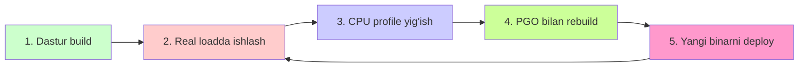
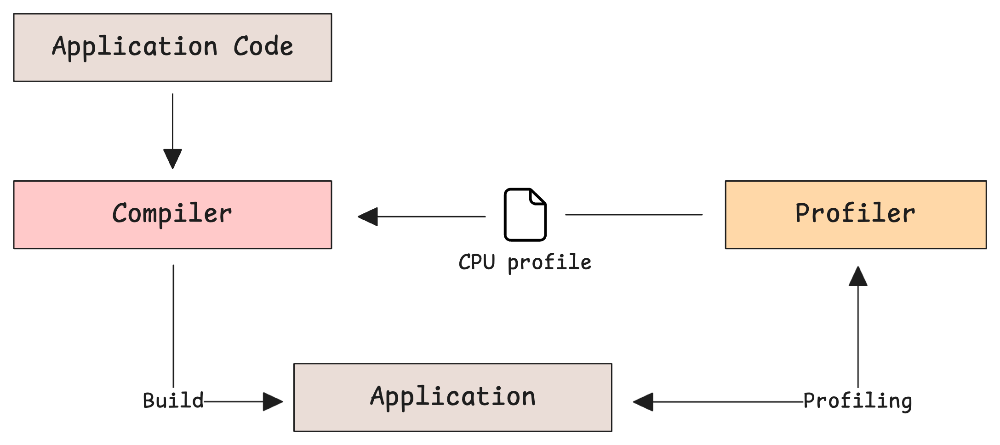
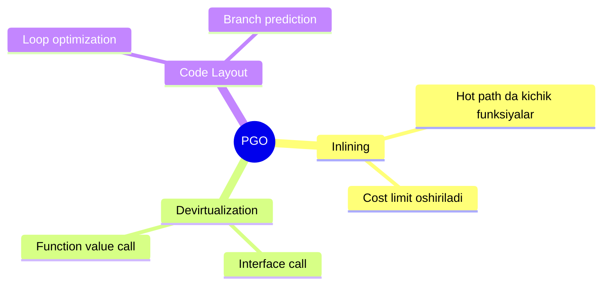
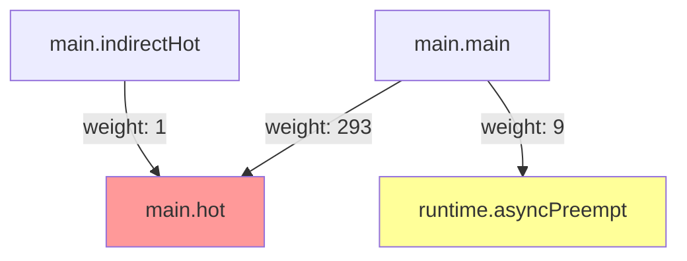
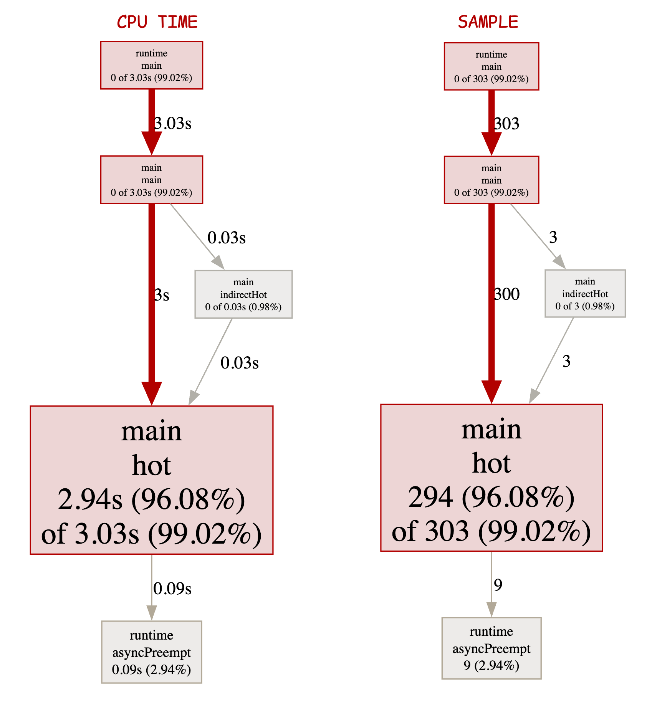
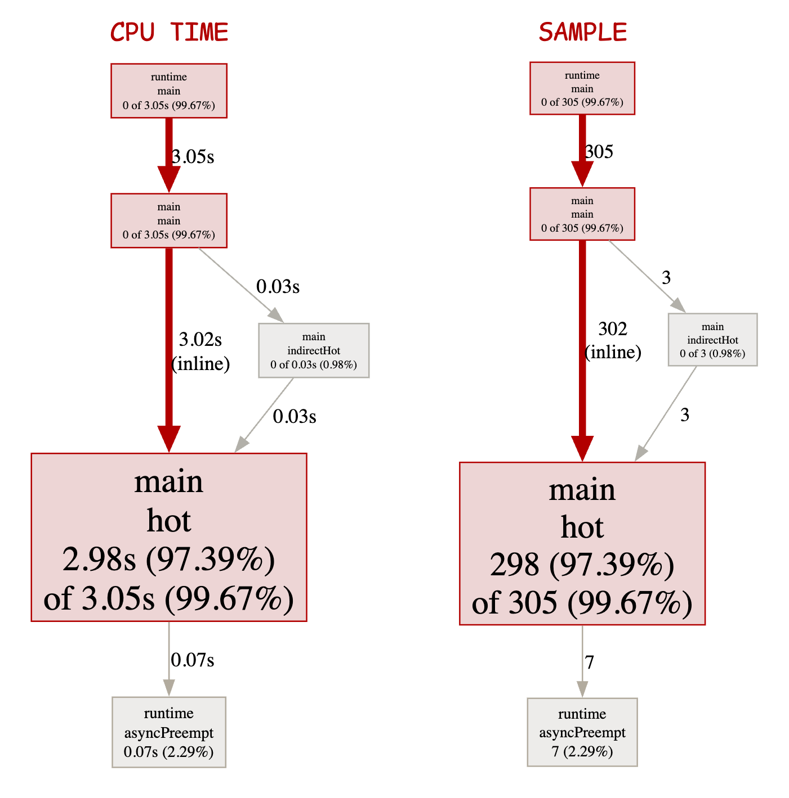

# 7. Profile-Guided Optimization (PGO): profil bilan optimizatsiya

> Ushbu material — Anatomy of Go kitobining 6-bobi mavzulari asosida o'zbek tilida tayyorlangan o'quv qo'llanma. Bu yerda mavzular o'z so'zlarim bilan tushuntirilgan, asl matnning so'zma-so'z tarjimasi emas.

## Nima uchun bu mavzu muhim?

Tasavvur qiling, oshpaz har xil taomlarni tayyorlaydi. Birinchi marta — hamma taomga teng vaqt sarflaydi. Lekin bir oydan keyin u biladi: 80% mehmon **palov** buyurtma qiladi. Endi oshpaz **palov tayyorlash uslubini optimizatsiya qiladi** — chunki uni eng ko'p tayyorlaydi.

**Profile-Guided Optimization (PGO)** — Go kompilyatorining xuddi shu yondashuvi:

1. Avval dastur ishga tushadi — qaysi qism "hot" (ko'p ishlatiladigan) ekanligini bilmaymiz
2. Profile yig'amiz — qaysi yo'l hot ekanligini bilamiz
3. Profile'ni kompilyatorga **qaytarib** beramiz
4. Kompilyator **hot path'ni inline qiladi**, **devirtualize qiladi** va h.k.

Natija: **5-15% CPU vaqt tejash** — hech qanday kod o'zgarishi bo'lmasa ham!

## PGO siklli jarayoni





## PGO tarixi

- **Go 1.20** (Fevral 2023): PGO **birinchi marta** kiritildi (preview).
- **Go 1.21**: Standart bo'ldi va **devirtualization** qo'shildi.
- **Go 1.22**: Yana yaxshilanishlar.

PGO Uber'dagi Raj Barik'ning ishidan boshlangan.

## PGO nima qiladi?

PGO Go kompilyatoriga uchta asosiy optimizatsiya turini taklif qiladi:

### 1. Inlining (funksiyani joyiga qo'yish)

Inlining — bu kichik funksiyalarni chaqirish o'rniga ularning kodini bevosita ishlatuvchi joyga ko'chirish.

**Inline'siz:**
```go
func add(a, b int) int { return a + b }

func main() {
    x := add(1, 2)
}
```

**Kompilyator inline qilsa:**
```go
func main() {
    x := 1 + 2  // add() chaqirilmaydi
}
```

PGO yordamida kompilyator **hot path**ni biladi va u erdagi funksiyalarni **inline qiladi** (hatto bu funksiyalar normal sharoitda inline qilinmas edi).

### 2. Devirtualization (interface'ni konkret qilish)

Interface chaqiriqlari **sekin** — chunki har safar `vtable` orqali asl funksiyani topish kerak. Lekin agar profile aytsa "bu interface 95% holatlarda `*ConcreteA` turi bo'lib chaqiriladi", kompilyator buni **bevosita chaqiriqqa** aylantira oladi:

**Devirtualizatsiyasiz:**
```go
type Animal interface {
    Sound() string
}

func makeSound(a Animal) {
    fmt.Println(a.Sound())  // virtual call
}
```

**Devirtualizatsiyadan keyin (profile asosida):**
```go
func makeSound(a Animal) {
    if dog, ok := a.(*Dog); ok {  // 95% holatda *Dog
        fmt.Println(dog.Sound())  // direct call!
    } else {
        fmt.Println(a.Sound())     // fallback
    }
}
```

### 3. Code layout va loop optimizatsiyasi

Kichikroq optimizatsiyalar — sikl kodi joylashuvi, branch prediction'larni yaxshilash.



## PGO'ni amaliyotda qo'llash

Bu jarayon juda oddiy — atigi **bir necha buyruq**.

### 1-qadam: Oddiy dasturni build qilish

```go
package main

import (
    "fmt"
    "os"
    "runtime/pprof"
    "time"
)

func hot() {
    x := 0
    for i := 0; i < 100_000_000; i++ {
        x += i
    }
    fmt.Sprintln("ish bajarildi") // inline'ga qarshi
}

func cold() {
    time.Sleep(5 * time.Millisecond)
}

func main() {
    f, _ := os.Create("cpu.prof")
    defer f.Close()
    pprof.StartCPUProfile(f)
    defer pprof.StopCPUProfile()

    for i := 0; i < 150; i++ {
        hot()
        cold()
    }
}
```

```bash
$ go build -o main main.go
$ ./main
```

Bu `cpu.prof` faylni yaratadi.

### 2-qadam: Profile'ni `default.pgo` deb nomlash

Bu eng oson yo'l — kompilyator avtomatik topadi:

```bash
$ mv cpu.prof default.pgo
```

### 3-qadam: PGO bilan qayta build

```bash
$ go build -o main main.go
```

**Hech qanday flag kerak emas!** Go 1.21'dan boshlab, `default.pgo` fayli paket ildizida bo'lsa — avtomatik PGO ishlatadi.

### Manual PGO flag'lari

Agar siz boshqa profile faylini ishlatmoqchi bo'lsangiz:

```bash
# Maxsus profil
$ go build -pgo=cpu.pprof -o main main.go

# Auto-detect (default)
$ go build -pgo=auto -o main main.go

# PGO ni o'chirish
$ go build -pgo=off -o main main.go
```

## PGO ichida nima sodir bo'ladi?

### `preprofile` asbobi

Go build paytida birinchi qadam — `preprofile` asbobi orqali profilni **kompilyatorga moslashtirilgan formatga** aylantirish:

```bash
$ go tool preprofile -i default.pgo -o pgo.preprofile
```

`preprofile` faylining ko'rinishi:

```
GO PREPROFILE V1
main.main
main.hot
14 293
main.hot
runtime.asyncPreempt
2 9
main.indirectHot
main.hot
1 1
```

Bu format quyidagicha:
- `GO PREPROFILE V1` — header
- Har 3 qator bir kombinatsiya:
  - **caller** funksiyasi
  - **callee** funksiyasi
  - **call site offset** va **edge weight**

### Edge weight nima?

`main.main → main.hot 14 293` ni o'qish:
- Profilda 300 ta sample bor
- Ulardan 293 tasi `main.main → main.hot` chaqiriqida tugadi
- 7 tasi `runtime.asyncPreempt` da

**Edge weight = qancha sampleda bu chaqiriq paydo bo'lgan**. Ko'p bo'lsa — hot edge.



### Build paytida nima sodir bo'ladi?

```bash
$ go build -pgo=default.pgo -n main.go
```

Buyruq qadamlarini ko'ramiz:

```bash
1. mkdir -p $WORK/b007/                     # PGO ishi uchun direktoriya
2. tools/preprofile -o $WORK/b007/pgo.preprofile -i default.pgo
3. cp $WORK/b007/pgo.preprofile /go-build/...    # Cache
4. tools/compile ... -pgoprofile=$WORK/b007/pgo.preprofile  # Har bir paket
```

Eng asosiysi — `tool/compile`'ga `-pgoprofile` flag'i qo'shiladi. Endi kompilyator profile asosida qarorlar qabul qiladi.

### Inlining qaroriga ta'sir

Default'da kompilyator **inline budget** ga ega — funksiya kompleksligi 80 dan ortmasligi kerak. PGO bu chegarani **hot funksiyalar uchun oshiradi**:

```go
// PGO'siz: cost 95 > budget 80, inline qilinmaydi
func bigFunction() {
    // ... ko'p kod
}

// PGO bilan: hot edge, budget ko'tariladi, inline qilinadi
```

## Real natija

Quyidagi misol — `main.indirectHot` orqali `main.hot` chaqiriladi:

```go
func indirectHot() {
    hot()
    fmt.Sprintln("inline'ga qarshi")
}
```

PGO'siz call graph:



PGO bilan call graph:



`main.main → main.hot` strelka **inline** deb belgilangan! Lekin `main.indirectHot → main.hot` inline qilinmagan — chunki bu yo'l hot emas.

## PGO ni qachon ishlatish kerak?

### ✅ Ishlatish kerak:

- Sizning dasturingiz **production'da** uzoq vaqt ishlaydi
- Sizda **real workload** profile yig'ish imkoni bor
- 5-15% performance ham muhim

### ❌ Ishlatish shart emas:

- Yangi proyekt — hali optimizatsiya kerak emas
- Profile sifatsiz (juda kam ma'lumot)
- Workload juda o'zgaruvchan (ertaga butunlay boshqa profile bo'ladi)

## Yaxshi amaliyotlar

### 1. Profile'ni repo'ga commit qiling

```
my-app/
├── main.go
├── go.mod
└── default.pgo   ← Repo'ga qo'shing
```

Bu siz va boshqa developerlar bilan **bir xil PGO build** olishiga sabab bo'ladi.

### 2. Profile'ni vaqti-vaqti bilan yangilang

Workload o'zgarsa — profile'ni yangilang:

```bash
# Production'dan profile yig'ish
$ curl https://prod.app/debug/pprof/profile?seconds=120 > new.pgo
$ mv new.pgo default.pgo
$ git commit -m "Update PGO profile from prod"
```

### 3. Profile sifatini tekshirish

Eski yoki sifatsiz profile **ziyon keltirishi** mumkin. Tekshirish:

```bash
$ go tool pprof default.pgo
(pprof) top
```

Agar siz kutgan funksiyalarni ko'rsangiz — yaxshi. Bo'lmasa — yangidan yig'ing.

## Hech bir kamchiligi yo'qmi?

PGO juda yaxshi, lekin diqqat:

1. **Build vaqti uzayadi** — kompilyator ko'proq tahlil qiladi
2. **Binary hajmi oshishi mumkin** — ko'p inline = ko'p kod
3. **Profile sifatsiz bo'lsa — zarar** — noto'g'ri yo'lni hot deb belgilaydi
4. **Workload o'zgarsa eskirgan profile** zarar keltiradi

## Eslab qol

- **PGO** = Profile-Guided Optimization. Profile asosida kompilyator yaxshi qarorlar qabul qiladi.
- 3 ta asosiy optimizatsiya: **inlining**, **devirtualization**, **code layout**.
- Foydalanish oson: `cpu.prof` ni `default.pgo` deb nomlang va build qiling.
- Go 1.21+ avtomatik aniqlaydi.
- 5-15% performance yutuqlari mumkin.
- Profile sifati muhim — eski yoki sifatsiz bo'lsa zarar keltiradi.
- Profilni repo'ga commit qiling.

## Tez-tez uchraydigan xatolar

### 1. PGO'siz profile yig'ish

PGO ishlashi uchun **CPU profile** kerak (heap emas). To'g'ri:

```bash
$ curl http://prod/debug/pprof/profile?seconds=60 > default.pgo
```

Xato:
```bash
$ curl http://prod/debug/pprof/heap > default.pgo  # Bu ishlamaydi!
```

### 2. Profile'ni unutish

```bash
$ go build .  # default.pgo yo'q
```

Bu PGO'siz build qiladi. Tekshirish:

```bash
$ go build -pgo=default.pgo -gcflags="-m=2" . 2>&1 | head
```

Inline qarorlarini ko'rasiz.

### 3. Eski profile

6 oydan eski profile — ehtimol noto'g'ri. Yangilang.

## Amaliyot

### 1-mashq: Sodda PGO

Yuqoridagi `hot()`/`cold()` misolini ko'chirib oling. PGO'siz va PGO bilan build qilib **vaqt taqqoslang**:

```bash
$ time ./main_no_pgo
$ time ./main_with_pgo
```

### 2-mashq: Profile'ni inspect qilish

```bash
$ go tool preprofile -i default.pgo -o pgo.preprofile
$ cat pgo.preprofile
```

Eng katta edge weight'ga ega bo'lgan call qaysi?

### 3-mashq: HTTP server bilan PGO

Kichik HTTP server yozing. `wrk` yoki `ab` bilan yuk bering. Profile yig'ing. PGO bilan rebuild qiling. Yana yuk bering — natijani taqqoslang.

```go
package main

import (
    "fmt"
    "net/http"
    _ "net/http/pprof"
)

func handler(w http.ResponseWriter, r *http.Request) {
    sum := 0
    for i := 0; i < 1_000_000; i++ {
        sum += i
    }
    fmt.Fprintf(w, "OK %d", sum)
}

func main() {
    http.HandleFunc("/", handler)
    http.ListenAndServe(":8080", nil)
}
```

```bash
# 30 soniya yuk
$ wrk -t4 -c100 -d30s http://localhost:8080/

# Profile
$ curl http://localhost:8080/debug/pprof/profile?seconds=30 > default.pgo

# Rebuild
$ go build -o server2 .

# Yana yuk
$ wrk -t4 -c100 -d30s http://localhost:8080/

# Taqqoslang
```

### 4-mashq: Inline qarorlarini ko'rish

```bash
$ go build -pgo=default.pgo -gcflags="-m=2" .
```

Output'da "inlining call to ..." satrlarini topib, qaysilarini PGO yoqqanligini aniqlang.

---

**Avvalgi mavzu:** [06_trace.md](06_trace.md) — Execution Trace
**Keyingi mavzu:** [08_summary.md](08_summary.md) — Bobning umumiy xulosasi
