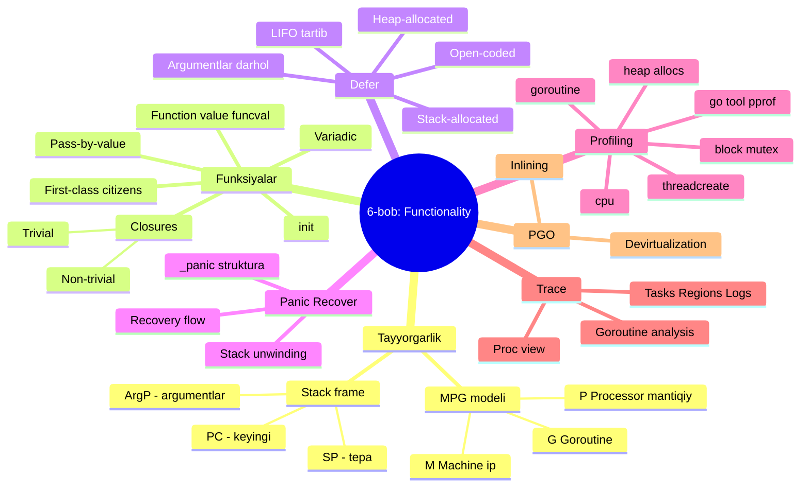
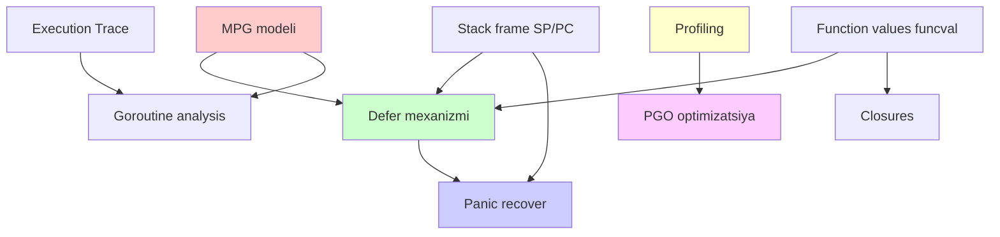
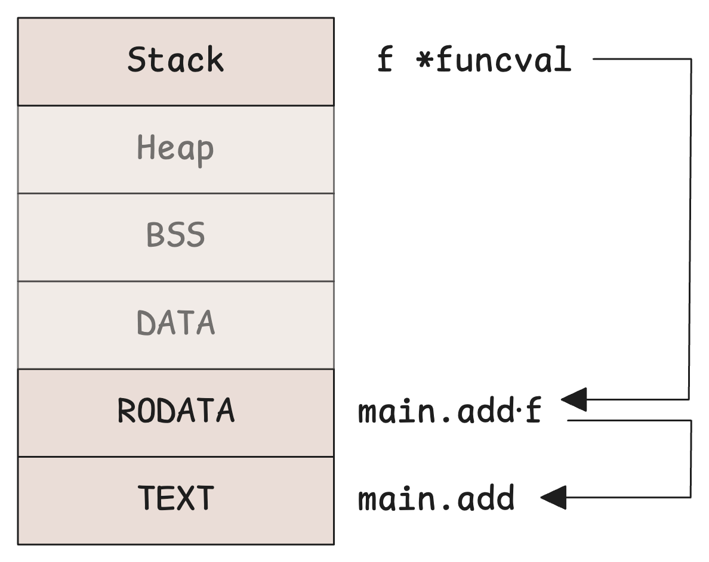
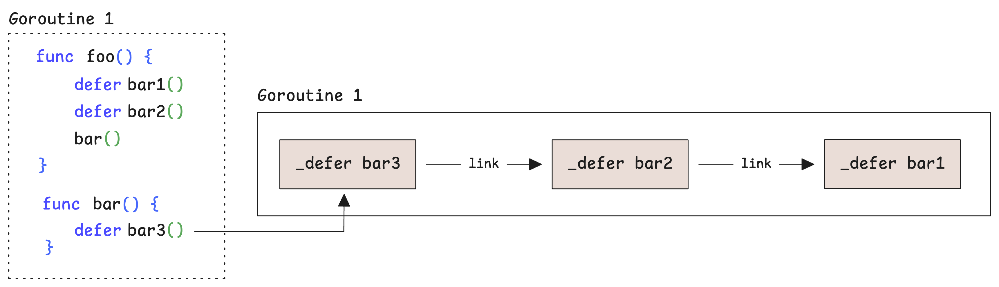
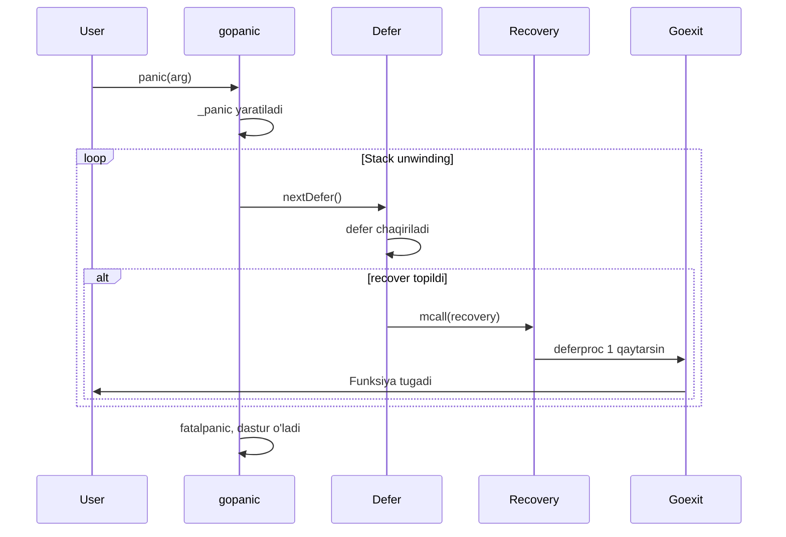

# 8. Xulosa: bobni umumlashtirish

> Ushbu material — Anatomy of Go kitobining 6-bobi mavzulari asosida o'zbek tilida tayyorlangan o'quv qo'llanma. Bu yerda mavzular o'z so'zlarim bilan tushuntirilgan, asl matnning so'zma-so'z tarjimasi emas.

## Biz nima o'rgandik?

Bu bobda biz Go'ning **funksionalligi** — ya'ni dastur qanday qilib funksiyalardan, defer'dan, panic'dan iborat ekanligi va past darajada qanday ishlashini chuqur o'rgandik. Profilash va trace yordamida esa bu mexanizmlarni "ko'rib turish" mumkin.



## Asosiy tushunchalarning bog'liqligi

Bu boblar bir-biriga juda zich bog'langan. Quyida ularning aloqasini ko'rsataman:



**Misol uchun:**

- **`defer`** ishlashi uchun `_defer` strukturasi kerak — bu strukturada **SP** (stack pointer) saqlanadi. SP esa **stack frame** tushunchasidan keladi.
- **Panic recovery** chog'ida runtime **stack unwinding** qiladi — bu MPG modelidagi G ning stack'ini bo'shatish.
- **Profiling**'da CPU profile **PC (program counter)**'larni yig'adi.
- **PGO** profil yordamida **funksiyalarni inline qilish** qarorini qabul qiladi.

## MPG modeli — boshlang'ich nuqta

Hammasi shu yerdan boshlanadi:

| Qism | Vazifa |
|------|--------|
| **M** | OS ip, haqiqiy CPU ustida ishlaydi |
| **P** | Mantiqiy protsessor token, ip Go kodi ishlatishi uchun zarur |
| **G** | Yengil goroutine, M+P ustida bajariladi |

System call paytida M o'z P'sini boshqa M ga beradi — boshqa goroutine'lar bloklanmaydi.

## Stack frame'ning anatomiyasi

Funksiya chaqirilganda — kichik xotira parchasi (frame) ajratiladi:

- Stack **pastga o'sadi** (yuqori manzildan past manzilga)
- **SP** — tepani (eng past manzil) ko'rsatadi
- **PC** — keyingi buyruq manzili
- **ArgP** — argumentlar boshlanish nuqtasi
- AMD64'da return address **stekka** saqlanadi, ARM64'da **link registriga (R30)**

## Funksiyalar — birinchi darajali fuqarolar

Go'da funksiya `funcval` strukturasi orqali ifodalanadi:

```go
type funcval struct {
    fn uintptr  // funksiya kod manzili
    // ... agar closure bo'lsa, ushlangan o'zgaruvchilar
}
```



**Closure'larning 2 turi:**

- **Trivial** (tashqi o'zgaruvchi yo'q) — `funcval` RODATA'da, bir marta yaratiladi
- **Non-trivial** (tashqi o'zgaruvchi bor) — `funcval` runtime paytida yaratiladi

**Capture qoidasi (kompilyator avtomatik):**

By **value** — agar:
1. Manzili olinmasa
2. Re-assign qilinmasa
3. < 128 bayt bo'lsa

Aks holda — by **reference** (pointer orqali).

## Defer — uchta dunyo

`defer` chuqur va murakkab. Eng tezdan eng sekingacha:

| Tur | Mexanizm | Tezlik |
|-----|----------|--------|
| **Open-coded** | Inline kod, bitmap (`deferBits`) | Eng tez |
| **Stack-allocated** | `_defer` stekda, `deferprocStack` | O'rtacha |
| **Heap-allocated** | `_defer` heap'da, `deferproc` + `deferpool` | Eng sekin |



**Eng asosiy qoida:** argumentlar **darhol** hisoblanadi, lekin chaqiriqning o'zi **funksiya tugashi oldidan** amalga oshadi.

## Panic & Recover — runtime sehri



**Asosiy nuqtalar:**

- `recover()` faqat `defer` ichida ishlaydi
- Panic'dan keyin funksiya tugaydi (panic nuqtasidan davom etmaydi)
- Nomli qaytaruvchi qiymat orqali real natija berish mumkin
- `panic(nil)` Go 1.21+ da `*PanicNilError`'ga aylanadi

## Profiling — dasturni o'lchash

**6 ta asosiy profile turi:**

| Profile | Default | Qachon ishlatish |
|---------|---------|------------------|
| `heap` | Yoqiq | Memory leak topish |
| `allocs` | Yoqiq | Allocation hot spot |
| `cpu` | Manual | CPU bottleneck |
| `goroutine` | Yoqiq | Goroutine leak/deadlock |
| `block` | Manual | Channel/sync block |
| `mutex` | Manual | Lock contention |

**3 yo'l bilan yig'iladi:**
1. `go test -cpuprofile`
2. `runtime/pprof` API
3. `net/http/pprof` HTTP endpoint

Tahlil: `go tool pprof -http=:8080 profile.prof`

## Execution Trace — vaqt bo'yicha kuzatish

Profile **statistika**, trace **kino**.

Trace yozadi:
- **Scheduling** — goroutine yaratish/blocklash/uyg'otish
- **Network** — I/O voqealar
- **Syscalls** — OS chaqiriqlari
- **GC** — Mark, Sweep, STW
- **User events** — `Task`, `Region`, `Log`

`go tool trace`'da:
- **Proc View** — har bir P uchun timeline
- **Goroutine analysis** — funksiya bo'yicha statistika
- **Network/Sync block** — qaerda kutib qoldik

**Trace og'ir** — production'da uzoq vaqt yoqib qo'ymang!

## PGO — kompilyatorga maslahat

Profile-Guided Optimization sikli:

```
1. Build → 2. Run → 3. Profile yig' → 4. PGO bilan rebuild → 5. Deploy → ... 
```

Asosan **3 ta optimizatsiya:**

1. **Inlining** — hot funksiyalarni joyiga qo'yish
2. **Devirtualization** — interface chaqiriqni bevosita qilish
3. **Code layout** — sikllar, branch prediction

Foydalanish: `default.pgo` faylini paket ildizida saqlang. Go 1.21+ avtomatik aniqlaydi.

Natija: 5-15% CPU vaqt tejash.

## Hammasini bog'laymiz: real misol

Tasavvur qiling, sizda HTTP server bor:

```go
http.HandleFunc("/api", func(w http.ResponseWriter, r *http.Request) {
    defer func() {  // <-- defer (open-coded)
        if rec := recover(); rec != nil {  // <-- panic recover
            log.Println(rec)
            http.Error(w, "Server error", 500)
        }
    }()

    user := authenticate(r)        // hot path (PGO inline qiladi)
    data := loadData(user.ID)      // DB call — bloklanadi (block profile)
    json.NewEncoder(w).Encode(data) // allocation (heap profile)
})
```

Ushbu kod 6-bobning deyarli **hamma tushunchalarini** ishlatadi:

- **`defer`** — open-coded, panic recovery uchun
- **`panic/recover`** — server tushib qolmasligi uchun
- **`closure`** — handler funksiya `w`, `r` ni ushlab oladi
- **HTTP server** — minglab goroutine'lar (MPG)
- **Profile** — qaerda sekin?
- **Trace** — har bir request qancha vaqt?
- **PGO** — hot path'larni inline qilish

## Eslab qol — 6-bobning oltin qoidalari

### 1. MPG modelini tushunish — hammasining asosi
Goroutine'lar OS ip emas. `GOMAXPROCS` ip sonini cheklamaydi, balki bir vaqtda ishlatilishi mumkin bo'lgan P sonini cheklaydi.

### 2. Funksiya — qiymat
Funksiyani o'zgaruvchiga tayinlash mumkin. Closure'lar tashqi o'zgaruvchilarni ushlab oladi.

### 3. Defer — kichik, lekin og'ir
Sodda defer (open-coded) — deyarli bepul. Loop'dagi defer — qimmat. Iloji boricha sodda saqlang.

### 4. Panic — istisno, error — odatiy
`panic` faqat haqiqatan ham g'ayrioddiy holatlar uchun. Foydalanuvchi xatosi yoki I/O xatosi uchun `error` qaytaring.

### 5. Recover — har bir goroutine uchun
Goroutine ichidagi panic butun dasturni o'ldiradi. Har bir goroutine'ni himoyalang.

### 6. Profile — birinchi bosqich
Optimizatsiyadan oldin **profile yig'ing**. "Pre-mature optimization is the root of all evil."

### 7. Trace — concurrency tahlili uchun
Goroutine bog'liqliklarini, deadlock, blocking — bularni profile ko'rsata olmaydi. Trace ko'rsatadi.

### 8. PGO — bepul yutuq
Hech qanday kod o'zgartirmasdan 5-15% tejash mumkin. Production'dan profile yig'ing.

## Keyingi qadamlar

Bu bobda biz Go'ning **funksionalligi**ni o'rgandik. Keyingi boblarda:

- **7-bob:** Memory — heap, stack, garbage collection
- **8-bob:** Concurrency — channels, mutex, scheduler chuqurroq
- **9-bob:** Network — TCP, HTTP, gRPC

Bu boblar 6-bobda o'rgan tushunchalarni yana chuqurroq tushuntiradi. Stack frame, goroutine scheduling, defer ichidagi escape analysis — bularning hammasi keyingi boblarda yana ko'rinadi.

## Tavsiya etilgan amaliyot

1. **Kichik proyekt yarating:** HTTP server, qaysi 6-bobning hamma tushunchalarini ishlatsin (defer, panic recover, closure, init).

2. **Profile yig'ing:** O'sha proyektni ishga tushirib, CPU/memory profile oling. Bottleneck topishga harakat qiling.

3. **Trace yig'ing:** O'sha proyektni trace bilan ishlatib, `go tool trace` UI'da tahlil qiling.

4. **PGO ishlatib ko'ring:** Profile'ni `default.pgo` qilib build'ni taqqoslang.

5. **Real ochiq kodni o'qing:** Masalan, Caddy, Hugo, Kubernetes kabi loyihalarda — `defer`, `recover`, profile endpoint'larini topib o'rganing.

---

**Avvalgi mavzu:** [07_pgo.md](07_pgo.md) — PGO
**Keyingi mavzu:** [09_references.md](09_references.md) — Manbalar
