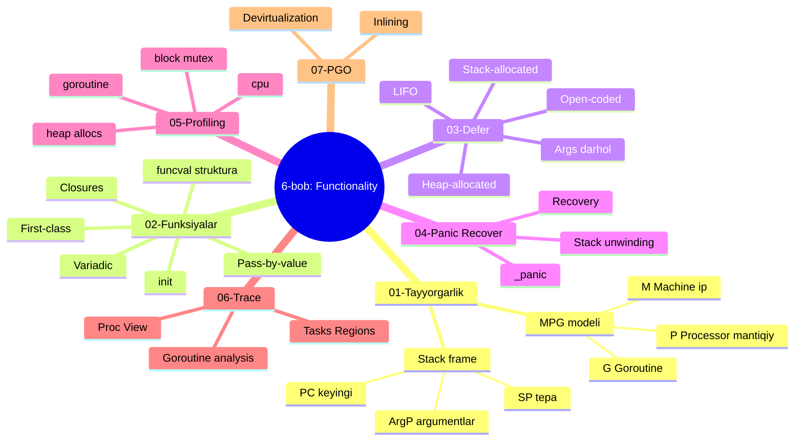
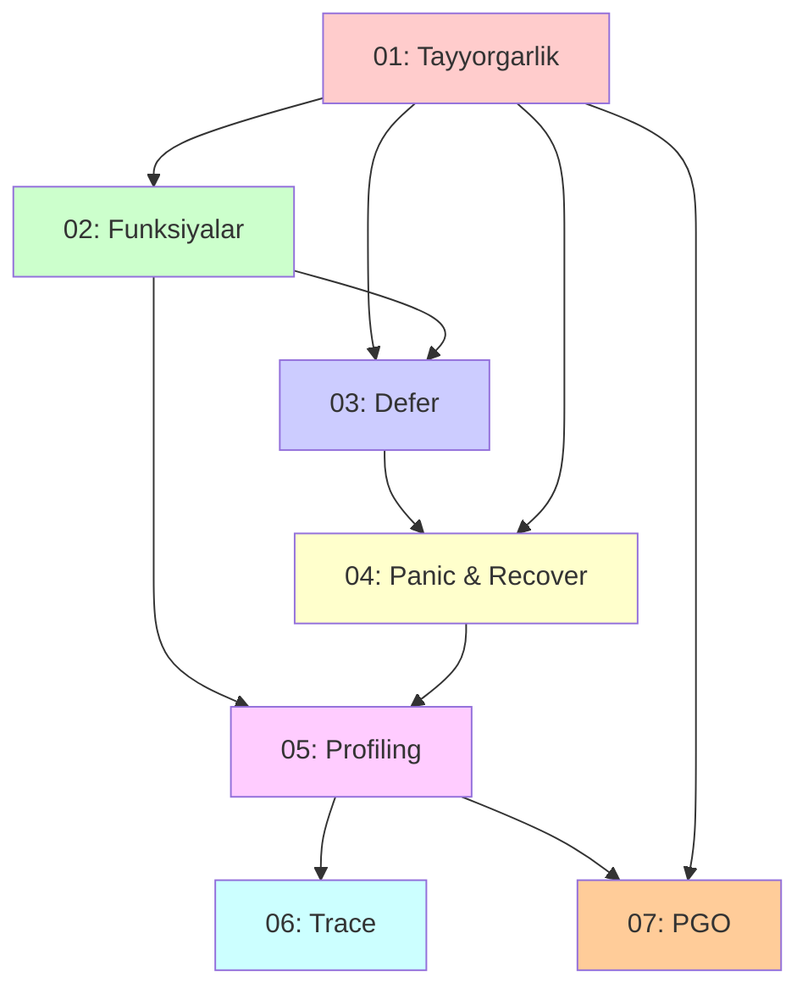

# 6-bob: Functionality (Funksionallik)

> **The Anatomy of Go** kitobining 6-bobi — o'zbek tilidagi to'liq o'quv qo'llanma.
> Bu materiallar asl kitobning so'zma-so'z tarjimasi emas, balki o'qilib tushunilgandan keyin **o'z so'zlarim bilan qayta tushuntirilgan** versiyasi.

## Bob haqida

Bu bob Go tilining funksionalligini past darajada — runtime, kompilyator, registrlar darajasida o'rgatadi. Ya'ni: **funksiya nima**, **defer qanday ishlaydi**, **panic qaerda yashaydi**, va sizning dasturingizni qanday qilib **profile va trace qilish** mumkin.

Bobni o'qib chiqib, siz quyidagi savollarga javob bera olasiz:

- Goroutine qanday qilib OS ipi ustida ishlaydi? (MPG modeli)
- `f := add` deganda xotirada nima sodir bo'ladi? (`funcval` strukturasi)
- Closure tashqi o'zgaruvchini "qanday" ushlaydi — qiymat orqali yoki ma'lumotnoma orqali?
- `defer` 3 xil bo'lishi mumkinmi? (open-coded, stack, heap)
- Panic chaqirilganda runtime nima qiladi? Recover qaerda ishlaydi?
- Memory leak'ni qanday topish mumkin? (`heap` profile)
- Goroutine'lar bir-biriga ta'sirini qanday ko'rish mumkin? (trace)
- PGO bilan dastur qanday tezlashadi?

## Mundarija

| # | Mavzu | Asosiy tushunchalar |
|---|-------|---------------------|
| [01](01_preliminaries.md) | **Tayyorgarlik** | MPG modeli, Stack frame, SP/PC/ArgP |
| [02](02_functions.md) | **Funksiyalar** | First-class citizens, closure, variadic, init, `funcval` |
| [03](03_defer.md) | **Defer** | LIFO, 3 xil implementatsiya, `_defer` linked list |
| [04](04_panic_recover.md) | **Panic & Recover** | Stack unwinding, `_panic`, `recovery`, runtime ichi |
| [05](05_profiling.md) | **Profiling** | heap/cpu/goroutine/block/mutex profile, `go tool pprof` |
| [06](06_trace.md) | **Trace** | Timeline, Proc View, Tasks/Regions, `go tool trace` |
| [07](07_pgo.md) | **PGO** | Profile-Guided Optimization, inlining, devirtualization |
| [08](08_summary.md) | **Xulosa** | Bobning umumiy taqqoslamasi |
| [09](09_references.md) | **Manbalar** | Asl havolalar, qo'shimcha o'qish, asboblar |

## Bo'limning umumiy konsept xaritasi

## Mavzular bog'liqligi

## Boshlash uchun tavsiya

Agar siz Go'da yangi bo'lsangiz — fayllarni **tartib bilan** o'qing:

1. **Birinchi navbatda:** [01_preliminaries.md](01_preliminaries.md) — tayyorgarlik
2. **Funksiyalar:** [02_functions.md](02_functions.md) — bu o'zaro asos
3. **Defer:** [03_defer.md](03_defer.md) — kunda ishlatadigan vosita
4. **Panic/Recover:** [04_panic_recover.md](04_panic_recover.md) — xato boshqaruvi
5. **Profiling:** [05_profiling.md](05_profiling.md) — sekinlikni topish
6. **Trace:** [06_trace.md](06_trace.md) — concurrency tahlili
7. **PGO:** [07_pgo.md](07_pgo.md) — bepul tezlik
8. **Xulosa:** [08_summary.md](08_summary.md) — hammasini bog'lash
9. **Qo'shimcha:** [09_references.md](09_references.md) — chuqurroq o'rganish

Agar siz allaqachon Go'da tajribali bo'lsangiz — istalgan mavzudan boshlashingiz mumkin.

## Har bir bo'limda bor

Har bir markdown fayl quyidagi tuzilmaga ega:

- **Nima uchun bu mavzu muhim?** — motivatsiya
- **Asosiy konseptlar** — sodda til bilan tushuntirish
- **Mermaid diagrammalar** — vizualizatsiya
- **Real Go kodi misollari** — `go run` qilinadigan
- **Asl rasmlar** — kitobdan (xona izohlari bilan)
- **Eslab qol** — eng asosiy nuqtalar
- **Tez-tez uchraydigan xatolar** — yangi boshlovchilar uchun
- **Amaliyot** — o'zingizni sinash uchun mashqlar

## Manba va kitobning o'zi

Bu o'quv qo'llanma quyidagi manba asosida tayyorlangan:

- **Asl kitob:** *The Anatomy of Go* (Phuong Le)
- **6-bob:** Functionality

Asl HTML fayllar `sections/` papkasida saqlangan, rasmlar `images/` papkasida.

## Mualliflik haqida

- O'zbek tiliga moslashtirish va qayta tushuntirish: Claude (Anthropic AI) yordamida
- Foydalanuvchi: Quvonchbek (`otajonoov@gmail.com`)
- Sana: 2026-05-10

---

**Boshlash:** [01_preliminaries.md](01_preliminaries.md) →

Hulosa:

1. Pass-by-value: Go'da hamma narsa nusxa orqali uzatiladi

Savollar

1. Funksiyalar — birinchi darajali fuqarolar (First-Class Citizens). Bu nima degani?