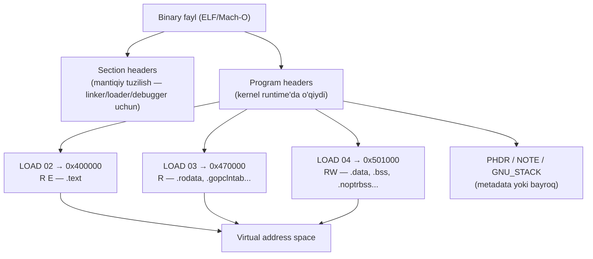
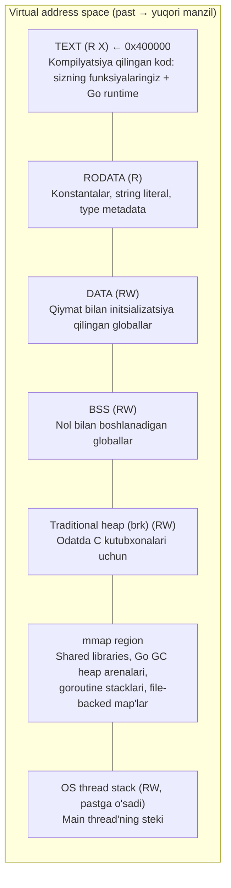
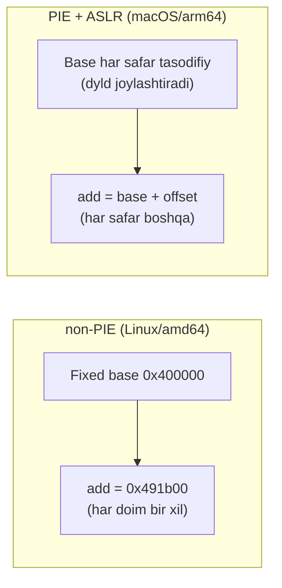
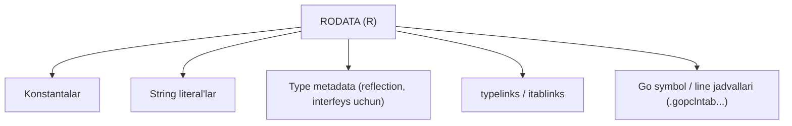
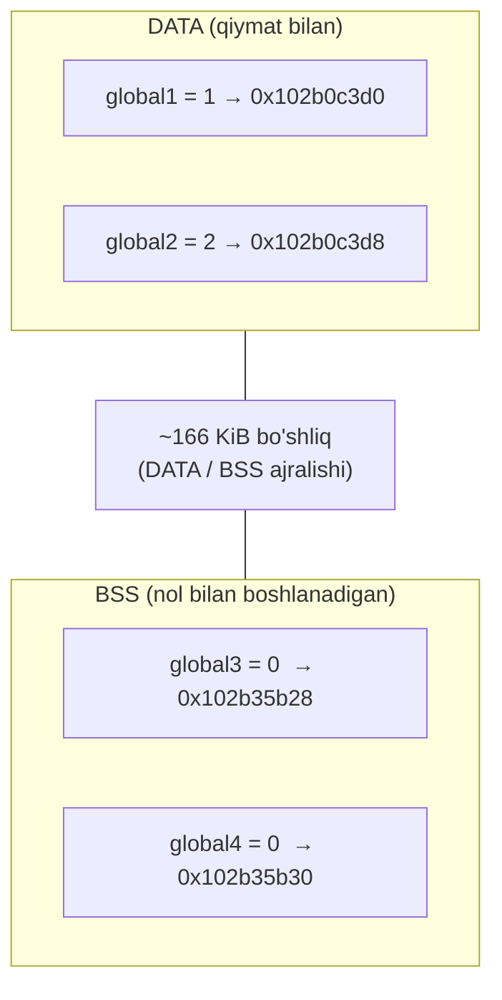

# 01 — Binary & Memory

> Ushbu material — *The Anatomy of Go* (Phuong Le) kitobining 7-bobi asosida o'zbek tilida tayyorlangan o'quv qo'llanma. Mavzular so'zma-so'z tarjima emas, balki o'qib tushunilgandan keyin **o'z so'zlarim bilan** qayta tushuntirilgan. Texnik atamalar (binary, section, segment, heap, stack, page...) asl inglizcha ko'rinishida qoldirilgan.

## Nima uchun bu mavzu muhim?

Siz `go build` qilib bitta `main` fayl olasiz. Uni ishga tushirsangiz — u xotirada "yashaydi". Lekin bu fayl xotiraga qanday joylashadi? Nega bir xil funksiyaning manzili Linux'da har doim bir xil, macOS'da esa har safar boshqacha? Nega `var x int` va `var y = 5` xotirada butunlay boshqa joyda saqlanadi?

Bu savollarga javob bermasdan turib, keyingi mavzular — heap, stack, escape analysis, garbage collector — sehr bo'lib ko'rinadi. Chunki ularning hammasi shu bitta poydevorga tayanadi: **binary qanday qismlarga bo'linadi va kernel uni virtual xotiraga qanday joylashtiradi**.

Bu bo'limni o'qib bo'lgach, siz quyidagilarga javob bera olasiz:

- `go build` natijasidagi fayl qanday `section`larga bo'linadi?
- Kernel qaysi qismlarni xotiraga yuklaydi, qaysilarini yo'q?
- TEXT, RODATA, DATA, BSS — bularning har biri nima uchun?
- Nega Go global ma'lumotni `data`/`noptrdata`, `bss`/`noptrbss` deb ikkiga ajratadi?
- `heap` va `stack` virtual xotirada qayerda joylashgan?

---

## Binary kernel tomonidan virtual xotiraga qanday joylashtiriladi

Go dasturi ishga tushganda kernel bajariluvchi faylni (executable) jarayonning **virtual address space**iga joylashtiradi (map qiladi). Muhim nuqta: faylning har bir bayti xotiradagi obraz (in-memory image)ga aylanmaydi, va hatto joylashtirilgan qismlar ham odatda **talab bo'yicha, sahifama-sahifa** (page-by-page on demand) yuklanadi.

Buni tushunish uchun binary'ning o'z tuzilishiga qaraymiz. `go build` qilganda natijaviy fayl **section**larga bo'linadi. Ularni oddiy buyruq bilan ko'rish mumkin:

```bash
# Linux arm64/amd64
$ readelf -S main

# Darwin arm64
$ otool -l main
```

Arxitekturaga qarab tartib biroz farq qiladi, lekin asosiy section'lar bir xil qoladi. Linux (ELF) va Darwin (Mach-O) nomlari quyidagicha mos keladi:

| Linux (ELF) | Darwin (Mach-O) |
| --- | --- |
| `.text` | `__text` |
| `.rodata` | `__rodata` |
| `.typelink` | `__typelink` |
| `.itablink` | `__itablink` |
| `.noptrdata` | `__noptrdata` |
| `.data` | `__data` |
| `.bss` | `__bss` |
| `.noptrbss` | `__noptrbss` |

### Section headers va bayroqlar

Bular **section headers** deb ataladi. Section header faylning **mantiqiy tuzilishini** tasvirlaydi: qaysi section'lar bor (kod, ma'lumot, symbol table, debug ma'lumoti) va ular faylning qayerida. Bu asosan **linker, loader va debugger** kabi vositalar uchun kerak — ular faylni batafsil tushunishi lozim.

Har bir section'ning `flags`i (bayroqlari) uning xotiradagi maqsadini va ruxsatlarini bildiradi:

```
Sections          Flags
[ 1] .text        AX
[ 2] .rodata      A
...
[ 9] .noptrdata   WA
[10] .data        WA
[11] .bss         WA
[12] .noptrbss    WA
```

Bayroqlar ma'nosi:

- **A** (allocatable) — section jarayonning virtual address space'ida mavjud bo'lishi kerak.
- **X** (executable) — section CPU bajara oladigan instruksiyalarni saqlaydi (masalan `.text`).
- **W** (writable) — section o'zgartirilishi mumkin bo'lgan ma'lumotni saqlaydi (masalan `.data`, `.bss`dagi global o'zgaruvchilar).

Muhim nozik nuqta: **A** bayrog'i faqat "linker bu section'ni loadable segment'ga joylashtirishi *mumkin*" degani, xolos. Xotiraga aslida nima yuklanishini **section header emas, `program header`lar** hal qiladi.

### Program headers va segmentlar

Kernel faylni yuklashda `program header`larni o'qiydi — u yerdan segment manzillari, xotira o'lchamlari va ruxsatlar (read/write/execute)ni topadi. Linux/amd64 uchun namuna:

```
$ readelf -l main

Program Headers:
  Type    Offset    VirtAddr    FileSiz    MemSiz    Flags
  PHDR    0x40      0x400040    0x150      0x150     R
  NOTE    0xf78     0x400f78    0x64       0x64      R
  LOAD    0x0       0x400000    0x6fb31    0x6fb31   R E
  LOAD    0x70000   0x470000    0x90d38    0x90d38   R
  LOAD    0x101000  0x501000    0x3de0     0x38ac0   RW
  GNU_STACK 0x0     0x0         0x0        0x0       RW

 Section to Segment mapping:
   02  .text .note.gnu.build-id .note.go.buildid
   03  .rodata .typelink .itablink .gosymtab .gopclntab
   04  .go.buildinfo .go.fipsinfo .noptrdata .data .bss .noptrbss
```

Program header'lar operatsion tizimga faylni xotiraga qanday yuklashni va **ishlaydigan jarayon** (running process) yaratishni aytadi. Ularsiz loader faylni qanday map qilishni bilmaydi.

Kernel **uchta `LOAD` segmenti** (02, 03, 04) uchun xotira map'larini yaratadi:

- **Segment 02** — bajariluvchi kodni `0x400000`dan boshlab **read + execute** ruxsati bilan yuklaydi (`.text` + build ID).
- **Segment 03** — **read-only** ma'lumotni `0x470000`dan (`.rodata`, `.typelink`, `.itablink`, `.gosymtab`, `.gopclntab`).
- **Segment 04** — **read-write** ma'lumotni `0x501000`dan (`.go.buildinfo`, `.go.fipsinfo`, `.noptrdata`, `.data`, `.bss`, `.noptrbss`).

Qolgan yozuvlar boshqacha ishlaydi:

- **PHDR** — program header jadvalining o'ziga ishora qiladi. Ko'p linker'lar bu jadvalni fayl boshiga qo'ygani uchun uning baytlari ko'pincha birinchi `LOAD` ichiga tushadi va shu tarzda map qilinadi.
- **NOTE** — build ID va boshqa metadata'ni tasvirlaydi. Baytlari odatda biror `LOAD` ichida bo'ladi, garchi yozuv turi `NOTE` bo'lsa ham.
- **GNU_STACK** — umuman fayl ma'lumoti emas. Bu shunchaki jarayon stack'i qanday ruxsatga ega bo'lishini (masalan, non-executable) bildiruvchi bayroq.



> **Eslatma:** Map qilish 1:1 emas. Bitta `PT_LOAD` segmenti ko'plab section'ni qamrab oladi, va bitta section baytlari bir necha segment bilan qamralishi mumkin. `PT_PHDR` va `PT_NOTE` kabi yozuvlar metadata bo'lsa ham, agar ular biror `PT_LOAD`ning fayl diapazoniga tushsa, xotiraga joylashadi. Masalan, `LOAD 02` `Offset 0x0`dan `0x6fb31` baytni qamrasa, `Offset 0x40`dagi PHDR va `0xf78`dagi NOTE ikkalasi ham shu diapazonga tushadi — demak ular xotiraga `LOAD 02` tufayli joylashadi.

### Nega non-allocatable section'lar saqlanadi?

Agar runtime'da nima map qilinishini program header'lar hal qilsa, nega fayl **allocatable bo'lmagan** section'larni ham saqlaydi? Ular ishga tushirilmaydi, lekin **vositalar** uchun kerak.

Aniq misol: `pprof` sample yig'ganda `program counter` (ishlab turgan instruksiya manzili)ni yozadi. Buni foydali qilish uchun u shu manzilni binary'ning debug ma'lumotida qidiradi va uni `file:line` ko'rinishiga aylantiradi (masalan `main.go:158`).

Bu ma'lumot ikki manbadan keladi:

- **`.gopclntab`** — Go'ning o'z PC/line jadvali. U `program counter`ni manba qatoriga moslashtiradi. **Xotiraga yuklanadi** (`A` bayrog'i bor), shuning uchun panic stack trace'laridagi `file:line`, `runtime.Caller()` shu jadval hisobiga ishlaydi.
- **DWARF section'lari** (`.debug_info`, `.debug_line`...) — batafsilroq, ayniqsa Go'da yozilmagan kod (C/cgo) uchun. Bular **xotiraga yuklanmaydi** — ular Go jadvali bilan standart debug vositalari orasida ko'prik.

Ikki amaliy eslatma:

- `cmd/pprof` Go funksiyalari uchun Go jadvalidan foydalanadi; manzil shu yo'l bilan hal bo'lmasa (odatda C/cgo freym), DWARF bo'lsa uni sinaydi.
- `-w` bayrog'i bilan qursangiz, linker DWARF'ni tashlaydi. Go stack trace'lari baribir ishlaydi (`.gopclntab`ga tayanadi), lekin DWARF asosidagi symbolization ishlamaydi.

---

## Virtual xotira tuzilishi (umumiy manzara)

Endi jarayon ishga tushgach virtual xotira qanday ko'rinishini ko'ramiz. Quyida soddalashtirilgan xarita:



TEXT mintaqasi PIE bo'lmagan binarilarda odatda `0x400000` (4 MiB) bazaviy manzildan boshlanadi — bu x86_64 Linux uchun keng tarqalgan kelishuv. `0x400000` null pointer (`0x0`)dan yetarli masofa qoldiradi, lekin pastki manzil maydonini ko'p iste'mol qilmaydi.

Endi har bir mintaqani alohida ko'rib chiqamiz, `TEXT`dan boshlab.

---

## TEXT — bajariluvchi kod

`TEXT` (yoki `.text`) — kompilyatsiya qilingan mashina kodi joylashgan **read + execute** mintaqa. Misol:

```go
func main() {
    fmt.Println(add)
}

//go:noinline
func add(x, y int) int {
    return x + y
}
```

`add`ni qavssiz yozganimizda uni **chaqirmaymiz** — funksiyaning o'ziga, ya'ni **function value**ga murojaat qilamiz. Amalda function value CPU shu funksiyaga **sakrash** (jump) uchun ishlatadigan manzilni saqlaydi. Chop etganda Go uni `0x491b00` kabi hex son sifatida ko'rsatadi — buni jarayon ichidagi "joylashuv" deb tasavvur qiling.

### PIE vs non-PIE: nega manzil ba'zan barqaror, ba'zan o'zgaruvchan?

Linux/amd64'da, agar binary **PIE emas** bo'lsa, dastur har safar **bir xil fixed base**ga joylashadi. Shuning uchun `main.add` manzili har ishga tushishda bir xil:

```
$ ./main
0x491b00
$ ./main
0x491b00   # har doim bir xil
```

Bu manzil qayerdan? `go tool nm` — Go binarilar uchun Unix `nm` ekvivalenti — buni ko'rsatadi:

```
$ go tool nm ./main | grep main.add
491b00 T main.add
```

`nm` uchta maydon chiqaradi: **manzil**, **tur harfi**, **symbol nomi**. `T` — symbol bajariluvchi kod maydonida yashashini bildiradi. Asosiy g'oya: **linker** har bir funksiyaga virtual manzil tanlaydi, `nm` shuni ko'rsatadi, va non-PIE binarida runtime'da ham aynan shu manzilni kuzatasiz.

macOS'da esa vaziyat boshqacha — har safar boshqa manzil chiqadi:

```
$ ./main
0x1003f4700
$ ./main
0x10230c700   # har safar boshqacha
```

Sababi: macOS/arm64'da Go binarilari **PIE** (position-independent executable). PIE binary OS uni xotirada qayerga qo'yishidan qat'i nazar to'g'ri ishlaydi.

- **ASLR** (Address Space Layout Randomization) — OS'ning ishga tushishlar orasida manzillarni ataylab tasodifiy o'zgartirish xususiyati.
- PIE bilan ASLR asosiy binary'ning **bazaviy manzilini** ham tasodifiylashtiradi: funksiya binary ichida bir xil **offset**da qoladi, lekin butun binary yangi bazaga siljiydi — shuning uchun chop etilgan yakuniy manzil har safar o'zgaradi.
- macOS'da bu siljishni dinamik loader **`dyld`** qo'llaydi.



---

## RODATA — faqat o'qiladigan ma'lumot

`RODATA (R)` — jarayon ishga tushgach OS tomonidan **faqat o'qiladigan** deb belgilangan mintaqa, uning mazmuni dastur davomida o'zgarmaydi.



Bu yerda dasturga runtime'da kerak bo'ladigan **o'zgarmas** (immutable) ma'lumot yashaydi: type metadata, runtime va sizning kodingiz ishlatadigan konstanta bloklar. Map read-only bo'lgani uchun dastur bu ma'lumotga to'g'ridan-to'g'ri xavfsiz ishora qila oladi. Yoziladigan nusxa kerak bo'lsa (masalan `string`ni `[]byte`ga aylantirganda), Go baytlarni **yoziladigan xotiraga nusxalaydi**.

Nozik nuqta: `go tool nm` bilan har bir string literal alohida symbol bo'lib ko'rinmaydi. Go linker'i har bir string konstanta uchun alohida symbol chiqarmaydi — u string ma'lumotini birlashtirib, `go:string.*` kabi **sintetik symbol** ostida beradi (butun string ma'lumot maydonini ifodalaydi).

---

## Global Data — DATA va BSS

Keyingi mintaqa — **global data**, ya'ni **package-level variable**lar joyi. U **read-write** map qilinadi, chunki global o'zgaruvchilar dastur davomida yangilanishi mumkin. Ikkita tanish qismga bo'linadi:

- **DATA (RW)** — **aniq boshlang'ich qiymati** bo'lgan globallar.
- **BSS (RW)** — **noldan boshlanadigan** globallar. BSS baytlari faylda saqlanmaydi — OS jarayon yaratganda ularni nolga initsializatsiya qiladi (bu faylni kichikroq qiladi).

### Pointer-free vs pointer-carrying: Go'ning qo'shimcha farqi

Go ko'p tillarga kerak bo'lmaydigan yana bitta farqni qo'shadi: global ma'lumotning bir qismi **pointer saqlaydimi yoki yo'qmi**. Sababi — garbage collector ko'rsatilgan obyektlarni tirik saqlash uchun pointer'larni topishi kerak, lekin **pointer yo'q** deb aniq bilingan katta xotira bloklarini word-by-word skanerlash isrof bo'ladi.

Shuning uchun linker globallarni ikkiga ajratadi:

- **`.noptrdata` va `.noptrbss`** — pointer'siz globallar. GC bularni **butunlay e'tiborsiz** qoldiradi.
- **`.data` va `.bss`** — pointer saqlashi mumkin bo'lgan globallar. GC bularni linker ishlab chiqargan metadata yordamida skanerlaydi.

```mermaid
flowchart TB
    G["Package-level global o'zgaruvchi"] --> Q1{"Boshlang'ich<br/>qiymati bormi?"}
    Q1 -->|"Ha (masalan = 5)"| DATA["DATA segmenti"]
    Q1 -->|"Yo'q (nol)"| BSS["BSS segmenti"]
    DATA --> Q2{"Pointer<br/>saqlaydimi?"}
    BSS --> Q3{"Pointer<br/>saqlaydimi?"}
    Q2 -->|Ha| D1[".data — GC skanerlaydi"]
    Q2 -->|Yo'q| D2[".noptrdata — GC e'tiborsiz qoldiradi"]
    Q3 -->|Ha| B1[".bss — GC skanerlaydi"]
    Q3 -->|Yo'q| B2[".noptrbss — GC e'tiborsiz qoldiradi"]
```



---

## Heap va Main Thread Stack

Linux'da Go dasturida heap kabi tutadigan **ikkita mintaqa** bor:

1. **brk asosidagi an'anaviy heap** — `.bss` ustida joylashadi va `malloc` kabi C kutubxonalari ishlatilganda uzluksiz o'sadi. **Go'ning o'zi bu mintaqadan ajratmaydi.**
2. **mmap region** — Go runtime o'z heap'ini **`mmap`** yordamida o'stiradi: virtual address space'ning katta bo'laklarini band qiladi (reserve), fizik xotirani esa **talab bo'yicha** (on demand) commit qiladi.

> **Eslatma:** mmap region an'anaviy ma'noda heap emas, lekin dinamik ajratish uchun ishlatiladi. Soddalashtirish uchun uni Go heap'ining bir qismi deb ko'ramiz. Bundan keyin oddiy "heap" deganda **mmap asosidagi** mintaqani nazarda tutamiz.

Go'ning heap'i — shu mintaqaning **garbage collector boshqaradigan** qismi. Bu yerda heap'da ajratilgan Go obyektlari (masalan, stack'dan **escape** qiladigan qiymatlar) yashaydi. U OS thread stack'ini yoki C kutubxonalari `malloc` orqali ajratgan xotirani o'z ichiga **olmaydi**.

### Main thread stack — gorutin steki emas

Diagrammaning tepasidagi stack — bu **OS thread stack**, gorutin steki emas. Go dasturi ishga tushganda OS boshlang'ich thread'ga (**main thread**) o'z stack'ini beradi. Go bu boshlang'ich OS stack'ini ajratmaydi va ko'chirmaydi. Gorutinlar esa runtime ajratadigan va kerak bo'lganda o'stiradigan **alohida stack**larda ishlaydi (o'z memory map'laridan foydalanib).

### Tajriba: manzillar qayerda?

```go
var global1, global2 = 1, 2   // DATA (initsializatsiya qilingan)
var global3, global4 int      // BSS (nol)

func main() {
    stack1, stack2 := 3, 4               // stack'da
    heap1, heap2 := escaped(), escaped() // heap'da (escape qiladi)

    println("initialized global1:", uintptr(unsafe.Pointer(&global1)))
    println("initialized global2:", uintptr(unsafe.Pointer(&global2)))
    println("uninitialized global3:", uintptr(unsafe.Pointer(&global3)))
    println("uninitialized global4:", uintptr(unsafe.Pointer(&global4)))
    println("stack 1:", uintptr(unsafe.Pointer(&stack1)))
    println("stack 2:", uintptr(unsafe.Pointer(&stack2)))
    println("heap 1:", uintptr(unsafe.Pointer(heap1)))
    println("heap 2:", uintptr(unsafe.Pointer(heap2)))
}

//go:noinline
func escaped() *int {
    c := 100
    return &c // manzil funksiyadan tashqariga chiqadi → heap'ga escape
}
```

Bitta ishga tushirishdagi natija:

```
initialized global1:   0x102b0c3d0
initialized global2:   0x102b0c3d8   ← global1'dan 8 bayt uzoq
uninitialized global3: 0x102b35b28   ← ~166 KiB sakrash!
uninitialized global4: 0x102b35b30   ← global3'dan 8 bayt uzoq
stack 1:               0x14000060720
stack 2:               0x14000060718
heap 1:                0x1400000e090
heap 2:                0x1400000e098
```

Nimalarni ko'ramiz:

- Global o'zgaruvchilar virtual xotiraning **pastki** qismida yashaydi — manzillari kichik.
- `global2` `global1`dan 8 bayt uzoq, `global4` `global3`dan 8 bayt uzoq — har bir juftlik **uzluksiz** saqlangan.
- `global2` va `global3` orasida **~166 KiB bo'shliq** bor. Bu **DATA va BSS segmentlari orasidagi ajralish** tufayli — o'zgaruvchi initsializatsiya qilinganmi yoki yo'qmi, shunga qarab boshqa section'da.



`stack1`, `stack2`, `heap1`, `heap2` manzillari esa **ancha yuqori**. `stack1`/`stack2` — main gorutin stекidagi lokal o'zgaruvchilar, `heap1`/`heap2` esa `escaped()` qaytargan heap'dagi integerlarga pointer. Har bir juftlik yaqin (8 bayt farq), lekin bu kafolatlanmagan — kompilyator stack freym'larni va runtime heap obyektlarni qanday joylashtirishiga bog'liq.

Ba'zan gorutin stack manzillari heap manzillaridan **pastroq** ham chiqishi mumkin. Asosiy xulosa: **gorutin steki OS thread stack'i bilan bir narsa emas**. Go kod runtime o'z memory map'larida ajratgan gorutin stack'larida ishlaydi, va bular OS bergan stack'dan address space'ning boshqa qismida bo'lishi mumkin. (Bunday yondashuv faqat Go'ga xos emas — Erlang, Kotlin coroutine'lar, fiber kutubxonalari ham shunday qiladi. Gorutin steki kod ishlaganda oddiy thread stack kabi tutadi, jumladan **pastga o'sadi**.)

---

## Mintaqalar xulosasi

| Mintaqa | Ruxsat | Nima saqlaydi |
| --- | --- | --- |
| **TEXT** | R X | Kompilyatsiya qilingan kod: sizning funksiyalaringiz + Go runtime. non-PIE Linux/amd64'da odatda `0x400000`, PIE + ASLR bilan baza o'zgaruvchan |
| **RODATA** | R | Konstantalar, string literal, type metadata |
| **DATA** | RW | Qiymat bilan initsializatsiya qilingan globallar |
| **BSS** | RW | Nol bilan boshlanadigan globallar (baytlari faylda yo'q; loader joy ajratadi, OS nol beradi) |
| **Traditional heap (brk)** | RW | `brk(2)`/`sbrk(2)` bilan o'sadigan uzluksiz mintaqa; odatda C kutubxonalari. Go bundan foydalanmaydi |
| **mmap region** | aralash | `mmap(2)` bilan map qilingan hamma narsa: shared library'lar, Go GC heap arenalari, gorutin stacklari, file-backed map'lar |
| **OS thread stack** | RW, pastga o'sadi | OS thread'ga bergan stack. Main thread OS stack bilan boshlanadi; runtime va cgo kerak bo'lganda per-thread system stack (`g0`) ishlatadi |

---

## Eslab qol

- Binary **section**larga bo'linadi. **Section header** mantiqiy tuzilishni tasvirlaydi (vositalar uchun), lekin xotiraga nima yuklanishini **program header**lar hal qiladi.
- Kernel `LOAD` segmentlarini map qiladi: **02** = TEXT (R X), **03** = RODATA (R), **04** = DATA/BSS (RW). `PHDR`, `NOTE`, `GNU_STACK` — metadata yoki bayroq.
- `.gopclntab` **xotiraga yuklanadi** (panic trace, `runtime.Caller`); DWARF **yuklanmaydi** (batafsil debug, `-w` bilan olib tashlanadi).
- **non-PIE** binarida funksiya manzili barqaror; **PIE + ASLR** bilan har ishga tushishda o'zgaradi (macOS'da `dyld` siljitadi).
- **DATA** = qiymatli globallar, **BSS** = nol globallar. Go ularni yana **pointer-free** (`.noptrdata`/`.noptrbss` — GC e'tiborsiz) va **pointer-carrying** (`.data`/`.bss` — GC skanerlaydi) qismlarga ajratadi.
- Go heap **`mmap`** asosida o'sadi, brk asosidagi heap'dan foydalanmaydi. **Main thread stack** — OS bergan stack; **gorutin stack** — runtime ajratadigan alohida stack.

## Tez-tez uchraydigan xatolar

- **"Section header xotiraga nima yuklanishini belgilaydi"** — yo'q, buni program header'lar belgilaydi. `A` bayrog'i faqat "mumkin" degani.
- **"Binary'dagi hamma bayt xotiraga yuklanadi"** — yo'q. Debug section'lar, symtab yuklanmaydi; hatto yuklangan qism ham talab bo'yicha sahifama-sahifa keladi.
- **"Funksiya manzili har doim bir xil bo'lishi kerak"** — faqat non-PIE binarida. PIE + ASLR bilan (macOS default) har safar o'zgaradi.
- **"BSS baytlari faylda saqlanadi"** — yo'q. BSS nol bo'lgani uchun faylda joy egallamaydi; OS uni runtime'da nolga to'ldiradi.
- **"Gorutin steki = OS thread steki"** — yo'q. Gorutin steki runtime memory map'ida, main thread steki esa OS bergan stack.

## Amaliyot

1. O'z mashinangizda kichik Go dastur qurib, `go tool nm ./main | grep main.main` orqali `main.main` manzilini toping. Dasturni bir necha marta ishga tushirib, manzil o'zgaradimi yoki yo'qmi kuzating — sizning platformangiz PIE'mi yoki yo'qmi, xulosa qiling.
2. Yuqoridagi tajriba kodini ishga tushiring va `global2`/`global3` orasidagi bo'shliqni o'lchang. Nega bu bo'shliq DATA va BSS ajralishidan kelib chiqishini o'z so'zlaringiz bilan tushuntiring.
3. `readelf -S main` (Linux) yoki `otool -l main` (macOS) chiqishini ko'rib, `.text`, `.rodata`, `.data`, `.bss`, `.noptrbss`, `.gopclntab` section'larni toping. Har birining bayrog'ini aniqlang.
4. Bitta pointer saqlaydigan (`var p *int`) va bitta oddiy (`var n int`) global e'lon qiling. Fikran: ular qaysi section'ga tushadi — `.bss` yoki `.noptrbss`? Nega?

---

[← README](README.md) | [Keyingi: 02 Heap →](02_heap.md)
