# 02 — Heap

> Ushbu material — *The Anatomy of Go* (Phuong Le) kitobining 7-bobi asosida o'zbek tilida tayyorlangan o'quv qo'llanma. So'zma-so'z tarjima emas — o'qib tushunilgandan keyin **o'z so'zlarim bilan** qayta tushuntirilgan. Texnik atamalar (heap, page, arena, span, size class, mmap...) asl inglizcha ko'rinishida.

## Nima uchun bu mavzu muhim?

`x := &Foo{}` yozganingizda Go xotirani qayerdan oladi? Nega ba'zi obyektlar "arzon", ba'zilari "qimmat"? Nega 1 GiB slice yaratsangiz ham dastur darhol 1 GiB RAM egallamaydi? GC obyektlar ichidagi pointer'larni qanday topadi?

Bularning barchasi Go'ning **memory allocator**iga borib taqaladi — bu Go dasturlarida xotira qanday **taqsimlanishi va qayta ishlatilishini** hal qiladigan tizim. U dastlab Google'ning **TCMalloc** (Thread-Caching Malloc)idan ilhomlangan, lekin vaqt o'tib Go ehtiyojlariga moslashib undan ajralib chiqqan. TCMalloc'dan qolgan asosiy g'oyalar: ajratishlar **size class**larga guruhlanadi va **caching qatlamlari** ishlatiladi, shuning uchun ko'p mayda ajratish tez bo'ladi va odatda global lock'ga tegmaydi. (TCMalloc'ni bilish shart emas — uni shunchaki fon deb qabul qiling.)

Bu bo'limni o'qib bo'lgach siz quyidagilarga javob bera olasiz:

- Virtual memory, page, page fault nima?
- Go virtual xotirani **arena → palloc chunk → page → span** ierarxiyasi bilan qanday boshqaradi?
- `mallocgc` obyektni **tiny / small / large** yo'llaridan qaysi biriga yuboradi?
- **mcache → mcentral → mheap** ierarxiyasi qanday ishlaydi?
- GC obyekt ichidagi pointer'larni **heap bitmap** va **malloc header** orqali qanday topadi?

---

## Virtual Memory — poydevor

> Bu bo'limni virtual memory va page'lar bilan yaxshi tanish bo'lsangiz o'tkazib yuborishingiz mumkin.

### Faqat fizik xotira bo'lganda nima muammo bo'lardi?

Deyarli barcha kompyuterlarda **fizik xotira** — bu mashinadagi DRAM. Tasavvur qiling: faqat fizik xotira bor, virtual memory yo'q, page table yo'q, hardware himoyasi yo'q. Bunday dunyoda har bir jarayon va OS bitta katta address space'ni bo'lishardi:

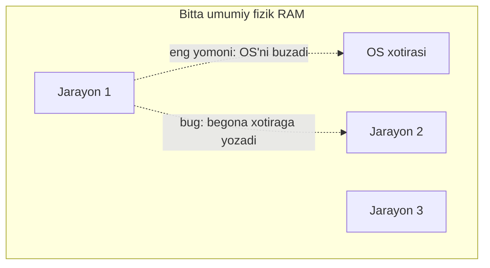

Ikki katta muammo:

- **Izolyatsiya yo'q** — bitta jarayondagi bug boshqa jarayonning yoki hatto OS'ning xotirasini o'qib/yozib, butun mashinani qulatishi mumkin.
- **Fragmentatsiya** — jarayonlar ishga tushib tugagach, ishlatilgan mintaqalar orasida **bo'sh teshiklar** qoladi. Umumiy bo'sh xotira yetarli bo'lsa ham, u mayda bo'laklarga bo'linib, keyingi jarayon uchun **uzluksiz** blok topilmaydi. Tizim RAM'ni qayta zichlashi (qimmat) yoki murakkab free list'larga tayanishi kerak bo'lardi.

### Virtual memory yechimi

Virtual memory bu muammolarni hal qiladi. Ostida hali ham bitta fizik RAM bor, lekin CPU **tarjima qatlami** qo'shadi — har bir jarayon o'zining **shaxsiy virtual address space**ini oladi:

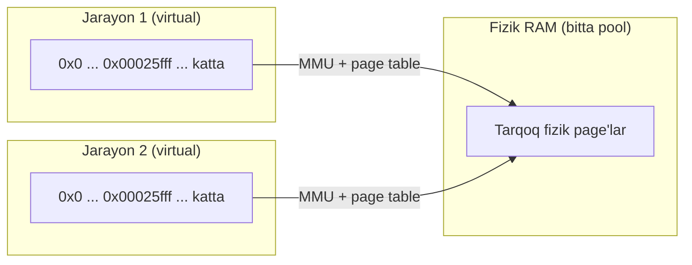

Bu qanday yordam beradi:

- **Izolyatsiya** — jarayon boshqa jarayonning ma'lumotini ko'ra/yoza olmaydi, chunki OS page table'larni shunday sozlaydiki, faqat ma'lum virtual diapazonlar amal qiladi, har birida aniq ruxsat (read/write/execute).
- **Fragmentatsiya yashiriladi** — ko'plab tarqoq fizik page'lar bitta uzluksiz virtual diapazon bo'lib ko'rinadi. OS jarayonning xotirasini fizik RAM'da qayerga tushsa, o'sha yerga qo'yadi.
- **Moslashuvchanlik** — OS kam ishlatilgan page'larni diskka **swap** qilib, keyin qaytarishi mumkin, virtual manzillarni o'zgartirmagan holda.

Oddiy user-space jarayon "xom" fizik RAM'ni to'g'ridan-to'g'ri o'qimaydi/yozmaydi. Har bir yuklash/saqlash **virtual manzil** ishlatadi, va CPU'ning **MMU** (Memory Management Unit) uni page table yordamida fizik manzilga tarjima qiladi. Shuning uchun ikki jarayon bir xil manzil (`0x00025fff`)ni so'rasa ham bir-biriga xalaqit bermaydi — bu har bir jarayonga xos virtual manzil.

64-bit tizimda bu maydon **juda katta** (ko'pincha terabaytlarda), fizik RAM'dan ancha katta. Jarayon OS "amal qiladi" deb belgilagan istalgan manzilga yuklash/saqlash qila oladi — bu manzil hozir fizik RAM bilan ta'minlanganmi, swap'ga ketganmi yoki faylga map qilinganmi, bilishi shart emas.

### Page va lazy allocation

Go misolida ko'ramiz:

```go
buf := make([]byte, 1<<30) // 1 GiB slice ajratamiz
```

1 GiB buffer ajratganda Go allocator shu slice uchun **uzluksiz 1 GiB virtual diapazon** kerak. Lekin virtual diapazonga ega bo'lish mashina sizga 1 GiB **fizik RAM** berdi degani **emas**. Go ham, OS ham xotiraga kerak bo'lmaguncha **tegmaslikka** harakat qiladi. OS anonim xotirani fizik page bilan faqat **birinchi marta tegilganda** ta'minlaydi.

```go
buf[0] = 42
```

CPU `buf[0]`ning virtual manziliga saqlash chiqaradi. Agar shu manzilni saqlaydigan page hali fizik page bilan ta'minlanmagan bo'lsa, CPU **page fault** ko'taradi. Shunda kernel fizik page ajratadi (anonim xotira uchun nol bilan to'ldirilgan), page table'ni yangilaydi va instruksiyani qaytadan bajaradi. OS fizik RAM'ni bir baytdan bermaydi — **ta'minlash birligi = page**, shuning uchun bitta baytga tegish butun page'ni ta'minlaydi.

Bu **page** — hardware va OS virtual→fizik map qilishda ishlatadigan eng kichik birlik. O'lchami OS va CPU'ga bog'liq (masalan 4 KiB yoki 16 KiB). Har bir page o'lchamning karralisi bo'lgan manzildan boshlanadi (4 KiB uchun 4096 = `0x1000` karralisi). macOS (Apple Silicon)da:

```
$ sysctl -n hw.pagesize
16384
```

Bir baytga tegsangiz — butun page fizik xotira bilan ta'minlanadi.

### Page fault va demand paging

Jarayon virtual manzilga tekkanda quyidagilar sodir bo'ladi:

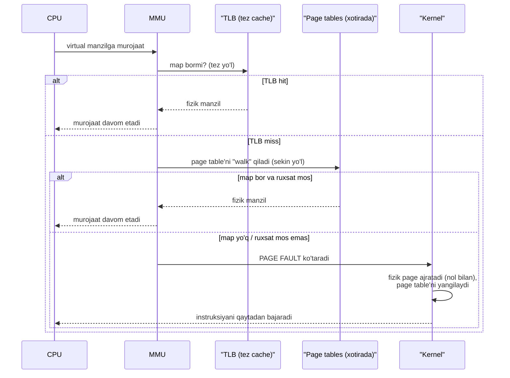

Bu mexanizm **demand paging** deb ataladi: OS virtual page'ga dastur **aslida tekmaguncha** fizik xotira bermaydi. Birinchi murojaat page fault'ni keltirib chiqaradi, kernel uni xotira bilan ta'minlab hal qiladi. Bu **lazy allocation** tufayli jarayonning virtual address space'i mavjud RAM'dan ancha katta bo'lishi mumkin — faqat aslida ishlatilgan mintaqalar fizik page oladi.

> **Swapping.** Page fault faqat "valid lekin ta'minlanmagan page" uchun emas, boshqa sabablarga ko'ra ham bo'ladi. RAM'ga bosim tushganda OS yaqinda ishlatilmagan page'ni ("victim") tanlaydi. Agar u **toza** (o'zgartirilmagan) bo'lsa — tashlab yuborish mumkin (keyin qaytadan yuklanadi). Agar **dirty** (o'zgartirilgan) bo'lsa — OS mazmunini diskdagi **swap space**ga saqlaydi (swap-out), so'ng fizik frame'ni bo'shatadi. Jarayon o'sha page'ga qaytadan tekkanda page fault bo'ladi, OS uni swap'dan qaytaradi (swap-in).

### Address space qancha katta? Canonical manzillar

64-bit mashinada pointer 64 bit, shuning uchun nazariy jihatdan `2^64` baytlik address space kutish mumkin. Amalda hardware barcha 64 bitni ishlatmaydi. An'anaviy x86-64 **48-bit** virtual manzil ishlatadi (`2^48` = 256 TiB — baribir ulkan). Yangi CPU'lar ko'proqni (masalan 57-bit) qo'llab-quvvatlaydi, lekin user jarayon aslida qanchasini olishi OS sozlamasiga bog'liq. arm64'da ham ko'p tizim 48-bit ishlatadi (ba'zilari 52-bit = 4 PiB'gacha). **Go runtime aksariyat 64-bit platformalarda 48-bit heap address space'ni taxmin qiladi** va allocator strukturalarini shu chegara atrofida quradi.

Virtual manzil fizikga qanday tarjima bo'ladi (4 KiB page, ya'ni `2^12` bayt misolida):

- Manzilning **quyi 12 biti** — page ichidagi **offset**.
- **Yuqori bitlar** — **virtual page number** (qaysi page).

Masalan `0x000000012340`:

1. Quyi 12 bit = `0x340` (832) → page ichidagi 832-bayt.
2. Undan yuqori qism = `0x12` (18) → virtual page 18.
3. OS virtual page 18'ni fizik page 163'ga map qilgan deylik.
4. CPU fizik manzilni fizik page raqami (163) + offset (832) dan tuzadi → `0x0000000A3340`.

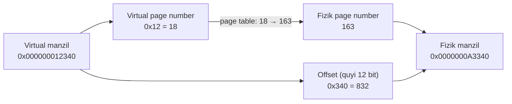

> **Canonical address (amd64).** 64-bit qiymatning yuqori 16 biti (48–63) ixtiyoriy emas — ular **bit 47 bilan mos** bo'lishi kerak (sign-extension qoidasi). Bit 47 = 0 bo'lsa, 48–63 hammasi 0; bit 47 = 1 bo'lsa, hammasi 1. Qoidani buzgan manzil fault keltiradi (segmentation fault). Qoidaga rioya qilgan manzil **canonical** deyiladi. Natijada address space ikki qismga bo'linadi (past canonical: `0x0` — `0x00007FFF...`, yuqori canonical: `0xFFFF8000...` — `0xFFFF...`), orasida katta yaroqsiz "teshik". Go heap indekslashda buni izchil hal qilish uchun manzilni arena indeksiga aylantirishdan oldin qat'iy `arenaBaseOffset` ni qo'llaydi. arm64'da user manzillar quyi 48-bit'da va zero-extended, shuning uchun bu muammo chiqmaydi.

---

## Go virtual xotirani qanday boshqaradi

Go runtime butun virtual address space'ni to'g'ridan-to'g'ri boshqarmaydi. U **chegaralangan heap address space** (ko'pincha 48-bit ≈ 256 TiB) ni taxmin qiladi va allocator strukturalarini shu atrofida quradi.

### Arena

Heap **arena** deb ataladigan fiksirlangan o'lchamli birliklarga ajratiladi. Aksariyat 64-bit platformada har bir arena **64 MiB**. 256 TiB heap address space'da **4,194,304 ta mumkin arena o'rni** bor.

Go barcha arenalar uchun metadata'ni oldindan ajratmaydi. Buning o'rniga u **pointer'lar jadvalini** saqlaydi — har bir arena uchun bitta yozuv. Boshda barcha yozuvlar `nil`. Heap o'sib runtime yangi arena ishlatishni hal qilganda: shu arena uchun address space band qiladi, bitta `heapArena` metadata obyekti ajratadi va uning pointer'ini tegishli yozuvga saqlaydi.

Yangi arena band qilinganda runtime OS'dan virtual address space bo'lagini **hali murojaat qilib bo'lmaydigan** holatda so'raydi. POSIX'da bu odatda `PROT_NONE` bilan anonim `mmap`: "diapazonni band qil, lekin har qanday murojaat fault bo'lsin". Go bu holatni **Reserved** deb kuzatadi — bu diapazonga o'qish/yozish/bajarish darhol fault (`SIGSEGV`/`SIGBUS`) beradi.

> **Reserved / Prepared / Ready** — Go runtime xotirani "shunchaki band qilingan address space"dan "murojaat qilish xavfsiz" holatiga o'tkazishni tasvirlaydigan nomlar. OS'lar bu o'tishlarni turlicha amalga oshiradi, lekin yuqori darajadagi holatlar bir xil.

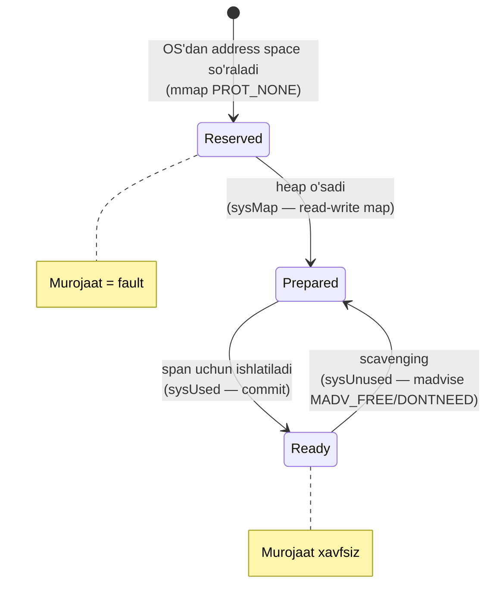

### Page va palloc chunk

Dastur ko'proq xotira so'raganda runtime uni **page** birligida beradi. Go runtime'da page odatda **8 KiB** (aksariyat arxitekturada). Bu **runtime-darajasidagi** tushuncha — OS'ning fizik page o'lchamidan farqli. (Bundan keyin "page" desam, Go runtime page'ni nazarda tutaman, aks holda "fizik page" deyman.)

Go heap'dan page so'raydigan komponent — **page allocator**. U page birligida ishlaydi, lekin har doim bitta page so'ramaydi: so'rovni eng yaqin **palloc chunk** (4 MiB) karrasiga yaxlitlaydi.

**palloc chunk** — page allocator'ning hisob-kitob bloki, arenaning fiksirlangan o'lchamli bo'lagi. Har bir arena **4 MiB palloc chunk**larga bo'linadi — ya'ni 512 ta 8 KiB runtime page. Har bir chunk uchun runtime **bitmap** saqlaydi: qaysi page'lar bo'sh, ishlatilmoqda yoki OS'ga qaytarilgan.

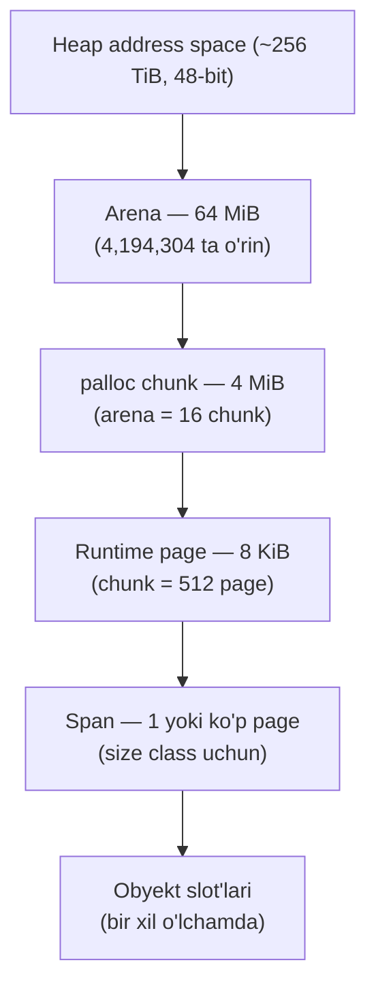

### Heap growth: 6 MiB span misoli

Dasturingiz yangi **6 MiB span** so'raganda:

1. Allocator o'lchamni runtime page'ga aylantiradi: 6 MiB ÷ 8 KiB = **768 page**.
2. Agar page allocator zaxirasi tugagan bo'lsa — heap allocator'dan o'sishni so'raydi.
3. Runtime so'rovni **palloc chunk** (512 page = 4 MiB) granularligiga yaxlitlaydi. 768 page 512 karrasi emas, shuning uchun **1024 page**ga (8 MiB) yaxlitlanadi.
4. Heap o'sgach, 6 MiB span shu 8 MiB'dan **768 page** oladi. Qolgan **256 page** kelajakdagi span'lar uchun bo'sh qoladi.

Yaxlitlashdan so'ng heap 8 MiB bo'lakni **Reserved → Prepared** ga o'tkazadi. Runtime'da bu `sysMap` orqali bo'ladi (POSIX'da address diapazonini read-write map qilish, lekin mazmunini "hali ishlatishga topshirilmagan" deb ko'rish). Arenada hali **56 MiB Reserved** qoladi. Bu jarayon **heap growth** deyiladi. Agar joriy arena so'rovni qondira olmasa, runtime OS'dan yangi arena band qiladi.

> **Scavenging nima?** Xotira bo'shaganda Go virtual manzillarni butunlay bermay turib **RSS** (jarayon egallagan fizik RAM)ni kamaytirmoqchi bo'ladi. Scavenging — runtime fizik ta'minotni bo'shatib, lekin virtual address space'ni saqlab qolish qadami: u hali map qilingan heap xotirasini olib, OS'ga "fizik page'lar endi kerak emas" deydi. Virtual diapazon Go heap'ida qoladi, lekin OS RAM'ni qaytarib olishi mumkin. Holat modelida bu **Ready → Prepared** o'tishi bo'lib, `sysUnused` orqali bajariladi (Unix'da `madvise` bilan: `MADV_FREE` yoki `MADV_DONTNEED`).

### Span — asosiy birlik

palloc chunk — page allocator heap allocator'dan xotira **so'rash** birligi. Lekin Go ajratishlarni boshqarishning **fundamental** birligi — **span**.

**Span** — ma'lum bir **size class** uchun birga boshqariladigan uzluksiz page'lar mintaqasi. Arenani palloc chunk'lardan iborat deb emas, balki **ko'plab span**dan iborat deb tasavvur qilish qulayroq. Span o'lchami har xil — bitta runtime page yoki ko'p page bo'lishi mumkin (`s.npages` runtime span ajratganda tanlanadi).

Span kerak bo'lganda runtime page allocator'dan `n` page so'raydi. Ular orasida oldin scavenge qilingan (Prepared) page'lar bo'lishi mumkin — u holda runtime scavenge qilingan qismni ishlatishdan oldin `sysUsed()` bilan **Ready** ga qaytaradi (Windows'da bu commit qadami). So'ng span **teng o'lchamli obyekt slot**lariga bo'linadi. Bitta span ichidagi barcha obyektlar bir xil o'lchamda (span bitta size class'ga bag'ishlangan), turli span turli o'lchamga xizmat qiladi.

### Ajratish yo'li (umumiy manzara)

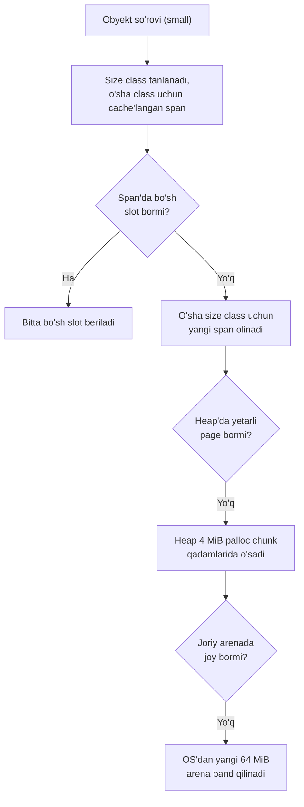

Nozik nuqta: har bir arena bitta uzluksiz blok (64 MiB), lekin **heap yaxlit uzluksiz emas** — ketma-ket arenalar virtual address space'da qo'shni bo'lmasligi mumkin. Agar runtime 64 MiB rezervni mavjud map (masalan thread stack) bilan kesishadigan manzilda so'rasa, OS qisman arena bermaydi — so'rovni rad etadi yoki boshqa manzilga qo'yadi.

---

## Go'dagi xotira ajratish tizimi

### mspan struct

Go'da span `mspan` turi bilan ifodalanadi. `mspan` runtime heap page'laridan tashkil topgan uzluksiz heap bo'lagini boshqaradi. Asosiy maydonlar:

```go
type mspan struct {
    _    sys.NotInHeap
    next *mspan     // ro'yxatdagi keyingi span (yoki nil)
    prev *mspan     // oldingi span (yoki nil)
    // ...
    startAddr uintptr // span birinchi baytining manzili (s.base())
    npages    uintptr // span nechta runtime page qamraydi
    // ...
    nelems uint16     // span nechta obyekt sig'diradi
    // ...
    spanclass spanClass // size class + noscan biti (uint8)
    elemsize  uintptr   // har bir obyekt o'lchami (sizeclass yoki npages'dan)
    allocBits *gcBits   // qaysi slot bo'sh/band ekanini kuzatadigan bitmap
    // ...
}
```

### newobject va mallocgc

Kompilyator qiymat heap'da yashashi kerak deb qaror qilsa, uni ajratish uchun runtime chaqiruvi chiqaradi. Odatiy kirish nuqtasi — `runtime.newobject()`. Kompilyator **escape analysis** bilan qiymat heap'ga ketishi kerakmi yo'qmi hal qiladi: agar pointer joriy funksiya ichida qolsa — stack'da qoladi; agar funksiyadan uzoqroq yashashi mumkin bo'lsa — heap'ga ko'chadi va `newobject()` chaqiriladi.

`newobject()` markaziy allocator `runtime.mallocgc()`ni chaqiradi (u ko'p heap ajratish yo'llarining "issiq yo'li"da turadi, shuning uchun pprof'da tez-tez ko'rinadi):

```go
func newobject(typ *_type) unsafe.Pointer {
    return mallocgc(typ.Size_, typ, true)
}

func mallocgc(size uintptr, typ *_type, needzero bool) unsafe.Pointer {
    // ...
    if size <= maxSmallSize-mallocHeaderSize {
        if noscan && size < maxTinySize {
            // tiny obyekt ajratish
        } else {
            // small obyekt ajratish
        }
    } else {
        // large obyekt ajratish
    }
    // ...
    return x
}
```

Bu markaziy funksiyadan ajratish **uch yo'lga** tarmoqlanadi:

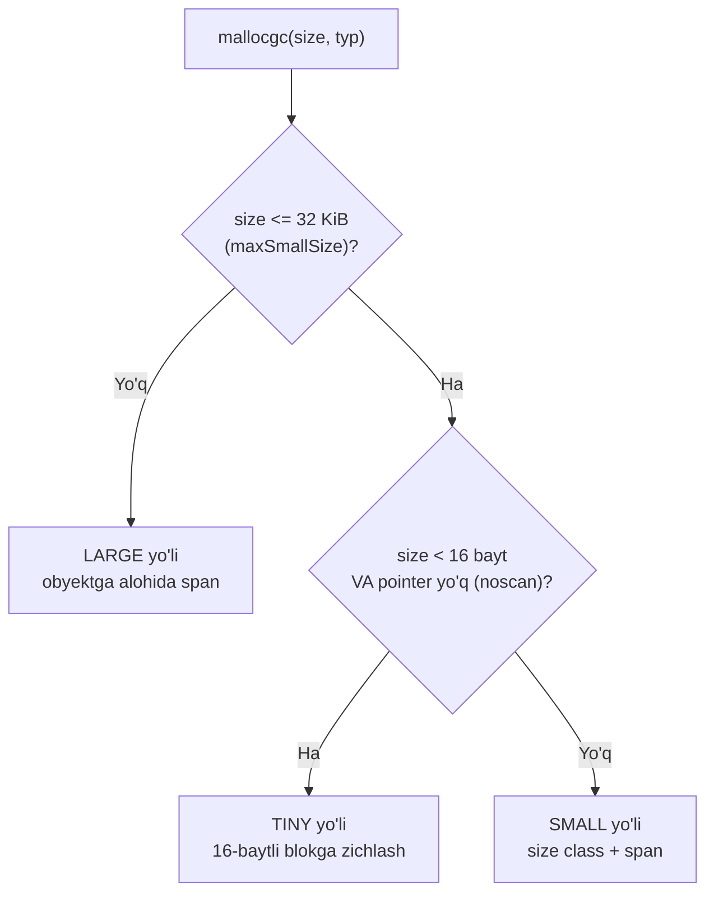

- **Tiny obyektlar** — 16 baytdan kichik va pointer'siz.
- **Small obyektlar** — odatiy holat, size class va span'lar bilan, taxminan 32 KiB'gacha. 16 baytdan kichik bo'lsa ham pointer saqlaydigan obyektlar shu yerga kiradi.
- **Large obyektlar** — taxminan 32 KiB'dan katta, plus 32 KiB'ning tagidagi kichik "kulrang zona" (runtime ba'zan qo'shimcha hisob joyi kerakligi uchun katta deb ko'rilishi mumkin).

---

## Small obyekt ajratish

Small yo'l Go xotira tizimining ko'p terminologiyasi, komponentlari va workflow'ini o'z ichiga oladi — shuning uchun undan boshlaymiz.

### Size class'lar

Aytaylik, dasturingiz heap'da **33 baytli** obyekt so'radi. Allocator **ixtiyoriy bayt sonini bermaydi** — har bir so'rovni **size class**ga yaxlitlaydi. 33 bayt keyingi size class'ga — **48 bayt**ga yaxlitlanadi (15 bayt slot ichida ishlatilmay qoladi = 31.25%).

Go small-obyekt ajratish uchun **67 ta size class** ishlatadi (`runtime/sizeclasses.go`). Jadvalning bir necha qatori:

```
// class  bytes/obj  bytes/span  objects  tail waste  max waste
//     1          8        8192     1024           0     87.50%
//     2         16        8192      512           0     43.75%
//     3         24        8192      341           8     29.24%
//     4         32        8192      256           0     21.88%
//     5         48        8192      170          32     31.52%
//     6         64        8192      128           0     23.44%
//   ...
//    67      32768       32768        1           0     12.50%
```

Ustunlar:

- **bytes/obj** — allocator shu class uchun beradigan **slot o'lchami**.
- **bytes/span** — runtime shu class'ga bir marta bag'ishlaydigan span joyi (kichik class'larda ko'pincha bitta 8 KiB page, kattalarida bir necha page).
- **objects** — bitta span'ga nechta to'liq slot sig'adi. Ortiqchasi **tail waste** bo'ladi.
- **max waste** — slot yaxlitlash + tail waste birgalikdagi eng yomon holatdagi isrof.

Masalan **size class 5**: obyekt o'lchami 48 bayt, span bitta 8 KiB page. `8192 ÷ 48 = 170` to'liq obyekt, kichik qoldiq ishlatilmaydi.

### Ikki xil isrof: tail waste va internal fragmentation

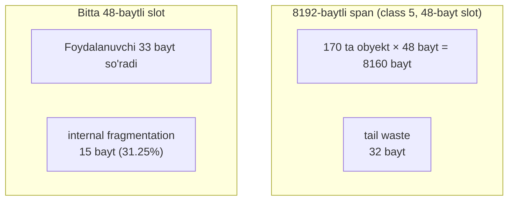

- **Tail waste** — span teng slot'larga bo'lingach oxirida qolgan ishlatilmagan qoldiq. Class 5'da: 170 × 48 = 8160, span 8192 → **32 bayt** tail waste.
- **Internal fragmentation** — so'ralgan o'lcham bilan olingan slot orasidagi farq. 33 so'rab 48 slot olsangiz — **15 bayt** (31.25%) isrof. `max waste` ustuni butun span bo'yicha bu ikkalasining eng yomon kombinatsiyasini o'z ichiga oladi (class 5 uchun 31.52%).

### Span class: size class + scan/noscan biti

67 small size class'ga qo'shimcha **sentinel size class 0** (large ajratish uchun) bor. Span'lar yana **pointer saqlashi mumkinmi** bo'yicha farqlanadi. Runtime buni **span class** sifatida kodlaydi — size class + `noscan`/`scan` biti (pointer yo'q / bor).

Span class = size class'ni chapga 1 bit surish, eng quyi bit `noscan` uchun 1, `scan` uchun 0. Demak:

- **scan span class'lar** — **juft** qiymatlar 0, 2, 4, ... 134. (0 large uchun band.)
- **noscan span class'lar** — **toq** qiymatlar 1, 3, 5, ... 135. (1 large uchun band.)

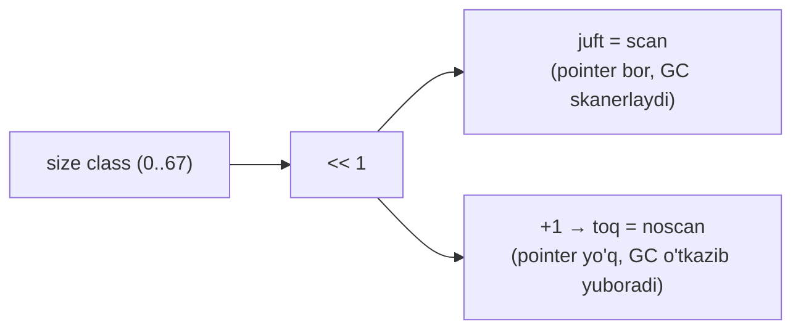

Bu **134 span class** beradi (67 size class × 2), plus large uchun 2 ta band. GC `noscan` span'larni butunlay skanerlamaydi. Bir xil obyekt o'lchamli bo'lsa ham, `noscan` va `scan` span **turli class** hisoblanadi: `noscan` span pointer saqlashi mumkin bo'lgan obyekt uchun, `scan` span esa `noscan` ajratish uchun **yaramaydi**.

### Uch asosiy o'yinchi: mcache, mcentral, mheap

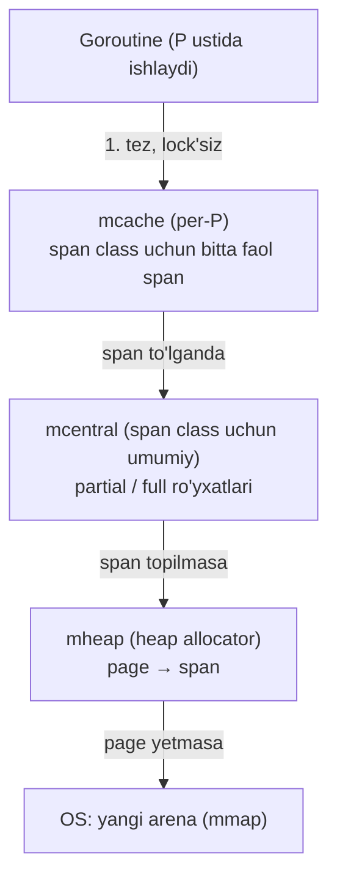

#### mcache — per-P kesh

```go
type mcache struct {
    // ...
    tiny       uintptr
    tinyoffset uintptr
    tinyAllocs uintptr
    alloc [numSpanClasses]*mspan   // span class bo'yicha faol span
    stackcache [_NumStackOrders]stackfreelist
    // ...
}
```

Go runtime'da har bir mantiqiy protsessor (**P**) mayda ajratishlar uchun o'z lokal keshiga ega — bu **mcache**. U har bir span class uchun **bitta faol `mspan` pointer**ini saqlaydi, shuning uchun ko'p mayda ajratish hech qanday umumiy strukturaga tegmasdan tugaydi. Gorutin P ustida ishlab, mayda obyekt so'raganda odatda uni to'g'ridan-to'g'ri shu P'ning mcache'sidan oladi. Bu yo'l **lock talab qilmaydi**, chunki mcache per-P va faqat shu P'da ishlab turgan gorutin ishlatadi.

`mcache.alloc` — span class bo'yicha indekslangan massiv; har bir yozuv shu class uchun faol span'ga ishora qiladi. Har bir faol span mayda ajratishlar uchun ko'p bo'sh slot beradi (masalan span class 2 = 8-baytli slot × 1024, span class 4 = 16-baytli slot × 512). Runtime nechta obyekt ajratilganini kuzatadi va keyingi bo'sh slotni tez topish uchun ixcham bitmap ishlatadi. `mcache.alloc[spc]` span'ni **faqat bo'sh slot bor ekan** ushlab turadi. Span **to'lganda** runtime uni central ro'yxatlariga qaytaradi va mcentral'dan bo'sh joyi bor yangi span bilan to'ldiradi.

#### mcentral — central free lists

Central allocator (**central free lists**) — bitta span class uchun umumiy pool. Har bir span class'da **aynan bitta** central bor. Har bir central ikki guruh span saqlaydi: kamida bitta bo'sh obyekti bor **partial** va bo'sh obyekti qolmagan **full**.

```go
type mheap struct {
    // ...
    central [numSpanClasses]struct {
        mcentral mcentral
        // ...
    }
}

type mcentral struct {
    // ...
    spanclass spanClass
    partial [2]spanSet // bo'sh obyekti bor span'lar
    full    [2]spanSet // bo'sh obyekti yo'q span'lar
}
```

Central protsessorlar (**P**) o'rtasida bo'lishiladi, shuning uchun operatsiyalari **concurrency**ga xavfsiz bo'lishi kerak. Go bitta global lock'dan qochadi: har bir span class'ni alohida saqlaydi va asosiy konteyner sifatida **`spanSet`** ishlatadi. Odatiy holda span push/pop **atomic** operatsiyalar bilan bo'ladi; kichik lock faqat `spanSet` ichki "spine"sini kengaytirish kerak bo'lganda (kamdan-kam) olinadi. Har bir central mustaqil sinxronlanadi — agar yuzlab P `n` size class span'lari uchun kurashsa ham, boshqa span class'lardagi ajratishlar ta'sirlanmaydi.

Har bir `partial` va `full` ro'yxati yana ikkiga bo'linadi: **swept** va **unswept** (joriy GC siklida tozalanganmi):

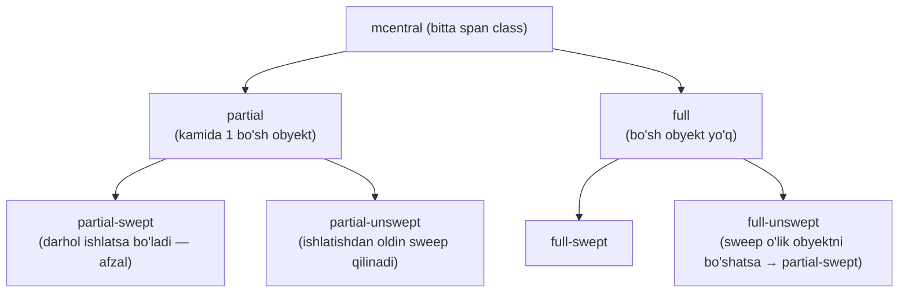

**span class 10** (size class 5'ning scan varianti, 48-bayt slot) misolida: mcache'dagi faol span'ning barcha 170 sloti tugadi. P uni central'ning **full-swept** to'plamiga qaytaradi, so'ng span class 10 uchun boshqa span so'raydi. (Pointer'siz obyekt bo'lsa, noscan variant — span class 11 ishlatiladi.)

Central span'ni quyidagi tartibda qidiradi:

1. **partial-swept**'dan pop — bo'sh slot bor, joriy GC siklida sweep qilingan.
2. Bo'lmasa, **partial-unswept**'dan pop, lekin ishlatishdan oldin span'ni sweep qiladi.
3. Bo'lmasa, **full-unswept**'ni tekshiradi — sweep o'lik obyektni bo'shatsa, span partial-swept'ga o'tadi va ishlatiladi.
4. Yuqoridagilardan yaroqli narsa chiqmasa — central heap'dan **butunlay yangi span** so'raydi.

Muhim detal: central span'ni P'ning keshiga **butunlay topshiradi**. Central endi shu span'ga havola saqlamaydi — egalik span qaytarilmaguncha P'ning mcache'siga ko'chadi.

#### mheap — heap allocator

Heap allocator — oxirgi bekat. U heap page'larini boshqaradi va yuqori qatlam allocator'larga xotira beradi. `mheap` — jarayonning Go heap address space'ini boshqaradigan runtime komponenti:

```go
type mheap struct {
    // ...
    lock     mutex
    pages    pageAlloc // page ajratish strukturasi
    allspans []*mspan  // mavjud barcha span'lar
    // ...
    arenas [1 << arenaL1Bits]*[1 << arenaL2Bits]*heapArena
    // ...
}
```

Heap address space fiksirlangan o'lchamli arenalarga bo'linadi. **Ikki darajali arena map** (`arenas` maydoni) ularni indekslaydi. Arena o'lchami platformaga bog'liq: 64-bit non-Windows'da odatda 64 MiB, Windows'da 4 MiB. amd64'da address space odatda 48-bit (256 TiB). Aksariyat 64-bit non-Windows platformada `arenaL1Bits = 0`, shuning uchun amalda bitta katta L2 jadval bo'ladi.

Boshqa allocator'lardan farqli, **mheap alohida obyekt yoki slot ajratmaydi** — uning asosiy birligi runtime heap page. U page'larni ajratadi, so'ng ularni mcentral uchun span'larga guruhlaydi. Bo'sh/band page'larni kuzatadigan struktura — `mheap.pages`dagi **page allocator**.

#### Per-P page cache

Page allocator'ga kirmasdan oldin: har bir P'da kichik **per-P page cache** ham bor. U 64 tagacha runtime page (8 KiB'da 512 KiB) saqlaydi. P juda kichik page yugurishiga muhtoj bo'lganda (16 page'dan kam ≈ 128 KiB'dan kam) runtime avval shu lokal keshni sinaydi — **heap lock'ni olmasdan** page beradi.

Page cache virtual address space'da uzluksiz 64-page bo'lakni ifodalaydi, lekin ichida faqat ba'zi page'lar bo'sh bo'lishi mumkin. Keshni qondira olmaydigan ikki holat: (1) u **bo'sh** — runtime uni global page allocator'dan to'ldiradi (heap lock kerak); (2) so'ralgandan **kam bo'sh page** bor — runtime global page allocator'ga tushadi (u ham heap lock oladi).

### Page allocator — radix tree

Global page allocator — **haqiqat manbai**. U har bir page holatini kuzatadi: qaysi page'lar ishlatilayotgan span'ning qismi (garchi qaysi aniq span ekanini bilmasa ham), qaysilari bo'sh, qaysilari scavenge qilinib OS'ga qaytarilgan.

U page holatini **radix tree** — uzluksiz massivlarda saqlangan ierarxik xulosa strukturasi — bilan kuzatadi:

```go
type pallocSum uint64

const summaryLevels = 5

type pageAlloc struct {
    summary [summaryLevels][]pallocSum
    chunks  [1 << pallocChunksL1Bits]*[1 << pallocChunksL2Bits]pallocData
}
```

Har bir massiv yozuvi — **palloc summary** (`pallocSum`), 64-bitga qadoqlangan qiymat. 64-bit tizimda tree **besh darajali**. Har bir daraja 8 ta kichikroq bo'lakka bo'linadi:

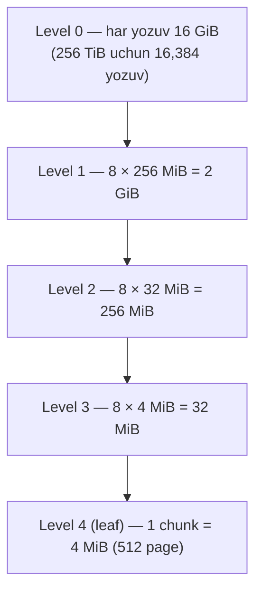

Har bir `pallocSum` **uch sonni** kodlaydi (har biri 21 bit), shu bilan allocator uch savolga tez javob beradi:

1. Bu mintaqaning **boshida** nechta uzluksiz bo'sh page bor? (**start**)
2. Mintaqaning **istalgan** joyidagi eng uzun uzluksiz bo'sh page yugurishi qancha? (**max**)
3. Mintaqaning **oxirida** nechta uzluksiz bo'sh page bor? (**end**)

`start` va `end` ortiqcha ko'rinishi mumkin, lekin ular **emas**: bo'sh joy ko'pincha chunk chegaralari bo'ylab bo'linadi, va `start`/`end` qo'shni yozuvlar bo'ylab yugurishlarni **arzon ulash** imkonini beradi. (Level 0'da har yozuv 16 GiB = 2,097,152 page, shuning uchun har maydon 21 bit; `2^21` to'liq holati uchun maxsus kodlash bor.)

**1 MiB (128 page)** ajratishda allocator level 0'dan (16 GiB granularlik) boshlaydi:

1. Agar level-0 summary'da kamida 128 page'lik bo'sh yugurish yo'q bo'lsa — o'tkazib yubor, aks holda level 1'ga tush.
2. Level-1 yozuvida `max` ≥ 128 bo'lsa — 4 MiB leaf chunk'gacha tushishda davom et.
3. Leaf'da **512-bitli bitmap**ga murojaat qilib aniq yugurishni top.

Misol: 4 MiB chunk (512 page) tartibida — 1 MiB band, 1.5 MiB bo'sh, 0.5 MiB band, 1 MiB bo'sh. Uning `pallocSum`i: `start = 0` (band bilan boshlanadi), `max = 192` (eng uzun bo'sh yugurish 1.5 MiB), `end = 128` (1 MiB bo'sh bilan tugaydi). Demak bu chunk ichida 128 page ajratsa bo'ladi.

### pallocData va page holatlari

`pallocSum` — per-page ajratish bitmap'ining **xulosasi**. U qidiruvni yo'naltirishga yetarli, lekin qaysi **aniq** page bo'sh ekanini aytmaydi. Bu detal leaf darajasida — **`pallocData`**da:

```go
type pallocData struct {
    pallocBits           // qaysi page band / bo'sh
    scavenged pageBits   // qaysi bo'sh page scavenge qilingan
}
```

Har bir `pallocData` bitta 512-page chunk (4 MiB)ni qamraydi va page holatini 512-bitli bitmap'lar bilan kuzatadi. Runtime uchun **uch kategoriya**:

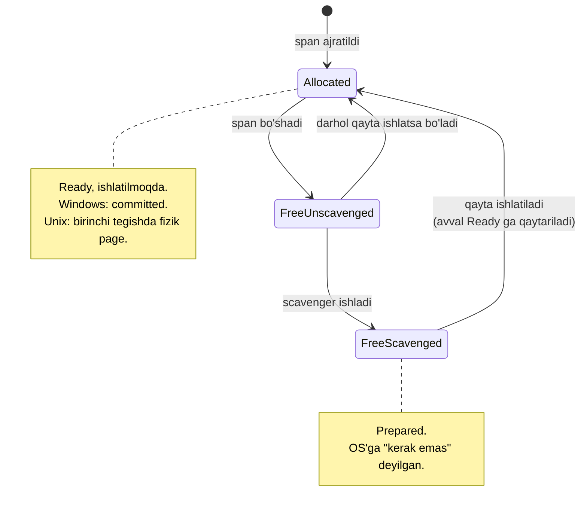

- **Allocated** — hozir tirik span'ni ta'minlaydigan page'lar. Scavenged emas. Runtime hisobida **Ready** va ishlatilmoqda.
- **Free, unscavenged** — allocator'da bo'sh, hali **Ready** deb hisoblanadi. Darhol qayta ishlatsa bo'ladi.
- **Free, scavenged** — bo'sh va scavenged deb belgilangan. Bu **Prepared**ga to'g'ri keladi: runtime OS'ga "hozir fizik xotira kerak emas" degan. Qayta ishlatishdan oldin runtime OS'dan uni yana ishlatsa bo'ladigan qilishni so'raydi (Ready ga qaytaradi).

Allocator span uchun page yugurishini tanlaganda, u aralash (unscavenged + scavenged) bo'lishi mumkin. Span jonlashdan oldin runtime shu yugurishdagi scavenged page'larni **commit** qiladi, butun yugurish **Ready** bo'ladi. (Prepared → Ready o'tishi **idempotent** — Ready page'da chaqirish xavfsiz. Ba'zi tizimda deyarli no-op, Windows'da esa haqiqiy commit.)

Yetarli katta uzluksiz bo'sh yugurish yo'q bo'lsa, runtime avval heap o'stirishdan qochishga urinadi: joriy GC siklidan qolgan sweep ishini tugatib, page'larni qaytarib oladi. Baribir yetmasa — **heap o'sadi**: joriy arenada joy bo'lsa, undan yangi 4 MiB palloc chunk oladi va **Reserved → Prepared** ga o'tkazadi. Arena qondira olmasa, OS'dan yangi arena-o'lchamdagi bo'lak band qiladi.

### End-to-end small ajratish

Demak mcentral small obyektlar uchun yangi span kerak bo'lsa, u bo'sh page'larni span'ga aylantirishi kerak: `mheap`dan page yugurishini so'raydi (page allocator orqali). Page allocator mos yugurishni topib page'larni **allocated** deb belgilaydi. So'ng `mheap` shu diapazon uchun `mspan` deskriptorini yaratadi va span'ni mcentral'ga qaytaradi, u esa per-P keshlarni to'ldiradi.

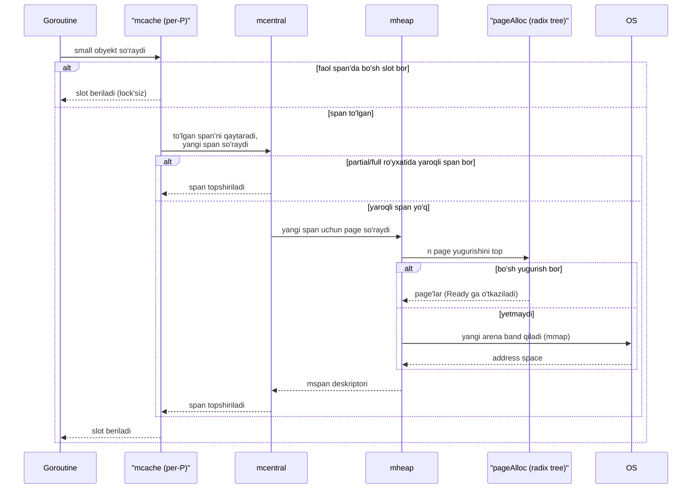

---

## Katta obyektlar ajratilishi (large objects)

Small-obyekt chegarasidan (≈ 32 KiB) katta har qanday ajratish **large** hisoblanadi. Large ajratishlar **size class ishlatmaydi** — runtime shu bitta obyekt uchun heap'dan **alohida span** ajratadi.

Ichkarida large ajratishlar **size class 0**dan foydalanadi, uning ikki span class'i bor: **span class 0** (scan obyektlar) va **span class 1** (noscan obyektlar). Har bir large obyekt boshqalar bilan zichlanmasdan o'z span'ini oladi.

Qadamlar (small'ga o'xshash, taqqoslash oson):

1. Allocator so'ralgan o'lchamni **butun sonli heap page**gacha yaxlitlaydi. Masalan 33 KiB → 40 KiB = **beshta 8 KiB page**. Span ichidagi ortiqcha joy — **internal slack**, boshqa ajratish bilan bo'lishilmaydi.
2. Juda kichik yugurishlar per-P page cache'dan kelishi mumkin; aks holda global page allocator'dan (small'dagi bilan bir xil qidiruv).
3. Mos bo'sh yugurish bo'lsa, runtime page'larni ishlatsa bo'ladigan qiladi, yugurishni **bitta-obyektli span** sifatida bog'laydi va boshlang'ich manzilni qaytaradi.

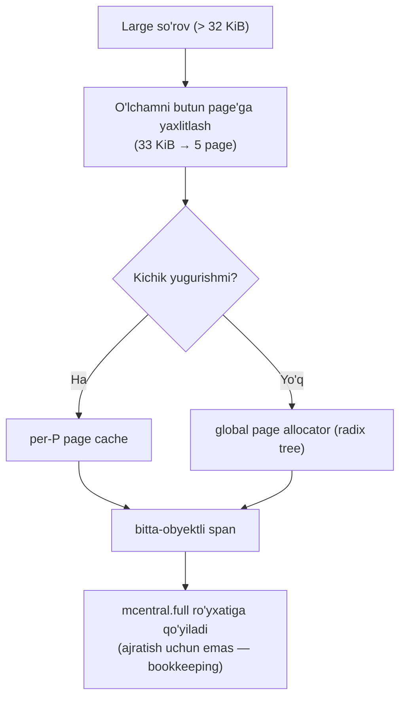

Nozik nuqta: large span darhol central'ning **full-swept** ro'yxatiga (`mcentral.full`) qo'yiladi. Bu **ajratish uchun emas** — bu bookkeeping, background sweeper large span'larni ko'rib, ularning sweep holatini izchil boshqara olishi uchun.

---

## Tiny Object Allocation (mayda obyekt ajratish)

Tiny ajratishlar **16 baytdan kichik va pointer'siz**. Ular per-P kesh (`mcache`) ichidagi maxsus **tiny allocator** orqali o'tadi. Maqsad — bir necha tiny ajratishni **bitta 16-baytli blokga zichlash**, shunda 1-bayt, 2-bayt, 4-baytli ajratishlar ketma-ketligi har biriga alohida slot talab qilmaydi.

Tiny allocator joriy 16-baytli blok holatini uch maydon bilan kuzatadi:

```go
type mcache struct {
    // ...
    tiny       uintptr // joriy 16-baytli blok boshi (yoki nil)
    tinyoffset uintptr // blokda ishlatilgan baytlar (0..16)
    tinyAllocs uintptr // shu P bergan tiny ajratishlar soni (hisob)
    // ...
}
```

Masalan, bitta 16-baytli blok ikki tiny obyekt saqlaydi: 1-baytli va 4-baytli:

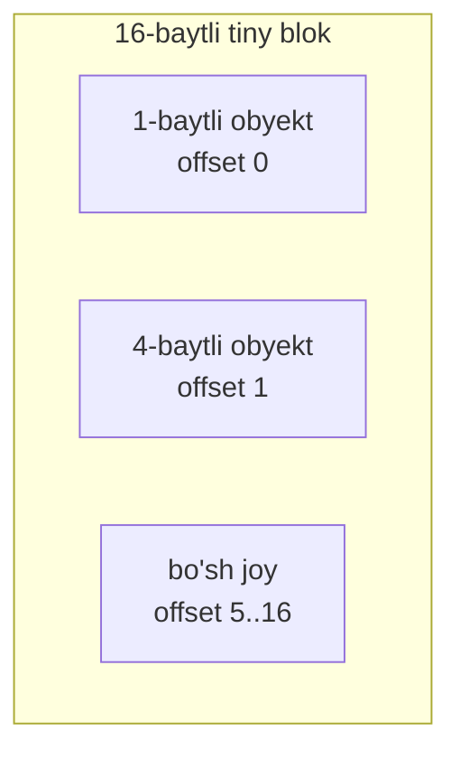

### Alignment: nega bo'sh joy bo'lsa ham blok to'lishi mumkin

Tiny so'rov kelganda allocator avval `tinyoffset`ni obyektning **alignment** talabiga tekislaydi. **Alignment** — obyekt qayerdan boshlanishi mumkinligining qoidasi: 8-bayt-aligned obyekt 8 karrali manzildan, 4-bayt-aligned esa 4 karrali manzildan boshlanishi kerak. CPU ma'lumot tabiiy chegaralarda boshlanganda tez va xavfsiz o'qiydi/yozadi. Go tiny obyektlar uchun 8-baytgacha ikki darajali (power-of-two) alignment ishlatadi.

So'rov aligned holda sig'sa, allocator `tinyoffset`ni oldinga suradi va `tinyAllocs`ni oshiradi. Endi bo'sh joy bor, lekin keyingi so'rov **alignment tufayli** sig'maydigan holatni ko'raylik. Aytaylik 6 bayt allaqachon ishlatilgan (`tinyoffset = 6`), 10 bayt qolgan. Ikki so'rov keladi: **8-bayt-aligned** obyekt, so'ng **2-baytli** obyekt.

10 bayt qolsa ham, 8-baytli obyekt offset 6'dan **boshlana olmaydi** (6 — 8 karrasi emas). 8-baytli obyekt offset 0 yoki 8'dan boshlanishi kerak; 0 band, shuning uchun allocator uni **offset 8**ga qo'yadi — bu oxirgi 8 baytni ishlatib blokni **to'ldiradi**. Keyingi 2-baytli obyekt uchun tiny allocator per-P keshdan **yangi 16-baytli blok** oladi (kesh bo'sh bo'lsa — central'dan to'ldiradi; ular ham bo'sh bo'lsa — heap'dan yangi span).

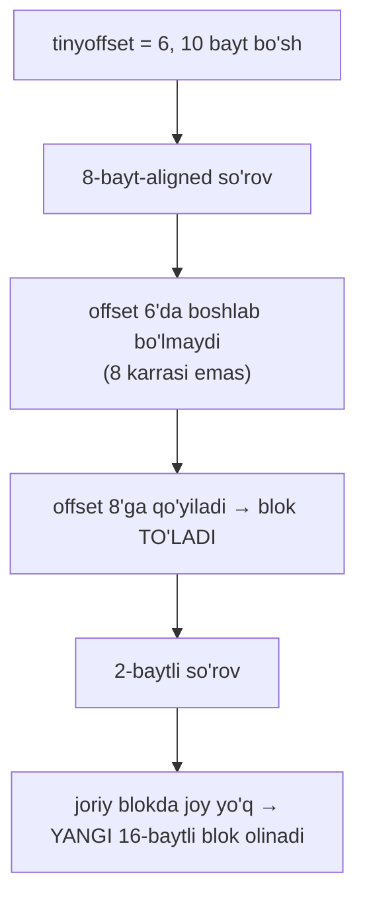

---

## Pointer Bitmaps va Malloc Header

Hozirgacha allocator xotirani **qayerdan** olishiga qaradik. Garbage collector uchun bu yetarli emas — u **qaysi word'lar pointer** ekanini bilishi kerak, shunda obyekt grafini (object graph) trace qila oladi.

Span class tezkor farqni beradi: `noscan` span obyektlari heap pointer saqlamaydi, GC ularni o'tkazib yuboradi. `scan` span obyektlari pointer saqlashi mumkin, GC'ga **pointer layout** kerak — u har bir 8-baytli word uchun bu **pointer'mi yoki skalyar** ekanini hal qiladi.

Bu layout dasturning **type metadata**sidan keladi. Runtime skanerlashda uni tez topishi kerak:

- **Kichik pointer'li obyektlar** uchun — **heap bits**ni span oxirida saqlaydi.
- **Kattaroq** kichik obyektlar uchun — **malloc header**: obyektdan darhol oldin saqlangan bitta type pointer.

### GCData va _type

```go
type A struct {
    i int   // 8 bayt, pointer emas
    p *B    // 8 bayt, pointer
}
```

64-bit mashinada `A` ikkita 8-baytli word egallaydi. `A` uchun GC bitmap'i word'ga bitta bit: `i` uchun **0**, `p` uchun **1**. `A`ning massivi/slice'i bo'lsa, GC buni `01 01 01 ...` takrorlanuvchi bitmap sifatida yoki shu shablonni takrorlaydigan ixcham dastur sifatida saqlaydi.

Kompilyator har bir `T` turi uchun **type descriptor `_type`** chiqaradi. Bu deskriptor o'lchamni, pointer baytlari sonini va **`GCData`** (pointer layout)ni o'z ichiga oladi. `noscan` turlar uchun pointer baytlari soni 0. `GCData` ikki shaklda:

- **Oddiy bitmap** — word'ga bitta bit (1 = pointer, 0 = skalyar).
- **Ixcham GC dasturi** — katta massiv/slice uchun ulkan metadata'dan qochish uchun takrorlanuvchi shablonni kichik bytecode sifatida kodlaydi. Runtime uni kerak bo'lganda bitmap'ga kengaytiradi.

Runtime `GCData`dan GC skanerlashda o'qiydigan **pointer bitmap**ni ishlab chiqaradi.

### Heap-bits-in-span (o'lchami ≤ 512 bayt)

64-bit tizimda obyekt o'lchami **ko'pi bilan 512 bayt** bo'lgan span'lar uchun runtime `GCData`ni o'qib pointer bitmap'ga aylantiradi va uni **span oxiridagi heap-bits maydonida** saqlaydi (`GCData` bitmap bo'lsa — nusxalanadi, GC dasturi bo'lsa — avval kengaytiriladi).

Masalan **span class 10** (size class 5'ning scan varianti), 48-baytli obyektlar, bitta 8 KiB page. 48 ≤ 512 bo'lgani uchun heap-bits-in-span sxemasi ishlatiladi:

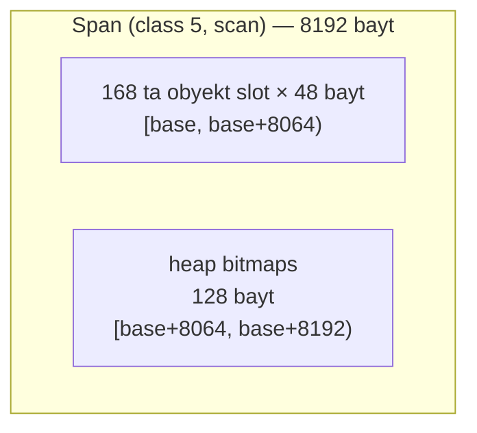

64-bit mashinada har word 8 bayt, shuning uchun bitta 8 KiB span **1024 word** saqlaydi. Word'ga bitta bitli bitmap 1024 bit = **128 bayt** talab qiladi. Shuning uchun runtime span oxirida heap bitlari uchun 128 bayt band qiladi. Bu obyekt slot'lariga `[base, base+8064)`ni qoldiradi. Natijada span **170 o'rniga 168 obyekt**ga xizmat qiladi. Bu kamayish **faqat scan span'lar** uchun — `noscan` variant hali ham to'liq 170 obyektga xizmat qiladi (unga heap bits kerak emas).

### Malloc header (512 bayt < o'lcham, lekin hali small)

Agar obyekt pointer saqlashi mumkin bo'lsa va o'lchami **512 baytdan katta**, lekin hali small bo'lsa, runtime buning o'rniga **malloc header** ishlatadi. Header — foydalanuvchi obyektidan **darhol oldin** saqlangan bitta 8-baytli word; u **type descriptor**ga ishora qiladi. Heap-bits-in-span'dan farqli, bu metadata **obyekt bilan** yashaydi, span dumida emas:

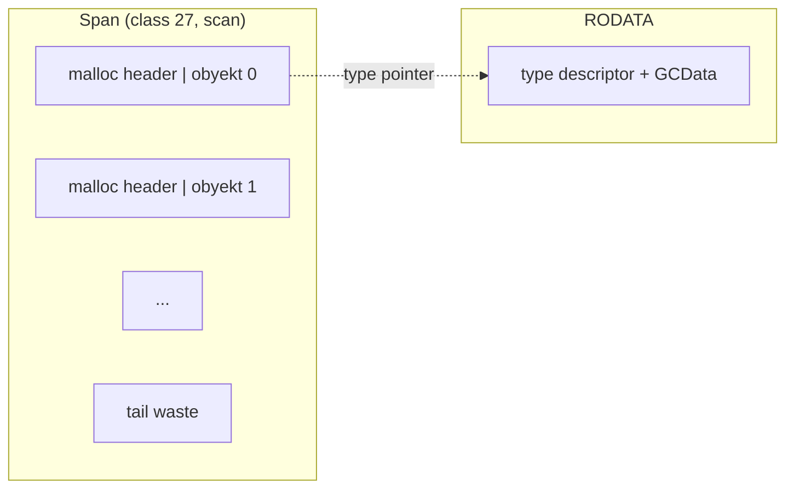

GC obyektni skanerlash uchun shu type pointer'dan turning `GCData`'siga o'tadi. Allocator size class tanlaganda 8-baytli header'ni hisobga oladi: masalan 513 bayt so'ralsa, allocator header qo'shib **521 bayt** asosida yaxlitlaydi.

**512-baytli chegara** metadata xarajatini muvozanatlaydi: undan pastda span ichidagi heap bits arzonroq; undan yuqorida obyekt uchun 8-baytli header arzonroq.

### Large obyektlar (≈ 32 KiB dan katta)

Large obyektlar o'z span'ini oladi. Ular header ham, heap-bits-in-span ham ishlatmaydi — buning o'rniga **span metadata (`mspan`) type pointer'ni saqlaydi**. Tur `noscan` bo'lsa — pointer `nil`. Tur GC dasturi ishlatsa — runtime kichik yon bufer (side buffer) ajratadi va dasturni bir marta bitmap'ga kengaytiradi.

> **Smoothing window.** Kichik silliqlash oynasi bor: agar 8-baytli header qo'shish pointer'li obyektni 32 KiB chegarasidan o'tkazib yuborsa, u **large** deb ko'riladi. Ya'ni `(32 KiB − 8 bayt, 32 KiB]` diapazonidagi o'lchamlar large hisoblanadi.

```mermaid
flowchart TD
    OBJ["Pointer'li obyekt (scan)"] --> Q1{"o'lcham ≤ 512 bayt?"}
    Q1 -->|Ha| HB["heap bits span oxirida"]
    Q1 -->|Yo'q| Q2{"o'lcham < 32 KiB?"}
    Q2 -->|Ha| MH["malloc header (obyekt oldida)"]
    Q2 -->|Yo'q| LG["large: mspan type pointer'ni saqlaydi"]
```

---

## Eslab qol

- **Virtual memory** izolyatsiya va fragmentatsiyani hal qiladi. **MMU** virtual manzilni **page table** orqali fizik manzilga tarjima qiladi; **TLB** — tez cache. **Page fault** + **demand paging** tufayli xotira faqat **tegilganda** fizik page oladi (lazy allocation).
- Go heap ierarxiyasi: **arena (64 MiB) → palloc chunk (4 MiB = 512 page) → runtime page (8 KiB) → span → obyekt slot**. Runtime page ≠ OS fizik page.
- Xotira holatlari: **Reserved** (mmap PROT_NONE) → **Prepared** (sysMap) → **Ready** (sysUsed/commit). **Scavenging** = Ready → Prepared (`sysUnused`/madvise), RSS'ni kamaytiradi, virtual address'ni saqlaydi.
- `mallocgc` obyektni **tiny** (< 16 bayt, pointer'siz), **small** (size class, ≤ 32 KiB) yoki **large** (> 32 KiB, alohida span) yo'liga yuboradi.
- Small ierarxiya: **mcache (per-P, lock'siz) → mcentral (span class, partial/full, swept/unswept) → mheap (page → span) → OS (arena)**. Page allocator — **5 darajali radix tree** (`pallocSum`: start/max/end).
- **Span class** = size class × 2 + noscan biti. Juft = scan (GC skanerlaydi), toq = noscan (GC o'tkazib yuboradi).
- GC pointer layout'ni topadi: ≤ 512 bayt → **heap bits span oxirida**; > 512 bayt (small) → **malloc header** obyekt oldida; large → **`mspan`da type pointer**.

## Tez-tez uchraydigan xatolar

- **"make([]byte, 1<<30) darhol 1 GiB RAM oladi"** — yo'q. Faqat virtual diapazon band bo'ladi; fizik RAM page'larga **tekkanda** keladi (demand paging).
- **"Go runtime page = OS page"** — yo'q. Go runtime page odatda 8 KiB, OS fizik page 4/16 KiB bo'lishi mumkin.
- **"Scavenging virtual address'ni bo'shatadi"** — yo'q. U faqat **fizik** ta'minotni bo'shatadi; virtual diapazon Go heap'ida qoladi.
- **"Bir xil o'lchamli span'lar bir-birining o'rnini bosadi"** — yo'q. `scan` va `noscan` span turli class; biri ikkinchisining ajratishini qondira olmaydi.
- **"16 baytdan kichik obyekt har doim tiny yo'liga boradi"** — yo'q. Pointer saqlasa, u **small** yo'liga boradi (tiny faqat pointer'siz).
- **"Heap bitta uzluksiz blok"** — yo'q. Har arena uzluksiz (64 MiB), lekin arenalar virtual address space'da qo'shni bo'lmasligi mumkin.

## Amaliyot

1. `make([]byte, 1<<30)` bilan slice yarating, lekin unga tegmang. `runtime.ReadMemStats` yordamida `HeapSys` va `HeapInuse` (yoki OS'da RSS)ni tekshiring. So'ng `buf[i] = 1` bilan har 4 KiB'da bitta baytga tegib RSS o'zgarishini kuzating — demand paging'ni o'z ko'zingiz bilan ko'ring.
2. `sizeclasses.go` jadvalidan foydalanib: 33 baytli, 100 baytli va 700 baytli so'rovlar qaysi size class'ga tushishini va har birida qancha internal fragmentation bo'lishini hisoblang.
3. Bitta `struct{ a, b byte }` (pointer'siz, 2 bayt) va bitta `struct{ p *int }` (pointer'li, 8 bayt) ajrating. Fikran: birinchisi **tiny** yo'liga, ikkinchisi **small** yo'liga borishini tushuntiring. Nega?
4. `mcache → mcentral → mheap → OS` yo'lini o'z so'zlaringiz bilan diagramma qilib chizing va har bir bosqichda **lock kerakmi yoki yo'qmi** belgilang.
5. Nega Go 512-baytli chegarada heap-bits-in-span'dan malloc header'ga o'tadi? Metadata xarajati nuqtai nazaridan tushuntiring.

---

[← 01 Binary & Memory](01_binary_memory.md) | [README](README.md)
