# 03 — Goroutine Stack

> Ushbu material — **The Anatomy of Go** (Phuong Le) kitobining 7-bobi (Memory) asosida o'zbek tilida tayyorlangan o'quv qo'llanma. Mavzular kitobdan o'qib tushunilib, **o'z so'zlarim bilan** qayta tushuntirilgan — asl matnning so'zma-so'z tarjimasi emas. Texnik atamalar (stack, frame, goroutine, guard...) inglizcha qoldirilgan.

## Nima uchun bu mavzu muhim?

Har bir goroutine ishga tushganda unga o'zining alohida **stack**'i ajratiladi. OS thread'lardan farqli o'laroq, bu stack **kichik boshlanadi** (odatda 2 KiB) va kerak bo'lganda runtime tomonidan **o'stiriladi** yoki **qisqartiriladi**. Aynan shu mexanizm Go'ga bir vaqtning o'zida yuz minglab goroutine ishlata olish imkonini beradi — chunki har biriga megabaytlab OS stack ajratilmaydi.

Bu bo'limda quyidagi savollarga javob beramiz:

- Nega Go eski **segmented stack** yondashuvidan **contiguous stack**'ga o'tdi? "Hot split" muammosi nima?
- Stack o'sganda goroutine'ning barcha o'zgaruvchilari yangi manzilga ko'chadi — unda `pointer`'lar qanday tuzatiladi? Nega `uintptr` **tuzatilmaydi**?
- `stackguard0` nima va funksiya prologi qanday qilib "stack yetdimi?" degan savolni tekshiradi?
- `//go:nosplit` funksiya nima uchun kerak va nega uni ko'p ishlatish xavfli?
- Stack qachon va qanday **qisqaradi**?

Bu mavzu avvalgi [02 Heap](02_heap.md) bilan chambarchas bog'liq: keyingi bo'limda ([04 Escape Analysis](04_escape_analysis.md)) ko'ramizki, kompilyator aynan "bu qiymat stack'da qololmaydi" deb qaror qilganda uni heap'ga ko'chiradi.

## Umumiy konsept xaritasi

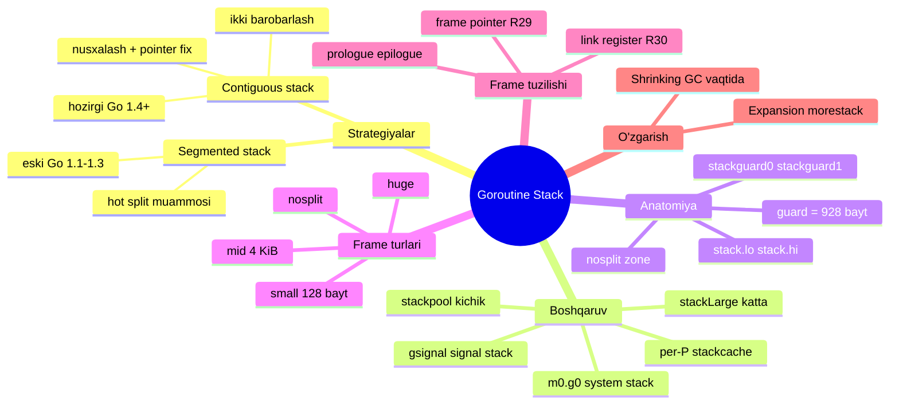

## Stack nima va nega goroutine stack maxsus?

Oddiy OS thread ishga tushganda unga katta, **ruxsat etilgan o'lchamli** (fixed-size, ko'pincha 1-8 MiB) stack beriladi. Agar Go har bir goroutine'ga shuncha xotira bersa, million goroutine terabaytlab xotira talab qilardi.

Buning o'rniga goroutine stack:

- **Kichik boshlanadi** — Linux/macOS/BSD/Android'da 2 KiB, Windows'da 8 KiB, Plan 9 va iOS/arm64'da 4 KiB.
- **Runtime tomonidan boshqariladi** — OS emas, Go runtime uni o'stiradi va qisqartiradi.
- **Alohida yashaydi** — OS thread'ning o'z stack'idan (system stack) ajralgan holda.

Kichik boshlash faqat runtime **kerak bo'lganda stack'ni o'stira olsa** ishlaydi. Go tarixida buni ikki xil strategiya bilan hal qilgan:

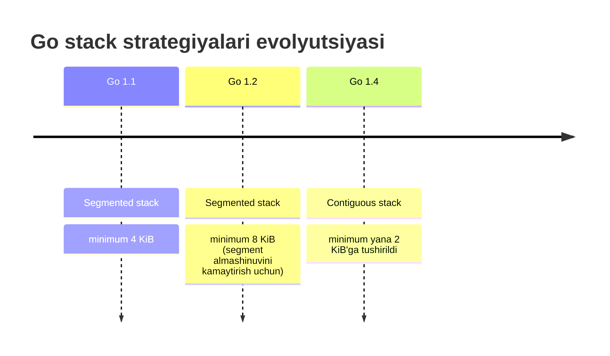

## Segmented Stack (bo'lakli stek — tarixiy yondashuv)

Eski Go versiyalarida (taxminan 1.1–1.3) goroutine bitta kichik **segment** bilan boshlanardi. Agar u chuqurroq chaqiruvlarga kirib joy tugab qolsa, runtime **yangi segment** ajratib, uni avvalgisiga **bog'lardi** (link).

Stack har doim segmentning yuqori manzilidan pastga qarab o'sadi. Runtime past chegaradan biroz yuqorida **guard** qiymatini saqlaydi. Stack shu guard'dan o'tsa — "keyingi frame uchun joy yo'q" degan signal.

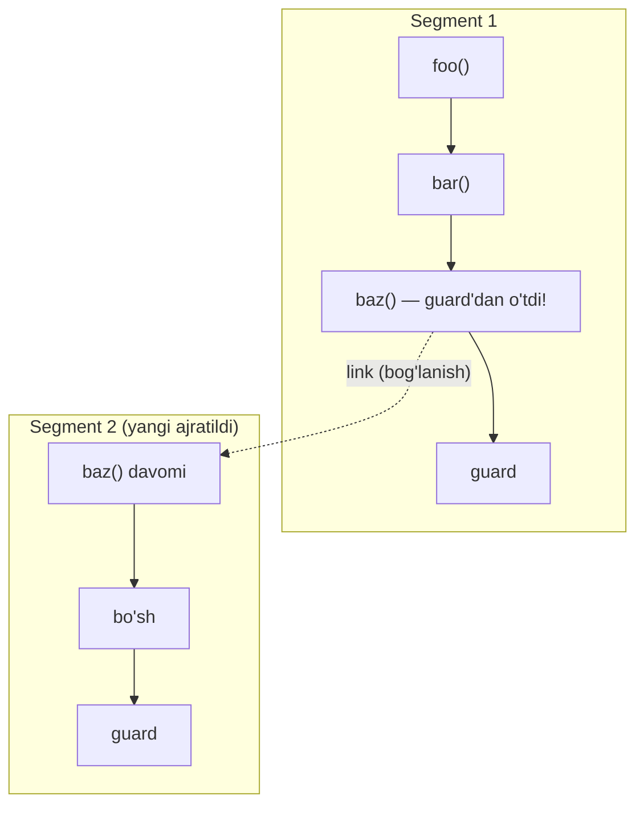

Chuqur chaqiruv qaytganda runtime eng yangi segmentni tashlab yuboradi: kerakli ma'lumotni qaytarib nusxalaydi, segmentni uzadi va qayta ishlatish uchun bo'shatadi. Shunday qilib stack cheksiz o'smasdan yana qisqarishi mumkin edi.

### "Hot split" muammosi

Muammo — **qaynoq kod yo'llarida** (hot code paths). Tasavvur qiling, stack deyarli to'la va tsikl ichida funksiya qayta-qayta chaqirilmoqda:

```go
func loopWork() {
    for i := 0; i < 1_000_000; i++ {
        deepCall()
    }
}

func deepCall() {
    local := [1000]int{} // stack'da ko'p joy egallaydi
    use(local)
}

func main() {
    loopWork()
}
```

Har bir iteratsiya: `deepCall()` chaqiriladi → joy yetmaydi → yangi segment **ajratiladi va bog'lanadi** → funksiya qaytadi → segment **uzilib bo'shatiladi**. Bu million marta takrorlanadi. Dastur ish bajarish o'rniga doimiy ravishda segment ajratib-bo'shatish bilan band bo'ladi. Bu **hot split** deb ataladi — dastur foydali ish qilish o'rniga stack segmentlarini boshqarishga sezilarli vaqt sarflaydi.

Aynan shu kamchilik tufayli Go segmented stack'ni **contiguous stack** bilan almashtirdi.

## Contiguous Stack (uzluksiz stek — hozirgi yondashuv)

Zamonaviy Go'da goroutine'ga ko'proq joy kerak bo'lsa, runtime yangi segmentni bog'lamaydi. Buning o'rniga u:

1. Yangi, **kattaroq uzluksiz** stack ajratadi (odatda joriy o'lchamni **ikki barobarga** oshirib, sig'guncha).
2. Kichik stack'ning **butun mazmunini** yangi stack'ga nusxalaydi.
3. Eski stack'ga ishora qilgan barcha `pointer`'larni yangi manzillarga **tuzatadi**.
4. Eski stack'ni bo'shatadi.

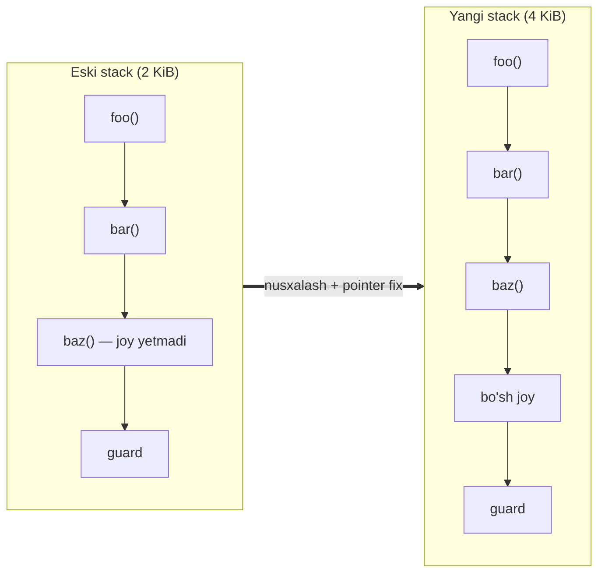

Har bir funksiya o'z **prologue**'sida tezkor tekshiruv bilan boshlanadi: "mening frame'im uchun joy yetadimi?". Agar yo'q bo'lsa — runtime'ga sakraydi, stack o'stiriladi, live frame'lar ko'chiriladi va funksiya yangi stack'da davom etadi.

### Stack ko'chganda pointer'lar yangilanadi

Eng ko'zga ko'rinadigan effekt — stack o'zgaruvchilarining **manzillari o'zgaradi**:

```go
//go:noinline
func f() {
    b := [512]byte{}
    println("f called with b:", &b)
}

func main() {
    a := [256]byte{}
    println("old a:", &a)
    f()               // bu chaqiruv stack o'sishini keltirib chiqaradi
    println("new a:", &a)
}
```

Natija (manzillar har xil bo'ladi):

```
old a: 0x1400005e638
f called with b: 0x14000106c20
new a: 0x14000106e48
```

`a`ning manzili birinchi va ikkinchi `println` orasida o'zgardi! Chunki `f()`ni chaqirish stack o'sishini keltirib chiqardi: `f`ning `b := [512]byte{}` frame'ni shunchalik kattalashtirdiki, runtime kattaroq stack ajratib, `main` frame'ini yangi joyga ko'chirdi.

Xuddi shu narsa `p := &a` ko'rinishidagi pointer o'zgaruvchilar uchun ham amal qiladi — `p`dagi qiymat avtomatik yangilanadi. Hatto `unsafe.Pointer` ham yangilanadi, chunki u ham pointer-typed qiymat bo'lib, stack'ning **pointer map**'ida kuzatiladi.

### Muhim tuzoq: `uintptr` yangilanmaydi

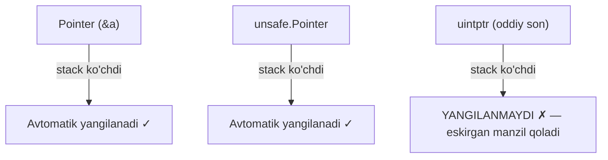

Pointer'ni `uintptr`ga aylantirsangiz, u oddiy **butun songa** aylanadi. Runtime stack'ni ko'chirganda butun sonlarni pointer deb hisoblamaydi, shuning uchun `uintptr`da saqlangan qiymat **yangilanmaydi** — u chaqiruvdan keyin eskirgan (stale) manzilni saqlab qolishi mumkin. Bu `unsafe` bilan ishlashda eng keng tarqalgan xatolardan biri.

## Stack Management (stek boshqaruvi)

Eng birinchi stack Go runtime ishga tushishidan **oldin** mavjud bo'ladi. OS dasturni ishga tushirganda asosiy thread'ni yaratadi va unga OS boshqaradigan stack beradi. Runtime'da bu asosiy thread `m0` deb ataladi, uning maxsus goroutine'i esa `g0` — **system goroutine**.

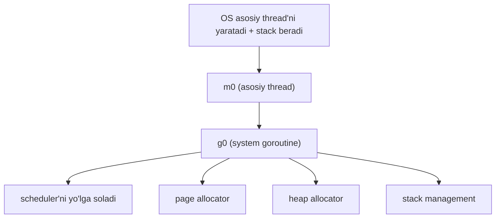

`g0` goroutine'i faqat runtime'ning ichki ishlari uchun ishlatiladi: scheduling, garbage collection, system call'lar. U hech qachon sizning Go funksiyalaringizni ishlatmaydi. **Har bir** OS thread (har bir `M`) o'zining `g0`'siga ega; `m0.g0` — "asosiy thread'ning system goroutine'i".

### System stack va gsignal

- **System stack'lar** OS tomonidan xaritalanadi (Linux'da anonim `mmap`, macOS'da Mach VM, Windows'da VirtualAlloc). Ular goroutine stack'lari kabi **o'smaydi va ko'chmaydi**.
- **`gsignal`** — signal goroutine'i. Har bir OS thread uchun runtime ruxsat etilgan o'lchamli stack bilan `gsignal` yaratadi. Unix'da signal handler'lar **alternate signal stack**'da ishlaydi.

> **Alternate signal stack (`sigaltstack`) nima?**
> Bu — har bir thread uchun OS sozlamasi bo'lib, yadroga signal handler'ni ishlatganda qaysi xotira diapazonini stack sifatida ishlatishni aytadi. Bu maxsus obyekt emas, shunchaki "bu xotirani signal-handler stack sifatida ishlat" degan ko'rsatkich + o'lcham. Go odatda `gsignal` stack'ni shu diapazon sifatida ro'yxatdan o'tkazadi. Agar Go bo'lmagan kod allaqachon o'z alternate stack'ini o'rnatgan bo'lsa, Go signal davomida `gsignal`ni vaqtincha shu diapazonga ishora qildiradi, keyin tiklaydi.

Ishga tushishning boshida runtime `stackinit()` bilan stack boshqaruvi tuzilmalarini ishga tushiradi:

```go
func stackinit() {
    if _StackCacheSize&_PageMask != 0 {
        throw("cache size must be a multiple of page size")
    }
    for i := range stackpool {
        stackpool[i].item.span.init()
        lockInit(&stackpool[i].item.mu, lockRankStackpool)
    }
    for i := range stackLarge.free {
        stackLarge.free[i].init()
        lockInit(&stackLarge.lock, lockRankStackLarge)
    }
}
```

Kontseptual jihatdan ikki yo'l bor va ikkalasi ham bo'sh boshlanadi:

- **`stackpool`** — o'lcham sinflari bo'yicha tashkil etilgan **kichik stack'lar** uchun pooled path.
- **`stackLarge`** — bu sinflarga sig'maydigan **katta stack'lar** uchun to'g'ridan-to'g'ri yo'l.

Pooled path'da global pool oldida **per-P kesh**lar turadi, shuning uchun ko'p stack ajratishlar global contention'dan qochadi.

## Stack Allocation (stek ajratish)

`go f()` yozganingizda kompilyator uni `runtime.newproc()`ga aylantiradi. Bu yerda goroutine haqiqatan ajratiladi:

```go
func newproc1(fn *funcval, callergp *g, callerpc uintptr, parked bool, waitreason waitReason) *g {
    if fn == nil {
        fatal("go of nil func value")
    }
    mp := acquirem()
    pp := mp.p.ptr()

    newg := gfget(pp)     // avval o'lik goroutine'ni qayta ishlatishga urinish
    if newg == nil {
        newg = malg(stackMin) // topilmasa — yangi stack bilan yangi g
    }
    ...
}
```

### Per-P stack cache va size order'lar

Har bir P o'zining `mcache`'sida kichik stack bloklarini saqlaydi. Bu kesh bir necha **size order**'ga bo'linadi (`_NumStackOrders`). Linux/darwin/bsd'da 4 ta order: **2, 4, 8, 16 KiB**. Order `k` = `fixedStack << k`.

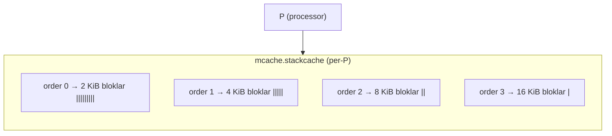

Kesh **byte budget** ostida ishlaydi: har bir order'ning qattiq chegarasi 32 KiB (`_StackCacheSize`), 16 KiB bo'laklarda to'ldiriladi va kesiladi. Barqaror holatda taxminan:

- 2 KiB order: ~8 blok (16 gacha)
- 4 KiB order: ~4 blok (8 gacha)
- 8 KiB order: ~2 blok (4 gacha)
- 16 KiB order: ~1 blok (2 gacha)

### Ajratish yo'li: kesh → pool → heap

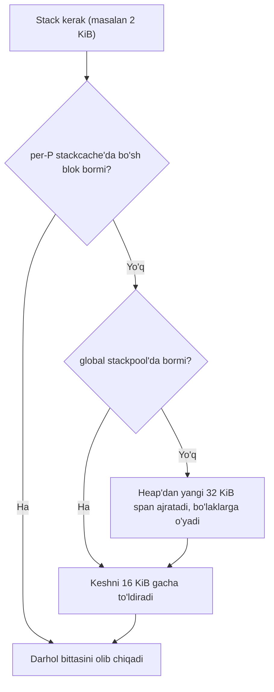

### stackpool: 32 KiB span'lar

Global `stackpool` har bir order uchun **32 KiB span'lar** ro'yxatini saqlaydi. Har bir span qo'lda teng bo'laklarga o'yiladi: 2 KiB'dan **16 ta**, 4 KiB'dan **8 ta**, 8 KiB'dan **4 ta**, yoki 16 KiB'dan **2 ta** bo'lak.

Muhim farq — **heap kesh** va **stack kesh** bir xil emas:

| | Heap kesh (per-P) | Stack kesh (per-P) |
|---|---|---|
| Nima saqlaydi | To'liq **span**'lar | Alohida **segment**'lar |
| Egalik | Span P'ga tegishli | Backing span global pool'da qoladi |
| Bo'shatish | mcentral'ga qaytariladi | Segment pool'ga qaytadi, span faqat hammasi bo'sh bo'lsa heap'ga |

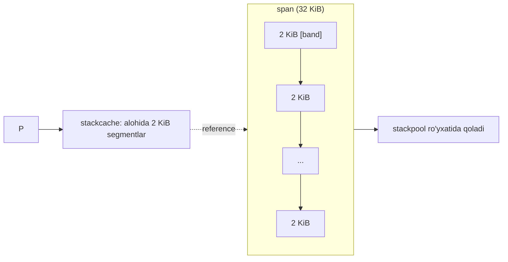

### Manual span'lar va stackLarge

Stack uchun ishlatiladigan span'lar **manual span**'lar deb ataladi — ular GC heap'idan **tashqarida** boshqariladi: GC obyektlariga bo'linmaydi, mark bit'lari yo'q, GC tomonidan sweep qilinmaydi, alohida hisoblanadi ("stacks", heap emas).

**`stackLarge`** — 32 KiB dan katta stack'lar uchun. Bu yerda har bir `mspan` aynan **bitta stack**ni ifodalaydi va hech qachon bo'linmaydi.

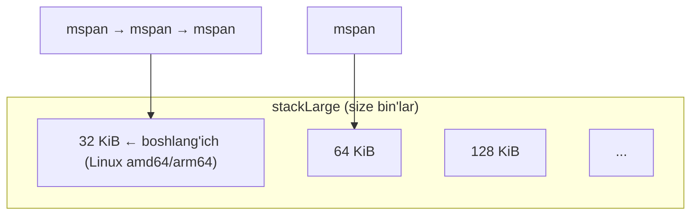

Ikkita amaliy chegara:

- **Past chegara:** kamida 32 KiB bo'lgan har qanday stack `stackLarge` orqali ajratiladi.
- **Yuqori chegara — `runtime.maxstacksize`:** goroutine stack'lari bundan oshib o'smaydi. Standart: 64-bitda **1 GB**, 32-bitda 250 MB.

O'sish odatda ikki barobarlash bo'lgani uchun amalda ko'rinadigan eng katta stack ~512 MiB (keyingi ikki barobarlash `maxstacksize`dan oshib ketadi). Bundan tashqari qattiq chegara `maxstackceiling` bor (64-bitda 2 GB).

> **Diqqat:** GB (decimal, 10⁹) va GiB (binary, 2³⁰) — farqli birliklar.

Bo'shatilgan stack'lar darhol OS'ga qaytarilmaydi — qayta ishlatish uchun per-P kesh va global pool'da saqlanadi. GC tsikli oxirida runtime to'liq bo'sh stack span'larini heap'ga qaytaradi.

## Stack Recycle (stekni qayta ishlatish)

2 KiB boshlang'ich o'lcham har doim ham optimal emas. Runtime `runtime.startingStackSize`da **harakatlanuvchi boshlang'ich o'lcham** saqlaydi va uni vaqt o'tishi bilan sozlaydi.

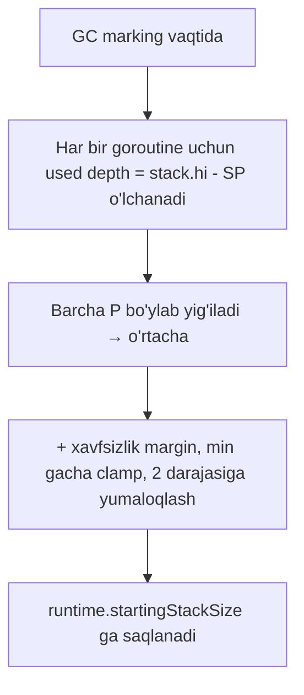

### Free list'lar: gFree

O'lik (dead) goroutine'lar qayta ishlatish uchun saqlanadi. Ikki daraja bor:

- **Per-P:** `p.gFree` — stack'li va stack'siz g'lar aralash.
- **Global:** `sched.gFree.stack` (stack'li) va `sched.gFree.noStack` (stack'siz), bitta lock bilan.

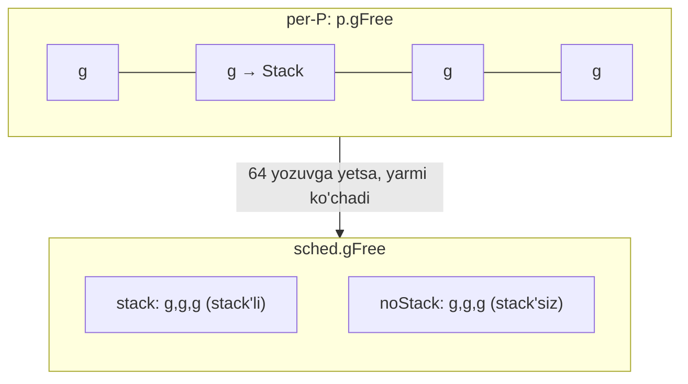

Goroutine o'lganda runtime uning stack o'lchamini tekshiradi:

- O'lcham `startingStackSize`ga **mos kelmasa** → stack bo'shatiladi, faqat `g` deskriptori saqlanadi.
- **Mos kelsa** → goroutine o'z stack'i bilan keshlanadi.

Yangi goroutine ishga tushirilganda:

1. Avval per-P free list'dan o'lik goroutine qayta ishlatishga urinadi.
2. Bo'sh bo'lsa → global pool'dan lokal ro'yxatni ~32 gacha to'ldiradi, **stack'li**larga ustunlik berib.
3. Ikkalasi ham bo'sh bo'lsa → minimal stack bilan butunlay yangi goroutine ajratadi.

## Goroutine Stack Anatomy

Runtime'da goroutine va uning stack'i shunday ifodalanadi:

```go
type stack struct {
    lo uintptr  // past chegara
    hi uintptr  // yuqori chegara
}

type g struct {
    stack       stack   // 16 bayt
    stackguard0 uintptr // user-stack guard
    stackguard1 uintptr // system-stack guard
    ...
}
```

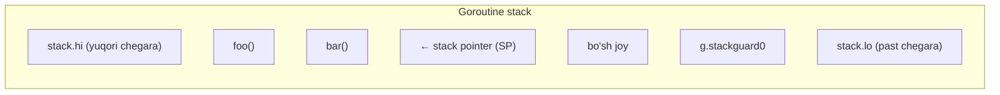

- **`stack.lo` / `stack.hi`** — stack chegaralari. Stack `hi`dan `lo`ga qarab pastga o'sadi.
- **`g.stackguard0`** — user-stack guard. Oddiy funksiya prologi `SP`ni shu bilan taqqoslaydi: "stack o'sishi kerakmi?".
- **`g.stackguard1`** — system-stack guard. `g0`/`gsignal`da odatdagidek ishlaydi. Oddiy goroutine stack'da esa u juda katta sentinel qiymatga (`^uintptr(0)`) o'rnatiladi — agar system-stack kod xato bilan user stack'da ishlab qolsa, runtime `"attempt to execute system stack code on user stack"` bilan crash bo'ladi.

### Guard masofasi — 928 bayt

`stackGuard` uch qismdan tashkil topadi:

```go
stackNosplit = abi.StackNosplitBase * sys.StackGuardMultiplier // 800 * 1
stackGuard   = stackNosplit + stackSystem + abi.StackSmall     // 800 + 0 + 128 = 928
```

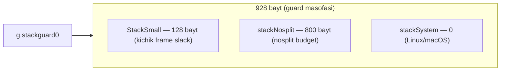

- **`stackNosplit` (800):** `nosplit` funksiyalari uchun zaxira.
- **`stackSystem`:** OS'ga xos dum (Windows 4096, Plan 9 512, iOS/arm64 1024, Linux/macOS **0**).
- **`abi.StackSmall` (128):** kichik frame'lar uchun bo'shliq.

`StackGuardMultiplier` normal build'da 1, ammo race detector yoki AIX'da kattaroq.

## Stack Frame Types (frame turlari)

Kompilyator funksiya frame o'lchamiga qarab **4 xil prologue naqshini** tanlaydi. Bu prologue "stack yetadimi?" degan tekshiruvni qanday bajarishini belgilaydi.

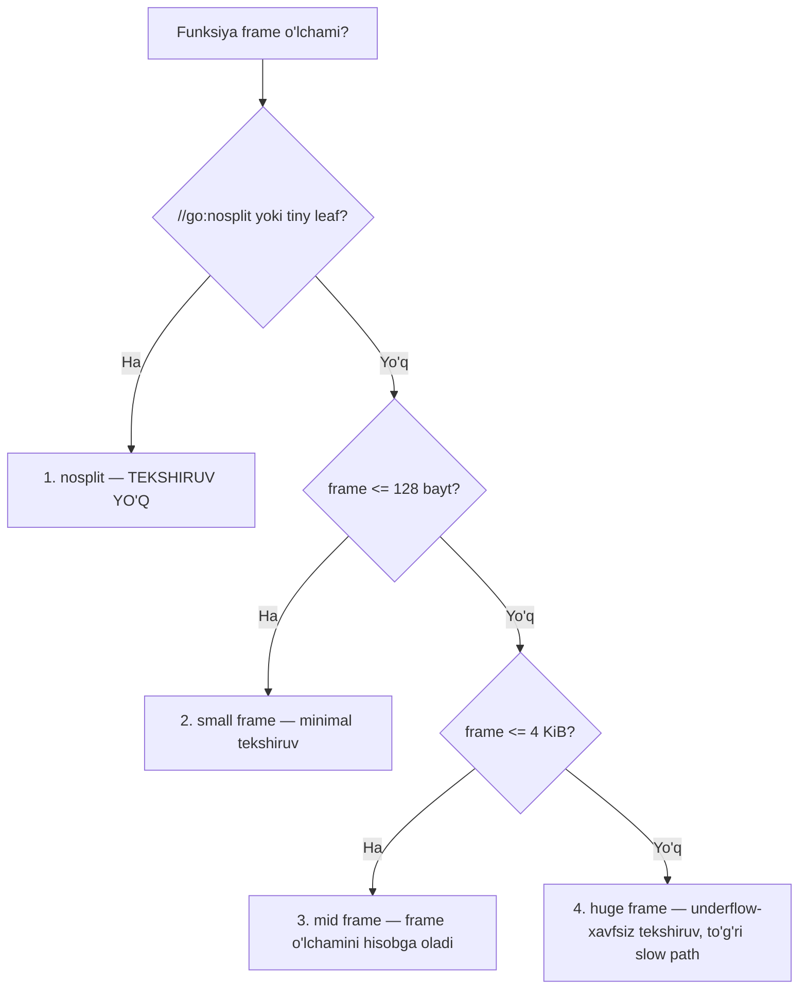

### 1. nosplit frame

`//go:nosplit` funksiya ishlayotganda **hech qachon stack o'sishini keltirib chiqarmasligi kerak**, shuning uchun uning prologida tekshiruv yo'q. Runtime va toolchain'da ba'zi funksiyalar (kritik holatni ushlash, signal handling, prologue tekshiruvining o'zi) normal o'sish mexanizmi ishlay olmaganda ham ishlashi kerak — ular `nosplit` bo'ladi.

```
TEXT main.anyFunction(SB), NOSPLIT|LEAF|NOFRAME|ABIInternal, $0-0
```

Bunday funksiyalar `nosplit budget` ichida qolishi kerak. Bazaviy qiymat `abi.StackNosplitBase` = 800 bayt. Bu — **butun nosplit chaqiruv zanjiri** eng yomon holatda iste'mol qila oladigan maksimal stack.

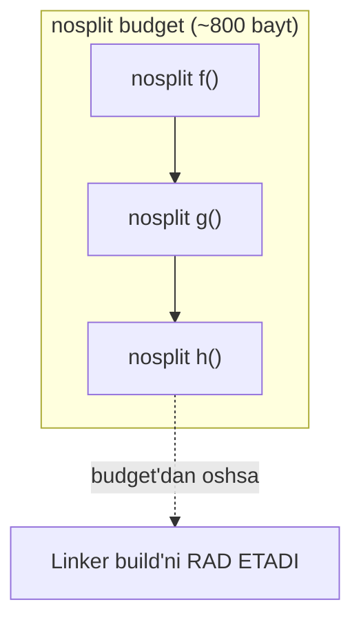

Misol — linker statik tahlil bilan zanjirni tekshiradi:

```go
//go:nosplit
//go:noinline
func consume(depth int) {
    var x [80]byte
    _ = x
    if depth > 0 {
        consume(depth - 1) // cheksiz zanjir — linker buni yoqtirmaydi
    }
}
```

```
$ go build .
main.consume: nosplit stack over 792 byte limit
main.consume<1>
    grows 32 bytes, calls main.consume<1>
    infinite cycle
```

`792` (800 emas) chunki amd64'da har bir `CALL` stack'ga 8-baytli return address itaradi, linker shu narxni ayiradi. Agar linker zanjir budget ichida qolishini **isbotlay olmasa**, u build'ni rad etadi.

### Tiny leaf → avtomatik NOSPLIT

Kompilyator `//go:nosplit`siz ham juda kichik **leaf** funksiyalarni avtomatik `NOSPLIT` deb belgilaydi. Bu xavfsiz, chunki guard masofasi allaqachon 128 baytlik slack (`abi.StackSmall`) o'z ichiga oladi.

```go
//go:noinline
func a() [64]byte {
    b := [64]byte{}
    return b
}
```

```
main.a STEXT nosplit size=96 args=0x40 locals=0x48 leaf
    TEXT main.a(SB), NOSPLIT|LEAF|ABIInternal, $80-64
```

Frame 80 bayt (128 dan past), funksiya hech kimni chaqirmaydi → `LEAF` → avtomatik `NOSPLIT`.

Lekin massivni 90 baytga oshirsak (frame 112 bayt, hali ham 128 dan past), arm64'da kompilyator zeroing/copying uchun `DUFFZERO`/`DUFFCOPY` ishlatadi. arm64 assembler'i bularni **chaqiruv** deb hisoblaydi → leaf bayrog'i o'chadi → avtomatik NOSPLIT bekor bo'ladi → prologue guard tekshiruvini oladi.

> **Muhim nuqta:** 128 baytdan past bo'lish avtomatik `NOSPLIT` degani **emas**. Bu faqat "agar tekshiruv bo'lsa, arzon small-frame naqshi ishlatilishi mumkin" degani.
>
> amd64 avtomatik NOSPLIT'da ko'proq ruxsat beruvchi (DUFFZERO/DUFFCOPY bo'lsa ham leaf saqlanadi). arm64 esa leaf'ni o'chiradi.

### 2. Small frame (≤ 128 bayt)

Minimal tekshiruv: joriy `SP`ni to'g'ridan-to'g'ri guard bilan taqqoslaydi (callee frame o'lchamini ayirmasdan).

```go
func smallFrame() {
    g := getGoroutine()
    if getCurrentSP() <= g.stackguard0 {
        runtime.morestack()
    }
    ...
}
```

Bu xavfsiz, chunki callee frame kichik (≤128), va guard masofasi allaqachon shu 128 baytni o'z ichiga oladi.

### 3. Mid frame (128 bayt – 4 KiB)

Bu yerda tekshiruv frame o'lchamini **aniq hisobga oladi**:

```go
func midFrame(frameSize int) {
    g := getGoroutine()
    checkSP := getCurrentSP() - frameSize
    if checkSP <= g.stackguard0 - StackSmall {
        runtime.morestack()
    }
    ...
}
```

`StackSmall` (128) — small frame uchun ajratilgan bufer bu yerda qayta ishlatiladi.

### 4. Huge frame (> 4 KiB)

Frame juda katta bo'lishi mumkin (hatto `SP`dan katta), shuning uchun **underflow-xavfsiz** ayirish ishlatiladi:

```go
func hugeFrame(frameSize int) {
    g := getGoroutine()
    sp := getCurrentSP()
    tmp, underflow := subWithBorrow(sp, frameSize-StackSmall)
    if underflow {
        runtime.morestack()            // ayirish o'ralib qolsa — darhol o'stir
    } else if g.stackguard0 >= tmp {
        runtime.morestack()
    }
    ...
}
```

Nega mid-frame'da bu underflow himoyasi yo'q? Chunki toolchain `SP`ni hech qachon 0'ga yaqin deb hisoblamaydi — OS past manzillarni unmapped saqlaydi, `abi.StackBig` (4 KiB) shu zonaga sig'adi. Shuning uchun mid-frame'da `SP - frameSize` o'ralib qola olmaydi.

## Stek freymning tuzilishi

Endi bitta **stack frame**ning ichiga kiramiz. Frame — bitta funksiya chaqiruvi uchun ma'lumot (locals, saqlangan registrlar, return address). Prologue va epilogue Go toolchain (kompilyator + assembler) tomonidan chiqariladi. Misol uchun arm64 assembly'dan foydalanamiz:

```go
//go:noinline
func smallFrame() uintptr {
    var buf [100]byte
    buf[0] = 1
    return uintptr(unsafe.Pointer(&buf[0]))
}
```

STEXT sarlavhasi:

```
main.smallFrame STEXT size=96 args=0x0 locals=0x78 funcid=0x0 align=0x0
```

- `size=96` — mashina kodi 96 bayt.
- `args=0x0` — argument yo'q.
- `locals=0x78` — 120 bayt lokal joy.

### Nega 100 bayt massiv → 120 bayt locals?

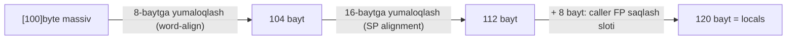

Keyin `TEXT` qatori **jami frame** o'lchamini beradi. arm64'da unga qo'shimcha 8 bayt qo'shiladi — return address (link register `LR`/`R30`) sloti:

```
TEXT main.smallFrame(SB), ABIInternal, $128-0
```

`$128-0` = "128 baytli frame, 0 baytli argument maydoni". Tire — **ajratuvchi**, ayirish emas.

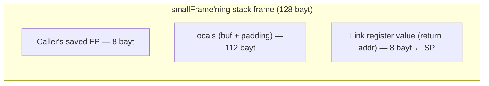

### Ikki asosiy tushuncha: Frame Pointer va Link Register

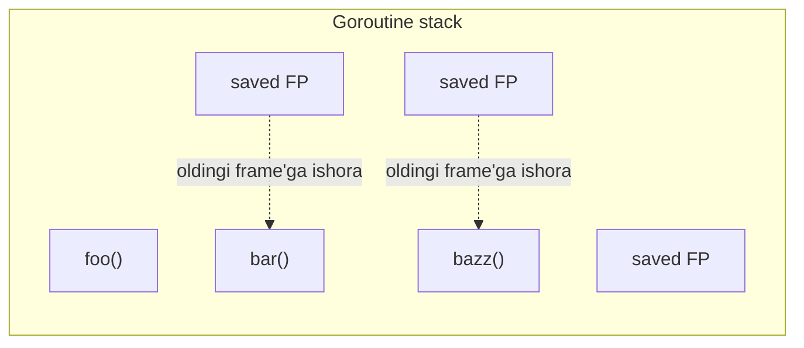

- **Frame Pointer (arm64'da `R29`):** joriy frame'ga barqaror mos yozuv nuqtasi. U frame'larning **linked list**'ini hosil qiladi — debugger, profiler va runtime shu zanjir orqali stack'ni tez aylanib (unwind) chiqib, aniq stack trace tuzadi.
- **Link Register (arm64'da `R30`/`LR`):** `CALL` bajarilganda apparat return address'ni shu registrga yozadi. Callee tugaganda `LR` orqali caller'ga qaytadi.

### Prologue: stack-split check

```
00000 MOVD  16(g), R16   // g.stackguard0 ni R16 ga yukla (16 = stack (16 bayt) dan keyin)
00004 CMP   R16, RSP     // SP ni guard bilan taqqosla
00008 BLS   76           // joy yo'q bo'lsa slow path'ga sakra
...
00076 NOP
00076 MOVD  R30, R3      // LR ni scratch registrga nusxala (hali stack'ga saqlanmagan)
00080 CALL  runtime.morestack_noctxt(SB)
00084 JMP   0            // stack o'sgandan keyin prologue'ni qaytadan boshla
```

`16(g)` — "g pointer'dan 16 bayt offset". `stack` maydoni 16 bayt (`lo`+`hi`) egallaydi, shuning uchun `stackguard0` aynan 16-offsetda. Slow path'da `NOP` — shunchaki branch uchun qo'nish nuqtasi. `LR` hali stack'ga saqlanmagani uchun avval `R3`ga nusxalanadi (runtime uni iz sifatida ishlatadi).

### Frame'ni o'rnatish (prologue davomi)

```
00012 MOVD.W R30, -128(RSP)  // SP -= 128, keyin LR ni yangi manzilga saqla (pre-decrement)
00016 MOVD   R29, -8(RSP)    // caller FP ni SP-8 ga saqla
00020 SUB    $8, RSP, R29    // R29 = SP-8 (yangi frame pointer)
```

Konseptual:

```
RSP = RSP - 128
MEM[RSP]     = R30   // LR
MEM[RSP - 8] = R29   // caller FP
R29 = RSP - 8        // yangi FP
```

### Pseudo `SP` va `FP` — apparat registrlari EMAS

Assembly'da `buf-100(SP)` yoki `arg+0(FP)` ko'rsangiz — bu **pseudo-registr**lar:

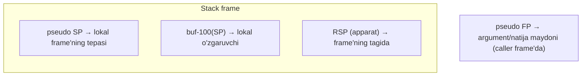

- **pseudo `SP`** — "lokal frame'ning tepasi", barqaror abstraksiya. Assembler uni keyin haqiqiy `RSP`dan aniq offset'ga qayta yozadi.
- **pseudo `FP`** — argument/natija maydoni (apparat FP registri `R29`dan farqli). `arg+0(FP)` — caller bergan argumentlar.

### Epilogue: frame'ni buzish

```
00060 MOVD $main.buf-100(SP), R0  // return qiymati (buf manzili) R0 ga
00064 LDP  -8(RSP), (R29, R30)    // saqlangan FP va LR ni tikla
00068 ADD  $128, RSP              // frame'ni "bo'shat" (SP ni yuqoriga)
00072 RET  (R30)                  // tiklangan LR orqali caller'ga qayt
```

`ADD $128, RSP` — baytlar OS'ga qaytarilmaydi, shunchaki bu 128 baytli diapazon yana **ishlatilmagan** deb belgilanadi. Keyingi chaqiruv uni qayta ishlatadi.

## Stack Expansion (kengayish)

Endi Go misoli bilan stack o'sishini kuzatamiz. `stackDebug` — kompilyatsiya-vaqti konstantasi (`0`–`4`), uni yoqish uchun runtime manbasini o'zgartirib toolchain'ni qayta qurish kerak.

```go
//go:noinline
func f() {
    b := [1024]byte{}
    println("f called with b:", &b)
}

func main() {
    a := [256]byte{}
    println("a1:", &a)
    f()
    println("a2:", &a)
}
```

`stackDebug = 1` bilan loglar:

```
stackalloc 2048
  allocated 0x1400005e800
runtime: newstack sp=0x1400005e740 stack=[0x1400005e000, 0x1400005e800]
a1: 0x1400005e638
runtime: newstack sp=0x1400005e620 stack=[0x1400005e000, 0x1400005e800]
stackalloc 4096
stackcacherefill order=1
  allocated 0x14000206000
copystack gp=0x140000021c0 [0x1400005e000 0x1400005e620 0x1400005e800] to [0x14000206000 0x14000206e20 0x14000207000]/4096
stackfree 0x1400005e000 2048
stack grow done
f called with b: 0x14000206a18
a2: 0x14000206e38
```

Jarayonni ketma-ketlik sifatida:

```mermaid
sequenceDiagram
    participant M as main goroutine
    participant R as runtime
    participant P as page/stack allocator

    R->>P: stackalloc 2048 (boshlang'ich 2 KiB stack)
    P-->>R: [0x...e000, 0x...e800]
    M->>M: a1 chop etildi (0x...e638)
    M->>R: f() chaqiruvi — prologue: joy yetmadi!
    R->>P: stackalloc 4096 (2x kattaroq)
    P-->>R: stackcacherefill order=1 → 0x...06000
    R->>R: copystack — live frame'lar ko'chiriladi
    Note over R: yangi SP = 0x...06e20<br/>(hi'dan bir xil masofada)
    R->>P: stackfree eski 2 KiB
    R->>M: stack grow done — davom et
    M->>M: b (0x...06a18), a2 (0x...06e38)
```

Muhim tafsilotlar:

- `copystack` uchligi `[lo, sp, hi]` eski va yangi stack chegaralarini ko'rsatadi. Runtime **used depth**ni saqlaydi — live frame'lar `hi`dan bir xil masofada qoladi.
- 2 KiB → 4 KiB (aynan **ikki barobar**).

### Pointer'lar qanday tuzatiladi?

Ikkita fakt buni sodda qiladi:

1. Stack — bitta **uzluksiz** blok.
2. Yangi blok — eski blokning **doimiy offset**ga siljitilgan nusxasi (eski `hi` va yangi `hi` orasidagi farq). Har bir stack pointer'ga shu offset qo'shiladi.

Runtime faqat **kerakli** pointer'larni tuzatadi: live frame'lardagilar + ba'zi runtime bookkeeping (panic/defer holati, `sudog` channel wait yozuvlari).

```mermaid
stateDiagram-v2
    [*] --> Grunning
    Grunning --> Gcopystack: morestack — joy yetmadi
    Gcopystack --> Gcopystack: yangi stack ajrat, live frame'lar nusxala, pointer fix
    Gcopystack --> Grunning: saqlangan kontekst yangilandi
    note right of Gcopystack
        Funksiyangiz ko'chishni "sezmaydi" —
        keyingi ko'rsatma yangi stack'da
        hech narsa bo'lmagandek ishlaydi
    end note
```

> **Escape analysis bilan bog'liq muhim qoida:** heap **hech qachon** goroutine stack'iga ishora qiluvchi pointer saqlamaydi. Agar `&x`ni heap pointer'da saqlasangiz, `x` heap'ga ko'chiriladi. Shu tufayli stack ko'chganda heap→stack pointer'larni tuzatish kerak bo'lmaydi. Buni [04 Escape Analysis](04_escape_analysis.md)'da batafsil ko'ramiz.

## Stack Shrinking (qisqarish)

Stack o'sishi funksiya prologi bilan boshlanardi. Qisqarish esa **butunlay boshqacha** — u funksiya prologida emas, **GC vaqtida** sodir bo'ladi. GC goroutine'ni to'xtatib stack'ini pointer'lar uchun skanerlaganda, u qancha stack ishlatilayotganini ham o'lchaydi.

```mermaid
flowchart TB
    GC["GC goroutine stack'ini skanerlaydi"] --> CHECK{"used < stack'ning 1/4 qismimi?"}
    CHECK -->|Yo'q| KEEP["Hech narsa qilinmaydi"]
    CHECK -->|Ha| HALF{"yangi o'lcham (yarmi) >= fixedStack?"}
    HALF -->|Yo'q| KEEP
    HALF -->|Ha| SAFE{"nusxalash xavfsizmi?"}
    SAFE -->|Yo'q| MARK["Belgilanadi — keyingi safe point'da qisqartiriladi"]
    SAFE -->|Ha| SHRINK["copystack bilan yarmiga qisqartiriladi"]
```

Qoida: goroutine o'z stack'ining **to'rtdan biridan kamini** ishlatayotgan bo'lsa, runtime uni **yarmiga** kamaytiradi — lekin hech qachon `fixedStack`dan past emas.

```go
func shrinkstack(gp *g) {
    ...
    oldsize := gp.stack.hi - gp.stack.lo
    newsize := oldsize / 2
    if newsize < fixedStack {
        return
    }
    // Faqat 25% dan kam ishlatilsa qisqartir
    avail := gp.stack.hi - gp.stack.lo
    if used := gp.stack.hi - gp.sched.sp + stackNosplit; used >= avail/4 {
        return
    }
    ...
    copystack(gp, newsize) // o'sish bilan bir xil mexanizm
}
```

Used hisoblanganda `stackNosplit` qo'shiladi (nosplit funksiyalarga joy qolishi uchun). Nusxalash faqat **xavfsiz** bo'lganda amalga oshiriladi — agar goroutine system call'da, async safe point'da yoki channel'da park bo'lish atrofidagi tor oynada bo'lsa, runtime uni belgilaydi va keyingi **sinxron safe point**gacha kechiktiradi.

Qisqarish o'sish bilan bir xil `copystack` mexanizmini ishlatadi: kichikroq stack ajrat → live frame'lar nusxala → pointer fix → eski stack'ni bo'shat.

## Eslab qol

- Goroutine stack **kichik** boshlanadi (Linux/macOS'da 2 KiB) va runtime uni **o'stiradi/qisqartiradi** — OS thread stack'idan farqli.
- Eski **segmented stack** "hot split" muammosidan aziyat chekardi. Hozirgi **contiguous stack** kattaroq blok ajratib, mazmunini **nusxalab**, pointer'larni **tuzatadi**.
- Stack ko'chganda `pointer` va `unsafe.Pointer` **avtomatik yangilanadi**, lekin **`uintptr` YANGILANMAYDI** — bu xavfli tuzoq.
- `stackguard0` — funksiya prologi "stack yetadimi?" degan tekshiruvda ishlatadigan chegara. Guard masofasi Linux/macOS'da **928 bayt** (800 nosplit + 128 small + 0 system).
- Ajratish yo'li: **per-P stackcache → global stackpool → heap**. Kichik stack'lar 32 KiB span'lardan o'yiladi, katta stack'lar `stackLarge`da butun span sifatida yashaydi.
- Frame o'lchamiga qarab **4 prologue naqshi**: nosplit (tekshiruv yo'q), small (≤128), mid (≤4 KiB), huge (>4 KiB).
- `//go:nosplit` funksiya **stack o'stira olmaydi** va `nosplit budget` (~800 bayt) ichida qolishi kerak — linker buni statik tekshiradi.
- **Frame pointer (R29)** frame'lar linked list'ini, **link register (R30)** return address'ni saqlaydi.
- Stack **o'sishi** funksiya prologida (`morestack`), **qisqarishi** esa **GC vaqtida** (used < 1/4 bo'lsa) sodir bo'ladi.

## Tez-tez uchraydigan xatolar

### 1. `uintptr`da manzil saqlash

```go
// XATO!
p := unsafe.Pointer(&a)
u := uintptr(p)      // oddiy songa aylandi
foo()                // bu chaqiruv stack o'sishini keltirib chiqarishi mumkin
p2 := unsafe.Pointer(u) // u endi ESKIRGAN manzilni saqlaydi — xavfli!
```

`uintptr` stack ko'chganda yangilanmaydi. `unsafe.Pointer`ni `uintptr`ga aylantirish va qaytarish **bitta ifoda ichida** bo'lishi kerak.

### 2. "Pointer ishlatsam heap'ga ko'chadi" degan noto'g'ri tushuncha

Pointer'ning o'zi heap ajratishga sabab **bo'lmaydi**. Qaror escape analysis tomonidan qilinadi — buni keyingi bo'limda ko'ramiz. Pointer faqat funksiyaga uzatilib, saqlanmasa/qaytarilmasa — stack'da qoladi.

### 3. Chuqur rekursiya = stack yo'q degan xato taxmin

Go goroutine stack **1 GB**gacha o'sishi mumkin (`maxstacksize`). Chuqur rekursiya darhol crash bo'lmaydi, lekin cheksiz rekursiya `stack overflow` (goroutine stack exceeds limit) bilan tugaydi.

### 4. `//go:nosplit`ni yengil-yelpi ishlatish

`nosplit` funksiya budget ichida qolishi kerak. Katta lokal massiv yoki chuqur `nosplit` zanjir → linker `nosplit stack over ... limit` xatosi bilan build'ni rad etadi.

## Amaliyot

### 1-mashq: Stack o'sishini o'z ko'zingiz bilan ko'ring

Quyidagi kodni yozing va ishga tushiring. `a`ning manzili o'zgaradimi? Nega?

```go
//go:noinline
func grow() {
    var big [4096]byte
    println("big:", &big)
}

func main() {
    a := 42
    println("a1:", &a)
    grow()
    println("a2:", &a)
}
```

### 2-mashq: pointer vs uintptr

`unsafe.Pointer` va `uintptr` bilan ikkita variant yozing, stack o'sishidan keyin qaysi biri to'g'ri manzilni saqlaydi? Natijalarni taqqoslang va nega farq borligini tushuntiring.

### 3-mashq: nosplit chegarasini buzing

`//go:nosplit` funksiya yozib, ichida katta lokal massiv (`[2000]byte`) e'lon qiling va uni boshqa funksiyadan chaqiring. `go build` nima deydi? Xato xabarini o'qib tushuntiring.

### 4-mashq: Frame o'lchamini tekshiring

`go tool compile -S main.go` bilan ikkita funksiya assembly'sini oling: biri kichik frame (`[64]byte`), ikkinchisi katta (`[8192]byte`). `TEXT` qatoridagi frame o'lchamini va prologue'da `morestack` chaqiruvi bor-yo'qligini taqqoslang.

---

**Avvalgi mavzu:** [← 02 Heap](02_heap.md)
**Keyingi mavzu:** [Keyingi: 04 Escape Analysis →](04_escape_analysis.md)
