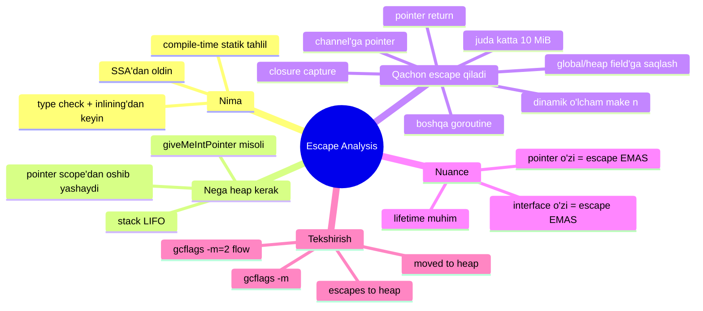
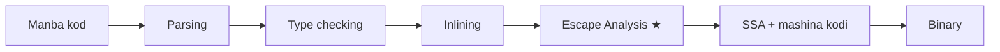
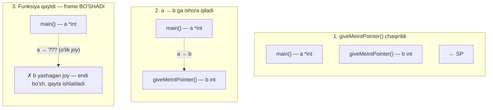
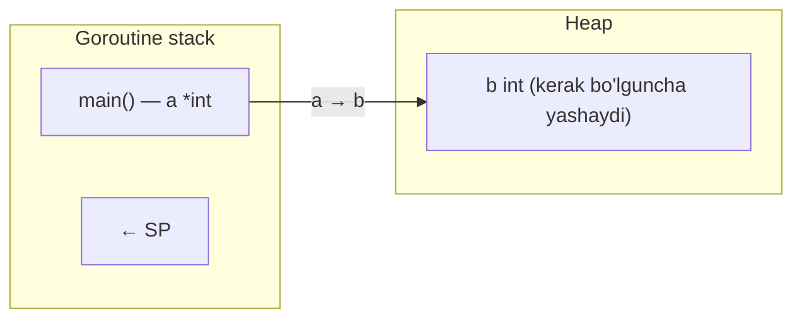
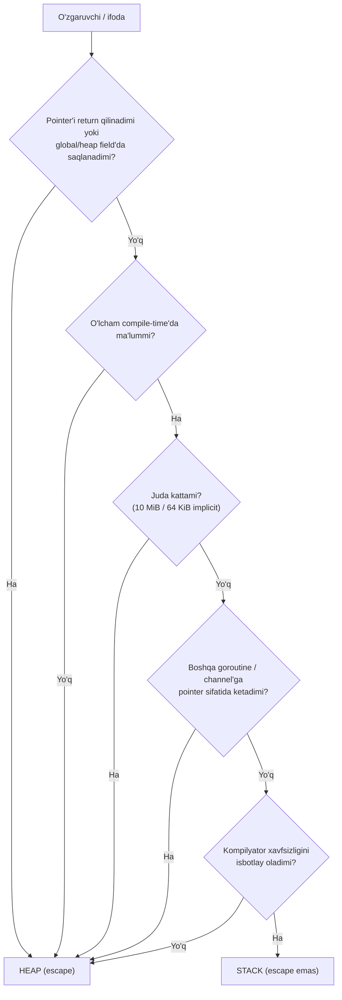
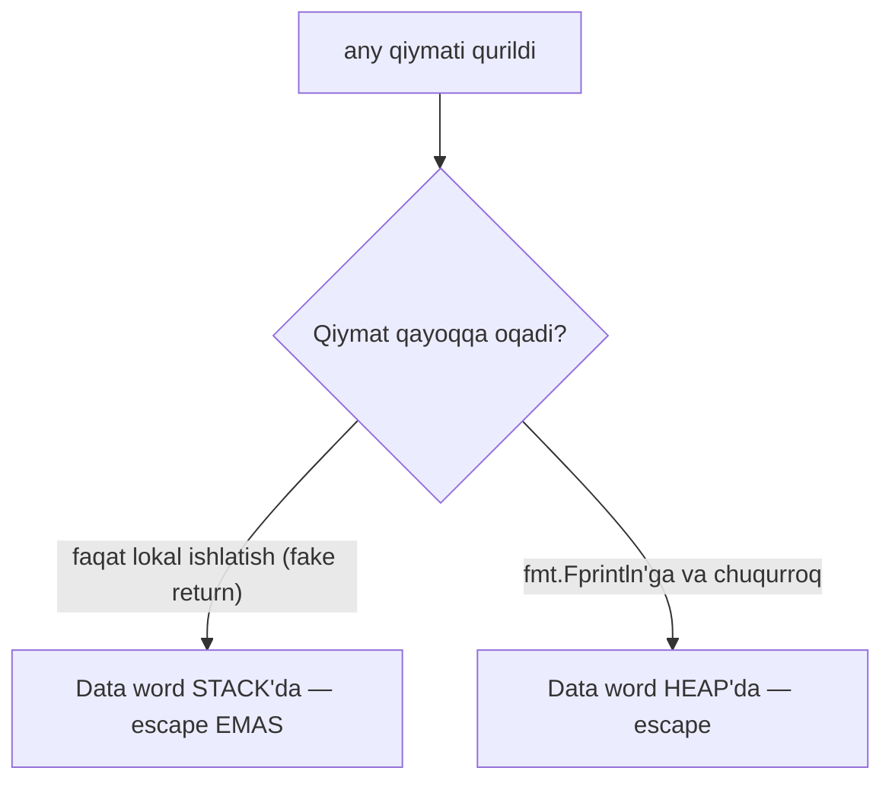
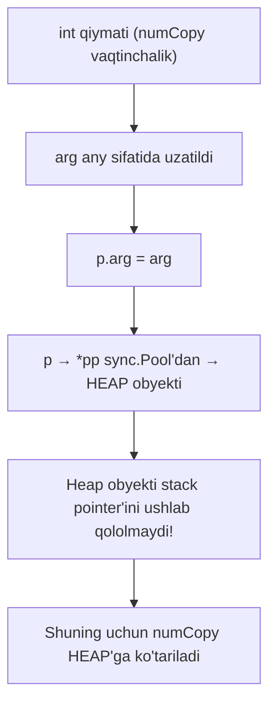
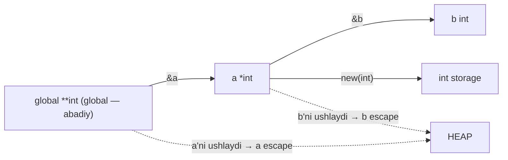
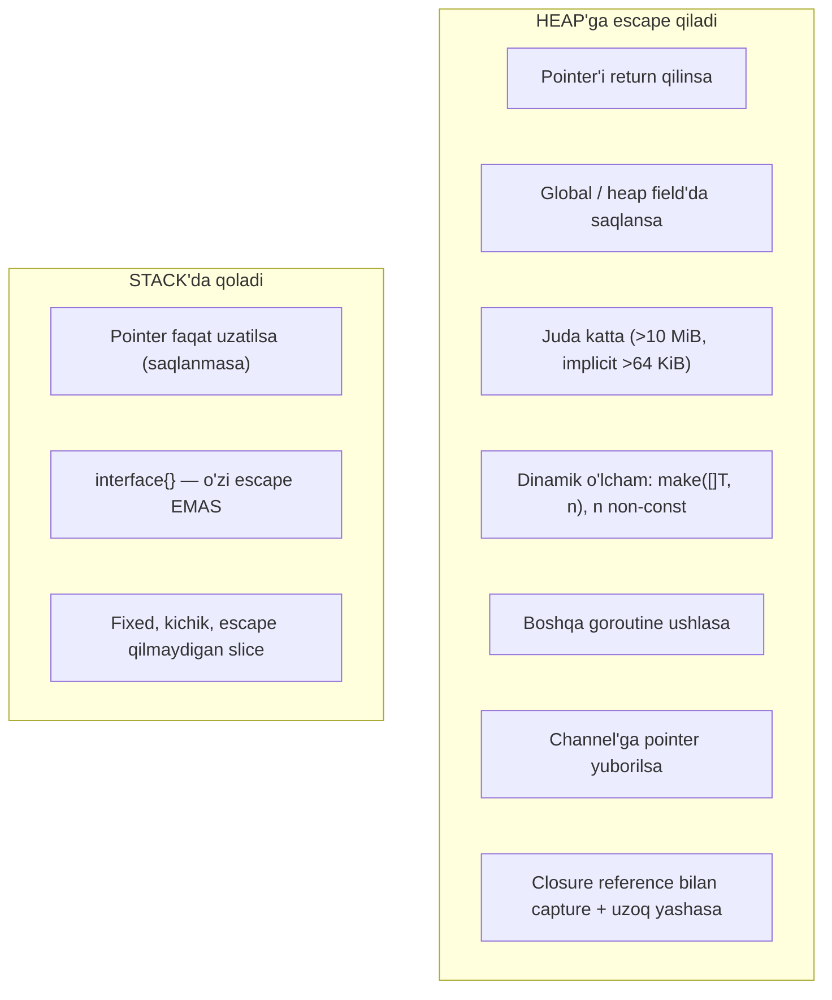

# 04 — Escape Analysis

> Ushbu material — **The Anatomy of Go** (Phuong Le) kitobining 7-bobi (Memory) asosida o'zbek tilida tayyorlangan o'quv qo'llanma. Mavzular kitobdan o'qib tushunilib, **o'z so'zlarim bilan** qayta tushuntirilgan — asl matnning so'zma-so'z tarjimasi emas. Texnik atamalar (stack, heap, escape, interface, pointer...) inglizcha qoldirilgan.

## Nima uchun bu mavzu muhim?

Avvalgi bo'limda ([03 Goroutine Stack](03_goroutine_stack.md)) ko'rdikki, funksiya ishlayotganda uning **stack frame o'lchami ruxsat etilgan (fixed)** — kompilyator uni binarini qurayotganda hal qiladi. Shu sababli kompilyator **oldindan** hal qilishi kerak: bu qiymat stack frame'da yashay oladimi, yoki uni **heap**'ga joylashtirish kerakmi?

Bu qaror jarayoni **escape analysis** deb ataladi. Bu — kompilyatsiya davomida ishlaydigan **statik tahlil** (static analysis). U dasturingiz tezligiga to'g'ridan-to'g'ri ta'sir qiladi: stack ajratish deyarli bepul (SP siljitish), heap ajratish esa qimmatroq (allocator + keyinchalik garbage collection).

Bu bo'limda quyidagi savollarga javob beramiz:

- Nega bizga umuman **heap obyektlari** kerak? Stack qachon yetmaydi?
- O'zgaruvchi qachon **escape** qiladi? Barcha asosiy holatlar.
- "Pointer ishlatsam heap'ga ko'chadi" — bu **rost emas**. Nega?
- "`interface{}` doim escape keltirib chiqaradi" — bu ham **rost emas**. Nega?
- `go build -gcflags="-m"` bilan qanday tekshirish mumkin?

## Umumiy konsept xaritasi



## Escape Analysis nima?



Escape analysis kompilyatsiya jarayonida **type checking va inlining'dan keyin**, **SSA va mashina kodi generatsiyasidan oldin** ishlaydi. U har bir qiymat uchun so'raydi: "bu qiymatga pointer yaratilgan scope'dan **oshib yashaydimi**?". Agar ha bo'lsa — qiymat heap'da ajratiladi.

> **"Escape" so'zi chalg'ituvchi.** U qiymat avval stack'da yaratilib, keyin heap'ga **ko'chirilgandek** tuyuladi. Bu **noto'g'ri**. Qaror **kompilyatsiya vaqtida** qilinadi — dastur ishga tushganda kompilyator allaqachon qiymat qayerda yashashini tanlagan.

## Nega bizga heap obyektlari kerak?

Muammo tomonidan boshlaymiz. Faraz qilaylik, **har bir** o'zgaruvchi stack'da ajratiladi:

```go
func main() {
    a := giveMeIntPointer()
    *a = 2
    println(a)
}

//go:noinline
func giveMeIntPointer() *int {
    b := 1
    println(&b)
    return &b   // b'ga pointer qaytaryapmiz
}

// Natija:
// 0x1400004e718
// 0x1400004e718   ← bir xil manzil ikki marta!
```

Bir xil manzil ikki marta chiqdi. Haqiqiy Go'da bu sodir bo'ladi, chunki kompilyator `b`ni stack'da saqlamaydi — u `b`ni **heap**'ga joylashtiradi, shuning uchun `return &b` xavfsiz.

### Nega `b` stack'da qololmaydi?

Bir lahzaga `b` haqiqatan `giveMeIntPointer()`ning stack frame'ida yashagan deb tasavvur qiling:



`giveMeIntPointer()` qaytishi bilanoq uning frame'i bo'shaydi va shu manzil **boshqa chaqiruv** tomonidan qayta ishlatilishi mumkin. Ammo `main` hali ham `a` pointer'ini ushlab turibdi — u endi istalgan paytda ustiga yozib yuboriladigan mintaqaga ishora qiladi. Bu **xavfli**.

### Yechim: heap

Escape analysis'ning vazifasi aynan shuni sezish: `b`ga pointer `giveMeIntPointer()` qaytgandan keyin ham yaroqli qolishi kerak → demak `b` **heap**'da ajratilishi kerak.



Chunki `b` o'z scope'idan tashqarida ishlatilmoqda, biz "`b` funksiyadan **escape** qiladi" deymiz. Heap, stack'dan farqli o'laroq, qat'iy **LIFO** (last-in first-out) qoidasiga bo'ysunmaydi — heap'dagi qiymatlar kerak bo'lguncha yashashi mumkin. Buning narxi — garbage collection (skanerlash, belgilash, tozalash).

## `-gcflags="-m"` bilan tekshirish

Qaysi o'zgaruvchilar escape qilishini ko'rishning eng oson usuli:

```
$ go build -gcflags="-m" .
./main.go:12:2: moved to heap: b
```

Chuqurroq sabab uchun `-m=2`:

```
$ go build -gcflags="-m=2" .
./main.go:12:2: b escapes to heap:
./main.go:12:2:   flow: ~r0 = &b:
./main.go:12:2:     from &b (address-of) at ./main.go:14:9
./main.go:12:2:     from return &b (return) at ./main.go:14:2
./main.go:12:2: moved to heap: b
```

Buni o'qish:

- **`b escapes to heap`** — `b` stack frame'da qololmaydi.
- **`flow: ~r0 = &b`** — `&b` ifodasi funksiyaning **return qiymati** slotiga oqadi. `~r0` — return slotining kompilyator ichki nomi (CPU registri emas), strelka esa ma'lumot oqimi yo'nalishi.
- **`moved to heap: b`** — yakuniy qaror.

> **Diqqat:** buni soddalashtirilgan qoida deb qabul qilmang. Qiymat stack'ga yoki heap'ga borishi escape analysis **nimani isbotlay olishiga** va boshqa optimizatsiyalarga bog'liq. Shubha bo'lsa — har doim `-gcflags="-m"` yoki `-m=2` bilan tekshiring.

## O'zgaruvchi qachon escape qiladi?

**Keng tarqalgan noto'g'ri tushuncha:** Go'da pointer ishlatish avtomatik heap ajratishga sabab bo'ladi. **Bu rost emas.** Qaror pointer mavjudligiga emas, escape analysis'ga bog'liq.

Muhimi — kompilyator "ko'rsatilgan qiymat (pointee) yaratilgan stack frame'dan **oshib yashamaydi**" degan xulosaga kela oladimi.

### Pointer'ni uzatish (lekin saqlamaslik) → escape EMAS

```go
func main() {
    a := new(int)
    doSomething(a)   // faqat uzatildi
}

func doSomething(a *int) {
    println(a)       // saqlanmaydi, qaytarilmaydi
}

// $ go build -gcflags="-m"
// ./main.go:4:10: new(int) does not escape
// ./main.go:8:18: a does not escape
```

Kompilyator `doSomething` pointer'ni faqat qabul qilib chop etayotganini ko'radi — uni saqlamaydi ham, qaytarmaydi ham. Demak pointee `main`ning frame'idan oshib yashamaydi → `new(int)` **stack'da** qoladi.

Umumiy qoida: agar qiymat scope'idan oshib yashashi **mumkin** bo'lsa, kompilyator uni escape deb hisoblab heap'ga qo'yadi. **Kulrang zona** bor: hatto stack'ga sig'sa ham, kompilyator xavfsizligini **isbotlay olmasa**, uni konservativ ravishda heap'ga ko'chiradi.



### Qoida 1: pointer scope'dan uzoq yashamasligi kerak

> *Stack xotirasiga pointer, frame ketgandan keyin ishlatilmasligi va shu frame'dan uzoqroq yashaydigan joyda saqlanmasligi kerak.*

Bu `giveMeIntPointer()` misolida ko'rgan asosiy qoida.

### Qoida 2: juda katta qiymat heap'ga boradi

Kompilyatorda stack o'zgaruvchilari uchun ichki maksimal o'lcham bor: **`ir.MaxStackVarSize` = 10 MiB**.

```go
func main() {
    const maxStackVarSize = 10 * 1024 * 1024 // 10 MiB
    a := [maxStackVarSize]byte{}
    b := [maxStackVarSize + 1]byte{}  // 1 bayt ortiq!
    _, _ = a, b
}

// $ go build -gcflags="-m"
// ./main.go:16:2: moved to heap: b
```

`a` stack'da qoladi, `b` esa 10 MiB dan 1 bayt oshgani uchun heap'ga ko'chadi.

### Implicit ajratishlar uchun qattiqroq chegara — 64 KiB

`new(T)`, `&T{}`, `make([]T, constN)` va backing array nazarda tutadigan slice literallar uchun alohida, **qattiqroq** chegara: **`ir.MaxImplicitStackVarSize` = 64 KiB**.

```go
func main() {
    const K = 64 * 1024 // 65536

    new1 := new([K]byte)       // does not escape
    new2 := new([K + 1]byte)   // escapes to heap
    amp1 := &[K]byte{}         // does not escape
    amp2 := &[K + 1]byte{}     // escapes to heap
    ms1 := make([]byte, K)     // does not escape
    ms2 := make([]byte, K+1)   // escapes to heap
    _, _, _, _, _, _ = new1, new2, amp1, amp2, ms1, ms2
}
```

```
$ go build -gcflags="-m"
./main.go:6:13: new([65536]byte) does not escape
./main.go:7:13: new([65537]byte) escapes to heap
./main.go:9:10: &[65536]byte{} does not escape
./main.go:10:10: &[65537]byte{} escapes to heap
./main.go:12:13: make([]byte, 65536) does not escape
./main.go:13:13: make([]byte, 65537) escapes to heap
```

### `moved to heap` vs `escapes to heap`

Bu ikki xabar bir xil emas:

| Xabar | Nima haqida | Qachon |
|---|---|---|
| `moved to heap: name` | **Nomlangan lokal o'zgaruvchi**ning saqlash qarori | Kompilyator lokalni stack'da ajratmaslikka qaror qilganda |
| `... escapes to heap` | **Ifoda natijasi** (identifikator bo'lmagan tugun) | `new`, `&T{}`, `make([]T, ...)` natijasi stack'da qololmaganda |

> **Muhim:** slice uchun stack'da qola oladigan narsa — **slice header** (3 so'z: data pointer, length, capacity). Ammo header ishora qiladigan **backing array** kompilyator o'lcham qoidalariga bo'ysunadi va heap'ga ketishi mumkin.

### Qoida 3: dinamik o'lcham (compile-time'da noma'lum)

Stack faqat **doimiy, compile-time'da ma'lum** o'lchamli obyektlarni ushlaydi. `make([]T, n)` yozib `n` konstanta bo'lmasa — kompilyator backing array o'lchamini bilmaydi:

```go
//go:noinline
func returnPointer(n int) *[]int {
    a := make([]int, n)  // n — konstanta emas
    return &a
}

// $ go build -gcflags="-m"
// ./main.go:13:2: moved to heap: a            ← slice header (chunki return &a)
// ./main.go:13:11: make([]int, n) escapes to heap  ← backing array (chunki n dinamik)
```

Bitta ifoda uchun **ikkita** diagnostika: `a` (header) va backing array — ikkalasi ham heap'da.

### append va growslice nuance

Slice header va backing array **ikkalasi ham** stack'da qolishi mumkin, agar o'lcham fixed, kichik va escape bo'lmasa. Lekin capacity'dan oshib `append` qilsangiz, runtime yangi backing array ajratadi:

```go
func main() {
    b := make([]byte, 0, 5)
    println(b)          // [0/5]0x...72b
    println(&b)         // 0x...730
    b = append(b, 1, 2, 3, 4, 5, 6)  // 5 → 6, o'sish kafolatlangan
    println(b)          // [6/16]0x...0b0  ← boshqa backing array!
    println(&b)         // 0x...730        ← header o'sha joyda
}

// $ go build -gcflags="-m"
// ./main.go:4:11: make([]byte, 0, 5) does not escape
// ./main.go:8:12: append does not escape
```

Diqqat: escape analysis **`append does not escape`** deb hisobot beradi, garchi runtime'da `append` o'sish sodir bo'lganda heap ajratsa ham! Sababi: **escape analysis lifetime haqida, append xatti-harakatini bashorat qilish haqida emas.** O'sish `runtime.growslice` orqali runtime'da bo'ladi (3-bobga qarang).

### `interface{}` — o'zi escape keltirib chiqarmaydi

**Yana bir keng tarqalgan noto'g'ri da'vo:** `interface{}` ishlatish avtomatik heap escape keltiradi, chunki aniq tur faqat runtime'da ma'lum. **Bu umuman rost emas.**

```go
package main
import "fmt"

func main() {
    num := 1
    fmt.Println(num)
}

// $ go build -gcflags="-m"
// ./main.go:7:14: 1 escapes to heap   ← "moved to heap: num" EMAS!
```

Diqqat: `1 escapes to heap` deydi, `moved to heap: num` emas. Bu `num`ning o'zi heap'ga ketdi degani emas — bu `any` orqali uzatilayotgan qiymat shu chaqiruv yo'li uchun **box**langan (heap-backed) degani.

Buni isbotlash uchun o'z wrapper'imizni yozamiz. Avval `fmt.Fprintln` **bilan**:

```go
func Println(a any) (n int, err error) {
    println("interface{}", &a)
    println("eface{}", a)
    return fmt.Fprintln(os.Stdout, a)  // ← bu chaqiruv bor
}
// eface{} (0x1045c5580, 0x10465a568)  ← data word stack manzillariga o'xshamaydi = heap
```

Endi `fmt.Fprintln` **siz** ("soxta qaytish"):

```go
func Println(a any) (n int, err error) {
    println("interface{}", &a)
    println("eface{}", a)
    return 0, nil                       // ← chaqiruv olib tashlandi
}
// eface{} (0x1001258a0, 0x1400004e740)  ← data word STACK manziliga yaqin = stack!
```



Xulosa: **`interface{}`ning o'zi** heap escape keltirmaydi. Escape'ni `fmt.Fprintln` chaqiruvi keltirib chiqardi. Kompilyator `int`ning statik turini biladi va `any`ni qanday qurishni ham biladi — muammo tur emas, **lifetime**.

### Nega `fmt.Fprintln` escape keltiradi?

```
$ go build -gcflags="-m=2" fmt
parameter a leaks to {heap} for Fprintln with derefs=1
parameter w leaks to {heap} for Fprintln with derefs=0
leaking param: w
leaking param content: a
```

`leaking param content` — parametrning **o'zi** emas, u **ishora qiladigan narsa** haqida:

- slice bo'lsa → header stack'da, **backing array heap**'da.
- pointer bo'lsa → ishora qilgan **obyekt heap**'da.
- interface bo'lsa → ichidagi **dynamic value heap**'da.

Izning oxiri — `printArg` funksiyasi `arg`ni printer obyektining maydoniga saqlaydi:

```go
func (p *pp) printArg(arg any, verb rune) {
    p.arg = arg   // ← arg heap obyekti field'ida saqlanadi
    ...
}
```

Hal qiluvchi nuqta: `p` obyekti **`sync.Pool`dan** keladi (`newPrinter`), demak u **heap** obyekti va chaqiruvlar bo'ylab qayta ishlatiladi.



> **Bu [03 Goroutine Stack] bilan bog'liq qoidaning aksi:** heap obyekti stack o'zgaruvchisiga pointer ushlasa, o'sha stack o'zgaruvchisi heap'ga escape qilishi **shart**. Aks holda stack ko'chganda heap→stack pointer'ni tuzatish kerak bo'lardi.

### Qoida 4: global / heap field / return'da saqlash

> *Lokal stack o'zgaruvchisining manzilini olib, uni joriy funksiyadan uzoq yashaydigan xotirada (global, heap obyekti field'i, yoki return qiymati) saqlasangiz — o'zgaruvchi stack'da qololmaydi.*

`fmt.Println`ga tayanmasdan to'g'ridan-to'g'ri misol:

```go
var global **int

func main() {
    b := 1
    var a = new(int)
    global = &a   // a'ning manzili global'ga saqlanadi
    a = &b        // b'ning manzili a'ga (endi heap) saqlanadi
}
```

```
$ go build -gcflags="-m=2"
a escapes to heap in main:        ← global = &a
b escapes to heap in main:        ← a = &b (a heap'da)
new(int) escapes to heap in main: ← a new(int)'ga ishora qiladi
moved to heap: b
moved to heap: a
new(int) escapes to heap
```



Zanjir reaktsiyasi: `global` `a`ni ushlaydi → `a` escape qiladi → `a` heap'da bo'lgani uchun `a = &b` heap→stack pointer bo'lardi → `b` ham escape qiladi.

### Qoida 5: boshqa goroutine tomonidan murojaat

> *Agar qiymat boshqa goroutine tomonidan murojaat qilinsa, kompilyator odatda uni escape deb hisoblaydi — chunki o'sha goroutine joriy funksiya qaytgandan keyin ham ishlashda davom etishi mumkin.*

```go
func main() {
    x := 42
    go func() {
        println(x)   // x boshqa goroutine tomonidan ushlanadi
    }()
    time.Sleep(time.Millisecond)
}

// $ go build -gcflags="-m"
// ./main.go:5:5: func literal escapes to heap
// ./main.go:3:2: moved to heap: x
```

`main` qaytgandan keyin ham goroutine ishlashi mumkin bo'lgani uchun `x` xavfsiz stack'da qololmaydi.

### Qoida 6: channel'ga pointer yuborish

Pointer (yoki pointer saqlaydigan qiymat) channel'ga yuborilsa, u odatda escape qiladi — chunki qabul qiluvchi goroutine uni istalgan paytda o'qishi mumkin:

```go
func send(ch chan *int) {
    v := 42
    ch <- &v   // &v channel orqali boshqa goroutine'ga ketadi
}

// $ go build -gcflags="-m"
// ./main.go:3:2: moved to heap: v
```

`v`ning umri channel orqali `send` frame'idan oshib ketadi → heap.

### Qoida 7: closure orqali reference bo'yicha capture

Closure tashqi o'zgaruvchini **qiymat bilan emas, reference bilan** ushlaganda va closure funksiyadan uzoq yashaganda (qaytariladi yoki goroutine'ga beriladi), o'zgaruvchi escape qiladi:

```go
func counter() func() int {
    n := 0
    return func() int {  // n reference bilan ushlanadi va closure qaytariladi
        n++
        return n
    }
}

// $ go build -gcflags="-m"
// ./main.go:4:9: func literal escapes to heap
// ./main.go:2:2: moved to heap: n
```

`n` `counter` qaytgandan keyin ham closure ichida yashashi kerak → heap.

## Amaliy qoidalar — jamlanma



**Eng muhim tekshirish usuli** — taxmin qilmang, o'lchang:

```bash
go build -gcflags="-m" .     # asosiy: nima escape qiladi
go build -gcflags="-m=2" .   # batafsil: NEGA escape qiladi (flow)
```

## Eslab qol

- Escape analysis — **compile-time statik tahlil**, type checking + inlining'dan keyin, SSA'dan oldin ishlaydi.
- "Escape" so'zi chalg'ituvchi — qiymat stack'dan heap'ga **ko'chirilmaydi**, qaror **compile-time'da** qilinadi.
- Heap kerak, chunki stack **LIFO** — funksiya qaytgach frame'i bo'shaydi, unga pointer esa yaroqsiz qoladi.
- **Pointer ishlatish ≠ heap escape.** Muhimi — pointee scope'dan oshib yashaydimi (return/saqlash).
- **`interface{}` o'zi ≠ heap escape.** Escape'ni qiymatning keyingi taqdiri (masalan `fmt.Fprintln` ichida `sync.Pool` obyektiga saqlanishi) keltirib chiqaradi.
- Katta qiymat chegaralari: nomlangan lokal **10 MiB** (`MaxStackVarSize`), implicit ajratish **64 KiB** (`MaxImplicitStackVarSize`).
- Dinamik o'lcham (`make([]T, n)`, `n` non-const) → backing array **heap**'da.
- `moved to heap: name` (nomlangan lokal) va `... escapes to heap` (ifoda natijasi) — farqli xabarlar.
- Slice uchun: **header** stack'da qolishi mumkin, **backing array** alohida qoidaga bo'ysunadi.
- Asosiy escape sabablari: return pointer, global/heap field'ga saqlash, juda katta, dinamik o'lcham, boshqa goroutine, channel'ga pointer, closure reference capture.
- **Har doim `-gcflags="-m"` bilan tekshiring** — taxmin qilmang.

## Tez-tez uchraydigan xatolar

### 1. "Pointer = sekin, chunki heap" degan taxmin

```go
func sum(nums *[3]int) int { // pointer, lekin saqlanmaydi
    return nums[0] + nums[1] + nums[2]
}
// nums escape QILMAYDI — stack'da qoladi. Pointer o'zi qimmat emas.
```

### 2. Ilova (append) tufayli kutilmagan escape

```go
func build() []int {
    s := make([]int, 0, 4)
    for i := 0; i < 100; i++ {
        s = append(s, i) // capacity oshib ketadi → runtime yangi backing array (heap)
    }
    return s // qaytariladi ham → escape
}
```

Kichik boshlang'ich capacity + return → heap ajratishlar. To'g'ri capacity bilan (`make([]int, 0, 100)`) realloc'lardan qochish mumkin.

### 3. Loop ichida keraksiz escape

```go
// Ehtiyot bo'ling
for i := 0; i < n; i++ {
    obj := &Big{}       // agar escape qilsa — har iteratsiyada heap ajratish
    process(obj)
}
```

`process` `obj`ni saqlasa yoki interface orqali `fmt`ga bersa — har aylanishda heap ajratish. `-gcflags="-m"` bilan tekshiring.

### 4. `-m` chiqishini noto'g'ri o'qish

`escapes to heap` har doim ham "yomon" degani emas — ba'zan `append` kabi lifetime bilan bog'liq bo'lmagan holatlar ham shunday ko'rinadi. `moved to heap` va `escapes to heap` farqini eslang.

### 5. Interfeys ichidagi qiymatni unutish

`interface{}` header'i stack'da bo'lishi mumkin, lekin ichidagi qiymat `fmt` yoki `sync.Pool` kabi joyga oqsa — u heap'ga ketadi. Header ≠ ichidagi dynamic value.

## Amaliyot

### 1-mashq: escape qiladimi?

Quyidagi har bir funksiya uchun `x` escape qiladimi yoki yo'q — avval taxmin qiling, keyin `go build -gcflags="-m"` bilan tekshiring:

```go
func a() *int      { x := 1; return &x }
func b()           { x := 1; println(&x) }
func c() []int     { x := make([]int, 10); return x }
func d(n int) []int { x := make([]int, n); return x }
```

### 2-mashq: interface tuzog'i

Bitta `int`ni avval to'g'ridan-to'g'ri, keyin `any` orqali `fmt.Println`ga bering. `-gcflags="-m"` chiqishini taqqoslang. `moved to heap` va `escapes to heap` orasidagi farqni tushuntiring.

### 3-mashq: capacity bilan escape'ni kamaytirish

`build()` funksiyasini ikki xil yozing: (a) `make([]int, 0)` va (b) `make([]int, 0, 1000)`. Har birini `-gcflags="-m"` bilan tekshirib, backing array escape'lari sonini taqqoslang.

### 4-mashq: closure va goroutine

Bitta lokal o'zgaruvchini (a) qiymat bilan uzatiladigan closure'da, (b) reference bilan ushlaydigan va qaytariladigan closure'da, (c) `go func()` ichida ishlating. Qaysi holatlarda `moved to heap` chiqadi? Nega?

### 5-mashq: 10 MiB chegarasi

`[10*1024*1024]byte{}` va `[10*1024*1024 + 1]byte{}` massivlarini e'lon qilib, qaysi biri `moved to heap` bo'lishini tekshiring. Keyin bir xil o'lchamlarni `new(...)` bilan sinab, chegara **64 KiB**ga o'zgarishini kuzating.

---

**Avvalgi mavzu:** [← 03 Goroutine Stack](03_goroutine_stack.md)
**Keyingi mavzu:** [05 Garbage Collection →](05_garbage_collection.md)
